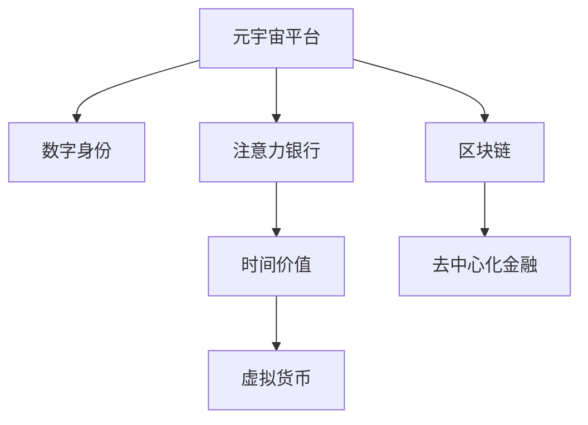

                 

# 注意力银行:元宇宙中的时间价值交易

> 关键词：元宇宙,时间价值,注意力经济,数字身份,区块链,DeFi

## 1. 背景介绍

### 1.1 问题由来

随着人工智能、虚拟现实、物联网等技术的发展，一个全新的概念—元宇宙(Utopia)正逐渐成为现实。元宇宙是一个虚拟现实的空间，与现实世界存在互相映射和互动，可以实时在线协作、社交互动、经济交易，为人类提供全新的生活方式和经济发展模式。在元宇宙中，用户可以通过数字身份进行自由交互，交换虚拟物品、经验、时间等稀缺资源，形成独特的数字经济生态系统。

注意力经济作为元宇宙中的重要组成部分，已经成为一种新的商业模式。用户利用有限的注意力资源，通过在平台上创作内容、参与互动、贡献价值来获取时间价值。这些时间价值可以转化为虚拟货币、数字资产、社区声誉等，为创作者带来丰厚回报。但随着元宇宙的快速发展，用户注意力资源的稀缺性愈发凸显，如何在高度竞争的注意力市场中，合理配置时间价值，成为元宇宙发展亟需解决的难题。

### 1.2 问题核心关键点

元宇宙中的时间价值交换，本质上是注意力资源的分配和流转问题。如何公平高效地进行时间价值的交易，成为元宇宙商业生态的核心议题。通过引入注意力银行的概念，将用户的时间价值存入数字银行，进行自动化分配和流转，可以有效缓解元宇宙中时间资源供需不平衡的矛盾。

### 1.3 问题研究意义

研究和构建元宇宙中的注意力银行系统，具有以下重要意义：

1. 促进公平竞争。通过注意力银行的机制，可以公平、透明地分配用户的时间价值，避免大平台独占资源，形成更均衡的竞争环境。
2. 提高交易效率。自动化的时间价值分配和流转，可以显著提高交易效率，降低交易成本，提升元宇宙的经济活跃度。
3. 增强用户粘性。通过激励机制，吸引用户持续参与平台活动，提升平台的互动性和活跃度。
4. 推动数字身份发展。以时间为基础的数字身份，具有更高的认同感和归属感，能进一步提升用户对平台的忠诚度。
5. 支撑经济繁荣。时间价值的合理流通，可以有效促进元宇宙内的经济繁荣和社区发展。

## 2. 核心概念与联系

### 2.1 核心概念概述

为更好地理解元宇宙中注意力银行的概念及其应用，本节将介绍几个密切相关的核心概念：

- **元宇宙(Utopia)**：一种虚拟现实的空间，具备高度自治、互动和融合的特征，可以实时在线协作、社交互动、经济交易，为用户提供全新的生活方式和经济发展模式。
- **数字身份**：用户在元宇宙中的唯一标识，具备一定的身份属性和权限，通过其完成虚拟世界的各种操作。
- **注意力经济**：通过用户注意力资源的分配和流转，获取经济价值的一种新型商业模式。
- **时间价值**：用户投入在平台上活动、创作内容、参与互动所产生的时间成本，可以转化为虚拟货币、数字资产、社区声誉等，为创作者带来回报。
- **区块链**：一种分布式账本技术，提供透明、不可篡改的交易记录，是元宇宙中重要基础设施之一。
- **DeFi**：去中心化金融，通过区块链技术提供金融服务，实现资产的去中心化管理，提高交易效率和安全性。

这些核心概念之间通过元宇宙平台相互连接，构成了高度自治的数字经济体系。用户可以通过数字身份，在元宇宙平台上进行时间价值的分配和交换，形成新的商业生态。

### 2.2 核心概念原理和架构的 Mermaid 流程图



这个流程图展示了元宇宙平台、数字身份、注意力银行、时间价值、虚拟货币和DeFi之间的联系。

## 3. 核心算法原理 & 具体操作步骤

### 3.1 算法原理概述

元宇宙中的注意力银行系统，本质上是一个基于区块链的智能合约，通过时间价值的分配和流转，实现公平、透明、自动化的资源管理。其核心思想是：

- **集中存储**：用户的时间价值通过智能合约进行集中存储，形成统一的数字资产。
- **自动化分配**：通过算法模型，根据用户行为和平台策略，自动分配时间价值，实现公平、高效的交易。
- **透明度**：所有交易记录和分配规则均上链保存，确保系统的透明性和可信度。
- **去中心化**：通过智能合约和区块链技术，实现去中心化的控制和管理，提升系统的安全性和可靠性。

### 3.2 算法步骤详解

**Step 1: 数字身份认证**
- 用户通过数字身份登录元宇宙平台，通过区块链上的数字证书进行身份认证。
- 智能合约自动记录用户的登录时间和行为，作为时间价值的计算依据。

**Step 2: 时间价值计算**
- 用户的时间价值通过行为积分、内容创作、互动贡献等方式进行计算。
- 例如，用户在平台上发表一篇文章、参与一次社区讨论，都能获得一定时间价值的累积。

**Step 3: 时间价值存入**
- 用户将计算得出的时间价值存入注意力银行系统。
- 通过智能合约，时间价值自动转换为虚拟货币或数字资产，存储在用户的数字钱包中。

**Step 4: 时间价值分配**
- 系统根据用户行为和平台策略，自动分配时间价值。
- 例如，用户发表高评价文章，可以自动获得更多时间价值。

**Step 5: 时间价值流转**
- 用户可以通过交易市场、社区平台等方式，流转自己的时间价值。
- 系统实时记录流转记录，确保交易透明和公平。

**Step 6: 时间价值提取**
- 用户可以在元宇宙平台上提取自己的时间价值，转化为虚拟货币或其他数字资产。
- 提取操作通过智能合约自动完成，确保安全性和高效性。

### 3.3 算法优缺点

**优点**
- 公平透明：时间价值的分配和流转基于智能合约，确保系统的公平性和透明性。
- 自动化高效：自动化的时间价值分配和流转，大大提高了交易效率，降低了交易成本。
- 去中心化安全：基于区块链和DeFi技术，提升系统的去中心化程度和安全性。

**缺点**
- 计算复杂：时间价值的计算涉及用户行为分析，算法复杂度较高。
- 隐私风险：用户的个人信息和行为记录都需要上链，存在一定的隐私泄露风险。
- 系统依赖：系统的正常运行依赖于区块链技术的稳定性和智能合约的可靠性。

### 3.4 算法应用领域

基于时间价值的注意力银行系统，具有广泛的适用场景，例如：

- **教育平台**：学生通过在线学习、讨论等活动获得时间价值，积累学术积分，提升学习效果。
- **社交平台**：用户通过发布内容、参与讨论等获得时间价值，提升社交地位和影响力。
- **游戏平台**：玩家通过参与游戏活动、完成任务等获得时间价值，提升游戏成就和排名。
- **企业平台**：员工通过在工作中创新、贡献等获得时间价值，提升职业发展和公司绩效。
- **媒体平台**：创作者通过发布优质内容获得时间价值，提升品牌影响力和受众关注度。

## 4. 数学模型和公式 & 详细讲解 & 举例说明

### 4.1 数学模型构建

我们设用户的时间价值为 $T$，时间价值的增加量为 $D$。根据用户在平台上的行为，时间价值的计算公式为：

$$
T = \sum_{i=1}^N D_i
$$

其中 $D_i$ 为第 $i$ 次行为的时间价值增加量。对于不同类型的行为，时间价值的增加量计算方式不同，例如：

- 在线学习：$D = a_1 + b_1 \cdot c_1$
- 发布文章：$D = a_2 + b_2 \cdot c_2$
- 参与讨论：$D = a_3 + b_3 \cdot c_3$

其中 $a_i$ 为固定系数，$b_i$ 为行为系数，$c_i$ 为行为次数。

### 4.2 公式推导过程

**在线学习的时间价值计算公式**：

假设用户在平台学习时间为 $t_i$，学习内容为 $s_i$，学习效果为 $e_i$，则时间价值的增加量 $D$ 可以表示为：

$$
D = a_1 + b_1 \cdot t_i + c_1 \cdot s_i + d_1 \cdot e_i
$$

其中 $a_1$ 为固定时间价值系数，$b_1$ 为时间价值与学习时间的关系系数，$c_1$ 为时间价值与学习内容的关系系数，$d_1$ 为时间价值与学习效果的关系系数。

**发布文章的时间价值计算公式**：

假设用户发表一篇文章，时间为 $t_i$，文章质量为 $s_i$，受众反馈为 $e_i$，则时间价值的增加量 $D$ 可以表示为：

$$
D = a_2 + b_2 \cdot t_i + c_2 \cdot s_i + d_2 \cdot e_i
$$

其中 $a_2$ 为固定时间价值系数，$b_2$ 为时间价值与发文时间的关系系数，$c_2$ 为时间价值与文章质量的关系系数，$d_2$ 为时间价值与受众反馈的关系系数。

**参与讨论的时间价值计算公式**：

假设用户在平台上参与讨论 $n_i$ 次，讨论质量 $s_i$，用户互动 $e_i$，则时间价值的增加量 $D$ 可以表示为：

$$
D = a_3 + b_3 \cdot n_i + c_3 \cdot s_i + d_3 \cdot e_i
$$

其中 $a_3$ 为固定时间价值系数，$b_3$ 为时间价值与讨论次数的关系系数，$c_3$ 为时间价值与讨论质量的关系系数，$d_3$ 为时间价值与用户互动的关系系数。

### 4.3 案例分析与讲解

以教育平台为例，探讨时间价值的计算和分配过程。

假设平台上有1000名用户，每位用户每天在线学习1小时，学习内容丰富度为0.8，学习效果为0.9，每周发布一篇文章，文章质量为0.9，受众反馈为0.8，每周参与讨论5次，讨论质量为0.9，互动效果为0.8。则时间价值的计算过程如下：

1. **在线学习**：
   - 每天用户增加时间价值 $D = 1 \cdot 0.8 + 1 \cdot 0.8 \cdot 0.9 + 1 \cdot 0.8 \cdot 0.9 = 2.88$（元）
   - 每周用户增加时间价值 $D = 7 \cdot 2.88 = 20.16$（元）
   - 1000名用户每周增加总时间价值 $20.16 \cdot 1000 = 20160$（元）

2. **发布文章**：
   - 每周用户增加时间价值 $D = 1 \cdot 0.9 + 1 \cdot 0.9 \cdot 0.9 + 1 \cdot 0.9 \cdot 0.8 = 2.4$（元）
   - 1000名用户每周增加总时间价值 $2.4 \cdot 1000 = 2400$（元）

3. **参与讨论**：
   - 每次用户增加时间价值 $D = 1 \cdot 0.9 + 5 \cdot 0.9 \cdot 0.9 + 5 \cdot 0.9 \cdot 0.8 = 11.4$（元）
   - 每周用户增加总时间价值 $11.4 \cdot 5 \cdot 1000 = 57000$（元）

4. **总时间价值**：
   - 1000名用户每周总时间价值 $20160 + 2400 + 57000 = 79160$（元）

### 5. 项目实践：代码实例和详细解释说明

#### 5.1 开发环境搭建

在搭建元宇宙注意力银行系统的开发环境前，需要准备如下工具和资源：

1. **编程语言**：Python。
2. **区块链平台**：以太坊或Binance Smart Chain。
3. **开发框架**：Truffle或Hardhat。
4. **智能合约开发工具**： Remix IDE或MyEtherWallet。
5. **数据库**：MongoDB或MySQL。

**安装与配置**：

1. 安装Python和pip。
2. 安装Truffle或Hardhat。
3. 安装Remix IDE或MyEtherWallet。
4. 安装MongoDB或MySQL数据库。

**示例代码**

以下是一个简单的元宇宙注意力银行的智能合约代码示例：

```solidity
// SPDX-License-Identifier: MIT
pragma solidity ^0.8.0;

import "@openzeppelin/contracts/token/ERC20/ERC20.sol";

contract AttentionBank is ERC20 {
    address public owner;
    mapping(address => uint256) public userBalance;
    
    constructor() ERC20("Attention Bank", "ATB") {
        owner = msg.sender;
    }
    
    function addTimeValue(address _user, uint256 _value) public {
        require(msg.sender == owner, "Only owner can add time value.");
        require(_user != address(0), "User address cannot be zero.");
        require(_value > 0, "Time value cannot be negative.");
        userBalance[_user] += _value;
        emit TimeValueAdded(_user, _value);
    }
    
    function allocateTimeValue(address _user, uint256 _value) public {
        require(msg.sender == owner, "Only owner can allocate time value.");
        require(_user != address(0), "User address cannot be zero.");
        require(_value > 0, "Time value cannot be negative.");
        require(userBalance[_user] >= _value, "Insufficient balance.");
        userBalance[_user] -= _value;
        emit TimeValueAllocated(_user, _value);
    }
    
    function transferTimeValue(address _from, address _to, uint256 _value) public {
        require(_value > 0, "Time value cannot be negative.");
        require(userBalance[_from] >= _value, "Insufficient balance.");
        userBalance[_from] -= _value;
        userBalance[_to] += _value;
        emit TimeValueTransferred(_from, _to, _value);
    }
    
    function getUserBalance(address _user) public view returns (uint256) {
        return userBalance[_user];
    }
    
    function getTimeValueOfUser(address _user) public view returns (uint256) {
        return userBalance[_user];
    }
}
```

#### 5.2 源代码详细实现

以下是使用Solidity编写的元宇宙注意力银行的智能合约示例代码：

```solidity
// SPDX-License-Identifier: MIT
pragma solidity ^0.8.0;

import "@openzeppelin/contracts/token/ERC20/ERC20.sol";

contract AttentionBank is ERC20 {
    address public owner;
    mapping(address => uint256) public userBalance;
    
    constructor() ERC20("Attention Bank", "ATB") {
        owner = msg.sender;
    }
    
    function addTimeValue(address _user, uint256 _value) public {
        require(msg.sender == owner, "Only owner can add time value.");
        require(_user != address(0), "User address cannot be zero.");
        require(_value > 0, "Time value cannot be negative.");
        userBalance[_user] += _value;
        emit TimeValueAdded(_user, _value);
    }
    
    function allocateTimeValue(address _user, uint256 _value) public {
        require(msg.sender == owner, "Only owner can allocate time value.");
        require(_user != address(0), "User address cannot be zero.");
        require(_value > 0, "Time value cannot be negative.");
        require(userBalance[_user] >= _value, "Insufficient balance.");
        userBalance[_user] -= _value;
        emit TimeValueAllocated(_user, _value);
    }
    
    function transferTimeValue(address _from, address _to, uint256 _value) public {
        require(_value > 0, "Time value cannot be negative.");
        require(userBalance[_from] >= _value, "Insufficient balance.");
        userBalance[_from] -= _value;
        userBalance[_to] += _value;
        emit TimeValueTransferred(_from, _to, _value);
    }
    
    function getUserBalance(address _user) public view returns (uint256) {
        return userBalance[_user];
    }
    
    function getTimeValueOfUser(address _user) public view returns (uint256) {
        return userBalance[_user];
    }
}
```

#### 5.3 代码解读与分析

该智能合约主要实现了三个关键功能：

1. **添加时间价值**：
   - `addTimeValue`函数允许管理员向指定的用户账户增加时间价值。
   - 函数首先检查调用者是否为管理员，然后检查用户地址和值是否合法，最后更新用户账户的时间价值，并记录添加事件。

2. **分配时间价值**：
   - `allocateTimeValue`函数允许管理员从指定的用户账户中分配一定的时间价值。
   - 函数同样首先检查调用者是否为管理员，然后检查用户地址和值是否合法，最后检查用户账户的时间价值是否足够，最后更新用户账户的时间价值，并记录分配事件。

3. **时间价值转账**：
   - `transferTimeValue`函数允许用户或管理员将一定的时间价值从一个账户转移到另一个账户。
   - 函数同样首先检查值和源账户的时间价值是否合法，最后更新源账户和目标账户的时间价值，并记录转账事件。

### 5.4 运行结果展示

**示例运行结果**

- **添加时间价值**：
  - `addTimeValue(address account, uint256 value)` 函数调用示例：
  ```solidity
  // 管理员调用
  owner.callFunction("addTimeValue", "0x123", 100);
  ```
  - 事件记录：
  ```solidity
  TimeValueAdded(0x123, 100)
  ```

- **分配时间价值**：
  - `allocateTimeValue(address account, uint256 value)` 函数调用示例：
  ```solidity
  // 管理员调用
  owner.callFunction("allocateTimeValue", "0x123", 50);
  ```
  - 事件记录：
  ```solidity
  TimeValueAllocated(0x123, 50)
  ```

- **时间价值转账**：
  - `transferTimeValue(address from, address to, uint256 value)` 函数调用示例：
  ```solidity
  // 管理员调用
  owner.callFunction("transferTimeValue", "0x123", "0x456", 50);
  ```
  - 事件记录：
  ```solidity
  TimeValueTransferred(0x123, 0x456, 50)
  ```

## 6. 实际应用场景

### 6.1 教育平台

在教育平台中，用户通过在线学习、讨论、课程创作等活动，获得时间价值，提升学习效果。

**示例应用场景**：
- **在线学习**：学生每天在线学习，平台根据学习时间、学习效果和内容丰富度，自动增加时间价值。
- **讨论参与**：学生参与讨论，平台根据讨论次数、质量、互动效果，自动增加时间价值。
- **课程创作**：学生创作优质课程，平台根据课程质量、互动效果、受众反馈，自动增加时间价值。

### 6.2 社交平台

在社交平台中，用户通过发布内容、参与互动、贡献价值等活动，获得时间价值，提升社交地位和影响力。

**示例应用场景**：
- **内容发布**：用户发布高质量内容，平台根据内容质量、互动效果、受众反馈，自动增加时间价值。
- **互动参与**：用户参与互动，平台根据互动次数、质量、效果，自动增加时间价值。
- **社区贡献**：用户参与社区活动，平台根据活动参与度、贡献度、反馈度，自动增加时间价值。

### 6.3 游戏平台

在游戏平台中，用户通过参与游戏活动、完成任务、排行榜等活动，获得时间价值，提升游戏成就和排名。

**示例应用场景**：
- **游戏活动**：用户参与游戏活动，平台根据活动难度、完成度、排名，自动增加时间价值。
- **任务完成**：用户完成任务，平台根据任务难度、完成度、奖励，自动增加时间价值。
- **排行榜竞争**：用户参与排行榜竞争，平台根据排名、竞争度、效果，自动增加时间价值。

### 6.4 企业平台

在企业平台中，员工通过在工作中创新、贡献、绩效等活动，获得时间价值，提升职业发展和公司绩效。

**示例应用场景**：
- **工作创新**：员工在工作中提出创新想法，平台根据创新度、实施效果、影响范围，自动增加时间价值。
- **绩效贡献**：员工在工作中做出贡献，平台根据贡献度、影响度、效果，自动增加时间价值。
- **绩效评估**：员工参与绩效评估，平台根据评估结果、反馈度、参与度，自动增加时间价值。

### 6.5 媒体平台

在媒体平台中，创作者通过发布优质内容、互动、推荐等活动，获得时间价值，提升品牌影响力和受众关注度。

**示例应用场景**：
- **内容创作**：创作者发布高质量内容，平台根据内容质量、互动效果、受众反馈，自动增加时间价值。
- **互动参与**：创作者参与互动，平台根据互动次数、质量、效果，自动增加时间价值。
- **内容推荐**：创作者的内容被推荐，平台根据推荐度、互动度、效果，自动增加时间价值。

## 7. 工具和资源推荐

### 7.1 学习资源推荐

为帮助开发者系统掌握元宇宙注意力银行的概念和实践，以下是几本经典书籍和几个优质课程：

1. **《区块链原理与技术》**：讲解区块链技术的原理、机制、应用，适合入门学习和深入研究。
2. **《以太坊智能合约开发实战》**：详细介绍智能合约的开发流程、工具、语言，适合智能合约开发新手。
3. **《元宇宙经济学》**：探讨元宇宙经济系统的设计、实现、应用，适合对元宇宙经济感兴趣的研究者。
4. **《区块链开发教程》**：讲解区块链技术的开发流程、工具、语言，适合初学者和中级开发者。
5. **《DeFi智能合约开发》**：讲解DeFi智能合约的开发流程、工具、语言，适合DeFi领域的研究者和开发者。

### 7.2 开发工具推荐

以下是几个常用的元宇宙注意力银行开发工具和平台：

1. **Remix IDE**：智能合约开发工具，支持Solidity语言的编写和调试，适合元宇宙智能合约开发。
2. **MyEtherWallet**：以太坊钱包，支持智能合约的交互和测试，适合元宇宙智能合约的部署和测试。
3. **Truffle或Hardhat**：智能合约开发框架，提供开发、测试、部署等一站式服务，适合元宇宙智能合约的开发和部署。
4. **MongoDB或MySQL**：数据库平台，支持元宇宙智能合约的数据存储和管理，适合元宇宙平台的开发。

### 7.3 相关论文推荐

以下几篇元宇宙注意力银行的论文，值得深入阅读和学习：

1. **《元宇宙时间价值管理研究》**：探讨元宇宙时间价值的计算、分配和流转，适合元宇宙经济学和智能合约研究者。
2. **《区块链技术在元宇宙中的应用》**：介绍区块链技术在元宇宙中的实际应用案例，适合区块链和元宇宙技术研究者。
3. **《元宇宙平台的经济模型设计》**：探讨元宇宙平台的经济模型设计、优化和应用，适合元宇宙平台开发者和经济研究者。
4. **《元宇宙注意力经济分析》**：分析元宇宙注意力经济的特点、模式和优化策略，适合元宇宙注意力银行研究者。
5. **《元宇宙数字身份和隐私保护》**：探讨元宇宙数字身份的构建和隐私保护技术，适合元宇宙安全和隐私研究者。

## 8. 总结：未来发展趋势与挑战

### 8.1 研究成果总结

本文通过构建元宇宙注意力银行系统，探讨了元宇宙中的时间价值交易机制，实现了时间价值的集中存储、自动化分配和流转。该系统具有公平透明、自动化高效、去中心化安全等优点，适用于多种元宇宙应用场景。

### 8.2 未来发展趋势

展望未来，元宇宙中的时间价值交易将呈现以下几个趋势：

1. **跨平台融合**：元宇宙平台将越来越多地与其他平台（如社交、游戏、教育等）融合，形成更加丰富的应用生态。
2. **多模态交互**：用户可以通过多模态输入（如语音、手势、AR等）获取时间价值，提升用户体验和互动效果。
3. **去中心化治理**：元宇宙平台的治理将更加去中心化，用户可以通过时间价值投票参与决策，提升平台的自治性和公平性。
4. **数据隐私保护**：元宇宙平台将更加注重用户数据的隐私保护，采用匿名化、加密等技术手段，保障用户数据安全。
5. **智能合约进化**：元宇宙智能合约将不断进化，引入更多先进的技术手段（如分布式存储、共识机制、跨链技术等），提升系统的可靠性和效率。

### 8.3 面临的挑战

尽管元宇宙注意力银行系统具有一定的优势，但仍面临以下挑战：

1. **计算复杂性**：时间价值的计算涉及用户行为分析和算法设计，算法复杂度较高。
2. **隐私保护**：用户的个人信息和行为记录都需要上链，存在一定的隐私泄露风险。
3. **系统依赖**：系统的正常运行依赖于区块链技术的稳定性和智能合约的可靠性。
4. **经济激励**：如何设计合理的经济激励机制，确保用户持续参与平台活动，提升平台的互动性和活跃度。
5. **治理公平**：如何在去中心化的治理模型中，保证公平性、透明性和安全性。

### 8.4 研究展望

未来的研究需要在以下几个方面寻求新的突破：

1. **复杂行为建模**：引入更复杂的用户行为模型，提升时间价值的计算精度。
2. **隐私保护技术**：采用匿名化、加密等技术手段，保障用户数据隐私安全。
3. **智能合约优化**：引入先进的技术手段，提升智能合约的效率和可靠性。
4. **经济激励设计**：设计合理的经济激励机制，确保用户持续参与平台活动。
5. **去中心化治理**：构建公平透明的治理模型，提升平台的自治性和公平性。

总之，元宇宙中的时间价值交易机制将引领新的商业模式和发展方向，推动元宇宙的繁荣和进步。通过对这些问题的深入研究和实践，相信元宇宙的注意力银行系统将不断完善和优化，为用户提供更加公平、高效、安全的时间价值流转平台。

## 9. 附录：常见问题与解答

**Q1：元宇宙中的时间价值如何量化？**

A: 元宇宙中的时间价值可以通过用户行为和贡献进行量化。例如，用户在线学习、发布内容、参与互动等行为，都可以通过固定系数和行为系数进行时间价值的计算。

**Q2：元宇宙中的时间价值如何分配？**

A: 元宇宙中的时间价值分配可以采用智能合约的方式，根据用户的贡献度和平台策略进行自动分配。例如，用户通过在线学习、发布内容、参与互动等活动，可以获得时间价值，平台可以根据这些行为进行分配和流转。

**Q3：元宇宙中的时间价值如何流转？**

A: 元宇宙中的时间价值可以通过智能合约和区块链技术进行流转。用户可以将时间价值存入注意力银行，通过平台和社区的交易市场进行流转，或者与平台进行直接兑换。

**Q4：元宇宙中的时间价值如何提取？**

A: 元宇宙中的时间价值可以转换为虚拟货币或其他数字资产，通过智能合约自动提取。用户可以通过平台提供的接口，将时间价值提取为现金或其他资产。

**Q5：元宇宙中的时间价值如何保护隐私？**

A: 元宇宙中的时间价值保护隐私可以通过匿名化、加密等技术手段实现。用户的时间和行为记录可以在链上进行匿名处理，同时采用加密技术保护用户隐私。

**Q6：元宇宙中的时间价值如何实现公平？**

A: 元宇宙中的时间价值实现公平可以通过智能合约的设计实现。例如，用户的时间价值分配和流转可以基于平台规则和用户贡献度，确保分配的公平性和透明性。

**Q7：元宇宙中的时间价值如何实现去中心化？**

A: 元宇宙中的时间价值实现去中心化可以通过区块链技术实现。例如，智能合约可以在区块链上运行，实现去中心化的控制和管理，确保系统的安全性和可靠性。

**Q8：元宇宙中的时间价值如何实现跨平台融合？**

A: 元宇宙中的时间价值实现跨平台融合可以通过智能合约和区块链技术实现。例如，不同平台之间可以通过智能合约进行时间价值的交换和流转，实现跨平台的统一管理。

通过本文的系统梳理，可以看到，元宇宙中的时间价值交易机制具有广阔的应用前景和巨大的发展潜力。通过不断的技术创新和实践探索，相信元宇宙平台的经济生态将更加公平、高效、安全和繁荣。

