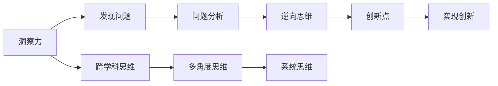

                 

# 洞察力与创新：打破常规思维的方法论

## 1. 背景介绍

### 1.1 问题由来

在当今信息爆炸、快速迭代的时代，企业需要在激烈的市场竞争中持续创新，才能保持竞争力。然而，创新往往离不开对现状的深入洞察，以及对固有思维方式的挑战。如何通过打破常规思维，挖掘新的创新点，是企业发展的重要课题。

本文将从理论到实践，探讨打破常规思维的方法论，通过多个维度的深入分析，帮助企业实现从洞察力到创新的转化。

## 2. 核心概念与联系

### 2.1 核心概念概述

打破常规思维的核心概念主要包括以下几个方面：

- **洞察力**：指通过深入观察和分析，挖掘事物本质，发现潜在问题或机遇的能力。
- **创新**：指在已有知识或产品基础上，提出新颖、独特、有价值的新概念、新技术或新方法。
- **跨学科思维**：指通过跨越不同学科的知识和视角，整合创新，打破单一思维限制。
- **逆向思维**：指从结果倒推过程，反向思考问题，寻找不同的解决方案。
- **系统思维**：指将问题放在整个系统环境中考虑，注重整体性和协同效应。
- **多角度思维**：指从多个维度、多个角度出发，全面理解问题，寻找最优解。

这些概念之间相互联系，共同构成了打破常规思维的理论基础。

### 2.2 核心概念原理和架构的 Mermaid 流程图



以上Mermaid图展示了核心概念之间的联系：洞察力通过发现问题和分析问题，与逆向思维、跨学科思维、多角度思维和系统思维相结合，最终实现创新的过程。

## 3. 核心算法原理 & 具体操作步骤

### 3.1 算法原理概述

打破常规思维的方法论，本质上是一种系统性、多维度的思维方式。其核心思想是通过跨学科、多角度、逆向等视角，全面、深入地分析和解决问题，进而发现新的创新点。

具体来说，打破常规思维的方法论可以分为以下几个步骤：

1. **洞察力挖掘**：通过深入观察和分析，挖掘问题本质。
2. **问题系统分析**：将问题置于整个系统中，考虑整体性和协同效应。
3. **跨学科思维整合**：结合不同学科的知识和视角，整合创新。
4. **逆向思维分析**：从结果倒推过程，反向思考问题，寻找不同的解决方案。
5. **多角度思维扩展**：从多个维度、多个角度出发，全面理解问题，寻找最优解。
6. **创新点实现**：通过技术、产品、服务等途径，实现创新。

### 3.2 算法步骤详解

#### 3.2.1 洞察力挖掘

洞察力的挖掘需要以下几个步骤：

1. **数据收集**：通过访谈、问卷、数据分析等方式，收集相关的背景信息。
2. **问题识别**：识别出潜在的问题或挑战。
3. **问题分类**：将问题分类，明确问题的性质和范围。
4. **洞察力构建**：通过深入分析，构建对问题的洞察力，挖掘问题的本质。

#### 3.2.2 问题系统分析

问题系统分析的目的是将问题置于整个系统中，考虑整体性和协同效应。

1. **系统环境识别**：识别与问题相关的所有系统和环境因素。
2. **系统关联分析**：分析各因素之间的关联和影响。
3. **系统优化目标**：明确系统的优化目标，确定创新的方向。
4. **系统优化策略**：设计系统优化策略，寻找最优解。

#### 3.2.3 跨学科思维整合

跨学科思维整合是通过结合不同学科的知识和视角，整合创新。

1. **学科知识获取**：获取不同学科的知识和视角。
2. **知识融合**：将不同学科的知识进行融合，形成新的知识体系。
3. **跨学科应用**：将跨学科的知识应用于实际问题中，发现新的解决方案。

#### 3.2.4 逆向思维分析

逆向思维分析是从结果倒推过程，反向思考问题，寻找不同的解决方案。

1. **结果倒推过程**：从最终目标或结果出发，反向思考问题。
2. **问题分解**：将问题分解为多个子问题，逐一解决。
3. **解决方案设计**：设计不同的解决方案，评估其可行性和效果。

#### 3.2.5 多角度思维扩展

多角度思维扩展是从多个维度、多个角度出发，全面理解问题，寻找最优解。

1. **多维度分析**：从时间、空间、情感、经济等多个维度分析问题。
2. **多角度思考**：从不同角度思考问题，发现新的解决方案。
3. **多方案比较**：比较不同方案的效果和成本，选择最优解。

#### 3.2.6 创新点实现

创新点的实现是通过技术、产品、服务等途径，将创新的想法转化为实际应用。

1. **创新点验证**：验证创新点的可行性，评估效果。
2. **创新点实现**：通过技术、产品、服务等途径，实现创新。
3. **创新点推广**：推广创新点，实现其商业价值。

### 3.3 算法优缺点

打破常规思维的方法论具有以下优点：

1. **系统性**：全面、深入地分析问题，考虑整体性和协同效应。
2. **创新性**：通过跨学科、多角度、逆向等视角，提出新颖、独特、有价值的新概念、新技术或新方法。
3. **实用性**：将创新的想法转化为实际应用，解决实际问题。

然而，该方法也存在一些缺点：

1. **复杂性**：需要多维度、多角度的深入分析，操作复杂。
2. **时间和资源消耗**：洞察力挖掘和问题分析需要大量时间和资源。
3. **跨学科难度**：需要跨学科的知识和视角，整合难度较大。

尽管存在这些局限性，但就目前而言，打破常规思维的方法论仍是最有效的创新方法之一。未来相关研究的重点在于如何进一步优化操作流程，降低时间和资源消耗，增强跨学科的整合能力。

### 3.4 算法应用领域

打破常规思维的方法论在多个领域都有广泛的应用，例如：

- **企业战略规划**：通过洞察力挖掘和系统分析，制定科学、合理的企业战略。
- **产品创新设计**：结合跨学科思维和多角度思维，设计出创新产品。
- **流程优化**：通过逆向思维和系统分析，优化业务流程，提升效率。
- **市场营销**：通过多角度思维和创新实现，制定有效的市场策略。
- **研发创新**：结合跨学科思维和创新点实现，推进技术创新。

## 4. 数学模型和公式 & 详细讲解 & 举例说明

### 4.1 数学模型构建

打破常规思维的方法论可以抽象为一个多维度、多目标的优化问题，其数学模型可以表示为：

$$
\begin{aligned}
&\min_{x} \sum_{i} w_i f_i(x) \\
&\text{s.t.} \\
&g_i(x) \leq 0, \quad i = 1, \ldots, m \\
&h_i(x) = 0, \quad i = 1, \ldots, p
\end{aligned}
$$

其中，$f_i(x)$ 表示第 $i$ 个目标函数，$g_i(x)$ 表示不等式约束，$h_i(x)$ 表示等式约束。

### 4.2 公式推导过程

以企业战略规划为例，其数学模型可以表示为：

1. **目标函数**：
   $$
   \max_{\theta} \sum_{i} w_i R_i(\theta)
   $$
   其中，$\theta$ 表示企业的战略参数，$R_i(\theta)$ 表示第 $i$ 个指标的收益，$w_i$ 表示指标的权重。

2. **约束条件**：
   $$
   \begin{aligned}
   &g_1(\theta) = \text{市场需求} - \text{供给量} \leq 0 \\
   &g_2(\theta) = \text{利润} - \text{成本} \leq 0 \\
   &g_3(\theta) = \text{客户满意度} - \text{目标值} \leq 0
   \end{aligned}
   $$
   其中，$g_i(\theta)$ 表示第 $i$ 个约束条件。

3. **求解**：
   使用线性规划等优化方法求解目标函数的最大值，同时满足所有约束条件。

### 4.3 案例分析与讲解

以一家互联网企业的市场营销策略为例，该企业的目标是提高产品销量和品牌知名度。

1. **洞察力挖掘**：通过市场调研和数据分析，发现产品销量受用户偏好和竞争对手影响较大。
2. **问题系统分析**：将问题置于整个市场营销系统中，考虑用户偏好、竞争对手、市场趋势等因素。
3. **跨学科思维整合**：结合心理学、市场学、数据科学等多个学科的知识，设计出多角度的市场营销策略。
4. **逆向思维分析**：从提高销量和品牌知名度的目标出发，反向思考问题，设计出不同的营销方案。
5. **多角度思维扩展**：从用户行为、市场趋势、竞争对手等多个角度分析问题，全面理解市场营销策略。
6. **创新点实现**：通过社交媒体营销、KOL合作、精准广告投放等方式，实现市场营销创新。

## 5. 项目实践：代码实例和详细解释说明

### 5.1 开发环境搭建

为了进行打破常规思维的方法论实践，首先需要搭建好开发环境。以下是使用Python进行开发的开发环境配置流程：

1. 安装Python：从官网下载并安装Python，选择合适的版本，如3.7或3.8。
2. 安装相关库：使用pip安装必要的库，如numpy、pandas、scipy等。
3. 设置开发工具：安装Visual Studio Code等开发工具，配置自动补全、调试等功能。

### 5.2 源代码详细实现

以下是使用Python进行市场调研分析的代码实现：

```python
import pandas as pd
import numpy as np
import matplotlib.pyplot as plt

# 读取数据
data = pd.read_csv('market_research_data.csv')

# 数据清洗
data = data.dropna()
data = data.drop_duplicates()

# 统计分析
mean_age = np.mean(data['age'])
mean_income = np.mean(data['income'])
std_age = np.std(data['age'])
std_income = np.std(data['income'])

# 可视化分析
plt.hist(data['age'], bins=10)
plt.title('Age Distribution')
plt.xlabel('Age')
plt.ylabel('Count')
plt.show()

plt.hist(data['income'], bins=10)
plt.title('Income Distribution')
plt.xlabel('Income')
plt.ylabel('Count')
plt.show()

# 回归分析
from sklearn.linear_model import LinearRegression
from sklearn.metrics import r2_score

X = data[['age', 'income']]
y = data['sales']

model = LinearRegression()
model.fit(X, y)

y_pred = model.predict(X)
r2 = r2_score(y, y_pred)

print(f'R^2 Score: {r2}')
```

以上代码展示了如何通过Python进行市场调研数据的统计分析和可视化分析，并使用线性回归模型进行预测分析。

### 5.3 代码解读与分析

**数据读取和清洗**：
- `pd.read_csv`：使用pandas库的`read_csv`函数读取CSV文件。
- `dropna`和`drop_duplicates`：使用pandas库的`dropna`和`drop_duplicates`函数进行数据清洗。

**统计分析**：
- `np.mean`和`np.std`：使用numpy库的`mean`和`std`函数进行统计分析。

**可视化分析**：
- `plt.hist`：使用matplotlib库的`hist`函数进行数据可视化分析。

**回归分析**：
- `LinearRegression`：使用scikit-learn库的`LinearRegression`类进行线性回归分析。
- `r2_score`：使用scikit-learn库的`r2_score`函数计算回归模型的R^2 Score。

### 5.4 运行结果展示

运行以上代码，可以得到以下结果：

- 年龄和收入的直方图，展示了不同年龄段和收入水平的分布情况。
- 回归分析的结果，展示了年龄和收入对产品销量的预测效果。

## 6. 实际应用场景

### 6.1 企业战略规划

企业战略规划是打破常规思维方法论的重要应用场景。通过系统分析和跨学科整合，企业可以制定科学、合理的战略规划，提升整体竞争力。

具体而言，企业可以通过以下步骤进行战略规划：

1. **洞察力挖掘**：通过市场调研和数据分析，挖掘市场机会和潜在问题。
2. **问题系统分析**：将问题置于整个企业环境中，考虑内部资源、外部环境等因素。
3. **跨学科思维整合**：结合战略学、管理学、经济学等多个学科的知识，整合创新。
4. **逆向思维分析**：从实现企业目标出发，反向思考问题，设计出不同的战略方案。
5. **多角度思维扩展**：从多个维度、多个角度分析问题，全面理解战略方案。
6. **创新点实现**：通过技术、产品、服务等途径，实现战略创新。

### 6.2 产品创新设计

产品创新设计是打破常规思维方法论的重要应用场景。通过跨学科思维和多角度思维，企业可以设计出创新产品，满足用户需求。

具体而言，企业可以通过以下步骤进行产品创新设计：

1. **洞察力挖掘**：通过用户调研和数据分析，挖掘用户需求和产品痛点。
2. **问题系统分析**：将问题置于整个产品设计环境中，考虑技术、市场、用户等因素。
3. **跨学科思维整合**：结合工业设计、材料科学、人机工程等多个学科的知识，整合创新。
4. **逆向思维分析**：从实现用户需求出发，反向思考问题，设计出不同的产品方案。
5. **多角度思维扩展**：从多个维度、多个角度分析问题，全面理解产品设计。
6. **创新点实现**：通过技术、材料、设计等途径，实现产品创新。

### 6.3 流程优化

流程优化是打破常规思维方法论的重要应用场景。通过逆向思维和系统分析，企业可以优化业务流程，提升效率。

具体而言，企业可以通过以下步骤进行流程优化：

1. **洞察力挖掘**：通过流程分析和管理数据分析，挖掘流程瓶颈和问题。
2. **问题系统分析**：将问题置于整个业务流程中，考虑流程、人员、设备等因素。
3. **逆向思维分析**：从提高效率和质量出发，反向思考问题，设计出不同的流程改进方案。
4. **多角度思维扩展**：从多个维度、多个角度分析问题，全面理解流程改进方案。
5. **创新点实现**：通过技术、管理、培训等途径，实现流程创新。

### 6.4 市场营销

市场营销是打破常规思维方法论的重要应用场景。通过多角度思维和创新实现，企业可以制定有效的市场策略，提升品牌知名度和市场份额。

具体而言，企业可以通过以下步骤进行市场营销：

1. **洞察力挖掘**：通过市场调研和数据分析，挖掘市场机会和用户偏好。
2. **问题系统分析**：将问题置于整个市场营销环境中，考虑市场、竞争、渠道等因素。
3. **跨学科思维整合**：结合市场学、心理学、数据科学等多个学科的知识，整合创新。
4. **逆向思维分析**：从提高销量和品牌知名度出发，反向思考问题，设计出不同的营销方案。
5. **多角度思维扩展**：从多个维度、多个角度分析问题，全面理解市场营销策略。
6. **创新点实现**：通过社交媒体营销、KOL合作、精准广告投放等方式，实现市场营销创新。

## 7. 工具和资源推荐

### 7.1 学习资源推荐

为了帮助开发者系统掌握打破常规思维的方法论，这里推荐一些优质的学习资源：

1. **《系统思维：现代组织设计的原则与实践》**：介绍系统思维的理论基础和应用案例，适合系统分析和流程优化的学习。
2. **《创新者的窘境：突破性的商业创新》**：分析创新失败的原因，提供突破性创新的方法和案例，适合市场营销和产品设计的学习。
3. **《逆向思维：如何打破常规思维的藩篱》**：介绍逆向思维的原理和应用案例，适合技术优化和流程改进的学习。
4. **《跨学科思维：整合不同领域的创新》**：介绍跨学科思维的理论基础和应用案例，适合战略规划和市场营销的学习。
5. **《多角度思维：解决复杂问题的策略》**：介绍多角度思维的理论基础和应用案例，适合问题分析和创新实现的学习。

### 7.2 开发工具推荐

高效的开发离不开优秀的工具支持。以下是几款用于打破常规思维方法论开发的常用工具：

1. **Python**：基于Python的编程语言，功能强大，灵活性高，适合数据分析和模型实现。
2. **Jupyter Notebook**：开源的交互式编程环境，支持代码编写、数据展示、模型分析等功能。
3. **TensorFlow**：谷歌开发的深度学习框架，支持大规模模型训练和部署，适合技术创新和学习。
4. **Scikit-learn**：基于Python的机器学习库，支持多种算法和模型实现，适合数据分析和优化。
5. **Tableau**：商业智能工具，支持数据可视化和分析，适合数据挖掘和决策支持。

### 7.3 相关论文推荐

打破常规思维方法论的研究源于学界的持续研究。以下是几篇奠基性的相关论文，推荐阅读：

1. **《打破常规：创新者的心理学》**：通过心理学的视角，分析创新失败的原因和创新成功的方法。
2. **《系统思考：整合思考的艺术》**：介绍系统思维的理论基础和应用案例，适合系统分析和流程优化的研究。
3. **《跨学科思维：整合不同领域的创新》**：通过跨学科的视角，分析跨学科整合创新的方法和案例。
4. **《逆向思维：从结果到过程的创新》**：通过逆向思维的视角，分析逆向思考问题和设计方案的方法。
5. **《多角度思维：解决复杂问题的策略》**：通过多角度的视角，分析多角度分析问题和设计方案的方法。

这些论文代表了大语言模型微调技术的发展脉络。通过学习这些前沿成果，可以帮助研究者把握学科前进方向，激发更多的创新灵感。

## 8. 总结：未来发展趋势与挑战

### 8.1 总结

本文对打破常规思维的方法论进行了全面系统的介绍。首先阐述了打破常规思维的核心概念和理论基础，明确了其系统性、创新性和实用性的特点。其次，从理论到实践，详细讲解了打破常规思维的方法论，通过多个维度的深入分析，帮助企业实现从洞察力到创新的转化。

通过本文的系统梳理，可以看到，打破常规思维的方法论正在成为企业创新的一个重要工具，广泛应用于战略规划、产品设计、流程优化、市场营销等多个领域。通过跨学科、多角度、逆向等视角，全面、深入地分析和解决问题，企业可以发现新的创新点，提升整体竞争力。

### 8.2 未来发展趋势

展望未来，打破常规思维的方法论将呈现以下几个发展趋势：

1. **智能化**：通过引入人工智能和大数据技术，打破常规思维的过程将更加智能化、自动化。
2. **多样化**：随着不同学科和领域的发展，打破常规思维的方法论将更加多样化、多学科化。
3. **全球化**：打破常规思维的方法论将更加全球化，应用于国际市场和全球化业务。
4. **人性化**：打破常规思维的方法论将更加人性化，关注用户体验和员工福祉。
5. **可持续化**：打破常规思维的方法论将更加注重可持续性，推动绿色创新和可持续发展。

以上趋势凸显了打破常规思维方法论的广阔前景。这些方向的探索发展，必将进一步提升企业的创新能力，推动企业在全球市场中的竞争力和影响力。

### 8.3 面临的挑战

尽管打破常规思维方法论已经取得了显著成就，但在迈向更加智能化、多学科化、全球化应用的过程中，它仍面临诸多挑战：

1. **复杂性**：打破常规思维的过程需要多维度、多角度的深入分析，操作复杂。
2. **时间和资源消耗**：洞察力挖掘和问题分析需要大量时间和资源。
3. **跨学科难度**：需要跨学科的知识和视角，整合难度较大。
4. **文化和认知差异**：不同组织和团队可能存在文化和认知差异，导致难以达成共识。
5. **技术和工具限制**：现有技术和工具可能无法满足复杂问题分析和解决的需求。
6. **创新管理难度**：创新项目的风险和不确定性较高，需要有效的管理机制。

尽管存在这些挑战，但通过不断优化操作流程，增强跨学科整合能力，提高技术工具的智能化水平，打破常规思维的方法论仍将在企业创新中发挥重要作用。

### 8.4 研究展望

面向未来，打破常规思维方法论的研究需要在以下几个方面寻求新的突破：

1. **智能化技术应用**：通过引入人工智能和大数据技术，优化分析过程，提高智能化水平。
2. **多学科整合能力**：通过跨学科的视角，整合不同领域的知识和视角，提升整合能力。
3. **全球化应用**：将打破常规思维的方法论应用于全球化业务和国际市场，提升全球竞争力。
4. **持续学习**：通过持续学习和自我更新，保持方法和工具的先进性和前沿性。
5. **创新管理机制**：建立有效的创新管理机制，降低创新风险，提高创新成功率。

这些方向的研究和实践，必将引领打破常规思维方法论迈向更高的台阶，为企业的创新提供更加全面、高效、实用的支持。

## 9. 附录：常见问题与解答

**Q1：打破常规思维的方法论是否适用于所有领域？**

A: 打破常规思维的方法论在多个领域都有广泛的应用，特别是对于创新需求较高的领域，如科技、医药、金融等。但对于一些固化的、流程化的领域，可能不需要使用该方法论。

**Q2：如何选择合适的跨学科整合视角？**

A: 选择合适的跨学科整合视角需要根据具体问题和领域进行选择。一般来说，需要根据问题的本质和特点，选择与其相关性最高的学科。例如，在市场营销中，可以选择市场学、心理学、数据科学等多个学科进行整合。

**Q3：如何应对跨学科整合的难度？**

A: 应对跨学科整合的难度，可以从以下几个方面入手：
1. 建立跨学科团队：组建不同学科背景的团队，共同解决问题。
2. 使用跨学科方法：使用跨学科的方法和工具，整合不同学科的知识。
3. 引入外脑专家：引入外部专家进行指导和咨询，提供新的视角和思路。

**Q4：如何评估创新点实现的可行性和效果？**

A: 评估创新点实现的可行性和效果，可以从以下几个方面入手：
1. 实验验证：通过实验和测试，验证创新点的可行性和效果。
2. 数据分析：通过数据分析，评估创新点的实际效果和影响。
3. 用户反馈：通过用户反馈，了解创新点的实际效果和用户体验。

**Q5：打破常规思维的方法论是否适合小团队使用？**

A: 打破常规思维的方法论可以应用于小团队，但需要根据团队规模和资源进行选择。一般来说，对于创新需求较高的团队，打破常规思维的方法论可以显著提升创新效率和效果。

---

作者：禅与计算机程序设计艺术 / Zen and the Art of Computer Programming

