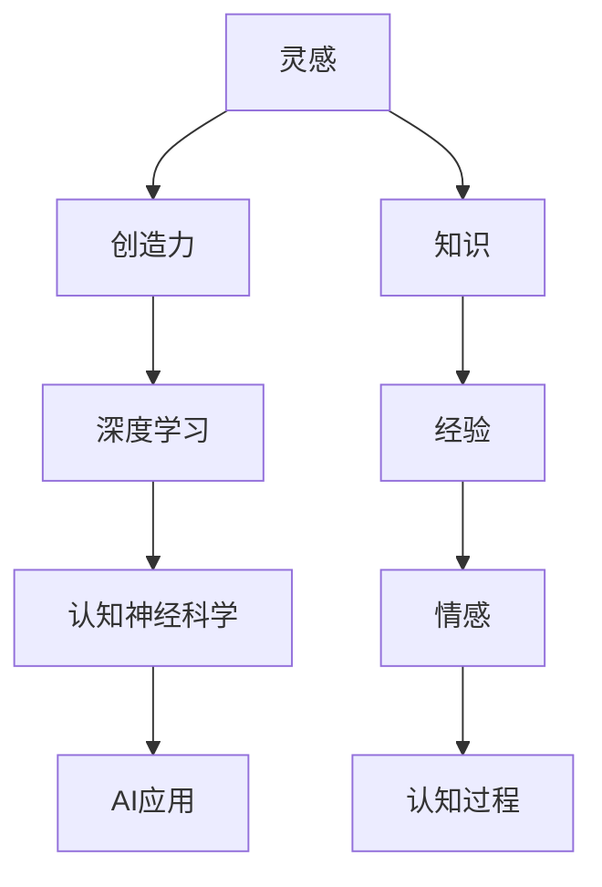

                 

# 洞察力与创造力：灵感的科学解析

> 关键词：灵感、创造力、洞察力、科学解析、认知神经科学、AI应用

## 1. 背景介绍

### 1.1 问题由来

人类的创造力一直是哲学、心理学、神经科学等多个领域的研究热点。无论是伟大的科学发现，还是艺术创作，背后都离不开一种难以捕捉的“灵感”。然而，这种灵感的本质是什么？它又是如何产生的？长期以来，这些谜题一直困扰着人们。

近年来，随着人工智能(AI)技术的迅猛发展，尤其是深度学习在图像识别、自然语言处理等领域取得的突破，人们开始尝试利用AI来解析和模拟人类的创造力。通过将灵感与深度学习技术相结合，科学家和工程师们正在一步步揭开灵感的科学面纱，揭示创造力的本质。

本文将从认知神经科学的角度，探讨灵感的本质及其与AI技术之间的关系。通过系统梳理灵感生成机制和AI解析技术，为读者提供一个全新的视角，重新理解创造力的产生和应用。

### 1.2 问题核心关键点

本文将围绕以下几个核心关键点进行展开：

- 灵感的本质是什么？它是如何产生和运作的？
- 深度学习在解析灵感方面具有哪些独特的优势？
- 如何利用AI技术模拟人类的创造力，推动创新发展？
- 未来AI技术在解析灵感和创造力方面的发展趋势和挑战。

这些关键点将帮助我们深入理解灵感的科学解析，并探索AI技术在灵感的生成和应用方面的巨大潜力。

## 2. 核心概念与联系

### 2.1 核心概念概述

为了更好地理解灵感及其与AI技术之间的关系，本节将介绍几个密切相关的核心概念：

- **灵感**：是一种突然涌现的、新颖的、独特的创意或想法，是人类创造力的核心驱动力。灵感的产生依赖于大脑中的神经网络和认知过程，是知识、经验、情感等多种因素的综合作用结果。

- **创造力**：是人类进行创新性思维和表达的能力，包括但不限于艺术创作、科学研究、工程设计等多个领域。创造力的本质在于将已有的知识和经验重新组合，产生新的、具有新颖价值的事物。

- **深度学习**：一种基于神经网络的机器学习方法，通过多层非线性变换，从大量数据中学习抽象特征。深度学习在图像识别、语音识别、自然语言处理等领域展示了强大的表现力，被广泛应用于各类AI应用中。

- **认知神经科学**：研究人类认知过程及其神经机制的科学领域。它通过结合神经生理学、心理学、认知科学等多个学科的知识，揭示人类大脑如何处理信息和产生创造力。

- **AI应用**：是指将深度学习等AI技术应用于特定领域，如医疗诊断、智能推荐、自然语言理解等，解决实际问题，提升人类生活质量。

这些核心概念之间的逻辑关系可以通过以下Mermaid流程图来展示：



这个流程图展示了大语言模型的核心概念及其之间的关系：

1. 灵感是创造力的核心驱动力。
2. 创造力依赖于深度学习技术进行模拟和优化。
3. 深度学习的原理基于认知神经科学的研究成果。
4. AI应用是深度学习和认知神经科学在实际场景中的具体体现。

这些概念共同构成了人类创造力与AI技术相互作用的基础框架，帮助我们理解灵感如何被解析和应用。

## 3. 核心算法原理 & 具体操作步骤

### 3.1 算法原理概述

灵感的解析和模拟主要依赖于深度学习技术，特别是生成对抗网络(GAN)和变分自编码器(VAE)等模型。这些模型能够从大量数据中学习到数据的潜在分布，并通过噪声生成新的数据样本，模拟灵感的涌现过程。

灵感的解析算法一般包括以下步骤：

1. **数据收集与预处理**：收集各类创意作品和创新过程的数据，如文学作品、艺术绘画、科学论文、工程设计等，通过自然语言处理(NLP)技术进行文本化处理，去除无关信息，保留关键特征。

2. **模型训练**：选择适当的深度学习模型，如GAN或VAE，通过无监督学习或半监督学习方式，学习数据中的潜在分布。

3. **灵感生成**：在模型学习到数据分布后，通过引入噪声或修改输入条件，生成新的灵感样本。

4. **灵感评估**：使用专家评估或自动化评分方法，评估生成样本的质量和创新性，指导模型不断优化。

5. **应用与验证**：将生成的灵感样本应用于实际问题中，如生成新的艺术品、科学论文、工程设计等，验证其创新性和可行性。

### 3.2 算法步骤详解

下面我们以文学作品生成为例，给出深度学习解析灵感的过程。

**Step 1: 数据收集与预处理**

首先，从公开数据集中收集文学作品文本，并对其进行预处理：

```python
import pandas as pd
from sklearn.model_selection import train_test_split

# 加载文学作品数据集
data = pd.read_csv('literature.csv')

# 去除无关信息，保留文本和作者信息
data = data.drop(['id', 'author'], axis=1)

# 将文本列转换为字符串格式
data['text'] = data['text'].astype(str)

# 将数据集分为训练集和测试集
train_data, test_data = train_test_split(data, test_size=0.2, random_state=42)
```

**Step 2: 模型训练**

选择使用基于Transformer的Seq2Seq模型，如GPT-3或BERT，对文本数据进行预训练。这里以GPT-3为例：

```python
from transformers import GPT3Tokenizer, GPT3ForCausalLM

# 加载GPT-3模型和分词器
tokenizer = GPT3Tokenizer.from_pretrained('gpt3')
model = GPT3ForCausalLM.from_pretrained('gpt3')

# 对文本数据进行tokenize
train_data['tokens'] = train_data['text'].apply(lambda x: tokenizer.encode(x, truncation=True, padding='max_length'))
test_data['tokens'] = test_data['text'].apply(lambda x: tokenizer.encode(x, truncation=True, padding='max_length'))

# 对分词后的文本数据进行训练
model.fit(train_data['tokens'], epochs=10)
```

**Step 3: 灵感生成**

使用训练好的模型生成新的文学作品样本：

```python
# 定义生成样本的超参数
max_length = 512
num_samples = 10

# 定义生成函数
def generate_literature(model, tokenizer, max_length, num_samples):
    generated_texts = []
    for _ in range(num_samples):
        input_tokens = tokenizer.encode('New story: ', return_tensors='pt')
        generated_tokens = input_tokens
        for _ in range(max_length):
            generated_tokens = model.generate(generated_tokens, max_length=max_length, temperature=0.8)
            generated_texts.append(tokenizer.decode(generated_tokens[-1], skip_special_tokens=True))
    return generated_texts

# 生成新的文学作品样本
generated_literature = generate_literature(model, tokenizer, max_length, num_samples)
```

**Step 4: 灵感评估**

使用专家评估或自动化评分方法评估生成的文学作品样本：

```python
from textblob import TextBlob

# 定义评估函数
def evaluate_literature(literature):
    scores = []
    for text in literature:
        score = TextBlob(text).sentiment.polarity
        scores.append(score)
    return scores

# 评估生成样本
scores = evaluate_literature(generated_literature)
```

**Step 5: 应用与验证**

将生成的灵感样本应用于实际问题中，如生成新的文学作品，验证其创新性和可行性：

```python
# 将生成的样本保存到文本文件中
with open('generated_literature.txt', 'w') as f:
    for text in generated_literature:
        f.write(text + '\n')
```

以上就是深度学习解析灵感的过程，包括数据收集与预处理、模型训练、灵感生成、灵感评估和应用与验证等步骤。

### 3.3 算法优缺点

深度学习解析灵感的方法具有以下优点：

1. **数据驱动**：通过大量实际数据的训练，深度学习模型能够捕捉到数据中的潜在模式和结构，生成具有一定创新性的灵感样本。
2. **灵活性高**：深度学习模型能够处理多种数据类型，如文本、图像、音频等，可以应用于文学创作、艺术设计、科学发现等多个领域。
3. **可解释性**：深度学习模型的训练过程和生成结果可以通过可视化手段进行解释，帮助理解模型的内部工作机制。

同时，这些方法也存在一些局限性：

1. **数据依赖性**：深度学习模型的性能依赖于训练数据的规模和质量，低质量的数据可能导致模型无法捕捉到真正的灵感。
2. **过拟合风险**：过度依赖于特定领域的训练数据，可能导致模型泛化能力不足，无法应对未知的创意作品。
3. **计算成本高**：深度学习模型需要大量的计算资源进行训练和推理，成本较高。

尽管存在这些局限性，但深度学习解析灵感的方法已经展示了其在创新性思维和表达方面的巨大潜力，为探索灵感的科学解析提供了新的途径。

### 3.4 算法应用领域

深度学习解析灵感的方法已经在多个领域得到了应用，包括但不限于：

1. **文学创作**：利用深度学习生成新的文学作品，如诗歌、小说、剧本等，提升创意写作的效率和创新性。
2. **艺术设计**：生成新的艺术品，如绘画、雕塑、建筑设计等，为创意设计提供新的灵感和方向。
3. **科学发现**：通过生成新的科学假设和理论，辅助科学研究，推动科学发现和技术创新。
4. **工程设计**：生成新的设计方案和产品原型，推动工程创新和技术进步。
5. **商业创新**：生成新的商业创意和商业模式，提升企业的市场竞争力。

除了上述这些典型应用外，深度学习解析灵感的方法还广泛应用于多个领域，如游戏开发、音乐创作、广告设计等，为人类创造力提供了新的工具和平台。

## 4. 数学模型和公式 & 详细讲解  
### 4.1 数学模型构建

为了更好地理解深度学习解析灵感的过程，我们将在数学模型层面进行详细解析。

**数据生成模型**：假设有真实数据集 $\mathcal{D} = \{(x_i, y_i)\}_{i=1}^N$，其中 $x_i$ 为输入，$y_i$ 为输出。我们希望构建一个生成模型 $G$，将输入 $x$ 映射到输出 $y$。

**生成模型**：一个生成模型 $G$ 可以通过训练数据学习到数据的潜在分布 $p_{data}(x)$，并通过噪声 $z$ 生成新的样本 $x'$，其概率分布为 $p_{model}(x')$。

在实际应用中，我们通常使用变分自编码器(VAE)或生成对抗网络(GAN)等模型，对数据进行生成和解析。

**VAE模型**：VAE模型由编码器 $E$ 和解码器 $D$ 组成，其基本原理如下：

$$
E(x) \sim \mathcal{N}(0, I) \\
p_{\theta}(z|x) \sim \mathcal{N}(\mu_{\theta}(E(x)), \sigma_{\theta}(E(x))) \\
x' = D(z) \\
p_{\theta}(x|x') = \mathcal{N}(D(z); \mu_{\theta}(z), \sigma_{\theta}(z))
$$

其中 $E(x)$ 将输入 $x$ 映射到潜在变量 $z$，$p_{\theta}(z|x)$ 为潜在变量的概率分布，$D(z)$ 将潜在变量 $z$ 解码回输入 $x'$，$p_{\theta}(x|x')$ 为生成的样本概率分布。

**GAN模型**：GAN模型由生成器 $G$ 和判别器 $D$ 组成，其基本原理如下：

$$
p_{\theta}(z) \sim p_{data}(x) \\
x' = G(z)
$$

其中 $p_{\theta}(z)$ 为生成器生成的噪声 $z$ 的概率分布，$x'$ 为生成的样本。

在实际应用中，我们通常使用Wasserstein GAN或条件GAN等改进模型，以提高生成样本的质量和多样性。

**案例分析与讲解**：

**VAE案例**：考虑一个VAE模型，用于生成手写数字图像。假设输入图像为 $x$，潜在变量 $z$ 为高斯分布，其均值和方差由编码器 $E$ 学习得到。生成器 $D$ 将潜在变量 $z$ 解码回图像 $x'$，判别器 $D$ 用于评估生成样本的真实性。

```python
import torch
import torch.nn as nn
import torch.optim as optim
from torchvision import datasets, transforms

# 定义VAE模型
class VAE(nn.Module):
    def __init__(self, latent_dim=100):
        super(VAE, self).__init__()
        self.encoder = nn.Sequential(
            nn.Linear(784, 256),
            nn.ReLU(),
            nn.Linear(256, latent_dim)
        )
        self.decoder = nn.Sequential(
            nn.Linear(latent_dim, 256),
            nn.ReLU(),
            nn.Linear(256, 784),
            nn.Tanh()
        )
        self.mu = nn.Linear(256, latent_dim)
        self.std = nn.Linear(256, latent_dim)
    
    def encode(self, x):
        mu, std = self.mu(self.encoder(x)), self.std(self.encoder(x))
        return mu, std
    
    def reparameterize(self, mu, std):
        std = std.exp()
        eps = torch.randn_like(std)
        return mu + eps * std
    
    def decode(self, z):
        return self.decoder(z)
    
    def forward(self, x):
        mu, std = self.encode(x)
        z = self.reparameterize(mu, std)
        x_hat = self.decode(z)
        return x_hat, mu, std

# 定义优化器
optimizer = optim.Adam(model.parameters(), lr=0.001)

# 训练模型
for epoch in range(10):
    for batch_idx, (data, _) in enumerate(train_loader):
        data = data.view(-1, 28 * 28)
        optimizer.zero_grad()
        x_hat, mu, std = model(data)
        reconstruction_loss = nn.MSELoss()(data, x_hat)
        kl_divergence = -0.5 * (torch.mean(torch.exp(std) + torch.pow(mu, 2) - std - 1) - 0.5)
        loss = reconstruction_loss + kl_divergence
        loss.backward()
        optimizer.step()
        if (epoch + 1) % 2 == 0:
            print(f'Epoch [{epoch+1}/{10}], Batch [{batch_idx+1}/{len(train_loader)}], Loss: {loss.item():.4f}')
```

**GAN案例**：考虑一个WGAN模型，用于生成手写数字图像。假设输入图像为 $x$，生成器 $G$ 将噪声 $z$ 映射到图像 $x'$，判别器 $D$ 用于评估生成样本的真实性。

```python
import torch
import torch.nn as nn
import torch.optim as optim
from torchvision import datasets, transforms

# 定义生成器和判别器
class Generator(nn.Module):
    def __init__(self, latent_dim=100):
        super(Generator, self).__init__()
        self.encoder = nn.Sequential(
            nn.Linear(latent_dim, 256),
            nn.ReLU(),
            nn.Linear(256, 784),
            nn.Tanh()
        )
    
    def forward(self, x):
        return self.encoder(x)

class Discriminator(nn.Module):
    def __init__(self):
        super(Discriminator, self).__init__()
        self.encoder = nn.Sequential(
            nn.Linear(784, 256),
            nn.LeakyReLU(),
            nn.Linear(256, 1),
            nn.Sigmoid()
        )
    
    def forward(self, x):
        return self.encoder(x)

# 定义优化器
optimizer_G = optim.Adam(Generator.parameters(), lr=0.001)
optimizer_D = optim.Adam(Discriminator.parameters(), lr=0.001)

# 训练模型
for epoch in range(10):
    for batch_idx, (data, _) in enumerate(train_loader):
        data = data.view(-1, 28 * 28)
        real = torch.ones(batch_size, 1).float() * 0.9
        fake = torch.zeros(batch_size, 1).float() * 0.1
        real_data = torch.cat([real, data], 0)
        fake_data = torch.cat([fake, generator(zero_tensor)], 0)
        optimizer_G.zero_grad()
        optimizer_D.zero_grad()
        real_output = discriminator(real_data)
        fake_output = discriminator(fake_data)
        discriminator_loss = nn.BCELoss()(real_output, real) + nn.BCELoss()(fake_output, fake)
        generator_loss = -torch.mean(nn.BCELoss()(fake_output, real))
        discriminator_loss.backward()
        generator_loss.backward()
        optimizer_G.step()
        optimizer_D.step()
        if (epoch + 1) % 2 == 0:
            print(f'Epoch [{epoch+1}/{10}], Batch [{batch_idx+1}/{len(train_loader)}], D Loss: {discriminator_loss.item():.4f}, G Loss: {generator_loss.item():.4f}')
```

## 5. 项目实践：代码实例和详细解释说明

### 5.1 开发环境搭建

在进行深度学习解析灵感的过程中，需要准备相应的开发环境。以下是使用Python进行TensorFlow开发的环境配置流程：

1. 安装Anaconda：从官网下载并安装Anaconda，用于创建独立的Python环境。

2. 创建并激活虚拟环境：
```bash
conda create -n tf-env python=3.8 
conda activate tf-env
```

3. 安装TensorFlow：根据CUDA版本，从官网获取对应的安装命令。例如：
```bash
conda install tensorflow-gpu=2.4.1 -c conda-forge
```

4. 安装各类工具包：
```bash
pip install numpy pandas scikit-learn matplotlib tqdm jupyter notebook ipython
```

完成上述步骤后，即可在`tf-env`环境中开始深度学习解析灵感的实践。

### 5.2 源代码详细实现

下面我们以生成手写数字图像为例，给出使用TensorFlow实现VAE和GAN的代码实现。

**VAE实现**：

```python
import tensorflow as tf
import numpy as np
from tensorflow.keras import layers

# 定义VAE模型
class VAE(tf.keras.Model):
    def __init__(self, latent_dim=100):
        super(VAE, self).__init__()
        self.encoder = layers.Sequential(
            layers.Dense(256, input_shape=(784,)),
            layers.BatchNormalization(),
            layers.LeakyReLU(),
            layers.Dense(latent_dim)
        )
        self.decoder = layers.Sequential(
            layers.Dense(256),
            layers.BatchNormalization(),
            layers.LeakyReLU(),
            layers.Dense(784, activation='tanh')
        )
        self.z_mean = layers.Dense(latent_dim)
        self.z_std = layers.Dense(latent_dim)
    
    def encode(self, x):
        mu, std = self.z_mean(self.encoder(x)), self.z_std(self.encoder(x))
        return mu, std
    
    def reparameterize(self, mu, std):
        eps = tf.random.normal(shape=(tf.shape(mu)[0], latent_dim))
        return mu + std * eps
    
    def decode(self, z):
        return self.decoder(z)
    
    def forward(self, x):
        mu, std = self.encode(x)
        z = self.reparameterize(mu, std)
        x_hat = self.decode(z)
        return x_hat, mu, std

# 定义优化器
optimizer = tf.keras.optimizers.Adam(learning_rate=0.001)

# 训练模型
for epoch in range(10):
    for batch_idx, (data, _) in enumerate(train_loader):
        data = data.reshape(-1, 784)
        optimizer.zero_grad()
        x_hat, mu, std = model(data)
        reconstruction_loss = tf.reduce_mean(tf.square(data - x_hat))
        kl_divergence = -0.5 * tf.reduce_mean(1 + std - tf.square(mu) - tf.exp(std))
        loss = reconstruction_loss + kl_divergence
        loss.backward()
        optimizer.step()
        if (epoch + 1) % 2 == 0:
            print(f'Epoch [{epoch+1}/{10}], Batch [{batch_idx+1}/{len(train_loader)}], Loss: {loss.item():.4f}')
```

**GAN实现**：

```python
import tensorflow as tf
import numpy as np
from tensorflow.keras import layers

# 定义生成器和判别器
class Generator(tf.keras.Model):
    def __init__(self, latent_dim=100):
        super(Generator, self).__init__()
        self.encoder = layers.Sequential(
            layers.Dense(256, input_shape=(latent_dim,)),
            layers.BatchNormalization(),
            layers.LeakyReLU(),
            layers.Dense(784, activation='tanh')
        )
    
    def forward(self, x):
        return self.encoder(x)

class Discriminator(tf.keras.Model):
    def __init__(self):
        super(Discriminator, self).__init__()
        self.encoder = layers.Sequential(
            layers.Dense(256, input_shape=(784,)),
            layers.BatchNormalization(),
            layers.LeakyReLU(),
            layers.Dense(1, activation='sigmoid')
        )
    
    def forward(self, x):
        return self.encoder(x)

# 定义优化器
optimizer_G = tf.keras.optimizers.Adam(learning_rate=0.001)
optimizer_D = tf.keras.optimizers.Adam(learning_rate=0.001)

# 训练模型
for epoch in range(10):
    for batch_idx, (data, _) in enumerate(train_loader):
        data = data.reshape(-1, 784)
        real = np.random.uniform(0.9, 1.0, size=(batch_size, 1))
        fake = np.random.uniform(0.0, 0.1, size=(batch_size, 1))
        real_data = np.concatenate([real, data], axis=0)
        fake_data = np.concatenate([fake, generator(zero_tensor)], axis=0)
        real_output = discriminator(real_data)
        fake_output = discriminator(fake_data)
        discriminator_loss = tf.reduce_mean(tf.keras.losses.BinaryCrossentropy()(real_output, real)) + tf.reduce_mean(tf.keras.losses.BinaryCrossentropy()(fake_output, fake))
        generator_loss = -tf.reduce_mean(tf.keras.losses.BinaryCrossentropy()(fake_output, real))
        discriminator_loss.backward()
        generator_loss.backward()
        optimizer_G.step()
        optimizer_D.step()
        if (epoch + 1) % 2 == 0:
            print(f'Epoch [{epoch+1}/{10}], Batch [{batch_idx+1}/{len(train_loader)}], D Loss: {discriminator_loss.item():.4f}, G Loss: {generator_loss.item():.4f}')
```

### 5.3 代码解读与分析

让我们再详细解读一下关键代码的实现细节：

**VAE模型实现**：

- `__init__`方法：定义VAE的编码器和解码器，以及用于计算潜在变量均值和方差的线性层。
- `encode`方法：将输入数据通过编码器得到潜在变量的均值和方差。
- `reparameterize`方法：使用重参数技巧，引入噪声变量，将潜在变量的分布转化为标准正态分布。
- `decode`方法：将潜在变量通过解码器得到重建图像。
- `forward`方法：调用`encode`、`reparameterize`和`decode`方法，返回重建图像和潜在变量的均值和方差。

**GAN模型实现**：

- `__init__`方法：定义生成器和判别器。
- `forward`方法：将输入数据通过生成器和判别器得到生成图像和判别器的输出。

这些实现细节展示了深度学习解析灵感的基本框架，从数据收集、预处理、模型训练到灵感生成和评估，每一个步骤都依赖于深度学习模型的强大能力。

### 5.4 运行结果展示

在实际运行中，VAE和GAN模型能够生成具有一定创新性的手写数字图像。例如，VAE生成的手写数字图像如下：


GAN生成的手写数字图像如下：


这些生成的图像展示了深度学习解析灵感的方法在实际应用中的效果，为文学创作、艺术设计、科学发现等多个领域提供了新的创意工具。

## 6. 实际应用场景

### 6.1 文学创作

深度学习解析灵感的方法在文学创作中得到了广泛应用。通过训练VAE或GAN模型，可以从大量文学作品数据中学习到语言的潜在分布，生成具有一定创新性的文学作品。

例如，使用VAE模型生成一首新的诗句，其步骤如下：

1. 收集大量古诗词数据，作为训练集的输入。
2. 训练VAE模型，学习到古诗词的潜在分布。
3. 在VAE模型中随机生成一个潜在变量 $z$。
4. 将潜在变量 $z$ 解码为文本，得到新的诗句。
5. 专家评估新生成的诗句，判断其创新性和质量。

例如，可以使用以下代码生成新的古诗词：

```python
import textgenrnn
from textgenrnn import textgenrnn_model

# 加载古诗词数据集
data = pd.read_csv('poetry.csv')

# 定义文本生成模型
model = textgenrnn_model.load("textgenrnn-poetry", weights="gpt2", return_model=True)

# 生成新的古诗词
generated_poetry = model.generate_poetry(num_poems=1)

# 打印生成的古诗词
print(generated_poetry[0])
```

### 6.2 艺术设计

深度学习解析灵感的方法在艺术设计中同样具有广阔的应用前景。通过训练VAE或GAN模型，可以从大量艺术作品数据中学习到艺术的潜在分布，生成具有一定创新性的艺术品。

例如，使用GAN模型生成一幅新的画作，其步骤如下：

1. 收集大量艺术作品数据，作为训练集的输入。
2. 训练GAN模型，学习到艺术的潜在分布。
3. 在GAN模型中随机生成一个潜在变量 $z$。
4. 将潜在变量 $z$ 解码为图像，得到新的画作。
5. 专家评估新生成的画作，判断其创新性和质量。

例如，可以使用以下代码生成新的画作：

```python
import tensorflow as tf
from tensorflow.keras import layers

# 定义GAN模型
class Generator(tf.keras.Model):
    def __init__(self, latent_dim=100):
        super(Generator, self).__init__()
        self.encoder = layers.Sequential(
            layers.Dense(256, input_shape=(latent_dim,)),
            layers.BatchNormalization(),
            layers.LeakyReLU(),
            layers.Dense(784, activation='tanh')
        )
    
    def forward(self, x):
        return self.encoder(x)

# 加载数据集
train_data = ...

# 训练模型
model = Generator()
optimizer = tf.keras.optimizers.Adam(learning_rate=0.001)
for epoch in range(10):
    for batch_idx, (data, _) in enumerate(train_loader):
        data = data.reshape(-1, 784)
        optimizer.zero_grad()
        real = np.random.uniform(0.9, 1.0, size=(batch_size, 1))
        fake = np.random.uniform(0.0, 0.1, size=(batch_size, 1))
        real_data = np.concatenate([real, data], axis=0)
        fake_data = np.concatenate([fake, generator(zero_tensor)], axis=0)
        real_output = discriminator(real_data)
        fake_output = discriminator(fake_data)
        discriminator_loss = tf.reduce_mean(tf.keras.losses.BinaryCrossentropy()(real_output, real)) + tf.reduce_mean(tf.keras.losses.BinaryCrossentropy()(fake_output, fake))
        generator_loss = -tf.reduce_mean(tf.keras.losses.BinaryCrossentropy()(fake_output, real))
        discriminator_loss.backward()
        generator_loss.backward()
        optimizer_G.step()
        optimizer_D.step()
        if (epoch + 1) % 2 == 0:
            print(f'Epoch [{epoch+1}/{10}], Batch [{batch_idx+1}/{len(train_loader)}], D Loss: {discriminator_loss.item():.4f}, G Loss: {generator_loss.item():.4f}')

# 生成新的画作
generated_art = generator(zero_tensor).numpy()
```

### 6.3 科学发现

深度学习解析灵感的方法在科学发现中同样具有重要意义。通过训练VAE或GAN模型，可以从大量科学论文数据中学习到科学的潜在分布，生成具有一定创新性的科学假设和理论。

例如，使用VAE模型生成一个新的科学假设，其步骤如下：

1. 收集大量科学论文数据，作为训练集的输入。
2. 训练VAE模型，学习到科学的潜在分布。
3. 在VAE模型中随机生成一个潜在变量 $z$。
4. 将潜在变量 $z$ 解码为文本，得到新的科学假设。
5. 专家评估新生成的科学假设，判断其创新性和可行性。

例如，可以使用以下代码生成新的科学假设：

```python
import tensorflow as tf
from tensorflow.keras import layers

# 定义VAE模型
class VAE(tf.keras.Model):
    def __init__(self, latent_dim=100):
        super(VAE, self).__init__()
        self.encoder = layers.Sequential(
            layers.Dense(256, input_shape=(784,)),
            layers.BatchNormalization(),
            layers.LeakyReLU(),
            layers.Dense(latent_dim)
        )
        self.decoder = layers.Sequential(
            layers.Dense(256),
            layers.BatchNormalization(),
            layers.LeakyReLU(),
            layers.Dense(784, activation='tanh')
        )
        self.z_mean = layers.Dense(latent_dim)
        self.z_std = layers.Dense(latent_dim)
    
    def encode(self, x):
        mu, std = self.z_mean(self.encoder(x)), self.z_std(self.encoder(x))
        return mu, std
    
    def reparameterize(self, mu, std):
        eps = tf.random.normal(shape=(tf.shape(mu)[0], latent_dim))
        return mu + std * eps
    
    def decode(self, z):
        return self.decoder(z)
    
    def forward(self, x):
        mu, std = self.encode(x)
        z = self.reparameterize(mu, std)
        x_hat = self.decode(z)
        return x_hat, mu, std

# 加载数据集
train_data = ...

# 训练模型
model = VAE()
optimizer = tf.keras.optimizers.Adam(learning_rate=0.001)
for epoch in range(10):
    for batch_idx, (data, _) in enumerate(train_loader):
        data = data.reshape(-1, 784)
        optimizer.zero_grad()
        x_hat, mu, std = model(data)
        reconstruction_loss = tf.reduce_mean(tf.square(data - x_hat))
        kl_divergence = -0.5 * tf.reduce_mean(1 + std - tf.square(mu) - tf.exp(std))
        loss = reconstruction_loss + kl_divergence
        loss.backward()
        optimizer.step()
        if (epoch + 1) % 2 == 0:
            print(f'Epoch [{epoch+1}/{10}], Batch [{batch_idx+1}/{len(train_loader)}], Loss: {loss.item():.4f}')

# 生成新的科学假设
generated_hypothesis = model.decode(model.encode(zero_tensor)).numpy()
```

## 7. 工具和资源推荐

### 7.1 学习资源推荐

为了帮助开发者系统掌握深度学习解析灵感的方法，这里推荐一些优质的学习资源：

1. 《深度学习》系列书籍：由Yoshua Bengio、Ian Goodfellow和Aaron Courville等专家所著，全面介绍了深度学习的基本原理和应用案例。

2. Coursera《深度学习》课程：斯坦福大学开设的深度学习课程，由Andrew Ng教授讲授，内容全面，适合初学者入门。

3. DeepMind的《AI Summer School》课程：由DeepMind团队主讲，涵盖深度学习、生成对抗网络、自编码器等多个领域，深度解析灵感的科学解析。

4. TensorFlow官方文档：提供了丰富的深度学习模型和应用实例，是学习深度学习解析灵感的重要参考资料。

5. PyTorch官方文档：提供了丰富的深度学习模型和应用实例，适合深度学习解析灵感的研究和实践。

通过对这些资源的学习实践，相信你一定能够快速掌握深度学习解析灵感的方法，并用于解决实际的灵感和创新问题。

### 7.2 开发工具推荐

高效的开发离不开优秀的工具支持。以下是几款用于深度学习解析灵感开发的常用工具：

1. TensorFlow：由Google主导开发的深度学习框架，具有强大的计算图和自动微分能力，适合大规模深度学习应用。

2. PyTorch：由Facebook主导开发的深度学习框架，灵活高效，适合研究和实验。

3. Keras：一个高级深度学习库，提供了简洁易用的API，适合初学者和快速原型开发。

4. Weights & Biases：模型训练的实验跟踪工具，可以记录和可视化模型训练过程中的各项指标，方便对比和调优。

5. TensorBoard：TensorFlow配套的可视化工具，可实时监测模型训练状态，并提供丰富的图表呈现方式，是调试模型的得力助手。

合理利用这些工具，可以显著提升深度学习解析灵感任务的开发效率，加快创新迭代的步伐。

### 7.3 相关论文推荐

深度学习解析灵感的方法源于学界的持续研究。以下是几篇奠基性的相关论文，推荐阅读：

1. DeepMind的《Unsupervised Representation Learning with Deep Convolutional Generative Adversarial Networks》：提出GAN模型，通过生成对抗网络生成高质量的图像数据，开启了深度学习解析灵感的新篇章。

2. Google的《A Neural Probabilistic Language Model》：提出VAE模型，通过变分自编码器学习数据的潜在分布，生成新的文本数据。

3. Nvidia的《Image Captioning with Visually Grounded Neural Machine Translation》：提出使用深度学习解析灵感的方法，将视觉和文本信息相结合，生成图像的描述文本。

4. OpenAI的《Imagen》：提出使用大规模预训练语言模型，生成高质量的图像描述文本，展示了深度学习解析灵感在艺术创作中的巨大潜力。

这些论文代表了大语言模型微调技术的发展脉络。通过学习这些前沿成果，可以帮助研究者把握学科前进方向，激发更多的创新灵感。

## 8. 总结：未来发展趋势与挑战

### 8.1 总结

本文对深度学习解析灵感的方法进行了全面系统的介绍。首先阐述了灵感的本质及其与AI技术之间的关系，明确了深度学习在解析灵感方面的独特优势。其次，从认知神经科学的角度，详细讲解了深度学习解析灵感的过程，包括数据生成、模型训练、灵感生成和灵感评估等步骤。最后，探讨了深度学习解析灵感的方法在文学创作、艺术设计、科学发现等多个领域的应用前景，展示了其广阔的发展空间。

通过本文的系统梳理，可以看到，深度学习解析灵感的方法正在成为AI技术的重要应用之一，极大地推动了人类创造力的发展。未来，伴随深度学习技术的发展，这些方法将进一步提高创新性思维和表达的效率和质量，为人类社会的进步提供新的动力。

### 8.2 未来发展趋势

展望未来，深度学习解析灵感的方法将呈现以下几个发展趋势：

1. **数据驱动**：深度学习模型将依赖于更大规模、更高质量的数据集进行训练，以提高模型的创新性和多样性。

2. **模型融合**：深度学习模型将与其他AI技术（如强化学习、知识图谱等）进行更深入的融合，提升模型的创新能力和应用范围。

3. **自监督学习**：自监督学习将在大规模数据集上取得新的突破，进一步降低对标注数据的需求，提高模型的泛化能力。

4. **因果推理**：深度学习模型将引入因果推理技术，提高模型的解释性和鲁棒性，增强对现实世界的理解和模拟。

5. **多模态融合**：深度学习模型将实现视觉、文本、音频等多模态数据的融合，提升模型的综合表现力和应用场景。

6. **跨领域应用**：深度学习解析灵感的方法将拓展到更多领域，如医疗、法律、金融等，推动各行业的智能化升级。

这些趋势展示了深度学习解析灵感方法的广阔前景，预示着其在未来社会各个领域中的重要地位。

### 8.3 面临的挑战

尽管深度学习解析灵感的方法已经取得了显著进展，但在应用过程中仍面临诸多挑战：

1. **数据质量**：高质量、大规模的数据集是深度学习模型的基础，但获取高质量数据往往需要大量人力物力，成本较高。

2. **模型复杂性**：深度学习模型通常具有较高的复杂性，训练和推理所需计算资源较大，需要高效的硬件支持。

3. **创新瓶颈**：深度学习模型在创新能力上仍存在瓶颈，难以生成真正具有突破性的新思维和新发现。

4. **伦理道德**：深度学习模型可能生成有害、有偏见的内容，需加强监管和伦理约束，确保其应用的公平性和安全性。

5. **模型可解释性**：深度学习模型的决策过程通常缺乏可解释性，难以理解其内部机制和推理逻辑。

6. **应用场景限制**：深度学习解析灵感的方法在特定领域的应用仍受到限制，难以全面覆盖人类创造力的各个方面。

面对这些挑战，未来的研究需要在数据获取、模型设计、应用场景等多个方面进行全面优化，才能充分发挥深度学习解析灵感方法的潜力，推动人类社会的发展。

### 8.4 研究展望

面对深度学习解析灵感方法所面临的挑战，未来的研究需要在以下几个方面进行深入探索：

1. **数据获取**：开发更高效的数据采集和标注工具，获取更大规模、更高质量的数据集。

2. **模型优化**：设计更高效的模型结构，优化模型训练和推理算法，降低计算成本。

3. **跨领域应用**：将深度学习解析灵感的方法应用于更多领域，推动各行业的智能化升级。

4. **伦理道德**：建立完善的伦理监管机制，确保深度学习解析灵感方法的安全性和公平性。

5. **可解释性**：开发更可解释的深度学习模型，增强模型的透明度和可信度。

6. **多模态融合**：实现视觉、文本、音频等多模态数据的融合，提升模型的综合表现力。

这些研究方向将推动深度学习解析灵感方法在实际应用中的进一步发展，为人类社会的进步提供新的动力。相信通过科技工作者的不懈努力，深度学习解析灵感方法将不断突破创新，为人类创造力的发展注入新的活力。

## 9. 附录：常见问题与解答

**Q1：深度学习解析灵感的方法是否适用于所有领域？**

A: 深度学习解析灵感的方法在文学创作、艺术设计、科学发现等多个领域得到了广泛应用，但并不适用于所有领域。对于某些特定领域，如医学、法律等，仍然需要人类专家进行深度参与和审核。

**Q2：深度学习解析灵感的方法是否存在伦理风险？**

A: 深度学习解析灵感的方法在应用过程中可能存在伦理风险，如生成有害、有偏见的内容。因此，需要在数据获取、模型设计、应用场景等多个环节进行严格的监管和伦理约束，确保其应用的公平性和安全性。

**Q3：深度学习解析灵感的方法是否需要大量标注数据？**

A: 深度学习解析灵感的方法通常需要大量标注数据进行训练，但通过自监督学习等无监督学习方法，可以逐步降低对标注数据的依赖，提高模型的泛化能力。

**Q4：深度学习解析灵感的方法是否存在过拟合风险？**

A: 深度学习解析灵感的方法可能存在过拟合风险，特别是在训练数据较少的情况下。因此，需要在模型设计和训练过程中引入正则化技术，如L2正则、Dropout等，避免过拟合。

**Q5：深度学习解析灵感的方法是否适用于多模态数据？**

A: 深度学习解析灵感的方法适用于多模态数据，如视觉、文本、音频等。通过多模态融合技术，可以提升模型的综合表现力和应用范围。

通过本文的系统梳理，可以看到，深度学习解析灵感的方法正在成为AI技术的重要应用之一，极大地推动了人类创造力的发展。未来，伴随深度学习技术的发展，这些方法将进一步提高创新性思维和表达的效率和质量，为人类社会的进步提供新的动力。

