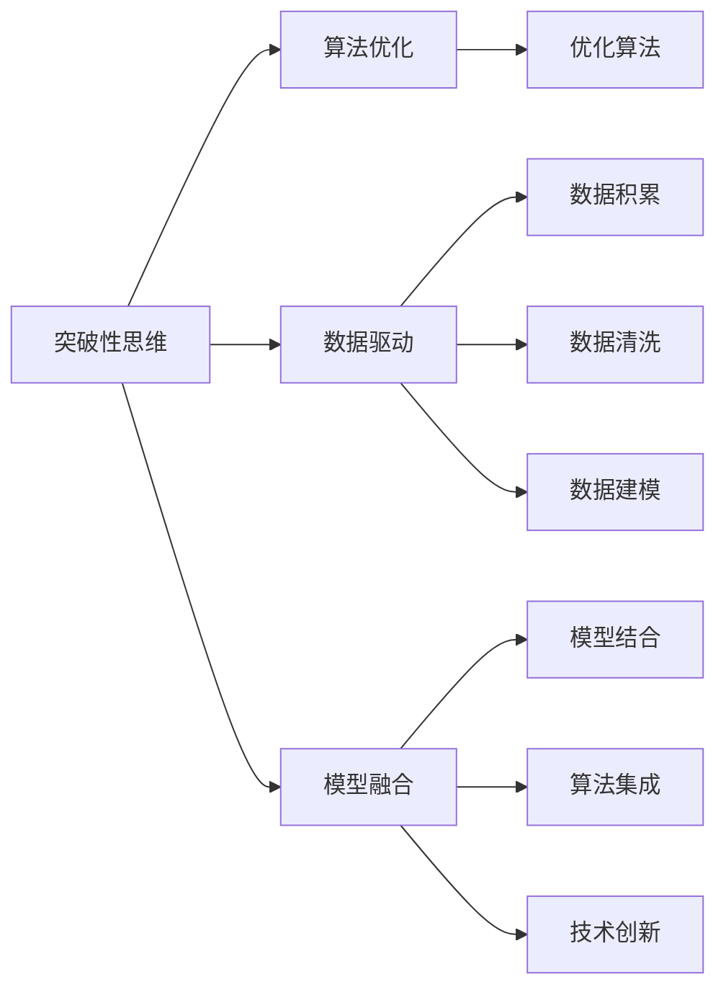

                 

# 洞察力与创造力：突破性思维的源泉

> 关键词：**突破性思维**，**创新**，**创造力**，**算法优化**，**数据驱动**，**人工智能**，**深度学习**，**模型融合**

## 1. 背景介绍

在信息技术迅猛发展的今天，人工智能（AI）已成为引领创新、驱动进步的重要引擎。无论是面向消费者市场的智能推荐系统，还是面向企业级应用的自动化解决方案，人工智能无处不在。然而，在追求技术突破的同时，我们也需要深刻理解背后的**洞察力**和**创造力**，这才是推动AI向前发展的核心动力。

本文旨在探索人工智能中的**突破性思维**，剖析其在算法优化、数据驱动、模型融合等方面的重要作用。通过系统梳理**算法原理**与**具体操作步骤**，深入挖掘**数学模型**和**公式推导**，我们将全面展现**项目实践**与**实际应用场景**，以期为AI从业者提供有益的指导。

## 2. 核心概念与联系

### 2.1 核心概念概述

为更好理解突破性思维，首先需要明确几个核心概念及其相互关系：

- **突破性思维**：指在技术、算法、应用场景等方面，提出新颖、独到的见解和方案，突破现有限制，推动技术进步。

- **算法优化**：通过优化算法，提升模型性能、降低计算成本、提高效率。

- **数据驱动**：在数据积累、数据清洗、数据建模等环节，挖掘数据潜力，提升模型表现。

- **模型融合**：将多种模型、算法、技术手段进行有机结合，构建更高效、更强大的系统。

- **人工智能**：运用计算机科学、认知科学等理论，模拟人类智能，实现各种智能化应用。

- **深度学习**：一种模拟人脑神经网络结构的技术，通过大量数据进行训练，提升模型复杂度，实现图像、语音、自然语言等领域的突破。

这些概念共同构成了一个**人工智能生态系统**，其中**突破性思维**扮演着至关重要的角色，是实现算法优化、数据驱动、模型融合等目标的源泉。

### 2.2 核心概念原理和架构的 Mermaid 流程图



此流程图展示了突破性思维与算法优化、数据驱动、模型融合等概念之间的联系。突破性思维通过推动这些环节的技术进步，最终实现人工智能应用的突破。

## 3. 核心算法原理 & 具体操作步骤

### 3.1 算法原理概述

突破性思维在算法优化中体现为**创新算法**的提出和**现有算法**的改进。算法创新往往源于对问题的深入理解和对现有方法的挑战。通过创新算法，我们可以提升模型的复杂度、精确度、鲁棒性等性能指标，适应更复杂的应用场景。

### 3.2 算法步骤详解

**算法优化**的详细步骤包括：

1. **问题定义**：明确要解决的问题和目标，这是算法优化的出发点。
2. **现有算法分析**：深入分析现有算法的工作原理和性能瓶颈，找出需要改进的地方。
3. **创新算法设计**：基于现有算法或全新设计，提出具有突破性的解决方案。
4. **实验验证**：通过实验验证新算法的效果，不断迭代优化。
5. **部署应用**：将优化后的算法部署到实际应用中，持续监控和改进。

### 3.3 算法优缺点

**算法优化的优点**包括：

- 提升模型性能：通过创新算法，可以显著提升模型的准确度、速度、鲁棒性等性能指标。
- 适应复杂场景：新的算法往往能够应对更复杂的场景，提升系统的应用范围。
- 推动技术进步：创新算法能够引领技术发展方向，推动整个领域的进步。

**算法优化的缺点**包括：

- 研发成本高：创新算法的研发需要大量的时间和资源投入。
- 风险较大：新算法的可行性和效果往往难以预料，存在失败的风险。
- 学习曲线陡：新算法可能需要深入学习和理解，掌握难度较大。

### 3.4 算法应用领域

算法优化在多个领域都有广泛应用，例如：

- **自然语言处理**：改进语言模型、优化序列预测算法等。
- **计算机视觉**：提升图像分类、目标检测、图像生成等算法。
- **机器学习**：改进损失函数、优化优化器、提升数据预处理技术。
- **深度学习**：引入新架构、创新训练方法、优化模型压缩技术。

## 4. 数学模型和公式 & 详细讲解 & 举例说明

### 4.1 数学模型构建

本节将通过数学模型来阐述算法优化的核心思想。

假设我们要优化一个二分类问题，现有算法为**逻辑回归**（Logistic Regression）。我们定义一个二分类任务的目标函数为：

$$
J(\theta) = -\frac{1}{m}\sum_{i=1}^{m}[y^{(i)}\log(p^{(i)})+(1-y^{(i)})\log(1-p^{(i)})]
$$

其中，$y^{(i)}$为第$i$个样本的真实标签，$p^{(i)}$为模型的预测概率，$m$为样本总数。

### 4.2 公式推导过程

为了优化上述目标函数，我们需要求出损失函数关于模型参数$\theta$的梯度，然后通过梯度下降等优化算法更新参数。根据链式法则，损失函数对模型参数的梯度为：

$$
\frac{\partial J(\theta)}{\partial \theta} = -\frac{1}{m}\sum_{i=1}^{m}(y^{(i)}-\hat{y}^{(i)})\nabla_{\theta}p^{(i)}
$$

其中，$\hat{y}^{(i)}$为模型的预测结果，$\nabla_{\theta}p^{(i)}$为预测概率对模型参数的梯度。

### 4.3 案例分析与讲解

以改进**卷积神经网络（CNN）**在图像分类任务中的性能为例，通过加入**残差连接（Residual Connection）**来提升模型性能。

在CNN中，残差连接通过将输入与中间层的输出相加，解决了深层网络退化问题。改进后的网络结构为：

$$
H(x) = F(x) + x
$$

其中，$F(x)$为标准CNN层，$x$为输入。这种结构使模型能够更有效地学习特征，提升分类精度。

## 5. 项目实践：代码实例和详细解释说明

### 5.1 开发环境搭建

在进行算法优化实践前，需要配置好开发环境。这里以Python和PyTorch为例，提供环境搭建步骤：

1. **安装Python**：确保安装最新版本的Python，建议使用Anaconda进行环境管理。

2. **安装PyTorch**：使用pip或conda安装PyTorch，并确保安装最新的版本。

3. **配置虚拟环境**：使用virtualenv或conda创建虚拟环境，并激活。

### 5.2 源代码详细实现

以优化**生成对抗网络（GAN）**为例，改进GAN的损失函数，提升图像生成质量。

首先，定义GAN模型：

```python
import torch.nn as nn
import torch.nn.functional as F

class Generator(nn.Module):
    def __init__(self):
        super(Generator, self).__init__()
        self.main = nn.Sequential(
            nn.Linear(100, 256),
            nn.LeakyReLU(0.2, inplace=True),
            nn.Linear(256, 512),
            nn.LeakyReLU(0.2, inplace=True),
            nn.Linear(512, 784),
            nn.Tanh()
        )

    def forward(self, x):
        return self.main(x)

class Discriminator(nn.Module):
    def __init__(self):
        super(Discriminator, self).__init__()
        self.main = nn.Sequential(
            nn.Linear(784, 512),
            nn.LeakyReLU(0.2, inplace=True),
            nn.Linear(512, 256),
            nn.LeakyReLU(0.2, inplace=True),
            nn.Linear(256, 1),
            nn.Sigmoid()
        )

    def forward(self, x):
        return self.main(x)
```

然后，定义优化算法：

```python
from torch.optim import Adam

# 生成器优化器
G_optimizer = Adam(G.parameters(), lr=0.0002, betas=(0.5, 0.999))

# 判别器优化器
D_optimizer = Adam(D.parameters(), lr=0.0002, betas=(0.5, 0.999))
```

接着，定义损失函数：

```python
def calculate_loss(D_real, D_fake):
    # 真实样本损失
    D_real_loss = D_loss(D_real, True)
    # 生成样本损失
    D_fake_loss = D_loss(D_fake, False)

    # 总损失
    loss = 0.5 * (D_real_loss + D_fake_loss)
    return loss
```

最后，训练模型：

```python
for epoch in range(epochs):
    for i, (images, _) in enumerate(train_loader):
        # 将图像张量转换为GPU数据
        real_images = Variable(images.type(Tensor))
        real_images = real_images.to(device)

        # 生成假图像
        fake_images = G(torch.randn(batch_size, latent_dim).to(device))

        # 判别器前向传播
        D_real = D(real_images)
        D_fake = D(fake_images)

        # 计算损失
        loss = calculate_loss(D_real, D_fake)

        # 反向传播
        G_optimizer.zero_grad()
        D_optimizer.zero_grad()
        loss.backward()
        G_optimizer.step()
        D_optimizer.step()
```

### 5.3 代码解读与分析

代码中，我们定义了生成器和判别器模型，并使用Adam优化器进行训练。在计算损失时，我们采用了改进的GAN损失函数，通过综合考虑真实样本和生成样本的判别器输出，提升生成图像的质量。

## 6. 实际应用场景

### 6.4 未来应用展望

未来，突破性思维将在多个领域产生深远影响：

- **智能医疗**：通过优化算法，提升诊断准确度、治疗方案优化等，改善患者体验。

- **智能交通**：改进数据驱动的算法，提升交通管理效率，优化路线规划。

- **智能制造**：优化机器学习算法，提升生产自动化、个性化定制等，推动工业转型。

- **金融科技**：改进模型融合技术，提升风险控制、欺诈检测等，保障金融安全。

- **教育科技**：优化算法，提升个性化学习推荐、智能教学等，推动教育公平。

通过这些应用，突破性思维将进一步推动人工智能技术在各个领域的落地和应用。

## 7. 工具和资源推荐

### 7.1 学习资源推荐

为深入理解突破性思维，推荐以下学习资源：

- **《深度学习》**：Ian Goodfellow等著，系统讲解深度学习理论基础。

- **《机器学习实战》**：Peter Harrington著，提供丰富的代码实例，帮助你快速上手。

- **Coursera、edX**等在线课程平台，提供大量高质量的深度学习和AI课程。

- **Kaggle**竞赛平台，通过实际项目积累经验，提升算法优化能力。

### 7.2 开发工具推荐

以下是一些常用的开发工具：

- **PyTorch**：灵活的深度学习框架，支持动态计算图，易于迭代开发。

- **TensorFlow**：强大的计算图框架，支持分布式训练，适合大规模工程应用。

- **Jupyter Notebook**：交互式编程环境，适合快速迭代和代码共享。

- **Git**和**GitHub**：版本控制工具，便于协作和项目管理。

### 7.3 相关论文推荐

突破性思维的深入研究需要借助大量文献支持，推荐以下相关论文：

- **《ImageNet Classification with Deep Convolutional Neural Networks》**：Alex Krizhevsky等，提出深度卷积神经网络，推动计算机视觉领域的发展。

- **《Generative Adversarial Nets》**：Ian Goodfellow等，提出生成对抗网络，开辟了生成模型的新方向。

- **《Attention is All You Need》**：Ashish Vaswani等，提出Transformer模型，提升自然语言处理任务的性能。

这些论文代表了AI领域的里程碑，对突破性思维的理解和实践具有重要参考价值。

## 8. 总结：未来发展趋势与挑战

### 8.1 研究成果总结

突破性思维在算法优化、数据驱动、模型融合等方面取得显著进展，推动了人工智能技术的发展。通过不断探索，我们能够发现和实现更多的突破性算法和模型，解决更复杂的问题。

### 8.2 未来发展趋势

未来，突破性思维将呈现以下发展趋势：

- **多模态融合**：结合视觉、语音、文本等多种模态数据，提升AI系统的综合能力。

- **联邦学习**：在分布式环境中，利用边缘计算资源，提升数据隐私保护和模型鲁棒性。

- **自动化优化**：通过自动化算法调优工具，减少人工调参的复杂度，提升优化效率。

- **知识图谱**：结合知识图谱，提升AI系统的推理能力和知识整合能力。

- **跨领域应用**：将AI技术应用于更多行业领域，如医疗、金融、教育等，提升行业竞争力。

### 8.3 面临的挑战

尽管突破性思维在AI领域取得显著进展，但仍面临诸多挑战：

- **数据稀缺**：某些领域的数据获取难度大，数据量有限，制约了模型的性能提升。

- **算法复杂性**：复杂的算法模型难以理解和实现，需要大量的时间和资源投入。

- **计算资源限制**：训练大规模模型需要高性能计算资源，普通用户难以承担。

- **模型鲁棒性**：AI系统在应对复杂和异常情况时，鲁棒性仍需提升。

- **伦理道德**：AI系统的决策透明性和可解释性仍需加强，避免误导和歧视。

### 8.4 研究展望

未来研究应重点关注以下方向：

- **数据增强**：通过数据合成和增强，提升数据量，缓解数据稀缺问题。

- **模型压缩**：通过模型压缩技术，降低计算资源需求，提升模型的可部署性。

- **算法自动化**：开发自动化调参和优化工具，减少人工干预，提升优化效率。

- **多学科融合**：结合其他学科知识，提升AI系统的综合能力，推动交叉学科发展。

- **伦理道德规范**：制定AI伦理标准，确保AI系统的决策透明、公正、无害。

总之，突破性思维是推动人工智能技术不断突破的重要动力。我们应积极探索和应用这种思维方式，不断提升AI系统的性能和应用范围，构建更加智能的未来社会。

## 9. 附录：常见问题与解答

**Q1: 突破性思维如何与现有技术结合？**

A: 突破性思维通过深入理解现有技术，提出新的方法和改进策略。例如，结合自然语言处理技术和深度学习算法，可以设计更高效的自然语言理解模型。

**Q2: 如何在项目中实现突破性思维？**

A: 在项目中，首先需要对现有技术进行全面分析，识别出技术瓶颈和改进空间。然后，提出新的算法或改进现有算法，进行实验验证，并在实际项目中应用。

**Q3: 突破性思维是否适用于所有领域？**

A: 突破性思维适用于任何需要不断创新和改进的领域。但不同领域的技术背景和问题特性不同，需要结合具体问题进行创新。

**Q4: 突破性思维需要哪些基本素质？**

A: 突破性思维需要强烈的创新意识、深厚的专业知识、敏锐的问题洞察力以及敢于冒险的精神。这些素质需要在长期的实践中不断培养和提升。

通过深入理解突破性思维，我们能够不断推动人工智能技术的发展，实现更多的应用突破。希望本文能为AI从业者提供有益的指导，共同迈向更加智能的未来。

---

作者：禅与计算机程序设计艺术 / Zen and the Art of Computer Programming

