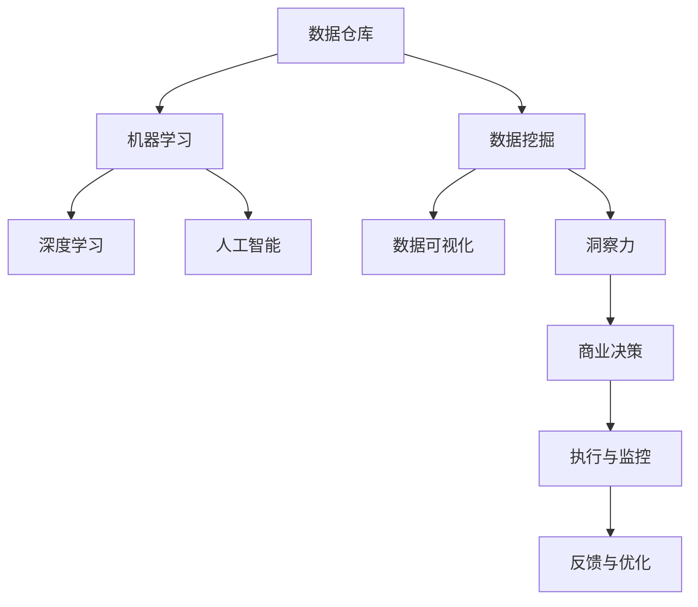

                 

# 洞察力与商业智能：数据驱动的决策制定

## 1. 背景介绍

### 1.1 问题由来
在当今数据驱动的商业环境中，决策者需要借助数据洞察来理解市场动态，预测未来趋势，优化资源配置。传统上，决策制定主要依赖经验直觉，但随着数据量的爆炸性增长和分析技术的进步，基于数据的洞察力成为新的竞争优势来源。

### 1.2 问题核心关键点
现代商业智能(Business Intelligence, BI)系统已经从简单的报表展示发展到深度数据分析与模型预测，利用大数据、机器学习和人工智能技术，帮助企业做出更精准的商业决策。数据驱动决策的核心在于：
1. **数据获取与处理**：收集和清洗高质量的数据，是数据驱动决策的基础。
2. **数据可视化**：直观展示数据，便于快速识别模式和趋势。
3. **数据分析**：应用统计学和机器学习技术，深入挖掘数据背后的规律和洞见。
4. **模型预测**：基于历史数据建立预测模型，预测未来市场动态。
5. **商业决策**：结合业务逻辑，将数据洞察转化为实际决策。

### 1.3 问题研究意义
深入理解数据驱动的决策制定过程，对构建高效、灵活的商业智能系统具有重要意义。数据驱动决策不仅能提升企业竞争力，还能推动数字化转型，优化运营效率，开拓新的业务机会。

## 2. 核心概念与联系

### 2.1 核心概念概述

为了更好地理解数据驱动的决策制定过程，我们首先介绍几个关键概念：

- **商业智能**（Business Intelligence, BI）：使用数据分析、统计学和可视化技术，支持决策者制定商业策略和管理决策的系统。
- **数据仓库**（Data Warehouse）：集中存储和管理企业历史数据的基础设施，提供统一的访问和管理方式。
- **数据挖掘**（Data Mining）：从大量数据中提取有用信息和模式的过程，包括聚类、分类、关联规则等。
- **机器学习**（Machine Learning）：利用算法从数据中自动学习和优化模型，用于预测和决策。
- **深度学习**（Deep Learning）：一种基于神经网络的机器学习方法，能够处理高维数据，发现复杂的模式和规律。
- **人工智能**（Artificial Intelligence, AI）：使计算机具备智能行为和决策能力的系统，应用广泛于图像识别、自然语言处理等领域。
- **洞察力**（Insight）：通过对数据深入分析得出的洞见和结论，辅助决策。

这些概念之间通过数据的收集、处理、分析和应用，紧密联系在一起，形成了一个完整的商业智能生态系统。

### 2.2 核心概念原理和架构的 Mermaid 流程图



这个流程图展示了数据驱动决策的基本流程：

1. 从数据仓库中提取数据。
2. 通过数据挖掘和机器学习发现数据中的模式和规律。
3. 应用深度学习和人工智能技术，建立预测和决策模型。
4. 利用数据可视化工具，直观展示数据和洞察。
5. 结合业务逻辑，制定商业决策并执行。
6. 不断优化模型和算法，提高决策质量。

## 3. 核心算法原理 & 具体操作步骤

### 3.1 算法原理概述

数据驱动的决策制定，本质上是将大量数据转化为洞察力的过程。其核心算法包括数据仓库、数据挖掘、机器学习、深度学习和人工智能等技术，通过处理和分析数据，提取有价值的信息和洞见，辅助决策。

具体而言，数据驱动决策的算法原理可以概括为：

1. **数据收集与处理**：从多个数据源收集数据，并进行清洗和标准化，确保数据质量。
2. **特征工程**：选择合适的特征变量，构建特征矩阵，为后续模型训练做准备。
3. **模型选择与训练**：根据数据类型和业务需求，选择合适的算法模型，并使用历史数据进行训练。
4. **模型评估与优化**：通过验证集和测试集评估模型性能，使用交叉验证等技术优化模型。
5. **洞察力提取**：应用可视化工具展示模型输出，提取关键洞见。
6. **决策制定与执行**：将洞察力转化为具体的商业决策，并执行。

### 3.2 算法步骤详解

数据驱动决策的具体操作步骤包括以下几个关键步骤：

**Step 1: 数据收集与处理**

- **数据来源**：确定所需的数据来源，包括企业内部的数据（如销售记录、客户信息）和企业外部数据（如市场调研、公开数据）。
- **数据清洗**：删除重复、错误和不完整的数据，确保数据质量。
- **数据标准化**：统一数据格式和单位，便于后续分析。

**Step 2: 特征工程**

- **特征选择**：根据业务需求，选择对决策有重要影响的特征变量，如销售量、客户满意度等。
- **特征转换**：对原始数据进行转换，如归一化、标准化等，提高模型性能。
- **特征组合**：通过交叉、组合等方法，创建新的特征，如销售量的月度平均、年化增长率等。

**Step 3: 模型选择与训练**

- **模型选择**：根据数据类型和任务类型，选择合适的算法模型，如线性回归、决策树、随机森林等。
- **模型训练**：使用训练集数据训练模型，调整模型参数，优化性能。
- **模型验证**：在验证集上评估模型性能，选择最佳模型。

**Step 4: 模型评估与优化**

- **模型评估**：使用测试集数据评估模型性能，计算准确率、召回率等指标。
- **交叉验证**：通过交叉验证技术，防止模型过拟合，提高泛化能力。
- **超参数调优**：调整模型超参数，如学习率、正则化强度等，优化模型性能。

**Step 5: 洞察力提取**

- **数据可视化**：使用图表、热图等工具，直观展示数据和模型输出。
- **洞察力提取**：分析数据可视化结果，提取关键洞见，如市场趋势、客户偏好等。
- **洞见应用**：将洞见应用于业务决策，如调整市场策略、优化产品设计等。

**Step 6: 决策制定与执行**

- **决策制定**：结合业务逻辑和数据洞察，制定商业决策。
- **决策执行**：将决策转化为具体的行动，如调整广告预算、优化供应链管理等。
- **执行监控**：监控决策执行效果，收集反馈信息。

### 3.3 算法优缺点

数据驱动的决策制定具有以下优点：
1. **客观性**：基于数据而非直觉，提高决策的客观性和可靠性。
2. **精确性**：利用数学模型和统计方法，提高预测和决策的精确性。
3. **可量化**：将决策转化为可量化的指标，便于跟踪和评估。
4. **灵活性**：模型可以动态更新，适应业务变化。
5. **可扩展性**：适用于多种业务场景，便于推广应用。

同时，也存在一些缺点：
1. **数据质量要求高**：数据质量对决策结果影响较大，低质量数据可能导致错误决策。
2. **模型复杂度高**：复杂的模型需要大量数据和计算资源，可能导致过度拟合。
3. **业务理解要求高**：模型输出需要结合业务逻辑进行解读，决策者需要具备较高的业务理解能力。
4. **技术门槛高**：需要具备数据科学和机器学习等技术背景，才能高效应用。
5. **隐私保护问题**：大量数据的使用可能涉及隐私问题，需要合规管理。

尽管存在这些局限性，数据驱动的决策制定仍是目前最有效的决策制定方法之一。未来研究需要进一步提升数据质量和处理效率，降低模型复杂度，增强决策的可解释性，同时保障数据隐私和安全。

### 3.4 算法应用领域

数据驱动的决策制定已经广泛应用于多个行业和领域，例如：

- **零售业**：通过销售数据、客户反馈等数据，优化库存管理、定价策略和市场营销。
- **金融业**：利用市场数据、交易记录等，进行风险评估、投资组合管理和欺诈检测。
- **制造业**：分析生产数据、设备状态等，优化生产计划、供应链管理和质量控制。
- **医疗保健**：利用患者数据、医疗记录等，改善诊疗流程、疾病预测和健康管理。
- **物流业**：分析运输数据、货物状态等，优化路线规划、库存管理和客户服务。
- **政府公共服务**：利用社会经济数据、人口统计数据等，制定公共政策、改善公共服务。

这些领域的应用展示了数据驱动决策的广泛潜力和巨大价值。未来，随着技术的进步和应用的深入，数据驱动决策将在更多领域发挥重要作用，推动数字化转型和智能升级。

## 4. 数学模型和公式 & 详细讲解 & 举例说明

### 4.1 数学模型构建

数据驱动的决策制定涉及到多个数学模型和技术方法，以下是几种常见的模型：

- **线性回归模型**：用于预测数值型数据的回归模型，公式如下：
  $$
  y = \beta_0 + \sum_{i=1}^n \beta_i x_i + \epsilon
  $$
  其中 $y$ 为目标变量，$x_i$ 为特征变量，$\beta$ 为回归系数，$\epsilon$ 为误差项。

- **决策树模型**：用于分类和回归的树形模型，通过递归划分数据集，公式如下：
  $$
  T = \{(x_i, y_i), i=1,2,...,n\} \rightarrow \{t_1, t_2,...,t_k\}
  $$
  其中 $T$ 为数据集，$t_k$ 为决策树节点。

- **随机森林模型**：基于决策树的集成学习模型，通过随机抽样和特征选择，提高模型泛化能力，公式如下：
  $$
  \hat{y} = \frac{1}{k} \sum_{i=1}^k f_i(x)
  $$
  其中 $f_i$ 为随机森林中的第 $i$ 棵决策树，$k$ 为树的数量。

### 4.2 公式推导过程

以下我们以线性回归模型为例，推导其基本原理和公式。

假设我们有一个训练集 $D=\{(x_i, y_i)\}_{i=1}^N$，其中 $x_i \in \mathbb{R}^n$ 为特征向量，$y_i \in \mathbb{R}$ 为目标变量。我们的目标是最小化损失函数：

$$
L(\theta) = \frac{1}{2N} \sum_{i=1}^N (y_i - \hat{y_i})^2
$$

其中 $\hat{y_i} = \theta_0 + \sum_{j=1}^n \theta_j x_{ij}$ 为线性回归模型的预测值。通过梯度下降算法，求解最优参数 $\theta$：

$$
\theta = \mathop{\arg\min}_{\theta} L(\theta)
$$

具体而言，计算损失函数关于 $\theta$ 的梯度：

$$
\nabla_{\theta}L(\theta) = \frac{1}{N} \sum_{i=1}^N (-2y_i + 2\hat{y_i}) \frac{\partial \hat{y_i}}{\partial \theta} = \frac{1}{N} \sum_{i=1}^N (-2y_i + 2\theta_0 + 2\sum_{j=1}^n \theta_j x_{ij}) \begin{bmatrix} 1 \\ x_{i1} \\ \vdots \\ x_{in} \end{bmatrix}
$$

令 $X = \begin{bmatrix} 1 & x_{11} & \cdots & x_{1n} \\ \vdots & \vdots & \ddots & \vdots \\ 1 & x_{N1} & \cdots & x_{Nn} \end{bmatrix}$，$y = \begin{bmatrix} y_1 \\ \vdots \\ y_N \end{bmatrix}$，$y_h = \begin{bmatrix} \hat{y_1} \\ \vdots \\ \hat{y_N} \end{bmatrix}$，则有：

$$
\nabla_{\theta}L(\theta) = -\frac{2}{N} (XX^T + \sigma^2 I)^{-1} (X^T (y-y_h))
$$

其中 $\sigma^2$ 为误差项的方差。最终，通过迭代求解上述公式，即可得到最优参数 $\theta$。

### 4.3 案例分析与讲解

**案例1：客户流失预测**

假设某电商平台的客户流失数据集包含客户历史行为记录和基本信息。我们可以使用线性回归模型预测客户流失的概率。具体步骤如下：

1. **数据预处理**：对数据进行清洗、归一化等处理。
2. **特征选择**：选择对流失概率有影响的特征，如购买频率、复购率等。
3. **模型训练**：使用训练集数据训练线性回归模型。
4. **模型评估**：在验证集上评估模型性能，选择最佳模型。
5. **洞察力提取**：分析模型输出，提取关键洞见，如高流失客户的行为特征等。
6. **决策制定**：根据洞察力，制定客户挽留策略，如优惠促销、个性化推荐等。

**案例2：市场趋势预测**

假设某投资公司需要预测股票市场的未来趋势。我们可以使用随机森林模型进行分析。具体步骤如下：

1. **数据预处理**：收集市场数据、公司财务数据等，并进行清洗和标准化。
2. **特征选择**：选择对市场趋势有影响的特征，如历史股价、公司盈利等。
3. **模型训练**：使用训练集数据训练随机森林模型。
4. **模型评估**：在验证集上评估模型性能，选择最佳模型。
5. **洞察力提取**：分析模型输出，提取关键洞见，如市场热点、行业动态等。
6. **决策制定**：根据洞察力，制定投资策略，如增加或减少某个股票的持仓量等。

## 5. 项目实践：代码实例和详细解释说明

### 5.1 开发环境搭建

在进行数据驱动决策的实践时，我们需要准备好开发环境。以下是使用Python进行Pandas和Scikit-Learn开发的简单环境配置流程：

1. 安装Anaconda：从官网下载并安装Anaconda，用于创建独立的Python环境。

2. 创建并激活虚拟环境：
```bash
conda create -n data-intelligence python=3.8 
conda activate data-intelligence
```

3. 安装相关库：
```bash
conda install pandas numpy scikit-learn matplotlib seaborn jupyter notebook ipython
```

4. 安装可视化工具：
```bash
pip install plotly altair holoviews
```

完成上述步骤后，即可在`data-intelligence`环境中开始数据驱动决策的实践。

### 5.2 源代码详细实现

下面我们以客户流失预测为例，给出使用Pandas和Scikit-Learn进行数据驱动决策的代码实现。

首先，定义数据预处理函数：

```python
import pandas as pd
from sklearn.model_selection import train_test_split

def preprocess_data(data_path):
    data = pd.read_csv(data_path)
    # 清洗数据
    data = data.dropna()
    # 特征选择
    data = data.drop(['ID', 'Time'], axis=1)
    # 特征编码
    data = pd.get_dummies(data, drop_first=True)
    # 标准化
    data = (data - data.mean()) / data.std()
    # 划分训练集和测试集
    X = data.drop('Churn', axis=1)
    y = data['Churn']
    X_train, X_test, y_train, y_test = train_test_split(X, y, test_size=0.2, random_state=42)
    return X_train, X_test, y_train, y_test
```

然后，定义模型训练函数：

```python
from sklearn.linear_model import LinearRegression
from sklearn.metrics import mean_squared_error

def train_model(X_train, X_test, y_train, y_test):
    model = LinearRegression()
    model.fit(X_train, y_train)
    y_pred = model.predict(X_test)
    mse = mean_squared_error(y_test, y_pred)
    print(f"MSE: {mse:.3f}")
```

最后，启动训练流程并在测试集上评估：

```python
X_train, X_test, y_train, y_test = preprocess_data('customer_churn.csv')

train_model(X_train, X_test, y_train, y_test)
```

以上就是使用Pandas和Scikit-Learn进行数据驱动决策的完整代码实现。可以看到，利用Python的库函数，我们可以快速完成数据预处理、模型训练和评估等步骤。

### 5.3 代码解读与分析

让我们再详细解读一下关键代码的实现细节：

**preprocess_data函数**：
- 数据预处理：清洗数据、特征选择、特征编码、标准化等。
- 数据划分：使用`train_test_split`将数据集划分为训练集和测试集。

**train_model函数**：
- 定义线性回归模型，训练模型。
- 在测试集上进行预测，计算均方误差（MSE）。

**训练流程**：
- 使用`preprocess_data`函数对数据进行预处理。
- 在预处理后的数据上调用`train_model`函数进行训练和评估。
- 输出模型在测试集上的均方误差。

可以看到，Pandas和Scikit-Learn使得数据驱动决策的实现变得简洁高效。开发者可以将更多精力放在模型改进、数据处理等高层逻辑上，而不必过多关注底层的实现细节。

当然，工业级的系统实现还需考虑更多因素，如模型的保存和部署、超参数的自动搜索、更灵活的任务适配层等。但核心的数据驱动决策流程基本与此类似。

## 6. 实际应用场景

### 6.1 智能零售

智能零售利用数据驱动决策，通过分析客户行为数据，优化库存管理、定价策略和营销活动，提升客户满意度和销售额。例如，通过预测客户流失，零售商可以提前采取挽留措施，如优惠券、个性化推荐等，提升客户粘性。同时，通过分析销售数据，零售商可以优化商品布局、促销活动，提升运营效率。

### 6.2 金融风控

金融风控需要实时监测市场动态，及时识别风险点，保障金融安全。利用数据驱动决策，金融机构可以建立预测模型，实时评估借款人信用风险，优化贷款审批流程，降低不良贷款率。同时，通过分析交易数据，金融机构可以检测异常交易，及时防范欺诈行为。

### 6.3 供应链管理

供应链管理需要优化库存、物流和生产计划，降低成本，提升效率。通过数据驱动决策，企业可以建立预测模型，优化库存水平，减少库存积压和缺货情况。同时，通过分析物流数据，企业可以优化运输路线，提高物流效率，降低运输成本。

### 6.4 智慧医疗

智慧医疗需要利用数据驱动决策，优化诊疗流程、提高诊断准确率、改善患者管理。通过分析患者数据，医院可以预测疾病爆发趋势，提前采取预防措施。同时，通过分析诊疗记录，医生可以优化治疗方案，提高诊疗效果。

### 6.5 智能交通

智能交通需要优化交通流量、减少拥堵、提高交通安全。通过数据驱动决策，交通管理部门可以建立预测模型，优化交通信号灯控制，减少交通拥堵。同时，通过分析交通数据，交通管理部门可以预测交通事故，及时采取防范措施，提升交通安全。

## 7. 工具和资源推荐

### 7.1 学习资源推荐

为了帮助开发者系统掌握数据驱动的决策制定理论基础和实践技巧，这里推荐一些优质的学习资源：

1. 《Python数据科学手册》：介绍Pandas、NumPy、Scikit-Learn等库的使用，是数据驱动决策的入门必读。

2. 《数据挖掘导论》：介绍数据挖掘的基本概念和算法，适合初学者入门。

3. 《机器学习实战》：提供丰富的案例和实践指导，适合实战练习。

4. 《深度学习》：介绍深度学习的基本原理和应用，适合深入学习。

5. 《数据科学与商业智能》课程：通过实际案例讲解数据驱动决策的应用，适合提高实践能力。

6. Kaggle竞赛：参与Kaggle竞赛，积累数据驱动决策的实践经验。

通过对这些资源的学习实践，相信你一定能够快速掌握数据驱动决策的精髓，并用于解决实际的商业问题。

### 7.2 开发工具推荐

高效的数据驱动决策开发离不开优秀的工具支持。以下是几款常用的数据驱动决策开发工具：

1. Jupyter Notebook：免费的交互式开发环境，支持多种库和语言。

2. Anaconda：Python环境管理工具，支持创建和管理虚拟环境。

3. Pandas：数据分析库，支持数据清洗、预处理等操作。

4. Scikit-Learn：机器学习库，提供多种算法和模型。

5. TensorFlow：深度学习库，支持复杂模型的构建和训练。

6. Plotly：数据可视化库，支持交互式图表和地图。

7. Altair：数据可视化库，提供简洁的语法和丰富的图表类型。

合理利用这些工具，可以显著提升数据驱动决策的开发效率，加快创新迭代的步伐。

### 7.3 相关论文推荐

数据驱动决策的研究源于学界的持续研究。以下是几篇奠基性的相关论文，推荐阅读：

1. "Introduction to Statistical Learning" by Gareth James et al.：介绍统计学习的基本概念和算法，是数据驱动决策的理论基础。

2. "The Elements of Statistical Learning" by Trevor Hastie et al.：介绍统计学习的理论和算法，适合深入学习。

3. "Pattern Recognition and Machine Learning" by Christopher Bishop：介绍模式识别和机器学习的基本概念和算法，适合全面了解。

4. "Data Mining and Statistical Learning" by Jiawei Han et al.：介绍数据挖掘和统计学习的理论和算法，适合提高实践能力。

5. "Data Science for Business" by Foster Provost and Tom Fawcett：介绍数据科学在商业中的应用，适合提升商业智能能力。

这些论文代表了大数据驱动决策的理论研究进展，通过学习这些前沿成果，可以帮助研究者把握学科前进方向，激发更多的创新灵感。

## 8. 总结：未来发展趋势与挑战

### 8.1 总结

本文对数据驱动的决策制定过程进行了全面系统的介绍。首先阐述了数据驱动决策的基本概念和核心算法，明确了数据驱动决策在商业智能系统中的重要作用。其次，从原理到实践，详细讲解了数据驱动决策的数学模型和操作步骤，给出了数据驱动决策任务开发的完整代码实例。同时，本文还探讨了数据驱动决策在多个行业领域的应用，展示了其广泛潜力和巨大价值。

通过本文的系统梳理，可以看到，数据驱动的决策制定正在成为商业智能的重要范式，极大地提升企业竞争力，推动数字化转型，优化运营效率。未来，随着数据的不断积累和技术的不断进步，数据驱动决策将在更多领域发挥重要作用，推动社会的数字化进程。

### 8.2 未来发展趋势

展望未来，数据驱动的决策制定将呈现以下几个发展趋势：

1. **数据自动化采集与处理**：通过自动化的数据采集和处理技术，提高数据质量和处理效率，降低数据驱动决策的实施成本。

2. **深度学习与强化学习的融合**：利用深度学习和强化学习技术，提升预测和决策的准确性和鲁棒性。

3. **跨领域数据融合**：将多源异构数据进行融合，建立统一的数据仓库，提高决策的全面性和综合性。

4. **实时数据分析与决策**：通过实时数据分析，快速响应市场变化，提高决策的时效性。

5. **可解释性与透明性**：开发可解释性强、透明性高的模型，提高决策的可理解和可控性。

6. **模型优化与优化策略**：通过模型优化和优化策略，提升模型的泛化能力和鲁棒性。

以上趋势将进一步推动数据驱动决策的全面发展，提升决策的精确性和智能化水平，为企业的数字化转型提供坚实的基础。

### 8.3 面临的挑战

尽管数据驱动的决策制定取得了显著进展，但仍面临诸多挑战：

1. **数据隐私与安全**：数据驱动决策需要大量的数据，涉及隐私和安全问题，需要合规管理。

2. **数据质量与处理效率**：高质量的数据是数据驱动决策的基础，但数据清洗和处理需要耗费大量时间和资源。

3. **模型复杂度与计算资源**：深度学习和强化学习模型需要大量的计算资源，可能导致资源瓶颈。

4. **业务理解与融合**：数据驱动决策需要结合业务逻辑，但不同行业有不同的业务场景，模型融合难度较大。

5. **模型的可解释性与透明性**：复杂的模型可能缺乏可解释性，难以满足合规要求。

6. **模型的鲁棒性与泛化能力**：模型在面对新数据时可能出现泛化能力不足的问题。

7. **模型的维护与更新**：模型需要定期更新，但模型维护和更新工作量大，需投入大量人力。

正视这些挑战，积极应对并寻求突破，将是大数据驱动决策走向成熟的必由之路。相信随着技术的不断进步和应用场景的不断拓展，数据驱动决策将得到更广泛的应用，为社会带来更多的价值。

### 8.4 研究展望

面对数据驱动决策所面临的种种挑战，未来的研究需要在以下几个方面寻求新的突破：

1. **数据自动化采集与处理**：开发自动化数据采集和处理技术，提高数据质量和处理效率。

2. **深度学习与强化学习的融合**：探索深度学习和强化学习的结合方式，提升模型的性能和鲁棒性。

3. **跨领域数据融合**：开发跨领域数据融合技术，建立统一的数据仓库，提高决策的全面性和综合性。

4. **实时数据分析与决策**：开发实时数据分析技术，快速响应市场变化，提高决策的时效性。

5. **可解释性与透明性**：开发可解释性强、透明性高的模型，提高决策的可理解和可控性。

6. **模型优化与优化策略**：探索模型优化和优化策略，提升模型的泛化能力和鲁棒性。

7. **模型维护与更新**：开发模型维护和更新技术，降低模型维护和更新工作量。

这些研究方向的探索，必将引领数据驱动决策技术迈向更高的台阶，为构建高效、灵活的商业智能系统铺平道路。面向未来，数据驱动决策技术还需要与其他人工智能技术进行更深入的融合，如知识表示、因果推理、强化学习等，多路径协同发力，共同推动自然语言理解和智能交互系统的进步。只有勇于创新、敢于突破，才能不断拓展数据驱动决策的边界，让智能技术更好地造福人类社会。

## 9. 附录：常见问题与解答

**Q1：数据驱动的决策制定是否适用于所有业务场景？**

A: 数据驱动的决策制定在大多数业务场景中都能发挥作用，但不同业务场景对数据的依赖程度和数据质量要求不同。例如，金融、医疗等领域的数据复杂性和敏感性较高，需要更专业的数据处理和模型设计。而电商、零售等领域的数据相对简单，数据驱动决策的实施成本较低。

**Q2：如何选择适合的数据驱动决策模型？**

A: 选择适合的数据驱动决策模型需要考虑以下几个因素：
1. **任务类型**：根据任务类型（分类、回归、聚类等）选择合适的模型，如线性回归、决策树、随机森林等。
2. **数据特征**：根据数据特征（数值型、类别型、文本型等）选择合适的模型，如K近邻、支持向量机、神经网络等。
3. **数据规模**：根据数据规模（小、中、大规模）选择合适的模型，如逻辑回归、随机森林、深度学习等。
4. **计算资源**：根据计算资源（GPU、TPU等）选择合适的模型，如线性回归、随机森林、深度学习等。
5. **业务需求**：根据业务需求（实时性、可解释性等）选择合适的模型，如时间序列预测、神经网络等。

**Q3：数据驱动的决策制定是否需要大量标注数据？**

A: 数据驱动的决策制定不需要大量标注数据，但需要高质量的原始数据。标注数据主要用于模型训练和验证，而原始数据是数据驱动决策的基础。例如，在客户流失预测中，原始的客户行为数据和基本信息即可用于模型训练，而不需要标注的流失数据。

**Q4：数据驱动的决策制定是否需要专家知识？**

A: 数据驱动的决策制定通常需要结合专家知识，但通过数据驱动决策，可以部分替代专家知识和经验。例如，在市场趋势预测中，虽然需要专家对市场动态的理解，但数据驱动决策可以提供客观的数据支持和预测模型，辅助专家做出更科学合理的决策。

**Q5：数据驱动的决策制定是否容易过拟合？**

A: 数据驱动的决策制定需要关注过拟合问题，尤其是在数据量较小或数据分布不均衡的情况下。常见的缓解策略包括：
1. **数据增强**：通过数据增强技术，扩充训练集，减少过拟合风险。
2. **正则化**：使用正则化技术，如L2正则、Dropout等，防止模型过拟合。
3. **模型集成**：使用模型集成技术，如Bagging、Boosting等，提高模型的泛化能力。

这些策略需要根据具体业务场景和数据特点进行灵活选择和应用。

**Q6：数据驱动的决策制定是否需要高成本的技术支持？**

A: 数据驱动的决策制定需要高成本的技术支持，但随着技术的不断进步和开源社区的发展，数据驱动决策的实施成本正在逐渐降低。例如，利用开源的Pandas和Scikit-Learn库，可以快速完成数据预处理、模型训练和评估等步骤，减少技术支持成本。

**Q7：数据驱动的决策制定是否需要专业的数据科学团队？**

A: 数据驱动的决策制定通常需要专业的数据科学团队，但也可以通过合作和外包的方式解决。例如，在电商行业，可以通过与数据科学公司合作，利用其技术优势和经验积累，快速实施数据驱动决策。

通过本文的系统梳理，可以看到，数据驱动的决策制定正在成为商业智能的重要范式，极大地提升企业竞争力，推动数字化转型，优化运营效率。未来，随着数据的不断积累和技术的不断进步，数据驱动决策将在更多领域发挥重要作用，推动社会的数字化进程。

