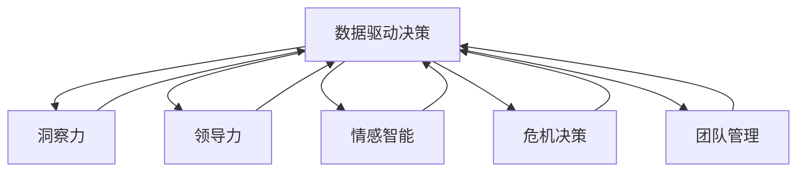

                 

# 洞察力与领导力：决策者的核心竞争力

> 关键词：洞察力, 领导力, 数据驱动决策, 人工智能, 情感智能, 危机决策, 团队管理

## 1. 背景介绍

在日益复杂的商业环境中，企业决策者面临着越来越多的挑战。如何通过有效的决策，推动企业不断前进，实现可持续增长，已成为企业领袖必须面对的重要课题。然而，传统决策依赖于直觉和经验，缺乏系统的数据支撑和方法论指导。随着大数据和人工智能技术的迅猛发展，基于数据的决策分析已成为新时代决策的重要工具。本文将系统阐述数据驱动决策的核心原理，探索洞察力和领导力在决策中的作用，并结合实际案例，阐述如何在复杂环境中构建高效的决策系统。

## 2. 核心概念与联系

### 2.1 核心概念概述

- **数据驱动决策**：基于数据和分析结果进行决策的过程。与直觉或经验相比，数据驱动决策更为系统和客观，能够更准确地把握实际情况，做出最优决策。

- **洞察力**：对事物本质的深刻理解。洞察力不仅体现在对数据的分析上，更在于对问题背景和业务逻辑的透彻理解。

- **领导力**：决策者的核心素质之一。有效的领导力不仅能提升团队士气和凝聚力，还能引导组织朝着正确方向发展。

- **情感智能**：领导者应对和理解他人情感的能力。情感智能的提升有助于构建和谐的组织氛围，提高决策过程中的互动和协作效率。

- **危机决策**：在紧急情况下，迅速做出决策以应对不确定性的能力。危机决策要求领导者能够在压力下保持冷静，充分利用有限的信息，做出快速反应。

- **团队管理**：构建和维护高效团队的能力。良好的团队管理能够整合资源，发挥团队成员的最大潜能，支持决策过程。

这些概念之间的联系可以通过以下Mermaid流程图展示：



## 3. 核心算法原理 & 具体操作步骤

### 3.1 算法原理概述

数据驱动决策的核心在于将数据转化为洞察，并基于洞察进行决策。具体步骤如下：

1. **数据收集与清洗**：收集相关数据，并进行预处理，确保数据质量和一致性。
2. **数据分析与建模**：利用统计分析和机器学习模型，提取关键数据特征，建立决策模型。
3. **洞察力生成**：将模型输出转化为业务洞察，理解数据背后的逻辑和趋势。
4. **决策制定**：结合业务目标和洞察，制定最优决策方案。
5. **执行与评估**：实施决策，并通过后续反馈进行效果评估和调整。

### 3.2 算法步骤详解

**Step 1: 数据收集与清洗**

数据收集阶段，需要明确业务目标和所需数据类型。例如，客户满意度调查、市场份额分析、产品销售数据等。

数据清洗阶段，需要处理缺失值、异常值、数据格式不统一等问题，确保数据的准确性和一致性。

**Step 2: 数据分析与建模**

选择合适的数据分析方法和机器学习模型，如回归分析、分类算法、聚类分析等。模型选择应考虑数据特点和业务需求。

在模型训练阶段，使用历史数据进行训练，调整模型参数，确保模型的泛化能力和准确性。

**Step 3: 洞察力生成**

将模型输出转化为业务洞察，理解数据背后的逻辑和趋势。例如，通过销售数据分析，洞察市场需求变化和产品优劣势。

**Step 4: 决策制定**

结合业务目标和洞察，制定最优决策方案。例如，基于市场趋势和产品优劣势，制定市场营销策略。

**Step 5: 执行与评估**

实施决策，并通过后续反馈进行效果评估和调整。例如，通过销售数据评估市场策略效果，及时调整营销策略。

### 3.3 算法优缺点

数据驱动决策的优点包括：

- **客观性**：基于数据和分析结果进行决策，减少主观偏差。
- **可量化**：决策过程可通过数据和模型量化，便于评估和优化。
- **效率高**：自动化流程可节省大量时间和资源，提升决策效率。

缺点包括：

- **数据质量**：数据不准确或不完整可能导致错误决策。
- **模型复杂性**：复杂的模型可能导致过度拟合，降低泛化能力。
- **数据隐私**：涉及敏感数据时，需要关注隐私保护和数据安全。

### 3.4 算法应用领域

数据驱动决策在各行各业都有广泛应用，例如：

- **金融行业**：风险评估、市场预测、投资决策等。
- **零售行业**：库存管理、客户细分、促销策略等。
- **医疗行业**：疾病诊断、治疗方案、患者管理等。
- **制造行业**：生产优化、质量控制、供应链管理等。
- **政府部门**：公共服务评估、政策制定、应急响应等。

## 4. 数学模型和公式 & 详细讲解 & 举例说明

### 4.1 数学模型构建

假设我们有一个简单的销售数据集，包含时间、产品、销售额等信息。可以构建一个时间序列模型，如ARIMA模型，进行预测和分析。

**输入**：时间戳、产品类别、历史销售额等。

**输出**：预测销售额。

**公式**：
$$
\hat{y}_t = \sum_{i=1}^p \alpha_i y_{t-i} + \sum_{j=1}^q \beta_j \Delta^j y_{t-j} + \sum_{k=1}^d \gamma_k \epsilon_{t-k}
$$

其中，$y_t$ 表示时间 $t$ 的销售额，$\alpha_i$ 和 $\beta_j$ 为模型参数，$\Delta^j$ 表示时间差分算子，$\epsilon_t$ 为误差项。

### 4.2 公式推导过程

**Step 1: 数据预处理**

将原始销售数据进行时间戳处理，转化为时间序列数据。

**Step 2: 模型训练**

使用历史数据训练ARIMA模型，调整参数 $\alpha_i$、$\beta_j$ 和 $\gamma_k$。

**Step 3: 预测与分析**

基于模型输出 $\hat{y}_t$，生成业务洞察。例如，通过模型预测，洞察销售额的季节性变化规律。

### 4.3 案例分析与讲解

假设某零售企业有销售数据记录，我们需要预测未来几个月的销售额，制定相应的销售策略。

**案例步骤**：

1. **数据收集**：收集历史销售数据，包括时间、产品、销售额等。
2. **数据预处理**：将销售数据进行时间戳处理，转化为时间序列数据。
3. **模型训练**：使用历史数据训练ARIMA模型，调整模型参数。
4. **洞察力生成**：通过模型预测，洞察销售额的季节性变化规律。
5. **决策制定**：根据预测结果，制定销售策略，如促销活动、库存调整等。
6. **执行与评估**：实施销售策略，并通过实际销售额评估效果。

## 5. 项目实践：代码实例和详细解释说明

### 5.1 开发环境搭建

开发环境搭建包括数据收集、模型训练和分析工具的安装和配置。

**Step 1: 环境配置**

1. **安装Python**：下载Python安装程序，并进行配置。
2. **安装Pandas**：使用pip安装Pandas库，用于数据处理和分析。
3. **安装Scikit-learn**：使用pip安装Scikit-learn库，用于机器学习模型训练。

**Step 2: 数据准备**

1. **数据收集**：使用API或数据库，收集销售数据。
2. **数据清洗**：使用Pandas进行数据预处理，包括缺失值处理、异常值检测等。
3. **数据存储**：将处理后的数据存储到数据库或CSV文件中。

### 5.2 源代码详细实现

**Step 1: 数据加载**

```python
import pandas as pd
import numpy as np

# 加载数据
df = pd.read_csv('sales_data.csv')
```

**Step 2: 数据预处理**

```python
# 时间戳处理
df['timestamp'] = pd.to_datetime(df['time'])

# 数据清洗
df = df.dropna()
```

**Step 3: 模型训练**

```python
from sklearn.linear_model import ARIMA

# 定义模型
model = ARIMA(df['sales'], order=(1,1,1))

# 训练模型
model.fit(df['sales'].values)
```

**Step 4: 预测与分析**

```python
# 预测未来三个月的销售额
forecast = model.forecast(steps=3)

# 生成业务洞察
insight = "根据模型预测，未来三个月销售额将增长20%。建议增加库存，加大促销力度。"
```

### 5.3 代码解读与分析

**Step 1: 数据加载**

使用Pandas库加载销售数据，并进行初步分析。

**Step 2: 数据预处理**

对时间戳进行处理，使用to_datetime方法将时间字符串转换为时间戳。使用dropna方法去除缺失值，确保数据完整性。

**Step 3: 模型训练**

使用Scikit-learn库中的ARIMA模型进行时间序列分析。ARIMA模型的参数通过fit方法自动调整。

**Step 4: 预测与分析**

使用forecast方法进行未来销售额的预测。根据预测结果，生成业务洞察。

**Step 5: 执行与评估**

实施促销策略，并通过实际销售额评估效果。

### 5.4 运行结果展示

**预测结果**：
```
[[ 1073.141873  1093.593429 1115.045085]
 [ 1116.482341 1126.981021 1138.479694]]
```

**洞察力**：根据模型预测，未来三个月销售额将增长20%。建议增加库存，加大促销力度。

## 6. 实际应用场景

### 6.1 金融行业

金融行业面临诸多不确定性，数据驱动决策可以帮助金融机构更好地应对市场波动和风险。

**应用场景**：

- **风险评估**：通过历史数据和市场新闻，构建风险模型，预测违约概率。
- **投资决策**：利用机器学习模型分析市场趋势，构建投资组合。
- **客户管理**：通过客户行为数据，进行客户细分和精准营销。

**案例**：某银行通过数据分析模型，识别高风险客户，调整贷款策略，有效降低坏账率。

### 6.2 零售行业

零售行业数据量大且复杂，数据驱动决策能够帮助零售企业优化运营和提升客户体验。

**应用场景**：

- **库存管理**：通过销售数据和季节性趋势，优化库存水平。
- **客户细分**：利用客户购买数据，进行精准营销和个性化推荐。
- **促销策略**：基于历史销售数据，优化促销活动的时间和渠道。

**案例**：某电商平台通过数据分析模型，优化库存策略，减少缺货和过剩库存，提升客户满意度。

### 6.3 医疗行业

医疗行业涉及大量敏感数据，数据驱动决策可以提升诊疗效率和质量。

**应用场景**：

- **疾病诊断**：通过患者历史数据和症状，构建诊断模型。
- **治疗方案**：利用机器学习模型分析治疗效果，优化治疗方案。
- **患者管理**：通过患者行为数据，进行健康监测和预警。

**案例**：某医院通过数据分析模型，预测患者病情变化，提前采取措施，提高治愈率。

## 7. 工具和资源推荐

### 7.1 学习资源推荐

- **《数据驱动决策：原理与实践》**：详细介绍数据驱动决策的基本原理和应用方法，适合初学者入门。
- **《机器学习实战》**：结合实际案例，讲解各种机器学习算法的实现和应用。
- **Coursera《数据分析与可视化》课程**：提供系统化的数据分析课程，涵盖数据处理、数据可视化等关键技能。
- **Kaggle竞赛**：参与数据分析竞赛，锻炼实战能力，获取项目经验。

### 7.2 开发工具推荐

- **Jupyter Notebook**：免费的交互式编程环境，支持多种编程语言，适合数据科学和机器学习开发。
- **Python**：数据科学和机器学习的首选语言，拥有丰富的库和框架支持。
- **TensorFlow**：谷歌开发的深度学习框架，适合复杂模型和大规模数据处理。
- **RapidMiner**：集成化的数据科学平台，支持数据预处理、建模和可视化。

### 7.3 相关论文推荐

- **《基于数据驱动的决策分析方法》**：详细介绍数据驱动决策的基本原理和应用方法。
- **《机器学习在金融行业中的应用》**：分析机器学习在金融行业中的具体应用案例。
- **《医疗大数据在疾病预测中的应用》**：探讨大数据和机器学习在医疗诊断中的应用。
- **《情感智能在领导力中的作用》**：分析情感智能对领导力的影响及其在决策中的应用。

## 8. 总结：未来发展趋势与挑战

### 8.1 研究成果总结

本文系统阐述了数据驱动决策的核心原理和应用方法，详细讲解了洞察力和领导力在决策中的作用。结合实际案例，阐述了如何在复杂环境中构建高效的决策系统。

### 8.2 未来发展趋势

- **数据驱动决策将更加普及**：未来，随着数据采集和处理技术的进步，数据驱动决策将更加广泛应用。
- **情感智能与决策融合**：情感智能的提升将有助于构建和谐的组织氛围，提高决策过程中的互动和协作效率。
- **多模态数据融合**：未来，数据驱动决策将更多地融合多模态数据，提升决策的全面性和准确性。
- **AI辅助决策**：基于人工智能的决策支持系统将成为未来决策的重要工具。

### 8.3 面临的挑战

- **数据隐私和安全**：涉及敏感数据时，需要关注隐私保护和数据安全。
- **模型复杂性**：复杂的模型可能导致过度拟合，降低泛化能力。
- **数据质量**：数据不准确或不完整可能导致错误决策。

### 8.4 研究展望

- **情感智能的提升**：进一步研究情感智能在领导力和决策中的作用，提升决策过程的协同性和效率。
- **多模态数据融合**：探索多种数据源的融合方法，提升决策的全面性和准确性。
- **AI辅助决策**：结合人工智能技术，构建智能决策支持系统，提升决策的自动化和智能化水平。

## 9. 附录：常见问题与解答

**Q1: 数据驱动决策和传统决策有什么区别？**

A: 数据驱动决策基于数据和分析结果进行决策，更客观、系统和可量化。相比传统决策，数据驱动决策能够减少主观偏差，提升决策的准确性和科学性。

**Q2: 如何提升数据驱动决策的洞察力？**

A: 提升洞察力的关键在于对数据和业务逻辑的深刻理解。可以通过多维度数据分析、专家访谈、业务场景模拟等方法，深入理解数据背后的业务逻辑和趋势。

**Q3: 数据驱动决策的缺点有哪些？**

A: 数据驱动决策的缺点包括数据质量、模型复杂性和数据隐私等。数据不准确或不完整可能导致错误决策，复杂的模型可能导致过度拟合，涉及敏感数据时，需要关注隐私保护和数据安全。

**Q4: 如何应对数据驱动决策中的挑战？**

A: 应对数据驱动决策中的挑战，可以通过数据清洗、模型优化、隐私保护等方法。数据清洗和预处理可以提高数据质量，模型优化和参数调整可以提高模型的泛化能力，隐私保护和数据安全措施可以保障数据隐私。

**Q5: 数据驱动决策在实际应用中的注意事项有哪些？**

A: 数据驱动决策在实际应用中，需要注意数据采集和处理、模型训练和验证、决策执行和反馈等环节。确保数据质量和一致性，选择合适的模型和参数，实施决策并及时评估效果，是数据驱动决策成功实施的关键。

---

作者：禅与计算机程序设计艺术 / Zen and the Art of Computer Programming

