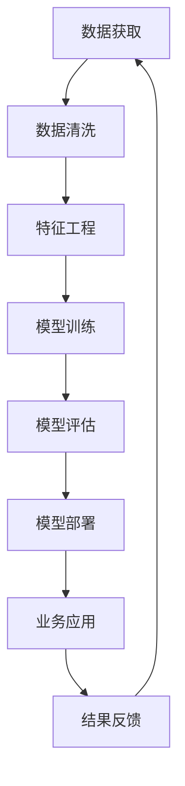

                 

# 洞察力的培养：从观察到预测的飞跃

> 关键词：洞察力,观察,预测,数据驱动,机器学习,人工智能,深度学习,神经网络,数据分析,决策优化

## 1. 背景介绍

### 1.1 问题由来

在当今信息爆炸的时代，数据的获取变得前所未有的便捷和高效。然而，面对海量数据，如何从中提取有价值的洞察，成为了一个重大挑战。传统的数据分析方法往往依赖于人工直觉和经验，效率低、效果差，且难以应对复杂多变的业务场景。

为了应对这一挑战，基于数据驱动的洞察力培养方法应运而生。通过结合机器学习和深度学习技术，可以从海量数据中自动发现规律、预测趋势，为决策者提供科学、准确的参考。这种从观察到预测的飞跃，极大提升了数据价值，推动了企业数字化转型升级。

### 1.2 问题核心关键点

基于数据驱动的洞察力培养方法，主要包括以下几个关键点：

1. **数据获取与清洗**：从各个数据源收集原始数据，并通过清洗、去重等处理，确保数据的质量和完整性。
2. **特征工程与建模**：利用数据预处理、特征提取等技术，将原始数据转化为模型可用的特征向量。
3. **模型训练与优化**：选择适合的机器学习或深度学习模型，进行模型训练和超参数调优，提升模型预测精度。
4. **模型评估与部署**：使用评估指标评估模型性能，并在生产环境中进行部署应用，实现自动化预测。

这些关键点构成了数据驱动洞察力培养的全过程，从数据到模型再到预测，每一步都需要精心设计和优化。

### 1.3 问题研究意义

洞察力的培养，对于提升企业的决策质量、优化运营管理、加速产品创新具有重要意义。通过对数据的深入分析和预测，企业能够：

1. **优化决策过程**：基于数据分析结果，制定更科学的决策方案，减少决策的盲目性。
2. **提升运营效率**：通过预测和优化，改进生产流程、供应链管理，降低运营成本。
3. **加速产品迭代**：利用用户行为数据进行市场分析，指导产品设计和改进，提升产品竞争力。
4. **拓展新业务机会**：挖掘潜在的市场趋势和用户需求，发现新的业务增长点。

因此，掌握基于数据驱动的洞察力培养方法，对于企业在激烈的市场竞争中保持领先，具有战略性意义。

## 2. 核心概念与联系

### 2.1 核心概念概述

为更好地理解数据驱动的洞察力培养方法，本节将介绍几个关键核心概念：

- **数据驱动**：指通过数据分析、机器学习等技术手段，从数据中提取有价值的洞察，驱动业务决策和运营管理。
- **洞察力**：指从数据中获取的知识、规律和趋势，用于指导业务决策和行动，提升业务绩效。
- **预测模型**：指通过机器学习算法，训练数据预测未来趋势或结果的模型。
- **特征工程**：指从原始数据中提取、筛选、构建特征向量，为模型训练提供高质量的输入数据。
- **数据清洗**：指通过清洗、去重、处理缺失值等方法，提升数据质量，减少噪声干扰。

这些概念之间紧密联系，共同构成数据驱动洞察力培养的核心框架。通过理解这些核心概念，我们可以更好地把握数据驱动洞察力培养的精髓。

### 2.2 核心概念原理和架构的 Mermaid 流程图



这个流程图展示了数据驱动洞察力培养的主要流程：

1. 从不同数据源获取原始数据。
2. 对数据进行清洗和处理，确保数据质量。
3. 进行特征工程，构建模型输入特征。
4. 选择合适模型进行训练，并进行超参数调优。
5. 对训练好的模型进行评估，确保预测准确性。
6. 将模型部署到生产环境，实现自动化预测。
7. 根据预测结果，进行业务决策和行动。
8. 收集预测结果反馈，优化模型和数据预处理流程。

以上流程图展示了数据驱动洞察力培养的完整流程，从数据获取到业务应用，每个环节都需要精心设计和优化。

## 3. 核心算法原理 & 具体操作步骤

### 3.1 算法原理概述

数据驱动的洞察力培养方法，本质上是一种基于数据和机器学习的预测建模范式。其核心思想是：通过数据分析和特征工程，将原始数据转化为模型可用的特征向量，训练模型进行预测，从而提取有价值的洞察。

形式化地，假设原始数据为 $D=\{(x_i,y_i)\}_{i=1}^N, x_i \in \mathcal{X}, y_i \in \mathcal{Y}$，其中 $\mathcal{X}$ 为输入空间，$\mathcal{Y}$ 为输出空间，$y_i$ 为真实标签。目标是找到函数 $f: \mathcal{X} \rightarrow \mathcal{Y}$，使得 $f(x_i)$ 与 $y_i$ 的误差最小化。

常见的预测模型包括线性回归、逻辑回归、支持向量机、决策树、随机森林、神经网络等。其中，神经网络由于其强大的非线性拟合能力，被广泛应用于复杂多变的预测任务。

### 3.2 算法步骤详解

基于数据驱动的洞察力培养方法，一般包括以下几个关键步骤：

**Step 1: 数据获取与清洗**

1. 从不同数据源获取原始数据，如数据库、日志文件、API接口等。
2. 对数据进行清洗和处理，包括去除重复数据、处理缺失值、处理异常值等。
3. 对清洗后的数据进行特征提取和筛选，生成特征向量 $X$。

**Step 2: 特征工程**

1. 对特征向量 $X$ 进行标准化和归一化处理，保证特征值在一个合理范围内。
2. 选择或设计特征，如PCA降维、特征选择算法等，减少特征维度。
3. 对特征进行编码和转换，如one-hot编码、标签编码等。

**Step 3: 模型训练**

1. 选择适合的预测模型，如线性回归、逻辑回归、神经网络等。
2. 将特征向量 $X$ 和标签 $y$ 划分为训练集和测试集，进行模型训练。
3. 使用交叉验证等方法进行模型超参数调优，提升模型性能。

**Step 4: 模型评估**

1. 使用测试集评估模型性能，计算评估指标如均方误差、准确率、召回率等。
2. 对模型进行可视化分析，了解模型预测效果。
3. 根据评估结果调整模型和特征工程策略。

**Step 5: 模型部署**

1. 将训练好的模型部署到生产环境，如Kubernetes、AWS、Azure等。
2. 集成模型到应用系统中，实现自动化预测。
3. 对模型进行监控和维护，确保稳定运行。

### 3.3 算法优缺点

数据驱动的洞察力培养方法具有以下优点：

1. **数据驱动**：模型预测结果完全基于数据，避免了人工决策的偏见和主观性。
2. **自动化预测**：模型自动从数据中提取洞察，提供自动化预测，提升决策效率。
3. **可扩展性**：模型易于集成到现有业务系统中，支持大规模应用。
4. **动态调整**：模型可以根据业务需求和数据变化进行动态调整，提升预测精度。

同时，该方法也存在以下局限性：

1. **数据质量依赖**：模型的预测结果依赖于数据的质量和完整性，数据噪音会影响预测效果。
2. **模型复杂性**：复杂的模型可能需要更多的数据和计算资源，不易解释和优化。
3. **过拟合风险**：模型可能过度拟合训练数据，导致泛化能力不足。
4. **模型部署难度**：模型部署和维护需要较高的技术门槛，需要专业的数据科学家和工程师支持。

尽管存在这些局限性，但就目前而言，数据驱动的洞察力培养方法仍是大数据应用的重要手段。未来相关研究的重点在于如何进一步降低模型对数据的依赖，提高模型的鲁棒性和可解释性，同时兼顾自动化和人类解释的结合。

### 3.4 算法应用领域

数据驱动的洞察力培养方法，在众多领域得到了广泛应用，例如：

- **金融风控**：通过用户行为数据进行信用评分和风险预测，防范金融风险。
- **电商推荐**：利用用户行为数据进行商品推荐，提升用户体验和销售转化率。
- **医疗诊断**：通过患者数据进行疾病预测和诊断，辅助医生决策。
- **智能交通**：利用交通数据进行流量预测和调度，优化交通管理。
- **社交媒体分析**：通过用户行为数据进行舆情分析和趋势预测，指导内容运营。
- **智能客服**：利用用户对话数据进行情感分析和意图识别，提升服务质量。

除了上述这些经典应用外，数据驱动的洞察力培养方法还在更多场景中得到创新应用，如供应链优化、广告投放、情感分析等，为各行各业带来了新的价值创造。

## 4. 数学模型和公式 & 详细讲解 & 举例说明

### 4.1 数学模型构建

假设原始数据为 $D=\{(x_i,y_i)\}_{i=1}^N$，其中 $x_i \in \mathcal{X}$ 为输入，$y_i \in \mathcal{Y}$ 为标签。目标是训练模型 $f: \mathcal{X} \rightarrow \mathcal{Y}$，使得 $f(x_i)$ 与 $y_i$ 的误差最小化。

常见的预测模型包括线性回归模型和神经网络模型。以线性回归为例，其数学模型可以表示为：

$$
f(x) = \theta^T x + b
$$

其中 $\theta$ 为模型参数，$b$ 为截距。

### 4.2 公式推导过程

以线性回归为例，其梯度下降优化目标为：

$$
\min_{\theta} \frac{1}{2N} \sum_{i=1}^N (y_i - f(x_i))^2
$$

其梯度为：

$$
\nabla_{\theta} \mathcal{L} = \frac{1}{N} \sum_{i=1}^N (y_i - f(x_i))x_i
$$

通过反向传播算法，可计算模型参数 $\theta$ 的更新量，迭代优化模型。

### 4.3 案例分析与讲解

以电商推荐为例，假设电商网站需要根据用户的历史购买记录，预测其对不同商品的偏好。

**Step 1: 数据获取与清洗**

1. 从电商网站的数据库中获取用户购买记录和商品信息。
2. 对数据进行清洗和处理，包括去除重复数据、处理缺失值、处理异常值等。
3. 对清洗后的数据进行特征提取和筛选，生成特征向量 $X$。

**Step 2: 特征工程**

1. 对特征向量 $X$ 进行标准化和归一化处理，保证特征值在一个合理范围内。
2. 选择或设计特征，如PCA降维、特征选择算法等，减少特征维度。
3. 对特征进行编码和转换，如one-hot编码、标签编码等。

**Step 3: 模型训练**

1. 选择线性回归模型，将特征向量 $X$ 和标签 $y$ 划分为训练集和测试集，进行模型训练。
2. 使用交叉验证等方法进行模型超参数调优，提升模型性能。

**Step 4: 模型评估**

1. 使用测试集评估模型性能，计算评估指标如均方误差、准确率、召回率等。
2. 对模型进行可视化分析，了解模型预测效果。
3. 根据评估结果调整模型和特征工程策略。

**Step 5: 模型部署**

1. 将训练好的模型部署到电商网站，集成到推荐系统中，实现自动化推荐。
2. 对模型进行监控和维护，确保稳定运行。

## 5. 项目实践：代码实例和详细解释说明

### 5.1 开发环境搭建

在进行项目实践前，我们需要准备好开发环境。以下是使用Python进行Scikit-learn开发的环境配置流程：

1. 安装Anaconda：从官网下载并安装Anaconda，用于创建独立的Python环境。

2. 创建并激活虚拟环境：
```bash
conda create -n scikit-learn-env python=3.8 
conda activate scikit-learn-env
```

3. 安装Scikit-learn：
```bash
pip install scikit-learn
```

4. 安装各类工具包：
```bash
pip install numpy pandas scikit-learn matplotlib tqdm jupyter notebook ipython
```

完成上述步骤后，即可在`scikit-learn-env`环境中开始项目实践。

### 5.2 源代码详细实现

这里我们以电商推荐任务为例，给出使用Scikit-learn进行线性回归模型的PyTorch代码实现。

首先，定义电商推荐任务的数据处理函数：

```python
import pandas as pd
from sklearn.model_selection import train_test_split
from sklearn.preprocessing import StandardScaler, OneHotEncoder
from sklearn.compose import ColumnTransformer
from sklearn.pipeline import Pipeline
from sklearn.linear_model import LinearRegression
from sklearn.metrics import mean_squared_error

# 读取数据
data = pd.read_csv('user_basket.csv')

# 划分训练集和测试集
X = data[['item1', 'item2', 'item3']]
y = data['sales']
X_train, X_test, y_train, y_test = train_test_split(X, y, test_size=0.2, random_state=42)

# 标准化处理
scaler = StandardScaler()
X_train_scaled = scaler.fit_transform(X_train)
X_test_scaled = scaler.transform(X_test)

# 编码处理
encoder = OneHotEncoder()
X_train_encoded = encoder.fit_transform(X_train_scaled)
X_test_encoded = encoder.transform(X_test_scaled)

# 合并特征
X_train = pd.DataFrame(X_train_encoded, columns=encoder.get_feature_names_out())
X_test = pd.DataFrame(X_test_encoded, columns=encoder.get_feature_names_out())

# 模型训练
model = LinearRegression()
model.fit(X_train, y_train)

# 模型评估
y_pred = model.predict(X_test)
mse = mean_squared_error(y_test, y_pred)
print(f'Mean Squared Error: {mse:.2f}')
```

然后，定义模型训练和评估函数：

```python
def train_model(model, X_train, y_train, X_test, y_test):
    model.fit(X_train, y_train)
    y_pred = model.predict(X_test)
    mse = mean_squared_error(y_test, y_pred)
    return mse

def evaluate_model(model, X_test, y_test):
    y_pred = model.predict(X_test)
    mse = mean_squared_error(y_test, y_pred)
    return mse
```

最后，启动训练流程并在测试集上评估：

```python
model = Pipeline([
    ('scaler', StandardScaler()),
    ('encoder', OneHotEncoder()),
    ('model', LinearRegression())
])

mse_train = train_model(model, X_train, y_train, X_test, y_test)
print(f'Training MSE: {mse_train:.2f}')

mse_test = evaluate_model(model, X_test, y_test)
print(f'Test MSE: {mse_test:.2f}')
```

以上就是使用Scikit-learn进行电商推荐任务线性回归模型的完整代码实现。可以看到，Scikit-learn提供了丰富的机器学习算法和工具，使得模型训练和评估变得简洁高效。

### 5.3 代码解读与分析

让我们再详细解读一下关键代码的实现细节：

**数据处理函数**：
- 从CSV文件中读取电商用户购买数据。
- 将数据划分为训练集和测试集。
- 对特征进行标准化和编码处理。
- 合并特征，生成模型训练和评估所需的输入数据。

**模型训练函数**：
- 定义线性回归模型。
- 将标准化和编码后的特征数据传入模型进行训练。

**模型评估函数**：
- 使用测试集评估模型性能，计算均方误差。

**训练流程**：
- 定义线性回归模型，包括标准化、编码和线性回归等步骤。
- 在训练集上进行模型训练，输出训练集均方误差。
- 在测试集上进行模型评估，输出测试集均方误差。

可以看到，Scikit-learn提供了方便的API接口，使得数据预处理、模型训练和评估变得非常简洁。开发者可以利用Scikit-learn强大的封装能力，快速实现复杂的机器学习任务。

当然，工业级的系统实现还需考虑更多因素，如模型参数优化、模型评估指标、特征工程策略等。但核心的模型训练和评估逻辑基本与此类似。

## 6. 实际应用场景

### 6.1 智能客服系统

基于数据驱动的洞察力培养方法，可以广泛应用于智能客服系统的构建。传统客服往往需要配备大量人力，高峰期响应缓慢，且一致性和专业性难以保证。通过机器学习和深度学习技术，智能客服系统能够自动理解用户意图，匹配最合适的答案模板进行回复。

在技术实现上，可以收集企业内部的历史客服对话记录，将问题和最佳答复构建成监督数据，在此基础上训练预测模型。预测模型能够自动理解用户意图，匹配最合适的答案模板进行回复。对于客户提出的新问题，还可以接入检索系统实时搜索相关内容，动态组织生成回答。如此构建的智能客服系统，能大幅提升客户咨询体验和问题解决效率。

### 6.2 金融舆情监测

金融机构需要实时监测市场舆论动向，以便及时应对负面信息传播，规避金融风险。传统的舆情监测方法往往依赖人工，成本高、效率低，难以应对网络时代海量信息爆发的挑战。通过机器学习和深度学习技术，可以构建金融舆情监测系统，自动监测不同主题下的情感变化趋势，一旦发现负面信息激增等异常情况，系统便会自动预警，帮助金融机构快速应对潜在风险。

在技术实现上，可以收集金融领域相关的新闻、报道、评论等文本数据，并对其进行情感标注。在此基础上训练预测模型，使其能够自动判断文本的情感倾向，从而监测不同主题下的舆情变化。

### 6.3 个性化推荐系统

当前的推荐系统往往只依赖用户的历史行为数据进行物品推荐，无法深入理解用户的真实兴趣偏好。通过机器学习和深度学习技术，可以构建个性化推荐系统，利用用户行为数据进行市场分析，指导产品设计和改进，提升产品竞争力。

在技术实现上，可以收集用户浏览、点击、评论、分享等行为数据，提取和用户交互的物品标题、描述、标签等文本内容。将文本内容作为模型输入，用户的后续行为（如是否点击、购买等）作为监督信号，在此基础上训练预测模型。预测模型能够从文本内容中准确把握用户的兴趣点，在生成推荐列表时，先用候选物品的文本描述作为输入，由模型预测用户的兴趣匹配度，再结合其他特征综合排序，便可以得到个性化程度更高的推荐结果。

### 6.4 未来应用展望

随着数据驱动的洞察力培养方法的发展，未来其在更多领域将得到应用，为传统行业带来变革性影响。

在智慧医疗领域，通过患者数据进行疾病预测和诊断，辅助医生决策，提升诊疗效率和准确性。

在智能教育领域，利用用户行为数据进行学情分析，指导内容运营，实现因材施教。

在智慧城市治理中，利用交通数据进行流量预测和调度，优化交通管理，减少交通拥堵。

此外，在企业生产、社会治理、文娱传媒等众多领域，数据驱动的洞察力培养方法也将不断涌现，为各行各业带来新的价值创造。相信随着技术的日益成熟，数据驱动的洞察力培养方法将引领各行各业的数字化转型，推动社会进步。

## 7. 工具和资源推荐

### 7.1 学习资源推荐

为了帮助开发者系统掌握数据驱动的洞察力培养方法，这里推荐一些优质的学习资源：

1. 《机器学习》课程：斯坦福大学开设的入门级机器学习课程，通俗易懂，适合初学者学习。

2. 《深度学习》课程：斯坦福大学开设的深度学习课程，内容全面，涵盖了深度学习的基础和进阶内容。

3. 《Python数据分析》书籍：介绍了使用Python进行数据清洗、数据可视化、数据分析和机器学习的详细方法。

4. Kaggle数据集和竞赛：Kaggle提供大量的开源数据集和机器学习竞赛，是数据驱动洞察力培养实践的绝佳平台。

5. Coursera在线课程：Coursera提供丰富的机器学习和深度学习课程，涵盖各个领域和难度等级，适合不同层次的学习者。

通过对这些资源的学习实践，相信你一定能够快速掌握数据驱动的洞察力培养方法，并用于解决实际的业务问题。

### 7.2 开发工具推荐

高效的开发离不开优秀的工具支持。以下是几款用于数据驱动洞察力培养开发的常用工具：

1. Scikit-learn：Python的机器学习库，提供了丰富的算法和工具，适合各种数据预处理和建模任务。

2. TensorFlow：由Google主导开发的深度学习框架，生产部署方便，适合大规模工程应用。

3. PyTorch：基于Python的深度学习框架，灵活动态，适合研究和实验。

4. H2O：开源的机器学习平台，支持分布式计算，适合处理大规模数据。

5. Apache Spark：大数据处理框架，支持分布式数据处理，适合大规模数据挖掘和机器学习任务。

6. Jupyter Notebook：开源的交互式计算环境，支持Python、R等多种语言，适合快速迭代和实验。

合理利用这些工具，可以显著提升数据驱动洞察力培养任务的开发效率，加快创新迭代的步伐。

### 7.3 相关论文推荐

数据驱动的洞察力培养方法的发展，离不开学界的持续研究。以下是几篇奠基性的相关论文，推荐阅读：

1. 《在线广告商流量预测》（The LinCOLT Algorithm）：通过在线学习算法，实时预测广告商流量，优化广告投放策略。

2. 《用户兴趣预测》（A Probabilistic Model for Interest Prediction）：基于协同过滤算法，预测用户对不同商品的兴趣，推荐商品。

3. 《金融风控信用评分模型》（A Framework for Predictive Modeling）：构建信用评分模型，预测用户信用风险。

4. 《智能客服系统》（An Intelligent Customer Service System）：通过自然语言处理技术，实现智能客服对话。

5. 《智能推荐系统》（Recommender Systems）：介绍推荐系统原理和算法，涵盖基于内容的推荐、协同过滤推荐等多种技术。

这些论文代表了大数据驱动洞察力培养的发展脉络。通过学习这些前沿成果，可以帮助研究者把握学科前进方向，激发更多的创新灵感。

## 8. 总结：未来发展趋势与挑战

### 8.1 总结

本文对数据驱动的洞察力培养方法进行了全面系统的介绍。首先阐述了数据驱动洞察力培养的研究背景和意义，明确了其在提升决策质量、优化运营管理、加速产品创新方面的独特价值。其次，从原理到实践，详细讲解了数据预处理、特征工程、模型训练和评估等关键步骤，给出了完整的项目实践代码。同时，本文还广泛探讨了数据驱动洞察力培养方法在多个行业领域的应用前景，展示了其广阔的应用空间。

通过本文的系统梳理，可以看到，数据驱动的洞察力培养方法在提升业务决策效率、优化运营管理、加速产品创新等方面具有显著优势。然而，在实际应用中，该方法仍面临诸多挑战，如数据质量、模型复杂性、部署难度等。如何进一步优化数据预处理流程，降低模型复杂度，提升模型可解释性，将是未来研究的重要方向。

### 8.2 未来发展趋势

展望未来，数据驱动的洞察力培养方法将呈现以下几个发展趋势：

1. **自动化和智能化**：随着自动机器学习（AutoML）技术的发展，数据预处理、特征工程、模型训练等流程将逐渐自动化，减少人工干预，提升效率。
2. **多模态数据融合**：将视觉、语音、文本等多种模态的数据进行融合，构建更加全面、准确的洞察力培养模型。
3. **模型解释性增强**：利用可解释性技术，如LIME、SHAP等，提升模型的可解释性，帮助用户理解模型决策过程。
4. **实时数据处理**：利用流处理技术和实时计算引擎，构建实时洞察力培养系统，及时捕捉和分析数据变化。
5. **跨领域知识融合**：将领域知识和专家经验与数据驱动模型结合，提升模型的综合能力。

以上趋势展示了数据驱动洞察力培养方法的未来方向，相信随着技术的不断进步，数据驱动洞察力培养方法将得到更广泛的应用，为各行各业带来更多的价值。

### 8.3 面临的挑战

尽管数据驱动的洞察力培养方法已经取得了显著成就，但在实际应用中，仍面临诸多挑战：

1. **数据质量依赖**：模型的预测结果依赖于数据的质量和完整性，数据噪音和缺失值会影响预测效果。
2. **模型复杂性**：复杂的模型可能需要更多的数据和计算资源，不易解释和优化。
3. **部署难度高**：模型部署和维护需要较高的技术门槛，需要专业的数据科学家和工程师支持。
4. **数据隐私和安全**：数据驱动洞察力培养需要收集大量用户数据，如何保护数据隐私和安全，是一个重要问题。
5. **模型泛化能力不足**：模型可能过度拟合训练数据，导致泛化能力不足，影响实际应用效果。

尽管存在这些挑战，但数据驱动的洞察力培养方法仍是大数据应用的重要手段。未来相关研究的重点在于如何进一步优化数据预处理流程，降低模型复杂度，提升模型可解释性，同时兼顾自动化和人类解释的结合。

### 8.4 研究展望

面向未来，数据驱动的洞察力培养方法需要在以下几个方面进行深入研究：

1. **自动化和智能化**：通过自动化机器学习技术，优化数据预处理、特征工程和模型训练流程，提升效率和精度。
2. **模型解释性增强**：利用可解释性技术，提升模型的可解释性，帮助用户理解模型决策过程。
3. **多模态数据融合**：将视觉、语音、文本等多种模态的数据进行融合，构建更加全面、准确的洞察力培养模型。
4. **跨领域知识融合**：将领域知识和专家经验与数据驱动模型结合，提升模型的综合能力。
5. **实时数据处理**：利用流处理技术和实时计算引擎，构建实时洞察力培养系统，及时捕捉和分析数据变化。

这些研究方向将进一步推动数据驱动洞察力培养方法的发展，为各行各业带来更多的价值。

## 9. 附录：常见问题与解答

**Q1：数据驱动洞察力培养是否适用于所有业务场景？**

A: 数据驱动洞察力培养方法适用于大多数业务场景，特别是数据量大、业务复杂、决策需求强的领域。但对于一些特定领域，如医疗、法律等，仅仅依靠通用数据可能难以很好地适应，需要针对特定领域的数据和业务特点进行定制化设计。

**Q2：如何提高数据驱动洞察力培养的模型泛化能力？**

A: 提高模型泛化能力的方法包括：
1. 增加数据量：通过数据增强和数据扩充，增加训练数据的多样性和数量。
2. 采用正则化技术：如L2正则、Dropout等，防止模型过拟合。
3. 使用交叉验证：通过交叉验证技术，评估模型在多个数据集上的表现，选择泛化能力强的模型。
4. 引入先验知识：将领域知识和专家经验与数据驱动模型结合，提升模型的综合能力。

**Q3：数据驱动洞察力培养对数据质量有什么要求？**

A: 数据驱动洞察力培养对数据质量有较高要求，主要包括以下几个方面：
1. 数据完整性：数据应该尽量完整，避免缺失和重复。
2. 数据准确性：数据应该真实反映实际情况，避免数据噪音和偏差。
3. 数据一致性：数据应该在不同来源和不同时间点保持一致性，避免数据不一致和冲突。
4. 数据规模：数据应该具有足够的规模，避免数据过少导致模型泛化能力不足。

通过提高数据质量，可以显著提升数据驱动洞察力培养的预测效果。

**Q4：数据驱动洞察力培养在业务应用中需要注意哪些问题？**

A: 数据驱动洞察力培养在业务应用中需要注意以下几个问题：
1. 数据隐私和安全：在数据驱动洞察力培养过程中，需要确保数据隐私和安全，避免数据泄露和滥用。
2. 模型可解释性：在业务应用中，需要确保模型的可解释性，帮助用户理解模型决策过程。
3. 模型部署和管理：在业务应用中，需要将模型部署到生产环境，进行持续监控和维护，确保模型稳定运行。
4. 业务反馈和调整：在业务应用中，需要根据业务反馈，及时调整模型和数据预处理策略，提升模型性能。

通过对这些问题进行全面考虑和优化，可以确保数据驱动洞察力培养在业务应用中发挥最大价值。

---

作者：禅与计算机程序设计艺术 / Zen and the Art of Computer Programming

