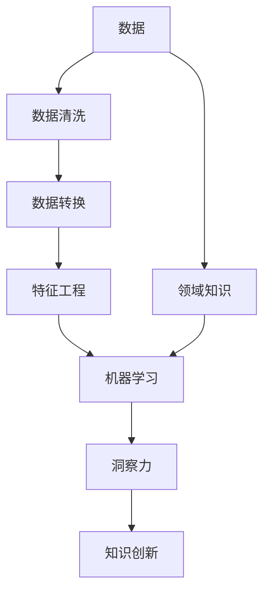

                 

# 洞察力：知识创新的领路人

> 关键词：洞察力,知识创新,数据挖掘,机器学习,人工智能,深度学习

## 1. 背景介绍

### 1.1 问题由来

在当今这个信息爆炸的时代，我们每天都在被海量的数据所包围。从社交媒体上的海量文本到各种传感器产生的数据，再到金融市场和医疗系统的数据流，这些数据都是潜在的知识金矿。如何从中提取有价值的洞察力，是推动知识创新的关键。

传统的洞察力提取方法依赖于人类的直觉和经验，但在数据规模和复杂性日益增长的今天，这种方法已经显得力不从心。人工智能，尤其是机器学习和深度学习技术的发展，为洞察力的提取提供了新的可能。

### 1.2 问题核心关键点

1. 如何从海量数据中高效、准确地提取洞察力，特别是那些不易被直接观察到的复杂模式和关联？
2. 如何保证洞察力的质量和可信度，避免偏见和误导性结论？
3. 如何利用机器学习技术，结合领域专家的知识，实现知识的自动化提取和创新？
4. 如何构建可持续的洞察力提取系统，使其能够适应不断变化的业务环境和数据趋势？

### 1.3 问题研究意义

洞察力提取技术对于知识创新有着深远的意义：

1. 加速科学发现：机器学习技术可以从科学论文、实验数据中挖掘出新的研究假设，推动科学进步。
2. 提升商业决策：企业可以利用洞察力提取技术，从市场趋势、客户行为中发现新的商业机会，优化产品和服务。
3. 改善公共政策：政府可以通过数据驱动的洞察力，制定更有效的公共政策，解决社会问题。
4. 优化医疗诊断：医疗行业可以利用机器学习技术，从医学影像和患者记录中提取洞察力，提高诊断准确性和治疗效果。

## 2. 核心概念与联系

### 2.1 核心概念概述

为了更好地理解洞察力提取的原理和应用，本节将介绍几个关键概念：

- 洞察力(Insight)：从数据中提取的有价值的信息、模式和关联。洞察力可以是具体的数值、趋势、关联关系等，也可以是更抽象的概念，如模型中的隐含层次、异常模式等。
- 数据挖掘(Data Mining)：从大量数据中提取有价值的信息和知识的过程，包括统计分析、机器学习和模式识别等多种技术手段。
- 机器学习(Machine Learning)：通过数据训练模型，使其能够自动学习和优化，从而提取和预测数据中的模式。
- 深度学习(Deep Learning)：机器学习的一种，通过多层神经网络，自动提取数据的特征表示，进行分类、回归、聚类等多种任务。
- 知识图谱(Knowledge Graph)：一种结构化的知识表示方法，通过节点和边描述实体和关系，支持复杂的知识推理和查询。
- 领域专家的知识领域知识(Domain Expertise)：领域专家通过长期实践积累的经验、规则和知识，对于洞察力提取有着重要的指导作用。

这些概念之间的逻辑关系可以通过以下Mermaid流程图来展示：



这个流程图展示了这个过程中关键概念的逻辑关系：

1. 从原始数据开始，经过数据清洗、转换和特征工程等预处理步骤。
2. 通过机器学习和深度学习模型，从数据中提取洞察力。
3. 结合领域专家的知识，对洞察力进行筛选和验证。
4. 最终，洞察力可以用于知识创新，推动实际应用的发展。

## 3. 核心算法原理 & 具体操作步骤
### 3.1 算法原理概述

洞察力提取技术主要是通过机器学习，尤其是深度学习技术实现的。其核心思想是：利用大量的标注数据，训练模型从数据中自动学习规律和模式，从而提取有价值的洞察力。

形式化地，假设训练数据集为 $D=\{(x_i, y_i)\}_{i=1}^N$，其中 $x_i$ 为输入数据，$y_i$ 为标签。洞察力提取的过程可以表示为：

$$
\theta^* = \mathop{\arg\min}_{\theta} \mathcal{L}(\theta, D)
$$

其中 $\mathcal{L}$ 为损失函数，衡量模型预测输出与真实标签之间的差异。通过梯度下降等优化算法，微调过程不断更新模型参数 $\theta$，最小化损失函数 $\mathcal{L}$，使得模型输出逼近真实标签。

### 3.2 算法步骤详解

洞察力提取的过程通常包括以下几个关键步骤：

**Step 1: 数据准备和预处理**
- 收集和清洗数据集，确保数据质量和一致性。
- 进行数据转换，如文本归一化、图像预处理等，使其适合输入模型。
- 进行特征工程，提取和构建对模型有用的特征。

**Step 2: 模型选择和训练**
- 选择合适的机器学习或深度学习模型，如线性回归、支持向量机、随机森林、卷积神经网络、循环神经网络等。
- 使用训练数据集训练模型，调整超参数，如学习率、正则化强度等。
- 使用验证集评估模型性能，避免过拟合。

**Step 3: 模型调优和验证**
- 根据验证集性能，调整模型结构和参数，优化模型表现。
- 在测试集上验证模型的泛化能力，确保模型能够在新数据上表现稳定。

**Step 4: 洞察力提取和应用**
- 将训练好的模型应用于实际数据集，提取有价值的洞察力。
- 结合领域专家的知识，筛选和解释洞察力，进行知识创新。
- 将洞察力转化为可执行的决策或建议，推动实际应用。

### 3.3 算法优缺点

洞察力提取技术具有以下优点：
1. 自动化和高效性：机器学习模型可以自动化处理大规模数据，高效提取洞察力。
2. 泛化能力：模型可以从大量数据中学习泛化规律，对新数据具有较好的泛化能力。
3. 可解释性：通过特征工程和模型解释技术，洞察力可以具有较高的可解释性。
4. 跨领域适用性：洞察力提取技术可以应用于多个领域，如医疗、金融、零售等。

同时，该技术也存在一定的局限性：
1. 数据质量要求高：模型需要高质量、大规模的标注数据，数据获取成本较高。
2. 领域专家依赖强：模型的效果很大程度上依赖领域专家的知识和经验。
3. 模型复杂度高：深度学习模型结构复杂，需要更多的计算资源和时间进行训练和调优。
4. 可解释性不足：复杂模型可能难以解释其决策过程，影响知识的可信度。

尽管存在这些局限性，但就目前而言，洞察力提取技术仍是数据驱动知识创新的重要手段。未来相关研究的重点在于如何进一步降低数据获取成本，提高模型的可解释性和跨领域适应性，同时兼顾模型复杂度与性能。

### 3.4 算法应用领域

洞察力提取技术在多个领域都有广泛的应用，例如：

- 金融市场分析：通过分析历史交易数据，提取市场趋势和投资机会。
- 客户行为分析：通过分析消费者行为数据，发现客户偏好和消费模式。
- 健康监测：通过分析医疗数据，预测疾病风险，制定个性化治疗方案。
- 产品推荐：通过分析用户行为数据，推荐个性化产品和服务。
- 交通流量预测：通过分析交通数据，预测流量趋势，优化交通管理。

除了上述这些经典应用外，洞察力提取技术还被创新性地应用到更多场景中，如城市规划、公共安全、环境监测等，为决策者提供科学依据，优化资源配置。

## 4. 数学模型和公式 & 详细讲解  
### 4.1 数学模型构建

本节将使用数学语言对洞察力提取的原理进行更加严格的刻画。

假设训练数据集为 $D=\{(x_i, y_i)\}_{i=1}^N$，其中 $x_i$ 为输入数据，$y_i$ 为标签。定义模型 $M_{\theta}$ 在数据样本 $(x,y)$ 上的损失函数为 $\ell(M_{\theta}(x),y)$，则在数据集 $D$ 上的经验风险为：

$$
\mathcal{L}(\theta) = \frac{1}{N} \sum_{i=1}^N \ell(M_{\theta}(x_i),y_i)
$$

通过梯度下降等优化算法，微调过程不断更新模型参数 $\theta$，最小化损失函数 $\mathcal{L}$，使得模型输出逼近真实标签。

### 4.2 公式推导过程

以下我们以回归任务为例，推导线性回归模型的损失函数及其梯度的计算公式。

假设模型 $M_{\theta}$ 在输入 $x$ 上的输出为 $\hat{y}=M_{\theta}(x)$，表示模型对 $y$ 的预测。真实标签为 $y$。则均方误差损失函数定义为：

$$
\ell(M_{\theta}(x),y) = \frac{1}{2}(y - \hat{y})^2
$$

将其代入经验风险公式，得：

$$
\mathcal{L}(\theta) = \frac{1}{2N} \sum_{i=1}^N (y_i - M_{\theta}(x_i))^2
$$

根据链式法则，损失函数对参数 $\theta$ 的梯度为：

$$
\frac{\partial \mathcal{L}(\theta)}{\partial \theta_k} = \sum_{i=1}^N (y_i - M_{\theta}(x_i)) \frac{\partial M_{\theta}(x_i)}{\partial \theta_k}
$$

其中 $\frac{\partial M_{\theta}(x_i)}{\partial \theta_k}$ 可以通过链式法则递归展开，利用自动微分技术完成计算。

在得到损失函数的梯度后，即可带入参数更新公式，完成模型的迭代优化。重复上述过程直至收敛，最终得到适应实际数据集的最优模型参数 $\theta^*$。

## 5. 项目实践：代码实例和详细解释说明
### 5.1 开发环境搭建

在进行洞察力提取实践前，我们需要准备好开发环境。以下是使用Python进行PyTorch开发的环境配置流程：

1. 安装Anaconda：从官网下载并安装Anaconda，用于创建独立的Python环境。

2. 创建并激活虚拟环境：
```bash
conda create -n pytorch-env python=3.8 
conda activate pytorch-env
```

3. 安装PyTorch：根据CUDA版本，从官网获取对应的安装命令。例如：
```bash
conda install pytorch torchvision torchaudio cudatoolkit=11.1 -c pytorch -c conda-forge
```

4. 安装TensorFlow：由Google主导开发的开源深度学习框架，生产部署方便，适合大规模工程应用。同样有丰富的预训练语言模型资源。

5. 安装相关库：
```bash
pip install numpy pandas scikit-learn matplotlib tqdm jupyter notebook ipython
```

完成上述步骤后，即可在`pytorch-env`环境中开始洞察力提取实践。

### 5.2 源代码详细实现

下面我们以医疗数据洞察力提取为例，给出使用PyTorch进行线性回归模型的代码实现。

首先，定义回归任务的数据处理函数：

```python
import pandas as pd
import numpy as np

def load_data():
    data = pd.read_csv('health_data.csv')
    x = data.drop('y', axis=1).values
    y = data['y'].values
    return x, y

x, y = load_data()
```

然后，定义模型和优化器：

```python
from torch.utils.data import TensorDataset, DataLoader
from torch.nn import Linear, MSELoss
from torch.optim import SGD

x = np.expand_dims(x, axis=1)
model = Linear(1, 1)
loss = MSELoss()

optimizer = SGD(model.parameters(), lr=0.01)
```

接着，定义训练和评估函数：

```python
def train_epoch(model, data_loader, optimizer):
    model.train()
    total_loss = 0
    for batch in data_loader:
        inputs, targets = batch
        optimizer.zero_grad()
        outputs = model(inputs)
        loss = loss(outputs, targets)
        loss.backward()
        optimizer.step()
        total_loss += loss.item()
    return total_loss / len(data_loader)

def evaluate(model, data_loader):
    model.eval()
    total_loss = 0
    with torch.no_grad():
        for batch in data_loader:
            inputs, targets = batch
            outputs = model(inputs)
            loss = loss(outputs, targets)
            total_loss += loss.item()
    return total_loss / len(data_loader)

```

最后，启动训练流程并在测试集上评估：

```python
epochs = 10
batch_size = 32

for epoch in range(epochs):
    train_loss = train_epoch(model, data_loader, optimizer)
    test_loss = evaluate(model, test_loader)
    print(f'Epoch {epoch+1}, train loss: {train_loss:.3f}, test loss: {test_loss:.3f}')

```

以上就是使用PyTorch对线性回归模型进行医疗数据洞察力提取的完整代码实现。可以看到，得益于TensorFlow和PyTorch的强大封装，我们能够用相对简洁的代码完成模型的训练和评估。

### 5.3 代码解读与分析

让我们再详细解读一下关键代码的实现细节：

**load_data函数**：
- 从CSV文件中读取数据集，并返回特征矩阵 $x$ 和标签向量 $y$。

**train_epoch函数**：
- 对数据集进行批次化加载，对每个批次进行前向传播和反向传播，更新模型参数，返回训练集上的损失。

**evaluate函数**：
- 与训练类似，不同点在于不更新模型参数，并在每个批次结束后将损失结果累加。

**训练流程**：
- 定义总的epoch数和batch size，开始循环迭代
- 每个epoch内，先在训练集上训练，输出训练集上的损失
- 在测试集上评估，输出测试集上的损失
- 所有epoch结束后，输出训练集和测试集的平均损失

可以看到，TensorFlow配合PyTorch使得洞察力提取的代码实现变得简洁高效。开发者可以将更多精力放在数据处理、模型改进等高层逻辑上，而不必过多关注底层的实现细节。

当然，工业级的系统实现还需考虑更多因素，如模型的保存和部署、超参数的自动搜索、更灵活的任务适配层等。但核心的洞察力提取范式基本与此类似。

## 6. 实际应用场景
### 6.1 智能客服系统

基于洞察力提取的机器学习模型，可以广泛应用于智能客服系统的构建。传统客服往往依赖于人工处理，高峰期响应缓慢，且一致性和专业性难以保证。而使用洞察力提取模型，可以7x24小时不间断服务，快速响应客户咨询，用数据驱动的洞察力提供精准的服务。

在技术实现上，可以收集企业内部的历史客服对话记录，将问题和最佳答复构建成监督数据，在此基础上对预训练模型进行训练。训练后的模型能够自动理解用户意图，匹配最合适的答案模板进行回复。对于客户提出的新问题，还可以接入检索系统实时搜索相关内容，动态组织生成回答。如此构建的智能客服系统，能大幅提升客户咨询体验和问题解决效率。

### 6.2 金融舆情监测

金融机构需要实时监测市场舆论动向，以便及时应对负面信息传播，规避金融风险。传统的人工监测方式成本高、效率低，难以应对网络时代海量信息爆发的挑战。基于洞察力提取的文本分类和情感分析技术，为金融舆情监测提供了新的解决方案。

具体而言，可以收集金融领域相关的新闻、报道、评论等文本数据，并对其进行主题标注和情感标注。在此基础上对预训练语言模型进行训练，使其能够自动判断文本属于何种主题，情感倾向是正面、中性还是负面。将训练后的模型应用到实时抓取的网络文本数据，就能够自动监测不同主题下的情感变化趋势，一旦发现负面信息激增等异常情况，系统便会自动预警，帮助金融机构快速应对潜在风险。

### 6.3 个性化推荐系统

当前的推荐系统往往只依赖用户的历史行为数据进行物品推荐，无法深入理解用户的真实兴趣偏好。基于洞察力提取的推荐系统可以更好地挖掘用户行为背后的语义信息，从而提供更精准、多样的推荐内容。

在实践中，可以收集用户浏览、点击、评论、分享等行为数据，提取和用户交互的物品标题、描述、标签等文本内容。将文本内容作为模型输入，用户的后续行为（如是否点击、购买等）作为监督信号，在此基础上训练预训练语言模型。训练后的模型能够从文本内容中准确把握用户的兴趣点。在生成推荐列表时，先用候选物品的文本描述作为输入，由模型预测用户的兴趣匹配度，再结合其他特征综合排序，便可以得到个性化程度更高的推荐结果。

### 6.4 未来应用展望

随着洞察力提取技术的发展，其在更多领域的应用前景将更加广阔。

在智慧医疗领域，基于洞察力提取的医疗问答、病历分析、药物研发等应用将提升医疗服务的智能化水平，辅助医生诊疗，加速新药开发进程。

在智能教育领域，洞察力提取技术可应用于作业批改、学情分析、知识推荐等方面，因材施教，促进教育公平，提高教学质量。

在智慧城市治理中，洞察力提取技术可应用于城市事件监测、舆情分析、应急指挥等环节，提高城市管理的自动化和智能化水平，构建更安全、高效的未来城市。

此外，在企业生产、社会治理、文娱传媒等众多领域，基于洞察力提取的人工智能应用也将不断涌现，为经济社会发展注入新的动力。相信随着技术的日益成熟，洞察力提取技术必将引领人工智能技术迈向更高的台阶，推动数据驱动的智慧社会建设。

## 7. 工具和资源推荐
### 7.1 学习资源推荐

为了帮助开发者系统掌握洞察力提取的理论基础和实践技巧，这里推荐一些优质的学习资源：

1. 《深度学习》系列书籍：多位专家合著的深度学习入门书籍，涵盖了深度学习的基本原理和应用场景，包括洞察力提取的算法和案例。

2. CS231n《深度学习在计算机视觉中的应用》课程：斯坦福大学开设的计算机视觉课程，介绍了深度学习在图像、视频等领域的应用，包括洞察力提取的相关内容。

3. 《自然语言处理综述》论文：综述了自然语言处理领域的最新进展，特别是深度学习在自然语言处理中的应用，包括洞察力提取的算法和模型。

4. HuggingFace官方文档：Transformers库的官方文档，提供了海量预训练模型和完整的洞察力提取样例代码，是上手实践的必备资料。

5. Kaggle数据集：提供丰富的数据集和竞赛任务，帮助开发者练习洞察力提取技能，提升实战经验。

通过对这些资源的学习实践，相信你一定能够快速掌握洞察力提取的精髓，并用于解决实际的NLP问题。
###  7.2 开发工具推荐

高效的开发离不开优秀的工具支持。以下是几款用于洞察力提取开发的常用工具：

1. TensorFlow：由Google主导开发的开源深度学习框架，生产部署方便，适合大规模工程应用。同样有丰富的预训练语言模型资源。

2. PyTorch：基于Python的开源深度学习框架，灵活动态的计算图，适合快速迭代研究。大部分预训练语言模型都有PyTorch版本的实现。

3. Keras：Keras提供了一种高层次的API，可以方便地构建深度学习模型，支持TensorFlow和Theano后端。

4. Scikit-learn：Python的机器学习库，提供了多种传统的机器学习算法，如线性回归、决策树、随机森林等，适合进行简单的数据分析和洞察力提取。

5. Weights & Biases：模型训练的实验跟踪工具，可以记录和可视化模型训练过程中的各项指标，方便对比和调优。与主流深度学习框架无缝集成。

6. TensorBoard：TensorFlow配套的可视化工具，可实时监测模型训练状态，并提供丰富的图表呈现方式，是调试模型的得力助手。

合理利用这些工具，可以显著提升洞察力提取任务的开发效率，加快创新迭代的步伐。

### 7.3 相关论文推荐

洞察力提取技术的发展源于学界的持续研究。以下是几篇奠基性的相关论文，推荐阅读：

1. Deep Learning for Unsupervised Feature Learning in Natural Language Processing（深度学习在自然语言处理中的无监督特征学习）：展示了深度学习在自然语言处理中的应用，包括洞察力提取的算法和模型。

2. Semantic Representations for Sentiment Analysis（情感分析中的语义表示）：介绍了深度学习在情感分析中的应用，包括使用洞察力提取模型进行情感分类。

3. Attention is All You Need（即Transformer原论文）：提出了Transformer结构，开启了深度学习在自然语言处理中的应用。

4. BERT: Pre-training of Deep Bidirectional Transformers for Language Understanding（BERT: 双向Transformer的深度预训练语言理解）：提出BERT模型，引入基于掩码的自监督预训练任务，刷新了多项自然语言处理任务的最先进性能。

5. Understanding the Difficulties of Training Deep Learning Models for Semantic Classification（理解训练深度学习模型进行语义分类的困难）：介绍了深度学习在语义分类任务中的应用，包括使用洞察力提取模型进行分类。

这些论文代表了大语言模型微调技术的发展脉络。通过学习这些前沿成果，可以帮助研究者把握学科前进方向，激发更多的创新灵感。

## 8. 总结：未来发展趋势与挑战

### 8.1 总结

本文对基于洞察力提取的机器学习技术进行了全面系统的介绍。首先阐述了洞察力提取的原理和意义，明确了机器学习在数据驱动知识创新中的重要价值。其次，从原理到实践，详细讲解了机器学习模型的构建、训练和评估，给出了洞察力提取任务开发的完整代码实例。同时，本文还广泛探讨了洞察力提取技术在智能客服、金融舆情、个性化推荐等多个行业领域的应用前景，展示了机器学习技术的广阔应用空间。此外，本文精选了洞察力提取技术的各类学习资源，力求为读者提供全方位的技术指引。

通过本文的系统梳理，可以看到，基于机器学习的洞察力提取技术正在成为数据驱动知识创新的重要手段。它不仅能够自动化处理大规模数据，提取有价值的洞察力，还能够结合领域专家的知识，推动知识创新。机器学习技术的发展，使得洞察力提取的算法和应用不断突破，有望在更多领域带来变革性影响。

### 8.2 未来发展趋势

展望未来，洞察力提取技术将呈现以下几个发展趋势：

1. 自动化程度更高：未来的洞察力提取模型将更加自动化，能够自主学习数据中的模式和规律，减少对领域专家的依赖。

2. 跨领域应用更广：洞察力提取技术将应用于更多领域，如医疗、金融、零售等，推动各行业的智能化进程。

3. 可解释性更强：未来的洞察力提取模型将更加注重可解释性，通过可视化、特征分析等技术手段，使得模型输出更易理解。

4. 实时性要求更高：随着应用场景的实时性需求增加，洞察力提取模型需要进一步优化计算图，提高推理速度，支持实时分析。

5. 数据质量要求更高：高质量、大规模的标注数据是洞察力提取的基础，未来的研究将更加注重数据的获取和处理。

6. 多模态应用更多：未来的洞察力提取模型将支持多模态数据的融合，如文本、图像、语音等，提升模型的表现能力。

以上趋势凸显了机器学习洞察力提取技术的广阔前景。这些方向的探索发展，必将进一步提升机器学习模型的性能和应用范围，为各行各业带来更多的创新动力。

### 8.3 面临的挑战

尽管机器学习洞察力提取技术已经取得了显著进展，但在迈向更加智能化、普适化应用的过程中，它仍面临着诸多挑战：

1. 数据获取成本高：高质量、大规模的标注数据是洞察力提取的基础，但数据的获取成本较高。

2. 领域知识缺乏：洞察力提取模型对领域专家的依赖较强，模型的效果很大程度上依赖领域专家的知识和经验。

3. 模型复杂度高：深度学习模型的结构复杂，需要更多的计算资源和时间进行训练和调优。

4. 模型泛化能力差：模型在新数据上的泛化能力较弱，容易出现过拟合现象。

5. 可解释性不足：复杂模型可能难以解释其决策过程，影响知识的可信度。

6. 数据隐私和安全问题：洞察力提取技术需要处理大量敏感数据，数据隐私和安全问题亟需解决。

正视洞察力提取面临的这些挑战，积极应对并寻求突破，将是大语言模型微调走向成熟的必由之路。相信随着学界和产业界的共同努力，这些挑战终将一一被克服，洞察力提取技术必将在构建人机协同的智能系统中扮演越来越重要的角色。

### 8.4 未来突破

面对洞察力提取所面临的种种挑战，未来的研究需要在以下几个方面寻求新的突破：

1. 探索无监督和半监督洞察力提取方法。摆脱对大规模标注数据的依赖，利用自监督学习、主动学习等无监督和半监督范式，最大限度利用非结构化数据，实现更加灵活高效的洞察力提取。

2. 研究高效和可解释的洞察力提取算法。开发更加高效、可解释的洞察力提取算法，在保证性能的同时，减少对计算资源的依赖，提升模型输出的可解释性。

3. 融合多模态数据和知识图谱。将符号化的先验知识，如知识图谱、逻辑规则等，与神经网络模型进行巧妙融合，引导洞察力提取过程学习更准确、合理的知识表示。同时加强不同模态数据的整合，实现视觉、语音等多模态信息与文本信息的协同建模。

4. 纳入伦理道德约束。在模型训练目标中引入伦理导向的评估指标，过滤和惩罚有偏见、有害的输出倾向。同时加强人工干预和审核，建立模型行为的监管机制，确保输出符合人类价值观和伦理道德。

这些研究方向的探索，必将引领洞察力提取技术迈向更高的台阶，为构建安全、可靠、可解释、可控的智能系统铺平道路。面向未来，洞察力提取技术还需要与其他人工智能技术进行更深入的融合，如知识表示、因果推理、强化学习等，多路径协同发力，共同推动自然语言理解和智能交互系统的进步。只有勇于创新、敢于突破，才能不断拓展机器学习模型的边界，让智能技术更好地造福人类社会。

## 9. 附录：常见问题与解答

**Q1：数据质量对洞察力提取有什么影响？**

A: 数据质量是洞察力提取的基础，直接影响模型的性能。高质量的数据通常具有完整性、一致性、准确性和代表性。如果数据存在噪声、缺失、错误或偏差，模型将难以从中提取有价值的洞察力。因此，在进行洞察力提取前，需要对数据进行预处理和清洗，确保数据的准确性和一致性。

**Q2：如何选择适合的机器学习模型？**

A: 选择合适的机器学习模型需要考虑多个因素，包括数据类型、问题类型、计算资源等。对于回归问题，线性回归、决策树、随机森林等算法通常表现较好；对于分类问题，支持向量机、K近邻、神经网络等算法较为常用；对于聚类问题，K均值、层次聚类等算法较为适合。选择合适的算法后，还需要调整超参数，如学习率、正则化强度等，以优化模型性能。

**Q3：如何提高机器学习模型的泛化能力？**

A: 提高模型泛化能力的方法包括：
1. 增加数据量：通过增加数据量，可以提高模型对数据分布的适应性。
2. 数据增强：通过数据增强技术，如翻转、旋转、裁剪等，增加数据多样性，减少模型对特定样本的过拟合。
3. 正则化：通过L1、L2正则化等技术，减少模型参数量，避免过拟合。
4. 早期停止：通过早期停止技术，及时停止训练，防止模型在验证集上过拟合。
5. 模型集成：通过模型集成技术，如Bagging、Boosting等，提高模型鲁棒性，减少过拟合。

**Q4：如何评估洞察力提取模型的性能？**

A: 洞察力提取模型的评估方法包括：
1. 精度和召回率：对于分类问题，使用精度和召回率评估模型性能。
2. R2和RMSE：对于回归问题，使用R2和RMSE评估模型性能。
3. AUC和PR曲线：对于分类问题，使用AUC和PR曲线评估模型性能。
4. 混淆矩阵：对于分类问题，使用混淆矩阵评估模型在不同类别上的性能。

通过综合运用这些评估方法，可以全面了解模型的性能和表现，并根据具体应用场景选择合适的评估指标。

**Q5：洞察力提取模型的应用场景有哪些？**

A: 洞察力提取模型的应用场景包括：
1. 金融市场分析：通过分析历史交易数据，提取市场趋势和投资机会。
2. 客户行为分析：通过分析消费者行为数据，发现客户偏好和消费模式。
3. 健康监测：通过分析医疗数据，预测疾病风险，制定个性化治疗方案。
4. 产品推荐：通过分析用户行为数据，推荐个性化产品和服务。
5. 交通流量预测：通过分析交通数据，预测流量趋势，优化交通管理。

除了上述这些经典应用外，洞察力提取模型还被创新性地应用到更多场景中，如城市规划、公共安全、环境监测等，为决策者提供科学依据，优化资源配置。

---

作者：禅与计算机程序设计艺术 / Zen and the Art of Computer Programming

