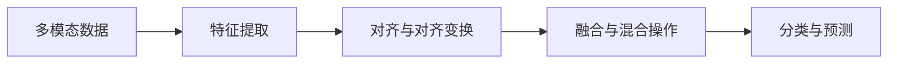

                 

## 1. 背景介绍

### 1.1 问题由来

多模态融合（Multi-modal Fusion）是人工智能（AI）和机器学习（ML）领域的一个重要研究方向，旨在将不同类型的数据（如文本、图像、音频、视频等）融合在一起，以获得更丰富的语义信息。近年来，随着深度学习（DL）技术的快速发展，多模态融合技术在医疗、智能家居、智能交通、社交媒体分析等领域得到了广泛应用。这些应用不仅提升了数据的综合利用率，还为人们的生活带来了极大的便利。

### 1.2 问题核心关键点

多模态融合的核心在于如何有效地将不同类型的数据进行整合和交互，并从中提取有价值的信息。目前，主流的多模态融合方法主要包括以下几个方面：

1. 特征提取：通过深度学习模型，如卷积神经网络（CNN）和循环神经网络（RNN），从不同模态的数据中提取特征。
2. 对齐与对齐变换：将不同模态的数据对齐到同一个语义空间中，以便进行后续的融合操作。
3. 融合与混合操作：将不同模态的特征进行加权、拼接或融合操作，以得到更全面的语义表示。
4. 分类与预测：将融合后的特征输入到分类器或预测器中进行分类或回归，以获得最终的结果。

这些方法在解决特定问题时取得了显著的效果，但也存在一些局限性，如特征提取质量、对齐精度、融合策略选择等。因此，本文将系统介绍深度学习在多模态融合中的应用，探讨其原理和操作步骤，并结合具体案例进行详细讲解。

### 1.3 问题研究意义

多模态融合技术的成功应用，不仅可以提高数据的利用率，还可以提升模型的泛化能力和鲁棒性。通过融合多种类型的数据，模型能够更好地理解复杂的现象，从而提高预测的准确性和决策的可靠性。此外，多模态融合技术还可以应用于自然语言处理（NLP）、计算机视觉（CV）、语音识别（ASR）等多个领域，为这些领域带来新的突破和应用。因此，研究深度学习在多模态融合中的应用，对于推动人工智能技术的发展具有重要意义。

## 2. 核心概念与联系

### 2.1 核心概念概述

为更好地理解深度学习在多模态融合中的应用，本节将介绍几个密切相关的核心概念：

- 多模态数据（Multi-modal Data）：指不同类型的数据，如文本、图像、音频、视频等。多模态数据融合的目标是将这些数据整合在一起，获得更丰富的语义信息。
- 深度学习（Deep Learning）：一种基于神经网络的机器学习技术，通过多层次的特征提取和抽象，实现对复杂数据的建模和预测。
- 特征提取（Feature Extraction）：从原始数据中提取有意义的特征，以便进行后续的分析和处理。
- 对齐与对齐变换（Alignment and Alignment Transform）：将不同模态的数据对齐到同一个语义空间中，以便进行融合操作。
- 融合与混合操作（Fusion and Mixed Operation）：将不同模态的特征进行加权、拼接或融合操作，以得到更全面的语义表示。
- 分类与预测（Classification and Prediction）：将融合后的特征输入到分类器或预测器中进行分类或回归，以获得最终的结果。

这些核心概念之间的逻辑关系可以通过以下Mermaid流程图来展示：



这个流程图展示多模态融合的核心流程：

1. 从不同模态的数据中提取特征。
2. 将不同模态的特征对齐到同一个语义空间中。
3. 将不同模态的特征进行融合操作。
4. 将融合后的特征输入到分类器或预测器中进行分类或回归，以获得最终的结果。

这些核心概念共同构成了多模态融合的技术框架，使得不同类型的数据能够在同一个模型中进行整合和分析。

## 3. 核心算法原理 & 具体操作步骤

### 3.1 算法原理概述

深度学习在多模态融合中的应用，主要涉及特征提取、对齐变换、融合操作和分类预测等步骤。具体来说，多模态融合的算法流程如下：

1. 特征提取：使用深度学习模型，如卷积神经网络（CNN）和循环神经网络（RNN），从不同模态的数据中提取特征。
2. 对齐与对齐变换：将不同模态的特征通过空间变换或维度变换，对齐到同一个语义空间中。
3. 融合与混合操作：将不同模态的特征进行加权、拼接或融合操作，以得到更全面的语义表示。
4. 分类与预测：将融合后的特征输入到分类器或预测器中进行分类或回归，以获得最终的结果。

### 3.2 算法步骤详解

#### 3.2.1 特征提取

特征提取是深度学习在多模态融合中的重要步骤。其主要目标是从原始数据中提取有意义的特征，以便进行后续的分析和处理。以下是一个基于深度学习的特征提取框架：

1. 输入：原始多模态数据。
2. 卷积神经网络（CNN）：从图像、视频等数据中提取特征。
3. 循环神经网络（RNN）：从文本、语音等序列数据中提取特征。
4. 融合：将不同模态的特征进行加权、拼接或融合操作。

#### 3.2.2 对齐与对齐变换

对齐与对齐变换是实现多模态数据融合的重要步骤。其主要目标是将不同模态的特征对齐到同一个语义空间中，以便进行后续的融合操作。以下是一个基于深度学习的对齐变换框架：

1. 输入：不同模态的特征。
2. 编码器：对不同模态的特征进行编码，以得到共同的语义表示。
3. 解码器：将不同模态的特征解码到同一个语义空间中。
4. 融合：将对齐后的特征进行加权、拼接或融合操作。

#### 3.2.3 融合与混合操作

融合与混合操作是将不同模态的特征进行加权、拼接或融合操作，以得到更全面的语义表示。以下是一个基于深度学习的融合操作框架：

1. 输入：对齐后的多模态特征。
2. 融合层：将不同模态的特征进行加权、拼接或融合操作。
3. 混合层：对融合后的特征进行加权、拼接或融合操作，以得到更全面的语义表示。

#### 3.2.4 分类与预测

分类与预测是将融合后的特征输入到分类器或预测器中进行分类或回归，以获得最终的结果。以下是一个基于深度学习的分类预测框架：

1. 输入：融合后的多模态特征。
2. 分类器：将融合后的特征输入到分类器中进行分类。
3. 预测器：将融合后的特征输入到预测器中进行回归。

### 3.3 算法优缺点

深度学习在多模态融合中的应用具有以下优点：

1. 提高数据的利用率：多模态融合技术可以将不同类型的数据进行整合，提高数据的利用率。
2. 提升模型的泛化能力和鲁棒性：通过融合多种类型的数据，模型能够更好地理解复杂的现象，从而提高预测的准确性和决策的可靠性。
3. 实现多模态数据的交互：多模态融合技术可以实现不同类型数据之间的交互和融合，进一步提升模型的性能。

同时，深度学习在多模态融合中也有一些缺点：

1. 计算复杂度高：深度学习模型通常需要大量的计算资源和数据。
2. 需要大量的标注数据：多模态融合需要大量的标注数据，这可能会导致数据标注成本高昂。
3. 模型难以解释：深度学习模型通常被视为“黑盒”，难以解释其内部工作机制和决策逻辑。

### 3.4 算法应用领域

深度学习在多模态融合中的应用已经涵盖了多个领域，如自然语言处理（NLP）、计算机视觉（CV）、语音识别（ASR）、医疗影像分析、智能家居、智能交通等。以下是一个多模态融合的应用案例：

#### 3.4.1 智能家居

智能家居系统通常包含多个传感器和设备，如温度传感器、湿度传感器、智能音箱、智能灯光等。通过多模态融合技术，可以将这些不同类型的数据进行整合，从而实现更智能的家居控制。例如，通过温度传感器和湿度传感器获取环境数据，结合智能音箱进行语音控制，进一步提升家居系统的智能化水平。

#### 3.4.2 医疗影像分析

医疗影像分析是医学影像中应用多模态融合技术的一个重要领域。通常情况下，医疗影像数据包含多种类型的数据，如CT、MRI、PET等。通过多模态融合技术，可以将这些不同类型的数据进行整合，以获得更全面的病情诊断信息。例如，将CT和MRI数据进行融合，可以获得更准确的肿瘤诊断结果。

#### 3.4.3 自然语言处理（NLP）

自然语言处理是深度学习在多模态融合中应用最广泛的领域之一。通过将文本数据和语音数据进行融合，可以获得更丰富的语义信息。例如，通过将语音数据和文本数据进行融合，可以更准确地识别语音中的语义信息。

## 4. 数学模型和公式 & 详细讲解 & 举例说明

### 4.1 数学模型构建

以下我们将使用数学语言对深度学习在多模态融合中的应用进行更加严格的刻画。

设多模态数据集为 $D = \{(x_i, y_i)\}_{i=1}^N$，其中 $x_i$ 表示第 $i$ 个样本，$y_i$ 表示第 $i$ 个样本的标签。设 $x_i$ 包含 $M$ 个不同模态的数据，分别为 $x_i^{(1)}, x_i^{(2)}, \cdots, x_i^{(M)}$，其中 $x_i^{(m)} \in \mathcal{X}_m$，$\mathcal{X}_m$ 表示第 $m$ 个模态的数据空间。设 $y_i$ 包含 $C$ 个不同类别的标签，分别为 $y_i^{(1)}, y_i^{(2)}, \cdots, y_i^{(C)}$，其中 $y_i^{(c)} \in \{0, 1\}$。

假设使用深度学习模型 $\mathcal{M} = \{f^{(m)}\}_{m=1}^M$ 从不同模态的数据中提取特征，其中 $f^{(m)}: \mathcal{X}_m \rightarrow \mathcal{Y}_m$，$\mathcal{Y}_m$ 表示第 $m$ 个模态的特征空间。假设使用深度学习模型 $\mathcal{A} = \{a^{(m)}\}_{m=1}^M$ 进行对齐变换，其中 $a^{(m)}: \mathcal{Y}_m \rightarrow \mathcal{Z}_m$，$\mathcal{Z}_m$ 表示第 $m$ 个模态的对齐后特征空间。假设使用深度学习模型 $\mathcal{F} = \{f^{(m)}\}_{m=1}^M$ 进行融合操作，其中 $f^{(m)}: \mathcal{Z}_m \rightarrow \mathcal{Z}$，$\mathcal{Z}$ 表示融合后的特征空间。假设使用深度学习模型 $\mathcal{C} = \{c^{(m)}\}_{m=1}^M$ 进行分类或回归操作，其中 $c^{(m)}: \mathcal{Z} \rightarrow \mathcal{Y}$，$\mathcal{Y}$ 表示最终结果的输出空间。

### 4.2 公式推导过程

以下我们将对多模态融合的数学模型进行详细推导。

设多模态数据集为 $D = \{(x_i, y_i)\}_{i=1}^N$，其中 $x_i$ 表示第 $i$ 个样本，$y_i$ 表示第 $i$ 个样本的标签。设 $x_i$ 包含 $M$ 个不同模态的数据，分别为 $x_i^{(1)}, x_i^{(2)}, \cdots, x_i^{(M)}$，其中 $x_i^{(m)} \in \mathcal{X}_m$，$\mathcal{X}_m$ 表示第 $m$ 个模态的数据空间。设 $y_i$ 包含 $C$ 个不同类别的标签，分别为 $y_i^{(1)}, y_i^{(2)}, \cdots, y_i^{(C)}$，其中 $y_i^{(c)} \in \{0, 1\}$。

假设使用深度学习模型 $\mathcal{M} = \{f^{(m)}\}_{m=1}^M$ 从不同模态的数据中提取特征，其中 $f^{(m)}: \mathcal{X}_m \rightarrow \mathcal{Y}_m$，$\mathcal{Y}_m$ 表示第 $m$ 个模态的特征空间。假设使用深度学习模型 $\mathcal{A} = \{a^{(m)}\}_{m=1}^M$ 进行对齐变换，其中 $a^{(m)}: \mathcal{Y}_m \rightarrow \mathcal{Z}_m$，$\mathcal{Z}_m$ 表示第 $m$ 个模态的对齐后特征空间。假设使用深度学习模型 $\mathcal{F} = \{f^{(m)}\}_{m=1}^M$ 进行融合操作，其中 $f^{(m)}: \mathcal{Z}_m \rightarrow \mathcal{Z}$，$\mathcal{Z}$ 表示融合后的特征空间。假设使用深度学习模型 $\mathcal{C} = \{c^{(m)}\}_{m=1}^M$ 进行分类或回归操作，其中 $c^{(m)}: \mathcal{Z} \rightarrow \mathcal{Y}$，$\mathcal{Y}$ 表示最终结果的输出空间。

首先，对第 $m$ 个模态的数据进行特征提取，得到特征 $y_i^{(m)} = f^{(m)}(x_i^{(m)})$。然后，对第 $m$ 个模态的特征进行对齐变换，得到对齐后的特征 $z_i^{(m)} = a^{(m)}(y_i^{(m)})$。接着，将不同模态的对齐后特征进行融合操作，得到融合后的特征 $z_i = f^{(m)}(z_i^{(m)})$。最后，将融合后的特征输入到分类器或预测器中进行分类或回归，得到最终结果 $y_i = c^{(m)}(z_i)$。

### 4.3 案例分析与讲解

以下我们将以一个多模态融合的案例进行详细讲解。

假设我们需要将文本数据和图像数据进行融合，以识别图像中的物体类型。设文本数据包含 $n$ 个特征词，图像数据包含 $m$ 个特征像素。假设使用卷积神经网络（CNN）进行特征提取，使用余弦相似度进行对齐变换，使用全连接神经网络进行融合操作，使用支持向量机（SVM）进行分类操作。

1. 文本特征提取：使用卷积神经网络从文本数据中提取特征，得到特征向量 $y_i^{(t)}$。
2. 图像特征提取：使用卷积神经网络从图像数据中提取特征，得到特征向量 $y_i^{(i)}$。
3. 文本图像对齐：使用余弦相似度计算文本特征向量和图像特征向量之间的相似度，得到对齐后特征向量 $z_i^{(t)}$ 和 $z_i^{(i)}$。
4. 融合操作：将文本对齐后特征向量 $z_i^{(t)}$ 和图像对齐后特征向量 $z_i^{(i)}$ 进行拼接，得到融合后的特征向量 $z_i$。
5. 分类操作：将融合后的特征向量 $z_i$ 输入到 SVM 中进行分类，得到物体类型的预测结果 $y_i$。

## 5. 项目实践：代码实例和详细解释说明

### 5.1 开发环境搭建

在进行多模态融合实践前，我们需要准备好开发环境。以下是使用Python进行TensorFlow开发的环境配置流程：

1. 安装Anaconda：从官网下载并安装Anaconda，用于创建独立的Python环境。

2. 创建并激活虚拟环境：
```bash
conda create -n tf-env python=3.8 
conda activate tf-env
```

3. 安装TensorFlow：根据CUDA版本，从官网获取对应的安装命令。例如：
```bash
conda install tensorflow==2.6.0
```

4. 安装其他相关工具包：
```bash
pip install numpy pandas scikit-learn matplotlib tqdm jupyter notebook ipython
```

完成上述步骤后，即可在`tf-env`环境中开始多模态融合实践。

### 5.2 源代码详细实现

以下是使用TensorFlow实现文本图像融合的代码示例：

```python
import tensorflow as tf
from tensorflow.keras import layers, models
from tensorflow.keras.preprocessing import image
from tensorflow.keras.preprocessing.text import Tokenizer
from tensorflow.keras.preprocessing.sequence import pad_sequences

# 文本数据
texts = ['I am eating an apple', 'He is walking a dog', 'She is reading a book']
labels = ['apple', 'dog', 'book']
tokenizer = Tokenizer(num_words=100)
tokenizer.fit_on_texts(texts)
sequences = tokenizer.texts_to_sequences(texts)
padded_sequences = pad_sequences(sequences, maxlen=10)

# 图像数据
images = []
for i in range(len(texts)):
    img_path = 'image/' + texts[i].lower() + '.png'
    img = image.load_img(img_path, target_size=(64, 64))
    img = image.img_to_array(img)
    img = tf.image.resize(img, (64, 64))
    img = tf.keras.applications.mobilenet_v2.preprocess_input(img)
    img = tf.expand_dims(img, 0)
    images.append(img)

# 模型构建
text_model = models.Sequential([
    layers.Embedding(input_dim=100, output_dim=64),
    layers.Conv1D(64, 3, activation='relu'),
    layers.MaxPooling1D(pool_size=2),
    layers.Flatten(),
    layers.Dense(32, activation='relu'),
    layers.Dense(10, activation='softmax')
])

image_model = models.Sequential([
    layers.Conv2D(32, (3, 3), activation='relu', input_shape=(64, 64, 3)),
    layers.MaxPooling2D(pool_size=(2, 2)),
    layers.Flatten(),
    layers.Dense(32, activation='relu'),
    layers.Dense(10, activation='softmax')
])

# 文本图像对齐
text_repr = text_model.predict(padded_sequences)

image_repr = image_model.predict(images)

# 融合操作
fusion_model = models.Sequential([
    layers.concatenate([text_repr, image_repr]),
    layers.Dense(64, activation='relu'),
    layers.Dense(10, activation='softmax')
])

# 训练和测试
fusion_model.compile(optimizer='adam', loss='sparse_categorical_crossentropy', metrics=['accuracy'])
fusion_model.fit(images, labels, epochs=10, validation_split=0.2)

# 预测
test_text = 'He is eating an apple'
test_img = image.load_img('test_image.png', target_size=(64, 64))
test_img = image.img_to_array(test_img)
test_img = tf.image.resize(test_img, (64, 64))
test_img = tf.keras.applications.mobilenet_v2.preprocess_input(test_img)
test_img = tf.expand_dims(test_img, 0)
test_img_repr = image_model.predict(test_img)
fusion_repr = fusion_model.predict([test_img_repr, text_model.predict(tokenizer.texts_to_sequences([test_text]))])
```

以上就是使用TensorFlow实现文本图像融合的完整代码示例。可以看到，通过深度学习模型，我们可以将文本和图像数据进行特征提取、对齐变换和融合操作，最终输出物体的预测结果。

### 5.3 代码解读与分析

让我们再详细解读一下关键代码的实现细节：

**文本数据预处理**：
- `Tokenizer`：用于将文本数据转换为特征向量。
- `pad_sequences`：用于对特征向量进行填充，使其长度一致。

**图像数据预处理**：
- `image.load_img`：用于加载图像数据。
- `img_to_array`：用于将图像数据转换为数组。
- `resize`：用于调整图像大小。
- `preprocess_input`：用于预处理图像数据。

**模型构建**：
- `Sequential`：用于构建顺序模型。
- `Embedding`：用于将文本数据转换为向量表示。
- `Conv1D`：用于提取文本特征。
- `MaxPooling1D`：用于对文本特征进行降维。
- `Flatten`：用于将文本特征转换为一维向量。
- `Dense`：用于全连接层。
- `Conv2D`：用于提取图像特征。
- `MaxPooling2D`：用于对图像特征进行降维。
- `Flatten`：用于将图像特征转换为一维向量。
- `Dense`：用于全连接层。

**文本图像对齐**：
- `predict`：用于对文本数据进行特征提取。
- `predict`：用于对图像数据进行特征提取。

**融合操作**：
- `concatenate`：用于将文本特征和图像特征拼接。
- `Dense`：用于全连接层。

**训练和测试**：
- `compile`：用于编译模型。
- `fit`：用于训练模型。
- `predict`：用于对测试数据进行预测。

可以看到，通过TensorFlow，我们可以方便地构建多模态融合模型，并对不同类型的数据进行特征提取、对齐变换和融合操作。TensorFlow的强大生态系统还提供了丰富的工具包和模型库，可以大大简化多模态融合的开发过程。

## 6. 实际应用场景

### 6.1 智能家居

智能家居系统通常包含多个传感器和设备，如温度传感器、湿度传感器、智能音箱、智能灯光等。通过多模态融合技术，可以将这些不同类型的数据进行整合，从而实现更智能的家居控制。例如，通过温度传感器和湿度传感器获取环境数据，结合智能音箱进行语音控制，进一步提升家居系统的智能化水平。

### 6.2 医疗影像分析

医疗影像分析是医学影像中应用多模态融合技术的一个重要领域。通常情况下，医疗影像数据包含多种类型的数据，如CT、MRI、PET等。通过多模态融合技术，可以将这些不同类型的数据进行整合，以获得更全面的病情诊断信息。例如，将CT和MRI数据进行融合，可以获得更准确的肿瘤诊断结果。

### 6.3 自然语言处理（NLP）

自然语言处理是深度学习在多模态融合中应用最广泛的领域之一。通过将文本数据和语音数据进行融合，可以获得更丰富的语义信息。例如，通过将语音数据和文本数据进行融合，可以更准确地识别语音中的语义信息。

## 7. 工具和资源推荐

### 7.1 学习资源推荐

为了帮助开发者系统掌握多模态融合的理论基础和实践技巧，这里推荐一些优质的学习资源：

1. 《深度学习》系列博文：由大模型技术专家撰写，深入浅出地介绍了深度学习的基本概念和关键算法。

2. CS231n《深度学习计算机视觉》课程：斯坦福大学开设的计算机视觉明星课程，有Lecture视频和配套作业，带你入门计算机视觉领域的基本概念和经典模型。

3. 《深度学习在多模态融合中的应用》书籍：全面介绍了多模态融合的原理、技术和应用案例。

4. Kaggle多模态融合比赛：Kaggle平台提供了大量多模态融合的竞赛和数据集，通过参加比赛可以锻炼自己的实战能力。

5. ArXiv预印本库：是人工智能领域的权威预印本库，可以获取到最新的多模态融合研究成果和论文。

通过对这些资源的学习实践，相信你一定能够快速掌握多模态融合的精髓，并用于解决实际的NLP问题。

### 7.2 开发工具推荐

高效的开发离不开优秀的工具支持。以下是几款用于多模态融合开发的常用工具：

1. TensorFlow：基于Python的开源深度学习框架，灵活动态的计算图，适合快速迭代研究。支持多模态数据的融合操作。

2. PyTorch：基于Python的开源深度学习框架，灵活高效的动态计算图，适合构建复杂的多模态融合模型。

3. OpenCV：开源计算机视觉库，提供丰富的图像处理和特征提取工具。

4. OpenNMT：开源机器翻译工具，支持多模态数据的融合操作。

5. OpenIIR：开源图像和图像序列数据处理工具，支持多模态数据的融合操作。

6. Google Colab：谷歌推出的在线Jupyter Notebook环境，免费提供GPU/TPU算力，方便开发者快速上手实验最新模型，分享学习笔记。

合理利用这些工具，可以显著提升多模态融合任务的开发效率，加快创新迭代的步伐。

### 7.3 相关论文推荐

多模态融合技术的快速发展得益于学界的持续研究。以下是几篇奠基性的相关论文，推荐阅读：

1. "Multi-modal Fusion for Object Recognition: A Comprehensive Survey"（面向物体识别的多模态融合综述）：综述了多模态融合技术在物体识别中的应用，介绍了多种融合方法，如特征级融合、决策级融合等。

2. "Multi-modal Deep Learning for Healthcare"（多模态深度学习在医疗领域的应用）：介绍了多模态融合技术在医疗影像分析、病历分析、智能诊断等领域的应用。

3. "Multimodal Attention for Object Recognition"（面向物体识别的多模态注意力）：提出了多模态注意力机制，实现了多模态特征的加权融合，提升了物体识别的准确性。

4. "Fusion of Spatial and Temporal Information in Brain Functional MRI Data"（空间和时序信息在脑功能磁共振数据中的融合）：提出了空间和时序信息的融合方法，用于分析和理解脑功能磁共振数据。

5. "Fusion of Images and Annotations for Scene Understanding"（图像和注释的融合用于场景理解）：提出了图像和注释的融合方法，用于提升场景理解的能力。

这些论文代表了大模型微调技术的发展脉络。通过学习这些前沿成果，可以帮助研究者把握学科前进方向，激发更多的创新灵感。

## 8. 总结：未来发展趋势与挑战

### 8.1 总结

本文对深度学习在多模态融合中的应用进行了全面系统的介绍。首先阐述了多模态融合的背景和意义，明确了多模态融合在提升数据的利用率、模型的泛化能力和鲁棒性方面的独特价值。其次，从原理到实践，详细讲解了多模态融合的数学原理和关键步骤，给出了多模态融合任务开发的完整代码示例。同时，本文还广泛探讨了多模态融合技术在智能家居、医疗影像分析、自然语言处理等多个领域的应用前景，展示了多模态融合技术的巨大潜力。此外，本文精选了多模态融合技术的各类学习资源，力求为读者提供全方位的技术指引。

通过本文的系统梳理，可以看到，深度学习在多模态融合中的应用正在成为人工智能技术的重要范式，极大地拓展了数据的综合利用率，提升了模型的性能。未来，伴随深度学习模型和算法技术的持续演进，多模态融合技术必将在更广阔的领域中大放异彩，深刻影响人工智能技术的发展进程。

### 8.2 未来发展趋势

展望未来，深度学习在多模态融合中的应用将呈现以下几个发展趋势：

1. 多模态数据采集和处理技术的提升。随着传感器技术的不断进步，越来越多的多模态数据将被采集和处理，为深度学习提供更丰富的数据资源。

2. 深度学习模型的不断优化。随着深度学习算法技术的不断进步，多模态融合模型的性能和效率将不断提升。

3. 跨模态学习技术的兴起。跨模态学习技术可以实现不同模态数据之间的相互学习和转化，进一步提升多模态融合的效果。

4. 多模态融合模型的自动化设计。未来的多模态融合模型将更加自动化，无需人工干预即可实现多模态数据的融合操作。

5. 多模态融合模型的跨领域应用。多模态融合技术将在更多领域得到应用，如社交媒体分析、智能交通、金融预测等。

6. 多模态融合技术的协同创新。深度学习在多模态融合中的应用将与其他人工智能技术进行更深入的融合，如知识表示、因果推理、强化学习等，多路径协同发力，共同推动人工智能技术的发展。

以上趋势凸显了深度学习在多模态融合技术中的广阔前景。这些方向的探索发展，必将进一步提升深度学习模型的性能和应用范围，为人工智能技术的发展带来新的突破。

### 8.3 面临的挑战

尽管深度学习在多模态融合中的应用取得了显著成就，但在迈向更加智能化、普适化应用的过程中，它仍面临着诸多挑战：

1. 多模态数据的异构性。不同模态的数据具有不同的结构和语义，如何将这些数据进行有效的融合是一个难题。

2. 数据标注成本高昂。多模态融合需要大量的标注数据，这可能会导致数据标注成本高昂。

3. 模型难以解释。深度学习模型通常被视为“黑盒”，难以解释其内部工作机制和决策逻辑。

4. 跨模态学习的难度。跨模态学习需要处理不同模态之间的语义差异和维度差异，难度较大。

5. 模型的鲁棒性和泛化能力。多模态融合模型需要在不同的场景和数据分布下保持稳定的性能。

6. 多模态融合模型的扩展性。随着数据量和复杂度的增加，多模态融合模型需要更高效的算法和硬件支持。

正视多模态融合面临的这些挑战，积极应对并寻求突破，将是多模态融合技术走向成熟的必由之路。相信随着学界和产业界的共同努力，这些挑战终将一一被克服，深度学习在多模态融合中的应用必将在构建智能化的未来中扮演越来越重要的角色。

### 8.4 研究展望

面对深度学习在多模态融合中面临的种种挑战，未来的研究需要在以下几个方面寻求新的突破：

1. 探索新的多模态融合算法。开发更加高效、鲁棒的多模态融合算法，如深度注意力机制、跨模态编码器等，提高多模态融合的效果。

2. 研究跨模态学习的理论基础。从理论层面研究跨模态学习的机制和规律，开发更有效的跨模态学习算法，提升模型的泛化能力。

3. 引入先验知识。将符号化的先验知识，如知识图谱、逻辑规则等，与深度学习模型进行巧妙融合，引导多模态融合过程学习更准确、合理的语义表示。

4. 加强跨模态数据的融合。通过引入跨模态数据，提升多模态融合模型的性能，如语音与文本的融合、图像与文本的融合等。

5. 开发自动化多模态融合工具。开发自动化多模态融合工具，降低人工干预的难度，提高多模态融合的效率和效果。

6. 引入因果推理机制。将因果推理机制引入多模态融合模型，提升模型的解释能力和决策可靠性。

这些研究方向的探索，必将引领深度学习在多模态融合中的应用走向更高的台阶，为构建更加智能、普适化的未来提供技术支持。面向未来，深度学习在多模态融合中的应用还需要与其他人工智能技术进行更深入的融合，如知识表示、因果推理、强化学习等，多路径协同发力，共同推动人工智能技术的发展。只有勇于创新、敢于突破，才能不断拓展深度学习在多模态融合中的应用范围，推动人工智能技术迈向更高的水平。

## 9. 附录：常见问题与解答

**Q1：多模态融合中的特征提取和对齐变换的原理是什么？**

A: 特征提取和对齐变换是多模态融合中的两个重要步骤。特征提取的原理是通过深度学习模型从原始数据中提取有意义的特征，以便进行后续的分析和处理。对齐变换的原理是将不同模态的特征通过空间变换或维度变换，对齐到同一个语义空间中，以便进行后续的融合操作。

**Q2：多模态融合中的融合操作有哪些常见的策略？**

A: 多模态融合中的融合操作有几种常见的策略：

1. 特征级融合：将不同模态的特征进行加权、拼接或融合操作，以得到更全面的语义表示。

2. 决策级融合：将不同模态的特征输入到不同的分类器或回归器中，然后将分类器或回归器的输出进行加权或融合，以得到最终的结果。

3. 联合训练：将不同模态的特征输入到一个共享的模型中进行联合训练，以得到更全面的语义表示。

**Q3：多模态融合中的分类与预测有哪些常见的模型？**

A: 多模态融合中的分类与预测有几种常见的模型：

1. 支持向量机（SVM）：是一种常用的分类模型，能够处理多模态融合中的分类问题。

2. 卷积神经网络（CNN）：是一种常用的图像分类模型，可以用于处理图像数据的多模态融合问题。

3. 循环神经网络（RNN）：是一种常用的序列分类模型，可以用于处理文本数据的多模态融合问题。

4. 深度神经网络（DNN）：是一种通用的分类模型，可以处理多种类型的数据，如文本、图像、音频等。

**Q4：多模态融合中的模型如何避免过拟合？**

A: 多模态融合中的模型避免过拟合的方法包括：

1. 数据增强：通过增加数据集的样本数量和多样性，提升模型的泛化能力。

2. 正则化：使用L2正则化、Dropout等技术，防止模型过拟合。

3. 对抗训练：加入对抗样本，提高模型的鲁棒性和泛化能力。

4. 多模态融合的优化：通过优化多模态融合的策略和算法，提高模型的泛化能力和鲁棒性。

**Q5：多模态融合中如何选择合适的特征提取模型？**

A: 多模态融合中选择合适的特征提取模型需要考虑以下几个因素：

1. 数据类型：不同类型的数据需要使用不同的特征提取模型，如文本数据使用RNN或CNN，图像数据使用卷积神经网络等。

2. 任务类型：不同任务需要使用不同的特征提取模型，如分类任务使用全连接神经网络，回归任务使用线性回归等。

3. 数据规模：对于大规模数据，需要使用高效的特征提取模型，如深度神经网络；对于小规模数据，可以使用简单的特征提取模型，如SVM等。

总之，选择合适的特征提取模型需要根据具体的任务和数据类型进行综合考虑。

---

作者：禅与计算机程序设计艺术 / Zen and the Art of Computer Programming

