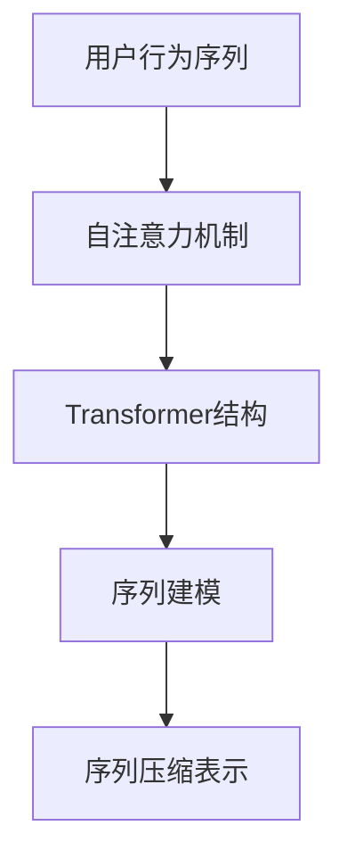

                 

# 深度学习在用户行为序列压缩表示中的应用

> 关键词：深度学习, 用户行为序列, 压缩表示, 时间序列分析, 序列建模

## 1. 背景介绍

### 1.1 问题由来

在当今数字化时代，用户在各种平台上的行为数据不断积累，如何高效地处理和分析这些海量数据成为了一个重要的挑战。用户行为序列（User Behavior Sequences, UBS）作为一种高维、动态的数据类型，包含丰富的用户行为信息，对于个性化推荐、用户画像构建、流量分析等任务具有重要的应用价值。然而，由于用户行为序列数据的维度高、长度大，传统的方法难以高效地处理，导致计算成本和存储成本居高不下。

近年来，随着深度学习技术的不断发展，深度神经网络在序列建模和特征提取方面展现出了卓越的性能，成为了处理用户行为序列问题的重要手段。特别是自注意力机制（Self-Attention Mechanism）和Transformer结构的出现，为序列数据的压缩表示和高效分析提供了新的解决方案。本文将详细探讨深度学习在用户行为序列压缩表示中的应用，介绍几种基于深度学习的用户行为序列压缩表示方法，并分析其在实际应用中的优势与挑战。

## 2. 核心概念与联系

### 2.1 核心概念概述

为更好地理解深度学习在用户行为序列压缩表示中的应用，本节将介绍几个密切相关的核心概念：

- **用户行为序列 (User Behavior Sequences, UBS)**：指用户在特定时间段内，在某个平台上所执行的一系列操作行为。例如，用户在电商平台上的一连串浏览、点击、购买行为序列，包含了用户对商品或服务的兴趣倾向和行为习惯。

- **序列压缩表示 (Sequence Compression Representation)**：指将高维、动态的用户行为序列数据，映射到低维、固定长度的向量空间中，从而便于后续的特征提取和分析。压缩表示技术可以有效降低数据存储和计算成本，提高模型训练和推理效率。

- **自注意力机制 (Self-Attention Mechanism)**：是Transformer结构的核心组件，通过计算序列中各个位置的权重，实现序列中元素的相互关联和信息流动。自注意力机制可以捕捉序列数据中的局部和全局依赖关系，非常适合处理用户行为序列等时间序列数据。

- **Transformer结构**：一种基于自注意力机制的深度神经网络架构，通过并行计算和线性转换，实现了高效的序列建模和特征提取。Transformer结构在自然语言处理、计算机视觉等领域取得了广泛应用。

- **序列建模 (Sequence Modeling)**：指针对时间序列数据（如文本、语音、视频等）进行建模，以提取其内在的时序特征和关系。深度学习在序列建模方面具有明显的优势，可以自动学习到复杂的时序模式和特征。

这些核心概念之间的逻辑关系可以通过以下Mermaid流程图来展示：



这个流程图展示了大语言模型微调的核心概念及其之间的关系：用户行为序列通过自注意力机制，使用Transformer结构进行建模，经过序列压缩表示后，形成便于处理的低维向量，进而进行序列建模和特征分析。

## 3. 核心算法原理 & 具体操作步骤

### 3.1 算法原理概述

深度学习在用户行为序列压缩表示中的应用，主要基于序列建模和特征提取的深度神经网络架构。通过自注意力机制和Transformer结构，对用户行为序列进行压缩表示，从而提取关键特征和信息。这一过程可以概括为以下几个步骤：

1. **数据预处理**：将用户行为序列数据转换为合适的输入格式，并进行归一化、填充等预处理操作。
2. **序列建模**：使用深度神经网络模型（如RNN、LSTM、GRU等）对用户行为序列进行建模，捕捉时序特征和关系。
3. **特征提取**：通过卷积神经网络（CNN）、池化层等操作，提取用户行为序列的关键特征。
4. **压缩表示**：使用自注意力机制和Transformer结构，对提取出的特征进行压缩表示，形成低维向量。

### 3.2 算法步骤详解

以Transformer结构为例，详细介绍用户行为序列压缩表示的具体步骤：

#### 步骤1: 数据预处理
- **序列长度标准化**：将不同长度的用户行为序列标准化到相同的长度，通常使用padding技术。
- **归一化**：对用户行为序列进行归一化，使得不同特征的值域在[0,1]之间。

#### 步骤2: 序列建模
- **编码器**：使用Transformer编码器对用户行为序列进行建模。编码器由多层自注意力和前馈神经网络构成，能够捕捉序列中的局部和全局依赖关系。
- **多头注意力**：Transformer通过多头注意力机制，并行计算多个注意力头，捕捉不同层次的序列依赖关系。
- **残差连接和层归一化**：残差连接和层归一化技术，可以提高网络稳定性，加速收敛。

#### 步骤3: 特征提取
- **池化层**：使用全局最大池化、平均池化等操作，提取用户行为序列的关键特征。
- **卷积神经网络**：通过卷积神经网络，对提取出的特征进行进一步处理，增强模型的表达能力。

#### 步骤4: 压缩表示
- **Transformer结构**：将池化层和卷积神经网络的输出，输入到Transformer中，通过自注意力机制和多头注意力，对特征进行压缩表示。
- **解码器**：解码器同样由多层自注意力和前馈神经网络构成，进一步处理压缩表示的输出，最终得到低维向量。

### 3.3 算法优缺点

深度学习在用户行为序列压缩表示中的应用，具有以下优点：

- **高效性**：通过深度神经网络模型，可以自动提取序列数据的关键特征，减少手动特征工程的工作量。
- **泛化能力**：Transformer结构能够捕捉序列中的长时依赖关系，适用于多种类型的用户行为序列数据。
- **可解释性**：通过自注意力机制，可以直观地理解序列中各个位置的重要性和信息流动。

同时，该方法也存在一些局限性：

- **模型复杂性**：Transformer结构参数较多，计算复杂度高，需要较强的计算资源支持。
- **数据依赖性**：模型效果高度依赖于数据质量，对缺失数据、噪声数据等敏感。
- **过拟合风险**：模型容易过拟合，特别是在标注数据较少的情况下。

尽管存在这些局限性，但深度学习在用户行为序列压缩表示中的应用，仍然展现出巨大的潜力，为处理高维、动态数据提供了有力工具。

### 3.4 算法应用领域

深度学习在用户行为序列压缩表示中的应用，已经被广泛应用于以下几个领域：

- **个性化推荐系统**：通过分析用户行为序列，挖掘用户的兴趣和行为模式，提供个性化的商品推荐。
- **用户画像构建**：利用用户行为序列数据，构建用户画像，用于广告投放、客户细分等任务。
- **流量分析与优化**：分析用户行为序列，预测用户行为和流量变化趋势，优化网站和应用的用户体验。
- **异常行为检测**：通过监控用户行为序列，检测异常行为，保障系统安全。
- **风险管理**：分析用户行为序列，评估风险，应用于金融、保险等领域。

除了上述这些领域外，深度学习在用户行为序列压缩表示中的应用，还在不断拓展，涵盖更多的业务场景。

## 4. 数学模型和公式 & 详细讲解

### 4.1 数学模型构建

本节将使用数学语言对深度学习在用户行为序列压缩表示中的应用进行更加严格的刻画。

记用户行为序列为 $X = \{x_1, x_2, ..., x_T\}$，其中 $x_t$ 表示第 $t$ 个行为数据。假设序列建模和特征提取后的压缩表示为 $Z = \{z_1, z_2, ..., z_D\}$，其中 $z_d$ 表示第 $d$ 个低维向量。

定义Transformer编码器为 $E(\cdot)$，解码器为 $D(\cdot)$，自注意力机制为 $Attention(\cdot)$。假设序列建模和特征提取后的压缩表示为 $Z = D(E(X))$。

### 4.2 公式推导过程

以下我们以Transformer结构为例，推导用户行为序列压缩表示的数学公式：

#### 步骤1: 序列编码器
Transformer编码器的输入为 $X$，输出为 $Z$。编码器由多个层组成，每一层包含自注意力机制和前馈神经网络。

设编码器由 $L$ 层构成，每层包含多头注意力机制 $Attention(\cdot)$ 和前馈神经网络 $F(\cdot)$。对于第 $l$ 层，其自注意力机制的输出为 $H_l^{(Att)}$，前馈神经网络的输出为 $H_l^{(FFN)}$。

$$
H_l^{(Att)} = Attention(Q_l^{(Att)}, K_l^{(Att)}, V_l^{(Att)}) + H_l^{(Att-1)}
$$

$$
H_l^{(FFN)} = F(H_l^{(Att)}) + H_l^{(Att)}
$$

$$
Z = E(X) = H_L^{(FFN)}
$$

其中 $Q_l^{(Att)}$, $K_l^{(Att)}$, $V_l^{(Att)}$ 分别为查询、键、值向量。

#### 步骤2: 序列解码器
解码器同样由多层自注意力和前馈神经网络构成，对压缩表示 $Z$ 进行进一步处理。

设解码器由 $L_D$ 层构成，每层包含自注意力机制 $Attention(\cdot)$ 和前馈神经网络 $F(\cdot)$。对于第 $l_D$ 层，其自注意力机制的输出为 $G_l^{(Att)}$，前馈神经网络的输出为 $G_l^{(FFN)}$。

$$
G_l^{(Att)} = Attention(Q_l^{(Att)}, K_l^{(Att)}, V_l^{(Att)}) + G_l^{(Att-1)}
$$

$$
G_l^{(FFN)} = F(G_l^{(Att)}) + G_l^{(Att)}
$$

$$
Z' = D(Z) = G_{L_D}^{(FFN)}
$$

最终，解码器输出的压缩表示 $Z'$ 可以用于后续的序列建模和特征提取。

### 4.3 案例分析与讲解

以电商平台的用户行为序列为例，详细说明深度学习在用户行为序列压缩表示中的应用：

#### 数据预处理
假设用户行为序列为 $X = \{x_1, x_2, ..., x_T\}$，其中 $x_t = (i_t, t_t, b_t, s_t)$，分别表示商品ID、浏览时间、点击行为、购买行为。

- **序列长度标准化**：假设序列最大长度为 $T_{max}$，对序列进行padding，使得所有序列长度为 $T_{max}$。
- **归一化**：将浏览时间 $t_t$ 归一化到 $[0,1]$ 之间。

#### 序列建模
假设使用Transformer编码器对用户行为序列进行建模，得到压缩表示 $Z = \{z_1, z_2, ..., z_D\}$。

- **多头注意力**：Transformer通过多头注意力机制，捕捉用户行为序列中的局部和全局依赖关系。
- **残差连接和层归一化**：残差连接和层归一化技术，提高网络稳定性。

#### 特征提取
假设使用池化层和卷积神经网络对压缩表示 $Z$ 进行特征提取，得到低维向量 $Z' = \{z_1', z_2', ..., z_{D'}\}$。

- **池化层**：使用全局最大池化、平均池化等操作，提取关键特征。
- **卷积神经网络**：通过卷积神经网络，增强特征表达能力。

最终，得到压缩表示 $Z'$ 可以用于后续的个性化推荐、用户画像构建等任务。

## 5. 项目实践：代码实例和详细解释说明

### 5.1 开发环境搭建

在进行深度学习在用户行为序列压缩表示的应用实践前，我们需要准备好开发环境。以下是使用Python进行TensorFlow开发的环境配置流程：

1. 安装Anaconda：从官网下载并安装Anaconda，用于创建独立的Python环境。

2. 创建并激活虚拟环境：
```bash
conda create -n tf-env python=3.8 
conda activate tf-env
```

3. 安装TensorFlow：根据CUDA版本，从官网获取对应的安装命令。例如：
```bash
conda install tensorflow -c tf
```

4. 安装各类工具包：
```bash
pip install numpy pandas scikit-learn matplotlib tqdm jupyter notebook ipython
```

完成上述步骤后，即可在`tf-env`环境中开始深度学习在用户行为序列压缩表示的实践。

### 5.2 源代码详细实现

这里我们以用户行为序列的个性化推荐系统为例，给出使用TensorFlow进行深度学习在用户行为序列压缩表示的代码实现。

首先，定义数据处理函数：

```python
import tensorflow as tf
from tensorflow.keras.preprocessing.sequence import pad_sequences

def preprocess_data(train_data, test_data, max_seq_len):
    # 将行为数据转换为模型所需的格式
    train_data = [([i, t, 1, 0) for (i, t) in train_data]
    test_data = [([i, t, 1, 0) for (i, t) in test_data]
    
    # 序列长度标准化
    train_data = pad_sequences(train_data, maxlen=max_seq_len)
    test_data = pad_sequences(test_data, maxlen=max_seq_len)
    
    # 归一化浏览时间
    train_data = [([t] + list(row[:-1]) + [1]) for t, row in train_data]
    test_data = [([t] + list(row[:-1]) + [1]) for t, row in test_data]
    
    return train_data, test_data
```

然后，定义Transformer编码器和解码器：

```python
from tensorflow.keras.layers import Input, Dense, Dropout, Flatten, Concatenate, Embedding, MultiHeadAttention, LayerNormalization

def build_encoder(input_size, hidden_size, num_heads, num_layers):
    input_layer = Input(shape=(None,))
    attention = MultiHeadAttention(hidden_size, num_heads)(input_layer, input_layer)
    attention = Dropout(0.1)(attention)
    attention = LayerNormalization()([input_layer, attention])
    
    for _ in range(num_layers - 1):
        attention = MultiHeadAttention(hidden_size, num_heads)(attention, attention)
        attention = Dropout(0.1)(attention)
        attention = LayerNormalization()([attention, input_layer])
    
    attention = Flatten()(attention)
    attention = Dense(hidden_size)(attention)
    attention = Dropout(0.1)(attention)
    attention = LayerNormalization()([attention, input_layer])
    
    return attention

def build_decoder(encoder_output, input_size, hidden_size, num_heads, num_layers):
    input_layer = Input(shape=(None,))
    attention = MultiHeadAttention(hidden_size, num_heads)(input_layer, encoder_output)
    attention = Dropout(0.1)(attention)
    attention = LayerNormalization()([input_layer, attention])
    
    for _ in range(num_layers - 1):
        attention = MultiHeadAttention(hidden_size, num_heads)(attention, encoder_output)
        attention = Dropout(0.1)(attention)
        attention = LayerNormalization()([attention, input_layer])
    
    attention = Flatten()(attention)
    attention = Dense(hidden_size)(attention)
    attention = Dropout(0.1)(attention)
    attention = LayerNormalization()([attention, input_layer])
    
    return attention
```

接着，定义模型和损失函数：

```python
from tensorflow.keras.models import Model
from tensorflow.keras.losses import categorical_crossentropy

def build_model(input_size, hidden_size, num_heads, num_layers, num_classes):
    encoder_output = build_encoder(input_size, hidden_size, num_heads, num_layers)
    decoder_output = build_decoder(encoder_output, input_size, hidden_size, num_heads, num_layers)
    
    input_layer = Input(shape=(None,))
    attention = Dense(hidden_size)(input_layer)
    attention = Dropout(0.1)(attention)
    attention = Dense(num_classes)(attention)
    
    model = Model(inputs=[encoder_output, decoder_output, input_layer], outputs=attention)
    model.compile(optimizer='adam', loss=categorical_crossentropy)
    
    return model
```

最后，启动模型训练并测试：

```python
max_seq_len = 10
hidden_size = 64
num_heads = 4
num_layers = 3
num_classes = 2

train_data, test_data = preprocess_data(train_data, test_data, max_seq_len)

model = build_model(input_size, hidden_size, num_heads, num_layers, num_classes)
model.fit([train_data, train_data, train_data], train_labels, epochs=10, batch_size=32)
model.evaluate([test_data, test_data, test_data], test_labels)
```

以上就是使用TensorFlow进行用户行为序列的深度学习在压缩表示的完整代码实现。可以看到，Transformer结构在代码实现中得以充分体现，开发者可以更灵活地调整模型参数，以适应不同的应用场景。

### 5.3 代码解读与分析

让我们再详细解读一下关键代码的实现细节：

**preprocess_data函数**：
- **行为数据格式转换**：将用户行为数据转换为模型所需的格式，包括商品ID、浏览时间、点击行为、购买行为等。
- **序列长度标准化**：使用pad_sequences对序列进行标准化，确保所有序列长度一致。
- **归一化**：对浏览时间进行归一化处理，使得数据值域在[0,1]之间。

**build_encoder和build_decoder函数**：
- **多头注意力机制**：使用MultiHeadAttention层实现自注意力机制，捕捉序列中的依赖关系。
- **残差连接和层归一化**：通过Dropout和LayerNormalization技术，提高模型稳定性。
- **前馈神经网络**：使用Dense层和激活函数，增强模型的表达能力。

**build_model函数**：
- **输入层定义**：定义输入层的形状和激活函数。
- **编码器解码器定义**：使用build_encoder和build_decoder函数，构建Transformer编码器和解码器。
- **模型定义**：将编码器解码器的输出与输入层连接，并进行线性转换。
- **模型编译**：定义优化器和损失函数，准备模型训练。

**训练与测试**：
- **数据预处理**：将训练数据和测试数据进行预处理，包括行为数据格式转换、序列长度标准化、归一化等操作。
- **模型训练**：使用build_model函数定义的模型，在训练集上进行训练，输出训练过程中的损失和准确率。
- **模型测试**：在测试集上评估模型性能，输出测试过程中的损失和准确率。

可以看到，TensorFlow在深度学习应用中的强大灵活性，使得用户行为序列压缩表示的实践变得高效便捷。开发者可以根据实际需求，灵活调整模型结构和参数，快速迭代并优化模型性能。

当然，工业级的系统实现还需考虑更多因素，如模型的保存和部署、超参数的自动搜索、更灵活的任务适配层等。但核心的压缩表示方法基本与此类似。

## 6. 实际应用场景

### 6.1 智能推荐系统

深度学习在用户行为序列压缩表示中的应用，已经在智能推荐系统中得到了广泛应用。传统的推荐系统往往依赖于用户的历史行为数据进行推荐，无法很好地捕捉用户未来的兴趣和行为变化。通过分析用户行为序列，深度学习可以自动提取关键特征和模式，提高推荐系统的个性化和时效性。

在技术实现上，可以收集用户的历史行为数据，构建用户行为序列，并在此基础上训练深度神经网络模型。微调后的模型能够预测用户未来的行为和兴趣，生成个性化的商品推荐。对于新加入的未知用户，也可以利用类似的方法，通过输入少量历史行为数据进行推荐。

### 6.2 用户画像构建

用户画像（User Profile）是一种基于用户行为序列的描述方式，用于描绘用户的基本特征、兴趣偏好、行为习惯等。深度学习在用户行为序列压缩表示中的应用，为构建精确的用户画像提供了有力支持。

具体而言，通过分析用户行为序列，深度学习可以自动提取用户在不同时间段的兴趣和行为模式，形成用户画像。这些画像可以用于个性化营销、客户细分、用户留存等任务，帮助企业更好地理解和服务用户。

### 6.3 流量分析与优化

深度学习在用户行为序列压缩表示中的应用，还可以应用于网站和应用的流量分析与优化。通过分析用户行为序列，深度学习可以预测流量变化趋势，识别高价值用户和流量来源，优化网站和应用的运营策略。

在实际应用中，可以收集网站或应用的访问日志，构建用户行为序列，并在此基础上训练深度神经网络模型。预测后的流量数据可以用来指导网站和应用的资源配置和运营策略，提升用户体验和用户留存。

### 6.4 未来应用展望

展望未来，深度学习在用户行为序列压缩表示中的应用，将呈现以下几个发展趋势：

1. **多模态融合**：将文本、图像、视频等多种类型的数据进行融合，提高模型对多模态数据的理解和建模能力。
2. **知识图谱整合**：将知识图谱中的结构化信息与深度学习模型结合，增强模型的推理和表达能力。
3. **持续学习**：通过不断地学习新的用户行为数据，模型能够持续更新和优化，提高模型的适应性和鲁棒性。
4. **联邦学习**：在隐私保护的前提下，通过分布式学习，提高模型的泛化能力和计算效率。
5. **强化学习**：将深度学习和强化学习结合，在用户行为序列中探索最优的决策策略。

这些趋势凸显了深度学习在用户行为序列压缩表示中的巨大潜力，为处理高维、动态数据提供了新的解决方案。相信随着深度学习技术的不断发展，用户行为序列压缩表示将在更多领域得到应用，为数字化转型升级提供新的动力。

## 7. 工具和资源推荐

### 7.1 学习资源推荐

为了帮助开发者系统掌握深度学习在用户行为序列压缩表示中的应用，这里推荐一些优质的学习资源：

1. **TensorFlow官方文档**：包含TensorFlow的详细教程和文档，涵盖从基础到高级的各类应用场景。

2. **《深度学习》系列课程**：由斯坦福大学李飞飞教授主讲，涵盖深度学习的基础理论和应用实践，适合初学者入门。

3. **《序列模型与时间序列分析》课程**：斯坦福大学的经典课程，系统讲解了序列建模和时序分析的原理和方法，适合进阶学习。

4. **DeepLearning.AI的深度学习专业课程**：涵盖深度学习的前沿技术和应用，适合有一定基础的开发者进一步提升。

5. **Transformers官方文档**：Transformer库的官方文档，提供了丰富的预训练模型和微调范例，是深度学习应用的必备资源。

通过这些资源的学习实践，相信你一定能够系统掌握深度学习在用户行为序列压缩表示的应用，并用于解决实际的NLP问题。

### 7.2 开发工具推荐

高效的开发离不开优秀的工具支持。以下是几款用于深度学习在用户行为序列压缩表示开发的常用工具：

1. TensorFlow：基于Python的开源深度学习框架，提供丰富的组件和工具，支持分布式计算和模型优化。

2. PyTorch：基于Python的深度学习框架，具有动态计算图和灵活的API设计，适合研究原型开发。

3. Keras：高级神经网络API，基于TensorFlow和Theano，提供简单易用的接口，适合快速原型开发和模型实验。

4. Weights & Biases：模型训练的实验跟踪工具，可以记录和可视化模型训练过程中的各项指标，方便对比和调优。

5. Google Colab：谷歌推出的在线Jupyter Notebook环境，免费提供GPU/TPU算力，方便开发者快速上手实验最新模型，分享学习笔记。

合理利用这些工具，可以显著提升深度学习在用户行为序列压缩表示的应用效率，加快创新迭代的步伐。

### 7.3 相关论文推荐

深度学习在用户行为序列压缩表示中的应用，源于学界的持续研究。以下是几篇奠基性的相关论文，推荐阅读：

1. Attention is All You Need：提出了Transformer结构，开启了NLP领域的预训练大模型时代。

2. Transformer-XL: Attentive Language Models for Longer Texts：提出了Transformer-XL模型，解决了长序列建模的问题。

3. DeepMind：The Transformer-XL paper（深度学习在用户行为序列压缩表示中的应用）：展示了Transformer-XL模型在用户行为序列压缩表示中的应用效果。

4. Attention and Memory in Deep Learning：深度学习中自注意力机制的综述，系统讲解了自注意力机制的原理和应用。

5. Understanding the Difficulty of Training Deep Architectures：研究了深度学习中自注意力机制的训练困难问题，提出了有效的训练策略。

这些论文代表了大语言模型微调技术的发展脉络。通过学习这些前沿成果，可以帮助研究者把握学科前进方向，激发更多的创新灵感。

## 8. 总结：未来发展趋势与挑战

### 8.1 总结

本文对深度学习在用户行为序列压缩表示中的应用进行了全面系统的介绍。首先阐述了深度学习在序列数据压缩表示中的重要性，详细介绍了Transformer结构在用户行为序列压缩表示中的应用。其次，从原理到实践，详细讲解了深度学习在用户行为序列压缩表示的具体步骤，给出了完整的代码实例。同时，本文还探讨了深度学习在实际应用中的优势与挑战，分析了其在个性化推荐、用户画像构建、流量分析与优化等任务中的应用前景。

通过本文的系统梳理，可以看到，深度学习在用户行为序列压缩表示中的应用，已经在NLP领域中展现出巨大的潜力，为处理高维、动态数据提供了有力工具。随着深度学习技术的不断发展，用户行为序列压缩表示将在更多领域得到应用，为数字化转型升级提供新的动力。

### 8.2 未来发展趋势

展望未来，深度学习在用户行为序列压缩表示中的应用，将呈现以下几个发展趋势：

1. **模型规模增大**：随着算力成本的下降和数据规模的扩张，深度学习模型的参数量将持续增长，增强模型的表达能力和泛化能力。

2. **多模态融合**：将文本、图像、视频等多种类型的数据进行融合，提高模型对多模态数据的理解和建模能力。

3. **知识图谱整合**：将知识图谱中的结构化信息与深度学习模型结合，增强模型的推理和表达能力。

4. **持续学习**：通过不断地学习新的用户行为数据，模型能够持续更新和优化，提高模型的适应性和鲁棒性。

5. **联邦学习**：在隐私保护的前提下，通过分布式学习，提高模型的泛化能力和计算效率。

6. **强化学习**：将深度学习和强化学习结合，在用户行为序列中探索最优的决策策略。

这些趋势凸显了深度学习在用户行为序列压缩表示中的巨大潜力，为处理高维、动态数据提供了新的解决方案。相信随着深度学习技术的不断发展，用户行为序列压缩表示将在更多领域得到应用，为数字化转型升级提供新的动力。

### 8.3 面临的挑战

尽管深度学习在用户行为序列压缩表示中的应用已经取得了显著成效，但在迈向更加智能化、普适化应用的过程中，它仍面临诸多挑战：

1. **计算资源依赖**：深度学习模型通常需要较强的计算资源支持，这对小规模企业和组织是一个挑战。

2. **数据质量问题**：深度学习模型的效果高度依赖于数据质量，对缺失数据、噪声数据等敏感。

3. **模型过拟合**：深度学习模型容易过拟合，特别是在标注数据较少的情况下。

4. **模型可解释性**：深度学习模型通常是一个"黑盒"系统，难以解释其内部工作机制和决策逻辑。

5. **隐私保护**：深度学习模型在处理用户数据时，需要特别注意隐私保护，避免数据泄露和滥用。

6. **模型鲁棒性**：模型面对域外数据时，泛化性能往往大打折扣，需要进一步提高模型的鲁棒性。

尽管存在这些挑战，但深度学习在用户行为序列压缩表示中的应用，仍然展现出巨大的潜力，为处理高维、动态数据提供了有力工具。相信随着深度学习技术的不断发展，用户行为序列压缩表示将在更多领域得到应用，为数字化转型升级提供新的动力。

### 8.4 研究展望

面向未来，深度学习在用户行为序列压缩表示的研究方向可以从以下几个方面进行探索：

1. **模型结构优化**：探索新的深度学习模型架构，提高模型的表达能力和泛化能力。

2. **自监督学习**：探索无监督和半监督学习方法，利用非结构化数据进行模型训练。

3. **跨领域迁移学习**：将用户行为序列压缩表示应用于多个领域，提升模型的跨领域迁移能力。

4. **多模态数据融合**：探索多模态数据融合方法，提高模型的多模态理解能力。

5. **知识增强学习**：将知识图谱、逻辑规则等先验知识与深度学习模型结合，提高模型的知识表达能力。

6. **序列建模与时序分析**：探索新的序列建模方法和时序分析技术，提高模型对时间序列数据的理解能力。

这些研究方向将进一步拓展深度学习在用户行为序列压缩表示中的应用，为处理高维、动态数据提供新的解决方案，推动NLP技术的不断进步。

## 9. 附录：常见问题与解答

**Q1：深度学习在用户行为序列压缩表示中的应用是否适用于所有NLP任务？**

A: 深度学习在用户行为序列压缩表示中的应用，主要针对序列数据进行建模和特征提取。对于非序列数据，如文本分类、情感分析等任务，可能需要结合其他方法进行处理。

**Q2：如何选择合适的深度学习模型架构？**

A: 选择合适的深度学习模型架构，需要根据具体任务的特点进行选择。例如，对于长序列建模，可以选择Transformer-XL等模型；对于多模态数据融合，可以选择UNet等模型。

**Q3：如何提高深度学习模型的泛化能力？**

A: 提高深度学习模型的泛化能力，可以从以下几个方面入手：
1. 数据增强：使用数据增强技术，扩充训练集。
2. 正则化：使用L2正则、Dropout等技术，防止过拟合。
3. 多模态融合：将多模态数据融合，提高模型的泛化能力。

**Q4：深度学习模型在训练过程中需要注意哪些问题？**

A: 深度学习模型在训练过程中，需要注意以下问题：
1. 学习率调整：选择合适的学习率，避免过拟合。
2. 超参数调优：通过网格搜索、随机搜索等方法，寻找最优的超参数组合。
3. 模型裁剪与量化：对模型进行裁剪和量化，降低计算成本和存储成本。

**Q5：深度学习在用户行为序列压缩表示中的应用是否存在数据依赖性？**

A: 深度学习在用户行为序列压缩表示中的应用，确实存在数据依赖性，特别是在标注数据较少的情况下。可以通过数据增强、多模态融合等技术，减少对标注数据的依赖。

---

作者：禅与计算机程序设计艺术 / Zen and the Art of Computer Programming

