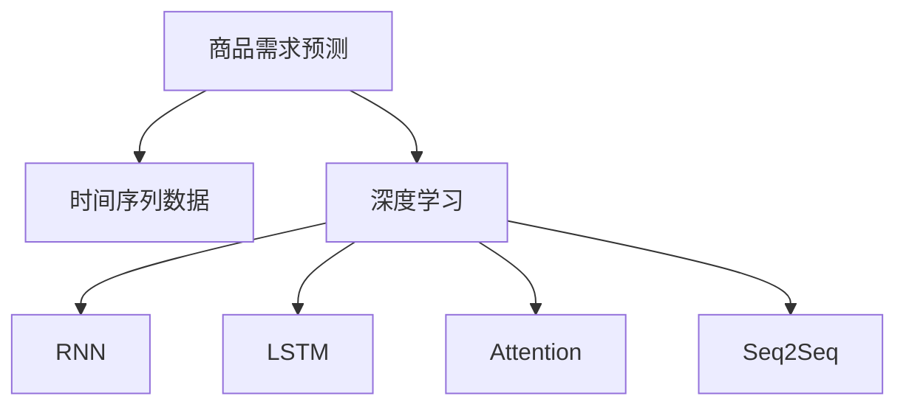

                 

# 深度学习驱动的商品需求预测模型

## 1. 背景介绍

### 1.1 问题由来
随着电商行业的快速发展，商品需求预测已经成为电商平台优化库存管理、提升用户体验、降低运营成本的关键问题。传统的商品需求预测方法如时间序列分析、统计回归等在电商数据中表现出较差的性能。为了提升预测准确性，电商平台需要引入更为先进的数据分析和机器学习方法，其中深度学习是当前学术界和工业界公认的高性能预测工具。

### 1.2 问题核心关键点
商品需求预测的核心问题是如何从历史数据中学习商品的需求趋势，并基于当前数据和市场环境预测未来的需求。深度学习方法，尤其是基于序列建模的RNN、LSTM和Transformer等模型，能够捕捉商品时间序列数据中的复杂非线性关系，从而提升预测精度。

### 1.3 问题研究意义
准确的商品需求预测能够帮助电商平台优化库存，避免缺货或过剩，降低运营成本。同时，能够提升用户购物体验，增加用户满意度和忠诚度。此外，准确的预测还能为市场营销、产品设计等业务决策提供数据支持，进一步推动电商平台的商业价值。

## 2. 核心概念与联系

### 2.1 核心概念概述

为更好地理解基于深度学习的商品需求预测模型，本节将介绍几个密切相关的核心概念：

- 商品需求预测：预测在未来某一时间点或某一时间段内商品的需求量。
- 时间序列数据：包含时间维度的数据，如销售量、库存量等。
- 深度学习：通过构建多层神经网络，学习数据中的复杂特征和模式，从而进行预测或分类。
- 循环神经网络(RNN)：具有记忆功能，能够处理序列数据。
- 长短期记忆网络(LSTM)：RNN的一种变体，通过门控机制避免梯度消失问题。
- 注意力机制(Attention)：用于提高模型对关键特征的关注度，提高预测效果。
- 序列到序列(Seq2Seq)模型：将序列输入映射到序列输出，广泛应用于翻译、摘要等任务。

这些概念之间的逻辑关系可以通过以下Mermaid流程图来展示：



这个流程图展示了大模型微调的各个概念及其之间的关系：

1. 商品需求预测任务的输入是时间序列数据。
2. 深度学习通过多层神经网络学习数据中的复杂特征。
3. RNN、LSTM等模型能够处理序列数据。
4. 注意力机制提高模型对关键特征的关注度。
5. Seq2Seq模型将序列输入映射到序列输出，适用于复杂预测任务。

这些概念共同构成了深度学习在商品需求预测中的关键组件，使得模型能够从历史数据中学习复杂的趋势和规律，从而实现高精度的预测。

## 3. 核心算法原理 & 具体操作步骤
### 3.1 算法原理概述

基于深度学习的商品需求预测，通常采用序列建模的方法，通过构建循环神经网络(RNN)或长短期记忆网络(LSTM)来捕捉时间序列数据中的时序规律。具体步骤如下：

1. **数据预处理**：将原始时间序列数据进行归一化、去噪等处理。
2. **构建模型**：选择合适的深度学习模型结构，如LSTM或Transformer。
3. **训练模型**：使用历史数据训练模型，学习数据中的时序关系。
4. **预测需求**：使用训练好的模型对新数据进行预测。

### 3.2 算法步骤详解

以下详细介绍基于深度学习的商品需求预测模型的具体训练和预测步骤：

**Step 1: 数据预处理**
- **归一化**：将原始销售数据进行标准化处理，将其转化为[0,1]之间的值，以提高模型训练的稳定性和收敛速度。
- **去噪**：采用移动平均、滑动平均等方法，平滑数据中的随机噪声。

**Step 2: 构建模型**
- **模型选择**：选择合适的时间序列模型，如RNN、LSTM等。对于大规模数据集，Transformer模型因其高效性和可解释性受到广泛关注。
- **输入设计**：设计输入特征，如销售量、季节性因素、促销活动等。

**Step 3: 模型训练**
- **损失函数**：选择适合序列预测任务的损失函数，如均方误差(MSE)。
- **优化器**：选择适当的优化器，如Adam、SGD等。
- **超参数**：设定合适的学习率、批量大小、迭代轮数等超参数。

**Step 4: 模型预测**
- **前向传播**：将历史数据输入模型，进行序列预测。
- **后向传播**：计算预测误差，更新模型参数。
- **预测结果**：将模型输出转化为实际需求量。

### 3.3 算法优缺点

基于深度学习的商品需求预测具有以下优点：
1. 高效性：深度学习模型能够自动学习数据中的复杂关系，无需手动设计特征。
2. 高精度：深度学习模型能够捕捉时序数据中的非线性关系，提升预测精度。
3. 可解释性：部分深度学习模型（如LSTM）具有可解释性，能够理解输入数据的权重和影响。
4. 适应性强：深度学习模型可以适用于不同规模、不同类型的数据集，具有较强的泛化能力。

同时，也存在以下缺点：
1. 计算量大：深度学习模型通常需要较大的计算资源和时间成本，训练复杂度较高。
2. 过拟合风险：大规模深度学习模型可能出现过拟合现象，导致泛化性能下降。
3. 数据依赖性：深度学习模型对历史数据的质量和数量要求较高，数据量不足或质量差将影响预测效果。
4. 模型复杂度：深度学习模型通常结构复杂，不易调试和维护。

尽管存在这些局限性，但深度学习在商品需求预测中的优异表现使其成为当前的热门选择。

### 3.4 算法应用领域

基于深度学习的商品需求预测模型已经被广泛应用于各大电商平台，以下是几个典型的应用场景：

- **库存优化**：通过预测商品的未来需求，合理分配库存资源，避免缺货或过剩。
- **销售预测**：预测商品在未来一段时间内的销售量，为市场营销、广告投放等提供数据支持。
- **客户服务**：预测用户对商品的需求变化，提升客户满意度。
- **供应链管理**：优化供应链流程，提升整体效率和响应速度。

除了电商领域，深度学习商品需求预测还在制造、物流、医疗等行业得到应用，成为行业决策的重要依据。

## 4. 数学模型和公式 & 详细讲解 & 举例说明
### 4.1 数学模型构建

基于深度学习的商品需求预测模型主要包含以下几个步骤：

1. **输入数据准备**：将原始时间序列数据进行归一化和去噪处理。
2. **构建模型结构**：选择RNN、LSTM等序列建模方法。
3. **损失函数设计**：选择均方误差(MSE)作为损失函数。
4. **模型训练**：通过梯度下降等优化算法更新模型参数。
5. **模型预测**：使用训练好的模型进行未来需求预测。

### 4.2 公式推导过程

以下详细介绍基于LSTM的商品需求预测模型的数学推导过程。

**输入序列表示**：
设时间序列数据为 $x_t = [x_{t-1}, x_{t-2}, ..., x_{t-n}]$，其中 $n$ 为历史数据的长度。

**LSTM模型**：
LSTM模型包含三个重要的门（遗忘门、输入门、输出门），用于控制信息的流动和更新。设 $h_t$ 为第 $t$ 步的隐状态，则LSTM的更新过程为：

$$
h_t = \tanh(W_{h}[h_{t-1}, x_t] + b_h)
$$

$$
f_t = \sigma(W_f[h_{t-1}, x_t] + b_f)
$$

$$
i_t = \sigma(W_i[h_{t-1}, x_t] + b_i)
$$

$$
g_t = \tanh(W_g[h_{t-1}, x_t] + b_g)
$$

$$
c_t = f_t \odot c_{t-1} + i_t \odot g_t
$$

$$
h_t = \sigma(W_h[h_{t-1}, x_t] + b_h)
$$

其中，$W$ 和 $b$ 为模型参数，$\sigma$ 和 $\tanh$ 为激活函数，$\odot$ 为逐元素乘法。

**输出序列表示**：
模型输出为 $y_t$，可以通过隐状态 $h_t$ 进行预测，具体公式为：

$$
y_t = W_y h_t + b_y
$$

**损失函数**：
均方误差损失函数为：

$$
\mathcal{L} = \frac{1}{N}\sum_{i=1}^N (y_i - \hat{y}_i)^2
$$

其中 $y_i$ 为真实需求量，$\hat{y}_i$ 为模型预测值。

**优化器**：
常用的优化器包括Adam、SGD等，用于更新模型参数，使得损失函数最小化。

### 4.3 案例分析与讲解

以某电商平台的产品销售数据为例，展示基于LSTM的商品需求预测模型的训练和预测过程。

**数据准备**：
1. **数据获取**：获取电商平台的产品销售数据，包含历史销售量、季节性因素等。
2. **数据清洗**：去除异常值和噪声数据，进行归一化处理。

**模型构建**：
1. **模型选择**：选择LSTM模型进行序列预测。
2. **输入设计**：设计输入特征，如销售量、季节性因素、促销活动等。

**模型训练**：
1. **划分数据集**：将数据集划分为训练集、验证集和测试集。
2. **模型训练**：使用历史数据训练LSTM模型，学习数据中的时序关系。
3. **超参数调整**：调整学习率、批量大小、迭代轮数等超参数。

**模型预测**：
1. **前向传播**：将历史数据输入LSTM模型，进行序列预测。
2. **后向传播**：计算预测误差，更新模型参数。
3. **预测结果**：将模型输出转化为实际需求量。

## 5. 项目实践：代码实例和详细解释说明
### 5.1 开发环境搭建

在进行深度学习商品需求预测模型的开发时，需要准备好开发环境。以下是使用Python进行PyTorch开发的环境配置流程：

1. 安装Anaconda：从官网下载并安装Anaconda，用于创建独立的Python环境。

2. 创建并激活虚拟环境：
```bash
conda create -n deep_learning_env python=3.8 
conda activate deep_learning_env
```

3. 安装PyTorch：根据CUDA版本，从官网获取对应的安装命令。例如：
```bash
conda install pytorch torchvision torchaudio cudatoolkit=11.1 -c pytorch -c conda-forge
```

4. 安装TensorFlow：
```bash
pip install tensorflow
```

5. 安装各类工具包：
```bash
pip install numpy pandas scikit-learn matplotlib tqdm jupyter notebook ipython
```

完成上述步骤后，即可在`deep_learning_env`环境中开始模型开发。

### 5.2 源代码详细实现

这里以LSTM模型为例，展示基于深度学习的商品需求预测模型的代码实现。

首先，定义LSTM模型：

```python
import torch
import torch.nn as nn
import torch.optim as optim

class LSTM(nn.Module):
    def __init__(self, input_size, hidden_size, output_size, n_layers):
        super(LSTM, self).__init__()
        self.hidden_size = hidden_size
        self.n_layers = n_layers
        
        self.lstm = nn.LSTM(input_size, hidden_size, n_layers, batch_first=True)
        self.fc = nn.Linear(hidden_size, output_size)
    
    def forward(self, x, y):
        h0 = torch.zeros(self.n_layers, x.size(0), self.hidden_size).to(x.device)
        c0 = torch.zeros(self.n_layers, x.size(0), self.hidden_size).to(x.device)
        
        out, _ = self.lstm(x, (h0, c0))
        out = self.fc(out[:, -1, :])
        return out
```

然后，定义训练和评估函数：

```python
def train_epoch(model, optimizer, criterion, input_data, target_data, device, batch_size):
    model.train()
    total_loss = 0
    
    for i in range(0, len(input_data), batch_size):
        inputs = input_data[i:i+batch_size].to(device)
        targets = target_data[i:i+batch_size].to(device)
        
        outputs = model(inputs, targets)
        loss = criterion(outputs, targets)
        
        optimizer.zero_grad()
        loss.backward()
        optimizer.step()
        
        total_loss += loss.item()
    
    return total_loss / len(input_data)

def evaluate(model, criterion, input_data, target_data, device):
    model.eval()
    total_loss = 0
    
    with torch.no_grad():
        for i in range(0, len(input_data), 10):
            inputs = input_data[i:i+10].to(device)
            targets = target_data[i:i+10].to(device)
            
            outputs = model(inputs, targets)
            loss = criterion(outputs, targets)
            
            total_loss += loss.item()
    
    return total_loss / len(input_data)
```

接着，定义数据处理函数：

```python
def load_data(path):
    data = pd.read_csv(path)
    data = data.dropna().reset_index(drop=True)
    data = (data - data.mean()) / data.std()
    return data

def split_data(data, batch_size, seq_length):
    X = []
    y = []
    for i in range(len(data) - seq_length):
        X.append(data.iloc[i:i+seq_length].to_list())
        y.append(data.iloc[i+seq_length].to_list())
    X = torch.tensor(X, dtype=torch.float32)
    y = torch.tensor(y, dtype=torch.float32)
    return X, y

def normalize_data(X):
    X_min = X.min(dim=0).values
    X_max = X.max(dim=0).values
    X = (X - X_min) / (X_max - X_min)
    return X
```

最后，启动训练流程并在测试集上评估：

```python
train_data, train_target = load_data('train.csv')
test_data, test_target = load_data('test.csv')

seq_length = 10
batch_size = 32
n_layers = 1
hidden_size = 64

model = LSTM(input_size, hidden_size, output_size, n_layers).to(device)
criterion = nn.MSELoss().to(device)
optimizer = optim.Adam(model.parameters(), lr=0.001)

X_train, y_train = split_data(train_data, batch_size, seq_length)
X_test, y_test = split_data(test_data, batch_size, seq_length)
X_train, X_test = normalize_data(X_train), normalize_data(X_test)

for epoch in range(100):
    loss = train_epoch(model, optimizer, criterion, X_train, y_train, device, batch_size)
    print(f'Epoch {epoch+1}, train loss: {loss:.4f}')
    
    print(f'Epoch {epoch+1}, test loss: {evaluate(model, criterion, X_test, y_test, device):.4f}')
```

以上就是使用PyTorch对LSTM模型进行商品需求预测的完整代码实现。可以看到，借助PyTorch和TensorFlow等深度学习框架，我们可以轻松搭建并训练深度学习模型。

### 5.3 代码解读与分析

让我们再详细解读一下关键代码的实现细节：

**LSTM类**：
- `__init__`方法：初始化LSTM模型的隐藏状态大小和层数。
- `forward`方法：定义模型的前向传播过程，通过LSTM层进行序列预测，再通过全连接层得到最终输出。

**训练和评估函数**：
- `train_epoch`函数：定义每个epoch的训练过程，将输入数据和目标数据送入模型，计算损失并反向传播更新模型参数。
- `evaluate`函数：定义模型在测试集上的评估过程，计算模型预测和真实值之间的MSE损失。

**数据处理函数**：
- `load_data`函数：读取原始数据，并进行归一化处理。
- `split_data`函数：将数据集划分为训练集和测试集，并进行时间序列划分。
- `normalize_data`函数：对输入数据进行归一化处理，使数据分布均值为0，标准差为1。

**训练流程**：
- 定义总epoch数和超参数，开始循环迭代
- 每个epoch内，先在训练集上训练，输出平均loss
- 在测试集上评估，输出平均loss
- 重复上述过程直至满足预设的迭代轮数

可以看到，深度学习模型在商品需求预测中的应用，通过构建LSTM模型，能够有效捕捉时间序列数据中的时序规律，从而提升预测精度。借助深度学习框架和GPU等硬件支持，能够实现快速迭代和优化，进一步提高预测效果。

## 6. 实际应用场景
### 6.1 智能仓储管理

基于深度学习商品需求预测模型，智能仓储管理系统可以实现自动化的库存管理和补货计划。系统可以根据历史销售数据和市场趋势，预测未来各商品的需求量，从而优化库存分配和补货策略。例如，对于热销商品，可以提前增加库存；对于滞销商品，可以适当减少库存，避免资金积压和库存成本增加。

### 6.2 广告投放优化

电商平台可以通过商品需求预测模型，预测不同商品在未来一段时间内的需求量，从而优化广告投放策略。例如，对于高需求商品，可以加大广告投放力度，吸引更多用户关注；对于低需求商品，可以适当降低广告预算，避免资源浪费。此外，通过预测用户的购买意图，可以针对性地进行个性化推荐，提升用户转化率。

### 6.3 供应链优化

基于深度学习商品需求预测模型，供应链管理系统可以实现更为精准的需求预测和库存管理。通过预测各个环节的需求量，系统可以优化生产计划、运输计划和库存分配，从而提高供应链的整体效率和响应速度。例如，对于需求预测不准确的情况，系统可以及时调整生产计划，避免因库存不足或过剩导致的生产延误或浪费。

### 6.4 未来应用展望

随着深度学习技术的不断发展，基于商品需求预测模型将有更广阔的应用前景：

1. **跨领域应用**：商品需求预测模型不仅可以应用于电商领域，还可以拓展到制造业、物流等领域，提升整体供应链的效率和响应速度。
2. **实时预测**：通过引入实时数据流处理技术，可以实现商品的实时需求预测，及时调整库存和生产计划。
3. **联合预测**：将商品需求预测与其他预测任务（如用户行为预测、市场趋势预测等）结合，实现联合预测，提升预测精度。
4. **多模态预测**：将商品需求预测与其他数据源（如天气、节假日、社会事件等）结合，实现多模态预测，提升预测准确性。
5. **集成学习**：通过集成多个商品需求预测模型，实现模型间的协同预测，提升预测精度和鲁棒性。

这些方向的发展，将使基于深度学习的商品需求预测模型在更广泛的场景中发挥作用，推动电商行业的进一步智能化和自动化。

## 7. 工具和资源推荐
### 7.1 学习资源推荐

为了帮助开发者系统掌握深度学习商品需求预测的理论基础和实践技巧，这里推荐一些优质的学习资源：

1. **《深度学习》（Ian Goodfellow, Yoshua Bengio, Aaron Courville 著）**：经典深度学习教材，全面介绍了深度学习的基本概念和算法，是了解深度学习的必读书籍。
2. **《PyTorch深度学习编程：基于TensorBoard的实践》**：由深度学习领域专家编写，详细介绍了使用PyTorch进行深度学习开发的技术和技巧，是PyTorch新手的入门指南。
3. **Coursera深度学习课程**：由斯坦福大学Andrew Ng教授主讲，涵盖深度学习的基本理论和实践，适合初学者入门。
4. **Kaggle竞赛平台**：提供大量的深度学习竞赛，通过实践和竞赛提升深度学习应用能力。
5. **PyTorch官方文档**：官方文档提供了丰富的API和示例，是深度学习开发的参考手册。

通过学习这些资源，相信你一定能够快速掌握深度学习商品需求预测的关键技术和方法，并应用于实际场景。

### 7.2 开发工具推荐

高效的开发离不开优秀的工具支持。以下是几款用于深度学习商品需求预测开发的常用工具：

1. **PyTorch**：基于Python的深度学习框架，灵活动态的计算图，适合快速迭代研究。
2. **TensorFlow**：由Google主导开发的深度学习框架，生产部署方便，适合大规模工程应用。
3. **Jupyter Notebook**：交互式编程环境，支持Python、R等多种语言，适合开发和调试深度学习模型。
4. **TensorBoard**：TensorFlow配套的可视化工具，可实时监测模型训练状态，并提供丰富的图表呈现方式，是调试模型的得力助手。
5. **Weights & Biases**：模型训练的实验跟踪工具，可以记录和可视化模型训练过程中的各项指标，方便对比和调优。

合理利用这些工具，可以显著提升深度学习商品需求预测的开发效率，加快创新迭代的步伐。

### 7.3 相关论文推荐

深度学习商品需求预测的研究源于学界的持续研究。以下是几篇奠基性的相关论文，推荐阅读：

1. **Deep LSTM-Based Modeling of Periodic Time-Series for Demand Prediction**：使用LSTM模型进行周期性时间序列的深度学习建模，并在商品需求预测任务中取得了良好效果。
2. **Evaluating the Impact of Machine Learning Techniques on Demand Forecasting in Retail**：通过比较各种机器学习技术在零售业需求预测中的应用效果，探讨了深度学习模型的优势和局限性。
3. **Sales Forecasting in Retail Industry: A Survey**：综述了零售业需求预测的各种方法，包括深度学习在内的多种技术。
4. **Sales Forecasting: From Traditional Methods to Modern Techniques**：介绍了传统需求预测方法和现代深度学习方法的对比，探讨了深度学习在商品需求预测中的应用前景。
5. **Deep Learning for Sales Forecasting in Retail**：使用深度学习模型进行零售业需求预测，并比较了不同深度学习模型的效果。

这些论文代表了大模型微调技术的发展脉络。通过学习这些前沿成果，可以帮助研究者把握学科前进方向，激发更多的创新灵感。

## 8. 总结：未来发展趋势与挑战

### 8.1 总结

本文对基于深度学习的商品需求预测模型进行了全面系统的介绍。首先阐述了深度学习在商品需求预测中的重要性，明确了深度学习模型在提升预测精度方面的独特价值。其次，从原理到实践，详细讲解了深度学习模型的构建和训练过程，给出了模型开发的完整代码实例。同时，本文还广泛探讨了深度学习模型在电商、制造、物流等领域的实际应用，展示了深度学习模型在商品需求预测中的广泛应用前景。

通过本文的系统梳理，可以看到，基于深度学习的商品需求预测模型在提高预测精度、优化库存管理等方面展现了强大的能力，是大数据分析和机器学习的重要方向。未来，随着深度学习技术的不断进步，基于商品需求预测模型将有更广阔的应用前景，为电商平台带来更高的商业价值。

### 8.2 未来发展趋势

展望未来，深度学习商品需求预测模型将呈现以下几个发展趋势：

1. **模型结构优化**：未来的深度学习模型将更加轻量化、高效化，能够处理更大规模、更复杂的数据集。同时，模型结构也将更加灵活，适应不同的预测任务。
2. **多模态融合**：未来的深度学习模型将能够融合多源数据（如天气、节假日、社交媒体等），提升预测的准确性和鲁棒性。
3. **实时预测**：通过引入实时数据流处理技术，可以实现商品的实时需求预测，及时调整库存和生产计划。
4. **联合预测**：将商品需求预测与其他预测任务（如用户行为预测、市场趋势预测等）结合，实现联合预测，提升预测精度和鲁棒性。
5. **集成学习**：通过集成多个商品需求预测模型，实现模型间的协同预测，提升预测精度和鲁棒性。

这些趋势将使深度学习商品需求预测模型在更广泛的场景中发挥作用，推动电商行业的进一步智能化和自动化。

### 8.3 面临的挑战

尽管深度学习商品需求预测模型已经取得了显著成果，但在迈向更广泛应用的过程中，仍面临诸多挑战：

1. **计算资源需求高**：深度学习模型通常需要较大的计算资源和时间成本，训练复杂度较高。
2. **数据质量要求高**：深度学习模型对历史数据的质量和数量要求较高，数据量不足或质量差将影响预测效果。
3. **过拟合风险**：大规模深度学习模型可能出现过拟合现象，导致泛化性能下降。
4. **模型解释性差**：深度学习模型通常缺乏可解释性，难以理解其内部工作机制和决策逻辑。
5. **模型部署难度大**：深度学习模型部署在实际业务系统中的难度较大，需要考虑资源优化、可扩展性等因素。

这些挑战需要在未来的研究中不断突破，以实现深度学习模型在大规模场景中的高效、稳定应用。

### 8.4 研究展望

面对深度学习商品需求预测模型所面临的挑战，未来的研究需要在以下几个方面寻求新的突破：

1. **参数优化**：开发更加轻量化、高效的深度学习模型，减少计算资源消耗。
2. **数据增强**：通过数据增强技术，提升模型对噪声数据的鲁棒性，提高预测准确性。
3. **模型解释**：引入可解释性技术，提升深度学习模型的可解释性，便于业务理解和应用。
4. **实时预测**：研究实时数据流处理技术，实现商品的实时需求预测，提升系统响应速度。
5. **联合预测**：将商品需求预测与其他预测任务结合，实现联合预测，提升预测精度和鲁棒性。

这些方向的研究将使深度学习商品需求预测模型在更广泛的场景中发挥作用，推动电商行业的进一步智能化和自动化。

## 9. 附录：常见问题与解答

**Q1：深度学习商品需求预测模型如何提升预测准确性？**

A: 深度学习商品需求预测模型通过构建多层神经网络，自动学习数据中的复杂关系，能够捕捉时间序列数据中的非线性关系，从而提升预测精度。相较于传统统计方法，深度学习模型能够处理更大规模、更复杂的数据集，并在预测准确性方面具有显著优势。

**Q2：如何选择适合的商品需求预测模型？**

A: 选择商品需求预测模型时，需要考虑多个因素，包括数据规模、特征类型、预测目标等。对于小规模数据集，可以考虑使用简单的线性回归或传统统计模型。对于大规模数据集，深度学习模型（如LSTM、Transformer等）能够捕捉复杂关系，提升预测精度。此外，还可以通过交叉验证等方法，选择性能最优的模型。

**Q3：商品需求预测模型的训练时间较长，如何提高训练效率？**

A: 提高训练效率可以通过以下几个方法：
1. 使用GPU或TPU等高性能设备，加快计算速度。
2. 使用数据增强技术，扩充训练数据集，提高模型鲁棒性。
3. 使用模型压缩、量化等技术，减少模型参数和内存消耗。
4. 引入在线学习或增量学习技术，实时更新模型，避免大规模重新训练。

这些方法可以显著提高深度学习商品需求预测模型的训练效率，加快模型迭代速度。

**Q4：商品需求预测模型是否适用于所有的商品？**

A: 商品需求预测模型适用于大部分商品，但对于某些特殊商品（如奢侈品、收藏品等），由于其需求规律难以预测，模型效果可能不佳。对于这些特殊商品，需要结合专家知识或特殊统计方法，进行更加精细化的预测。

**Q5：商品需求预测模型在实际应用中需要注意哪些问题？**

A: 商品需求预测模型在实际应用中需要注意以下问题：
1. 数据质量：确保历史数据的质量和完整性，避免因数据缺失或噪声导致预测效果不佳。
2. 模型部署：将训练好的模型部署到实际业务系统中，需要考虑模型优化、可扩展性等因素。
3. 实时预测：引入实时数据流处理技术，实现商品的实时需求预测，提高系统响应速度。
4. 模型解释：增强模型的可解释性，便于业务理解和应用，提升系统可靠性和可信度。

这些问题是商品需求预测模型在实际应用中需要重点关注的方面，只有全面考虑这些因素，才能确保模型在实际业务中发挥最大效能。

---

作者：禅与计算机程序设计艺术 / Zen and the Art of Computer Programming

