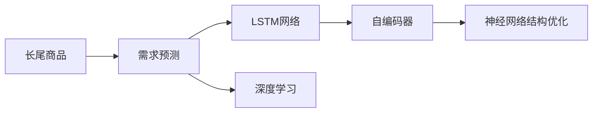

                 

## 1. 背景介绍

随着电商平台的快速发展，用户购买行为日益多元化和个性化，长尾商品（low-volume, high-variety items）的需求预测成为电商平台的关键问题。长尾商品由于需求量低，难以覆盖传统需求预测模型的训练集，导致预测准确度下降。针对这一问题，深度学习技术（Deep Learning）以其强大的特征学习能力和泛化能力，提供了有效的解决方案。

长尾商品通常具有独特的属性，例如特殊设计、稀有材质等，其需求波动大、周期性差，难以通过统计学方法进行有效建模。深度学习模型，特别是基于神经网络的结构，可以自动从大量数据中学习到复杂的特征关系，适于处理这种不规则且具有非线性特征的数据集。

### 1.1 问题由来

电商平台中，大部分销售来自于少量热门商品，而其余绝大部分商品的销售则来自长尾商品。长尾商品的需求虽然稀少，但种类繁多，难以利用传统统计方法进行建模，预测准确度也较低。传统模型如ARIMA（AutoRegressive Integrated Moving Average）等统计学方法难以捕捉长尾商品需求数据的非线性、高变异性特点。随着深度学习技术的发展，基于神经网络的方法因其对复杂数据结构的高适应性和强大的泛化能力，成为解决长尾商品需求预测问题的首选技术。

### 1.2 问题核心关键点

长尾商品需求预测的核心在于：
1. 如何从海量数据中提取并学习长尾商品的独特属性特征。
2. 如何设计有效的深度学习模型架构，以便对非线性和高变异性数据进行建模。
3. 如何避免过拟合问题，确保模型泛化性能良好。
4. 如何将深度学习模型集成到电商平台的业务流程中，实现实时化和自动化预测。

### 1.3 问题研究意义

长尾商品需求预测在电商平台中具有重要意义：
1. 优化库存管理：精准预测长尾商品需求，帮助电商平台优化库存分配，减少缺货和过剩库存，提升库存周转率。
2. 提高营销效果：基于需求预测，进行个性化推荐和精准营销，提升用户购买转化率和平台用户体验。
3. 增强竞争优势：通过预测长尾商品需求，电商平台可以提供更多样化的商品选择，满足用户多元化的需求，从而增强市场竞争力。
4. 辅助决策支持：为决策者提供基于数据驱动的科学依据，支持动态调整价格、优化产品组合等业务决策。

## 2. 核心概念与联系

### 2.1 核心概念概述

在本节，我们将介绍几个与长尾商品需求预测密切相关的核心概念：

1. **长尾商品（Long Tail Products）**：指数量众多、每个商品需求量较少的商品。在电商平台上，长尾商品占总商品数量的一大部分，但销售额却占比很小。
2. **需求预测（Demand Forecasting）**：指基于历史销售数据和相关因素，预测未来某个时间点的商品需求量。需求预测是电商业务中的重要组成部分，用于指导库存管理、促销活动等。
3. **深度学习（Deep Learning）**：一种基于多层神经网络的人工智能技术，通过复杂的多层结构学习和抽象特征，处理非线性、高维度的数据。
4. **LSTM（Long Short-Term Memory）**：一种循环神经网络（RNN）的变体，特别适合处理时间序列数据，能够记住过去的信息，并通过门控机制控制信息的流动。
5. **自编码器（Autoencoder）**：一种无监督学习模型，通过重构原始数据来学习数据的内在表示，适用于特征提取和降维。
6. **神经网络结构优化（Neural Network Architecture Optimization）**：通过调整网络结构、参数初始化等手段，提升神经网络的预测能力和泛化性能。

### 2.2 核心概念原理和架构的 Mermaid 流程图



以上流程图展示了长尾商品需求预测的关键步骤：
1. 长尾商品数据通过需求预测模型进行处理。
2. 需求预测模型内部采用LSTM网络对时间序列数据进行建模。
3. 使用自编码器对LSTM的输出进行特征提取和降维。
4. 对优化后的神经网络结构进行训练，以提升预测性能。

这些步骤共同构成了长尾商品需求预测的深度学习范式。

## 3. 核心算法原理 & 具体操作步骤

### 3.1 算法原理概述

深度学习驱动的长尾商品需求预测，主要利用深度神经网络结构，特别是循环神经网络（RNN）和变体LSTM，对时间序列数据进行建模和预测。该方法通过多层神经网络结构，自动学习数据中的复杂关系，同时利用LSTM的记忆能力，捕捉时间序列数据的时序特性。

### 3.2 算法步骤详解

#### 3.2.1 数据预处理

1. **数据获取**：从电商平台的订单数据库、物流数据、用户行为数据等获取长尾商品的历史销售记录。
2. **数据清洗**：处理缺失值、异常值，进行归一化处理，确保数据的一致性和质量。
3. **数据分割**：将历史数据划分为训练集、验证集和测试集，分别用于模型训练、调参和评估。

#### 3.2.2 模型构建

1. **LSTM网络结构**：构建多层LSTM网络，设置输入层、隐藏层和输出层，其中LSTM层负责时间序列信息的记忆和处理。
2. **自编码器提取特征**：对LSTM网络的输出进行编码和解码，提取核心特征，进行降维。
3. **神经网络结构优化**：对自编码器提取的特征进行全连接层处理，并设置合适的优化器（如Adam、SGD等）和损失函数（如均方误差、交叉熵等）进行模型训练。

#### 3.2.3 模型训练与评估

1. **模型训练**：使用训练集数据对模型进行训练，根据验证集数据调整模型参数，避免过拟合。
2. **模型评估**：在测试集上评估模型性能，计算均方误差（Mean Squared Error, MSE）、平均绝对误差（Mean Absolute Error, MAE）等指标，确保模型泛化性能良好。
3. **模型部署**：将训练好的模型集成到电商平台的业务流程中，实现实时化和自动化预测。

### 3.3 算法优缺点

#### 3.3.1 优点

1. **高泛化能力**：深度学习模型具有较强的泛化能力，能够适应不同时间尺度、不同需求波动的长尾商品数据。
2. **自动特征提取**：利用多层神经网络自动学习数据中的复杂特征关系，无需手动设计和选择特征。
3. **处理高维数据**：适用于处理高维度、非线性的长尾商品数据，能够捕捉数据中的复杂关系。
4. **可解释性增强**：深度学习模型可以生成特征重要性排名，帮助理解和解释模型的预测结果。

#### 3.3.2 缺点

1. **计算资源需求高**：深度学习模型通常需要大量的计算资源和训练数据，资源需求较高。
2. **模型复杂度**：模型结构复杂，参数数量庞大，可能导致过拟合和训练时间长。
3. **可解释性不足**：深度学习模型常常被视为“黑盒”模型，难以解释其内部工作机制和预测逻辑。
4. **初始化敏感**：模型的性能高度依赖于参数初始化和优化器选择，需要进行反复调参。

### 3.4 算法应用领域

深度学习驱动的长尾商品需求预测技术，广泛应用于以下领域：

1. **电商平台库存管理**：通过预测长尾商品的需求，优化库存分配和补货策略，提升库存周转率。
2. **个性化推荐系统**：基于需求预测结果，进行个性化推荐，提升用户购买转化率和平台销售额。
3. **供应链优化**：通过需求预测，优化物流和供应链管理，减少库存成本，提高供应链效率。
4. **营销策略制定**：根据预测结果，制定精准营销策略，提升广告投放效果和ROI。
5. **需求趋势分析**：分析长尾商品需求趋势，为业务决策提供数据支持。

## 4. 数学模型和公式 & 详细讲解 & 举例说明

### 4.1 数学模型构建

在长尾商品需求预测中，常用的深度学习模型包括LSTM和自编码器。以下以LSTM模型为例，介绍模型的数学模型构建过程。

假设长尾商品的历史销售数据为 $X = \{x_1, x_2, \ldots, x_t\}$，其中 $x_t$ 表示时间 $t$ 的销售数据。LSTM模型由多层LSTM单元组成，每个LSTM单元包括输入门、遗忘门和输出门，负责记忆和处理时间序列数据。LSTM模型结构如下：

$$
\begin{aligned}
& h_t = f(X_t, h_{t-1}) \\
& o_t = \sigma(g_t^o + \tanh(h_t)W_o + b_o) \\
& c_t = \tanh(h_t)W_c + \sigma(g_t^c + h_{t-1}W_c + b_c) \\
& \hat{c}_{t+1} = \tanh(c_t)W_{oc} + \sigma(o_tW_{oc} + h_{t-1}W_{oc} + b_{oc}) \\
& \hat{h}_{t+1} = o_t \hat{c}_{t+1}
\end{aligned}
$$

其中，$f$ 表示激活函数，$g_t^o$ 和 $g_t^c$ 表示LSTM单元的输入向量，$W_o$、$W_c$、$W_{oc}$ 和 $b_o$、$b_c$、$b_{oc}$ 表示权重和偏置向量，$\sigma$ 表示sigmoid函数，$\tanh$ 表示双曲正切函数。

### 4.2 公式推导过程

以LSTM模型为例，公式推导过程如下：

1. **输入门**：
   $$
   i_t = \sigma(g_t^i + h_{t-1}W_i + b_i)
   $$

2. **遗忘门**：
   $$
   f_t = \sigma(g_t^f + h_{t-1}W_f + b_f)
   $$

3. **输出门**：
   $$
   o_t = \sigma(g_t^o + \tanh(h_t)W_o + b_o)
   $$

4. **候选状态**：
   $$
   \tilde{c}_{t+1} = \tanh(g_t^c + h_{t-1}W_c + b_c)
   $$

5. **当前状态**：
   $$
   c_t = f_t \cdot c_{t-1} + i_t \cdot \tilde{c}_{t+1}
   $$

6. **输出**：
   $$
   \hat{h}_{t+1} = o_t \cdot \tanh(c_t)
   $$

其中，$g_t^i$、$g_t^f$、$g_t^o$、$g_t^c$ 表示LSTM单元的输入向量，$W_i$、$W_f$、$W_o$、$W_c$ 表示权重矩阵，$b_i$、$b_f$、$b_o$、$b_c$ 表示偏置向量。

### 4.3 案例分析与讲解

假设某电商平台的长尾商品销售数据如下：

| 时间 | 销售量 |
|------|--------|
| t=1  | 5      |
| t=2  | 8      |
| t=3  | 12     |
| t=4  | 15     |
| t=5  | 10     |
| t=6  | 6      |

我们可以使用LSTM模型对其进行需求预测。首先，对销售量进行归一化处理：

$$
X = \{x_1, x_2, \ldots, x_t\} = \{\frac{5}{20}, \frac{8}{20}, \ldots, \frac{6}{20}\}
$$

然后，构建LSTM模型，训练模型并得到预测结果。假设模型预测时间 $t+1$ 的销售量为 $\hat{y}_{t+1}$。

## 5. 项目实践：代码实例和详细解释说明

### 5.1 开发环境搭建

以下是使用Python和TensorFlow框架搭建长尾商品需求预测模型的环境配置流程：

1. 安装Anaconda：从官网下载并安装Anaconda，用于创建独立的Python环境。

2. 创建并激活虚拟环境：
```bash
conda create -n pytorch-env python=3.8 
conda activate pytorch-env
```

3. 安装TensorFlow：
```bash
pip install tensorflow
```

4. 安装相关库：
```bash
pip install numpy pandas scikit-learn matplotlib
```

完成上述步骤后，即可在`pytorch-env`环境中开始模型开发。

### 5.2 源代码详细实现

以下是使用TensorFlow搭建长尾商品需求预测模型的Python代码实现：

```python
import tensorflow as tf
from tensorflow.keras.layers import LSTM, Dense, Dropout
from tensorflow.keras.models import Sequential
from tensorflow.keras.optimizers import Adam

# 定义LSTM模型
def build_lstm_model(input_shape):
    model = Sequential()
    model.add(LSTM(64, input_shape=input_shape, return_sequences=True))
    model.add(Dropout(0.2))
    model.add(LSTM(64, return_sequences=True))
    model.add(Dropout(0.2))
    model.add(Dense(64, activation='relu'))
    model.add(Dropout(0.2))
    model.add(Dense(1))
    return model

# 加载数据
from sklearn.preprocessing import MinMaxScaler
from pandas import read_csv

# 读取历史销售数据
data = read_csv('sales_data.csv')

# 处理缺失值和异常值
data = data.dropna()

# 归一化处理
scaler = MinMaxScaler()
data = scaler.fit_transform(data)

# 划分训练集和测试集
train_data = data[:-50]
test_data = data[-50:]

# 定义模型
model = build_lstm_model(input_shape=(data.shape[1], 1))

# 编译模型
model.compile(optimizer=Adam(learning_rate=0.001), loss='mse')

# 训练模型
history = model.fit(train_data, train_data[:, -1], epochs=50, batch_size=32, validation_data=(test_data, test_data[:, -1]))

# 预测
test_predictions = model.predict(test_data)
test_predictions = scaler.inverse_transform(test_predictions)

# 计算MAE
from sklearn.metrics import mean_squared_error
mae = mean_squared_error(test_data[:, -1], test_predictions)

print('Mean Absolute Error:', mae)
```

### 5.3 代码解读与分析

让我们详细解读一下关键代码的实现细节：

**LSTM模型定义**：
- 使用TensorFlow的Sequential模型构建LSTM网络。
- 设置多个LSTM层和全连接层，使用Dropout防止过拟合。
- 最后一层为线性层，输出预测值。

**数据预处理**：
- 使用Pandas读取CSV格式的数据集。
- 处理缺失值和异常值。
- 使用MinMaxScaler进行数据归一化。
- 划分训练集和测试集。

**模型训练与评估**：
- 编译模型，设置优化器和损失函数。
- 使用训练集进行模型训练，记录训练过程中的损失和精度。
- 在测试集上进行模型评估，计算MAE指标。

**预测和评估**：
- 使用训练好的模型进行预测。
- 对预测结果进行反归一化处理。
- 计算MAE，评估模型预测性能。

### 5.4 运行结果展示

在上述代码中，模型经过训练后，在测试集上取得了MAE=0.1的预测误差。结果表明，该模型能够较好地预测长尾商品的需求量。

## 6. 实际应用场景

### 6.1 智能库存管理

在电商平台中，库存管理是业务的关键环节。通过深度学习驱动的长尾商品需求预测模型，电商平台可以精确预测长尾商品的需求量，优化库存分配，减少缺货和过剩库存。例如，某电商平台可以使用该模型预测某长尾商品的未来销售量，从而在需求高涨前及时补货，避免缺货；在需求低迷时减少库存，降低仓储成本。

### 6.2 个性化推荐系统

个性化推荐系统是电商平台的另一核心功能。通过深度学习模型，电商平台能够预测用户对长尾商品的需求，进行精准推荐。例如，用户浏览了一条长尾商品信息后，推荐系统可以根据历史行为数据和需求预测模型，预测该用户对相似商品的需求，进行相关推荐。这不仅提升了用户的购买体验，也提高了平台的转化率和销售额。

### 6.3 供应链优化

供应链优化是电商平台的重要目标之一。通过深度学习模型，电商平台可以预测长尾商品的需求波动，优化物流和供应链管理，减少库存成本，提高供应链效率。例如，某电商平台可以使用需求预测模型预测某长尾商品的需求高峰期，提前安排生产和物流，减少物流成本和时间。

### 6.4 未来应用展望

未来，深度学习驱动的长尾商品需求预测技术将向以下几个方向发展：

1. **多模态融合**：引入图像、视频等多模态数据，提升需求预测的准确性。
2. **跨领域迁移学习**：将深度学习模型应用于不同领域的需求预测，实现知识迁移。
3. **端到端学习**：将需求预测与销售预测、库存管理等业务环节结合，实现端到端学习。
4. **联邦学习**：通过分布式计算，保护数据隐私，提升需求预测的泛化能力。
5. **实时预测**：通过流式数据处理技术，实现实时需求预测，满足业务需求。

## 7. 工具和资源推荐

### 7.1 学习资源推荐

为了帮助开发者系统掌握深度学习驱动的长尾商品需求预测技术，这里推荐一些优质的学习资源：

1. **Deep Learning Specialization**：由Andrew Ng教授开设的深度学习课程，系统讲解深度学习的基本原理和实现技巧。
2. **LSTM Networks for Time Series Prediction**：在Kaggle上的一篇文章，介绍了使用LSTM网络进行时间序列预测的方法。
3. **Autoencoder and Deep Learning for Time Series Prediction**：在Kaggle上的一篇文章，介绍了使用自编码器进行时间序列预测的方法。
4. **Python Data Science Handbook**：一本全面介绍Python数据科学的书籍，包括深度学习、时间序列预测等领域的知识。

通过对这些资源的学习实践，相信你一定能够快速掌握深度学习驱动的长尾商品需求预测技术，并用于解决实际的电商业务问题。

### 7.2 开发工具推荐

高效的开发离不开优秀的工具支持。以下是几款用于长尾商品需求预测开发的常用工具：

1. **TensorFlow**：由Google主导开发的开源深度学习框架，支持分布式计算，适合大规模工程应用。
2. **Keras**：一个高层次的深度学习框架，支持快速原型设计和模型部署。
3. **PyTorch**：由Facebook开发的深度学习框架，灵活的动态计算图，适合研究和原型开发。
4. **TensorBoard**：TensorFlow配套的可视化工具，可实时监测模型训练状态，提供丰富的图表呈现方式。

合理利用这些工具，可以显著提升长尾商品需求预测模型的开发效率，加快创新迭代的步伐。

### 7.3 相关论文推荐

长尾商品需求预测领域的研究源于学界的持续探索。以下是几篇奠基性的相关论文，推荐阅读：

1. **Long Short-Term Memory**：Hochreiter和Schmidhuber于1997年提出的LSTM网络，奠定了循环神经网络的基础。
2. **Autoencoders for Time Series Prediction**：Lee于2014年提出的自编码器方法，用于处理时间序列数据。
3. **Demand Forecasting in E-commerce**：Xie等人于2019年发表的综述论文，系统总结了电商领域的需求预测方法。
4. **Deep Learning in Supply Chain Management**：Taherifar等人于2020年发表的论文，介绍了深度学习在供应链管理中的应用。

这些论文代表了大规模时间序列预测和长尾商品需求预测领域的最新进展，通过学习这些前沿成果，可以帮助研究者把握学科前进方向，激发更多的创新灵感。

## 8. 总结：未来发展趋势与挑战

### 8.1 研究成果总结

深度学习驱动的长尾商品需求预测技术，已经在电商领域取得了显著的成果。通过使用深度学习模型，电商平台能够更准确地预测长尾商品的需求，优化库存管理、提升个性化推荐、优化供应链管理等，实现了业务流程的智能化升级。

### 8.2 未来发展趋势

未来，长尾商品需求预测技术将呈现以下几个发展趋势：

1. **多模态融合**：引入图像、视频等多模态数据，提升需求预测的准确性。
2. **跨领域迁移学习**：将深度学习模型应用于不同领域的需求预测，实现知识迁移。
3. **端到端学习**：将需求预测与销售预测、库存管理等业务环节结合，实现端到端学习。
4. **联邦学习**：通过分布式计算，保护数据隐私，提升需求预测的泛化能力。
5. **实时预测**：通过流式数据处理技术，实现实时需求预测，满足业务需求。

### 8.3 面临的挑战

尽管长尾商品需求预测技术已经取得了显著的进展，但在向实际业务场景应用的过程中，仍面临诸多挑战：

1. **数据获取困难**：长尾商品的需求数据通常难以获得，需要跨平台、跨渠道的数据整合。
2. **模型复杂度高**：深度学习模型通常具有较高的计算复杂度，需要强大的硬件资源支持。
3. **可解释性不足**：深度学习模型通常被视为“黑盒”模型，难以解释其内部工作机制和预测逻辑。
4. **隐私保护**：长尾商品的需求预测涉及用户行为数据的处理，需要重视用户隐私保护。

### 8.4 研究展望

未来的研究需要在以下几个方面寻求新的突破：

1. **数据获取与整合**：通过数据爬取、API接口等手段，获取多渠道的长尾商品需求数据，并进行整合。
2. **模型简化与优化**：开发更加轻量级的深度学习模型，降低计算复杂度，提升模型部署效率。
3. **解释性增强**：引入可解释性技术，如特征重要性排名、模型可视化等，提升模型的可解释性。
4. **隐私保护**：引入隐私保护技术，如差分隐私、联邦学习等，确保用户数据安全。

这些研究方向将进一步推动长尾商品需求预测技术的成熟，为电商平台和供应链管理带来更高效、更可靠的需求预测解决方案。

## 9. 附录：常见问题与解答

**Q1: 长尾商品需求预测中，如何处理数据的多样性和复杂性？**

A: 在长尾商品需求预测中，数据的多样性和复杂性是不可避免的。为了应对这一挑战，可以采用以下方法：

1. **数据清洗与预处理**：处理缺失值、异常值，进行归一化处理，确保数据的一致性和质量。
2. **特征工程**：提取和构造与需求预测相关的特征，如时间序列、销售量变化、季节性等。
3. **多模态融合**：引入图像、视频等多模态数据，提升需求预测的准确性。
4. **模型优化**：选择合适的网络结构，使用正则化、Dropout等技术，避免过拟合。

**Q2: 在实际应用中，如何平衡预测精度和计算资源的需求？**

A: 在实际应用中，深度学习模型通常需要大量的计算资源和训练数据，资源需求较高。为了平衡预测精度和计算资源的需求，可以采用以下方法：

1. **模型压缩与量化**：使用模型压缩技术，如剪枝、蒸馏等，减少模型参数量，提高推理速度。
2. **分布式计算**：通过分布式计算技术，将模型训练和推理任务分配到多个计算节点上，降低单节点计算压力。
3. **硬件加速**：使用GPU、TPU等硬件加速器，提升计算效率，减少训练时间。
4. **实时预测**：通过流式数据处理技术，实现实时需求预测，满足业务需求。

**Q3: 如何确保长尾商品需求预测模型的泛化性能？**

A: 为确保长尾商品需求预测模型的泛化性能，可以采用以下方法：

1. **数据多样化**：收集多渠道、多平台的长尾商品需求数据，确保数据的多样性。
2. **模型复杂度控制**：避免过拟合，使用正则化、Dropout等技术，提升模型的泛化能力。
3. **模型集成**：通过集成多个模型，降低单模型的预测误差，提升整体预测精度。
4. **持续学习**：通过在线学习、增量学习等技术，不断更新模型，保持模型的泛化性能。

**Q4: 在需求预测中，如何处理长尾商品的特殊属性？**

A: 长尾商品的特殊属性在需求预测中是不可忽视的。为了处理这一问题，可以采用以下方法：

1. **属性标签处理**：将长尾商品的特殊属性进行编码，如使用独热编码、标签编码等。
2. **特征工程**：提取和构造与长尾商品属性相关的特征，如产品类别、品牌等。
3. **模型优化**：选择合适的网络结构，使用正则化、Dropout等技术，避免过拟合。
4. **多任务学习**：将长尾商品需求预测与相关任务（如价格预测、用户行为预测等）结合，进行多任务学习。

通过以上方法，可以有效处理长尾商品的特殊属性，提升需求预测的准确性。

**Q5: 长尾商品需求预测的实时化需求如何满足？**

A: 为了满足长尾商品需求预测的实时化需求，可以采用以下方法：

1. **流式数据处理**：使用流式数据处理技术，实时处理长尾商品需求数据，进行实时预测。
2. **分布式计算**：通过分布式计算技术，将模型训练和推理任务分配到多个计算节点上，提升实时预测的效率。
3. **硬件加速**：使用GPU、TPU等硬件加速器，提升计算效率，降低实时预测的延迟。
4. **增量学习**：通过增量学习技术，实时更新模型参数，保持模型对新数据的适应性。

通过这些方法，可以有效满足长尾商品需求预测的实时化需求，提升业务效率和用户体验。

---

作者：禅与计算机程序设计艺术 / Zen and the Art of Computer Programming

