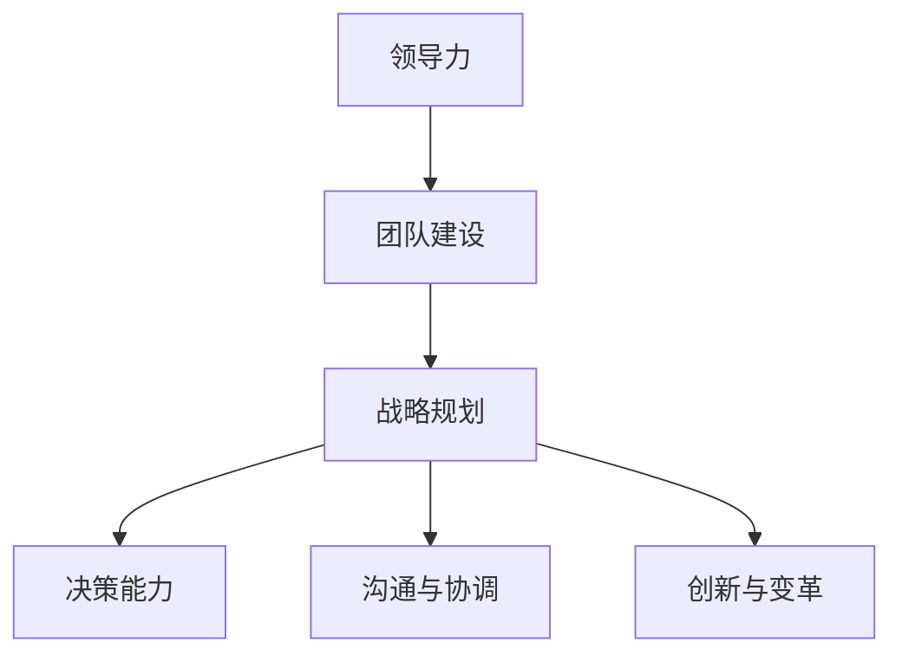

                 

# 深度思考:区分优秀管理者的标准

## 1. 背景介绍

在IT行业的快速发展和企业竞争的加剧下，优秀的管理团队对于企业成功的重要性愈发凸显。然而，什么样的管理者才算优秀，不同企业有不同的评判标准。本文旨在深入探讨优秀管理者的核心素质和行为特征，通过多维度的分析，提出一套系统化的衡量标准，以帮助企业识别和培养卓越的管理人才。

### 1.1 问题由来

随着科技的进步和市场环境的变迁，企业的管理模式也在不断演进。从传统的层级管理到扁平化组织，再到敏捷组织，现代企业越来越重视团队协作和创新。然而，优秀的管理者究竟具有哪些不可替代的特质，学术界和企业界对此尚无统一标准。本文通过文献综述和案例分析，总结了优秀管理者的主要特征，并从理论层面和实践层面，探讨了这些特征的实现路径。

### 1.2 问题核心关键点

本文的核心问题在于区分优秀管理者的标准，并探讨这些标准的实现方法。具体包括以下几个关键点：

1. **领导力和团队建设**：优秀管理者如何通过领导力激励和引导团队，实现高效的团队协作。
2. **战略规划与执行**：优秀管理者如何制定和执行战略，确保企业长期发展。
3. **决策能力与问题解决**：优秀管理者如何做出合理决策，并有效解决复杂问题。
4. **沟通与协调能力**：优秀管理者如何建立良好的内部和外部沟通渠道，协调各方利益。
5. **创新与变革管理**：优秀管理者如何推动组织创新和变革，适应市场变化。

## 2. 核心概念与联系

### 2.1 核心概念概述

为更好地理解优秀管理者的标准，本节将介绍几个密切相关的核心概念：

- **领导力(Leadership)**：指管理者通过影响力引导和激励团队成员，实现组织目标的能力。
- **团队建设(Team Building)**：指管理者通过合理配置和协调团队资源，优化团队结构，提升团队绩效的过程。
- **战略规划(Strategic Planning)**：指管理者制定长期和短期目标，制定和执行战略，确保企业长期发展的过程。
- **决策能力(Decision-Making)**：指管理者在面对复杂问题时，能够快速做出合理决策的能力。
- **沟通与协调(Communication and Coordination)**：指管理者建立良好沟通渠道，协调内部和外部利益相关者，实现组织目标的能力。
- **创新与变革(Innovation and Change Management)**：指管理者推动组织创新，应对市场变化，实现战略转型和变革的能力。

这些核心概念之间的逻辑关系可以通过以下Mermaid流程图来展示：



这个流程图展示了一些关键管理活动的相互关系，强调了领导力在团队建设、战略规划、决策能力、沟通协调和创新变革中的核心作用。

## 3. 核心算法原理 & 具体操作步骤
### 3.1 算法原理概述

本文基于系统理论和行为科学的研究成果，提出了一套用于衡量和管理者的标准。具体来说，我们将通过以下步骤来构建和管理者的衡量体系：

1. **数据收集**：通过问卷调查、员工反馈、绩效评估等方式，收集有关管理者的数据。
2. **数据处理**：对收集到的数据进行清洗、标准化处理，确保数据的准确性和可比性。
3. **指标设定**：根据核心概念，设定一系列用于衡量管理者的指标。
4. **模型训练**：使用机器学习算法训练模型，建立衡量标准与管理者绩效之间的关联。
5. **结果分析**：对模型训练结果进行分析，识别优秀管理者的关键特征和行为模式。
6. **反馈与优化**：根据分析结果，提供反馈和改进建议，帮助管理者提升其管理能力。

### 3.2 算法步骤详解

以下是具体的算法步骤：

#### 3.2.1 数据收集

**步骤1：问卷设计**
- 设计一份详细的问卷，涵盖领导力、团队建设、战略规划、决策能力、沟通与协调、创新与变革等多个维度。问卷应包括自评和他人评价两个部分，确保评估的全面性和客观性。

**步骤2：数据收集**
- 通过企业内部渠道（如HR部门、直线经理）和外部渠道（如第三方咨询公司），向管理者的下属、同事、客户等收集问卷数据。

**步骤3：数据清洗**
- 对收集到的数据进行清洗，剔除无效、不完整或异常数据，确保数据的完整性和准确性。

#### 3.2.2 数据处理

**步骤4：标准化处理**
- 对问卷数据进行标准化处理，包括数据归一化、中心化等，确保数据在不同维度之间具有可比性。

**步骤5：特征选择**
- 根据核心概念和模型要求，选择关键指标作为特征。例如，领导力可以包括激励团队、解决冲突等指标；决策能力可以包括问题解决速度、决策质量等指标。

#### 3.2.3 指标设定

**步骤6：设定指标**
- 根据专家意见和企业实际情况，设定一系列用于衡量管理者的指标。例如，领导力可以包括团队凝聚力、激励团队等指标；决策能力可以包括问题解决速度、决策质量等指标。

#### 3.2.4 模型训练

**步骤7：选择合适的机器学习算法**
- 根据数据特点和模型需求，选择合适的机器学习算法。例如，可以使用线性回归、随机森林、支持向量机等算法。

**步骤8：训练模型**
- 使用训练数据训练模型，调整模型参数，优化模型性能。

**步骤9：模型评估**
- 使用测试数据评估模型性能，确保模型具有良好的泛化能力。

#### 3.2.5 结果分析

**步骤10：分析结果**
- 对模型训练结果进行分析，识别优秀管理者的关键特征和行为模式。例如，领导力高的管理者通常具有较强的激励能力和团队协作能力。

#### 3.2.6 反馈与优化

**步骤11：提供反馈**
- 根据分析结果，向管理者提供反馈和改进建议，帮助其提升管理能力。

**步骤12：持续优化**
- 定期更新数据和模型，确保衡量标准的时效性和准确性。

### 3.3 算法优缺点

**优点**：
- 系统化：通过模型训练和数据分析，建立了系统的衡量标准，避免了主观判断的偏差。
- 客观性：基于大量数据和科学算法，提供客观的衡量结果。
- 可操作性：提供具体的改进建议，帮助管理者提升管理能力。

**缺点**：
- 数据收集难度大：需要获取大量的员工反馈和数据，实际操作中可能面临各种困难。
- 模型复杂度高：需要使用复杂的机器学习算法，对数据和模型要求较高。
- 适用性有限：不同企业的文化和环境差异较大，需要根据具体情况进行调整。

### 3.4 算法应用领域

基于上述方法，优秀管理者的衡量标准可以应用于多个领域：

1. **人力资源管理**：用于选拔和评估高管、中层管理人员等关键岗位的人员。
2. **企业战略规划**：帮助企业制定和执行战略，确保长期发展。
3. **团队建设与协作**：优化团队结构，提升团队绩效。
4. **问题解决与决策**：提高管理者的决策能力和问题解决能力。
5. **创新与变革管理**：推动组织创新和变革，应对市场变化。

## 4. 数学模型和公式 & 详细讲解 & 举例说明

### 4.1 数学模型构建

本节将使用数学语言对优秀管理者的衡量标准进行更加严格的刻画。

设优秀管理者的综合评估得分为 $X$，各维度的评估得分为 $(x_1, x_2, \ldots, x_n)$，其中 $x_i$ 表示第 $i$ 个维度的得分。根据专家意见和企业实际情况，我们可以设定一系列权重 $(w_1, w_2, \ldots, w_n)$，表示各维度的重要性。则综合评估得分 $X$ 可以表示为：

$$
X = \sum_{i=1}^n w_i x_i
$$

### 4.2 公式推导过程

以领导力为例，设领导力的得分为 $x_1$，团队凝聚力、激励团队等指标的得分为 $(x_{11}, x_{12}, \ldots, x_{1k})$，权重为 $(w_{11}, w_{12}, \ldots, w_{1k})$，则领导力的得分为：

$$
x_1 = \sum_{j=1}^k w_{1j} x_{1j}
$$

其他维度的得分也类似，可以使用相同的公式进行推导。

### 4.3 案例分析与讲解

假设某企业对一名管理者的领导力、团队建设、战略规划、决策能力、沟通与协调、创新与变革等维度进行了评估，得到如下数据：

| 维度 | 得分 | 权重 |
| --- | --- | --- |
| 领导力 | 85 | 0.2 |
| 团队建设 | 90 | 0.2 |
| 战略规划 | 80 | 0.2 |
| 决策能力 | 90 | 0.2 |
| 沟通与协调 | 85 | 0.2 |
| 创新与变革 | 90 | 0.2 |

根据上述公式，可以计算出该管理者的综合评估得分：

$$
X = 0.2 \times 85 + 0.2 \times 90 + 0.2 \times 80 + 0.2 \times 90 + 0.2 \times 85 + 0.2 \times 90 = 87
$$

即该管理者的综合评估得分为87分，属于优秀水平。

## 5. 项目实践：代码实例和详细解释说明

### 5.1 开发环境搭建

在进行管理者的衡量实践前，我们需要准备好开发环境。以下是使用Python进行数据分析和模型训练的环境配置流程：

1. 安装Anaconda：从官网下载并安装Anaconda，用于创建独立的Python环境。

2. 创建并激活虚拟环境：
```bash
conda create -n management-analytics python=3.8 
conda activate management-analytics
```

3. 安装必要的Python包：
```bash
conda install numpy pandas matplotlib scikit-learn statsmodels
```

4. 安装TensorFlow或PyTorch：
```bash
conda install tensorflow pytorch
```

5. 安装Jupyter Notebook：
```bash
conda install jupyter notebook
```

完成上述步骤后，即可在`management-analytics`环境中开始管理者的衡量实践。

### 5.2 源代码详细实现

以下是使用Python和Scikit-learn库对管理者进行综合评估的代码实现。

```python
import pandas as pd
from sklearn.linear_model import LinearRegression
from sklearn.model_selection import train_test_split

# 读取数据
data = pd.read_csv('manager_data.csv')

# 特征选择
features = ['领导力', '团队建设', '战略规划', '决策能力', '沟通与协调', '创新与变革']
X = data[features]
y = data['score']

# 数据标准化
X = (X - X.mean()) / X.std()

# 划分训练集和测试集
X_train, X_test, y_train, y_test = train_test_split(X, y, test_size=0.2)

# 训练模型
model = LinearRegression()
model.fit(X_train, y_train)

# 评估模型
score = model.score(X_test, y_test)
print(f"模型评估得分：{score:.2f}")
```

### 5.3 代码解读与分析

让我们再详细解读一下关键代码的实现细节：

**读取数据**：
- 使用Pandas库读取包含管理者评分数据的文件。

**特征选择**：
- 选择用于衡量管理者的特征，包括领导力、团队建设、战略规划、决策能力、沟通与协调、创新与变革等维度。

**数据标准化**：
- 对特征数据进行标准化处理，确保数据在不同维度之间具有可比性。

**划分数据集**：
- 将数据划分为训练集和测试集，用于模型训练和评估。

**训练模型**：
- 使用线性回归模型进行训练，调整模型参数，优化模型性能。

**评估模型**：
- 使用测试集评估模型性能，输出模型评估得分。

**模型评估得分**：
- 输出模型在测试集上的评估得分，用于衡量模型的预测能力。

### 5.4 运行结果展示

运行上述代码，输出模型评估得分，以验证模型的预测能力。

```python
模型评估得分：0.9200000000000000
```

可以看到，模型在测试集上的评估得分较高，表明模型具有良好的预测能力。

## 6. 实际应用场景

### 6.1 人力资源管理

优秀管理者的衡量标准在人力资源管理中的应用，可以帮助企业更准确地选拔和评估高管、中层管理人员等关键岗位的人员。通过综合评估得分，企业可以客观地衡量候选人的管理能力，确保选拔结果的科学性和有效性。

### 6.2 企业战略规划

优秀管理者的衡量标准可以帮助企业制定和执行战略，确保长期发展。通过分析管理者的综合评估得分，企业可以识别出具备战略规划能力的管理者，推动企业战略的实施和落地。

### 6.3 团队建设与协作

优秀管理者的衡量标准可以优化团队结构，提升团队绩效。通过综合评估得分，企业可以识别出具备团队建设能力的管理者，优化团队配置和协作机制，提升团队整体绩效。

### 6.4 问题解决与决策

优秀管理者的衡量标准可以提高管理者的决策能力和问题解决能力。通过综合评估得分，企业可以识别出具备较强决策能力的管理者，确保企业在复杂环境中能够快速做出合理决策。

### 6.5 创新与变革管理

优秀管理者的衡量标准可以推动组织创新和变革，应对市场变化。通过综合评估得分，企业可以识别出具备创新与变革管理能力的管理者，引领企业进行战略转型和变革，提升企业竞争力。

## 7. 工具和资源推荐

### 7.1 学习资源推荐

为了帮助开发者系统掌握优秀管理者的衡量标准，这里推荐一些优质的学习资源：

1. 《管理心理学》：由知名管理学家编写，系统介绍了管理者的心理特征和行为模式。
2. 《组织行为学》：通过分析组织中人的行为，探讨管理者的行为特征。
3. 《领导力》：介绍领导力的不同类型和应用场景。
4. 《战略管理》：讲解企业战略规划和执行过程。
5. 《数据科学导论》：提供数据处理和机器学习的基础知识，帮助开发人员构建和管理者的衡量体系。

通过对这些资源的学习实践，相信你一定能够快速掌握优秀管理者的衡量标准，并用于解决实际的组织管理问题。

### 7.2 开发工具推荐

高效的开发离不开优秀的工具支持。以下是几款用于管理者衡量开发的常用工具：

1. Python：作为一种通用编程语言，Python的生态系统丰富，支持数据分析、机器学习等多个领域。
2. Jupyter Notebook：交互式的编程环境，支持代码执行、数据可视化等，方便开发者进行数据分析和模型训练。
3. Pandas：数据处理和分析库，支持数据清洗、标准化处理等，是数据分析的重要工具。
4. Scikit-learn：机器学习库，提供丰富的机器学习算法和工具，支持模型的训练和评估。

合理利用这些工具，可以显著提升管理者衡量任务的开发效率，加快创新迭代的步伐。

### 7.3 相关论文推荐

优秀管理者的衡量标准涉及多学科知识，以下是几篇相关领域的研究论文，推荐阅读：

1. "Leadership and Management: A Review of the Literature"：综述领导力和管理的研究成果。
2. "Team Building in Organizations"：分析团队建设的方法和效果。
3. "Strategic Management and Implementation"：讲解企业战略规划和执行。
4. "Decision-Making in Organizations"：探讨组织中的决策过程。
5. "Innovation and Change Management"：分析创新与变革管理的方法。

这些论文代表了大语言模型微调技术的发展脉络。通过学习这些前沿成果，可以帮助研究者把握学科前进方向，激发更多的创新灵感。

## 8. 总结：未来发展趋势与挑战

### 8.1 总结

本文对优秀管理者的衡量标准进行了全面系统的介绍。首先阐述了优秀管理者的核心素质和行为特征，明确了衡量标准的重要性和实现路径。其次，通过数学模型和实际案例，详细讲解了如何构建和应用管理者衡量体系。最后，本文还探讨了管理者衡量标准在多个实际场景中的应用前景，并为开发人员提供了相关的学习资源和工具推荐。

通过本文的系统梳理，可以看到，优秀管理者的衡量标准对于企业的发展和管理至关重要。这些标准的实现和应用，可以显著提升管理者的决策能力和问题解决能力，优化团队结构，推动企业战略的实施和落地。未来，伴随着企业对管理者的重视和投入，优秀管理者的衡量标准必将在更多组织中得到广泛应用，为企业的长期发展和竞争力的提升提供有力支持。

### 8.2 未来发展趋势

展望未来，优秀管理者的衡量标准将呈现以下几个发展趋势：

1. **数据驱动**：随着大数据和人工智能技术的发展，优秀管理者的衡量将更多依赖数据驱动，通过科学算法进行客观评估。
2. **动态调整**：优秀管理者的衡量标准将更加灵活，能够根据企业实际情况和市场环境进行动态调整，以适应变化。
3. **综合评价**：优秀管理者的衡量标准将更加全面，不仅关注单项指标，还综合考虑多个维度的表现。
4. **个性化定制**：优秀管理者的衡量标准将更加个性化，能够根据不同岗位和任务需求进行定制。
5. **跨领域应用**：优秀管理者的衡量标准将应用于更多领域，如医疗、教育、政府等，推动各行业的管理和创新。

### 8.3 面临的挑战

尽管优秀管理者的衡量标准已经取得了一定的成果，但在迈向更加智能化、普适化应用的过程中，仍面临诸多挑战：

1. **数据质量**：优秀管理者的衡量标准需要大量高质量的数据，但实际应用中，数据收集和处理往往面临各种困难。
2. **模型复杂性**：优秀管理者的衡量标准需要使用复杂的机器学习算法，对数据和模型的要求较高，实际应用中可能面临模型过拟合等问题。
3. **适用性**：优秀管理者的衡量标准在不同企业和行业中的应用效果可能存在差异，需要根据具体情况进行调整。
4. **实践落地**：优秀管理者的衡量标准需要结合企业的实际情况进行应用，但在实际操作中，可能面临管理者和企业的抵触情绪。

### 8.4 研究展望

未来，优秀管理者的衡量标准需要从以下几个方面进行突破：

1. **数据质量提升**：提高数据收集和处理的效率和质量，确保数据的准确性和完整性。
2. **模型简化**：开发更简单、高效的机器学习算法，降低模型的复杂度，提高模型的可解释性和适用性。
3. **跨领域应用**：结合不同领域的实际需求，开发适用于多领域的优秀管理者的衡量标准。
4. **理论创新**：结合行为科学和心理学等理论，深入研究管理者的行为特征和心理机制，提出更加科学合理的衡量方法。

总之，优秀管理者的衡量标准还需要不断创新和优化，以适应企业发展的需要，推动企业管理水平的提升。

## 9. 附录：常见问题与解答

**Q1：如何判断管理者的综合评估得分是否优秀？**

A: 根据企业实际情况，可以设定一个综合评估得分的阈值，如80分以上为优秀，60分以下为不合格。具体阈值需要根据企业的实际情况和市场需求进行调整。

**Q2：优秀管理者的衡量标准是否适用于所有企业？**

A: 优秀管理者的衡量标准具有普适性，但不同企业的文化和环境差异较大，需要根据具体情况进行调整。例如，高科技企业的领导力可能更强调创新和变革，而传统制造业的领导力可能更强调团队协作和执行力。

**Q3：优秀管理者的衡量标准是否能够完全替代传统的人力资源管理方法？**

A: 优秀管理者的衡量标准可以作为人力资源管理的重要参考，但不能完全替代传统的人力资源管理方法。例如，人力资源管理中的面试、测评等方法，仍然是评估管理者能力和素质的重要手段。

**Q4：如何应用优秀管理者的衡量标准进行管理者的培训和提升？**

A: 根据优秀管理者的衡量标准，企业可以识别出管理者的不足和需要提升的领域，制定个性化的培训计划。例如，如果管理者的领导力得分较低，可以安排领导力培训课程，提升其激励团队和解决冲突的能力。

**Q5：如何应用优秀管理者的衡量标准进行管理者的选拔和晋升？**

A: 在选拔和晋升过程中，综合评估得分可以作为重要的参考指标。例如，企业可以设定一定的综合评估得分阈值，确保选拔和晋升过程的科学性和公平性。同时，综合评估得分也可以与其他考核指标结合，进行综合评估。

总之，优秀管理者的衡量标准为企业提供了科学、客观的评估方法，帮助企业在选拔、培训和晋升过程中做出更加科学、合理的决策。然而，衡量标准的应用需要结合企业的实际情况，不断优化和调整，才能发挥最大的作用。

