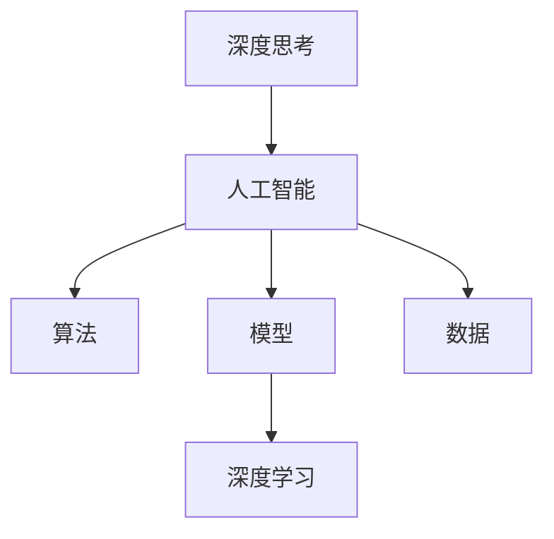
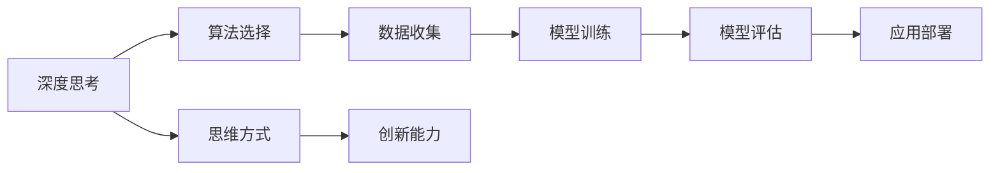

                 

# 深度思考:拉开人生差距的秘诀

## 1. 背景介绍

### 1.1 问题由来

在这个快速变化的时代，人工智能技术正在以不可阻挡的势头改变我们的生活方式。从日常生活的智能助手，到医疗行业的精准诊断，再到制造业的智能工厂，人工智能的影响无处不在。然而，尽管技术发展迅猛，能够真正掌握并运用这些技术的人却只是少数。如何培养深度的思考能力，抓住技术的本质，从而在人工智能的浪潮中脱颖而出，成为一个关键问题。

### 1.2 问题核心关键点

人工智能技术的核心在于深度思考，即通过理解和运用技术的本质，解决实际问题。但深度思考不仅仅是技术能力的体现，更是思维方式和综合素质的体现。本文将从以下几个方面探讨深度思考的本质、方法和应用，帮助读者把握人工智能技术的核心，提升自身能力，拉开人生差距。

## 2. 核心概念与联系

### 2.1 核心概念概述

为了更好地理解深度思考与人工智能的关系，我们先介绍几个核心概念：

- **深度思考(Deep Thinking)**：指通过深入理解技术原理和应用场景，提出创造性解决方案的思维方式。
- **人工智能(AI)**：利用计算机模拟人类的智能行为，包括学习、推理、感知等能力。
- **算法(Algorithm)**：指导计算机执行特定任务的一系列步骤，是实现AI的关键工具。
- **模型(Model)**：基于数据和算法构建的抽象表示，用于模拟和预测真实世界的现象。
- **数据(Data)**：输入到模型中的信息，是模型训练和推理的基础。
- **深度学习(Deep Learning)**：一种通过多层神经网络学习数据特征的AI技术，具有较强的自适应能力。

这些概念之间的逻辑关系可以通过以下Mermaid流程图来展示：



这个流程图展示了深度思考、人工智能、算法、模型和数据之间的内在联系：

1. 深度思考是理解和应用人工智能的核心能力。
2. 人工智能通过算法和模型来实现。
3. 数据是算法和模型训练的基础。
4. 深度学习是当前实现人工智能的核心技术。

### 2.2 核心概念原理和架构的 Mermaid 流程图



## 3. 核心算法原理 & 具体操作步骤

### 3.1 算法原理概述

人工智能技术的核心在于算法，而深度学习算法则是其核心之一。深度学习算法通过多层神经网络对数据进行特征提取和模式识别，具有较强的自适应能力。然而，算法的选择和应用需要深度思考的指导，才能真正实现人工智能技术的价值。

### 3.2 算法步骤详解

深度思考与人工智能技术的结合可以分为以下几个步骤：

1. **问题识别**：明确问题的本质和目标，找出需要解决的核心问题。
2. **算法选择**：根据问题的特点和数据的性质，选择合适的算法模型。
3. **数据收集与预处理**：收集和处理数据，确保其符合算法模型的要求。
4. **模型训练与调优**：使用数据训练模型，并根据模型表现进行调优。
5. **结果评估与反馈**：评估模型性能，根据结果反馈调整算法和模型。
6. **应用部署与优化**：将模型应用到实际问题中，持续优化模型和算法。

### 3.3 算法优缺点

深度思考在应用人工智能技术时，有以下几个优点：

- **全局视角**：能够从更高层次理解问题的本质，避免陷入局部最优。
- **创新能力**：能够提出创新的算法和模型，解决传统方法难以解决的问题。
- **持续改进**：能够根据反馈不断调整和优化算法和模型，提升其性能。

同时，深度思考也存在一些缺点：

- **时间成本高**：深度思考需要大量的时间和精力，尤其是在问题复杂度较高时。
- **知识门槛高**：需要掌握多种算法和模型的知识，才能有效应用。
- **数据依赖强**：需要高质量的数据作为支撑，否则算法和模型的效果可能不佳。

### 3.4 算法应用领域

深度思考在多个领域都有广泛应用，例如：

- **医疗领域**：通过深度学习算法分析医疗数据，提升诊断和治疗的精准度。
- **金融领域**：利用深度学习算法预测股票价格、风险评估等，辅助投资决策。
- **制造业**：通过深度学习算法优化生产流程，提升产品质量和生产效率。
- **自然语言处理(NLP)**：利用深度学习算法处理和理解自然语言，实现智能问答、翻译、摘要等功能。

## 4. 数学模型和公式 & 详细讲解 & 举例说明

### 4.1 数学模型构建

在深度学习中，常见的数学模型包括神经网络、卷积神经网络(CNN)、循环神经网络(RNN)、变压器(Transformer)等。这里以神经网络为例，构建一个简单的分类模型。

### 4.2 公式推导过程

神经网络的基本结构可以表示为：

$$
f(x;w) = \sigma(Wx + b)
$$

其中，$x$ 为输入向量，$w$ 为权重矩阵，$b$ 为偏置向量，$\sigma$ 为激活函数。对于一个二分类任务，可以使用sigmoid函数作为激活函数：

$$
\sigma(z) = \frac{1}{1 + e^{-z}}
$$

### 4.3 案例分析与讲解

以手写数字识别为例，可以使用MNIST数据集进行训练。数据集包含60,000个训练样本和10,000个测试样本，每个样本为一个28x28像素的灰度图像。

首先，将图像转换为向量形式，作为模型的输入。然后，使用神经网络进行特征提取和分类。训练过程中，使用交叉熵损失函数：

$$
\mathcal{L} = -\frac{1}{N} \sum_{i=1}^N \sum_{j=1}^{C} y_{ij} \log \hat{y}_{ij}
$$

其中，$N$ 为样本数量，$C$ 为类别数量，$y_{ij}$ 为真实标签，$\hat{y}_{ij}$ 为模型预测概率。

通过反向传播算法更新权重和偏置，最小化损失函数，最终得到训练好的模型。

## 5. 项目实践：代码实例和详细解释说明

### 5.1 开发环境搭建

要进行深度学习项目实践，首先需要搭建开发环境。这里以PyTorch为例，介绍环境搭建流程。

1. 安装Anaconda：从官网下载并安装Anaconda，用于创建独立的Python环境。
2. 创建并激活虚拟环境：
```bash
conda create -n pytorch-env python=3.8 
conda activate pytorch-env
```

3. 安装PyTorch：根据CUDA版本，从官网获取对应的安装命令。例如：
```bash
conda install pytorch torchvision torchaudio cudatoolkit=11.1 -c pytorch -c conda-forge
```

4. 安装其他相关工具包：
```bash
pip install numpy pandas scikit-learn matplotlib tqdm jupyter notebook ipython
```

完成上述步骤后，即可在`pytorch-env`环境中进行深度学习项目开发。

### 5.2 源代码详细实现

以下是使用PyTorch实现手写数字识别的代码：

```python
import torch
import torch.nn as nn
import torch.optim as optim
from torchvision import datasets, transforms

# 定义神经网络模型
class Net(nn.Module):
    def __init__(self):
        super(Net, self).__init__()
        self.conv1 = nn.Conv2d(1, 10, kernel_size=5)
        self.conv2 = nn.Conv2d(10, 20, kernel_size=5)
        self.fc1 = nn.Linear(320, 50)
        self.fc2 = nn.Linear(50, 10)

    def forward(self, x):
        x = nn.functional.relu(nn.functional.max_pool2d(nn.functional.relu(self.conv1(x)), (2, 2)))
        x = nn.functional.relu(nn.functional.max_pool2d(nn.functional.relu(self.conv2(x)), 2))
        x = x.view(-1, 320)
        x = nn.functional.relu(self.fc1(x))
        x = self.fc2(x)
        return nn.functional.log_softmax(x, dim=1)

# 加载数据集
transform = transforms.Compose([transforms.ToTensor(), transforms.Normalize((0.5,), (0.5,))])
trainset = datasets.MNIST(root='data', train=True, download=True, transform=transform)
trainloader = torch.utils.data.DataLoader(trainset, batch_size=64, shuffle=True)
testset = datasets.MNIST(root='data', train=False, download=True, transform=transform)
testloader = torch.utils.data.DataLoader(testset, batch_size=64, shuffle=False)

# 定义模型和优化器
net = Net()
criterion = nn.NLLLoss()
optimizer = optim.SGD(net.parameters(), lr=0.001, momentum=0.9)

# 训练模型
for epoch in range(5):
    running_loss = 0.0
    for i, data in enumerate(trainloader, 0):
        inputs, labels = data
        optimizer.zero_grad()
        outputs = net(inputs)
        loss = criterion(outputs, labels)
        loss.backward()
        optimizer.step()
        running_loss += loss.item()
        if i % 100 == 99:
            print('[%d, %5d] loss: %.3f' %
                  (epoch + 1, i + 1, running_loss / 100))
            running_loss = 0.0

print('Finished Training')

# 测试模型
correct = 0
total = 0
with torch.no_grad():
    for data in testloader:
        images, labels = data
        outputs = net(images)
        _, predicted = torch.max(outputs.data, 1)
        total += labels.size(0)
        correct += (predicted == labels).sum().item()

print('Accuracy of the network on the 10000 test images: %d %%' % (
    100 * correct / total))
```

### 5.3 代码解读与分析

在上述代码中，我们首先定义了一个简单的神经网络模型，包括两个卷积层和两个全连接层。然后，加载了MNIST数据集，并使用PyTorch的DataLoader进行数据批处理。接着，定义了模型、损失函数和优化器，最后进行模型训练和测试。

在训练过程中，我们使用交叉熵损失函数和随机梯度下降优化器，通过反向传播算法更新模型参数。在测试过程中，我们评估模型在测试集上的准确率，并输出结果。

## 6. 实际应用场景

### 6.1 医疗领域

在医疗领域，深度学习技术可以用于疾病诊断、基因分析、药物发现等任务。例如，可以使用深度学习算法分析医学影像，辅助医生进行疾病诊断和手术规划。通过深度学习模型，可以从大量医学数据中提取关键特征，提高诊断的准确性和效率。

### 6.2 金融领域

在金融领域，深度学习技术可以用于股票预测、风险评估、欺诈检测等任务。例如，可以使用深度学习算法分析历史交易数据，预测股票价格和市场趋势。通过深度学习模型，可以从多维数据中挖掘隐含的规律，提供更准确的投资建议和风险预警。

### 6.3 自然语言处理(NLP)

在自然语言处理领域，深度学习技术可以用于机器翻译、文本生成、情感分析等任务。例如，可以使用深度学习算法处理大规模自然语言数据，实现机器翻译和自动摘要。通过深度学习模型，可以从语言数据中学习复杂的语义和语法规则，提供自然流畅的语言输出。

## 7. 工具和资源推荐

### 7.1 学习资源推荐

要掌握深度学习技术，需要系统学习相关的数学和算法知识。以下是一些推荐的资源：

1. 《深度学习》(Deep Learning)书籍：由Ian Goodfellow等人合著，是深度学习领域的经典教材。
2. 《神经网络与深度学习》(Neural Networks and Deep Learning)书籍：由Michael Nielsen撰写，介绍了深度学习的原理和应用。
3. 深度学习课程：包括Coursera、Udacity等在线平台提供的深度学习课程，涵盖了从基础到高级的内容。
4. Kaggle竞赛：Kaggle平台提供了大量的深度学习竞赛，通过实践可以更快掌握技术。
5. GitHub代码库：在GitHub上可以查阅和学习开源深度学习项目，了解最新进展和应用案例。

### 7.2 开发工具推荐

深度学习项目开发需要选择合适的工具和框架。以下是一些推荐的开发工具：

1. PyTorch：由Facebook开发的深度学习框架，具有动态计算图和灵活的API设计。
2. TensorFlow：由Google开发的深度学习框架，支持分布式计算和优化器加速。
3. Keras：一个高级的深度学习框架，易于使用，适合初学者和快速原型开发。
4. Jupyter Notebook：一个交互式的开发环境，支持Python、R等语言的代码执行。
5. TensorBoard：TensorFlow的可视化工具，可以实时监测模型训练过程和结果。

### 7.3 相关论文推荐

深度学习技术的发展离不开学界的不断研究。以下是一些奠基性的相关论文，推荐阅读：

1. AlexNet：2012年ImageNet图像分类竞赛的获胜者，标志着深度学习在计算机视觉领域的突破。
2. ResNet：2015年ImageNet图像分类竞赛的获胜者，通过残差网络结构解决了深度网络训练的梯度消失问题。
3. Transformer：2017年提出的自注意力机制，改变了传统的卷积神经网络结构，在自然语言处理任务中取得了优异表现。
4. GANs：2014年提出的生成对抗网络，能够生成高质量的假样本，在图像生成和图像修复等任务中表现出色。
5. Attention Is All You Need：2017年提出的Transformer模型，改进了传统的循环神经网络，提升了自然语言处理任务的性能。

## 8. 总结：未来发展趋势与挑战

### 8.1 研究成果总结

本文从深度思考与人工智能的关系出发，介绍了深度学习算法的基本原理和操作步骤。通过具体项目实践，展示了深度学习在医疗、金融、自然语言处理等领域的应用。同时，通过学习资源和工具推荐，帮助读者更好地掌握深度学习技术。

### 8.2 未来发展趋势

未来，深度学习技术将在更多领域得到应用，推动人工智能技术的发展。以下是一些可能的发展趋势：

1. 深度学习将更加注重模型解释性，帮助用户理解模型的决策过程。
2. 深度学习将与其他技术结合，如强化学习、知识图谱等，提升技术的综合能力。
3. 深度学习将更加注重多模态数据融合，提升对复杂问题的处理能力。
4. 深度学习将更加注重数据隐私和安全，保护用户数据不被滥用。
5. 深度学习将更加注重通用人工智能的实现，提升技术的普适性和可扩展性。

### 8.3 面临的挑战

尽管深度学习技术发展迅速，但仍然面临一些挑战：

1. 数据隐私和安全问题：深度学习模型需要大量数据进行训练，如何保护用户隐私和数据安全是一个重要问题。
2. 模型的可解释性：深度学习模型通常被认为是“黑盒”，如何提高模型的可解释性和透明度，是一个重要研究方向。
3. 算力的需求：深度学习模型需要大量的计算资源进行训练和推理，如何降低算力需求，提高计算效率，是一个重要研究方向。
4. 模型的泛化能力：深度学习模型容易过拟合，如何提高模型的泛化能力，是一个重要研究方向。
5. 模型的鲁棒性：深度学习模型对输入数据的微小变化敏感，如何提高模型的鲁棒性，是一个重要研究方向。

### 8.4 研究展望

未来，深度学习技术将不断发展，推动人工智能技术在各个领域的广泛应用。以下是一些研究方向：

1. 数据隐私保护：如何保护用户数据隐私，防止数据泄露和滥用，是一个重要研究方向。
2. 模型的可解释性：如何提高模型的可解释性和透明度，帮助用户理解模型的决策过程，是一个重要研究方向。
3. 算力优化：如何降低算力需求，提高计算效率，是一个重要研究方向。
4. 泛化能力提升：如何提高模型的泛化能力，避免过拟合，是一个重要研究方向。
5. 模型鲁棒性：如何提高模型的鲁棒性，提高模型的抗干扰能力，是一个重要研究方向。

## 9. 附录：常见问题与解答

**Q1: 深度学习算法有哪些优缺点？**

A: 深度学习算法有以下优点：
1. 能够处理大规模数据，学习复杂的模式和规律。
2. 具有较强的泛化能力，能够在未见过的数据上进行预测。
3. 可以通过自动编码、生成对抗网络等方法，实现数据增强和噪声鲁棒性。

但深度学习算法也存在以下缺点：
1. 需要大量的标注数据进行训练，数据收集成本较高。
2. 模型结构复杂，训练和推理时间较长。
3. 需要较高的计算资源，硬件成本较高。

**Q2: 深度学习在实际应用中需要考虑哪些因素？**

A: 在实际应用中，深度学习需要考虑以下因素：
1. 数据的质量和规模，需要高质量、大规模的数据进行训练。
2. 算力资源，需要足够的计算资源进行模型训练和推理。
3. 模型的可解释性，需要解释模型决策过程，帮助用户理解。
4. 模型的泛化能力，需要评估模型在未见过的数据上的表现。
5. 数据隐私和安全，需要保护用户数据隐私，防止数据泄露和滥用。

**Q3: 如何提高深度学习模型的泛化能力？**

A: 提高深度学习模型的泛化能力，可以通过以下方法：
1. 增加数据多样性，收集更多的数据进行训练。
2. 使用数据增强技术，增加数据噪声，提高模型的鲁棒性。
3. 使用正则化技术，防止模型过拟合。
4. 使用迁移学习，将预训练模型应用于新任务。
5. 使用集成学习，组合多个模型，提高模型的泛化能力。

**Q4: 如何提高深度学习模型的鲁棒性？**

A: 提高深度学习模型的鲁棒性，可以通过以下方法：
1. 使用对抗样本训练，增加模型的鲁棒性。
2. 使用数据增强技术，增加数据多样性。
3. 使用正则化技术，防止模型过拟合。
4. 使用集成学习，组合多个模型，提高模型的鲁棒性。
5. 使用知识图谱，提高模型的语义理解能力。

**Q5: 如何降低深度学习算法的计算成本？**

A: 降低深度学习算法的计算成本，可以通过以下方法：
1. 使用GPU和TPU等高性能计算设备，加速模型训练和推理。
2. 使用模型压缩技术，减小模型规模，降低计算需求。
3. 使用量化技术，将浮点模型转为定点模型，降低计算成本。
4. 使用模型并行技术，并行计算，提高计算效率。
5. 使用数据预处理技术，减少计算量。

**Q6: 深度学习在实际应用中需要注意哪些问题？**

A: 深度学习在实际应用中需要注意以下问题：
1. 数据隐私和安全问题，保护用户数据隐私，防止数据泄露和滥用。
2. 模型的可解释性，提高模型的可解释性和透明度，帮助用户理解。
3. 算力需求，降低算力需求，提高计算效率。
4. 模型的泛化能力，提高模型的泛化能力，避免过拟合。
5. 模型鲁棒性，提高模型的鲁棒性，提高模型的抗干扰能力。

作者：禅与计算机程序设计艺术 / Zen and the Art of Computer Programming

