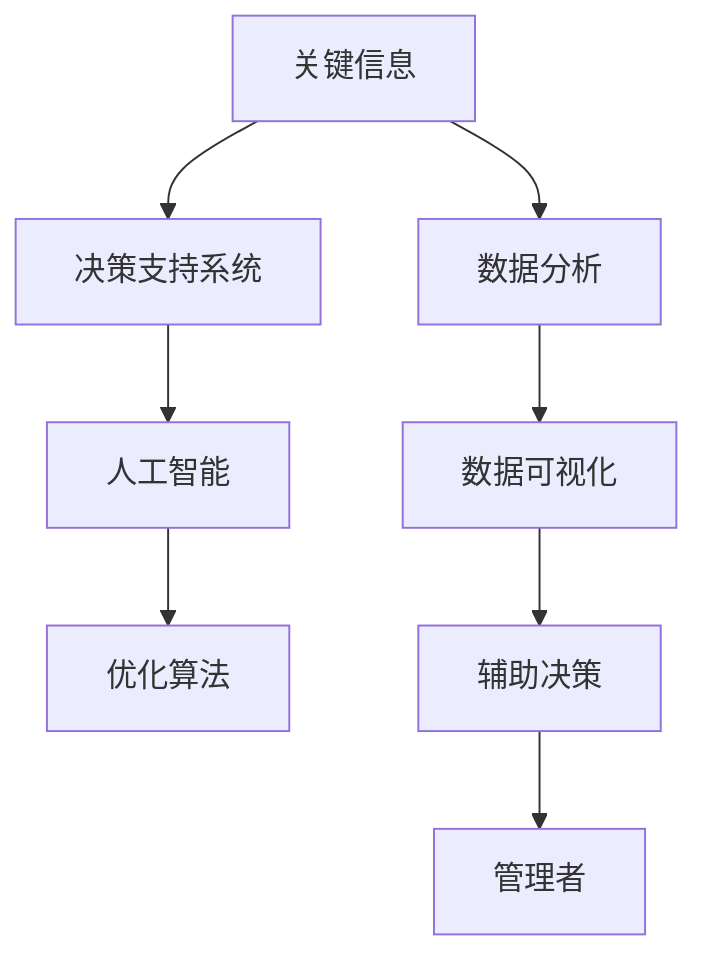

                 

# 深度思考:管理者洞悉关键信息的关键

> 关键词：管理者,关键信息,决策支持,数据分析,人工智能

## 1. 背景介绍

### 1.1 问题由来
在当今信息爆炸的时代，管理者面临的海量数据和复杂决策环境要求他们不仅要具备高度的专业知识，更要具备高效的信息处理和决策能力。传统的数据驱动决策方式已经无法满足管理者对实时性、精准性和智能性的需求。

随着大数据、人工智能技术的不断进步，数据科学和机器学习在商业决策中的应用日益广泛。管理者借助数据分析和机器学习技术，可以从海量数据中提取关键信息，洞察趋势，辅助决策，提高决策效率和准确性。

### 1.2 问题核心关键点
数据驱动决策的核心在于洞察关键信息。管理者需要：
- 准确理解并评估关键信息的重要性。
- 从纷繁复杂的数据中高效筛选出关键信息。
- 结合业务经验，合理运用关键信息辅助决策。
- 持续监控决策效果，及时调整优化决策策略。

## 2. 核心概念与联系

### 2.1 核心概念概述

为更好地理解管理者如何利用关键信息进行深度思考和决策，本节将介绍几个关键概念：

- 关键信息(Key Information)：在特定决策场景下，对决策结果具有显著影响且易于获取的定量或定性数据。
- 数据分析(Analytical Data Processing)：通过数据挖掘、统计分析、机器学习等技术手段，从原始数据中提取有价值的信息。
- 数据可视化(Data Visualization)：将数据分析结果以图形、图表等形式展现出来，帮助管理者直观理解数据内涵。
- 决策支持系统(Decision Support Systems, DSS)：集成数据分析、数据可视化和优化算法，辅助管理者进行科学决策的技术系统。
- 人工智能(Artificial Intelligence, AI)：基于深度学习、强化学习等智能技术，自动从数据中提取和应用关键信息，为决策提供深度洞察。

这些概念之间的逻辑关系可以通过以下Mermaid流程图来展示：



这个流程图展示了关键信息在决策过程中的作用链条：

1. 从原始数据中提取关键信息。
2. 对关键信息进行分析处理，转化为易于理解的数据结果。
3. 将分析结果通过可视化展现，提升理解效率。
4. 基于分析结果构建决策支持系统，辅助管理者进行决策。
5. 应用人工智能技术，进一步优化决策支持系统，实现自动化、智能化的决策过程。

## 3. 核心算法原理 & 具体操作步骤
### 3.1 算法原理概述

管理者通过数据分析和机器学习技术，从海量数据中提取关键信息，并将其应用于决策支持系统。其核心思想是：利用数据挖掘、统计分析和机器学习技术，识别出对决策结果有重要影响的定量或定性数据，再将其转化为易于理解的形式，辅助管理者进行深度思考和科学决策。

### 3.2 算法步骤详解

管理者利用关键信息进行决策的过程主要包括以下几个步骤：

**Step 1: 数据收集与预处理**
- 从不同的数据源（如销售记录、客户反馈、市场报告等）收集相关的原始数据。
- 对数据进行清洗、去重、归一化等预处理操作，去除噪音和冗余，确保数据质量。

**Step 2: 特征工程**
- 根据决策目标，从原始数据中提取有意义的特征。例如，销售数据中的销售额、销售趋势、客户流失率等。
- 应用特征选择和特征提取技术，筛选出最具代表性的特征，去除无关或弱相关特征。

**Step 3: 数据分析与建模**
- 应用统计分析、数据挖掘和机器学习算法对特征进行建模。例如，使用回归分析、分类算法、聚类算法等。
- 通过交叉验证、网格搜索等技术，选择最优的模型和参数组合，进行模型训练和评估。

**Step 4: 数据可视化与解读**
- 将模型输出转化为直观易懂的图表，如散点图、柱状图、热力图等。
- 结合业务知识和领域经验，对可视化结果进行解读和分析，提取关键信息。

**Step 5: 辅助决策与优化**
- 将关键信息整合到决策支持系统中，结合决策树、规则引擎等优化算法，辅助管理者进行决策。
- 不断监控决策效果，根据反馈信息调整模型参数，优化决策策略。

### 3.3 算法优缺点

利用关键信息进行数据驱动决策的方法具有以下优点：
1. 提升决策效率。通过自动化分析，管理者可以快速获取关键信息，减少人为分析的时间和精力。
2. 增强决策准确性。基于数据驱动的决策方式，可以减少主观偏见，提高决策的客观性和科学性。
3. 支持持续优化。通过持续监控和反馈机制，管理者可以及时调整决策策略，适应市场变化。

然而，该方法也存在一些局限性：
1. 依赖数据质量。如果数据存在错误、缺失或偏差，将直接影响决策结果。
2. 模型复杂度高。复杂的决策支持系统可能需要较高计算资源和专业知识。
3. 缺乏灵活性。固定模型可能无法适应快速变化的市场环境。
4. 黑盒问题。部分算法（如深度学习）的决策过程难以解释，影响管理者的信任和接受度。

尽管存在这些局限性，但就目前而言，利用关键信息进行数据驱动决策仍是企业管理决策的重要手段。未来相关研究的重点在于如何进一步降低数据处理成本，提高模型的可解释性，以及构建更加灵活、智能的决策支持系统。

### 3.4 算法应用领域

利用关键信息进行数据驱动决策的方法在企业管理中已经得到了广泛应用，具体包括：

- 销售预测与库存管理：通过分析历史销售数据和市场趋势，预测未来需求，优化库存管理。
- 客户关系管理：分析客户行为数据，识别高价值客户，设计个性化营销策略。
- 财务分析与风险管理：分析财务报表和市场数据，评估企业财务状况和经营风险。
- 供应链优化：分析供应链数据，优化物流和库存，降低运营成本。
- 市场调研与品牌管理：分析市场数据和消费者反馈，洞察市场趋势，优化品牌战略。

除了上述这些经典应用外，关键信息驱动的数据分析方法还在人力资源管理、项目管理、创新管理等多个领域中得到了广泛应用，成为现代企业决策管理的核心工具。

## 4. 数学模型和公式 & 详细讲解  
### 4.1 数学模型构建

管理者在数据驱动决策中，常需构建数学模型来辅助关键信息的提取和分析。以下以回归分析为例，展示模型的构建过程。

假设管理者希望通过历史销售数据预测未来销售额，记历史数据为 $(x_i, y_i)$，其中 $x_i$ 为自变量（如季节、促销活动、价格等），$y_i$ 为目标变量（如销售额）。构建线性回归模型如下：

$$
y_i = \beta_0 + \sum_{j=1}^{p} \beta_j x_{ij} + \epsilon_i
$$

其中，$\beta_0, \beta_j$ 为模型参数，$\epsilon_i$ 为误差项。

### 4.2 公式推导过程

最小二乘法的目标是最小化残差平方和 $\sum_{i=1}^{n}(y_i - \hat{y}_i)^2$，其中 $\hat{y}_i$ 为模型预测值。

求解目标函数的最小值，得到模型参数的估计值：

$$
\hat{\beta}_0 = \frac{\sum_{i=1}^{n}(y_i - \bar{y})}{\sum_{i=1}^{n} x_{ij}^2 - \sum_{i=1}^{n} (\bar{x})^2} = \frac{SSY}{SSX}
$$

$$
\hat{\beta}_j = \frac{\sum_{i=1}^{n} (x_{ij} - \bar{x}) (y_i - \bar{y})}{\sum_{i=1}^{n} (x_{ij} - \bar{x})^2} = \frac{SSX_{ij}}{SSX}
$$

其中，$\bar{x}$ 和 $\bar{y}$ 分别为自变量和因变量的均值，$SSY$ 和 $SSX$ 分别为残差平方和和自变量平方和。

将参数估计值代入模型，得到预测方程：

$$
\hat{y}_i = \hat{\beta}_0 + \sum_{j=1}^{p} \hat{\beta}_j x_{ij}
$$

将预测方程与真实值进行比较，可以计算模型的预测精度和拟合优度。

### 4.3 案例分析与讲解

以某电商平台的销售数据为例，管理者希望通过预测模型优化库存管理。假设收集了过去一年的月度销售数据，包括月份、销售额、促销活动等因素。首先对数据进行清洗和归一化，然后应用线性回归模型进行建模。

- 数据清洗：去除异常值、处理缺失值、去除重复记录。
- 特征选择：选择销售额、促销活动、季节性因素作为自变量，去除无关因素。
- 模型训练：通过最小二乘法求解模型参数，得到预测模型。
- 模型评估：使用均方误差（MSE）、平均绝对误差（MAE）等指标评估模型预测效果。

模型构建完成后，管理者可以实时获取未来一个月的销售预测值，结合库存和需求情况，进行库存调整和促销活动规划。

## 5. 项目实践：代码实例和详细解释说明
### 5.1 开发环境搭建

在进行数据驱动决策实践前，我们需要准备好开发环境。以下是使用Python进行Scikit-learn开发的环境配置流程：

1. 安装Anaconda：从官网下载并安装Anaconda，用于创建独立的Python环境。

2. 创建并激活虚拟环境：
```bash
conda create -n python-env python=3.8 
conda activate python-env
```

3. 安装Scikit-learn：
```bash
pip install scikit-learn
```

4. 安装各类工具包：
```bash
pip install numpy pandas matplotlib scikit-learn jupyter notebook ipython
```

完成上述步骤后，即可在`python-env`环境中开始数据驱动决策的实践。

### 5.2 源代码详细实现

下面我们以销售预测任务为例，给出使用Scikit-learn进行回归分析的Python代码实现。

首先，定义销售预测的数据处理函数：

```python
from sklearn.preprocessing import StandardScaler
from sklearn.model_selection import train_test_split
from sklearn.linear_model import LinearRegression
from sklearn.metrics import mean_squared_error, mean_absolute_error

def preprocess_data(data, target):
    # 特征工程
    X = data.drop(target, axis=1)
    y = data[target]
    
    # 数据标准化
    scaler = StandardScaler()
    X = scaler.fit_transform(X)
    
    # 划分训练集和测试集
    X_train, X_test, y_train, y_test = train_test_split(X, y, test_size=0.2, random_state=42)
    
    return X_train, X_test, y_train, y_test

def train_model(X_train, y_train):
    # 模型训练
    model = LinearRegression()
    model.fit(X_train, y_train)
    return model

def evaluate_model(model, X_test, y_test):
    # 模型评估
    y_pred = model.predict(X_test)
    mse = mean_squared_error(y_test, y_pred)
    mae = mean_absolute_error(y_test, y_pred)
    
    return mse, mae

def visualize_results(y_test, y_pred):
    # 可视化
    import matplotlib.pyplot as plt
    plt.plot(y_test, label='Actual Sales')
    plt.plot(y_pred, label='Predicted Sales')
    plt.legend()
    plt.show()
```

然后，使用示例数据进行回归分析：

```python
# 示例销售数据
data = {'Month': ['Jan', 'Feb', 'Mar', 'Apr', 'May', 'Jun', 'Jul', 'Aug', 'Sep', 'Oct', 'Nov', 'Dec'],
        'Sales': [100, 150, 200, 250, 300, 350, 400, 450, 500, 550, 600, 650],
        'Promotion': [0, 1, 0, 0, 1, 0, 1, 0, 0, 1, 0, 1],
        'Season': ['Winter', 'Spring', 'Summer', 'Autumn', 'Winter', 'Spring', 'Summer', 'Autumn', 'Winter', 'Spring', 'Summer', 'Autumn']}
    
# 数据预处理
X_train, X_test, y_train, y_test = preprocess_data(data, 'Sales')

# 模型训练
model = train_model(X_train, y_train)

# 模型评估
mse, mae = evaluate_model(model, X_test, y_test)
print(f'Mean Squared Error: {mse:.2f}')
print(f'Mean Absolute Error: {mae:.2f}')

# 可视化结果
visualize_results(y_test, model.predict(X_test))
```

以上就是使用Scikit-learn对销售数据进行回归分析的完整代码实现。可以看到，借助Scikit-learn，管理者可以快速构建线性回归模型，评估预测精度，并通过可视化直观理解预测结果。

### 5.3 代码解读与分析

让我们再详细解读一下关键代码的实现细节：

**preprocess_data函数**：
- `drop`方法去除目标变量，返回特征数据。
- `StandardScaler`标准化特征数据，避免不同特征尺度影响模型训练。
- `train_test_split`方法划分训练集和测试集。

**train_model函数**：
- `LinearRegression`创建线性回归模型，`fit`方法训练模型。

**evaluate_model函数**：
- `mean_squared_error`和`mean_absolute_error`计算模型评估指标，`model.predict`方法获取预测结果。

**visualize_results函数**：
- `matplotlib`库绘制实际销售与预测销售的对比图。

**示例销售数据**：
- 包含了月份、销售额、促销活动和季节性因素，可用于训练预测模型。

在代码实现中，数据预处理、模型训练和评估、结果可视化是关键步骤。通过简单的几行代码，管理者就能够从原始数据中提取关键信息，辅助决策。

当然，实际的决策支持系统可能更加复杂，涉及更多数据源、特征和算法。但核心的数据驱动决策流程是类似的。

## 6. 实际应用场景
### 6.1 智能客服系统

利用数据驱动决策的原理，智能客服系统可以通过分析历史客服数据，提取关键信息，优化客服流程和策略。例如：

- 分析常见问题及其解决方式，构建知识库，提高客服响应速度。
- 通过客户情绪分析，识别高风险客户，提供个性化服务。
- 分析客户转接数据，优化路由策略，减少客户等待时间。

智能客服系统通过实时数据分析和决策支持，能够大幅提升客服效率和客户满意度。

### 6.2 金融风险管理

金融风险管理是数据驱动决策的典型应用场景。通过分析历史交易数据，提取关键信息，金融机构可以评估和预测风险，制定风险控制策略。例如：

- 分析交易历史和市场数据，预测违约概率，优化信贷审批流程。
- 通过市场波动分析，预测股票市场变化，调整投资组合。
- 分析客户交易行为，识别异常交易，防范金融欺诈。

利用关键信息进行金融风险管理，能够帮助金融机构更加准确地评估风险，制定有效的风险控制措施，保障金融安全和稳定。

### 6.3 营销策略优化

企业在市场营销中面临海量数据，如何从中提取关键信息，优化营销策略，是管理者关注的重点。通过数据驱动决策，企业可以：

- 分析客户行为数据，识别高价值客户，设计个性化营销活动。
- 通过市场细分分析，优化广告投放策略，提高营销效果。
- 通过销售数据分析，预测市场趋势，调整营销预算。

数据驱动决策帮助企业更加精准地制定营销策略，提升营销效果和客户满意度。

### 6.4 未来应用展望

随着数据分析技术的不断进步，基于关键信息的数据驱动决策将在更多领域得到应用，带来深远影响：

1. 智能制造：通过分析生产数据，提取关键信息，优化生产流程和设备维护。
2. 智慧医疗：分析患者数据，提取健康趋势和疾病模式，辅助医疗决策。
3. 教育管理：通过分析学生成绩和行为数据，优化教学策略和课程设计。
4. 城市治理：分析交通数据，优化交通流量和基础设施建设，提升城市管理效率。

未来，基于关键信息的数据驱动决策将成为各行各业的重要工具，推动数据科学和人工智能技术的普及和应用。

## 7. 工具和资源推荐
### 7.1 学习资源推荐

为了帮助管理者系统掌握数据驱动决策的理论基础和实践技巧，这里推荐一些优质的学习资源：

1. 《Python数据科学手册》：全面介绍Python在数据分析和机器学习中的应用，适合初学者入门。
2. 《数据科学与机器学习》课程：斯坦福大学开设的在线课程，涵盖数据科学和机器学习的核心概念和实践。
3. 《数据科学实战》书籍：结合实际案例，介绍数据科学在各行业的应用，适合进阶学习。
4. Kaggle平台：大数据分析竞赛平台，提供大量公开数据集和算法竞赛，帮助管理者实践数据驱动决策。
5. Weights & Biases：模型训练的实验跟踪工具，记录和可视化模型训练过程中的各项指标，方便对比和调优。

通过这些资源的学习实践，管理者可以系统掌握数据驱动决策的方法和技能，提升决策效率和效果。

### 7.2 开发工具推荐

高效的数据驱动决策开发离不开优秀的工具支持。以下是几款用于数据分析和决策支持开发的常用工具：

1. Python：基于Python的开源编程语言，拥有丰富的数据分析和机器学习库。
2. Scikit-learn：基于Python的机器学习库，提供多种经典算法和模型。
3. R语言：基于R的开源编程语言，适用于统计分析和数据可视化。
4. Tableau：商业智能工具，支持大规模数据可视化，帮助管理者直观理解数据内涵。
5. Jupyter Notebook：交互式编程环境，支持Python和R等语言，方便数据分析和模型调试。

合理利用这些工具，可以显著提升数据驱动决策的开发效率，加速创新迭代。

### 7.3 相关论文推荐

数据驱动决策的发展源于学界的持续研究。以下是几篇奠基性的相关论文，推荐阅读：

1. "A Survey of Decision Support Systems"：回顾决策支持系统的研究现状和应用，了解各类决策模型和工具。
2. "Advances in Financial Machine Learning"：通过机器学习技术在金融领域的实际应用案例，展示数据驱动决策的潜力。
3. "Data Mining and Statistical Learning"：介绍数据挖掘和统计学习的核心概念和算法，帮助管理者理解数据驱动决策的技术基础。
4. "Machine Learning Yearning"：机器学习实战指南，提供大量实际应用场景和工程实践建议。
5. "Predictive Analytics"：介绍预测分析在企业中的应用，涵盖数据收集、处理和分析的完整流程。

这些论文代表了大数据和机器学习在决策支持领域的研究进展，通过学习这些前沿成果，管理者可以更好地应用数据驱动决策，提升决策质量。

## 8. 总结：未来发展趋势与挑战
### 8.1 研究成果总结

本文对数据驱动决策的核心概念和实践流程进行了系统介绍。主要涵盖以下几个方面：

- 关键信息的概念及其在决策中的作用。
- 数据分析和机器学习技术在提取关键信息中的应用。
- 决策支持系统（DSS）和人工智能（AI）技术在辅助决策中的应用。
- 数据驱动决策在企业管理中的应用案例。

通过本文的梳理，管理者可以更好地理解数据驱动决策的理论基础和实践方法，提升决策效率和效果。

### 8.2 未来发展趋势

展望未来，数据驱动决策将呈现以下几个发展趋势：

1. 大数据和人工智能技术的融合。结合大数据分析和人工智能技术，提取更全面、深入的关键信息，辅助决策。
2. 实时化、自动化决策。利用实时数据流和自动化算法，实现决策过程的快速响应和自动化执行。
3. 多模态数据的整合。结合文本、语音、图像等多种数据源，提升决策的全面性和准确性。
4. 模型解释性和可解释性。通过模型解释技术，帮助管理者理解决策过程和结果，增强决策的可信度和接受度。
5. 跨领域数据融合。结合不同行业的数据，优化跨领域的决策支持，提升决策的普适性和通用性。

这些趋势凸显了数据驱动决策技术的广阔前景，将进一步提升管理决策的科学性和智能性。

### 8.3 面临的挑战

尽管数据驱动决策技术在企业管理中已经取得了显著成效，但面临的挑战依然严峻：

1. 数据质量问题。数据源多样、数据格式不统一、数据缺失等问题，影响决策的准确性。
2. 模型复杂性。高维数据、复杂模型增加了决策支持系统的计算负担。
3. 数据隐私和安全。企业数据安全和隐私保护成为重要课题，需要制定严格的数据治理策略。
4. 决策支持系统的用户友好性。复杂模型和决策算法需要简单直观的接口和工具，便于管理者使用。
5. 决策过程的透明性和可解释性。如何保证决策过程的透明性和可解释性，增强管理者的信任和接受度，仍需持续探索。

这些挑战需要通过技术进步和系统优化，逐步克服，以实现更加高效、智能的数据驱动决策。

### 8.4 研究展望

面对数据驱动决策所面临的挑战，未来的研究需要在以下几个方面寻求新的突破：

1. 数据清洗和预处理技术。研发更高效、更智能的数据清洗和预处理技术，确保数据的完整性和一致性。
2. 模型优化和简化技术。开发更简单、更高效的决策模型，提升决策支持的实时性和可解释性。
3. 数据治理和隐私保护技术。制定完善的数据治理策略和隐私保护措施，保障企业数据安全和隐私。
4. 跨领域知识整合技术。结合不同领域的数据和知识，构建更加全面、普适的决策支持系统。
5. 决策过程的透明度和可解释性。开发模型解释和可视化工具，帮助管理者理解和解释决策过程和结果。

这些研究方向将进一步推动数据驱动决策技术的成熟和应用，为企业管理决策提供更科学、更智能的支持。

## 9. 附录：常见问题与解答

**Q1：数据驱动决策是否适用于所有管理场景？**

A: 数据驱动决策在大多数管理场景中都能取得良好的效果，特别是在数据丰富、复杂度高的领域。但对于一些高度依赖经验和判断的场景，如艺术创作、人际沟通等，数据驱动决策的效果可能有限。

**Q2：如何评估关键信息的准确性和重要性？**

A: 评估关键信息的准确性和重要性，可以通过以下方法：
1. 历史对比分析：将模型预测结果与历史实际结果进行对比，评估模型的准确性和可靠性。
2. 多模型融合：构建多个模型，综合其预测结果，提升决策的稳健性。
3. 业务验证：结合领域专家和业务经验，验证关键信息的合理性和重要性。

**Q3：如何选择最合适的决策模型？**

A: 选择最合适的决策模型需要考虑以下几个因素：
1. 数据特征：根据数据特征（如时间序列、分类、回归等）选择合适的模型。
2. 模型复杂度：考虑模型的计算复杂度和参数量，选择适合管理资源和技术条件的模型。
3. 模型解释性：选择模型解释性强的模型，便于管理者理解和接受。
4. 模型效果：通过实验验证模型效果，选择预测准确、可靠性高的模型。

**Q4：数据驱动决策如何结合业务经验？**

A: 数据驱动决策需要结合业务经验，才能充分发挥其潜力。具体方法包括：
1. 业务专家参与：邀请领域专家参与模型设计和验证，结合业务知识优化模型。
2. 案例分析：结合实际业务案例，验证和调整模型的预测结果。
3. 业务监控：实时监控决策效果，根据反馈调整模型参数和策略。

通过结合业务经验，数据驱动决策才能真正成为企业管理决策的有力工具。

**Q5：如何处理异常数据和噪音？**

A: 处理异常数据和噪音的方法包括：
1. 数据清洗：去除明显错误和异常数据，确保数据质量。
2. 数据验证：通过统计分析和可视化，识别和处理异常点和噪音数据。
3. 数据增强：采用数据增强技术，生成更多的样本和特征，提升模型的鲁棒性。

通过数据清洗和验证，可以最大限度地减少异常数据和噪音对决策的影响。

---

作者：禅与计算机程序设计艺术 / Zen and the Art of Computer Programming

