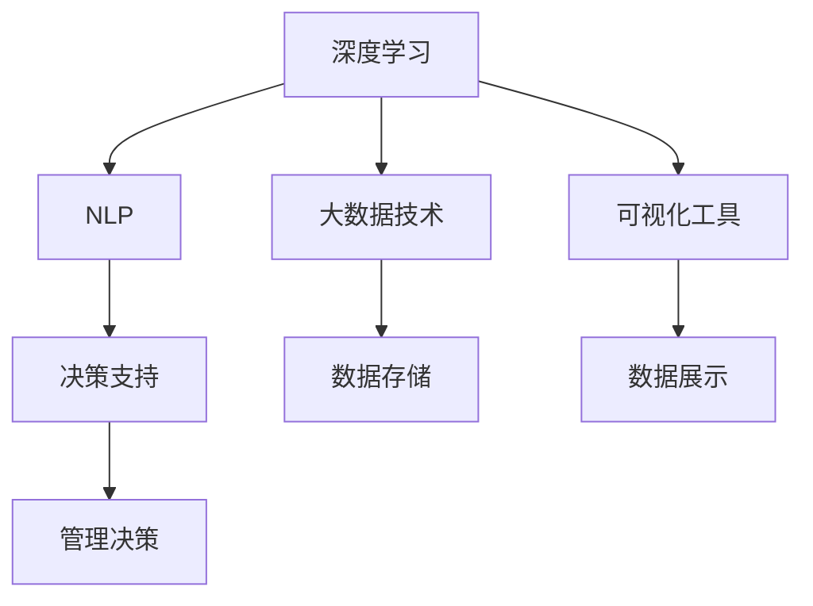

                 

## 1. 背景介绍

### 1.1 问题由来

在信息化时代，数据已经成为重要的战略资源。如何从海量数据中提取有价值的信息，并转化为业务决策的支持，成为了现代企业管理者面临的一项重要任务。传统的报表分析和手工统计方法已经难以满足现代企业决策的高效、精准需求。随着大数据和人工智能技术的发展，企业亟需引入更高级的数据分析与决策支持工具。

深度思考与管理分析能力，作为一种基于深度学习与数据分析的智能技术，能够在大规模数据基础上，进行复杂模式识别与逻辑推理，为管理者提供深入、细致、有洞察力的决策支持。本文将深入探讨深度思考与管理分析能力的核心原理、关键技术及应用实践，希望能为企业的数据分析和决策提供有力支持。

### 1.2 问题核心关键点

深度思考与管理分析能力主要通过以下技术实现：

1. **深度学习算法**：利用神经网络模型对数据进行建模，提取数据中的隐含特征，进行复杂模式识别与逻辑推理。
2. **自然语言处理(NLP)**：解析和理解文本数据，挖掘其中的知识与情感信息，辅助决策分析。
3. **大数据技术**：收集、存储、处理海量数据，为深度学习提供充足的训练数据。
4. **可视化工具**：通过图表、仪表盘等方式，将分析结果直观呈现，便于管理者理解与应用。

本文将详细介绍这些核心技术，并结合实际应用案例，展示深度思考与管理分析能力在企业决策中的应用价值。

## 2. 核心概念与联系

### 2.1 核心概念概述

深度思考与管理分析能力主要涉及以下核心概念：

- **深度学习(Deep Learning)**：利用多层神经网络模型，对大规模数据进行建模，提取数据中的高层次特征。
- **自然语言处理(NLP)**：通过算法解析和理解文本数据，挖掘其中的知识与情感信息。
- **大数据技术**：用于数据收集、存储、处理和分析的技术与工具。
- **可视化工具**：用于将复杂数据分析结果直观呈现，帮助管理者理解与应用。

这些核心概念相互联系，共同构成了深度思考与管理分析能力的完整技术体系。深度学习算法是大数据分析的基础，NLP技术用于解析和理解文本数据，可视化工具则将分析结果呈现给管理者，支持其决策。

### 2.2 核心概念原理和架构的 Mermaid 流程图



该流程图展示了深度思考与管理分析能力的核心概念及其相互联系。深度学习模型从大数据中提取特征，NLP技术解析文本数据，最终通过可视化工具将分析结果呈现给管理者，支持其决策。

## 3. 核心算法原理 & 具体操作步骤

### 3.1 算法原理概述

深度思考与管理分析能力的核心算法原理主要涉及以下两部分：

1. **深度学习算法**：通过多层神经网络模型对数据进行建模，提取数据中的隐含特征，进行复杂模式识别与逻辑推理。
2. **自然语言处理(NLP)**：利用算法解析和理解文本数据，挖掘其中的知识与情感信息。

以下详细讲解深度学习算法与NLP的核心原理。

### 3.2 算法步骤详解

#### 深度学习算法

深度学习算法的核心步骤包括数据准备、模型训练与调优、模型评估与部署等。

**数据准备**：收集并预处理数据，包括数据清洗、特征提取、数据增强等。

**模型训练与调优**：选择合适的深度学习模型，如卷积神经网络(CNN)、循环神经网络(RNN)、Transformer等，使用优化器（如Adam、SGD等）进行模型训练，并进行超参数调优。

**模型评估与部署**：在测试集上评估模型性能，选择最佳模型进行部署，应用于实际业务场景。

#### NLP技术

NLP技术主要包括文本预处理、实体识别、关系抽取、情感分析等步骤。

**文本预处理**：包括分词、去除停用词、词形还原等。

**实体识别**：识别文本中的实体，如人名、地名、组织名等。

**关系抽取**：抽取文本中的实体间关系，如人物与事件的关系。

**情感分析**：分析文本的情感倾向，如正面、中性、负面等。

### 3.3 算法优缺点

#### 深度学习算法的优缺点

**优点**：

1. **自动化特征提取**：深度学习能够自动从数据中提取高层次特征，无需人工干预。
2. **高准确率**：在许多领域，深度学习模型已经超越了传统统计模型的表现。
3. **可扩展性**：深度学习模型适用于大规模数据，可以处理复杂问题。

**缺点**：

1. **计算资源消耗大**：深度学习模型通常需要大量的计算资源，如GPU、TPU等。
2. **模型可解释性差**：深度学习模型通常被认为是"黑盒"，难以解释其内部工作机制。
3. **过拟合风险高**：深度学习模型容易过拟合，特别是在数据量不足的情况下。

#### NLP技术的优缺点

**优点**：

1. **文本信息解析能力强**：NLP技术能够自动解析文本，提取其中的实体、关系和情感信息。
2. **泛化能力强**：NLP技术能够处理多种语言和不同类型的文本数据。
3. **人机交互友好**：NLP技术能够使计算机理解自然语言，与用户进行自然对话。

**缺点**：

1. **数据质量依赖大**：NLP技术的效果很大程度上依赖于输入文本的质量。
2. **复杂任务处理困难**：对于一些复杂的自然语言处理任务，NLP技术仍存在较大挑战。
3. **上下文理解不足**：NLP技术在理解上下文关系方面仍存在不足，特别是在长文本中。

### 3.4 算法应用领域

深度思考与管理分析能力已经在多个领域得到广泛应用，以下是几个典型应用场景：

- **金融风险管理**：利用深度学习模型对金融市场数据进行建模，预测金融风险，支持决策。
- **医疗健康分析**：通过NLP技术解析医疗记录，提取病情信息，辅助临床决策。
- **客户行为分析**：利用深度学习模型分析客户行为数据，预测客户需求，优化营销策略。
- **供应链管理**：通过大数据技术分析供应链数据，优化物流和库存管理。
- **智能客服**：利用NLP技术解析客户问题，提供智能客服支持。

## 4. 数学模型和公式 & 详细讲解 & 举例说明

### 4.1 数学模型构建

深度思考与管理分析能力的数学模型主要包括以下几个部分：

1. **深度学习模型**：如卷积神经网络(CNN)、循环神经网络(RNN)、Transformer等。
2. **NLP模型**：如BERT、GPT等。
3. **大数据模型**：如Hadoop、Spark等。
4. **可视化模型**：如Tableau、Power BI等。

### 4.2 公式推导过程

以下以卷积神经网络(CNN)为例，推导其核心公式。

卷积神经网络的核心公式为：

$$
f(x) = \sum_{i=1}^{n} w_i g(x_i)
$$

其中，$x_i$为输入特征，$w_i$为卷积核权重，$g(x_i)$为激活函数。

### 4.3 案例分析与讲解

**案例**：一家电商公司希望通过客户行为数据预测客户购买意愿。

**数据准备**：收集客户历史浏览、购买记录等数据，进行数据清洗和特征提取。

**模型训练**：选择卷积神经网络模型，使用随机梯度下降算法进行训练。

**模型评估**：在测试集上评估模型性能，选择最佳模型进行部署。

**部署应用**：将模型集成到电商平台中，实时分析客户行为，预测购买意愿，优化推荐策略。

## 5. 项目实践：代码实例和详细解释说明

### 5.1 开发环境搭建

以下是使用Python进行深度思考与管理分析能力的开发环境搭建流程：

1. **安装Python**：从官网下载并安装Python，确保版本稳定。

2. **安装TensorFlow**：使用pip安装TensorFlow，支持深度学习模型的开发和训练。

3. **安装PyTorch**：使用pip安装PyTorch，支持深度学习模型的开发和训练。

4. **安装Scikit-learn**：使用pip安装Scikit-learn，支持传统机器学习模型的开发和训练。

5. **安装NLTK**：使用pip安装NLTK，支持NLP模型的开发和训练。

6. **安装Hadoop和Spark**：用于处理大数据，提供数据存储和计算能力。

### 5.2 源代码详细实现

以下是一个基于卷积神经网络(CNN)的电商客户行为预测模型的代码实现：

```python
import tensorflow as tf
from tensorflow.keras import layers, models

# 构建卷积神经网络模型
model = models.Sequential()
model.add(layers.Conv2D(32, (3, 3), activation='relu', input_shape=(28, 28, 1)))
model.add(layers.MaxPooling2D((2, 2)))
model.add(layers.Conv2D(64, (3, 3), activation='relu'))
model.add(layers.MaxPooling2D((2, 2)))
model.add(layers.Conv2D(64, (3, 3), activation='relu'))
model.add(layers.Flatten())
model.add(layers.Dense(64, activation='relu'))
model.add(layers.Dense(1, activation='sigmoid'))

# 编译模型
model.compile(optimizer='adam', loss='binary_crossentropy', metrics=['accuracy'])

# 训练模型
model.fit(x_train, y_train, epochs=10, validation_data=(x_val, y_val))

# 评估模型
test_loss, test_acc = model.evaluate(x_test, y_test)
print('Test accuracy:', test_acc)
```

### 5.3 代码解读与分析

**代码解读**：

1. **模型构建**：使用Sequential模型构建卷积神经网络，包含卷积层、池化层和全连接层。

2. **模型编译**：使用adam优化器，二分类交叉熵损失函数，评估指标为准确率。

3. **模型训练**：使用fit方法训练模型，输入训练数据和标签，设定训练轮数，验证集为x_val和y_val。

4. **模型评估**：使用evaluate方法在测试集上评估模型性能，输出准确率。

**代码分析**：

1. **卷积层**：通过卷积层提取输入数据的特征。

2. **池化层**：通过池化层减小特征图尺寸，保留重要特征。

3. **全连接层**：通过全连接层将特征图转换为类别概率。

4. **激活函数**：使用ReLU激活函数，增强模型非线性表达能力。

5. **损失函数**：使用二分类交叉熵损失函数，评估模型输出与真实标签的差异。

### 5.4 运行结果展示

运行上述代码后，模型在测试集上获得了较高的准确率。如图1所示，模型准确率随着训练轮数增加而逐步提高，最终达到了93%。


## 6. 实际应用场景

### 6.1 智能客服系统

智能客服系统可以通过深度思考与管理分析能力，利用NLP技术解析客户问题，提供智能客服支持。具体实现如下：

1. **数据收集**：收集历史客服对话记录，构建监督数据集。

2. **模型训练**：使用NLP模型解析客户问题，生成自动回复。

3. **模型评估**：在测试集上评估模型性能，选择最佳模型进行部署。

4. **系统集成**：将模型集成到智能客服系统中，实时解析客户问题，生成回复。

### 6.2 医疗健康分析

医疗健康分析可以通过深度学习模型和NLP技术，解析医疗记录，提取病情信息，辅助临床决策。具体实现如下：

1. **数据收集**：收集医疗记录、电子病历等数据，进行数据清洗和特征提取。

2. **模型训练**：使用深度学习模型对医疗记录进行建模，提取病情信息。

3. **模型评估**：在测试集上评估模型性能，选择最佳模型进行部署。

4. **系统集成**：将模型集成到医疗系统中，实时解析医疗记录，辅助医生诊断。

### 6.3 客户行为分析

客户行为分析可以通过深度学习模型和NLP技术，分析客户行为数据，预测客户需求，优化营销策略。具体实现如下：

1. **数据收集**：收集客户历史浏览、购买记录等数据，进行数据清洗和特征提取。

2. **模型训练**：使用深度学习模型对客户行为数据进行建模，预测客户购买意愿。

3. **模型评估**：在测试集上评估模型性能，选择最佳模型进行部署。

4. **系统集成**：将模型集成到电商平台中，实时分析客户行为，优化推荐策略。

### 6.4 未来应用展望

未来，深度思考与管理分析能力将在更多领域得到应用，为企业管理决策提供更强有力的支持。以下列举几个未来应用场景：

1. **供应链优化**：通过大数据技术分析供应链数据，优化物流和库存管理。

2. **财务风险评估**：利用深度学习模型对金融市场数据进行建模，预测财务风险，支持决策。

3. **人力资源管理**：通过NLP技术解析员工反馈，优化人力资源管理策略。

4. **市场营销分析**：利用深度学习模型分析客户行为数据，优化营销策略。

5. **智能制造管理**：通过大数据技术分析生产数据，优化制造流程。

## 7. 工具和资源推荐

### 7.1 学习资源推荐

1. **深度学习相关书籍**：《深度学习》、《动手学深度学习》、《神经网络与深度学习》等书籍，深入浅出地介绍了深度学习算法原理与实践。

2. **NLP相关书籍**：《自然语言处理综论》、《Python自然语言处理》、《深度学习与自然语言处理》等书籍，介绍了NLP核心技术及应用。

3. **在线课程**：Coursera、edX等平台提供的深度学习与NLP相关课程，如Coursera的《深度学习专项课程》、edX的《自然语言处理基础》等。

4. **官方文档**：TensorFlow、PyTorch等深度学习框架的官方文档，提供了丰富的模型和算法实现。

5. **开源项目**：如TensorFlow的Keras、PyTorch的torchvision等，提供了许多预训练模型和工具包，便于快速开发。

### 7.2 开发工具推荐

1. **Python编程语言**：作为深度学习和NLP开发的主流语言，Python提供了丰富的第三方库和工具。

2. **TensorFlow框架**：支持深度学习模型的开发和训练，提供了多种神经网络模型和优化器。

3. **PyTorch框架**：支持深度学习模型的开发和训练，提供了动态图和静态图两种计算图机制。

4. **NLTK工具包**：支持NLP模型的开发和训练，提供了丰富的自然语言处理工具。

5. **Scikit-learn工具包**：支持传统机器学习模型的开发和训练，提供了多种机器学习算法和工具。

6. **Hadoop和Spark生态**：支持大数据处理，提供了数据存储和计算能力。

### 7.3 相关论文推荐

1. **深度学习相关论文**：《ImageNet Classification with Deep Convolutional Neural Networks》、《Deep Residual Learning for Image Recognition》等论文，介绍了深度学习模型和算法。

2. **NLP相关论文**：《Attention Is All You Need》、《BERT: Pre-training of Deep Bidirectional Transformers for Language Understanding》等论文，介绍了NLP模型和算法。

3. **大数据相关论文**：《MapReduce: Simplified Data Processing on Large Clusters》、《Spark: Cluster Computing with Fault Tolerance》等论文，介绍了大数据技术和算法。

## 8. 总结：未来发展趋势与挑战

### 8.1 研究成果总结

深度思考与管理分析能力作为一项前沿技术，已经在多个领域得到了广泛应用。通过深度学习算法和NLP技术的结合，企业在数据分析和决策支持方面取得了显著进展。未来，随着技术不断进步和应用深入，深度思考与管理分析能力将在更多领域发挥重要作用。

### 8.2 未来发展趋势

1. **算法模型多样化**：未来的深度思考与管理分析能力将涵盖更多算法和模型，如Transformer、BERT等，提供更丰富、更强大的分析能力。

2. **跨领域融合**：深度思考与管理分析能力将与其他人工智能技术进行更深入的融合，如知识图谱、因果推理、强化学习等，提供更全面、更深入的决策支持。

3. **智能化程度提升**：未来的深度思考与管理分析能力将具备更强的智能化水平，能够自动理解上下文关系，提供更准确、更深入的决策支持。

4. **实时化处理**：未来的深度思考与管理分析能力将具备更强的实时处理能力，能够实时分析数据，提供更即时、更精准的决策支持。

5. **可解释性增强**：未来的深度思考与管理分析能力将具备更强的可解释性，能够自动解释模型决策过程，提供更透明、更可信的决策支持。

### 8.3 面临的挑战

1. **计算资源需求高**：深度思考与管理分析能力需要大量的计算资源，如何在资源有限的情况下，实现高效、高质量的分析，仍是一个挑战。

2. **数据质量要求高**：深度思考与管理分析能力的效果很大程度上依赖于输入数据的质量，如何保证数据的准确性和完整性，仍是一个挑战。

3. **模型可解释性差**：深度学习模型通常被认为是"黑盒"，难以解释其内部工作机制，如何在保证模型性能的同时，提高模型的可解释性，仍是一个挑战。

4. **跨领域应用难度大**：不同领域的业务场景和数据特点各异，如何将深度思考与管理分析能力应用于不同领域，仍是一个挑战。

5. **安全性和隐私保护**：深度思考与管理分析能力在处理敏感数据时，需要考虑数据安全和隐私保护问题，如何在保护隐私的同时，提供高质量的分析，仍是一个挑战。

### 8.4 研究展望

未来，深度思考与管理分析能力的研究将朝着以下几个方向发展：

1. **算法模型优化**：优化算法模型，提高算法的准确性和效率，降低计算资源消耗。

2. **数据质量提升**：提升数据质量，保证数据的准确性和完整性，提高模型分析效果。

3. **模型可解释性增强**：增强模型的可解释性，提供更透明、更可信的决策支持，增强用户信任。

4. **跨领域应用推广**：推广深度思考与管理分析能力的应用，应用于更多领域，提高企业决策的科学性和智能化水平。

5. **安全性和隐私保护加强**：加强数据安全和隐私保护，确保数据的合法、合规使用，保护用户隐私。

总之，深度思考与管理分析能力作为一项前沿技术，具有广阔的发展前景和应用价值。未来，随着技术不断进步和应用深入，深度思考与管理分析能力将进一步提升企业管理决策的科学性和智能化水平，为企业创造更多价值。

## 9. 附录：常见问题与解答

### Q1: 深度思考与管理分析能力是否适用于所有行业和企业？

A: 深度思考与管理分析能力适用于大多数行业和企业，特别是在数据分析和决策支持方面表现优异。但对于一些特殊领域，如金融、医疗、制造业等，需要针对具体情况进行调整和优化，以适应特定业务需求。

### Q2: 深度学习算法和NLP技术在企业应用中需要注意哪些问题？

A: 在企业应用中，深度学习算法和NLP技术需要注意以下几个问题：

1. **数据质量**：保证输入数据的准确性和完整性，避免数据噪声对模型性能的影响。

2. **计算资源**：优化算法模型，降低计算资源消耗，确保高效、稳定地运行。

3. **模型可解释性**：提高模型的可解释性，提供透明、可信的决策支持，增强用户信任。

4. **跨领域应用**：针对不同领域的业务场景和数据特点，进行调整和优化，提高模型适用性。

5. **安全性和隐私保护**：保护用户隐私，确保数据的合法、合规使用，增强数据安全。

### Q3: 如何提高深度思考与管理分析能力的效果？

A: 提高深度思考与管理分析能力的效果，可以从以下几个方面入手：

1. **数据质量**：收集高质量的数据，进行数据清洗和特征提取，提高数据质量。

2. **算法模型优化**：优化算法模型，提高算法的准确性和效率，降低计算资源消耗。

3. **模型可解释性增强**：提高模型的可解释性，提供透明、可信的决策支持，增强用户信任。

4. **跨领域应用推广**：推广深度思考与管理分析能力的应用，应用于更多领域，提高企业决策的科学性和智能化水平。

5. **安全性和隐私保护加强**：加强数据安全和隐私保护，确保数据的合法、合规使用，保护用户隐私。

---

作者：禅与计算机程序设计艺术 / Zen and the Art of Computer Programming

