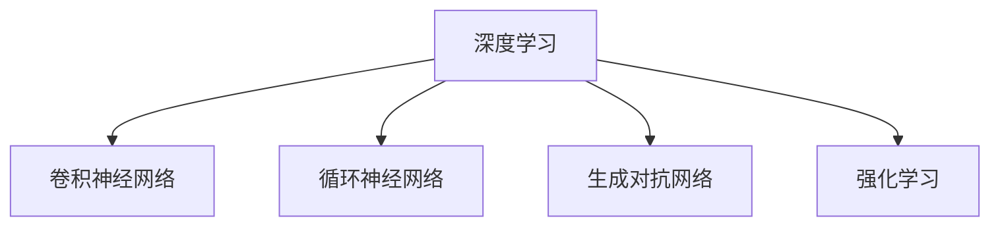

                 

# 深度思考：拉开人生差距的重要因素

## 1. 背景介绍

### 1.1 问题由来
在当今高速发展的信息技术时代，人工智能(AI)技术已经深入到我们生活的方方面面。从智能推荐系统到无人驾驶汽车，从医疗影像诊断到自然语言处理，AI技术正在改变着世界的面貌。而随着AI技术的不断发展，其背后的核心——深度学习(DL)技术，也逐渐成为社会关注的焦点。然而，我们是否思考过，深度学习技术是如何推动人类社会发展的？本文将深入探讨深度学习在人工智能领域的应用，并讨论其对人生差距的影响。

### 1.2 问题核心关键点
深度学习技术的核心在于其强大的自动特征学习能力和泛化能力。通过使用多层神经网络结构，深度学习可以从大量数据中自动提取高层次的特征表示，并通过反向传播算法进行优化，从而得到良好的模型。但是，深度学习技术的复杂性和高计算需求，使得其普及和应用存在一定的门槛。因此，如何深度思考并合理应用深度学习技术，成为拉开人生差距的重要因素。

## 2. 核心概念与联系

### 2.1 核心概念概述

为了更好地理解深度学习技术在人工智能领域的应用，本节将介绍几个关键概念：

- 深度学习(Deep Learning)：一种基于多层神经网络结构的机器学习技术，通过自动提取数据中的高层次特征表示，从而进行有效的分类、预测等任务。
- 卷积神经网络(Convolutional Neural Networks, CNNs)：一种适用于图像处理任务的深度学习模型，通过卷积和池化等操作，提取图像中的局部特征。
- 循环神经网络(Recurrent Neural Networks, RNNs)：一种适用于序列数据处理任务的深度学习模型，通过循环结构捕捉序列中的时间依赖关系。
- 生成对抗网络(Generative Adversarial Networks, GANs)：一种通过生成器和判别器之间的对抗训练，生成高质量合成数据的深度学习模型。
- 强化学习(Reinforcement Learning)：一种通过智能体与环境交互，优化策略以获得最大奖励的深度学习范式。

这些核心概念之间的逻辑关系可以通过以下Mermaid流程图来展示：



这个流程图展示出深度学习与其他几种关键深度学习模型的关系：

1. 深度学习是其他模型的基础，涵盖图像处理、序列数据处理、生成数据和强化学习等多种应用场景。
2. 卷积神经网络适用于图像处理，通过局部特征的提取，可以实现高效的图像分类、检测和分割。
3. 循环神经网络适用于序列数据处理，如自然语言处理中的文本生成、语音识别和机器翻译等。
4. 生成对抗网络适用于数据生成任务，可以生成高质量的合成图像、视频和音频。
5. 强化学习适用于智能决策任务，通过与环境交互，训练智能体执行最优策略。

这些核心概念共同构成了深度学习技术的理论基础，推动了人工智能技术的不断进步。通过理解这些概念，我们可以更好地把握深度学习技术的核心思想和应用方向。

## 3. 核心算法原理 & 具体操作步骤
### 3.1 算法原理概述

深度学习技术的核心在于其自动特征学习能力和泛化能力。通过使用多层神经网络结构，深度学习可以从大量数据中自动提取高层次的特征表示，并通过反向传播算法进行优化，从而得到良好的模型。深度学习的核心算法包括前向传播和反向传播算法，其计算过程可以通过数学模型进行形式化的描述。

### 3.2 算法步骤详解

深度学习的训练过程一般包括以下几个关键步骤：

**Step 1: 数据预处理**
- 对输入数据进行归一化、数据增强等预处理操作，以保证模型训练的稳定性和泛化能力。
- 将数据集划分为训练集、验证集和测试集，以便评估模型的性能。

**Step 2: 模型构建**
- 选择合适的深度学习模型结构，如卷积神经网络、循环神经网络等，并定义损失函数和优化算法。
- 设置模型的超参数，如学习率、批大小、迭代轮数等，并进行初始化。

**Step 3: 前向传播**
- 将输入数据通过模型进行前向传播，得到模型的预测输出。
- 计算损失函数，评估模型在当前输入上的预测误差。

**Step 4: 反向传播**
- 通过反向传播算法，计算模型参数的梯度，并更新模型参数。
- 重复前向传播和反向传播，直到模型收敛或达到预设的迭代轮数。

**Step 5: 模型评估**
- 在测试集上评估模型的性能，对比训练前后的精度提升。
- 对模型进行验证和调优，以确保其泛化能力和稳定性。

以上是深度学习训练的一般流程。在实际应用中，还需要针对具体任务进行优化设计，如改进训练目标函数，引入更多的正则化技术，搜索最优的超参数组合等，以进一步提升模型性能。

### 3.3 算法优缺点

深度学习技术具有以下优点：
1. 强大的自动特征学习能力：通过多层神经网络结构，深度学习可以自动提取高层次的特征表示。
2. 泛化能力强：在大量数据上进行训练，深度学习模型可以更好地泛化到未见过的数据。
3. 可解释性强：通过可视化技术，可以直观地理解模型内部的特征表示和决策过程。
4. 应用广泛：深度学习技术在图像处理、语音识别、自然语言处理等多个领域取得了显著的成果。

同时，该技术也存在一些局限性：
1. 计算资源需求高：深度学习模型需要大量的计算资源和存储资源，训练和推理过程较为复杂。
2. 数据需求量大：深度学习模型需要大量的标注数据进行训练，数据获取成本较高。
3. 模型复杂度高：深度学习模型结构复杂，难以进行解释和调试。
4. 训练时间长：深度学习模型的训练时间较长，需要较长的等待时间。

尽管存在这些局限性，但深度学习技术在许多领域已经取得了重大突破，成为人工智能技术的重要支柱。未来相关研究的重点在于如何进一步降低深度学习的计算和数据需求，提高模型的可解释性和训练效率，同时兼顾模型的泛化能力和应用范围。

### 3.4 算法应用领域

深度学习技术在多个领域取得了广泛的应用，以下是一些典型应用场景：

- 计算机视觉：用于图像分类、目标检测、图像分割等任务，如Google的Inception、AlexNet、VGGNet等模型。
- 自然语言处理：用于文本分类、情感分析、机器翻译等任务，如BERT、GPT、Transformer等模型。
- 语音识别：用于语音识别、语音合成等任务，如DeepSpeech、Tacotron等模型。
- 推荐系统：用于个性化推荐、广告推荐等任务，如Netflix、Amazon等公司使用的推荐系统。
- 游戏AI：用于游戏智能体设计、强化学习等任务，如AlphaGo、Dota 2的AI玩家等。
- 医疗诊断：用于医学影像诊断、药物发现等任务，如卷积神经网络在医学影像中的应用。

除了上述这些经典应用外，深度学习技术还被创新性地应用到更多场景中，如自动驾驶、智能家居、智能制造等，为各行各业带来了新的变革。随着深度学习技术的不断进步，相信其将在更广阔的应用领域大放异彩。

## 4. 数学模型和公式 & 详细讲解  
### 4.1 数学模型构建

深度学习的训练过程通常可以表示为一个优化问题，即在给定的损失函数下，最小化模型的预测误差。假设深度学习模型为 $M_\theta$，其中 $\theta$ 为模型参数。训练集为 $D=\{(x_i, y_i)\}_{i=1}^N$，其中 $x_i$ 为输入数据，$y_i$ 为标注数据。深度学习的训练过程可以形式化为以下优化问题：

$$
\mathop{\min}_{\theta} \mathcal{L}(M_\theta, D)
$$

其中 $\mathcal{L}$ 为损失函数，用于衡量模型预测输出与真实标签之间的差异。常见的损失函数包括交叉熵损失、均方误差损失等。

### 4.2 公式推导过程

以交叉熵损失为例，假设深度学习模型在输入 $x$ 上的预测输出为 $\hat{y}$，真实标签为 $y$，则交叉熵损失函数为：

$$
\ell(M_\theta(x), y) = -y\log \hat{y} - (1-y)\log(1-\hat{y})
$$

将其代入经验风险公式，得：

$$
\mathcal{L}(\theta) = -\frac{1}{N}\sum_{i=1}^N \ell(M_\theta(x_i), y_i)
$$

根据链式法则，损失函数对参数 $\theta_k$ 的梯度为：

$$
\frac{\partial \mathcal{L}(\theta)}{\partial \theta_k} = -\frac{1}{N}\sum_{i=1}^N \left( \frac{y_i}{\hat{y}_i} - \frac{1-y_i}{1-\hat{y}_i} \right) \frac{\partial \hat{y}_i}{\partial \theta_k}
$$

其中 $\frac{\partial \hat{y}_i}{\partial \theta_k}$ 为模型在输入 $x_i$ 上的输出对参数 $\theta_k$ 的导数，通常使用自动微分技术计算。

### 4.3 案例分析与讲解

以图像分类任务为例，假设使用卷积神经网络进行训练，输入为图像 $x$，输出为类别 $y$。卷积神经网络的结构可以表示为：

$$
f_\theta(x) = \text{Conv}_1(\text{Conv}_2(\text{Conv}_3(x)))
$$

其中 $\text{Conv}_1$、$\text{Conv}_2$、$\text{Conv}_3$ 分别为多个卷积层，$\theta$ 为所有卷积核的参数。在训练过程中，前向传播计算预测输出 $\hat{y} = f_\theta(x)$，然后计算交叉熵损失 $\ell(\hat{y}, y)$，并使用反向传播算法计算参数 $\theta$ 的梯度。最后根据梯度更新模型参数，完成一次训练过程。

## 5. 项目实践：代码实例和详细解释说明
### 5.1 开发环境搭建

在进行深度学习实践前，我们需要准备好开发环境。以下是使用Python进行PyTorch开发的环境配置流程：

1. 安装Anaconda：从官网下载并安装Anaconda，用于创建独立的Python环境。

2. 创建并激活虚拟环境：
```bash
conda create -n pytorch-env python=3.8 
conda activate pytorch-env
```

3. 安装PyTorch：根据CUDA版本，从官网获取对应的安装命令。例如：
```bash
conda install pytorch torchvision torchaudio cudatoolkit=11.1 -c pytorch -c conda-forge
```

4. 安装TensorFlow：
```bash
conda install tensorflow -c pytorch -c conda-forge
```

5. 安装各类工具包：
```bash
pip install numpy pandas scikit-learn matplotlib tqdm jupyter notebook ipython
```

完成上述步骤后，即可在`pytorch-env`环境中开始深度学习实践。

### 5.2 源代码详细实现

下面我们以图像分类任务为例，给出使用PyTorch进行卷积神经网络训练的PyTorch代码实现。

首先，定义卷积神经网络的结构：

```python
import torch
import torch.nn as nn
import torch.nn.functional as F

class ConvNet(nn.Module):
    def __init__(self):
        super(ConvNet, self).__init__()
        self.conv1 = nn.Conv2d(3, 64, kernel_size=3, stride=1, padding=1)
        self.conv2 = nn.Conv2d(64, 128, kernel_size=3, stride=1, padding=1)
        self.pool = nn.MaxPool2d(kernel_size=2, stride=2)
        self.fc1 = nn.Linear(128 * 14 * 14, 512)
        self.fc2 = nn.Linear(512, 10)
        
    def forward(self, x):
        x = self.pool(F.relu(self.conv1(x)))
        x = self.pool(F.relu(self.conv2(x)))
        x = x.view(x.size(0), -1)
        x = F.relu(self.fc1(x))
        x = self.fc2(x)
        return x
```

然后，定义训练和评估函数：

```python
from torch.utils.data import DataLoader
from torchvision import datasets, transforms
import torch.optim as optim

# 定义数据预处理
transform = transforms.Compose([
    transforms.Resize(224),
    transforms.ToTensor(),
    transforms.Normalize(mean=[0.485, 0.456, 0.406], std=[0.229, 0.224, 0.225])
])

# 加载数据集
train_dataset = datasets.CIFAR10(root='./data', train=True, download=True, transform=transform)
test_dataset = datasets.CIFAR10(root='./data', train=False, download=True, transform=transform)

# 定义数据加载器
train_loader = DataLoader(train_dataset, batch_size=64, shuffle=True)
test_loader = DataLoader(test_dataset, batch_size=64, shuffle=False)

# 定义模型和优化器
model = ConvNet()
criterion = nn.CrossEntropyLoss()
optimizer = optim.SGD(model.parameters(), lr=0.01, momentum=0.9)

# 训练过程
device = torch.device('cuda' if torch.cuda.is_available() else 'cpu')
model.to(device)

def train_epoch(model, loader, criterion, optimizer):
    model.train()
    total_loss = 0
    for batch_idx, (inputs, targets) in enumerate(loader):
        inputs, targets = inputs.to(device), targets.to(device)
        optimizer.zero_grad()
        outputs = model(inputs)
        loss = criterion(outputs, targets)
        loss.backward()
        optimizer.step()
        total_loss += loss.item()
    return total_loss / len(loader)

def evaluate(model, loader, criterion):
    model.eval()
    total_loss = 0
    correct = 0
    with torch.no_grad():
        for batch_idx, (inputs, targets) in enumerate(loader):
            inputs, targets = inputs.to(device), targets.to(device)
            outputs = model(inputs)
            loss = criterion(outputs, targets)
            total_loss += loss.item()
            _, predicted = torch.max(outputs.data, 1)
            total = targets.size(0)
            correct += (predicted == targets).sum().item()
    return correct / total, total_loss / len(loader)

# 训练和评估
for epoch in range(10):
    train_loss = train_epoch(model, train_loader, criterion, optimizer)
    val_acc, val_loss = evaluate(model, test_loader, criterion)
    print(f"Epoch {epoch+1}, train loss: {train_loss:.3f}, val acc: {val_acc:.3f}, val loss: {val_loss:.3f}")
```

以上就是使用PyTorch对卷积神经网络进行图像分类任务训练的完整代码实现。可以看到，PyTorch提供了简单易用的API，使得深度学习模型的搭建和训练过程变得十分便捷。

### 5.3 代码解读与分析

让我们再详细解读一下关键代码的实现细节：

**ConvNet类**：
- `__init__`方法：初始化卷积神经网络的结构。
- `forward`方法：定义前向传播过程，使用卷积层、池化层、全连接层等操作，计算模型输出。

**train_epoch函数**：
- 对训练数据进行批次加载，并对每个批次进行前向传播和反向传播，更新模型参数。
- 计算该epoch的平均损失，并返回。

**evaluate函数**：
- 对测试数据进行批次加载，并对每个批次进行前向传播，计算模型输出和损失。
- 统计预测准确率和损失，并返回。

**训练流程**：
- 定义总迭代轮数，循环迭代
- 每个epoch内，先在训练集上训练，输出平均损失和验证集上的准确率和损失
- 循环结束后，在测试集上评估，给出最终的测试结果

可以看到，PyTorch的简单性和灵活性使得深度学习模型的搭建和训练过程变得高效便捷。开发者可以将更多精力放在模型的改进和调试上，而不必过多关注底层的实现细节。

当然，工业级的系统实现还需考虑更多因素，如模型的保存和部署、超参数的自动搜索、更灵活的模型结构等。但核心的训练过程基本与此类似。

## 6. 实际应用场景
### 6.1 智能推荐系统

深度学习技术在推荐系统中的应用已经相当成熟，如Netflix、Amazon等公司都已经广泛应用深度学习模型进行个性化推荐。推荐系统的核心目标是预测用户对物品的评分或点击概率，从而为用户提供个性化的推荐内容。

在实践中，可以使用深度学习模型对用户行为数据和物品特征进行建模，学习用户-物品的关联关系，并预测用户对新物品的评分或点击概率。具体的实现方式包括：

- 构建用户-物品评分矩阵，使用协同过滤算法进行推荐。
- 使用深度神经网络模型，如FM、NFM、DLI等，对用户行为数据和物品特征进行联合建模，预测用户对新物品的评分或点击概率。
- 引入注意力机制、多任务学习等技术，进一步提升推荐精度。

推荐系统通过深度学习技术，不仅能够预测用户对新物品的评分或点击概率，还能够通过用户的历史行为数据，捕捉用户兴趣变化，不断调整推荐策略，提升用户体验。

### 6.2 医疗影像诊断

医疗影像诊断是深度学习技术的重要应用之一，通过卷积神经网络等模型，可以自动分析医学影像，辅助医生进行诊断和治疗。

在实践中，可以使用卷积神经网络对医学影像进行自动分类和分割，识别出其中的病灶和病变区域。具体的实现方式包括：

- 构建卷积神经网络模型，对医学影像进行自动分类和分割。
- 使用U-Net等网络结构，进行医学影像的分割任务。
- 引入数据增强、迁移学习等技术，提升模型鲁棒性和泛化能力。

深度学习技术在医疗影像诊断中的应用，不仅可以提高诊断效率，还可以降低误诊和漏诊率，帮助医生更好地进行疾病预防和治疗。

### 6.3 智能交通系统

深度学习技术在智能交通系统中也有广泛的应用，如自动驾驶、交通预测、交通管理等。

在实践中，可以使用深度学习模型对交通摄像头采集的视频数据进行实时分析，自动识别和跟踪车辆、行人等交通对象，并进行交通预测和优化。具体的实现方式包括：

- 构建卷积神经网络模型，对交通摄像头采集的视频数据进行实时分析。
- 使用时空卷积网络(STCN)等模型，进行交通预测和优化。
- 引入数据增强、迁移学习等技术，提升模型鲁棒性和泛化能力。

智能交通系统通过深度学习技术，不仅可以提高交通管理的效率和精度，还可以减少交通事故和交通拥堵，提升城市交通的智能化水平。

## 7. 工具和资源推荐
### 7.1 学习资源推荐

为了帮助开发者系统掌握深度学习技术，这里推荐一些优质的学习资源：

1. Deep Learning Specialization（Coursera深度学习专项课程）：由Andrew Ng教授主讲的深度学习课程，从基础到高级全面讲解深度学习技术。

2. Deep Learning by Goodfellow, Bengio, and Courville（《深度学习》书籍）：深度学习领域的经典教材，详细介绍了深度学习的基本概念和算法。

3. TensorFlow官方文档：TensorFlow的官方文档，提供了丰富的教程和示例代码，适合新手入门和进阶学习。

4. PyTorch官方文档：PyTorch的官方文档，提供了全面的API文档和示例代码，适合快速上手和深度学习实践。

5. Fast.ai课程：Fast.ai提供的一系列深度学习课程，通过实践项目和动手练习，帮助开发者快速掌握深度学习技术。

通过对这些资源的学习实践，相信你一定能够快速掌握深度学习技术的精髓，并用于解决实际的AI问题。

### 7.2 开发工具推荐

高效的深度学习开发离不开优秀的工具支持。以下是几款用于深度学习开发的常用工具：

1. PyTorch：由Facebook开发的深度学习框架，支持动态图和静态图，适合快速迭代研究和模型优化。

2. TensorFlow：由Google主导开发的深度学习框架，支持静态图和动态图，生产部署方便，适合大规模工程应用。

3. Keras：基于TensorFlow和Theano的深度学习框架，提供高层次的API，方便快速搭建深度学习模型。

4. MXNet：由Apache基金会支持的深度学习框架，支持多种语言和多种硬件，适合分布式训练和推理。

5. Jupyter Notebook：支持Python代码的交互式执行和可视化展示，适合数据探索和模型调试。

6. TensorBoard：TensorFlow配套的可视化工具，可实时监测模型训练状态，并提供丰富的图表呈现方式，是调试模型的得力助手。

合理利用这些工具，可以显著提升深度学习模型的开发效率，加快创新迭代的步伐。

### 7.3 相关论文推荐

深度学习技术的核心在于其强大的自动特征学习能力和泛化能力。以下是几篇奠基性的相关论文，推荐阅读：

1. ImageNet Classification with Deep Convolutional Neural Networks（AlexNet论文）：提出了深度卷积神经网络结构，取得了ImageNet分类竞赛的优异成绩。

2. Learning Phrase Representations using RNN Encoder-Decoder for Statistical Machine Translation（Sequoia论文）：提出了基于RNN的编码器-解码器结构，提升了机器翻译的性能。

3. Deep Residual Learning for Image Recognition（ResNet论文）：提出了深度残差网络结构，解决了深层网络训练过程中的梯度消失问题。

4. Advances in Neural Information Processing Systems 30 (NIPS 2017)：NIPS大会上发表的深度学习论文集，涵盖了深度学习领域的最新研究成果。

5. Generative Adversarial Nets（GANs论文）：提出了生成对抗网络结构，通过生成器和判别器之间的对抗训练，生成高质量的合成数据。

6. Reinforcement Learning: An Introduction（《强化学习》书籍）：Sutton和Barto合著的强化学习领域经典教材，详细介绍了强化学习的核心概念和算法。

这些论文代表了大深度学习技术的发展脉络。通过学习这些前沿成果，可以帮助研究者把握深度学习技术的核心思想和应用方向。

## 8. 总结：未来发展趋势与挑战

### 8.1 总结

本文对深度学习技术在人工智能领域的应用进行了全面系统的介绍。首先阐述了深度学习技术的核心思想和自动特征学习能力，明确了深度学习在人工智能技术中的重要地位。其次，从原理到实践，详细讲解了深度学习模型的训练过程，给出了深度学习模型搭建和训练的完整代码实例。同时，本文还广泛探讨了深度学习技术在智能推荐、医疗影像诊断、智能交通等领域的实际应用，展示了深度学习技术的广阔前景。此外，本文精选了深度学习技术的各类学习资源，力求为读者提供全方位的技术指引。

通过本文的系统梳理，可以看到，深度学习技术正在成为人工智能技术的核心支柱，极大地推动了人工智能技术的发展和应用。深度学习技术在数据获取、模型构建、训练优化等方面具有强大的能力，能够高效地解决各种复杂的AI问题。未来，随着深度学习技术的不断进步，其在人工智能领域的地位将更加稳固，深度学习技术的应用也将更加广泛和深入。

### 8.2 未来发展趋势

展望未来，深度学习技术将呈现以下几个发展趋势：

1. 模型规模持续增大。随着算力成本的下降和数据规模的扩张，深度学习模型的参数量还将持续增长。超大规模深度学习模型蕴含的丰富特征表示，将支撑更加复杂多变的AI任务。

2. 模型结构日益复杂。未来的深度学习模型将包含更多的层、更多的参数，并引入更多的结构，如注意力机制、残差连接等，以进一步提升模型精度和泛化能力。

3. 可解释性成为重要方向。随着深度学习模型在更多领域的应用，模型的可解释性将成为一个重要的研究方向。如何提高深度学习模型的可解释性，增强其透明性和可信度，将成为未来的重要课题。

4. 多模态学习逐渐兴起。深度学习模型将逐渐引入更多的模态，如语音、图像、视频等，实现多模态信息融合，提升模型的泛化能力和应用范围。

5. 强化学习与深度学习的融合。通过将强化学习与深度学习融合，深度学习模型将能够更好地解决优化、决策等复杂问题，在更多领域发挥作用。

以上趋势凸显了深度学习技术的广阔前景。这些方向的探索发展，将进一步提升深度学习模型的性能和应用范围，为人工智能技术的进步提供更多助力。

### 8.3 面临的挑战

尽管深度学习技术已经取得了显著的成果，但在迈向更加智能化、普适化应用的过程中，它仍面临诸多挑战：

1. 计算资源瓶颈。深度学习模型需要大量的计算资源和存储资源，训练和推理过程较为复杂。如何降低深度学习模型的计算和存储需求，提高模型的推理效率，仍然是一个重要的研究方向。

2. 数据需求高。深度学习模型需要大量的标注数据进行训练，数据获取成本较高。如何降低深度学习模型对标注数据的依赖，提高模型的自监督学习能力，仍然是一个重要的研究方向。

3. 模型复杂度高。深度学习模型结构复杂，难以进行解释和调试。如何提高深度学习模型的可解释性，增强其透明性和可信度，仍然是一个重要的研究方向。

4. 模型鲁棒性不足。深度学习模型在对抗样本、噪声数据等环境下，泛化能力不足。如何提高深度学习模型的鲁棒性，增强其泛化能力，仍然是一个重要的研究方向。

5. 伦理道德问题。深度学习模型可能学习到有害信息，甚至产生歧视性输出。如何提高深度学习模型的伦理道德水平，保障其应用安全，仍然是一个重要的研究方向。

6. 知识整合能力不足。深度学习模型往往局限于数据中隐含的知识，难以灵活吸收和运用外部知识库。如何提高深度学习模型的知识整合能力，增强其应用范围和效果，仍然是一个重要的研究方向。

这些挑战凸显了深度学习技术在实际应用中的复杂性和难度。面对这些挑战，未来的研究需要在多个方面寻求新的突破，才能进一步提升深度学习技术的性能和应用范围。

### 8.4 研究展望

面对深度学习技术面临的挑战，未来的研究需要在以下几个方面寻求新的突破：

1. 探索无监督和半监督学习范式。摆脱对大量标注数据的依赖，利用自监督学习、主动学习等无监督和半监督范式，最大限度利用非结构化数据，实现更加灵活高效的深度学习。

2. 研究计算高效的深度学习算法。开发更加高效的深度学习算法，如稀疏化、量化加速等，以降低深度学习模型的计算和存储需求，提高模型的推理效率。

3. 引入符号化先验知识。将符号化的先验知识，如知识图谱、逻辑规则等，与深度学习模型进行巧妙融合，引导深度学习模型学习更准确、合理的特征表示。

4. 结合因果分析和博弈论工具。将因果分析方法引入深度学习模型，识别出模型决策的关键特征，增强深度学习模型的可解释性和稳定性。

5. 纳入伦理道德约束。在深度学习模型的训练目标中引入伦理导向的评估指标，过滤和惩罚有害的输出倾向，确保深度学习模型的应用安全。

这些研究方向的探索，将引领深度学习技术迈向更高的台阶，为人工智能技术的进步提供更多助力。面向未来，深度学习技术需要与其他人工智能技术进行更深入的融合，如知识表示、因果推理、强化学习等，多路径协同发力，共同推动人工智能技术的进步。只有勇于创新、敢于突破，才能不断拓展深度学习技术的边界，让深度学习技术更好地造福人类社会。

## 9. 附录：常见问题与解答

**Q1：深度学习与传统机器学习有什么区别？**

A: 深度学习与传统机器学习的主要区别在于模型的复杂度和自动特征学习能力。传统机器学习需要手工设计特征，特征提取过程复杂，且难以适应高维数据和非线性数据。而深度学习模型通过多层神经网络结构，自动学习数据的高层次特征表示，特征提取过程简单，且具有较强的非线性建模能力。

**Q2：深度学习模型如何避免过拟合？**

A: 深度学习模型在训练过程中，过拟合是一个常见的问题。为避免过拟合，可以采取以下措施：
1. 数据增强：通过图像旋转、裁剪等操作，扩充训练集，减少过拟合风险。
2. 正则化：使用L2正则、Dropout等正则化技术，抑制模型复杂度，减少过拟合风险。
3. 早停法：通过在验证集上监测模型性能，及时停止训练，避免模型在训练集上过拟合。

**Q3：深度学习模型如何处理稀疏数据？**

A: 深度学习模型通常处理的是密集型数据，但对于稀疏数据，如文本、图形等，需要进行预处理才能使用。常用的稀疏数据处理方式包括：
1. 嵌入层：将稀疏数据嵌入到高维空间，生成密集型数据表示。
2. 池化层：使用池化操作，减少稀疏数据的维度，提高模型处理能力。

**Q4：深度学习模型在实际应用中如何部署？**

A: 深度学习模型在实际应用中需要部署到云端或本地环境中，以供业务系统调用。常用的部署方式包括：
1. 模型导出：将训练好的模型导出为ONNX、TensorFlow Lite等格式，供其他框架调用。
2. 容器化：将模型封装为Docker容器，便于统一管理和部署。
3. 分布式训练：使用分布式训练框架，提高模型的训练和推理效率。

**Q5：深度学习模型如何保持更新？**

A: 深度学习模型需要不断更新，以应对数据分布的变化和模型的退化。常用的模型更新方式包括：
1. 定期微调：使用新的数据集重新训练模型，保持模型的泛化能力和适应性。
2. 增量学习：通过在线学习的方式，逐步更新模型，保持模型的实时更新能力。

这些措施可以帮助深度学习模型在实际应用中保持稳定性和可靠性，提升模型的应用价值。

---

作者：禅与计算机程序设计艺术 / Zen and the Art of Computer Programming

