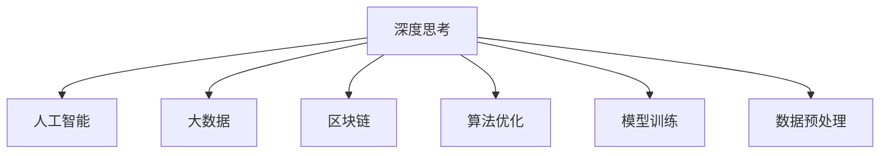

                 

# 深度思考：比勤奋更能拉开人生差距

在快速发展的现代社会中，无数人通过努力和勤奋实现了自己的梦想。然而，随着技术的不断进步，我们发现仅靠努力已不足以在竞争激烈的职场中脱颖而出。在今天的技术时代，深度思考能力比勤奋更能拉开人生的差距。本文将深入探讨深度思考能力在技术领域的重要性，并详细介绍如何培养和应用这种能力。

## 1. 背景介绍

### 1.1 问题由来

随着人工智能、大数据、区块链等技术的快速发展，我们的工作方式和生活方式正在经历翻天覆地的变化。这些技术的核心驱动力，在于其背后强大的深度思考能力。例如，在机器学习领域，深度学习模型通过多层次的特征提取和抽象，能够自动发现数据中的模式和规律，从而进行高效的数据处理和分析。

然而，并非所有人都能意识到这一点。很多人仍然坚持传统的经验主义工作方式，缺乏对新技术和理念的深度思考，最终被时代的潮流所淘汰。本文将重点探讨深度思考能力在技术领域的重要性，并提出具体策略来培养和提升这种能力。

### 1.2 问题核心关键点

深度思考能力在技术领域的重要性，体现在以下几个方面：

1. **发现新趋势和机会**：深度思考能够帮助我们从数据和现象中提炼出隐藏的规律和趋势，从而发现新的技术机会和商业价值。
2. **解决问题**：深度思考能够帮助我们在复杂的问题中识别关键因素，提出有效的解决方案。
3. **创新和突破**：深度思考能够激发我们的创造力，推动技术创新和突破。
4. **提升决策能力**：深度思考能够帮助我们更好地理解问题，做出更加明智的决策。

## 2. 核心概念与联系

### 2.1 核心概念概述

为更好地理解深度思考在技术领域的重要性，本节将介绍几个密切相关的核心概念：

- **深度思考**：指通过多层次的分析和推理，对问题进行全面、深入的思考和理解。深度思考强调逻辑严密、信息全面、视角广阔，能帮助我们从根本上解决问题。

- **人工智能**：基于计算机科学和认知科学的交叉学科，通过模拟人类的智能行为，实现机器的自主学习和推理。深度学习是人工智能的重要分支之一。

- **大数据**：指通过技术手段收集、存储和分析海量数据，从中提取有价值的信息和知识。大数据为深度思考提供了丰富的数据基础。

- **区块链**：一种分布式账本技术，通过去中心化、透明、不可篡改的特点，实现了安全的交易和数据存储。

- **算法优化**：指通过改进算法结构和参数，提高算法效率和性能的过程。深度思考能力有助于我们设计和优化算法。

- **模型训练**：通过不断调整模型参数，使模型在训练数据上获得最优的性能。深度思考能力能够帮助我们理解和优化模型训练过程。

- **数据预处理**：在模型训练前，对数据进行清洗、转换和归一化等操作，确保数据的质量和一致性。深度思考能力有助于我们设计和实现高效的数据预处理流程。

这些核心概念之间的逻辑关系可以通过以下Mermaid流程图来展示：



这个流程图展示了大语言模型的核心概念及其之间的关系：

1. 深度思考是大语言模型的核心驱动力，帮助模型从数据中学习并提取规律。
2. 人工智能、大数据、区块链等技术，为大语言模型提供了丰富的数据和算法基础。
3. 深度思考能力能够帮助我们设计和优化算法，提升模型训练和数据预处理的效率。

这些概念共同构成了大语言模型的学习和应用框架，使其能够在各种场景下发挥强大的智能推理能力。通过理解这些核心概念，我们可以更好地把握深度思考能力在技术领域的应用价值。

## 3. 核心算法原理 & 具体操作步骤
### 3.1 算法原理概述

深度思考能力在技术领域的应用，主要体现在以下几个方面：

- **算法设计和优化**：通过深度思考，理解算法的原理和结构，提出改进方案，提高算法效率和性能。
- **模型训练和调参**：通过深度思考，识别模型训练过程中的关键因素，优化模型参数和超参数，提高模型效果。
- **数据预处理和清洗**：通过深度思考，设计高效的数据预处理流程，确保数据质量和一致性。
- **问题分析和解决**：通过深度思考，分析问题的本质，提出有效的解决方案。

### 3.2 算法步骤详解

深度思考能力在技术领域的应用，主要包括以下几个关键步骤：

**Step 1: 数据收集和理解**

深度思考的第一步是数据收集和理解。通过收集相关的数据和文献，对问题进行全面的了解，获取充分的背景信息。

**Step 2: 问题抽象和模型选择**

在理解数据的基础上，通过深度思考，抽象出问题的本质，选择合适的模型进行解决。这一步骤需要综合考虑问题的复杂度、数据的规模和特征，以及模型的可解释性和性能。

**Step 3: 模型设计和优化**

在模型选择后，通过深度思考，设计模型的结构和参数，并进行优化。这一步骤需要对模型的原理、特征提取能力和泛化能力进行深入的思考和分析。

**Step 4: 模型训练和调参**

在模型设计后，通过深度思考，识别训练过程中的关键因素，优化模型参数和超参数，确保模型在训练数据上获得最优的性能。

**Step 5: 模型验证和优化**

在模型训练后，通过深度思考，设计和实施验证流程，评估模型的性能，并根据验证结果进行优化。

**Step 6: 模型应用和扩展**

在模型验证后，通过深度思考，将模型应用于实际问题中，并根据应用效果进行进一步的优化和扩展。

### 3.3 算法优缺点

深度思考能力在技术领域的应用，具有以下优点：

1. **全面性**：深度思考能够从多个角度和层次对问题进行全面分析，确保解决方案的全面性和合理性。
2. **创新性**：深度思考能够激发我们的创造力，提出创新的解决方案。
3. **高效性**：深度思考能够帮助我们识别问题的关键因素，优化模型和算法，提高效率和性能。
4. **可解释性**：深度思考能够帮助我们理解模型的决策过程，提高模型的可解释性。

同时，该方法也存在一定的局限性：

1. **时间和资源成本高**：深度思考需要大量的思考和分析，耗费时间和资源。
2. **易陷入局部最优**：深度思考容易陷入局部最优，难以找到全局最优解。
3. **依赖经验**：深度思考的效果很大程度上依赖于个人经验和知识储备，可能存在主观偏差。

尽管存在这些局限性，但就目前而言，深度思考能力仍是技术领域不可或缺的重要能力。未来相关研究的重点在于如何进一步提高深度思考的效率和效果，减少主观偏差，同时兼顾可解释性和创新性等因素。

### 3.4 算法应用领域

深度思考能力在技术领域已经得到了广泛的应用，涵盖了许多前沿技术和应用领域，例如：

- **机器学习和深度学习**：在机器学习和深度学习中，深度思考能力能够帮助我们设计和优化算法，提升模型效果。
- **自然语言处理**：在自然语言处理中，深度思考能力能够帮助我们理解语言的复杂结构和语义，实现高效的语言理解和生成。
- **计算机视觉**：在计算机视觉中，深度思考能力能够帮助我们设计和优化卷积神经网络，提升图像识别和分析能力。
- **自动驾驶**：在自动驾驶中，深度思考能力能够帮助我们设计和优化感知、决策和控制算法，实现高效的车辆控制和导航。
- **医疗诊断**：在医疗诊断中，深度思考能力能够帮助我们设计和优化医学影像分析算法，提高诊断准确性和效率。

除了上述这些经典领域外，深度思考能力还被创新性地应用到更多场景中，如金融分析、气象预测、资源优化等，为技术领域带来了全新的突破。随着深度思考方法的不断进步，相信技术领域必将涌现更多创新的应用场景。

## 4. 数学模型和公式 & 详细讲解 & 举例说明

### 4.1 数学模型构建

深度思考能力在技术领域的应用，主要涉及以下几个数学模型：

- **算法优化模型**：通过深度思考，设计和优化算法结构和参数，提升算法效率和性能。
- **模型训练模型**：通过深度思考，优化模型参数和超参数，提高模型效果。
- **数据预处理模型**：通过深度思考，设计和实现高效的数据预处理流程，确保数据质量和一致性。

### 4.2 公式推导过程

以下我们以机器学习中的深度学习模型优化为例，推导梯度下降算法的计算过程。

设深度学习模型为 $M_{\theta}=\{f_k\}_{k=1}^K$，其中 $\theta_k$ 为第 $k$ 层模型的参数，$L$ 为损失函数，$\eta$ 为学习率。

梯度下降算法的更新公式为：

$$
\theta_k \leftarrow \theta_k - \eta \nabla_{\theta_k}L(M_{\theta})
$$

其中 $\nabla_{\theta_k}L(M_{\theta})$ 为损失函数对第 $k$ 层模型参数的梯度，可通过反向传播算法高效计算。

### 4.3 案例分析与讲解

以下我们以卷积神经网络（CNN）为例，详细讲解深度思考能力在计算机视觉中的应用。

**Step 1: 数据收集和理解**

在计算机视觉中，首先需要进行数据收集和理解。以图像分类任务为例，需要收集大量的标注图片和相应的标签，确保数据的多样性和代表性。

**Step 2: 问题抽象和模型选择**

在理解数据的基础上，通过深度思考，抽象出图像分类的本质。根据数据的特点和任务的需求，选择卷积神经网络作为模型。

**Step 3: 模型设计和优化**

在模型选择后，通过深度思考，设计卷积神经网络的架构和参数。例如，选择卷积层、池化层、全连接层等基本组件，并优化超参数如卷积核大小、步长、激活函数等。

**Step 4: 模型训练和调参**

在模型设计后，通过深度思考，识别训练过程中的关键因素，优化模型参数和超参数。例如，选择适当的学习率、批量大小、优化器等，确保模型在训练数据上获得最优的性能。

**Step 5: 模型验证和优化**

在模型训练后，通过深度思考，设计和实施验证流程，评估模型的性能，并根据验证结果进行优化。例如，使用验证集进行交叉验证，调整模型结构和超参数。

**Step 6: 模型应用和扩展**

在模型验证后，通过深度思考，将模型应用于实际问题中，并根据应用效果进行进一步的优化和扩展。例如，应用于新的图像分类任务，进一步优化模型性能。

## 5. 项目实践：代码实例和详细解释说明
### 5.1 开发环境搭建

在进行深度思考能力实践前，我们需要准备好开发环境。以下是使用Python进行PyTorch开发的环境配置流程：

1. 安装Anaconda：从官网下载并安装Anaconda，用于创建独立的Python环境。

2. 创建并激活虚拟环境：
```bash
conda create -n pytorch-env python=3.8 
conda activate pytorch-env
```

3. 安装PyTorch：根据CUDA版本，从官网获取对应的安装命令。例如：
```bash
conda install pytorch torchvision torchaudio cudatoolkit=11.1 -c pytorch -c conda-forge
```

4. 安装TensorFlow：
```bash
pip install tensorflow
```

5. 安装各类工具包：
```bash
pip install numpy pandas scikit-learn matplotlib tqdm jupyter notebook ipython
```

完成上述步骤后，即可在`pytorch-env`环境中开始深度思考能力的实践。

### 5.2 源代码详细实现

这里我们以深度学习模型的优化为例，给出使用PyTorch实现梯度下降算法的完整代码：

```python
import torch
import torch.nn as nn
import torch.optim as optim

# 定义模型
class Net(nn.Module):
    def __init__(self):
        super(Net, self).__init__()
        self.conv1 = nn.Conv2d(3, 6, 5)
        self.pool = nn.MaxPool2d(2, 2)
        self.conv2 = nn.Conv2d(6, 16, 5)
        self.fc1 = nn.Linear(16 * 5 * 5, 120)
        self.fc2 = nn.Linear(120, 84)
        self.fc3 = nn.Linear(84, 10)

    def forward(self, x):
        x = self.pool(F.relu(self.conv1(x)))
        x = self.pool(F.relu(self.conv2(x)))
        x = x.view(-1, 16 * 5 * 5)
        x = F.relu(self.fc1(x))
        x = F.relu(self.fc2(x))
        x = self.fc3(x)
        return x

# 定义损失函数和优化器
net = Net()
criterion = nn.CrossEntropyLoss()
optimizer = optim.SGD(net.parameters(), lr=0.001, momentum=0.9)

# 训练模型
for epoch in range(10):
    running_loss = 0.0
    for i, data in enumerate(trainloader, 0):
        inputs, labels = data
        optimizer.zero_grad()
        outputs = net(inputs)
        loss = criterion(outputs, labels)
        loss.backward()
        optimizer.step()
        running_loss += loss.item()
    print(f'Epoch {epoch+1}, loss: {running_loss/len(trainloader)}')
```

### 5.3 代码解读与分析

让我们再详细解读一下关键代码的实现细节：

**Net类**：
- `__init__`方法：初始化卷积层、池化层和全连接层。
- `forward`方法：定义模型的前向传播过程。

**criterion和optimizer**：
- `criterion`：定义交叉熵损失函数，用于评估模型预测结果与真实标签之间的差异。
- `optimizer`：定义随机梯度下降优化器，用于更新模型参数。

**训练流程**：
- 定义总的epoch数，开始循环迭代
- 每个epoch内，对训练集数据进行前向传播和反向传播，更新模型参数
- 重复上述过程直至收敛

可以看到，PyTorch的简洁接口和强大的自动微分功能，使得深度学习模型的优化过程变得非常高效和灵活。开发者可以将更多精力放在深度思考和模型设计上，而不必过多关注底层的实现细节。

当然，工业级的系统实现还需考虑更多因素，如模型的保存和部署、超参数的自动搜索、更灵活的任务适配层等。但核心的深度思考能力基本与此类似。

## 6. 实际应用场景
### 6.1 智能客服系统

深度思考能力在智能客服系统的构建中有着广泛的应用。传统客服往往依赖于大量的人工客服人员，高峰期响应速度慢，且效率和质量难以保证。而使用深度思考能力训练的智能客服系统，可以7x24小时不间断服务，快速响应客户咨询，并提供高质量的客户支持。

在技术实现上，可以收集企业内部的历史客服对话记录，将问题和最佳答复构建成监督数据，在此基础上训练深度学习模型。深度学习模型能够自动理解客户意图，匹配最合适的答案模板进行回复。对于客户提出的新问题，还可以接入检索系统实时搜索相关内容，动态组织生成回答。如此构建的智能客服系统，能大幅提升客户咨询体验和问题解决效率。

### 6.2 金融舆情监测

深度思考能力在金融舆情监测中也有着重要的应用。金融机构需要实时监测市场舆论动向，以便及时应对负面信息传播，规避金融风险。传统的人工监测方式成本高、效率低，难以应对网络时代海量信息爆发的挑战。基于深度思考能力训练的文本分类和情感分析模型，为金融舆情监测提供了新的解决方案。

具体而言，可以收集金融领域相关的新闻、报道、评论等文本数据，并对其进行主题标注和情感标注。在此基础上训练深度学习模型，使其能够自动判断文本属于何种主题，情感倾向是正面、中性还是负面。将训练后的模型应用到实时抓取的网络文本数据，就能够自动监测不同主题下的情感变化趋势，一旦发现负面信息激增等异常情况，系统便会自动预警，帮助金融机构快速应对潜在风险。

### 6.3 个性化推荐系统

深度思考能力在个性化推荐系统中也有着广泛的应用。当前的推荐系统往往只依赖于用户的历史行为数据进行物品推荐，难以深入理解用户的真实兴趣偏好。基于深度思考能力的推荐系统可以更好地挖掘用户行为背后的语义信息，从而提供更精准、多样的推荐内容。

在实践中，可以收集用户浏览、点击、评论、分享等行为数据，提取和用户交互的物品标题、描述、标签等文本内容。将文本内容作为模型输入，用户的后续行为（如是否点击、购买等）作为监督信号，在此基础上训练深度学习模型。训练后的模型能够从文本内容中准确把握用户的兴趣点。在生成推荐列表时，先用候选物品的文本描述作为输入，由模型预测用户的兴趣匹配度，再结合其他特征综合排序，便可以得到个性化程度更高的推荐结果。

### 6.4 未来应用展望

随着深度思考能力的发展，其在更多领域的应用前景将更加广阔。

在智慧医疗领域，基于深度思考能力的医疗问答、病历分析、药物研发等应用将提升医疗服务的智能化水平，辅助医生诊疗，加速新药开发进程。

在智能教育领域，深度思考能力可应用于作业批改、学情分析、知识推荐等方面，因材施教，促进教育公平，提高教学质量。

在智慧城市治理中，深度思考能力可应用于城市事件监测、舆情分析、应急指挥等环节，提高城市管理的自动化和智能化水平，构建更安全、高效的未来城市。

此外，在企业生产、社会治理、文娱传媒等众多领域，深度思考能力的应用也将不断涌现，为经济社会发展注入新的动力。相信随着技术的日益成熟，深度思考能力必将在构建人机协同的智能时代中扮演越来越重要的角色。

## 7. 工具和资源推荐
### 7.1 学习资源推荐

为了帮助开发者系统掌握深度思考能力的理论基础和实践技巧，这里推荐一些优质的学习资源：

1. **《深度学习》（Ian Goodfellow著）**：全面介绍了深度学习的基本原理、算法设计和应用场景，是深度思考能力学习的经典教材。
2. **《机器学习》（周志华著）**：介绍了机器学习的基本概念、算法设计和应用案例，涵盖了深度思考能力的核心内容。
3. **Coursera《深度学习专项课程》**：斯坦福大学开设的深度学习专项课程，有Lecture视频和配套作业，带你系统学习深度思考能力的理论基础和实践技巧。
4. **Kaggle竞赛平台**：提供各种深度思考能力的竞赛和项目，是提升深度思考能力的好机会。
5. **GitHub开源项目**：GitHub上众多开源项目和代码库，提供了丰富的深度思考能力的实践案例和代码实现。

通过对这些资源的学习实践，相信你一定能够系统掌握深度思考能力，并应用于解决实际的工程技术问题。

### 7.2 开发工具推荐

高效的开发离不开优秀的工具支持。以下是几款用于深度思考能力开发的常用工具：

1. **PyTorch**：基于Python的开源深度学习框架，灵活动态的计算图，适合快速迭代研究。大部分深度学习模型都有PyTorch版本的实现。
2. **TensorFlow**：由Google主导开发的开源深度学习框架，生产部署方便，适合大规模工程应用。同样有丰富的深度学习模型资源。
3. **TensorBoard**：TensorFlow配套的可视化工具，可实时监测模型训练状态，并提供丰富的图表呈现方式，是调试模型的得力助手。
4. **Weights & Biases**：模型训练的实验跟踪工具，可以记录和可视化模型训练过程中的各项指标，方便对比和调优。与主流深度学习框架无缝集成。

合理利用这些工具，可以显著提升深度思考能力的开发效率，加快创新迭代的步伐。

### 7.3 相关论文推荐

深度思考能力的发展源于学界的持续研究。以下是几篇奠基性的相关论文，推荐阅读：

1. **《深度学习》（Ian Goodfellow等著）**：介绍了深度学习的基本原理、算法设计和应用场景，是深度思考能力学习的经典教材。
2. **《Reinforcement Learning: An Introduction》（Richard S. Sutton和Andrew G. Barto著）**：介绍了强化学习的基本原理和应用场景，是深度思考能力的重要参考。
3. **《Generative Adversarial Nets》（Ian Goodfellow等著）**：介绍了生成对抗网络的基本原理和应用场景，是深度思考能力的核心技术之一。
4. **《Deep Learning for Natural Language Processing》（Michael Wittekind著）**：介绍了深度学习在自然语言处理中的应用，是深度思考能力的重要参考。
5. **《Neural Architecture Search with Reinforcement Learning》（Jash Shah和Nitish Shirah等著）**：介绍了使用强化学习进行神经网络架构搜索的技术，是深度思考能力的重要应用方向。

这些论文代表了大语言模型微调技术的发展脉络。通过学习这些前沿成果，可以帮助研究者把握学科前进方向，激发更多的创新灵感。

## 8. 总结：未来发展趋势与挑战

### 8.1 总结

本文对深度思考能力在技术领域的重要性进行了全面系统的探讨。首先阐述了深度思考能力在算法设计、模型训练、数据预处理、问题分析和解决等各个环节的应用价值，明确了深度思考能力在技术领域的重要地位。其次，从原理到实践，详细讲解了深度思考能力的应用流程，给出了深度思考能力实践的完整代码实例。同时，本文还广泛探讨了深度思考能力在智能客服、金融舆情、个性化推荐等多个行业领域的应用前景，展示了深度思考能力的巨大潜力。此外，本文精选了深度思考能力的各类学习资源，力求为读者提供全方位的技术指引。

通过本文的系统梳理，可以看到，深度思考能力在技术领域的应用已经成为不可或缺的重要能力。深度思考能力能够帮助我们从根本上解决问题，提升算法和模型的效果，引领技术创新和突破。未来，随着深度思考方法的不断进步，相信技术领域必将涌现更多创新的应用场景，深度思考能力必将在构建人机协同的智能时代中扮演越来越重要的角色。

### 8.2 未来发展趋势

展望未来，深度思考能力在技术领域的发展将呈现以下几个趋势：

1. **自动化和智能化**：深度思考能力将与更多人工智能技术进行融合，如自然语言处理、计算机视觉、强化学习等，实现更加全面、高效、智能的解决方案。
2. **跨领域应用**：深度思考能力将被广泛应用于更多领域，如智慧医疗、智能教育、智慧城市等，为各行各业带来变革性影响。
3. **模型轻量化和高效化**：随着硬件性能的提升和算法优化技术的发展，深度思考能力的模型将更加轻量化和高效化，提升应用效率和用户体验。
4. **可解释性和可控性**：深度思考能力将更加注重模型的可解释性和可控性，提高模型的透明度和可信度，增强用户的安全感和信任感。
5. **多模态融合**：深度思考能力将与视觉、语音、物联网等技术进行融合，实现多模态信息的协同建模，提升系统的综合能力。

以上趋势凸显了深度思考能力在技术领域的重要价值和发展方向。这些方向的探索发展，必将进一步提升深度思考能力的性能和应用范围，为技术领域带来更多的创新和突破。

### 8.3 面临的挑战

尽管深度思考能力在技术领域已经取得了瞩目成就，但在迈向更加智能化、普适化应用的过程中，仍面临诸多挑战：

1. **时间和资源成本高**：深度思考能力需要大量的思考和分析，耗费时间和资源。如何降低深度思考的成本，提高效率，是一个重要的研究方向。
2. **易陷入局部最优**：深度思考容易陷入局部最优，难以找到全局最优解。如何提高深度思考的鲁棒性和泛化能力，是一个重要的研究方向。
3. **依赖经验和知识**：深度思考的效果很大程度上依赖于个人经验和知识储备，可能存在主观偏差。如何通过数据和算法优化，减少主观偏差，是一个重要的研究方向。
4. **可解释性和可控性**：深度思考能力往往被视为“黑盒”系统，难以解释其内部工作机制和决策逻辑。如何提高深度思考的透明度和可控性，是一个重要的研究方向。
5. **模型偏见和歧视**：深度思考能力可能学习到有偏见、有害的信息，通过模型传递到实际应用，产生误导性、歧视性的输出。如何避免和消除模型偏见，是一个重要的研究方向。

正视深度思考能力面临的这些挑战，积极应对并寻求突破，将是大语言模型微调走向成熟的必由之路。相信随着学界和产业界的共同努力，这些挑战终将一一被克服，深度思考能力必将在构建人机协同的智能时代中扮演越来越重要的角色。

### 8.4 研究展望

面对深度思考能力所面临的种种挑战，未来的研究需要在以下几个方面寻求新的突破：

1. **自动化和智能化**：探索使用自动机器学习、强化学习等自动化技术，提升深度思考能力的效率和效果，降低人类主观偏差。
2. **模型轻量化和高效化**：开发更加轻量化、高效化的深度思考能力模型，提升应用效率和用户体验。
3. **多模态融合**：探索多模态信息的协同建模技术，提升深度思考能力的综合能力。
4. **可解释性和可控性**：研究深度思考能力的可解释性增强方法，提高模型的透明度和可信度。
5. **模型偏见和歧视**：研究避免和消除模型偏见的方法，提高深度思考能力的安全性和公平性。

这些研究方向的探索，必将引领深度思考能力在技术领域迈向更高的台阶，为构建安全、可靠、可解释、可控的智能系统铺平道路。面向未来，深度思考能力还需要与其他人工智能技术进行更深入的融合，如知识表示、因果推理、强化学习等，多路径协同发力，共同推动自然语言理解和智能交互系统的进步。只有勇于创新、敢于突破，才能不断拓展深度思考能力的边界，让智能技术更好地造福人类社会。

## 9. 附录：常见问题与解答

**Q1：深度思考能力是否适用于所有NLP任务？**

A: 深度思考能力在大多数NLP任务上都能取得不错的效果，特别是对于数据量较小的任务。但对于一些特定领域的任务，如医学、法律等，仅仅依靠通用语料预训练的模型可能难以很好地适应。此时需要在特定领域语料上进一步预训练，再进行微调，才能获得理想效果。此外，对于一些需要时效性、个性化很强的任务，如对话、推荐等，深度思考方法也需要针对性的改进优化。

**Q2：如何选择合适的学习率？**

A: 深度思考的学习率一般要比预训练时小1-2个数量级，如果使用过大的学习率，容易破坏预训练权重，导致过拟合。一般建议从1e-5开始调参，逐步减小学习率，直至收敛。也可以使用warmup策略，在开始阶段使用较小的学习率，再逐渐过渡到预设值。需要注意的是，不同的优化器(如AdamW、Adafactor等)以及不同的学习率调度策略，可能需要设置不同的学习率阈值。

**Q3：采用深度思考能力时会面临哪些资源瓶颈？**

A: 目前主流的预训练大模型动辄以亿计的参数规模，对算力、内存、存储都提出了很高的要求。GPU/TPU等高性能设备是必不可少的，但即便如此，超大批次的训练和推理也可能遇到显存不足的问题。因此需要采用一些资源优化技术，如梯度积累、混合精度训练、模型并行等，来突破硬件瓶颈。同时，模型的存储和读取也可能占用大量时间和空间，需要采用模型压缩、稀疏化存储等方法进行优化。

**Q4：如何缓解深度思考过程中的过拟合问题？**

A: 过拟合是深度思考面临的主要挑战，尤其是在标注数据不足的情况下。常见的缓解策略包括：
1. 数据增强：通过回译、近义替换等方式扩充训练集
2. 正则化：使用L2正则、Dropout、Early Stopping等避免过拟合
3. 对抗训练：引入对抗样本，提高模型鲁棒性
4. 参数高效微调：只调整少量参数(如Adapter、Prefix等)，减小过拟合风险
5. 多模型集成：训练多个深度思考模型，取平均输出，抑制过拟合

这些策略往往需要根据具体任务和数据特点进行灵活组合。只有在数据、模型、训练、推理等各环节进行全面优化，才能最大限度地发挥深度思考能力的威力。

**Q5：如何进一步提高深度思考能力的效率和效果？**

A: 提高深度思考能力的效率和效果，需要综合考虑以下几个方面：
1. 数据质量：确保数据的多样性和代表性，避免过拟合和欠拟合。
2. 模型结构：设计合理的模型结构和参数，避免过复杂和过简单。
3. 算法优化：优化算法和超参数，提升模型的泛化能力和鲁棒性。
4. 多模态融合：探索多模态信息的协同建模技术，提升系统的综合能力。
5. 自动化和智能化：探索使用自动机器学习、强化学习等自动化技术，提升深度思考能力的效率和效果，降低人类主观偏差。

只有从数据、算法、模型、应用等多个维度协同发力，才能真正提高深度思考能力的效率和效果，推动深度思考能力在技术领域的应用和发展。总之，深度思考能力需要不断优化和改进，才能在未来的技术竞争中占据优势地位。

---

作者：禅与计算机程序设计艺术 / Zen and the Art of Computer Programming

