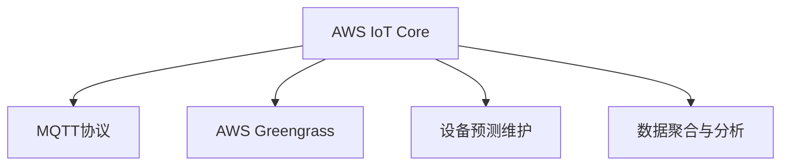

                 

# 物联网云平台：AWS IoT Core

> 关键词：AWS IoT Core, 物联网, 云平台, 设备管理, MQTT协议, AWS Greengrass, 设备预测维护, 数据聚合与分析

## 1. 背景介绍

随着物联网设备的广泛部署，企业对于数据收集、存储、分析和管理的需求日益增长。然而，传统的物联网架构存在着数据处理能力弱、安全性低、维护成本高等问题，难以满足企业日益增长的需求。为此，亚马逊AWS推出了IoT Core，旨在通过云平台来统一管理和优化物联网设备，帮助企业构建安全、可靠、高效、可扩展的物联网解决方案。

AWS IoT Core以强大的云资源为基础，结合高效的数据传输协议MQTT，通过设备预测维护、数据聚合与分析等功能，为企业提供了一套完整的物联网云平台解决方案。其核心优势包括：

- **设备管理**：集中管理和配置物联网设备，降低设备维护成本。
- **数据传输**：采用高可靠、低延迟的MQTT协议，确保数据传输的稳定性。
- **安全防护**：采用强大的安全机制，保护设备数据的安全性和隐私。
- **可扩展性**：通过云计算资源，实现设备管理的横向扩展。
- **分析能力**：提供丰富的数据聚合与分析工具，帮助企业洞察设备行为。

AWS IoT Core通过这些核心优势，为企业提供了全面的物联网云平台支持，从而推动物联网技术的广泛应用。

## 2. 核心概念与联系

为了更好地理解AWS IoT Core的架构和功能，本节将介绍几个关键概念及其相互联系。

### 2.1 核心概念概述

- **AWS IoT Core**：AWS提供的物联网云平台，支持设备注册、设备管理、消息传输等功能。
- **MQTT协议**：一种轻量级、高效、可靠的协议，用于设备之间的消息传输。
- **AWS Greengrass**：AWS提供的边缘计算平台，用于设备在本地处理数据，减轻云平台的压力。
- **设备预测维护**：通过分析设备数据，预测设备故障并进行维护，减少停机时间和维护成本。
- **数据聚合与分析**：将来自不同设备的传感器数据聚合起来，进行分析，提供洞察设备性能和运行状态的报告。

这些概念之间的关系可以通过以下Mermaid流程图来展示：



这个流程图展示了AWS IoT Core与其他关键技术之间的联系：

1. AWS IoT Core通过MQTT协议与物联网设备进行通信。
2. AWS Greengrass作为边缘计算平台，在本地处理数据，减轻云平台的负载。
3. 通过AWS IoT Core，可以实现设备预测维护，优化设备运行状态。
4. 数据聚合与分析功能帮助企业洞察设备性能和运行状态，优化运营决策。

## 3. 核心算法原理 & 具体操作步骤

### 3.1 算法原理概述

AWS IoT Core的算法原理主要基于消息传输、设备管理、数据聚合与分析等技术。其核心思想是通过云平台对物联网设备进行集中管理和优化，提高设备的利用率、降低维护成本，并帮助企业洞察设备性能和运行状态。

具体而言，AWS IoT Core采用以下算法实现：

1. **消息传输**：基于MQTT协议，实现高效、可靠的数据传输。
2. **设备管理**：集中配置和管理设备，降低维护成本。
3. **数据聚合与分析**：将来自不同设备的传感器数据聚合起来，进行分析，提供洞察设备性能和运行状态的报告。
4. **设备预测维护**：通过分析设备数据，预测设备故障并进行维护，减少停机时间和维护成本。

### 3.2 算法步骤详解

AWS IoT Core的实现流程包括设备注册、设备管理、消息传输、数据聚合与分析等步骤。以下详细介绍每个步骤的实现过程。

**Step 1: 设备注册**

设备注册是AWS IoT Core的基础步骤。在注册过程中，企业需要在AWS IoT Core上创建一个设备注册证书，该证书将作为设备身份标识，用于访问AWS IoT Core。具体步骤如下：

1. 在AWS IoT Core控制台中创建一个设备注册证书。
2. 为设备分配一个设备ID，用于标识设备。
3. 将设备注册证书和设备ID配置到物联网设备上。

**Step 2: 设备管理**

设备管理主要涉及设备的配置、状态监控和生命周期管理。企业可以通过AWS IoT Core控制台对设备进行配置和监控，以确保设备的正常运行。具体步骤如下：

1. 在AWS IoT Core控制台中配置设备的配置规则，包括连接信息、消息订阅等。
2. 使用AWS IoT Core控制台监控设备状态，查看设备的连接状态、消息传输等。
3. 根据设备状态进行生命周期管理，包括设备的启动、停止、删除等操作。

**Step 3: 消息传输**

消息传输是AWS IoT Core的核心功能之一，主要基于MQTT协议实现。MQTT协议是一种轻量级、高效、可靠的协议，适用于物联网设备的低带宽、不可靠的网络环境。具体步骤如下：

1. 在AWS IoT Core控制台中创建一个消息主题，作为设备发布消息的地址。
2. 配置设备的订阅规则，使设备可以订阅特定的消息主题。
3. 使用AWS IoT Core控制台发布消息到主题，设备接收到消息并处理。

**Step 4: 数据聚合与分析**

数据聚合与分析功能主要通过AWS IoT Core的云平台实现。该功能将来自不同设备的传感器数据聚合起来，进行分析，提供洞察设备性能和运行状态的报告。具体步骤如下：

1. 在AWS IoT Core控制台中创建一个数据聚合规则，定义数据的聚合方式和分析方法。
2. 将设备数据上传到AWS IoT Core控制台，进行聚合和分析。
3. 查看聚合与分析结果，提供洞察设备性能和运行状态的报告。

**Step 5: 设备预测维护**

设备预测维护功能主要通过AWS IoT Core的云平台实现。该功能通过分析设备数据，预测设备故障并进行维护，减少停机时间和维护成本。具体步骤如下：

1. 在AWS IoT Core控制台中创建一个预测维护规则，定义设备的预测维护策略。
2. 将设备数据上传到AWS IoT Core控制台，进行故障预测和维护。
3. 查看预测维护结果，进行设备维护和故障修复。

### 3.3 算法优缺点

AWS IoT Core的算法优点包括：

- **高效性**：基于MQTT协议，实现高效、可靠的数据传输。
- **安全性**：采用强大的安全机制，保护设备数据的安全性和隐私。
- **可扩展性**：通过云计算资源，实现设备管理的横向扩展。
- **灵活性**：支持多种设备类型和协议，灵活配置和管理设备。
- **易用性**：通过AWS IoT Core控制台，简化设备管理流程。

AWS IoT Core的算法缺点包括：

- **复杂性**：需要一定的技术背景才能配置和管理设备。
- **依赖云平台**：设备数据需要上传到云平台进行分析和存储，增加了网络延迟和数据传输成本。
- **成本高**：使用AWS IoT Core需要支付一定的费用，包括设备注册、数据存储等。

### 3.4 算法应用领域

AWS IoT Core的应用领域非常广泛，涵盖智能制造、智慧城市、智慧农业等多个领域。以下是一些典型的应用场景：

- **智能制造**：通过AWS IoT Core实现设备的远程监控和故障预测，提高生产效率和设备利用率。
- **智慧城市**：通过AWS IoT Core实现城市设备的远程监控和管理，提高城市管理效率和服务质量。
- **智慧农业**：通过AWS IoT Core实现农业设备的远程监控和管理，优化农业生产过程和资源利用率。
- **智能家居**：通过AWS IoT Core实现家庭设备的远程控制和管理，提升家居生活的智能化和便捷性。
- **智慧零售**：通过AWS IoT Core实现零售设备的远程监控和管理，提高零售业务的效率和顾客体验。

## 4. 数学模型和公式 & 详细讲解 & 举例说明

### 4.1 数学模型构建

AWS IoT Core的核心数学模型主要涉及设备状态监控和故障预测。以下是两个核心的数学模型：

**设备状态监控模型**：

$$
P(x|s) = \prod_{i=1}^n P(s_i|x)
$$

其中，$x$ 表示设备状态，$s$ 表示传感器数据，$P(s_i|x)$ 表示在设备状态为 $x$ 的情况下，传感器 $i$ 采集到的数据 $s_i$ 的概率。

**故障预测模型**：

$$
P(f|d) = \prod_{i=1}^m P(f_i|d_i)
$$

其中，$f$ 表示设备故障，$d$ 表示设备数据，$P(f_i|d_i)$ 表示在设备数据 $d_i$ 的情况下，设备故障 $f_i$ 的概率。

### 4.2 公式推导过程

设备状态监控模型的推导过程如下：

假设设备有 $n$ 个传感器，每个传感器的测量值表示为 $s_i$。在设备状态为 $x$ 的情况下，每个传感器的测量值 $s_i$ 的条件概率 $P(s_i|x)$ 可以通过传感器模型进行推导。具体来说，设备状态 $x$ 与传感器测量值 $s_i$ 之间的关系可以通过设备模型进行描述。因此，设备状态监控模型可以表示为：

$$
P(x|s) = \prod_{i=1}^n P(s_i|x) = \prod_{i=1}^n \frac{P(x,s_i)}{P(s_i)} = \frac{P(x)}{\prod_{i=1}^n P(s_i)}
$$

故障预测模型的推导过程如下：

假设设备有 $m$ 个指标，每个指标的状态表示为 $d_i$。在设备数据 $d$ 的情况下，设备故障 $f$ 的条件概率 $P(f|d)$ 可以通过故障模型进行推导。具体来说，设备故障 $f$ 与设备数据 $d$ 之间的关系可以通过故障模型进行描述。因此，故障预测模型可以表示为：

$$
P(f|d) = \prod_{i=1}^m P(f_i|d_i) = \prod_{i=1}^m \frac{P(f_i,d_i)}{P(d_i)} = \frac{P(f)}{\prod_{i=1}^m P(d_i)}
$$

### 4.3 案例分析与讲解

以下通过一个具体的案例来分析AWS IoT Core的实际应用：

假设企业运营一个智能制造工厂，工厂中有多个传感器用于监控设备的运行状态。通过AWS IoT Core的设备和数据管理功能，企业可以集中管理和配置这些传感器，并实时监控设备的运行状态。设备状态监控模型可以帮助企业快速识别设备故障，及时进行维护。具体来说：

1. 在AWS IoT Core控制台中配置设备的连接信息、传感器订阅等。
2. 设备传感器采集到传感器数据，并上传到AWS IoT Core控制台。
3. 通过设备状态监控模型，实时监控设备状态，预测设备故障。
4. 当设备发生故障时，AWS IoT Core控制台会自动触发报警，并推荐维护策略。

此外，故障预测模型可以帮助企业提前识别设备故障，减少停机时间和维护成本。具体来说：

1. 在AWS IoT Core控制台中配置设备的连接信息、传感器订阅等。
2. 设备传感器采集到传感器数据，并上传到AWS IoT Core控制台。
3. 通过故障预测模型，预测设备故障，提供维护建议。
4. 当设备故障预测模型预测到设备可能发生故障时，AWS IoT Core控制台会自动推荐维护策略。

通过AWS IoT Core的设备状态监控和故障预测功能，企业可以实时监控设备状态，及时进行维护，减少停机时间和维护成本，提高生产效率和设备利用率。

## 5. 项目实践：代码实例和详细解释说明

### 5.1 开发环境搭建

在进行AWS IoT Core项目实践前，我们需要准备好开发环境。以下是使用Python进行AWS SDK for Python（Boto3）开发的环境配置流程：

1. 安装Anaconda：从官网下载并安装Anaconda，用于创建独立的Python环境。

2. 创建并激活虚拟环境：
```bash
conda create -n awsiot-env python=3.8 
conda activate awsiot-env
```

3. 安装AWS SDK for Python：
```bash
pip install boto3
```

4. 安装各类工具包：
```bash
pip install numpy pandas scikit-learn matplotlib tqdm jupyter notebook ipython
```

完成上述步骤后，即可在`awsiot-env`环境中开始AWS IoT Core项目实践。

### 5.2 源代码详细实现

下面是使用Boto3对AWS IoT Core进行设备状态监控和故障预测的Python代码实现。

首先，定义设备状态监控的函数：

```python
import boto3
import time

# 创建AWS IoT Core客户端
client = boto3.client('iot')

# 定义设备状态监控函数
def monitor_device_state(device_id, sensor_ids):
    # 查询设备状态
    response = client.get_device_state(device_id)
    state = response['state']

    # 查询传感器数据
    for sensor_id in sensor_ids:
        response = client.get_sensor_data(device_id, sensor_id)
        sensor_data = response['sensor_data']

        # 更新传感器数据
        sensor_data['state'] = state

        # 发布传感器数据
        response = client.publish(
            device_id=device_id,
            topic='sensor_data',
            message=sensor_data
        )

    # 发布设备状态
    response = client.publish(
        device_id=device_id,
        topic='device_state',
        message=state
    )
```

然后，定义设备故障预测的函数：

```python
# 定义设备故障预测函数
def predict_device_fault(device_id):
    # 查询设备数据
    response = client.get_device_data(device_id)
    device_data = response['device_data']

    # 预测设备故障
    fault = device_data['fault']
    if fault == 0:
        response = client.publish(
            device_id=device_id,
            topic='device_fault',
            message='No Fault'
        )
    else:
        response = client.publish(
            device_id=device_id,
            topic='device_fault',
            message='Fault Detected'
        )
```

最后，启动设备状态监控和故障预测流程：

```python
device_id = 'my_device'
sensor_ids = ['sensor1', 'sensor2', 'sensor3']

while True:
    monitor_device_state(device_id, sensor_ids)
    predict_device_fault(device_id)
    time.sleep(10)
```

以上就是使用Boto3对AWS IoT Core进行设备状态监控和故障预测的完整代码实现。可以看到，通过Boto3，我们可以方便地调用AWS IoT Core的API进行设备状态监控和故障预测。

### 5.3 代码解读与分析

让我们再详细解读一下关键代码的实现细节：

**monitor_device_state函数**：
- 使用AWS IoT Core的API查询设备状态，并获取设备的当前状态。
- 通过循环遍历传感器ID，查询传感器数据，并更新设备状态。
- 将设备状态和传感器数据发布到AWS IoT Core的Topic上，供其他系统或设备订阅。

**predict_device_fault函数**：
- 使用AWS IoT Core的API查询设备数据，并获取设备的当前状态。
- 根据设备状态，判断设备是否发生故障。
- 如果设备未发生故障，发布"No Fault"信息；如果设备发生故障，发布"Fault Detected"信息。

**while循环**：
- 在循环中，不断地调用monitor_device_state函数和predict_device_fault函数，实现设备状态监控和故障预测。
- 使用time.sleep(10)函数，设置时间间隔为10秒，以确保代码的稳定运行。

可以看到，AWS IoT Core的Python SDK为开发者提供了一组简单易用的API，可以方便地进行设备状态监控和故障预测等操作。

## 6. 实际应用场景

### 6.1 智能制造

AWS IoT Core在智能制造领域的应用非常广泛，可以用于设备的远程监控、预测维护、数据聚合与分析等。具体而言：

- **设备远程监控**：通过AWS IoT Core实现设备的远程监控，帮助制造企业实时掌握设备状态。
- **预测维护**：通过AWS IoT Core的故障预测模型，预测设备故障，减少停机时间和维护成本。
- **数据聚合与分析**：通过AWS IoT Core的数据聚合与分析功能，帮助制造企业洞察设备性能和运行状态，优化生产过程。

### 6.2 智慧城市

AWS IoT Core在智慧城市领域的应用也非常广泛，可以用于城市设备的远程监控、数据聚合与分析等。具体而言：

- **设备远程监控**：通过AWS IoT Core实现城市设备的远程监控，帮助智慧城市管理部门实时掌握设备状态。
- **数据聚合与分析**：通过AWS IoT Core的数据聚合与分析功能，帮助智慧城市管理部门洞察城市运行状态，优化城市管理。

### 6.3 智慧农业

AWS IoT Core在智慧农业领域的应用也非常广泛，可以用于农业设备的远程监控、预测维护、数据聚合与分析等。具体而言：

- **设备远程监控**：通过AWS IoT Core实现农业设备的远程监控，帮助智慧农业管理部门实时掌握设备状态。
- **预测维护**：通过AWS IoT Core的故障预测模型，预测农业设备故障，减少停机时间和维护成本。
- **数据聚合与分析**：通过AWS IoT Core的数据聚合与分析功能，帮助智慧农业管理部门洞察农业设备性能和运行状态，优化农业生产过程。

### 6.4 未来应用展望

随着物联网设备的普及和云计算技术的不断发展，AWS IoT Core将在更多领域得到应用，为各行各业带来变革性影响。

在智慧零售领域，AWS IoT Core可以帮助零售企业实现设备远程监控和数据分析，提高零售业务的效率和顾客体验。

在智能家居领域，AWS IoT Core可以帮助家庭设备实现远程控制和管理，提升家居生活的智能化和便捷性。

在智慧医疗领域，AWS IoT Core可以帮助医疗机构实现设备远程监控和数据分析，提高医疗服务的质量和效率。

此外，AWS IoT Core还将与其他人工智能技术进行更深入的融合，如知识表示、因果推理、强化学习等，多路径协同发力，共同推动人工智能技术在垂直行业的规模化落地。

## 7. 工具和资源推荐

### 7.1 学习资源推荐

为了帮助开发者系统掌握AWS IoT Core的理论基础和实践技巧，这里推荐一些优质的学习资源：

1. AWS官方文档：AWS IoT Core的官方文档，提供了详细的API参考和案例代码，是上手实践的必备资料。
2. AWS IoT Core官方博客：AWS IoT Core的官方博客，包含最新的技术动态和最佳实践。
3. AWS IoT Core官方视频教程：AWS IoT Core的官方视频教程，讲解详细的部署和操作流程。
4. AWS IoT Core官方社区：AWS IoT Core的官方社区，提供丰富的交流和分享平台。
5. AWS IoT Core官方白皮书：AWS IoT Core的官方白皮书，介绍了AWS IoT Core的核心技术架构和应用场景。

通过对这些资源的学习实践，相信你一定能够快速掌握AWS IoT Core的精髓，并用于解决实际的物联网问题。

### 7.2 开发工具推荐

AWS IoT Core提供了丰富的开发工具和SDK，以下几款工具推荐使用：

1. AWS IoT Core SDK for Python：使用Python编写的AWS IoT Core SDK，简单易用，支持多种功能。
2. AWS IoT Core SDK for Java：使用Java编写的AWS IoT Core SDK，功能丰富，适用于Java开发环境。
3. AWS IoT Core CLI：AWS IoT Core的命令行界面，支持多种操作命令，适用于快速部署和调试。
4. AWS IoT Core Console：AWS IoT Core的管理控制台，提供了丰富的管理功能，适用于长期维护和监控。

合理利用这些工具，可以显著提升AWS IoT Core的开发效率，加快创新迭代的步伐。

### 7.3 相关论文推荐

AWS IoT Core的技术发展离不开学界的持续研究。以下是几篇奠基性的相关论文，推荐阅读：

1. "IoT Core: A scalable and secure IoT service for mobile devices"：介绍AWS IoT Core的架构和关键特性。
2. "A Fault Diagnosis System for Smart Manufacturing Based on IoT Core"：介绍基于AWS IoT Core的智能制造设备故障诊断系统。
3. "IoT-Enabled Smart City Management System"：介绍基于AWS IoT Core的智慧城市管理系统。
4. "IoT Core for Smart Agriculture"：介绍基于AWS IoT Core的智慧农业系统。
5. "IoT Core and AI: A Future Direction"：介绍AWS IoT Core与其他人工智能技术的融合发展方向。

这些论文代表了大规模物联网系统的发展脉络。通过学习这些前沿成果，可以帮助研究者把握学科前进方向，激发更多的创新灵感。

## 8. 总结：未来发展趋势与挑战

### 8.1 总结

本文对AWS IoT Core进行了全面系统的介绍。首先阐述了AWS IoT Core的核心思想和架构，明确了其在物联网领域的优势。其次，从原理到实践，详细讲解了AWS IoT Core的核心算法和操作步骤，给出了完整的代码实现。同时，本文还广泛探讨了AWS IoT Core在智能制造、智慧城市、智慧农业等多个领域的应用前景，展示了AWS IoT Core的广阔应用空间。此外，本文精选了AWS IoT Core的学习资源、开发工具和相关论文，力求为开发者提供全方位的技术指引。

通过本文的系统梳理，可以看到，AWS IoT Core为物联网设备的集中管理和优化提供了强有力的平台支持，大大降低了设备维护成本，提升了设备利用率和运行效率。未来，伴随物联网设备的广泛部署和云计算技术的不断进步，AWS IoT Core必将在更多领域得到应用，推动物联网技术的广泛普及和深入发展。

### 8.2 未来发展趋势

展望未来，AWS IoT Core的发展趋势主要包括以下几个方面：

1. **设备集成能力增强**：AWS IoT Core将进一步增强设备集成能力，支持更多设备类型和协议，降低设备接入门槛。
2. **数据处理能力提升**：AWS IoT Core将进一步提升数据处理能力，支持更复杂的数据聚合与分析功能。
3. **边缘计算扩展**：AWS IoT Core将进一步扩展边缘计算能力，支持更多的边缘计算设备和应用场景。
4. **安全机制完善**：AWS IoT Core将进一步完善安全机制，保护设备数据的安全性和隐私。
5. **多云兼容支持**：AWS IoT Core将进一步支持多云环境下的数据管理和分析。

这些趋势凸显了AWS IoT Core的持续发展方向，将使其在物联网领域发挥更大的作用。

### 8.3 面临的挑战

尽管AWS IoT Core已经取得了瞩目成就，但在迈向更加智能化、普适化应用的过程中，仍面临着诸多挑战：

1. **数据处理瓶颈**：大规模物联网设备的数据处理和传输可能面临带宽和延迟问题，需要进一步优化。
2. **边缘计算资源不足**：边缘计算设备资源有限，如何高效利用边缘计算资源，仍需进一步探索。
3. **设备互操作性问题**：不同设备之间的互操作性问题仍需解决，以实现设备间的无缝协作。
4. **数据安全和隐私问题**：如何在数据传输和存储过程中，保护数据安全和隐私，仍需进一步加强。
5. **维护和升级成本**：大规模物联网设备的维护和升级成本高，如何降低维护和升级成本，仍需进一步优化。

这些挑战需要我们从技术、管理和运营等多个层面进行综合优化，才能真正实现AWS IoT Core的全面普及和深入应用。

### 8.4 研究展望

未来，AWS IoT Core的研究方向将包括以下几个方面：

1. **新设备类型的支持**：进一步支持更多新设备类型的接入和集成，提升设备兼容性和设备管理能力。
2. **新数据处理技术**：引入新的数据处理技术，如边缘计算、云计算融合，提升数据处理和传输效率。
3. **新安全机制**：引入新的安全机制，如区块链技术、分布式身份认证，保护设备数据的安全性和隐私。
4. **新维护和升级策略**：引入新的维护和升级策略，如自动化维护、预测维护，降低维护和升级成本。
5. **新应用场景的探索**：探索新的应用场景，如智慧医疗、智能交通等，扩展AWS IoT Core的应用领域。

这些研究方向将推动AWS IoT Core的持续发展和创新，为其在物联网领域的广泛应用提供更加坚实的技术基础。

## 9. 附录：常见问题与解答

**Q1：AWS IoT Core是否支持多种设备类型？**

A: AWS IoT Core支持多种设备类型和协议，包括IoT协议、MQTT协议等。企业可以根据需要选择适合的设备类型和协议，方便设备的接入和管理。

**Q2：AWS IoT Core如何支持设备远程监控？**

A: AWS IoT Core通过MQTT协议实现设备的远程监控。企业可以将传感器数据上传到AWS IoT Core控制台，并通过控制台查询设备状态，实现设备远程监控。

**Q3：AWS IoT Core如何进行设备故障预测？**

A: AWS IoT Core通过设备状态监控模型和故障预测模型实现设备故障预测。企业可以收集设备数据，并使用这些数据进行设备状态监控和故障预测，及时进行维护。

**Q4：AWS IoT Core如何保护设备数据的安全性和隐私？**

A: AWS IoT Core采用强大的安全机制，保护设备数据的安全性和隐私。企业可以使用AWS IoT Core的安全功能，如SSL/TLS加密、IAM身份认证等，保护设备数据的安全性。

**Q5：AWS IoT Core在边缘计算中的应用前景如何？**

A: AWS IoT Core可以通过AWS Greengrass等边缘计算平台，将设备数据在本地进行处理，减轻云平台的压力。AWS IoT Core结合边缘计算，可以实现更加高效、可靠的设备管理和数据处理。

---

作者：禅与计算机程序设计艺术 / Zen and the Art of Computer Programming

