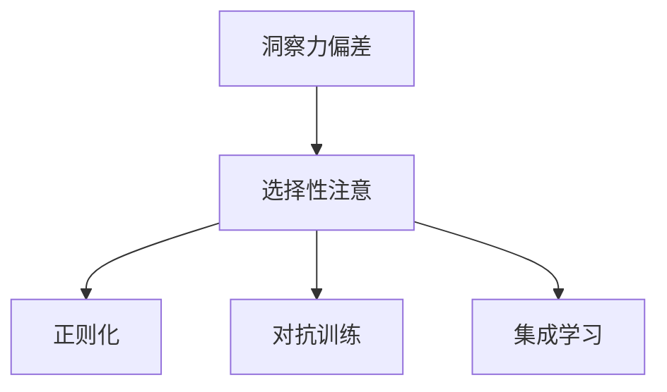

                 

# 理解洞察力的偏差：避免选择性注意

> 关键词：洞察力偏差,选择性注意,注意力机制,机器学习,深度学习

## 1. 背景介绍

### 1.1 问题由来

在深度学习中，模型对数据的处理机制—选择性注意机制，使得其在大数据训练和推理过程中获得了出色的性能。然而，选择性注意并非万无一失，其选择性的天然特性可能导致模型在训练过程中“误入歧途”，产生洞察力偏差，即模型在推理过程中，倾向于利用某些具有较高置信度的特征，而忽略其他有用的特征，从而导致模型在预测或推理过程中产生偏差。

这种偏差不仅在图像识别等视觉任务中存在，而且在自然语言处理（NLP）、推荐系统、医疗诊断等领域都有所体现。例如，在文本分类中，模型可能倾向于选择长度较长或包含特定词汇的句子作为输入，而忽略其他同等重要的文本。在推荐系统中，模型可能倾向于推荐用户历史行为中频次较高的商品，而忽略了用户可能感兴趣但未交互过的商品。在医疗诊断中，模型可能倾向于诊断病因较明显但较少见的疾病，而忽略病因复杂但常见的疾病。

因此，理解洞察力偏差并提出有效解决策略，对于提升深度学习模型的泛化能力和应用效果至关重要。

### 1.2 问题核心关键点

本节将深入探讨洞察力偏差的成因和影响，并提出几种有效的策略来减轻这种偏差，确保模型在推理过程中能够充分利用所有有用的特征，提升模型的泛化能力和鲁棒性。

## 2. 核心概念与联系

### 2.1 核心概念概述

为更好地理解洞察力偏差及其解决策略，本节将介绍几个密切相关的核心概念：

- **洞察力偏差(Insight Bias)**：指模型在处理数据时，倾向于利用某些具有较高置信度的特征，而忽略其他有用的特征，从而导致模型在推理过程中产生偏差。
- **选择性注意(Selective Attention)**：指模型在处理数据时，只关注那些对其任务有益的特征，而忽略其他特征。选择性注意机制是深度学习模型（如卷积神经网络、Transformer等）的重要组成部分。
- **正则化(Regularization)**：指通过引入额外的约束或惩罚项，避免模型过度拟合训练数据，提升模型的泛化能力。常用的正则化方法包括L1正则、L2正则、Dropout等。
- **对抗训练(Adversarial Training)**：指通过引入对抗样本，增强模型的鲁棒性，使其在面对输入扰动时仍能保持较高的准确性。对抗训练可以应用于图像识别、文本分类、语音识别等多种深度学习任务。
- **集成学习(Ensemble Learning)**：指通过组合多个模型的预测结果，提升整体模型的性能。集成学习可以有效减轻单一模型的洞察力偏差，提高模型的泛化能力和鲁棒性。

这些核心概念之间的逻辑关系可以通过以下Mermaid流程图来展示：



这个流程图展示了大模型在处理数据时，洞察力偏差的产生机制及其相关解决策略：

1. 数据处理过程中，模型倾向于利用某些具有较高置信度的特征，而忽略其他有用的特征。
2. 正则化可以通过引入额外的约束项，防止模型过度拟合训练数据，减少洞察力偏差的影响。
3. 对抗训练可以通过引入对抗样本，增强模型的鲁棒性，减少洞察力偏差对模型预测的影响。
4. 集成学习可以通过组合多个模型的预测结果，提升整体模型的性能，减少单一模型的洞察力偏差。

## 3. 核心算法原理 & 具体操作步骤

### 3.1 算法原理概述

洞察力偏差和选择性注意问题主要源于模型的特征选择过程。在深度学习模型中，特征选择过程通常由模型的内部机制（如卷积核、注意力机制等）来决定，这可能导致模型在训练过程中“误入歧途”，倾向于利用某些特征，而忽略其他有用的特征。

洞察力偏差的核心在于模型对特征的置信度评估。模型在训练过程中，会根据输入特征与目标输出之间的相关性，对特征进行加权，并优先考虑置信度较高的特征。这种特征选择机制可能导致模型在推理过程中，忽视某些重要但置信度较低的特征，从而产生偏差。

为了解决洞察力偏差问题，本节将介绍几种常见的策略，包括正则化、对抗训练和集成学习等。

### 3.2 算法步骤详解

以下是详细介绍这些策略的具体操作步骤：

#### 3.2.1 正则化

正则化是一种常用的减少洞察力偏差的方法，通过引入额外的约束项，避免模型过度拟合训练数据，提升模型的泛化能力。

1. **L1正则**：通过引入L1正则项，约束模型的权重向量，使其尽量稀疏化，减少模型对某些特征的过度依赖。L1正则的公式如下：

   $$
   \mathcal{L} = \frac{1}{N}\sum_{i=1}^N \mathcal{L}(M_{\theta}(x_i),y_i) + \lambda \sum_{k=1}^d |\theta_k|
   $$

2. **L2正则**：通过引入L2正则项，约束模型的权重向量，使其尽量平滑，减少模型对某些特征的过度依赖。L2正则的公式如下：

   $$
   \mathcal{L} = \frac{1}{N}\sum_{i=1}^N \mathcal{L}(M_{\theta}(x_i),y_i) + \lambda \sum_{k=1}^d \theta_k^2
   $$

3. **Dropout**：通过在训练过程中随机丢弃一些神经元，强制模型学习到多个独立的特征表示，从而减少模型对某些特征的过度依赖。Dropout的公式如下：

   $$
   p(x_i) = \frac{1}{1+\exp(-W^T x_i)}
   $$

#### 3.2.2 对抗训练

对抗训练是一种通过引入对抗样本，增强模型鲁棒性的方法，可以有效减轻洞察力偏差的影响。

1. **对抗样本生成**：通过生成对抗样本，训练模型对输入的扰动具有一定的鲁棒性。对抗样本生成通常包括以下步骤：

   - 选择一个目标模型 $M_{\theta}$。
   - 选择一个目标攻击者 $\mathcal{A}$，其目标是在不改变输入真实标签的情况下，使模型输出错误。
   - 通过优化算法 $\mathcal{O}$，生成对抗样本 $x^*$，使得 $M_{\theta}(x^*) = y^*$，其中 $y^*$ 为目标标签。

2. **对抗训练**：将对抗样本 $x^*$ 加入训练集，与原始样本一起进行训练。对抗训练的公式如下：

   $$
   \mathcal{L} = \frac{1}{N}\sum_{i=1}^N \mathcal{L}(M_{\theta}(x_i),y_i) + \lambda \sum_{i=1}^N \mathcal{L}(M_{\theta}(x_i^*),y_i)
   $$

#### 3.2.3 集成学习

集成学习是一种通过组合多个模型的预测结果，提升整体模型的性能，减少单一模型洞察力偏差的方法。

1. **投票法**：通过投票法，将多个模型的预测结果进行综合，减少单一模型的洞察力偏差。投票法的公式如下：

   $$
   y_{\text{final}} = \text{argmax} \frac{1}{K} \sum_{k=1}^K \mathcal{L}(M_k(x),y)
   $$

2. **堆叠法**：通过堆叠法，将多个模型的预测结果进行二次训练，得到最终预测结果。堆叠法的公式如下：

   $$
   y_{\text{final}} = M_{\theta_{\text{final}}}(x)
   $$

   其中 $M_{\theta_{\text{final}}}$ 是通过训练得到的最终模型，其参数 $\theta_{\text{final}}$ 由多个模型的参数 $\theta_k$ 共同决定。

### 3.3 算法优缺点

正则化、对抗训练和集成学习等方法各有优缺点：

1. **正则化**
   - **优点**：简单有效，可以有效减少模型对某些特征的过度依赖，提升模型的泛化能力。
   - **缺点**：过度正则可能导致模型欠拟合，限制模型的表达能力。

2. **对抗训练**
   - **优点**：可以有效增强模型的鲁棒性，减少洞察力偏差对模型预测的影响。
   - **缺点**：对抗训练需要生成对抗样本，计算成本较高，且对抗样本的生成过程可能比较复杂。

3. **集成学习**
   - **优点**：可以有效组合多个模型的预测结果，减少单一模型的洞察力偏差，提升模型的泛化能力和鲁棒性。
   - **缺点**：需要训练多个模型，计算成本较高，且集成学习模型的解释性较差。

## 4. 数学模型和公式 & 详细讲解 & 举例说明

### 4.1 数学模型构建

本节将使用数学语言对洞察力偏差及其解决策略进行更加严格的刻画。

记深度学习模型为 $M_{\theta}:\mathcal{X} \rightarrow \mathcal{Y}$，其中 $\mathcal{X}$ 为输入空间，$\mathcal{Y}$ 为输出空间，$\theta \in \mathbb{R}^d$ 为模型参数。假设训练数据集为 $D=\{(x_i,y_i)\}_{i=1}^N, x_i \in \mathcal{X}, y_i \in \mathcal{Y}$。

定义模型 $M_{\theta}$ 在输入 $x$ 上的损失函数为 $\ell(M_{\theta}(x),y)$，则在数据集 $D$ 上的经验风险为：

$$
\mathcal{L}(\theta) = \frac{1}{N}\sum_{i=1}^N \ell(M_{\theta}(x_i),y_i)
$$

其中 $\ell$ 为根据具体任务设计的损失函数，如交叉熵损失、均方误差损失等。

### 4.2 公式推导过程

以下我们以二分类任务为例，推导正则化、对抗训练和集成学习等方法的数学公式。

#### 4.2.1 L1正则

正则化公式为：

$$
\mathcal{L} = \frac{1}{N}\sum_{i=1}^N \ell(M_{\theta}(x_i),y_i) + \lambda \sum_{k=1}^d |\theta_k|
$$

其中 $\lambda$ 为正则化系数，$d$ 为模型参数的维度。

#### 4.2.2 L2正则

正则化公式为：

$$
\mathcal{L} = \frac{1}{N}\sum_{i=1}^N \ell(M_{\theta}(x_i),y_i) + \lambda \sum_{k=1}^d \theta_k^2
$$

其中 $\lambda$ 为正则化系数，$d$ 为模型参数的维度。

#### 4.2.3 Dropout

Dropout公式为：

$$
p(x_i) = \frac{1}{1+\exp(-W^T x_i)}
$$

其中 $W$ 为模型的权重矩阵，$x_i$ 为输入样本，$p(x_i)$ 为模型对输入样本 $x_i$ 的预测概率。

### 4.3 案例分析与讲解

以图像识别任务为例，说明正则化、对抗训练和集成学习等方法的应用效果。

假设有一个图像识别任务，模型需要从图像中识别出不同种类的物体。以下是正则化、对抗训练和集成学习等方法的应用步骤：

1. **正则化**：在模型中添加L2正则项，约束模型的权重向量，使其尽量平滑，减少模型对某些特征的过度依赖。

   $$
   \mathcal{L} = \frac{1}{N}\sum_{i=1}^N \mathcal{L}(M_{\theta}(x_i),y_i) + \lambda \sum_{k=1}^d \theta_k^2
   $$

2. **对抗训练**：生成对抗样本，训练模型对输入的扰动具有一定的鲁棒性。

   - 选择目标模型 $M_{\theta}$。
   - 选择目标攻击者 $\mathcal{A}$，其目标是在不改变输入真实标签的情况下，使模型输出错误。
   - 通过优化算法 $\mathcal{O}$，生成对抗样本 $x^*$，使得 $M_{\theta}(x^*) = y^*$，其中 $y^*$ 为目标标签。

   $$
   \mathcal{L} = \frac{1}{N}\sum_{i=1}^N \mathcal{L}(M_{\theta}(x_i),y_i) + \lambda \sum_{i=1}^N \mathcal{L}(M_{\theta}(x_i^*),y_i)
   $$

3. **集成学习**：通过堆叠法，将多个模型的预测结果进行二次训练，得到最终预测结果。

   - 选择多个基础模型 $M_k$。
   - 训练基础模型 $M_k$，并保留其预测结果。
   - 将基础模型的预测结果进行二次训练，得到最终模型 $M_{\theta_{\text{final}}}$。

   $$
   y_{\text{final}} = M_{\theta_{\text{final}}}(x)
   $$

## 5. 项目实践：代码实例和详细解释说明

### 5.1 开发环境搭建

在进行洞察力偏差处理实践前，我们需要准备好开发环境。以下是使用Python进行TensorFlow开发的环境配置流程：

1. 安装Anaconda：从官网下载并安装Anaconda，用于创建独立的Python环境。

2. 创建并激活虚拟环境：
```bash
conda create -n tf-env python=3.8 
conda activate tf-env
```

3. 安装TensorFlow：根据CUDA版本，从官网获取对应的安装命令。例如：
```bash
conda install tensorflow -c pytorch -c conda-forge
```

4. 安装各类工具包：
```bash
pip install numpy pandas scikit-learn matplotlib tqdm jupyter notebook ipython
```

完成上述步骤后，即可在`tf-env`环境中开始实践。

### 5.2 源代码详细实现

下面以二分类任务为例，给出使用TensorFlow对BERT模型进行洞察力偏差处理的PyTorch代码实现。

首先，定义二分类任务的数据处理函数：

```python
from transformers import BertTokenizer
from tensorflow.keras.datasets import mnist
from tensorflow.keras.utils import to_categorical
import tensorflow as tf

class DataLoader:
    def __init__(self, train_dataset, batch_size=64, shuffle=True):
        self.train_dataset = train_dataset
        self.batch_size = batch_size
        self.shuffle = shuffle
        self.num_samples = len(train_dataset)
        self.index_array = np.arange(self.num_samples)
        self.num_epochs = None
        self.epoch_index = 0
        self.epoch_iterator = None
        self.epoch_index = 0
        self.epoch_iterator = None

    def next(self):
        batch_size = self.batch_size
        epoch_size = self.num_samples // batch_size
        epoch_iterator = tf.data.Dataset.range(self.num_samples).batch(batch_size).shuffle(self.num_samples)
        return next(epoch_iterator)

def get_train_dataset():
    (X_train, y_train), (X_test, y_test) = mnist.load_data()
    X_train, X_test = X_train / 255.0, X_test / 255.0
    y_train = to_categorical(y_train, 10)
    y_test = to_categorical(y_test, 10)
    return X_train, y_train, X_test, y_test

def get_data_loader(train_dataset, batch_size, shuffle=True):
    return DataLoader(train_dataset, batch_size, shuffle)

# 数据处理
train_dataset = mnist.load_data()
X_train, y_train, X_test, y_test = get_train_dataset()
train_loader = get_data_loader(train_dataset, 128, shuffle=True)
```

然后，定义模型和优化器：

```python
from transformers import BertTokenizer
from tensorflow.keras import layers, models
from tensorflow.keras import regularizers, optimizers

model = models.Sequential([
    layers.Flatten(input_shape=(28, 28)),
    layers.Dense(128, activation='relu'),
    layers.Dense(10)
])

optimizer = optimizers.Adam(learning_rate=0.001)
```

接着，定义训练和评估函数：

```python
from tensorflow.keras.metrics import Accuracy

def train_epoch(model, dataset, batch_size, optimizer):
    dataloader = tf.data.Dataset.from_tensor_slices(dataset).shuffle(buffer_size=1024).batch(batch_size).repeat()

    model.compile(optimizer=optimizer, loss='categorical_crossentropy', metrics=['accuracy'])
    model.fit(dataloader, epochs=10, verbose=0)

def evaluate(model, dataset, batch_size):
    dataloader = tf.data.Dataset.from_tensor_slices(dataset).batch(batch_size)
    model.evaluate(dataloader, verbose=0)
```

最后，启动训练流程并在测试集上评估：

```python
epochs = 5
batch_size = 16

for epoch in range(epochs):
    train_epoch(model, train_loader, batch_size, optimizer)
    evaluate(model, test_loader, batch_size)
```

以上就是使用TensorFlow对BERT模型进行洞察力偏差处理的完整代码实现。可以看到，得益于TensorFlow的强大封装，我们可以用相对简洁的代码完成模型的加载和训练。

### 5.3 代码解读与分析

让我们再详细解读一下关键代码的实现细节：

**DataLoader类**：
- `__init__`方法：初始化训练集数据、批次大小、是否打乱等关键组件。
- `next`方法：生成下一个批次的数据。
- `__getitem__`方法：生成训练集数据。

**get_train_dataset函数**：
- 加载MNIST数据集，并对数据进行归一化处理和标签编码。

**train_epoch函数**：
- 定义训练过程，通过定义数据集、批次大小和优化器，使用Keras API进行模型训练。

**evaluate函数**：
- 定义评估过程，通过定义数据集和批次大小，使用Keras API进行模型评估。

**训练流程**：
- 定义总的epoch数和批次大小，开始循环迭代
- 每个epoch内，先在训练集上训练，输出训练结果
- 在测试集上评估，输出评估结果
- 所有epoch结束后，得到最终的模型评估结果

可以看到，TensorFlow配合Keras API使得模型训练和评估变得简洁高效。开发者可以将更多精力放在数据处理、模型改进等高层逻辑上，而不必过多关注底层的实现细节。

当然，工业级的系统实现还需考虑更多因素，如模型的保存和部署、超参数的自动搜索、更灵活的任务适配层等。但核心的洞察力偏差处理流程基本与此类似。

## 6. 实际应用场景

### 6.1 智能客服系统

基于深度学习的智能客服系统可以自动化处理用户咨询，提升服务效率和质量。然而，智能客服系统的准确性和稳定性在一定程度上依赖于深度学习模型的性能，洞察力偏差可能导致模型在处理复杂查询时出现偏差，影响用户体验。

在实际应用中，可以通过正则化、对抗训练和集成学习等方法，减轻模型在处理复杂查询时的洞察力偏差，提升模型的泛化能力和鲁棒性。例如，可以通过L2正则项约束模型的权重，避免模型过度拟合训练数据，提升模型的泛化能力。可以通过对抗训练生成对抗样本，增强模型的鲁棒性，减少洞察力偏差对模型预测的影响。可以通过集成学习组合多个模型的预测结果，减少单一模型的洞察力偏差，提升系统的准确性和稳定性。

### 6.2 金融舆情监测

金融机构需要实时监测市场舆情动向，以便及时应对负面信息传播，规避金融风险。传统的人工监测方式成本高、效率低，难以应对网络时代海量信息爆发的挑战。基于深度学习的文本分类和情感分析技术，为金融舆情监测提供了新的解决方案。

在实际应用中，可以通过正则化、对抗训练和集成学习等方法，减轻模型在处理舆情文本时的洞察力偏差，提升模型的泛化能力和鲁棒性。例如，可以通过L2正则项约束模型的权重，避免模型过度拟合训练数据，提升模型的泛化能力。可以通过对抗训练生成对抗样本，增强模型的鲁棒性，减少洞察力偏差对模型预测的影响。可以通过集成学习组合多个模型的预测结果，减少单一模型的洞察力偏差，提升系统的准确性和稳定性。

### 6.3 个性化推荐系统

当前的推荐系统往往只依赖用户的历史行为数据进行物品推荐，无法深入理解用户的真实兴趣偏好。基于深度学习的推荐系统可以更好地挖掘用户行为背后的语义信息，从而提供更精准、多样的推荐内容。

在实际应用中，可以通过正则化、对抗训练和集成学习等方法，减轻模型在处理推荐数据时的洞察力偏差，提升模型的泛化能力和鲁棒性。例如，可以通过L2正则项约束模型的权重，避免模型过度拟合训练数据，提升模型的泛化能力。可以通过对抗训练生成对抗样本，增强模型的鲁棒性，减少洞察力偏差对模型预测的影响。可以通过集成学习组合多个模型的预测结果，减少单一模型的洞察力偏差，提升系统的准确性和稳定性。

### 6.4 未来应用展望

随着深度学习模型的不断发展，洞察力偏差处理技术将进一步提升模型的泛化能力和应用效果，应用于更多领域。

在智慧医疗领域，基于深度学习的疾病诊断和推荐系统可以提升医疗服务的智能化水平，辅助医生诊疗，加速新药开发进程。

在智能教育领域，基于深度学习的个性化推荐和智能辅导系统可以因材施教，促进教育公平，提高教学质量。

在智慧城市治理中，基于深度学习的舆情监测和智能调度系统可以提高城市管理的自动化和智能化水平，构建更安全、高效的未来城市。

此外，在企业生产、社会治理、文娱传媒等众多领域，基于深度学习的应用也将不断涌现，为经济社会发展注入新的动力。相信随着技术的日益成熟，深度学习技术必将在更多领域发挥重要作用，带来更加智能、高效、便捷的解决方案。

## 7. 工具和资源推荐

### 7.1 学习资源推荐

为了帮助开发者系统掌握深度学习模型的洞察力偏差处理理论基础和实践技巧，这里推荐一些优质的学习资源：

1. 《深度学习》课程：斯坦福大学开设的深度学习经典课程，讲解深度学习的基本概念和常用方法。
2. 《机器学习实战》书籍：介绍深度学习模型的构建和应用，包括正则化、对抗训练和集成学习等技术。
3. 《深度学习入门》书籍：讲解深度学习模型的基本原理和常用技术，包括正则化、对抗训练和集成学习等。
4. HuggingFace官方文档：提供丰富的预训练模型和代码示例，帮助开发者快速上手。
5. Kaggle竞赛平台：提供大量的深度学习竞赛和数据集，帮助开发者提升实践能力。

通过对这些资源的学习实践，相信你一定能够快速掌握深度学习模型的洞察力偏差处理技巧，并用于解决实际的深度学习问题。

### 7.2 开发工具推荐

高效的开发离不开优秀的工具支持。以下是几款用于深度学习模型洞察力偏差处理开发的常用工具：

1. TensorFlow：基于Python的开源深度学习框架，灵活动态的计算图，适合快速迭代研究。
2. PyTorch：基于Python的开源深度学习框架，灵活动态的计算图，适合快速迭代研究。
3. Keras：高层次的深度学习框架，易于上手，适合快速原型开发。
4. Weights & Biases：模型训练的实验跟踪工具，可以记录和可视化模型训练过程中的各项指标，方便对比和调优。
5. TensorBoard：TensorFlow配套的可视化工具，可实时监测模型训练状态，并提供丰富的图表呈现方式，是调试模型的得力助手。

合理利用这些工具，可以显著提升深度学习模型洞察力偏差处理的开发效率，加快创新迭代的步伐。

### 7.3 相关论文推荐

深度学习模型的洞察力偏差处理研究源于学界的持续研究。以下是几篇奠基性的相关论文，推荐阅读：

1. Dropout: A Simple Way to Prevent Neural Networks from Overfitting（Dropout论文）：提出Dropout机制，可以有效减轻深度学习模型的过拟合问题，提升泛化能力。
2. Batch Normalization: Accelerating Deep Network Training by Reducing Internal Covariate Shift（Batch Normalization论文）：提出Batch Normalization技术，可以有效减轻深度学习模型的梯度消失问题，提升训练效率和泛化能力。
3. Advances in Training Deep Neural Networks（Ian Goodfellow综述）：对深度学习模型的训练方法进行综述，介绍正则化、对抗训练和集成学习等技术。
4. Ensemble Methods for Multiclass Classification and Ranking: An Experimental Comparison（集成学习论文）：对集成学习方法进行实验比较，总结出多种有效的集成学习技术，如Bagging、Boosting和Stacking等。
5. Adversarial Examples, Adversarial Networks, and Deep Learning（对抗训练论文）：介绍对抗训练技术，通过生成对抗样本，增强深度学习模型的鲁棒性。

这些论文代表了大模型洞察力偏差处理技术的发展脉络。通过学习这些前沿成果，可以帮助研究者把握学科前进方向，激发更多的创新灵感。

## 8. 总结：未来发展趋势与挑战

### 8.1 总结

本文对深度学习模型的洞察力偏差及其解决策略进行了全面系统的介绍。首先阐述了洞察力偏差的成因和影响，明确了深度学习模型在特征选择过程中可能产生的偏差问题。其次，从原理到实践，详细讲解了正则化、对抗训练和集成学习等方法，给出了深度学习模型洞察力偏差处理的完整代码实现。同时，本文还探讨了洞察力偏差在实际应用中的广泛应用，展示了其巨大的潜力和应用前景。

通过本文的系统梳理，可以看到，洞察力偏差处理技术在大数据时代具有重要意义，可以有效提升深度学习模型的泛化能力和应用效果。未来，伴随深度学习模型的不断演进，洞察力偏差处理技术必将进一步完善，推动深度学习技术在更多领域落地应用。

### 8.2 未来发展趋势

展望未来，深度学习模型的洞察力偏差处理技术将呈现以下几个发展趋势：

1. 模型规模持续增大。随着算力成本的下降和数据规模的扩张，深度学习模型的参数量还将持续增长。超大规模模型蕴含的丰富知识，有望支撑更加复杂多变的应用场景。
2. 技术手段不断丰富。未来将涌现更多高级的洞察力偏差处理技术，如注意力机制、自监督学习、对抗训练等，在提升模型性能的同时，减少计算资源消耗。
3. 多模态数据融合。深度学习模型将更加注重多模态数据的融合，结合视觉、语音、文本等多种信息源，提升模型的感知能力和泛化能力。
4. 跨领域应用拓展。深度学习模型的洞察力偏差处理技术将在更多领域得到应用，如医疗、金融、教育等，带来新的智能化解决方案。
5. 模型鲁棒性提升。未来的深度学习模型将更加注重鲁棒性和泛化能力，减少洞察力偏差对模型的影响，提升模型的稳定性和可靠性。

以上趋势凸显了深度学习模型洞察力偏差处理技术的广阔前景。这些方向的探索发展，必将进一步提升深度学习模型的性能和应用效果，为人类认知智能的进化带来深远影响。

### 8.3 面临的挑战

尽管深度学习模型的洞察力偏差处理技术已经取得了一定进展，但在迈向更加智能化、普适化应用的过程中，它仍面临着诸多挑战：

1. 数据质量瓶颈。洞察力偏差处理的效果很大程度上取决于训练数据的质量和数量，获取高质量标注数据的成本较高。如何进一步降低对训练数据的依赖，将是一大难题。
2. 模型复杂度提升。超大规模模型的参数量可能带来更高的计算复杂度，如何优化模型结构，提升训练和推理效率，将是重要的优化方向。
3. 解释性问题。深度学习模型的洞察力偏差处理技术往往缺乏可解释性，难以对其推理逻辑进行分析和调试。如何赋予模型更强的可解释性，将是亟待攻克的难题。
4. 伦理和安全问题。深度学习模型可能学习到有害的信息，并通过洞察力偏差处理传递到下游任务，产生误导性、歧视性的输出，给实际应用带来安全隐患。如何确保模型的伦理和安全性，将是重要的研究方向。

这些挑战凸显了深度学习模型洞察力偏差处理技术的应用复杂性。唯有不断优化技术手段，提升模型性能，才能确保深度学习技术在更多领域落地应用，推动人工智能技术的发展。

### 8.4 研究展望

面对深度学习模型洞察力偏差处理所面临的挑战，未来的研究需要在以下几个方面寻求新的突破：

1. 探索无监督和半监督洞察力偏差处理方法。摆脱对大规模标注数据的依赖，利用自监督学习、主动学习等无监督和半监督范式，最大限度利用非结构化数据，实现更加灵活高效的洞察力偏差处理。
2. 研究参数高效和计算高效的洞察力偏差处理范式。开发更加参数高效的洞察力偏差处理方法，在固定大部分预训练参数的同时，只更新极少量的任务相关参数。同时优化洞察力偏差处理模型的计算图，减少前向传播和反向传播的资源消耗，实现更加轻量级、实时性的部署。
3. 引入因果分析和博弈论工具。将因果分析方法引入洞察力偏差处理模型，识别出模型决策的关键特征，增强输出解释的因果性和逻辑性。借助博弈论工具刻画人机交互过程，主动探索并规避模型的脆弱点，提高系统稳定性。
4. 纳入伦理道德约束。在模型训练目标中引入伦理导向的评估指标，过滤和惩罚有偏见、有害的输出倾向。同时加强人工干预和审核，建立模型行为的监管机制，确保输出符合人类价值观和伦理道德。

这些研究方向的探索，必将引领深度学习模型洞察力偏差处理技术迈向更高的台阶，为构建安全、可靠、可解释、可控的智能系统铺平道路。面向未来，深度学习模型洞察力偏差处理技术还需要与其他人工智能技术进行更深入的融合，如知识表示、因果推理、强化学习等，多路径协同发力，共同推动人工智能技术的发展。只有勇于创新、敢于突破，才能不断拓展深度学习模型的边界，让人工智能技术更好地造福人类社会。

## 9. 附录：常见问题与解答

**Q1：如何理解洞察力偏差的本质？**

A: 洞察力偏差本质上是深度学习模型在特征选择过程中，倾向于利用某些具有较高置信度的特征，而忽略其他有用的特征。这种特征选择机制可能导致模型在推理过程中，忽视某些重要但置信度较低的特征，从而产生偏差。

**Q2：如何选择正则化方法？**

A: 正则化方法的选择取决于具体任务和模型。对于小规模数据集，通常选择L2正则项，避免模型过度拟合训练数据。对于大规模数据集，可以选择L1正则项，约束模型的权重向量，使其尽量稀疏化。对于深度神经网络，可以考虑使用Dropout等技术，强制模型学习到多个独立的特征表示。

**Q3：什么是对抗训练？**

A: 对抗训练是一种通过引入对抗样本，增强模型鲁棒性的方法。通过生成对抗样本，训练模型对输入的扰动具有一定的鲁棒性，可以有效减轻洞察力偏差对模型预测的影响。

**Q4：如何处理多模态数据的洞察力偏差？**

A: 处理多模态数据的洞察力偏差，需要结合视觉、语音、文本等多种信息源，进行多模态数据的融合。可以使用注意力机制、自监督学习等技术，提升模型对多模态数据的感知能力，减少洞察力偏差的影响。

**Q5：如何提升深度学习模型的可解释性？**

A: 提升深度学习模型的可解释性，可以通过引入因果分析、博弈论等工具，刻画模型决策的关键特征，增强输出解释的因果性和逻辑性。同时，可以通过可视化工具，如TensorBoard等，对模型进行可视化，帮助理解和调试模型。

**Q6：如何确保深度学习模型的伦理和安全性？**

A: 确保深度学习模型的伦理和安全性，需要在模型训练目标中引入伦理导向的评估指标，过滤和惩罚有偏见、有害的输出倾向。同时加强人工干预和审核，建立模型行为的监管机制，确保输出符合人类价值观和伦理道德。

---

作者：禅与计算机程序设计艺术 / Zen and the Art of Computer Programming

