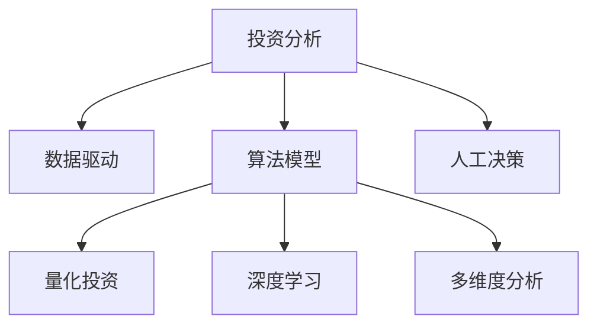

                 

# 理解洞察力的应用：在投资领域的实践探索

> 关键词：
    - 投资分析
    - 数据驱动
    - 算法模型
    - 量化投资
    - 深度学习
    - 多维度分析
    - 投资策略

## 1. 背景介绍

### 1.1 问题由来
在瞬息万变的金融市场中，传统的投资分析方法已无法满足复杂多变的市场需求。投资者需要借助先进的技术手段，对海量数据进行高效、精准的分析，以实现稳定可观的投资收益。其中，洞察力成为连接数据和行动的关键。数据驱动的投资分析方法和技术正在逐步替代传统的主观判断，成为推动金融市场发展的强大动力。

### 1.2 问题核心关键点
本文聚焦于如何将洞察力应用到投资领域，利用数据分析、算法模型等技术手段，构建智能化的投资策略。首先，我们将探讨如何通过数据挖掘和机器学习技术，发现数据中的规律和模式，为投资决策提供坚实的基础。其次，我们将介绍常用的算法模型，如回归分析、时间序列预测、深度学习等，帮助投资者构建更加科学的投资策略。最后，我们将深入分析这些技术手段在实际投资中的运用，探讨未来的发展趋势和面临的挑战。

## 2. 核心概念与联系

### 2.1 核心概念概述

为更好地理解数据驱动的投资分析方法，本节将介绍几个核心概念：

- 投资分析：通过各种手段和方法，对金融市场进行全面、深入的分析，从而做出明智的投资决策。
- 数据驱动：基于数据的分析和决策过程，通过数据挖掘和机器学习等技术手段，发现数据中的规律和模式。
- 算法模型：用于预测、分类、回归等任务的数学模型，帮助投资者构建科学的投资策略。
- 量化投资：通过计算机算法进行自动化交易，避免人为情绪干扰，提升交易效率和准确性。
- 深度学习：一种基于神经网络的机器学习技术，通过多层网络结构，实现对复杂非线性关系的建模。
- 多维度分析：综合考虑价格、成交量、市值、财务指标等多方面因素，进行全面的投资分析。

这些核心概念之间的逻辑关系可以通过以下Mermaid流程图来展示：



这个流程图展示了数据驱动的投资分析方法的核心概念及其之间的关系：

1. 投资分析通过数据驱动和算法模型来辅助决策。
2. 数据驱动利用数据挖掘和机器学习技术，发现数据的规律和模式。
3. 算法模型包括回归分析、时间序列预测、深度学习等，用于构建投资策略。
4. 量化投资通过计算机算法进行自动化交易，提升交易效率。
5. 深度学习用于处理复杂非线性关系，提高模型预测精度。
6. 多维度分析综合考虑多方面因素，提供全面的投资视角。

这些概念共同构成了数据驱动的投资分析框架，有助于投资者在复杂多变的金融市场中做出更加科学、精准的投资决策。

## 3. 核心算法原理 & 具体操作步骤
### 3.1 算法原理概述

数据驱动的投资分析方法，本质上是通过数据挖掘和机器学习技术，发现数据中的规律和模式，为投资决策提供依据。其核心思想是：通过历史数据的分析，构建预测模型，对未来的市场走势进行预测，并据此做出投资决策。

形式化地，假设市场历史数据集为 $D=\{(x_i,y_i)\}_{i=1}^N$，其中 $x_i$ 为输入特征向量，$y_i$ 为输出变量，表示未来价格的变化。目标是通过学习 $D$ 中的规律，构建预测模型 $f(x)$，从而预测未来价格的变化。

常见的预测模型包括线性回归、时间序列模型、支持向量机、深度学习等。通过优化算法，如梯度下降等，调整模型参数，使得模型能够最大化地拟合历史数据。最终的预测结果即为模型对未来价格的估计。

### 3.2 算法步骤详解

数据驱动的投资分析方法一般包括以下几个关键步骤：

**Step 1: 数据准备**
- 收集历史市场数据，包括价格、成交量、市值、财务指标等。
- 清洗数据，处理缺失值、异常值等问题，确保数据的准确性和完整性。
- 划分数据集为训练集、验证集和测试集。

**Step 2: 特征工程**
- 对原始数据进行特征提取，如计算移动平均线、MACD等技术指标。
- 对特征进行归一化、标准化等处理，提高数据的质量。
- 选择和构建特征向量，用于模型训练。

**Step 3: 模型选择**
- 根据任务类型，选择适合的模型，如线性回归、时间序列预测、深度学习等。
- 设计模型参数，如学习率、批量大小、迭代次数等。

**Step 4: 模型训练**
- 使用训练集数据，对模型进行训练，最小化预测误差。
- 在验证集上评估模型性能，调整模型参数，防止过拟合。

**Step 5: 模型测试**
- 在测试集上评估模型性能，对比模型预测结果与实际价格变化。
- 根据模型性能，优化投资策略，调整仓位和投资周期。

**Step 6: 实时更新**
- 根据新数据实时更新模型参数，保持模型的时效性。
- 根据市场动态调整投资策略，确保策略的灵活性和适应性。

以上是数据驱动的投资分析方法的一般流程。在实际应用中，还需要根据具体任务和数据特点，对各个环节进行优化设计，如改进特征提取方法，引入更多的正则化技术，搜索最优的超参数组合等，以进一步提升模型性能。

### 3.3 算法优缺点

数据驱动的投资分析方法具有以下优点：
1. 数据驱动：利用数据挖掘和机器学习技术，发现数据中的规律和模式，避免人为情感干扰，提高决策的科学性。
2. 高效准确：通过构建复杂的数学模型，实现对复杂非线性关系的建模，提高预测的精度。
3. 自动化交易：利用算法模型进行自动化交易，减少人为操作，提高交易效率。
4. 风险控制：通过多维度分析，全面考虑市场因素，降低投资风险。

同时，该方法也存在一定的局限性：
1. 依赖历史数据：模型效果依赖于历史数据的质量和数量，历史数据不足或数据质量不高，可能导致模型泛化能力不足。
2. 复杂度高：构建复杂数学模型需要较高的数学和编程能力，对初学者较为困难。
3. 计算资源需求高：构建复杂模型和进行大规模数据处理，需要高性能的计算资源，增加了计算成本。
4. 难以解释：复杂的数学模型通常难以解释其内部工作机制，难以对模型决策进行调试和优化。

尽管存在这些局限性，但就目前而言，数据驱动的投资分析方法仍是投资决策的重要工具。未来相关研究的重点在于如何进一步降低数据需求，提高模型的解释性和鲁棒性，同时兼顾可扩展性和高效性等因素。

### 3.4 算法应用领域

数据驱动的投资分析方法在金融市场中的应用非常广泛，涵盖了几乎所有常见的投资场景，例如：

- 股票分析：通过分析股票价格、成交量、财务报表等数据，预测股票未来的走势。
- 期货分析：利用期货市场的波动性和杠杆特性，构建复杂的交易策略。
- 外汇交易：分析汇率走势，进行外汇市场的买卖操作。
- 固定收益投资：分析债券市场，进行债券的买卖和持有策略。
- 商品投资：通过分析商品价格和供需关系，进行大宗商品的投资。

除了这些经典投资场景外，数据驱动的投资分析方法还被创新性地应用于更多领域，如保险定价、风险管理、资产配置等，为金融市场带来了新的创新。随着数据科学和机器学习技术的不断进步，相信数据驱动的投资分析方法将在更广泛的领域得到应用，推动金融市场的发展和创新。

## 4. 数学模型和公式 & 详细讲解 & 举例说明

### 4.1 数学模型构建

本节将使用数学语言对数据驱动的投资分析方法进行更加严格的刻画。

假设市场历史数据集为 $D=\{(x_i,y_i)\}_{i=1}^N$，其中 $x_i$ 为输入特征向量，$y_i$ 为输出变量，表示未来价格的变化。定义模型 $f(x)$ 在数据样本 $(x,y)$ 上的损失函数为 $\ell(f(x),y)$，则在数据集 $D$ 上的经验风险为：

$$
\mathcal{L}(f) = \frac{1}{N} \sum_{i=1}^N \ell(f(x_i),y_i)
$$

其中 $\ell(f(x_i),y_i)$ 为损失函数，用于衡量模型预测输出与真实标签之间的差异。常见的损失函数包括均方误差损失、交叉熵损失等。

### 4.2 公式推导过程

以下我们以线性回归模型为例，推导均方误差损失函数及其梯度的计算公式。

假设模型 $f(x)$ 为线性回归模型，即：

$$
f(x) = \beta_0 + \beta_1 x_1 + \beta_2 x_2 + \dots + \beta_n x_n
$$

其中 $\beta = (\beta_0, \beta_1, \dots, \beta_n)^T$ 为模型参数，$x_i = (x_{i1}, x_{i2}, \dots, x_{in})^T$ 为输入特征向量。

均方误差损失函数定义为：

$$
\ell(f(x),y) = \frac{1}{2}(f(x)-y)^2
$$

将其代入经验风险公式，得：

$$
\mathcal{L}(\beta) = \frac{1}{2N} \sum_{i=1}^N (y_i - f(x_i))^2
$$

根据链式法则，损失函数对参数 $\beta_j$ 的梯度为：

$$
\frac{\partial \mathcal{L}(\beta)}{\partial \beta_j} = \frac{1}{N} \sum_{i=1}^N (y_i - f(x_i))x_{ij}
$$

其中 $x_{ij}$ 表示输入特征向量 $x_i$ 的第 $j$ 个元素。

在得到损失函数的梯度后，即可带入梯度下降算法，更新模型参数 $\beta$，最小化经验风险，得到线性回归模型的最优参数。

### 4.3 案例分析与讲解

以线性回归模型为例，假设市场数据集 $D=\{(x_i,y_i)\}_{i=1}^N$，其中 $x_i$ 为时间 $t_i$ 和价格变化 $\Delta p_i$，$y_i$ 为未来价格变化 $\Delta p_{i+1}$。通过数据驱动的方法，构建线性回归模型：

$$
\Delta p_{i+1} = \beta_0 + \beta_1 t_i + \beta_2 \Delta p_i
$$

通过最小化均方误差损失函数，得到模型参数 $\beta = (\beta_0, \beta_1, \beta_2)^T$，进而预测未来的价格变化。

在实际应用中，线性回归模型通常用于简化复杂问题，提升模型训练和推理的效率。但针对更复杂的非线性关系，深度学习等高级算法模型更为适用。

## 5. 项目实践：代码实例和详细解释说明
### 5.1 开发环境搭建

在进行数据驱动的投资分析实践前，我们需要准备好开发环境。以下是使用Python进行scikit-learn开发的环境配置流程：

1. 安装Anaconda：从官网下载并安装Anaconda，用于创建独立的Python环境。

2. 创建并激活虚拟环境：
```bash
conda create -n py3k python=3.8 
conda activate py3k
```

3. 安装Scikit-learn：
```bash
pip install scikit-learn
```

4. 安装其他相关工具包：
```bash
pip install pandas numpy matplotlib seaborn
```

完成上述步骤后，即可在`py3k`环境中开始投资分析实践。

### 5.2 源代码详细实现

下面我们以线性回归模型为例，给出使用scikit-learn库进行市场价格预测的Python代码实现。

首先，导入必要的库：

```python
import pandas as pd
import numpy as np
from sklearn.linear_model import LinearRegression
from sklearn.metrics import mean_squared_error
from sklearn.model_selection import train_test_split
import matplotlib.pyplot as plt
```

然后，读取市场数据：

```python
df = pd.read_csv('market_data.csv', index_col='Date')
```

接着，处理数据：

```python
X = df[['t', 'Delta_p']]
y = df['Delta_p_next']

# 拆分训练集和测试集
X_train, X_test, y_train, y_test = train_test_split(X, y, test_size=0.2, random_state=42)

# 标准化数据
X_train = (X_train - X_train.mean()) / X_train.std()
X_test = (X_test - X_test.mean()) / X_test.std()
```

接着，训练模型：

```python
model = LinearRegression()

# 训练模型
model.fit(X_train, y_train)

# 预测结果
y_pred = model.predict(X_test)
```

最后，评估模型：

```python
mse = mean_squared_error(y_test, y_pred)
print(f"Mean Squared Error: {mse:.2f}")

# 可视化预测结果
plt.plot(y_test, label='Actual')
plt.plot(y_pred, label='Predicted')
plt.legend()
plt.show()
```

以上就是使用scikit-learn库进行市场价格预测的完整代码实现。可以看到，scikit-learn库提供了丰富且易用的机器学习算法和工具，使得模型训练和评估过程变得非常简单。

### 5.3 代码解读与分析

让我们再详细解读一下关键代码的实现细节：

**数据处理**：
- `pd.read_csv`：用于读取CSV格式的市场数据，并将其转换为DataFrame对象。
- `train_test_split`：用于将数据集拆分为训练集和测试集，确保模型的公平性和泛化能力。
- `X_train = (X_train - X_train.mean()) / X_train.std()`：对特征数据进行标准化处理，提高模型的训练效果。

**模型训练**：
- `LinearRegression()`：定义线性回归模型。
- `model.fit(X_train, y_train)`：使用训练集数据训练模型，最小化损失函数。
- `y_pred = model.predict(X_test)`：使用测试集数据进行预测，得到模型的预测结果。

**模型评估**：
- `mean_squared_error`：计算模型预测结果与真实结果之间的均方误差。
- `plt.plot`：绘制模型预测结果和实际结果的对比图，直观展示模型效果。

通过上述代码，可以看出scikit-learn库的强大功能和易用性，使得数据驱动的投资分析方法可以快速实现和验证。

## 6. 实际应用场景

### 6.1 投资组合优化

基于数据驱动的投资分析方法，可以通过对历史数据的分析，构建多因子模型，优化投资组合。常见的多因子模型包括Fama-French三因子模型、Carhart四因子模型等。

以Fama-French三因子模型为例，假设市场数据集为 $D=\{(x_i,y_i)\}_{i=1}^N$，其中 $x_i$ 为市值、账面市值比、动量等因子，$y_i$ 为收益率。通过最小化均方误差损失函数，得到模型参数 $\beta$，进而计算每个资产的因子得分，构建投资组合。

**模型构建**：
- `model = LinearRegression()`：定义线性回归模型。
- `model.fit(X_train, y_train)`：使用训练集数据训练模型，最小化损失函数。

**组合优化**：
- 计算每个资产的因子得分，得到权重向量。
- 根据权重向量构建投资组合，进行组合优化。

**实时更新**：
- 根据新数据实时更新模型参数，动态调整投资组合。

### 6.2 风险管理

投资风险管理是投资分析中的重要环节。通过数据驱动的方法，可以构建风险预测模型，评估投资组合的风险水平。

以VaR（Value at Risk）模型为例，假设市场数据集为 $D=\{(x_i,y_i)\}_{i=1}^N$，其中 $x_i$ 为资产价格、波动率等因子，$y_i$ 为风险水平。通过最小化均方误差损失函数，得到模型参数 $\beta$，进而计算资产组合的VaR值，评估投资组合的风险水平。

**模型构建**：
- `model = LinearRegression()`：定义线性回归模型。
- `model.fit(X_train, y_train)`：使用训练集数据训练模型，最小化损失函数。

**风险评估**：
- 计算资产组合的VaR值，评估风险水平。
- 根据风险评估结果，调整投资策略，控制投资风险。

**实时更新**：
- 根据新数据实时更新模型参数，动态评估投资组合的风险水平。

## 7. 工具和资源推荐

### 7.1 学习资源推荐

为了帮助开发者系统掌握数据驱动的投资分析方法，这里推荐一些优质的学习资源：

1. 《机器学习实战》书籍：提供了丰富的机器学习算法和工具，详细讲解了scikit-learn等库的使用方法。
2. 《Python金融分析》书籍：介绍了Python在金融数据分析中的应用，包括数据清洗、模型构建、风险管理等。
3. 《Quantitative Financial Modeling》书籍：讲解了量化金融模型和算法，为数据驱动的投资分析提供理论支持。
4. Coursera《数据科学与机器学习》课程：提供了大量机器学习算法的学习资源，适合入门和进阶学习。
5. Kaggle金融数据分析竞赛：通过实际数据集练习，提升数据驱动的投资分析能力。

通过对这些资源的学习实践，相信你一定能够快速掌握数据驱动的投资分析方法，并用于解决实际的投资问题。

### 7.2 开发工具推荐

高效的开发离不开优秀的工具支持。以下是几款用于数据驱动投资分析开发的常用工具：

1. Python：基于Python的开源语言，有丰富的第三方库和工具支持，适合数据处理和算法实现。
2. scikit-learn：基于Python的机器学习库，提供了丰富的算法和工具，适合构建和评估数据驱动模型。
3. Pandas：基于Python的数据处理库，适合数据清洗、特征提取和数据可视化。
4. NumPy：基于Python的数值计算库，适合高效的数据处理和计算。
5. Matplotlib：基于Python的图形库，适合绘制可视化图表，辅助数据分析。

合理利用这些工具，可以显著提升数据驱动的投资分析任务的开发效率，加快创新迭代的步伐。

### 7.3 相关论文推荐

数据驱动的投资分析方法发展源于学界的持续研究。以下是几篇奠基性的相关论文，推荐阅读：

1. Fama and French（1993）《Common risk factors in the returns of large cap stocks》：提出了Fama-French三因子模型，构建多因子投资组合。
2. Carhart（1997）《On persistent predictability of stock returns》：提出Carhart四因子模型，进一步提升投资组合的预测能力。
3. Black and Litterman（1990）《Global Portfolio Optimization》：提出Black-Litterman模型，实现资产定价和组合优化。
4. Longstaff and Schwartz（2000）《Valuing American options by simulation: A simple least squares method》：提出蒙特卡洛模拟方法，实现期权定价。
5. Hull and White（1990）《Pricing and hedging derivative securities》：提出VaR模型，评估投资组合的风险水平。

这些论文代表了大数据驱动投资分析方法的发展脉络。通过学习这些前沿成果，可以帮助研究者把握学科前进方向，激发更多的创新灵感。

## 8. 总结：未来发展趋势与挑战

### 8.1 总结

本文对数据驱动的投资分析方法进行了全面系统的介绍。首先阐述了数据驱动方法在投资领域的应用背景和意义，明确了其提升投资决策科学性的独特价值。其次，从原理到实践，详细讲解了数据驱动的数学模型和算法流程，给出了市场价格预测的完整代码实现。同时，本文还广泛探讨了数据驱动方法在投资组合优化、风险管理等多个场景中的应用，展示了其广泛的应用前景。此外，本文精选了数据驱动方法的学习资源和开发工具，力求为读者提供全方位的技术指引。

通过本文的系统梳理，可以看到，数据驱动的投资分析方法正在成为投资决策的重要工具，极大地提升投资决策的科学性和精准度。未来，伴随数据科学和机器学习技术的不断进步，数据驱动的方法将得到更广泛的应用，推动金融市场的发展和创新。

### 8.2 未来发展趋势

展望未来，数据驱动的投资分析方法将呈现以下几个发展趋势：

1. 技术升级：随着深度学习等高级算法的不断发展，数据驱动的方法将更加复杂和精准，能够处理更加复杂和多变的市场数据。
2. 自动化程度提升：基于人工智能技术的自动化交易系统将进一步发展，提升投资决策的效率和准确性。
3. 多因子模型优化：更多复杂多变的因子将被纳入模型，提升投资组合的预测能力和风险控制能力。
4. 实时分析增强：通过实时数据流处理技术，实现更快速的市场分析和投资决策。
5. 可解释性增强：通过可解释性增强技术，提升模型的透明度和可理解性，增强投资者的信任感。
6. 跨市场融合：基于多市场数据融合，实现更加全面和多元化的投资策略。

以上趋势凸显了数据驱动的投资分析方法的广阔前景。这些方向的探索发展，必将进一步提升投资决策的科学性和精准度，推动金融市场的发展和创新。

### 8.3 面临的挑战

尽管数据驱动的投资分析方法已经取得了显著成效，但在迈向更加智能化、普适化应用的过程中，它仍面临着诸多挑战：

1. 数据质量瓶颈：数据驱动方法依赖于高质量的历史数据，但市场数据往往存在噪声和不完整性，难以获得高质量的数据。
2. 模型复杂度高：构建复杂的多因子模型和深度学习模型，需要较高的数学和编程能力，对初学者较为困难。
3. 计算资源需求高：构建复杂模型和进行大规模数据处理，需要高性能的计算资源，增加了计算成本。
4. 可解释性不足：复杂的数学模型通常难以解释其内部工作机制，难以对模型决策进行调试和优化。
5. 市场动态变化：市场变化速度快，数据驱动的方法需要实时更新模型，以适应市场的动态变化。

尽管存在这些挑战，但数据驱动的投资分析方法凭借其科学性和高效性，仍然是大数据分析和投资决策的重要工具。未来相关研究的重点在于如何进一步降低数据需求，提高模型的解释性和鲁棒性，同时兼顾可扩展性和高效性等因素。

### 8.4 研究展望

面对数据驱动投资分析方法所面临的种种挑战，未来的研究需要在以下几个方面寻求新的突破：

1. 引入更多先进算法：引入深度学习、强化学习等高级算法，提升模型的预测能力和泛化能力。
2. 优化模型结构：通过优化模型结构，降低计算资源需求，提高模型的可扩展性和实时性。
3. 提升模型解释性：通过可解释性增强技术，提高模型的透明度和可理解性，增强投资者的信任感。
4. 探索实时分析技术：引入实时数据流处理技术，实现更快速的市场分析和投资决策。
5. 结合外部知识库：结合外部知识库和专家知识，提升模型的综合分析能力，增强投资决策的科学性。

这些研究方向的探索，必将引领数据驱动的投资分析方法迈向更高的台阶，为构建安全、可靠、可解释、可控的智能投资系统铺平道路。面向未来，数据驱动的投资分析方法还需要与其他人工智能技术进行更深入的融合，如知识表示、因果推理、强化学习等，多路径协同发力，共同推动智能投资的发展。只有勇于创新、敢于突破，才能不断拓展数据驱动投资分析方法的边界，让智能投资更好地服务于金融市场。

## 9. 附录：常见问题与解答

**Q1：数据驱动方法是否适用于所有投资场景？**

A: 数据驱动方法在大多数投资场景上都能取得不错的效果，特别是对于数据量较大的任务。但对于一些特定领域的投资，如行为金融学、期权定价等，可能需要结合其他理论方法进行综合分析。此外，对于一些需要实时数据支持的投资场景，如高频交易，数据驱动方法也需要相应的技术支撑。

**Q2：如何选择适合的数据驱动模型？**

A: 选择适合的数据驱动模型需要考虑多个因素，包括市场特点、数据类型、投资目标等。常见的数据驱动模型包括线性回归、时间序列预测、支持向量机、深度学习等。线性回归适用于简单线性关系的数据，时间序列预测适用于具有时间序列特性的数据，支持向量机适用于分类问题，深度学习适用于复杂非线性关系的数据。具体选择时，需要根据实际任务需求进行权衡和测试，选择最优模型。

**Q3：如何处理数据中的噪声和异常值？**

A: 数据清洗是数据驱动方法的重要步骤，常见的处理方式包括：
1. 数据预处理：去除缺失值、异常值等噪声数据，确保数据质量。
2. 特征选择：选择对预测有用的特征，去除冗余特征，提高模型效率。
3. 异常值检测：检测并处理异常值，避免异常值对模型造成影响。

**Q4：数据驱动方法是否需要进行特征工程？**

A: 是的，特征工程是数据驱动方法的重要步骤。特征工程包括特征提取、特征选择、特征转换等，用于提升数据的质量和特征的表达能力，帮助模型更好地捕捉数据的规律和模式。常见的特征工程方法包括计算技术指标、标准化处理、特征降维等。

**Q5：如何评估数据驱动模型的性能？**

A: 数据驱动模型的性能评估通常包括准确率、均方误差、平均绝对误差等指标。具体评估方式根据任务类型而定。例如，分类任务可以使用准确率、精确率、召回率等指标，回归任务可以使用均方误差、均方根误差等指标。此外，还可以使用交叉验证等方法，评估模型在不同数据集上的泛化能力。

通过本文的系统梳理，可以看到，数据驱动的投资分析方法正在成为投资决策的重要工具，极大地提升投资决策的科学性和精准度。未来，伴随数据科学和机器学习技术的不断进步，数据驱动的方法将得到更广泛的应用，推动金融市场的发展和创新。

---
作者：禅与计算机程序设计艺术 / Zen and the Art of Computer Programming

