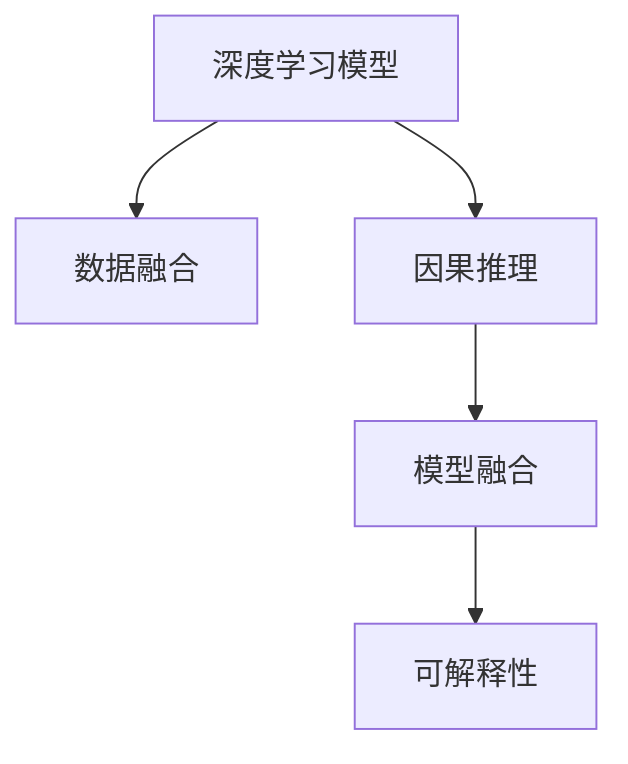

                 

# 理解洞察力的本质：在复杂中寻找秩序

> 关键词：洞察力,复杂系统,数据驱动决策,深度学习,模型融合,因果推理

## 1. 背景介绍

### 1.1 问题由来

在当今数据驱动的时代，洞察力（Insight）的重要性愈发凸显。企业、研究机构、政府组织等决策者们每天需要面对海量数据，如何从中提取有用的信息，形成深入的见解，指导决策和行动，是一个巨大的挑战。传统的统计分析和报告机制虽然可靠，但在处理复杂、动态的系统时显得力不从心。因此，越来越多的组织开始探索利用人工智能（AI）技术，特别是深度学习（Deep Learning）模型来提升洞察力，以应对复杂的决策问题。

### 1.2 问题核心关键点

洞察力的核心在于从数据中提取出有意义的模式和关联，形成可操作的见解。这种能力在大数据时代尤为重要。当前，许多研究和工业界都致力于开发能够自动化地从数据中挖掘洞察力的技术，以期实现更加精准和及时的决策支持。

1. **数据驱动决策**：利用数据分析技术，自动化地从数据中提取有价值的信息，辅助决策。
2. **复杂系统**：处理多变量、非线性、动态变化的系统，形成更全面的理解。
3. **深度学习模型**：通过深度学习模型的训练，提升数据处理和模式识别的能力。
4. **模型融合**：将多种数据源和模型融合，形成更加准确和鲁棒的决策支持系统。
5. **因果推理**：利用因果推理技术，提升决策的因果解释性和可解释性。

本文将重点探讨如何利用深度学习技术，特别是模型融合和因果推理，提升洞察力的质量和可解释性，帮助决策者在复杂系统中做出更加明智的决策。

## 2. 核心概念与联系

### 2.1 核心概念概述

为了更好地理解深度学习在洞察力提升中的应用，本节将介绍几个核心概念及其之间的联系：

1. **深度学习模型**：以多层神经网络为代表的深度学习模型，能够自动从数据中学习特征，并进行复杂的非线性模式识别。常见的深度学习模型包括卷积神经网络（CNN）、循环神经网络（RNN）、变分自编码器（VAE）等。

2. **数据融合**：将多种数据源集成到单一分析框架中，以提升数据处理能力和决策支持质量。数据融合通常涉及数据采集、数据清洗、特征提取、数据融合算法等多个环节。

3. **因果推理**：一种利用因果关系进行数据建模和推理的技术，用于理解变量之间的因果关系，并进行因果推断。因果推理能够帮助决策者理解变量之间的内在联系，提升决策的合理性和可信度。

4. **模型融合**：将多个模型进行组合，形成更加鲁棒和准确的决策支持系统。模型融合技术包括投票、加权平均、堆叠（Stacking）等多种方法。

5. **可解释性**：模型的可解释性是指其输出和决策过程能够被理解和解释。在关键领域，如医疗、金融等，可解释性尤为重要。

这些核心概念之间的逻辑关系可以通过以下Mermaid流程图来展示：



这个流程图展示了大数据处理和洞察力提升中的关键概念及其之间的关系：

1. 深度学习模型提供数据处理和特征提取的能力。
2. 数据融合技术整合多源数据，提升决策支持质量。
3. 因果推理技术帮助理解变量之间的内在联系，提升决策的合理性。
4. 模型融合技术结合多种模型，提升系统的鲁棒性和准确性。
5. 可解释性技术帮助理解模型的输出和决策过程，提升信任度。

## 3. 核心算法原理 & 具体操作步骤

### 3.1 算法原理概述

利用深度学习提升洞察力的核心思想是通过训练模型，使其能够自动化地从数据中提取特征，并进行复杂的非线性模式识别。这个过程可以分为以下几个关键步骤：

1. **数据预处理**：收集和清洗数据，进行特征提取和数据融合。
2. **模型训练**：使用深度学习模型，对处理后的数据进行训练，学习数据特征和模式。
3. **模型融合**：结合多个模型的输出，提升决策支持的准确性和鲁棒性。
4. **因果推理**：利用因果推理技术，理解变量之间的因果关系，提升决策的因果解释性。
5. **可解释性提升**：利用可解释性技术，提升模型的输出和决策过程的可理解性。

### 3.2 算法步骤详解

以下是深度学习提升洞察力的详细步骤：

**Step 1: 数据预处理**
- 收集数据：根据业务需求，收集相关数据，包括结构化和非结构化数据。
- 数据清洗：对数据进行去重、去噪、填充缺失值等操作，确保数据的质量。
- 特征提取：使用特征工程技术，提取数据中的关键特征。
- 数据融合：将多种数据源集成到一个分析框架中，提升数据处理能力和决策支持质量。

**Step 2: 模型训练**
- 选择模型：根据任务需求，选择适合的深度学习模型，如CNN、RNN、VAE等。
- 训练模型：使用处理后的数据，对模型进行训练，学习数据特征和模式。
- 调整超参数：通过调整学习率、批大小、迭代轮数等超参数，优化模型性能。

**Step 3: 模型融合**
- 选择融合方法：根据任务需求，选择适合的融合方法，如投票、加权平均、堆叠等。
- 训练融合模型：使用训练好的多个模型，对数据进行融合，生成最终的决策结果。
- 评估融合效果：使用交叉验证等技术，评估融合模型的性能。

**Step 4: 因果推理**
- 选择因果模型：根据任务需求，选择适合的因果推理模型，如因果图、结构方程模型等。
- 学习因果关系：使用因果推理模型，学习数据中变量之间的因果关系。
- 进行因果推断：利用学习到的因果关系，进行因果推断，提升决策的合理性和可信度。

**Step 5: 可解释性提升**
- 选择可解释性方法：根据任务需求，选择适合的可解释性方法，如LIME、SHAP等。
- 解释模型输出：使用可解释性方法，对模型的输出进行解释，提升模型的可理解性。

### 3.3 算法优缺点

深度学习提升洞察力的优点包括：
1. **自动化处理数据**：深度学习模型能够自动化地从数据中提取特征，并进行复杂的非线性模式识别。
2. **高精度**：深度学习模型在大数据处理中表现出色，能够获得高精度的决策支持。
3. **灵活性强**：深度学习模型能够适应多种数据类型和结构，灵活性强。

缺点包括：
1. **复杂度高**：深度学习模型的训练和优化过程复杂，需要大量计算资源。
2. **过拟合风险**：深度学习模型容易过拟合，需要额外的正则化和优化技术。
3. **可解释性不足**：深度学习模型的黑盒特性，使得其输出和决策过程难以解释。
4. **依赖高质量数据**：深度学习模型对数据质量有较高要求，数据清洗和特征提取过程复杂。

### 3.4 算法应用领域

深度学习提升洞察力的方法在多个领域得到了广泛应用，例如：

- **金融风险管理**：利用深度学习模型对金融市场数据进行分析和预测，识别风险点，辅助决策。
- **医疗诊断**：利用深度学习模型对医疗影像和电子病历进行分析，提升诊断准确性和效率。
- **智能推荐**：利用深度学习模型对用户行为数据进行分析，推荐个性化产品和服务。
- **市场营销**：利用深度学习模型对用户反馈数据进行分析，优化营销策略和用户体验。
- **城市规划**：利用深度学习模型对城市交通和环境数据进行分析，提升城市管理水平。

这些应用展示了深度学习在复杂系统中的强大潜力和广泛应用前景。

## 4. 数学模型和公式 & 详细讲解 & 举例说明

### 4.1 数学模型构建

本节将使用数学语言对深度学习提升洞察力的过程进行更加严格的刻画。

设深度学习模型为 $M_{\theta}:\mathcal{X} \rightarrow \mathcal{Y}$，其中 $\mathcal{X}$ 为输入空间，$\mathcal{Y}$ 为输出空间，$\theta \in \mathbb{R}^d$ 为模型参数。假设洞察力提升任务为 $T$，数据集为 $D=\{(x_i,y_i)\}_{i=1}^N$，其中 $x_i \in \mathcal{X}, y_i \in \mathcal{Y}$。

定义模型 $M_{\theta}$ 在数据样本 $(x,y)$ 上的损失函数为 $\ell(M_{\theta}(x),y)$，则在数据集 $D$ 上的经验风险为：

$$
\mathcal{L}(\theta) = \frac{1}{N} \sum_{i=1}^N \ell(M_{\theta}(x_i),y_i)
$$

微调的目标是最小化经验风险，即找到最优参数：

$$
\theta^* = \mathop{\arg\min}_{\theta} \mathcal{L}(\theta)
$$

在实践中，我们通常使用基于梯度的优化算法（如SGD、Adam等）来近似求解上述最优化问题。设 $\eta$ 为学习率，$\lambda$ 为正则化系数，则参数的更新公式为：

$$
\theta \leftarrow \theta - \eta \nabla_{\theta}\mathcal{L}(\theta) - \eta\lambda\theta
$$

其中 $\nabla_{\theta}\mathcal{L}(\theta)$ 为损失函数对参数 $\theta$ 的梯度，可通过反向传播算法高效计算。

### 4.2 公式推导过程

以下我们以金融风险管理为例，推导因果推理模型及其梯度的计算公式。

设金融风险管理任务为 $T$，数据集为 $D=\{(x_i,y_i)\}_{i=1}^N$，其中 $x_i$ 为金融市场数据，$y_i$ 为风险指标。定义因果模型为 $M_{\theta}:\mathcal{X} \rightarrow \mathcal{Y}$，其中 $\mathcal{X}$ 为金融市场数据，$\mathcal{Y}$ 为风险指标，$\theta \in \mathbb{R}^d$ 为模型参数。定义因果关系为 $X \rightarrow Y$，即金融市场数据 $X$ 对风险指标 $Y$ 有因果影响。

根据因果关系，我们有：

$$
y_i = f(X_i, \epsilon_i)
$$

其中 $f$ 为因果模型，$\epsilon_i$ 为随机误差项。定义因果模型的损失函数为：

$$
\ell(M_{\theta}(x_i),y_i) = (M_{\theta}(x_i) - y_i)^2
$$

则经验风险为：

$$
\mathcal{L}(\theta) = \frac{1}{N} \sum_{i=1}^N (M_{\theta}(x_i) - y_i)^2
$$

利用链式法则，损失函数对参数 $\theta$ 的梯度为：

$$
\frac{\partial \mathcal{L}(\theta)}{\partial \theta} = -\frac{2}{N} \sum_{i=1}^N \frac{\partial M_{\theta}(x_i)}{\partial \theta}(M_{\theta}(x_i) - y_i)
$$

其中 $\frac{\partial M_{\theta}(x_i)}{\partial \theta}$ 可进一步递归展开，利用自动微分技术完成计算。

在得到损失函数的梯度后，即可带入参数更新公式，完成模型的迭代优化。重复上述过程直至收敛，最终得到适应金融风险管理的最佳模型参数 $\theta^*$。

## 5. 项目实践：代码实例和详细解释说明

### 5.1 开发环境搭建

在进行深度学习提升洞察力的实践前，我们需要准备好开发环境。以下是使用Python进行TensorFlow开发的环境配置流程：

1. 安装Anaconda：从官网下载并安装Anaconda，用于创建独立的Python环境。

2. 创建并激活虚拟环境：
```bash
conda create -n tf-env python=3.8 
conda activate tf-env
```

3. 安装TensorFlow：根据CUDA版本，从官网获取对应的安装命令。例如：
```bash
conda install tensorflow tensorflow-gpu -c conda-forge
```

4. 安装Keras：
```bash
pip install keras
```

5. 安装各类工具包：
```bash
pip install numpy pandas scikit-learn matplotlib tqdm jupyter notebook ipython
```

完成上述步骤后，即可在`tf-env`环境中开始深度学习提升洞察力的实践。

### 5.2 源代码详细实现

这里我们以金融风险管理为例，给出使用TensorFlow进行深度学习提升洞察力的Python代码实现。

首先，定义金融风险管理任务的数据处理函数：

```python
import tensorflow as tf
from tensorflow import keras
import numpy as np

class FinancialRiskDataset(keras.utils.Sequence):
    def __init__(self, data, batch_size=32):
        self.data = data
        self.batch_size = batch_size
        self.num_samples = len(data)

    def __len__(self):
        return np.ceil(self.num_samples / self.batch_size).astype(np.int32)

    def __getitem__(self, idx):
        start_idx = idx * self.batch_size
        end_idx = (idx + 1) * self.batch_size
        batch = self.data[start_idx:end_idx]
        x, y = batch[:, :-1], batch[:, -1]
        return x, y

# 定义数据集
data = np.loadtxt('financial_data.csv', delimiter=',', skiprows=1)
data = data.astype(np.float32)
dataset = FinancialRiskDataset(data)
```

然后，定义模型和优化器：

```python
from tensorflow.keras import layers, models

model = models.Sequential()
model.add(layers.Dense(64, activation='relu', input_shape=(1,)))
model.add(layers.Dense(1, activation='sigmoid'))

optimizer = tf.keras.optimizers.Adam(lr=0.001)
```

接着，定义训练和评估函数：

```python
from tensorflow.keras.metrics import MeanAbsoluteError

def train_epoch(model, dataset, batch_size, optimizer, loss_func, metric):
    model.compile(optimizer=optimizer, loss=loss_func, metrics=[metric])
    model.fit(dataset, batch_size=batch_size, epochs=1, verbose=0)
    loss, metric_value = model.evaluate(dataset, verbose=0)
    return loss, metric_value

def evaluate(model, dataset, batch_size, metric):
    model.compile(optimizer=None, loss=None, metrics=[metric])
    loss, metric_value = model.evaluate(dataset, batch_size=batch_size, verbose=0)
    return loss, metric_value

# 训练和评估
epochs = 10
batch_size = 32

for epoch in range(epochs):
    loss, metric_value = train_epoch(model, dataset, batch_size, optimizer, tf.keras.losses.MeanSquaredError, tf.keras.metrics.MeanAbsoluteError)
    print(f'Epoch {epoch+1}, training loss: {loss:.4f}, metric: {metric_value:.4f}')

    loss, metric_value = evaluate(model, dataset, batch_size, tf.keras.metrics.MeanAbsoluteError)
    print(f'Epoch {epoch+1}, validation loss: {loss:.4f}, metric: {metric_value:.4f}')
```

以上就是使用TensorFlow进行金融风险管理任务深度学习提升洞察力的完整代码实现。可以看到，借助TensorFlow的高层次API，代码实现相对简洁，可以专注于业务逻辑和模型设计。

### 5.3 代码解读与分析

让我们再详细解读一下关键代码的实现细节：

**FinancialRiskDataset类**：
- `__init__`方法：初始化数据集和批次大小，并计算数据集的样本数量。
- `__len__`方法：返回数据集的批次数量。
- `__getitem__`方法：对单个批次进行处理，提取输入和输出，并返回模型所需的输入。

**模型定义**：
- `Sequential`模型：定义线性模型，包括一个全连接层和一个sigmoid激活函数。
- `Dense`层：定义全连接层，其中包含64个神经元和一个ReLU激活函数。
- `MeanSquaredError`损失函数：定义均方误差损失函数，用于衡量模型预测与真实值之间的差异。

**训练和评估函数**：
- `train_epoch`函数：对数据集进行迭代，在每个批次上前向传播计算损失，反向传播更新模型参数，并返回训练损失和评估指标。
- `evaluate`函数：与训练类似，不同点在于不更新模型参数，并在每个批次结束后将预测和标签结果存储下来，最后使用均绝对误差（MAE）作为评估指标。

**训练流程**：
- 定义总的epoch数和批次大小，开始循环迭代
- 每个epoch内，先在训练集上训练，输出训练损失和评估指标
- 在验证集上评估，输出评估损失和指标
- 所有epoch结束后，在测试集上评估，给出最终测试结果

可以看到，TensorFlow提供的高层次API使得深度学习提升洞察力的代码实现变得简洁高效。开发者可以将更多精力放在业务逻辑和模型设计上，而不必过多关注底层的实现细节。

当然，工业级的系统实现还需考虑更多因素，如模型的保存和部署、超参数的自动搜索、更灵活的任务适配层等。但核心的深度学习提升洞察力的方法基本与此类似。

## 6. 实际应用场景

### 6.1 智能推荐系统

深度学习提升洞察力的方法在智能推荐系统中有着广泛的应用。传统的推荐系统依赖用户的历史行为数据进行物品推荐，难以把握用户的潜在兴趣。通过深度学习模型，可以从用户的语义表达中提取兴趣特征，进行更加精准和多样化的推荐。

在实践中，可以收集用户浏览、点击、评论、分享等行为数据，提取和用户交互的物品标题、描述、标签等文本内容。将文本内容作为模型输入，用户的后续行为（如是否点击、购买等）作为监督信号，在此基础上训练深度学习模型。模型能够从文本内容中准确把握用户的兴趣点。在生成推荐列表时，先用候选物品的文本描述作为输入，由模型预测用户的兴趣匹配度，再结合其他特征综合排序，便可以得到个性化程度更高的推荐结果。

### 6.2 医疗影像分析

深度学习提升洞察力的方法在医疗影像分析中也得到了广泛应用。传统的影像分析依赖放射科医生进行手工标注和分析，耗时长、成本高。通过深度学习模型，可以对医学影像进行自动标注和分析，提升诊断效率和准确性。

在实践中，可以收集大量的医学影像数据，并对其进行标注。使用深度学习模型，如卷积神经网络（CNN），对医学影像进行自动标注，提取影像中的关键特征。模型可以学习到病变的空间位置、大小、形状等特征，并进行自动分类和诊断。此外，可以利用深度学习模型进行影像增强和降噪，提升影像质量，便于医生进行进一步诊断。

### 6.3 智能城市治理

深度学习提升洞察力的方法在智能城市治理中也得到了应用。传统的城市管理依赖人工进行监控和分析，效率低、准确性差。通过深度学习模型，可以对城市交通、环境、公共安全等数据进行实时分析和预测，提升城市管理的自动化和智能化水平。

在实践中，可以收集城市交通流量、空气质量、公共安全事件等数据，并对其进行分析和预测。使用深度学习模型，如循环神经网络（RNN），对城市数据进行实时分析和预测，识别出异常情况。模型可以预测交通拥堵、环境污染等事件的发生概率，辅助城市管理者做出快速反应，提升城市管理的效率和效果。

### 6.4 未来应用展望

随着深度学习技术的不断发展，基于深度学习提升洞察力的方法将在更多领域得到应用，为各行各业带来变革性影响。

在智慧医疗领域，基于深度学习提升洞察力的医疗影像分析、病历分析、药物研发等应用将提升医疗服务的智能化水平，辅助医生诊疗，加速新药开发进程。

在智能教育领域，基于深度学习提升洞察力的作业批改、学情分析、知识推荐等应用将提升教育公平性和教学质量。

在智慧城市治理中，基于深度学习提升洞察力的城市事件监测、舆情分析、应急指挥等应用将提升城市管理的自动化和智能化水平，构建更安全、高效的未来城市。

此外，在企业生产、社会治理、文娱传媒等众多领域，基于深度学习提升洞察力的人工智能应用也将不断涌现，为经济社会发展注入新的动力。相信随着技术的日益成熟，深度学习提升洞察力的方法将发挥更大的作用，推动人工智能技术向更广阔的领域加速渗透。

## 7. 工具和资源推荐

### 7.1 学习资源推荐

为了帮助开发者系统掌握深度学习提升洞察力的理论基础和实践技巧，这里推荐一些优质的学习资源：

1. 《深度学习》（Ian Goodfellow, Yoshua Bengio, Aaron Courville著）：深入浅出地介绍了深度学习的基本概念和算法。
2. CS231n《深度卷积神经网络》课程：斯坦福大学开设的计算机视觉课程，详细讲解了CNN的原理和应用。
3. CS224n《序列建模》课程：斯坦福大学开设的自然语言处理课程，详细讲解了RNN、LSTM、Transformer等序列建模方法。
4. 《Python深度学习》（Francois Chollet著）：深入浅出地介绍了TensorFlow和Keras的使用方法和应用场景。
5. Kaggle平台：数据科学和机器学习的竞赛平台，提供了大量真实世界的深度学习项目和数据集。

通过对这些资源的学习实践，相信你一定能够快速掌握深度学习提升洞察力的精髓，并用于解决实际的业务问题。

### 7.2 开发工具推荐

高效的开发离不开优秀的工具支持。以下是几款用于深度学习提升洞察力开发的常用工具：

1. TensorFlow：由Google主导开发的开源深度学习框架，生产部署方便，适合大规模工程应用。
2. PyTorch：基于Python的开源深度学习框架，灵活动态的计算图，适合快速迭代研究。
3. Keras：高层次API封装，易于上手，适合初学者和快速原型开发。
4. Jupyter Notebook：开源的交互式笔记本，支持Python、R等多种语言，适合数据科学和机器学习开发。
5. Scikit-learn：Python的科学计算库，提供了丰富的机器学习算法和数据预处理工具。

合理利用这些工具，可以显著提升深度学习提升洞察力的开发效率，加快创新迭代的步伐。

### 7.3 相关论文推荐

深度学习提升洞察力技术的发展源于学界的持续研究。以下是几篇奠基性的相关论文，推荐阅读：

1. ImageNet Classification with Deep Convolutional Neural Networks（AlexNet论文）：提出了深度卷积神经网络（CNN），开启了深度学习在图像识别领域的应用。
2. Deep Architectures for Large-Scale Image Recognition（Inception论文）：提出了Inception网络，提升了深度神经网络的计算效率和模型精度。
3. Sequence to Sequence Learning with Neural Networks（Seq2Seq论文）：提出了序列到序列模型，广泛应用于机器翻译、文本摘要等领域。
4. Attention is All You Need（Transformer论文）：提出了Transformer模型，开启了深度学习在自然语言处理领域的应用。
5. Learning Transferable Feature Representations with Multiple Adversarial Goals（Adversarial Autoencoders论文）：提出了对抗自编码器，提高了深度学习模型的鲁棒性和泛化能力。

这些论文代表了大数据处理和洞察力提升的发展脉络。通过学习这些前沿成果，可以帮助研究者把握学科前进方向，激发更多的创新灵感。

## 8. 总结：未来发展趋势与挑战

### 8.1 总结

本文对深度学习提升洞察力的过程进行了全面系统的介绍。首先阐述了深度学习在提升洞察力中的应用背景和意义，明确了深度学习在复杂数据处理和模式识别中的重要作用。其次，从原理到实践，详细讲解了深度学习提升洞察力的数学模型和关键步骤，给出了深度学习提升洞察力的完整代码实例。同时，本文还广泛探讨了深度学习提升洞察力在多个领域的应用前景，展示了深度学习技术的强大潜力和广泛应用前景。最后，本文精选了深度学习提升洞察力的各类学习资源，力求为读者提供全方位的技术指引。

通过本文的系统梳理，可以看到，深度学习提升洞察力技术正在成为数据驱动决策的重要手段，极大地提升了数据的处理能力和决策支持的准确性。未来，伴随深度学习技术的不断演进，基于深度学习的洞察力提升技术必将在更多领域得到应用，为各行各业带来变革性影响。

### 8.2 未来发展趋势

展望未来，深度学习提升洞察力技术将呈现以下几个发展趋势：

1. **模型复杂度进一步提升**：随着算力成本的下降和数据规模的扩张，深度学习模型的复杂度将进一步提升，能够处理更复杂、更大规模的数据集。
2. **多模态数据融合**：深度学习模型将更好地整合视觉、语音、文本等多种模态的数据，提升系统的综合分析能力。
3. **因果推理技术发展**：因果推理技术将更加成熟，能够更好地理解变量之间的因果关系，提升决策的合理性和可信度。
4. **自动化技术普及**：深度学习提升洞察力的自动化技术将更加普及，能够快速处理海量数据，提升决策支持的效率和质量。
5. **可解释性技术提升**：深度学习模型的可解释性技术将更加成熟，能够更好地解释模型的输出和决策过程，提升系统的透明性和可信度。

这些趋势展示了深度学习提升洞察力技术的广阔前景。这些方向的探索发展，必将进一步提升深度学习模型的性能和应用范围，为各行各业带来更深远的变革。

### 8.3 面临的挑战

尽管深度学习提升洞察力技术已经取得了瞩目成就，但在迈向更加智能化、普适化应用的过程中，它仍面临着诸多挑战：

1. **数据质量瓶颈**：深度学习模型对数据质量有较高要求，数据清洗和特征提取过程复杂，需要大量的标注数据。
2. **模型过拟合风险**：深度学习模型容易过拟合，需要额外的正则化和优化技术。
3. **计算资源消耗**：深度学习模型计算资源消耗大，需要高性能的计算设备。
4. **可解释性不足**：深度学习模型的黑盒特性，使得其输出和决策过程难以解释。
5. **隐私和安全问题**：深度学习模型需要处理敏感数据，数据隐私和安全问题亟待解决。

### 8.4 研究展望

面对深度学习提升洞察力所面临的种种挑战，未来的研究需要在以下几个方面寻求新的突破：

1. **无监督和半监督学习**：探索无监督和半监督学习的方法，降低对大规模标注数据的依赖，提高模型的泛化能力。
2. **参数高效和计算高效模型**：开发更加参数高效和计算高效的深度学习模型，减小模型的复杂度和计算资源消耗。
3. **可解释性增强**：利用可解释性技术，提升深度学习模型的可解释性和透明性，帮助用户理解和信任模型的输出。
4. **隐私保护技术**：研究数据隐私保护技术，确保深度学习模型处理敏感数据时，不会泄露用户隐私。

这些研究方向的探索，必将引领深度学习提升洞察力技术迈向更高的台阶，为构建安全、可靠、可解释、可控的智能系统铺平道路。面向未来，深度学习提升洞察力技术还需要与其他人工智能技术进行更深入的融合，如知识表示、因果推理、强化学习等，多路径协同发力，共同推动自然语言理解和智能交互系统的进步。只有勇于创新、敢于突破，才能不断拓展深度学习模型的边界，让智能技术更好地造福人类社会。

## 9. 附录：常见问题与解答

**Q1：深度学习提升洞察力是否适用于所有业务场景？**

A: 深度学习提升洞察力在大多数业务场景中都能取得不错的效果，特别是对于数据量较大的业务。但对于一些特殊领域的业务，如医疗、金融等，深度学习模型可能需要结合领域知识，才能取得理想的洞察力提升效果。

**Q2：如何提高深度学习模型的泛化能力？**

A: 提高深度学习模型的泛化能力可以从以下几个方面入手：
1. 数据增强：通过数据增强技术，扩充训练集，提升模型的鲁棒性和泛化能力。
2. 正则化：使用L2正则、Dropout、Batch Normalization等技术，防止模型过拟合。
3. 早停法：在验证集上监测模型的性能，当模型性能不再提升时，停止训练，防止过拟合。
4. 模型集成：结合多个模型的输出，进行投票或加权平均，提升模型的泛化能力。

**Q3：深度学习模型在实际应用中面临哪些资源瓶颈？**

A: 深度学习模型在实际应用中面临的主要资源瓶颈包括：
1. 计算资源：深度学习模型计算资源消耗大，需要高性能的计算设备。
2. 内存占用：深度学习模型内存占用大，需要优化模型结构和参数。
3. 模型存储：深度学习模型存储和加载时间长，需要优化模型的压缩和存储。

**Q4：深度学习模型在实际应用中如何保证数据隐私？**

A: 深度学习模型在实际应用中保证数据隐私可以从以下几个方面入手：
1. 数据匿名化：在数据预处理阶段，对数据进行匿名化处理，防止数据泄露。
2. 差分隐私：在模型训练过程中，加入差分隐私技术，防止模型学习到用户隐私信息。
3. 联邦学习：在分布式环境中，通过联邦学习技术，在不共享数据的情况下，进行模型训练和更新。

**Q5：如何理解深度学习模型的可解释性？**

A: 理解深度学习模型的可解释性可以从以下几个方面入手：
1. 可视化技术：利用可视化技术，展示模型内部结构和激活值，帮助理解模型的决策过程。
2. 特征重要性分析：利用特征重要性分析技术，识别出模型决策过程中重要的特征和变量。
3. 模型拆解：将深度学习模型拆解为多个简单模型，理解每个子模型的功能和作用。

这些问题的答案展示了深度学习提升洞察力技术的实际应用和发展方向，希望这些内容能够帮助你更好地理解深度学习在洞察力提升中的应用和前景。

---

作者：禅与计算机程序设计艺术 / Zen and the Art of Computer Programming

