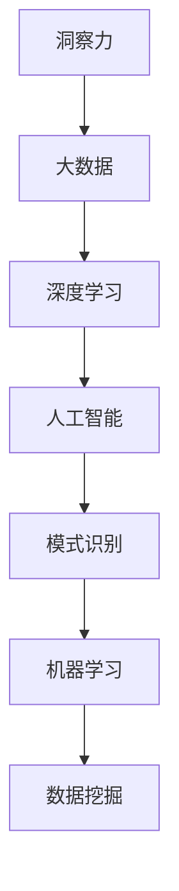

                 

# 理解洞察力的本质：在纷繁中把握规律

> 关键词：洞察力, 大数据, 深度学习, 人工智能, 模式识别, 机器学习, 数据挖掘

## 1. 背景介绍

### 1.1 问题由来

在当今的信息时代，我们被海量数据所包围。从社交媒体到在线购物，从医疗数据到金融交易，数据无处不在，无时不在。然而，在数据增长的同时，我们面临的挑战也日益加剧。如何在数据海洋中找到有价值的洞察，帮助我们更好地理解世界，做出更明智的决策？这一问题不仅对企业和组织至关重要，也是人工智能领域面临的重大挑战。

### 1.2 问题核心关键点

洞察力在数据处理和分析中扮演着至关重要的角色。它不仅帮助我们揭示数据背后的规律和趋势，还赋予我们识别复杂现象的能力。然而，从海量数据中提取有价值的洞察并非易事。传统的统计方法和手动分析虽然有效，但在大数据时代显得力不从心。近年来，随着深度学习和大数据技术的不断发展，基于人工智能的方法开始在这方面展现出巨大的潜力。

### 1.3 问题研究意义

研究洞察力的本质及其在大数据环境中的应用，具有重要的理论和实践意义。对于理论研究而言，理解洞察力的生成机制和算法基础，有助于推动人工智能领域的发展，促进机器学习、数据挖掘等技术的前沿进展。对于实践应用而言，开发高效的数据分析工具和算法，可以帮助企业和组织从数据中获取宝贵的商业价值，优化决策过程，提升竞争力。

## 2. 核心概念与联系

### 2.1 核心概念概述

为更好地理解洞察力的本质及其在大数据环境中的应用，本节将介绍几个密切相关的核心概念：

- 洞察力(Insight)：通过对数据进行分析和解释，揭示出数据背后的规律、趋势和关联。洞察力能够帮助我们理解复杂的现象，预测未来趋势，制定有效的策略。
- 大数据(Big Data)：指那些无法在传统数据处理工具和硬件上用通常的方法在合理时间内处理的数据集。大数据通常具有四个V特征：Volume（规模）、Velocity（速度）、Variety（多样性）和Veracity（真实性）。
- 深度学习(Deep Learning)：一种基于神经网络的学习方法，通过多层次的非线性变换，可以自动从数据中提取高级特征，揭示数据之间的复杂关系。
- 人工智能(Artificial Intelligence, AI)：一种使计算机系统能够执行通常需要人类智能的任务的技术。AI不仅包括传统的机器学习和统计方法，还包括最新的深度学习和强化学习技术。
- 模式识别(Pattern Recognition)：从数据中识别出重复的模式和结构，是洞察力生成的重要组成部分。
- 机器学习(Machine Learning, ML)：一种通过数据和算法使计算机系统能够自主学习和改进的技术。机器学习通过训练模型，从数据中学习规律和模式。
- 数据挖掘(Data Mining)：从大量数据中提取有用信息和知识的过程。数据挖掘技术可以帮助我们发现数据中的模式、关联和趋势。

这些核心概念之间的逻辑关系可以通过以下Mermaid流程图来展示：



这个流程图展示了大数据和洞察力之间的关系及其与深度学习、人工智能、模式识别、机器学习、数据挖掘等技术的联系。这些技术共同构成了洞察力生成的技术框架，使得我们从海量数据中提取有价值的洞察成为可能。

## 3. 核心算法原理 & 具体操作步骤
### 3.1 算法原理概述

洞察力生成本质上是一个数据处理和分析的过程，其核心算法包括数据预处理、特征工程、模型训练和结果解释等步骤。以下是对这些步骤的详细解释：

1. **数据预处理**：数据预处理包括数据清洗、缺失值处理、标准化等步骤，确保数据的质量和一致性。
2. **特征工程**：特征工程是从原始数据中提取和构造有用特征的过程。这个过程包括特征选择、特征提取、特征变换等。
3. **模型训练**：模型训练是使用训练数据集训练机器学习模型的过程。常见的模型包括线性回归、决策树、随机森林、神经网络等。
4. **结果解释**：结果解释是将模型输出转换为可理解的形式，帮助用户理解模型的结果。

### 3.2 算法步骤详解

以下是基于深度学习的洞察力生成过程的具体步骤：

**Step 1: 数据收集与预处理**
- 从不同来源收集数据，如社交媒体、传感器、客户交易记录等。
- 进行数据清洗，去除重复、缺失、异常值等。
- 进行数据标准化，确保不同特征之间的可比性。

**Step 2: 特征提取与工程**
- 选择合适的特征提取方法，如PCA、LDA、特征哈希等。
- 进行特征变换，如时间序列转换、PCA降维等。
- 构建特征集，包括原始特征、衍生特征等。

**Step 3: 模型选择与训练**
- 选择适合任务的深度学习模型，如CNN、RNN、Transformer等。
- 分割数据集为训练集、验证集和测试集。
- 使用训练集训练模型，调整超参数，如学习率、批大小等。
- 在验证集上评估模型性能，避免过拟合。

**Step 4: 结果解释与可视化**
- 使用可视化工具，如Matplotlib、Seaborn、Tableau等，将模型结果可视化。
- 解释模型输出，帮助用户理解模型的预测结果。
- 进行敏感性分析，理解不同特征对模型输出的影响。

### 3.3 算法优缺点

基于深度学习的洞察力生成方法具有以下优点：
1. 可以自动从数据中提取高级特征，揭示数据之间的复杂关系。
2. 适用于大规模数据集，能够处理多种类型的数据，包括文本、图像、时间序列等。
3. 可以发现数据中的隐藏模式和关联，提供有价值的商业洞见。

同时，该方法也存在一些局限性：
1. 对数据质量要求高，需要大量高质量的数据进行训练。
2. 模型复杂度高，训练和推理成本较高。
3. 需要大量的计算资源，对硬件设施要求较高。
4. 结果的解释性不足，难以理解模型的内部工作机制。

尽管存在这些局限性，但深度学习在洞察力生成中的应用已经成为主流，并且随着技术的不断进步，其缺点正在逐步被克服。

### 3.4 算法应用领域

基于深度学习的洞察力生成方法在多个领域得到了广泛应用，例如：

- **金融分析**：从金融交易数据中提取市场趋势、识别欺诈行为、预测股票价格等。
- **医疗健康**：从患者病历中提取疾病特征、预测病情发展、辅助诊断等。
- **市场营销**：从消费者行为数据中分析市场趋势、优化广告投放、预测销售业绩等。
- **智能制造**：从生产设备数据中监控设备状态、预测设备故障、优化生产流程等。
- **社交媒体分析**：从社交媒体数据中分析用户情绪、发现热点话题、预测社会趋势等。

除了上述这些经典应用外，深度学习在洞察力生成领域的应用还在不断扩展，涵盖了更多新的场景和领域。

## 4. 数学模型和公式 & 详细讲解 & 举例说明
### 4.1 数学模型构建

以下是基于深度学习的洞察力生成模型的数学模型构建：

假设我们有 $n$ 个数据点 $(x_i, y_i)$，其中 $x_i \in \mathbb{R}^d$ 是特征向量，$y_i \in \mathbb{R}$ 是目标变量。我们的目标是构建一个深度神经网络模型 $f(x; \theta)$，使得 $f(x; \theta)$ 最小化预测误差 $E(y, \hat{y})$，其中 $\hat{y} = f(x; \theta)$ 是模型的预测值。

### 4.2 公式推导过程

以下是深度神经网络模型的公式推导过程：

假设我们使用一个深度神经网络模型 $f(x; \theta)$，其中 $\theta$ 表示模型参数，$x$ 表示输入特征向量。模型由多个隐藏层组成，每个隐藏层 $h_i$ 的输出可以通过以下公式计算：

$$
h_i = \sigma(W_i h_{i-1} + b_i)
$$

其中 $W_i$ 和 $b_i$ 分别是第 $i$ 层的权重和偏置项，$\sigma$ 是激活函数，如ReLU、Sigmoid等。最终，模型的输出 $y$ 可以通过以下公式计算：

$$
y = W_0 h_L + b_0
$$

其中 $W_0$ 和 $b_0$ 分别是最后一层的权重和偏置项。

### 4.3 案例分析与讲解

以下是一个基于深度学习的洞察力生成案例：

假设我们有一组客户交易数据，目标是预测客户的购买行为。我们的数据集包含客户的年龄、性别、购买金额、购买频率等特征。我们构建一个深度神经网络模型，通过特征选择和特征提取，将原始数据转化为高维特征向量。然后，我们使用该模型对历史数据进行训练，调整超参数，最终得到一个用于预测的模型。通过可视化工具，我们可以将模型的输出结果可视化，帮助用户理解模型的预测结果。

## 5. 项目实践：代码实例和详细解释说明
### 5.1 开发环境搭建

在进行洞察力生成项目实践前，我们需要准备好开发环境。以下是使用Python进行TensorFlow开发的环境配置流程：

1. 安装Anaconda：从官网下载并安装Anaconda，用于创建独立的Python环境。
2. 创建并激活虚拟环境：
```bash
conda create -n tf-env python=3.8 
conda activate tf-env
```
3. 安装TensorFlow：根据CUDA版本，从官网获取对应的安装命令。例如：
```bash
conda install tensorflow-gpu=2.7.0 -c tf-nightly -c conda-forge
```
4. 安装其他必要的工具包：
```bash
pip install numpy pandas scikit-learn matplotlib tqdm jupyter notebook ipython
```
完成上述步骤后，即可在`tf-env`环境中开始洞察力生成项目实践。

### 5.2 源代码详细实现

这里我们以客户购买行为预测为例，给出使用TensorFlow进行深度学习洞察力生成的PyTorch代码实现。

首先，定义数据处理函数：

```python
import tensorflow as tf
import numpy as np
from sklearn.model_selection import train_test_split
from sklearn.preprocessing import StandardScaler

def load_data():
    # 加载数据集
    X = np.load('data_X.npy')
    y = np.load('data_y.npy')
    
    # 数据标准化
    scaler = StandardScaler()
    X = scaler.fit_transform(X)
    
    # 分割数据集
    X_train, X_test, y_train, y_test = train_test_split(X, y, test_size=0.2, random_state=42)
    
    return X_train, X_test, y_train, y_test
```

然后，定义模型和优化器：

```python
from tensorflow.keras.models import Sequential
from tensorflow.keras.layers import Dense, Dropout, BatchNormalization

def build_model(input_shape):
    model = Sequential([
        Dense(256, activation='relu', input_shape=input_shape),
        Dropout(0.2),
        BatchNormalization(),
        Dense(128, activation='relu'),
        Dropout(0.2),
        BatchNormalization(),
        Dense(1, activation='sigmoid')
    ])
    model.compile(loss='binary_crossentropy', optimizer='adam', metrics=['accuracy'])
    return model
```

接着，定义训练和评估函数：

```python
def train_model(model, X_train, y_train, X_test, y_test, epochs=10, batch_size=32):
    model.fit(X_train, y_train, epochs=epochs, batch_size=batch_size, validation_data=(X_test, y_test))
    
def evaluate_model(model, X_test, y_test):
    loss, accuracy = model.evaluate(X_test, y_test)
    print(f'Test loss: {loss:.4f}')
    print(f'Test accuracy: {accuracy:.4f}')
```

最后，启动训练流程并在测试集上评估：

```python
# 加载数据
X_train, X_test, y_train, y_test = load_data()

# 构建模型
model = build_model(X_train.shape[1:])

# 训练模型
train_model(model, X_train, y_train, X_test, y_test)

# 评估模型
evaluate_model(model, X_test, y_test)
```

以上就是使用TensorFlow进行深度学习洞察力生成项目的完整代码实现。可以看到，得益于TensorFlow的强大封装，我们可以用相对简洁的代码完成洞察力生成模型的训练和评估。

### 5.3 代码解读与分析

让我们再详细解读一下关键代码的实现细节：

**load_data函数**：
- `load_data`函数用于加载数据集并进行数据标准化和分割。
- 使用`numpy`库加载预处理后的数据。
- 使用`sklearn`库进行数据标准化和分割，确保数据的一致性和质量。

**build_model函数**：
- `build_model`函数用于定义深度神经网络模型。
- 使用`tensorflow.keras`库构建模型。
- 模型包含多个隐藏层，使用`Dense`层实现全连接，`Dropout`层防止过拟合，`BatchNormalization`层加速收敛。
- 模型输出层使用`Dense`层，使用`sigmoid`激活函数进行二分类预测。
- 使用`compile`方法定义损失函数、优化器和评价指标。

**train_model函数**：
- `train_model`函数用于训练深度学习模型。
- 使用`fit`方法对模型进行训练，设置训练轮数和批次大小。
- 使用`validation_data`参数指定测试集，进行模型评估。

**evaluate_model函数**：
- `evaluate_model`函数用于评估训练后的深度学习模型。
- 使用`evaluate`方法对模型进行评估，计算测试集上的损失和精度。
- 打印模型评估结果。

**训练流程**：
- 调用`load_data`函数加载数据集。
- 调用`build_model`函数定义模型。
- 调用`train_model`函数训练模型。
- 调用`evaluate_model`函数评估模型。

可以看到，TensorFlow的强大封装使得深度学习洞察力生成模型的开发变得简洁高效。开发者可以将更多精力放在数据处理、模型改进等高层逻辑上，而不必过多关注底层的实现细节。

当然，工业级的系统实现还需考虑更多因素，如模型的保存和部署、超参数的自动搜索、更灵活的任务适配层等。但核心的洞察力生成范式基本与此类似。

## 6. 实际应用场景
### 6.1 金融分析

基于深度学习的洞察力生成方法，可以在金融分析中发挥重要作用。金融市场数据量大且复杂，传统统计方法难以处理。深度学习模型能够从历史交易数据中挖掘出市场趋势和规律，帮助分析师预测股票价格、识别异常交易行为、优化投资组合等。

在技术实现上，可以收集金融市场的历史交易数据，对其进行预处理和特征提取，然后构建深度学习模型，通过训练模型学习市场规律。微调后的模型可以实时监控市场动态，提供投资建议和风险预警，助力金融决策。

### 6.2 医疗健康

深度学习在医疗健康领域同样具有广泛应用。医疗数据通常包含大量复杂的非结构化数据，如病历、影像等，难以直接使用传统统计方法进行分析。深度学习模型可以从中提取有价值的洞察，帮助医生诊断疾病、预测病情发展、辅助决策等。

具体而言，可以收集医疗数据集，进行预处理和特征提取，然后构建深度学习模型，通过训练模型学习疾病特征和规律。微调后的模型可以辅助医生进行疾病诊断，预测病情发展，优化治疗方案，提升医疗服务质量。

### 6.3 市场营销

市场营销领域也面临着海量数据的挑战。通过深度学习洞察力生成方法，可以从消费者行为数据中分析市场趋势、优化广告投放、预测销售业绩等。

在具体应用中，可以收集消费者行为数据，进行预处理和特征提取，然后构建深度学习模型，通过训练模型学习市场规律。微调后的模型可以实时监控市场动态，提供市场分析和优化建议，助力企业制定有效的市场策略。

### 6.4 智能制造

在智能制造领域，深度学习洞察力生成方法可以帮助企业监控生产设备状态、预测设备故障、优化生产流程等。具体而言，可以收集生产设备的数据，进行预处理和特征提取，然后构建深度学习模型，通过训练模型学习设备规律。微调后的模型可以实时监控设备状态，预测设备故障，优化生产流程，提升生产效率和质量。

### 6.5 社交媒体分析

社交媒体数据量大且复杂，传统统计方法难以处理。深度学习洞察力生成方法可以从中分析用户情绪、发现热点话题、预测社会趋势等。

在具体应用中，可以收集社交媒体数据，进行预处理和特征提取，然后构建深度学习模型，通过训练模型学习用户情绪和社会趋势。微调后的模型可以实时监控社交媒体动态，提供舆情分析和预警，助力企业制定有效的市场策略。

### 6.6 未来应用展望

随着深度学习和大数据技术的不断发展，基于深度学习的洞察力生成方法将进一步拓展其应用领域。未来，该方法将在更多领域得到应用，为传统行业带来变革性影响。

在智慧医疗领域，基于深度学习的洞察力生成方法将帮助医疗机构分析患者病历、预测病情发展、辅助诊断等，提升医疗服务质量。

在智能教育领域，深度学习洞察力生成方法可以用于分析学生学习行为、预测学习效果、推荐学习资源等，推动教育公平和个性化教育的发展。

在智慧城市治理中，深度学习洞察力生成方法可以用于分析城市事件、预测社会舆情、优化城市管理等，构建更安全、高效的未来城市。

除了上述这些经典应用外，深度学习洞察力生成方法还将被创新性地应用到更多场景中，为各行各业提供新的技术路径。相信随着技术的日益成熟，深度学习洞察力生成方法必将在构建人机协同的智能时代中扮演越来越重要的角色。

## 7. 工具和资源推荐
### 7.1 学习资源推荐

为了帮助开发者系统掌握深度学习洞察力生成技术，这里推荐一些优质的学习资源：

1. 《深度学习》课程（Coursera）：由Andrew Ng教授主讲的深度学习课程，系统介绍深度学习的基本原理和应用。
2. 《Python深度学习》（书籍）：由Francois Chollet撰写的深度学习入门书籍，详细讲解TensorFlow、Keras等深度学习框架。
3. 《TensorFlow实战》（书籍）：由Christian Chorley撰写的TensorFlow实战指南，涵盖TensorFlow的基本操作和高级应用。
4. 《数据科学与机器学习》（在线课程）：由Kaggle提供的数据科学与机器学习课程，涵盖数据处理、特征工程、模型训练等基本技能。
5. Kaggle：一个数据科学竞赛平台，提供丰富的数据集和比赛项目，适合学习和实践深度学习洞察力生成技术。

通过对这些资源的学习实践，相信你一定能够快速掌握深度学习洞察力生成的精髓，并用于解决实际的深度学习问题。

### 7.2 开发工具推荐

高效的开发离不开优秀的工具支持。以下是几款用于深度学习洞察力生成开发的常用工具：

1. TensorFlow：由Google主导开发的开源深度学习框架，生产部署方便，适合大规模工程应用。
2. PyTorch：基于Python的开源深度学习框架，灵活高效的计算图，适合快速迭代研究。
3. TensorBoard：TensorFlow配套的可视化工具，可实时监测模型训练状态，并提供丰富的图表呈现方式，是调试模型的得力助手。
4. Weights & Biases：模型训练的实验跟踪工具，可以记录和可视化模型训练过程中的各项指标，方便对比和调优。
5. Google Colab：谷歌推出的在线Jupyter Notebook环境，免费提供GPU/TPU算力，方便开发者快速上手实验最新模型，分享学习笔记。

合理利用这些工具，可以显著提升深度学习洞察力生成任务的开发效率，加快创新迭代的步伐。

### 7.3 相关论文推荐

深度学习洞察力生成技术的发展源于学界的持续研究。以下是几篇奠基性的相关论文，推荐阅读：

1. Deep Neural Networks for Natural Language Processing：介绍深度学习在NLP中的应用，包括文本分类、情感分析、机器翻译等任务。
2. Convolutional Neural Networks for Sentence Classification：介绍卷积神经网络在文本分类中的应用，展示其在情感分析和垃圾邮件过滤等任务上的性能。
3. Recurrent Neural Networks for Sequence Prediction：介绍循环神经网络在序列预测中的应用，展示其在语音识别和自然语言处理中的应用。
4. Attention is All You Need：提出Transformer结构，开启了NLP领域的预训练大模型时代。
5. Understanding the Difficulties of Training Deep Neural Networks：深入分析深度神经网络训练中的困难，提出多种改进方法。

这些论文代表了大数据时代深度学习洞察力生成技术的发展脉络。通过学习这些前沿成果，可以帮助研究者把握学科前进方向，激发更多的创新灵感。

## 8. 总结：未来发展趋势与挑战

### 8.1 总结

本文对基于深度学习的洞察力生成技术进行了全面系统的介绍。首先阐述了洞察力在大数据环境中的重要性和应用前景，明确了深度学习洞察力生成技术在实际应用中的独特价值。其次，从原理到实践，详细讲解了深度学习洞察力生成的数学模型和关键步骤，给出了深度学习洞察力生成项目的完整代码实例。同时，本文还广泛探讨了深度学习洞察力生成方法在金融分析、医疗健康、市场营销、智能制造、社交媒体分析等多个领域的应用前景，展示了深度学习洞察力生成技术的广阔前景。最后，本文精选了深度学习洞察力生成技术的各类学习资源，力求为读者提供全方位的技术指引。

通过本文的系统梳理，可以看到，深度学习洞察力生成技术已经成为大数据时代不可或缺的重要工具，极大地拓展了数据分析和决策支持的能力，推动了人工智能技术的发展和应用。未来，伴随深度学习和大数据技术的持续演进，基于深度学习的洞察力生成技术必将迎来新的突破，带来更加深刻的变革。

### 8.2 未来发展趋势

展望未来，深度学习洞察力生成技术将呈现以下几个发展趋势：

1. 模型规模持续增大。随着算力成本的下降和数据规模的扩张，深度学习模型的参数量还将持续增长。超大规模深度学习模型蕴含的丰富知识，有望支撑更加复杂多变的洞察力生成任务。
2. 数据处理技术不断进步。随着数据处理技术的不断发展，深度学习洞察力生成方法将更加高效地处理多种类型的数据，包括文本、图像、时间序列等。
3. 模型压缩与优化。为了适应实际部署环境，深度学习洞察力生成方法将更多关注模型压缩和优化，减少计算资源消耗，提高推理速度。
4. 模型解释性与可解释性增强。随着模型复杂度的提高，模型解释性和可解释性成为重要的研究方向。如何赋予深度学习洞察力生成模型更强的解释性，将是未来的重要课题。
5. 多模态数据的融合。深度学习洞察力生成方法将更多关注多模态数据的融合，将视觉、语音等多模态信息与文本信息协同建模，提升洞察力生成能力。
6. 跨领域应用的拓展。深度学习洞察力生成方法将在更多领域得到应用，为各行各业带来变革性影响。

以上趋势凸显了深度学习洞察力生成技术的广阔前景。这些方向的探索发展，必将进一步提升深度学习洞察力生成方法的性能和应用范围，为人工智能技术的发展注入新的动力。

### 8.3 面临的挑战

尽管深度学习洞察力生成技术已经取得了显著进展，但在迈向更加智能化、普适化应用的过程中，它仍面临着诸多挑战：

1. 数据质量与标注成本。尽管深度学习洞察力生成方法对标注数据的需求较少，但对于特定领域的高质量标注数据仍然具有较高成本。如何降低数据标注成本，提高数据质量，将是未来研究的重要方向。
2. 模型复杂性与可解释性。深度学习洞察力生成方法通常具有较高的复杂度，其内部工作机制难以解释，难以满足某些领域（如医疗、金融等）对模型可解释性的需求。如何提高模型解释性，确保模型输出符合用户期望，将是重要的研究课题。
3. 计算资源与部署效率。深度学习洞察力生成方法通常需要大量的计算资源，如何在保证性能的同时，提高模型的计算效率和部署效率，将是未来研究的重要方向。
4. 数据隐私与安全。深度学习洞察力生成方法在实际应用中可能涉及用户隐私数据的处理，如何保护数据隐私，确保数据安全，将是未来的重要研究方向。
5. 伦理与社会责任。深度学习洞察力生成方法在实际应用中可能带来伦理和社会问题，如何确保模型的公平性、透明性，避免偏见和歧视，将是未来的重要研究课题。

### 8.4 研究展望

面对深度学习洞察力生成所面临的挑战，未来的研究需要在以下几个方面寻求新的突破：

1. 探索无监督和半监督洞察力生成方法。摆脱对大规模标注数据的依赖，利用自监督学习、主动学习等无监督和半监督范式，最大限度利用非结构化数据，实现更加灵活高效的洞察力生成。
2. 研究参数高效和计算高效的洞察力生成范式。开发更加参数高效的洞察力生成方法，在固定大部分预训练参数的同时，只更新极少量的任务相关参数。同时优化洞察力生成模型的计算图，减少前向传播和反向传播的资源消耗，实现更加轻量级、实时性的部署。
3. 融合因果和对比学习范式。通过引入因果推断和对比学习思想，增强洞察力生成模型建立稳定因果关系的能力，学习更加普适、鲁棒的语言表征，从而提升模型泛化性和抗干扰能力。
4. 引入更多先验知识。将符号化的先验知识，如知识图谱、逻辑规则等，与深度学习模型进行巧妙融合，引导洞察力生成过程学习更准确、合理的语言模型。同时加强不同模态数据的整合，实现视觉、语音等多模态信息与文本信息的协同建模。
5. 纳入伦理道德约束。在洞察力生成模型的训练目标中引入伦理导向的评估指标，过滤和惩罚有偏见、有害的输出倾向。同时加强人工干预和审核，建立模型行为的监管机制，确保输出符合人类价值观和伦理道德。

这些研究方向的探索，必将引领深度学习洞察力生成技术迈向更高的台阶，为构建安全、可靠、可解释、可控的智能系统铺平道路。面向未来，深度学习洞察力生成技术还需要与其他人工智能技术进行更深入的融合，如知识表示、因果推理、强化学习等，多路径协同发力，共同推动人工智能技术的发展和应用。只有勇于创新、敢于突破，才能不断拓展深度学习洞察力生成技术的边界，让智能技术更好地造福人类社会。

## 9. 附录：常见问题与解答

**Q1：深度学习洞察力生成是否适用于所有领域？**

A: 深度学习洞察力生成技术在大多数领域都有广泛的应用，如金融分析、医疗健康、市场营销等。但对于一些特定领域的任务，如医学、法律等，仅仅依靠通用语料预训练的模型可能难以很好地适应。此时需要在特定领域语料上进一步预训练，再进行微调，才能获得理想效果。此外，对于一些需要时效性、个性化很强的任务，如对话、推荐等，深度学习洞察力生成方法也需要针对性的改进优化。

**Q2：深度学习洞察力生成是否需要大规模标注数据？**

A: 深度学习洞察力生成方法通常对标注数据的需求较少，特别是在无监督和半监督学习范式下，可以通过自监督学习、主动学习等方法从非标注数据中提取洞察力。但在有监督学习范式下，深度学习洞察力生成方法仍然需要大量的标注数据进行训练，标注数据的规模和质量直接影响模型的性能。因此，如何降低标注成本，提高数据质量，将是未来研究的重要方向。

**Q3：深度学习洞察力生成是否具有解释性？**

A: 深度学习洞察力生成方法通常具有较高的复杂度，其内部工作机制难以解释。模型输出的可解释性不足，难以满足某些领域（如医疗、金融等）对模型可解释性的需求。如何赋予深度学习洞察力生成模型更强的解释性，确保模型输出符合用户期望，将是未来的重要课题。

**Q4：深度学习洞察力生成是否需要高性能计算资源？**

A: 深度学习洞察力生成方法通常需要大量的计算资源，因为模型规模较大，计算复杂度高。在实际部署中，可能需要高性能GPU/TPU设备进行训练和推理。如何在保证性能的同时，提高模型的计算效率和部署效率，将是未来研究的重要方向。

**Q5：深度学习洞察力生成是否能够处理多模态数据？**

A: 深度学习洞察力生成方法在处理多模态数据方面具有较强的能力。通过引入多模态融合技术，可以将视觉、语音等多模态信息与文本信息协同建模，提升洞察力生成能力。但多模态数据处理的技术复杂度较高，如何设计高效的融合算法，提升数据处理效率，将是未来研究的重要方向。

通过本文的系统梳理，可以看到，深度学习洞察力生成技术已经成为大数据时代不可或缺的重要工具，极大地拓展了数据分析和决策支持的能力，推动了人工智能技术的发展和应用。未来，伴随深度学习和大数据技术的持续演进，基于深度学习的洞察力生成技术必将迎来新的突破，带来更加深刻的变革。

