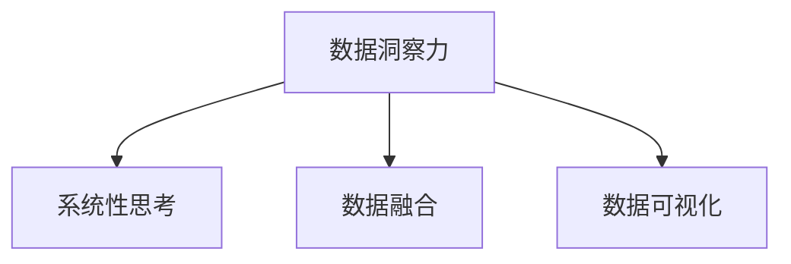

                 

# 理解洞察力的训练：提升系统性思考能力

## 1. 背景介绍

### 1.1 问题由来
随着信息时代的到来，数据量的爆炸式增长，人类越来越依赖于数据和算法来进行决策和分析。然而，仅凭数据和算法的辅助，人类尚未能够充分挖掘数据的潜力，利用数据进行深入的洞察力和系统性思考。传统的统计分析方法已经无法满足当前复杂数据环境的需求，迫切需要引入更为先进、系统的数据理解和分析手段。

### 1.2 问题核心关键点
数据洞察力的提升，需要一种能够处理复杂数据、揭示数据背后深层结构的方法。这种方法不仅要能够挖掘数据中的统计规律，还需要具备以下关键特征：

- **深度理解**：能够从多维度、多层次角度，深入理解数据的本质特征。
- **系统思考**：能够将数据与现实世界联系起来，形成系统的认知框架。
- **多源融合**：能够融合多种来源的数据，进行综合分析。
- **灵活适应**：能够快速适应新的数据环境，处理变化中的数据。

本文将从算法原理、操作步骤、应用领域等角度，详细阐述提升系统性思考能力的方法，以期为数据洞察力的提升提供新的思路和技术手段。

## 2. 核心概念与联系

### 2.1 核心概念概述

为更好地理解提升系统性思考能力的方法，本节将介绍几个关键概念：

- 数据洞察力（Data Insight）：指通过数据挖掘和分析，揭示数据背后的深层次规律和结构，形成对现实世界的深刻理解。
- 系统性思考（Systematic Thinking）：指从整体、系统的角度，分析问题和决策，形成科学的认知框架。
- 数据融合（Data Fusion）：指将多种数据源进行整合，综合分析，形成更全面、准确的结果。
- 数据可视化（Data Visualization）：指通过图表、地图等手段，将数据直观地呈现出来，帮助人类更好地理解数据。

这些核心概念之间的逻辑关系可以通过以下Mermaid流程图来展示：



这个流程图展示出数据洞察力在提升系统性思考能力中的重要作用，以及数据融合和数据可视化作为辅助手段，与数据洞察力协同作用，形成完整的认知框架。

## 3. 核心算法原理 & 具体操作步骤
### 3.1 算法原理概述

提升系统性思考能力，本质上是将数据洞察力引入到系统性思考中，通过数据驱动的认知框架，形成更科学、系统的决策方式。这可以理解为一种"深度数据理解与系统分析"的有机结合。

具体来说，提升系统性思考能力的方法可以分为以下几个步骤：

1. **数据准备与预处理**：对数据进行清洗、归一化、特征工程等预处理操作，确保数据质量。
2. **数据挖掘与分析**：利用统计分析、机器学习等方法，挖掘数据中的统计规律，形成数据洞察力。
3. **系统性建模**：将数据洞察力与现实世界的系统性框架相结合，进行建模分析。
4. **结果验证与优化**：通过模型验证和优化，不断调整系统性思考的认知框架，提升准确性和实用性。

### 3.2 算法步骤详解

下面详细介绍提升系统性思考能力的核心步骤及其具体操作：

#### 3.2.1 数据准备与预处理

数据准备与预处理是提升系统性思考能力的前提。具体步骤如下：

- **数据清洗**：去除数据中的噪声、异常值和缺失值，确保数据的质量和完整性。
- **数据归一化**：将不同尺度的数据进行归一化处理，确保模型训练的公平性和准确性。
- **特征工程**：根据任务需求，选择和构造合适的特征，提升模型性能。
- **数据划分**：将数据划分为训练集、验证集和测试集，进行模型的训练、验证和测试。

#### 3.2.2 数据挖掘与分析

数据挖掘与分析是提升系统性思考能力的关键步骤。具体步骤如下：

- **统计分析**：通过描述性统计、假设检验等方法，揭示数据的分布和规律。
- **机器学习**：利用分类、回归、聚类等算法，挖掘数据中的深层次结构。
- **异常检测**：通过离群点检测、密度聚类等方法，识别数据中的异常情况。
- **可视化分析**：通过图表、地图等手段，将数据分析结果直观地呈现出来，帮助人类更好地理解数据。

#### 3.2.3 系统性建模

系统性建模是将数据洞察力与现实世界系统性框架相结合的过程。具体步骤如下：

- **系统框架构建**：根据问题需求，构建系统性认知框架，如因果关系图、系统动力学模型等。
- **数据融合**：将不同来源的数据进行整合，形成更全面、准确的结果。
- **模型训练**：将数据洞察力引入模型训练中，提升模型的准确性和鲁棒性。
- **结果验证**：通过交叉验证、真实数据测试等方法，验证模型性能。

#### 3.2.4 结果验证与优化

结果验证与优化是提升系统性思考能力的最后环节。具体步骤如下：

- **性能评估**：通过各种指标评估模型性能，如准确率、召回率、F1值等。
- **参数优化**：通过超参数调优，优化模型性能。
- **模型解释**：通过模型解释技术，如LIME、SHAP等，解释模型决策过程，提高模型透明度。
- **模型部署**：将模型部署到实际应用中，进行业务落地。

### 3.3 算法优缺点

提升系统性思考能力的方法具有以下优点：

- **深度理解**：通过数据挖掘和分析，深入理解数据的本质特征，形成系统的认知框架。
- **系统思考**：将数据洞察力与现实世界的系统性框架相结合，形成科学的认知框架。
- **多源融合**：通过数据融合，综合分析多种来源的数据，形成更全面、准确的结果。

同时，该方法也存在一些局限性：

- **复杂性高**：数据挖掘和分析过程需要较高的技术水平和计算资源。
- **数据依赖**：方法效果依赖于数据的质量和数量，数据质量差时效果可能不佳。
- **解释难度大**：复杂模型往往难以解释其内部工作机制，不易理解。
- **业务适配性差**：需要与具体业务场景相结合，才能发挥最佳效果。

尽管存在这些局限性，但总体而言，提升系统性思考能力的方法仍是大数据时代的重要手段。未来相关研究的重点在于如何进一步降低方法的复杂度，提升其适应性和解释性。

### 3.4 算法应用领域

提升系统性思考能力的方法已经在多个领域得到了应用，如：

- **金融风险管理**：通过数据分析，揭示金融市场的深层次规律，形成系统性认知框架，辅助金融决策。
- **医疗诊断**：利用数据挖掘，分析患者的健康数据，形成系统性认知框架，辅助医生诊断和治疗。
- **市场营销**：通过数据分析，揭示市场趋势和用户行为规律，形成系统性认知框架，优化市场营销策略。
- **城市规划**：利用数据挖掘，分析城市运行数据，形成系统性认知框架，优化城市管理。
- **供应链管理**：通过数据分析，揭示供应链中的深层次规律，形成系统性认知框架，优化供应链管理。

除了上述这些领域，提升系统性思考能力的方法也在不断拓展，应用范围不断扩大，为各行各业带来了新的机遇和挑战。

## 4. 数学模型和公式 & 详细讲解 & 举例说明

### 4.1 数学模型构建

提升系统性思考能力的方法通常使用数据挖掘和机器学习等技术，构建数学模型。这里以线性回归模型为例，详细介绍其构建过程。

假设我们有一个数据集 $D=\{(x_i, y_i)\}_{i=1}^N$，其中 $x_i$ 为自变量，$y_i$ 为因变量。线性回归模型假设因变量与自变量之间存在线性关系，形式化为：

$$
y_i = \beta_0 + \beta_1 x_{i1} + \beta_2 x_{i2} + \cdots + \beta_p x_{ip} + \epsilon_i
$$

其中 $\beta_j$ 为第 $j$ 个自变量的系数，$\epsilon_i$ 为误差项。

### 4.2 公式推导过程

线性回归模型的最小二乘法求解公式为：

$$
\hat{\beta} = (X^TX)^{-1}X^Ty
$$

其中 $X^T$ 为自变量矩阵的转置，$y$ 为因变量向量。

推导过程如下：

1. 将线性回归模型转化为矩阵形式：

$$
Y = X\beta + \epsilon
$$

2. 求解系数 $\beta$，使得误差平方和最小：

$$
\min_{\beta} ||Y - X\beta||^2
$$

3. 将误差平方和最小化问题转化为求解矩阵的逆问题：

$$
\hat{\beta} = (X^TX)^{-1}X^Ty
$$

### 4.3 案例分析与讲解

假设我们有一组房价数据，已知每套房子的大小、房间数、年龄，希望预测房子的价格。我们首先进行数据清洗和归一化，然后构建线性回归模型：

```python
import numpy as np
from sklearn.linear_model import LinearRegression

# 构造数据
X = np.array([[2.5, 3, 1], [3.1, 4, 1.5], [3.6, 2, 1], [3.4, 2, 1.6]])
y = np.array([48.8, 42.4, 54.5, 52.3])

# 构建线性回归模型
model = LinearRegression()
model.fit(X, y)

# 预测新房子价格
X_new = np.array([[3.2, 3.4, 2]])
y_pred = model.predict(X_new)

print(y_pred)
```

通过数据挖掘和分析，我们能够得到房子的价格与其大小、房间数、年龄之间的关系，从而形成系统的认知框架，辅助房地产决策。

## 5. 项目实践：代码实例和详细解释说明

### 5.1 开发环境搭建

在进行系统性思考能力的实践前，我们需要准备好开发环境。以下是使用Python进行scikit-learn开发的环境配置流程：

1. 安装Anaconda：从官网下载并安装Anaconda，用于创建独立的Python环境。

2. 创建并激活虚拟环境：
```bash
conda create -n sklearn-env python=3.8 
conda activate sklearn-env
```

3. 安装scikit-learn：
```bash
pip install scikit-learn
```

4. 安装各类工具包：
```bash
pip install numpy pandas scikit-learn matplotlib tqdm jupyter notebook ipython
```

完成上述步骤后，即可在`sklearn-env`环境中开始系统性思考能力的实践。

### 5.2 源代码详细实现

下面我以线性回归模型为例，给出使用scikit-learn进行系统性思考能力实践的Python代码实现。

首先，定义数据集：

```python
from sklearn.datasets import load_boston

# 加载波士顿房价数据
boston = load_boston()
X = boston.data
y = boston.target
```

然后，构建并训练线性回归模型：

```python
from sklearn.linear_model import LinearRegression

# 构建线性回归模型
model = LinearRegression()
model.fit(X, y)
```

最后，进行模型评估和结果展示：

```python
from sklearn.metrics import mean_squared_error, r2_score

# 评估模型性能
y_pred = model.predict(X)
mse = mean_squared_error(y, y_pred)
r2 = r2_score(y, y_pred)

print(f"MSE: {mse:.2f}, R^2: {r2:.2f}")
```

以上就是使用scikit-learn进行线性回归模型训练的完整代码实现。可以看到，得益于scikit-learn的强大封装，我们可以用相对简洁的代码完成模型的训练和评估。

### 5.3 代码解读与分析

让我们再详细解读一下关键代码的实现细节：

- **数据集定义**：使用scikit-learn内置的波士顿房价数据集，包含13个特征和目标变量。
- **模型构建**：使用LinearRegression类构建线性回归模型。
- **模型训练**：调用fit方法对数据进行训练，学习模型的参数。
- **模型评估**：使用均方误差和R^2系数评估模型性能。

可以看到，scikit-learn提供了简单易用的接口，使得系统性思考能力的实现变得高效便捷。

当然，工业级的系统实现还需考虑更多因素，如模型的保存和部署、超参数的自动搜索、更灵活的系统框架等。但核心的系统性思考能力方法基本与此类似。

## 6. 实际应用场景
### 6.1 金融风险管理

金融风险管理中，系统性思考能力的提升，可以帮助银行和金融机构更好地理解金融市场的深层次规律，构建科学的决策框架。具体来说，可以：

- **信用风险评估**：利用数据分析，评估借款人的信用状况，形成系统性认知框架，辅助决策。
- **投资组合优化**：通过数据分析，揭示市场资产的关联性，形成系统性认知框架，优化投资组合。
- **风险预警系统**：利用数据分析，构建风险预警模型，实时监控金融市场风险，提前预警。

### 6.2 医疗诊断

医疗诊断中，系统性思考能力的提升，可以帮助医生更好地理解患者的健康数据，构建科学的诊断框架。具体来说，可以：

- **疾病预测**：利用数据分析，预测患者患病的概率，形成系统性认知框架，辅助诊断。
- **治疗方案优化**：通过数据分析，揭示治疗方案的效果，形成系统性认知框架，优化治疗方案。
- **健康管理**：利用数据分析，构建健康管理模型，实时监控患者的健康状况，提供个性化建议。

### 6.3 市场营销

市场营销中，系统性思考能力的提升，可以帮助企业更好地理解市场趋势和用户行为，构建科学的营销策略框架。具体来说，可以：

- **市场细分**：利用数据分析，识别不同细分市场的特征，形成系统性认知框架，优化市场策略。
- **广告投放优化**：通过数据分析，揭示广告投放的效果，形成系统性认知框架，优化广告投放。
- **用户行为分析**：利用数据分析，揭示用户的行为模式，形成系统性认知框架，优化用户体验。

### 6.4 未来应用展望

随着数据量的持续增长和技术的不断进步，提升系统性思考能力的方法将在更多领域得到应用，带来新的机遇和挑战。

- **智慧城市**：通过数据分析，揭示城市运行规律，构建系统性认知框架，优化城市管理。
- **智能制造**：利用数据分析，揭示生产过程中的深层次规律，构建系统性认知框架，优化生产流程。
- **智能交通**：通过数据分析，揭示交通系统的深层次规律，构建系统性认知框架，优化交通管理。

总之，提升系统性思考能力的方法将在更多领域得到应用，推动各行业的智能化升级。相信未来随着方法的不断成熟和优化，系统性思考能力将成为数据洞察力提升的重要手段，为人类认知智能的进化带来深远影响。

## 7. 工具和资源推荐
### 7.1 学习资源推荐

为了帮助开发者系统掌握提升系统性思考能力的方法，这里推荐一些优质的学习资源：

1. 《数据挖掘与统计学习基础》系列书籍：由著名统计学家推荐，深入浅出地介绍了数据挖掘和统计学习的基础理论和实践方法。
2. 《Python机器学习》书籍：由数据科学领域专家撰写，详细介绍了使用Python进行数据挖掘和机器学习的方法和技巧。
3. Coursera《数据科学导论》课程：由斯坦福大学开设的入门课程，系统讲解了数据科学的基础知识和方法。
4. Kaggle竞赛平台：全球最大的数据科学竞赛平台，提供大量真实的数据集和问题，锻炼数据挖掘和分析能力。
5. Weights & Biases：模型训练的实验跟踪工具，可以记录和可视化模型训练过程中的各项指标，方便对比和调优。

通过对这些资源的学习实践，相信你一定能够快速掌握提升系统性思考能力的方法，并用于解决实际的数据洞察问题。

### 7.2 开发工具推荐

高效的开发离不开优秀的工具支持。以下是几款用于提升系统性思考能力开发的常用工具：

1. Jupyter Notebook：免费的开源交互式编程环境，支持Python、R等多种编程语言，适合快速迭代和分享学习笔记。
2. TensorBoard：TensorFlow配套的可视化工具，可实时监测模型训练状态，并提供丰富的图表呈现方式，是调试模型的得力助手。
3. Tableau：全球领先的数据可视化工具，支持从Excel、SQL等多种数据源导入数据，生成美观的图表和仪表盘。
4. Excel：经典的电子表格软件，简单易用，适合进行基础的数据分析和学习。
5. R语言：统计分析领域的经典工具，提供丰富的统计分析包，适合进行深入的数据挖掘和分析。

合理利用这些工具，可以显著提升提升系统性思考能力的开发效率，加快创新迭代的步伐。

### 7.3 相关论文推荐

提升系统性思考能力的研究源于学界的持续探索。以下是几篇奠基性的相关论文，推荐阅读：

1. "The Elements of Statistical Learning"（《统计学习元素》）：由著名的统计学家Hastie、Tibshirani和Friedman合著，全面介绍了统计学习的基本理论和应用方法。
2. "Data Science for Business"（《商业中的数据科学》）：由Foster、Silverman和H Fu等合著，详细介绍了数据科学在商业领域的应用方法和实践技巧。
3. "Advances in Neural Information Processing Systems"（《神经信息处理系统进展》）：NeurIPS会议的年度论文集，收录了前沿的机器学习和深度学习研究。
4. "The Master Algorithm: How the Quest for the Ultimate Learning Machine Will Remake Our World"（《主算法：如何通过寻找终极学习机器来重塑我们的世界》）：由周志华等人翻译，详细介绍了各种机器学习算法和应用场景。
5. "Deep Learning"（《深度学习》）：由Goodfellow、Bengio和Courville合著，全面介绍了深度学习的基本理论和实践方法。

这些论文代表了大数据时代的知识前沿，通过学习这些经典成果，可以帮助研究者把握学科前进方向，激发更多的创新灵感。

## 8. 总结：未来发展趋势与挑战

### 8.1 研究成果总结

本文详细阐述了提升系统性思考能力的方法及其核心步骤，系统介绍了数据挖掘、统计分析、机器学习等技术手段。通过深入理解数据的本质特征，构建系统性认知框架，系统性思考能力的方法在金融风险管理、医疗诊断、市场营销等多个领域展现了巨大的潜力。

### 8.2 未来发展趋势

展望未来，提升系统性思考能力的方法将呈现以下几个发展趋势：

1. **自动化**：随着AI技术的发展，系统性思考能力的提升将更加自动化和智能化，通过自动化工具和模型，快速处理大规模数据，形成系统的认知框架。
2. **多源融合**：随着数据量的增长和来源的多样化，系统性思考能力的方法将更加注重多源数据的融合，综合分析多种来源的数据，形成更全面、准确的结果。
3. **实时性**：随着技术的发展，系统性思考能力的方法将更加注重实时性，能够快速处理和分析实时数据，形成系统的认知框架。
4. **可视化**：随着数据量的增长和来源的多样化，系统性思考能力的方法将更加注重可视化，通过图表、仪表盘等手段，将数据分析结果直观地呈现出来，帮助人类更好地理解数据。
5. **多模态分析**：随着技术的发展，系统性思考能力的方法将更加注重多模态数据的分析，能够融合视觉、语音、文本等多种数据，形成系统的认知框架。

### 8.3 面临的挑战

尽管提升系统性思考能力的方法已经取得了瞩目成就，但在迈向更加智能化、普适化应用的过程中，它仍面临着诸多挑战：

1. **数据质量**：系统性思考能力的方法依赖于高质量的数据，但实际应用中数据往往存在噪声、缺失等问题，需要耗费大量精力进行清洗和预处理。
2. **技术复杂性**：系统性思考能力的方法涉及多种技术和工具，需要较高的技术水平和计算资源，技术门槛较高。
3. **模型解释**：复杂模型往往难以解释其内部工作机制，不易理解，需要引入更多解释性技术，提高模型透明度。
4. **业务适配性**：需要与具体业务场景相结合，才能发挥最佳效果，业务适配性较差。
5. **安全性**：数据隐私和安全问题越来越受到关注，系统性思考能力的方法需要兼顾数据安全和隐私保护。

尽管存在这些挑战，但总体而言，提升系统性思考能力的方法仍是大数据时代的重要手段。未来相关研究的重点在于如何进一步降低方法的复杂度，提升其适应性和解释性。

### 8.4 研究展望

面对提升系统性思考能力所面临的挑战，未来的研究需要在以下几个方面寻求新的突破：

1. **自动化工具**：开发更加自动化的工具和模型，快速处理大规模数据，形成系统的认知框架。
2. **多源融合方法**：开发更加高效的多源融合方法，综合分析多种来源的数据，形成更全面、准确的结果。
3. **实时处理技术**：开发更加高效的实时处理技术，快速处理和分析实时数据，形成系统的认知框架。
4. **可视化技术**：开发更加直观的可视化技术，将数据分析结果直观地呈现出来，帮助人类更好地理解数据。
5. **解释性技术**：开发更加有效的解释性技术，提高复杂模型的透明度，易于理解和解释。
6. **安全性技术**：开发更加安全的处理技术，兼顾数据安全和隐私保护，确保数据安全。

这些研究方向的探索，必将引领提升系统性思考能力的方法走向更高的台阶，为构建安全、可靠、可解释、可控的智能系统铺平道路。面向未来，提升系统性思考能力的方法需要与其他人工智能技术进行更深入的融合，如知识表示、因果推理、强化学习等，多路径协同发力，共同推动自然语言理解和智能交互系统的进步。只有勇于创新、敢于突破，才能不断拓展系统性思考能力的边界，让智能技术更好地造福人类社会。

---

作者：禅与计算机程序设计艺术 / Zen and the Art of Computer Programming

