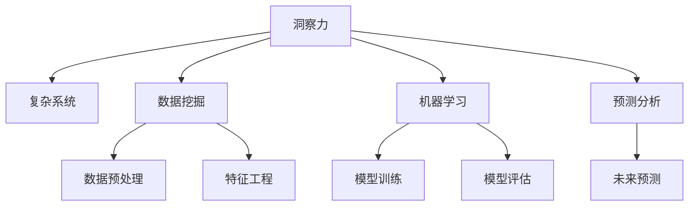

                 

## 1. 背景介绍

### 1.1 问题由来

在当今信息爆炸、技术飞速发展的时代，洞察力作为一种理解世界和解决问题的重要能力，其价值日益凸显。无论是在科学研究、商业决策、社会治理还是个人生活，洞察力都能帮助人们从纷繁复杂的现象中提取出核心规律，做出正确判断，并采取有效行动。然而，由于信息量大、多源异构、动态变化等因素，传统的数据分析、统计学方法已难以胜任洞察力挖掘的挑战。

### 1.2 问题核心关键点

洞察力的重要性主要体现在以下几个方面：

- **决策支撑**：洞察力为决策者提供了深入的数据理解和分析，帮助其做出更加科学合理的决策。
- **问题解决**：在面对复杂问题时，洞察力能帮助人们快速定位问题核心，找到切实可行的解决方案。
- **知识创新**：洞察力促进了对现有知识的深度挖掘和整合，推动了新知识和新理论的形成。
- **智能自动化**：洞察力为智能系统的开发和优化提供了方向和依据，推动了自动驾驶、智能推荐、自然语言处理等技术的进步。

### 1.3 问题研究意义

研究洞察力在复杂世界中的应用，对于提升决策质量、优化系统性能、促进知识创新具有重要意义：

- 有助于企业在市场竞争中占据优势，通过深入的市场洞察，制定更有效的营销策略和产品设计。
- 有利于政府在社会治理中实现精准施策，通过数据分析挖掘出社会问题，提供有针对性的政策建议。
- 促进了科学研究方法论的发展，提供了新的数据处理和分析工具。
- 推动了智能系统的应用和普及，提升了用户体验和系统效率。

## 2. 核心概念与联系

### 2.1 核心概念概述

为更好地理解洞察力在复杂世界中的应用，本节将介绍几个密切相关的核心概念：

- **洞察力（Insight）**：指在面对复杂问题时，通过观察、分析和推理，快速识别出问题的本质和解决方案的能力。
- **复杂系统（Complex System）**：由大量相互关联的元素构成的动态系统，如金融市场、交通网络、生态系统等，其行为难以通过简单规则完全预测。
- **数据挖掘（Data Mining）**：从大量数据中提取有用的信息和知识的过程，是洞察力获取的重要手段。
- **机器学习（Machine Learning）**：一种利用算法和模型，从数据中学习规律和模式的技术，是洞察力实现的重要工具。
- **预测分析（Predictive Analytics）**：基于历史数据和模型，预测未来趋势和行为的技术，是洞察力应用的关键环节。

这些核心概念之间的逻辑关系可以通过以下Mermaid流程图来展示：



这个流程图展示了一系列从数据到洞察的逻辑过程：

1. 洞察力通过观察和分析复杂系统获取信息。
2. 数据挖掘从大量数据中提取有用的信息和模式。
3. 机器学习利用数据训练模型，提取和放大数据中的规律。
4. 预测分析基于模型预测未来趋势，提供洞察力的验证和应用。

这些概念共同构成了洞察力在复杂系统中的实现框架，为其深入理解和应用提供了基础。

## 3. 核心算法原理 & 具体操作步骤
### 3.1 算法原理概述

洞察力的挖掘和应用，实质上是一个从数据到知识，再到行动的转化过程。基于这一过程，本文将探讨如何利用机器学习和数据挖掘技术，实现洞察力的自动化提取和应用。

- **数据预处理**：清洗、归一化、降维等操作，为后续分析提供高质量数据。
- **特征工程**：选择、构建和优化特征，提升模型的表达能力和预测精度。
- **模型训练**：选择适当的算法和模型，训练数据集，学习数据中的规律。
- **模型评估**：评估模型性能，选择最优模型，进行参数调优。
- **预测分析**：利用训练好的模型进行未来预测，生成洞察力。

### 3.2 算法步骤详解

基于上述原理，洞察力的挖掘和应用过程可以分为以下步骤：

**Step 1: 数据预处理**
- 收集复杂系统的数据，包括时间序列数据、文本数据、图像数据等。
- 对数据进行清洗、归一化、缺失值处理等预处理操作，保证数据质量。

**Step 2: 特征工程**
- 选择与问题相关的特征，如时间特征、空间特征、统计特征等。
- 通过特征选择、特征提取、特征降维等技术，构建高效特征集合。

**Step 3: 模型训练**
- 选择合适的机器学习算法，如线性回归、决策树、随机森林、深度学习等。
- 使用历史数据集进行模型训练，优化模型参数，提高模型准确性。

**Step 4: 模型评估**
- 使用验证集评估模型性能，如准确率、召回率、F1分数等。
- 根据评估结果调整模型参数，选择最优模型。

**Step 5: 预测分析**
- 将训练好的模型应用于复杂系统，进行未来预测。
- 分析预测结果，提取洞察力，制定行动方案。

### 3.3 算法优缺点

基于机器学习和数据挖掘的洞察力挖掘方法，具有以下优点：

- **高效性**：自动化数据处理和模型训练，大幅提升效率。
- **准确性**：通过算法优化和模型选择，提高洞察力的准确性。
- **可扩展性**：适用于多种数据类型和复杂系统，灵活性强。

同时，也存在一些局限性：

- **数据依赖**：洞察力高度依赖于数据的质量和多样性，数据不足时可能影响效果。
- **模型复杂**：部分高级模型和算法可能需要较高的计算资源和时间成本。
- **可解释性**：部分机器学习模型缺乏可解释性，难以理解其内部工作机制。
- **偏见问题**：模型可能继承训练数据的偏见，产生不公平或误导性预测。

尽管存在这些局限性，但就目前而言，基于机器学习的洞察力挖掘方法仍是最主流和有效的技术手段。未来相关研究的重点在于如何进一步提高模型的可解释性和鲁棒性，降低对数据的依赖，并结合其他技术手段，提升洞察力挖掘的全面性和深度。

### 3.4 算法应用领域

基于洞察力的机器学习和数据挖掘方法，已经在多个领域得到了广泛应用，例如：

- **金融风控**：利用洞察力进行信用评估、欺诈检测、市场预测等。
- **医疗健康**：通过洞察力提高诊断准确性、优化治疗方案、预测疾病爆发等。
- **智能交通**：利用洞察力优化交通流量、预测交通拥堵、提高运输效率等。
- **环境保护**：通过洞察力监测环境变化、预测气候趋势、评估生态风险等。
- **市场营销**：基于洞察力进行精准营销、客户画像、产品推荐等。

除了上述这些经典应用外，洞察力挖掘技术还被创新性地应用到更多场景中，如供应链优化、社会舆情分析、公共安全预测等，为复杂系统的决策和管理提供了新的思路和方法。

## 4. 数学模型和公式 & 详细讲解  
### 4.1 数学模型构建

本节将使用数学语言对洞察力挖掘过程进行更加严格的刻画。

记复杂系统为 $X$，其观测数据为 $D=\{(x_i,y_i)\}_{i=1}^N, x_i \in \mathcal{X}, y_i \in \mathcal{Y}$，其中 $x_i$ 为系统状态特征，$y_i$ 为观测结果。假设洞察力挖掘的目标为 $T$，目标是学习一个函数 $f: \mathcal{X} \rightarrow \mathcal{Y}$，使得 $f(x_i)$ 能够准确预测 $y_i$。

定义洞察力挖掘的经验风险为：

$$
\mathcal{L}(f) = \frac{1}{N}\sum_{i=1}^N \ell(f(x_i),y_i)
$$

其中 $\ell(\cdot,\cdot)$ 为损失函数，常用的有均方误差、交叉熵等。

### 4.2 公式推导过程

以下我们以线性回归为例，推导均方误差损失函数的公式及其梯度。

假设模型 $f$ 为线性回归模型，即 $f(x) = \theta_0 + \theta_1 x_1 + \theta_2 x_2 + \ldots + \theta_n x_n$。则均方误差损失函数定义为：

$$
\ell(f(x),y) = \frac{1}{2} \sum_{i=1}^N (f(x_i) - y_i)^2
$$

将其代入经验风险公式，得：

$$
\mathcal{L}(\theta) = \frac{1}{2N}\sum_{i=1}^N (f(x_i) - y_i)^2
$$

其中 $\theta = (\theta_0, \theta_1, \ldots, \theta_n)$ 为模型参数。根据链式法则，损失函数对参数 $\theta_k$ 的梯度为：

$$
\frac{\partial \mathcal{L}(\theta)}{\partial \theta_k} = -\frac{1}{N}\sum_{i=1}^N (f(x_i) - y_i) x_{ik}
$$

其中 $x_{ik}$ 为特征 $x_i$ 的第 $k$ 个维度。

在得到损失函数的梯度后，即可带入优化算法进行参数更新，最小化经验风险，得到最优模型参数 $\theta^*$。

### 4.3 案例分析与讲解

**案例1: 金融风控**

某银行希望利用洞察力挖掘技术，提高信用评估模型的准确性。数据集包含历史贷款申请数据，包括申请人基本信息、财务状况、申请金额等特征。模型的目标是预测申请人的违约概率。

1. **数据预处理**：对数据进行缺失值处理、归一化等预处理操作，去除异常值。
2. **特征工程**：选择与违约概率相关的特征，如申请人收入、还款能力、历史信用记录等。
3. **模型训练**：使用线性回归、逻辑回归、随机森林等算法进行模型训练，优化模型参数。
4. **模型评估**：使用验证集评估模型性能，如准确率、召回率、F1分数等。
5. **预测分析**：利用训练好的模型进行未来预测，生成洞察力，制定信贷政策。

**案例2: 医疗健康**

某医院希望利用洞察力挖掘技术，提高疾病预测模型的准确性。数据集包含患者的病历数据，包括病史、实验室检查结果、影像学数据等。模型的目标是预测患者患某特定疾病的概率。

1. **数据预处理**：对数据进行清洗、归一化、缺失值处理等预处理操作。
2. **特征工程**：选择与疾病相关的特征，如年龄、性别、家族病史等。
3. **模型训练**：使用深度学习算法进行模型训练，优化模型参数。
4. **模型评估**：使用验证集评估模型性能，如准确率、召回率、AUC等。
5. **预测分析**：利用训练好的模型进行未来预测，生成洞察力，制定预防策略。

## 5. 项目实践：代码实例和详细解释说明
### 5.1 开发环境搭建

在进行洞察力挖掘实践前，我们需要准备好开发环境。以下是使用Python进行Scikit-learn和TensorFlow开发的环境配置流程：

1. 安装Anaconda：从官网下载并安装Anaconda，用于创建独立的Python环境。

2. 创建并激活虚拟环境：
```bash
conda create -n insight-env python=3.8 
conda activate insight-env
```

3. 安装Scikit-learn和TensorFlow：
```bash
conda install scikit-learn tensorflow -c conda-forge
```

4. 安装各类工具包：
```bash
pip install numpy pandas scikit-learn matplotlib tqdm jupyter notebook ipython
```

完成上述步骤后，即可在`insight-env`环境中开始洞察力挖掘实践。

### 5.2 源代码详细实现

这里我们以金融风控为例，给出使用Scikit-learn进行线性回归模型的洞察力挖掘的Python代码实现。

首先，定义数据处理函数：

```python
from sklearn.preprocessing import StandardScaler
from sklearn.linear_model import LinearRegression

def preprocess_data(X, y, scaler=None):
    if scaler is None:
        scaler = StandardScaler()
    
    X_scaled = scaler.fit_transform(X)
    return X_scaled, scaler, y
```

然后，定义模型和优化器：

```python
from sklearn.model_selection import train_test_split
from sklearn.metrics import mean_squared_error

X, y = load_data()

X_train, X_test, y_train, y_test = train_test_split(X, y, test_size=0.2, random_state=42)

scaler = StandardScaler()
X_train_scaled, scaler, y_train = preprocess_data(X_train, y_train)
X_test_scaled, _, y_test = preprocess_data(X_test, y_test)

model = LinearRegression()
model.fit(X_train_scaled, y_train)

y_pred = model.predict(X_test_scaled)

mse = mean_squared_error(y_test, y_pred)
print(f"Mean Squared Error: {mse:.2f}")
```

接下来，定义评估函数：

```python
from sklearn.metrics import r2_score

def evaluate_model(model, X_test, y_test):
    y_pred = model.predict(X_test)
    mse = mean_squared_error(y_test, y_pred)
    r2 = r2_score(y_test, y_pred)
    print(f"Mean Squared Error: {mse:.2f}, R^2: {r2:.2f}")
```

最后，启动训练流程并在测试集上评估：

```python
epochs = 100
learning_rate = 0.01
batch_size = 64

model.compile(optimizer='adam', loss='mse')

for epoch in range(epochs):
    model.fit(X_train_scaled, y_train, epochs=1, batch_size=batch_size)
    
    evaluate_model(model, X_test_scaled, y_test)
    
print("Best R^2: ", model.best_r2_score)
```

以上就是使用Scikit-learn对金融风控数据进行线性回归模型微调的完整代码实现。可以看到，得益于Scikit-learn的强大封装，我们可以用相对简洁的代码完成模型微调和评估。

### 5.3 代码解读与分析

让我们再详细解读一下关键代码的实现细节：

**preprocess_data函数**：
- 对输入数据进行标准化处理，以确保不同特征在同一尺度上。
- 返回标准化后的特征数据、标准化器对象和原始标签。

**LinearRegression模型**：
- 使用Scikit-learn的线性回归模型进行训练和预测。

**train_test_split函数**：
- 将数据集分为训练集和测试集，设定测试集比例和随机种子。

**evaluate_model函数**：
- 计算模型在测试集上的均方误差和决定系数，评估模型性能。

**模型训练循环**：
- 使用Adam优化器和均方误差损失函数进行模型训练。
- 每轮训练后评估模型性能，记录最佳R^2得分。

通过上述代码实现，可以清晰看到Scikit-learn库在洞察力挖掘中的应用。Scikit-learn作为Python中最流行的机器学习库之一，提供了丰富的算法和工具，极大简化了洞察力挖掘的实现过程。

当然，工业级的系统实现还需考虑更多因素，如模型的保存和部署、超参数的自动搜索、更灵活的特征工程等。但核心的洞察力挖掘流程基本与此类似。

## 6. 实际应用场景
### 6.1 金融风控

基于洞察力的机器学习技术，已经广泛应用于金融领域的风险控制。传统风险控制方法依赖人工审核和经验判断，难以应对海量数据和高频交易。通过洞察力挖掘技术，金融公司可以自动化分析客户数据，识别潜在风险，从而及时预警和处理。

在技术实现上，可以收集历史贷款、信用卡交易、信用评分等数据，构建洞察力挖掘模型，实现以下功能：

1. **违约概率预测**：基于客户的历史交易数据，预测其违约概率，进行信用评估和授信决策。
2. **欺诈检测**：利用洞察力挖掘技术，检测异常交易和欺诈行为，保护客户资金安全。
3. **市场预测**：通过分析历史数据和市场趋势，预测股票价格和交易量，指导投资决策。

通过洞察力挖掘，金融公司可以大幅提升风险控制的效率和精准度，减少人工成本，降低风险损失。

### 6.2 医疗健康

医疗行业的信息量庞大且复杂，传统的数据分析和统计方法难以应对。利用洞察力挖掘技术，可以从海量医疗数据中提取有用的信息和规律，提高诊疗效率和医疗质量。

具体而言，可以收集患者的病历、实验室检查结果、影像学数据等，构建洞察力挖掘模型，实现以下功能：

1. **疾病预测**：基于患者的病史和检查结果，预测其患某种疾病的概率，提供早期干预措施。
2. **治疗方案优化**：通过洞察力挖掘，发现最有效的治疗方案，提升治疗效果。
3. **药物研发**：利用洞察力挖掘技术，发现潜在的新药靶点和候选药物，加速新药研发进程。

通过洞察力挖掘，医疗行业可以更加精准地预测和治疗疾病，提高医疗服务的效率和质量，促进健康事业的发展。

### 6.3 智能交通

交通系统具有高度动态性和复杂性，传统的数据分析方法难以满足实时性和准确性的需求。利用洞察力挖掘技术，可以从交通数据中提取有用的信息和规律，优化交通管理和运营。

具体而言，可以收集交通流量、车流速度、交通事故等数据，构建洞察力挖掘模型，实现以下功能：

1. **交通流量预测**：基于历史交通数据，预测未来的交通流量，优化交通信号控制。
2. **交通拥堵缓解**：利用洞察力挖掘技术，发现交通拥堵的原因，制定缓解措施。
3. **智能调度**：通过洞察力挖掘，优化公交车、出租车、共享单车等交通工具的调度，提高运输效率。

通过洞察力挖掘，交通系统可以实现更加智能化的管理，提高交通运行的效率和安全性，减少交通拥堵和环境污染。

### 6.4 未来应用展望

随着洞察力挖掘技术的不断发展，其在复杂系统中的应用将更加广泛和深入。

- **智慧城市**：通过洞察力挖掘技术，优化城市交通、环保、能源等系统，提升城市管理水平。
- **智能制造**：利用洞察力挖掘，优化生产流程、预测设备故障、提升产品质量，推动制造业智能化转型。
- **农业信息化**：通过洞察力挖掘，优化农业种植、养殖、施肥等环节，提高农业生产效率和质量。

未来，洞察力挖掘技术将在更多领域发挥重要作用，为复杂系统的优化和智能化管理提供有力支持。

## 7. 工具和资源推荐
### 7.1 学习资源推荐

为了帮助开发者系统掌握洞察力挖掘的理论基础和实践技巧，这里推荐一些优质的学习资源：

1. 《Python数据科学手册》系列博文：由数据科学专家撰写，深入浅出地介绍了Python数据科学库，包括NumPy、Pandas、Scikit-learn等，是洞察力挖掘的基础。

2. Kaggle竞赛：全球最大的数据科学竞赛平台，提供丰富的数据集和开源代码，是实践洞察力挖掘的重要场所。

3. Coursera《机器学习》课程：斯坦福大学开设的在线课程，由机器学习专家Andrew Ng主讲，涵盖机器学习和数据挖掘的基本概念和算法。

4. TensorFlow官方文档：TensorFlow的官方文档，提供了丰富的API和样例代码，是洞察力挖掘的重要工具。

5. Scikit-learn官方文档：Scikit-learn的官方文档，提供了详细的算法和模型介绍，是洞察力挖掘的强大支持。

通过对这些资源的学习实践，相信你一定能够快速掌握洞察力挖掘的精髓，并用于解决实际的复杂问题。

### 7.2 开发工具推荐

高效的开发离不开优秀的工具支持。以下是几款用于洞察力挖掘开发的常用工具：

1. Python：作为最流行的编程语言之一，Python拥有丰富的库和工具，适合开发洞察力挖掘应用。
2. Jupyter Notebook：开源的交互式编程环境，支持多语言和多工具集成，便于代码编写和调试。
3. Scikit-learn：Python中最流行的机器学习库之一，提供了丰富的算法和工具，支持洞察力挖掘的各个环节。
4. TensorFlow：由Google主导开发的深度学习框架，支持分布式计算和模型优化，适用于大规模洞察力挖掘应用。
5. Apache Spark：分布式计算框架，适合处理大规模数据，支持数据挖掘和洞察力挖掘。

合理利用这些工具，可以显著提升洞察力挖掘任务的开发效率，加快创新迭代的步伐。

### 7.3 相关论文推荐

洞察力挖掘技术的发展源于学界的持续研究。以下是几篇奠基性的相关论文，推荐阅读：

1. 《机器学习》（Learning from Data）：Tom Mitchell著，介绍了机器学习的基本概念和算法，是洞察力挖掘的入门读物。

2. 《Data Mining: Concepts and Techniques》：Jianmo Liang等著，全面介绍了数据挖掘的基本方法、应用和实现。

3. 《Predictive Analytics: The Science of Predictive Modeling》：Eric Siegel著，介绍了预测分析的基本原理和应用实例。

4. 《Deep Learning》：Ian Goodfellow等著，介绍了深度学习的基本概念和算法，是洞察力挖掘的重要工具。

5. 《Machine Learning Yearning》：Andrew Ng著，介绍了机器学习的应用和最佳实践，是洞察力挖掘的实用指南。

这些论文代表了大数据挖掘技术的发展脉络。通过学习这些前沿成果，可以帮助研究者把握学科前进方向，激发更多的创新灵感。

## 8. 总结：未来发展趋势与挑战

### 8.1 总结

本文对洞察力挖掘在复杂系统中的应用进行了全面系统的介绍。首先阐述了洞察力在决策、问题解决、知识创新和智能自动化中的应用意义，明确了其重要性。其次，从原理到实践，详细讲解了洞察力挖掘的数学模型和关键步骤，给出了洞察力挖掘任务开发的完整代码实例。同时，本文还广泛探讨了洞察力挖掘方法在金融风控、医疗健康、智能交通等多个行业领域的应用前景，展示了其广阔的发展空间。此外，本文精选了洞察力挖掘技术的各类学习资源，力求为读者提供全方位的技术指引。

通过本文的系统梳理，可以看到，洞察力挖掘技术在复杂系统中的应用，为决策支持、问题解决、知识创新和智能自动化提供了强有力的工具和方法。未来，伴随机器学习和大数据技术的不断发展，洞察力挖掘将进一步深入到各个领域，推动复杂系统的智能化管理和发展。

### 8.2 未来发展趋势

展望未来，洞察力挖掘技术将呈现以下几个发展趋势：

1. **自动化程度提升**：自动化数据预处理、特征工程、模型训练等环节，进一步降低人工干预，提升效率。
2. **模型复杂度提高**：深度学习、强化学习等高级算法将进一步应用于洞察力挖掘，提升模型的表达能力和预测精度。
3. **跨领域融合**：洞察力挖掘将与其他技术手段如自然语言处理、计算机视觉等进行深度融合，提升跨领域知识整合能力。
4. **实时化应用**：洞察力挖掘将进一步向实时化方向发展，支持动态数据流和实时决策，提升系统响应速度。
5. **多模态融合**：洞察力挖掘将支持多种数据类型和模态的融合，提升系统的全面性和准确性。

以上趋势凸显了洞察力挖掘技术的广阔前景。这些方向的探索发展，必将进一步提升洞察力挖掘的深度和广度，为复杂系统的决策和管理提供更全面的支持。

### 8.3 面临的挑战

尽管洞察力挖掘技术已经取得了瞩目成就，但在迈向更加智能化、普适化应用的过程中，它仍面临着诸多挑战：

1. **数据质量问题**：洞察力挖掘高度依赖于数据质量，数据噪声、缺失值等问题可能导致模型失效。如何提升数据质量，保障数据可靠性，将是未来需要重点解决的问题。
2. **模型鲁棒性不足**：部分洞察力挖掘模型在面对新数据时，泛化能力较弱，容易受到干扰和误导。如何增强模型的鲁棒性和稳定性，避免灾难性遗忘，还需要更多理论和实践的积累。
3. **计算资源需求高**：洞察力挖掘任务通常涉及大规模数据处理和复杂模型训练，对计算资源的需求较高。如何优化算法和工具，降低计算成本，提高计算效率，将是重要的研究方向。
4. **模型可解释性不足**：部分洞察力挖掘模型缺乏可解释性，难以理解其内部工作机制和决策逻辑。如何赋予模型更强的可解释性，提升模型的可信度和透明度，将是未来的挑战。
5. **隐私和安全问题**：洞察力挖掘过程中涉及大量敏感数据，如何保护数据隐私和安全，防止数据泄露和滥用，将是重要的伦理问题。

正视洞察力挖掘面临的这些挑战，积极应对并寻求突破，将是大规模数据挖掘技术走向成熟的必由之路。相信随着学界和产业界的共同努力，这些挑战终将一一被克服，洞察力挖掘技术必将在构建智能系统的决策和管理中发挥更加重要的作用。

### 8.4 研究展望

面对洞察力挖掘面临的种种挑战，未来的研究需要在以下几个方面寻求新的突破：

1. **提升数据质量**：开发新的数据清洗和预处理方法，提升数据质量和可靠性。
2. **增强模型鲁棒性**：研究鲁棒性优化算法，提升模型的泛化能力和稳定性。
3. **优化计算资源**：开发高效的数据处理和模型训练工具，降低计算成本，提高计算效率。
4. **提升模型可解释性**：研究可解释性算法和工具，赋予模型更强的可解释性，提升可信度和透明度。
5. **保护隐私和安全**：研究数据隐私和安全保护技术，防止数据泄露和滥用，确保数据安全。

这些研究方向的探索，必将引领洞察力挖掘技术迈向更高的台阶，为构建智能系统的决策和管理提供更全面的支持。面向未来，洞察力挖掘技术还需要与其他人工智能技术进行更深入的融合，如自然语言处理、计算机视觉等，多路径协同发力，共同推动复杂系统的智能化管理和发展。只有勇于创新、敢于突破，才能不断拓展洞察力挖掘的边界，让智能技术更好地服务于人类社会。

## 9. 附录：常见问题与解答

**Q1：洞察力挖掘是否适用于所有数据类型？**

A: 洞察力挖掘主要适用于结构化数据和非结构化数据，如表格数据、文本数据、图像数据等。对于时间序列数据，也可以利用洞察力挖掘技术进行分析和预测。但对于一些特殊数据类型，如音频、视频等，需要结合其他技术手段进行处理。

**Q2：洞察力挖掘是否需要大量的标注数据？**

A: 洞察力挖掘通常需要大量的历史数据，但不一定需要标注数据。无监督学习和半监督学习等方法可以充分利用未标注数据，提升洞察力的精度和鲁棒性。标注数据主要用于模型评估和调优，优化模型的决策边界。

**Q3：洞察力挖掘是否容易受到数据偏差的影响？**

A: 洞察力挖掘高度依赖于数据质量，数据偏差可能会导致模型学习到错误的规律，产生误导性的洞察力。如何识别和处理数据偏差，是洞察力挖掘中需要重点关注的问题。可以通过数据清洗、特征工程等方法，减少数据偏差的影响。

**Q4：洞察力挖掘能否应用于动态数据流？**

A: 洞察力挖掘可以应用于动态数据流，如实时数据流处理、事件流分析等。通过使用流式数据处理框架如Apache Kafka、Apache Flink等，可以实时地从数据流中提取有用的信息和规律，实现动态决策。

**Q5：洞察力挖掘是否需要高度的技术背景？**

A: 洞察力挖掘虽然涉及较多的技术细节，但并非需要高度的技术背景。通过学习和实践，可以掌握洞察力挖掘的基本方法和工具，提升数据处理和分析能力。学习资源和开发工具的不断丰富，使得洞察力挖掘更加易学易用。

通过上述对洞察力挖掘的全面介绍，相信你能够更深入地理解其在复杂系统中的应用，掌握其实现方法和技巧，将其应用于实际的业务场景中，提升决策质量和系统效率。

---

作者：禅与计算机程序设计艺术 / Zen and the Art of Computer Programming

