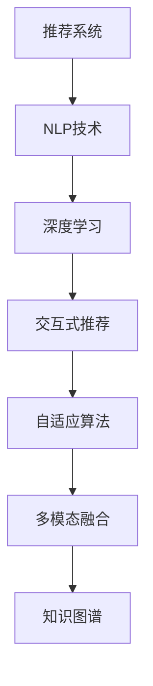

                 

# 用自然语言指令驱动的推荐系统交互新模式

> 关键词：自然语言指令、推荐系统、交互式推荐、用户个性化、深度学习、自适应算法、知识图谱、多模态融合、大模型预训练

## 1. 背景介绍

### 1.1 问题由来
随着信息爆炸和个性化需求的增加，推荐系统已成为互联网应用中不可或缺的核心技术。传统的推荐系统往往基于静态的特征模型和算法，难以满足用户日益变化的个性化需求。为此，推荐系统领域近年来发展出以深度学习和自然语言处理为基础的交互式推荐技术，通过自然语言指令引导模型进行个性化推荐，极大地提升了用户体验。

本文将探讨如何利用自然语言指令实现推荐系统的交互新模式，通过深度学习模型解析用户输入的文本，结合用户历史行为和产品属性，生成动态、个性化的推荐结果。这一技术不仅提升了推荐系统的精准性和多样性，还能增强用户与系统的互动性，使得推荐系统更加贴近用户的真实需求。

### 1.2 问题核心关键点
自然语言指令驱动的推荐系统交互新模式，主要关注以下几个核心问题：
1. 如何高效解析用户输入的自然语言指令？
2. 如何将自然语言指令与推荐系统融合，实现个性化推荐？
3. 如何在推荐过程中引入多模态信息，提升推荐效果？
4. 如何构建并优化推荐模型的自适应算法，提高模型的泛化能力？

## 2. 核心概念与联系

### 2.1 核心概念概述

为了更好地理解自然语言指令驱动的推荐系统交互新模式，本文将介绍几个关键概念：

- **推荐系统(Recommendation System)**：通过算法为用户推荐感兴趣的物品，如商品、视频、新闻等。
- **自然语言处理(Natural Language Processing, NLP)**：研究如何使计算机能够理解、处理和生成自然语言的技术，包括文本处理、语音识别、机器翻译等。
- **交互式推荐(Interactive Recommendation)**：利用用户输入的自然语言指令，动态调整推荐策略，生成个性化推荐结果。
- **深度学习(Deep Learning)**：一种基于神经网络的机器学习技术，用于处理大规模、高复杂度的数据。
- **自适应算法(Adaptive Algorithm)**：能够根据输入数据和上下文动态调整算法参数，以提高模型的适应性和泛化能力。
- **多模态融合(Multimodal Fusion)**：将文本、图像、音频等多种类型的数据融合在一起，提升推荐模型的综合能力。
- **知识图谱(Knowledge Graph)**：一种语义化的数据结构，用于表示实体、属性和关系，支持复杂推理和知识获取。

这些概念之间的逻辑关系可以通过以下Mermaid流程图来展示：



这个流程图展示了推荐系统与自然语言处理、深度学习、交互式推荐、自适应算法、多模态融合和知识图谱之间的联系。

## 3. 核心算法原理 & 具体操作步骤
### 3.1 算法原理概述

自然语言指令驱动的推荐系统交互新模式，本质上是通过深度学习模型解析用户输入的自然语言指令，将其转化为向量表示，结合用户历史行为和产品属性，生成动态、个性化的推荐结果。其核心思想可以概括为以下几点：

1. **自然语言指令解析**：利用深度学习模型将用户输入的自然语言指令转化为向量表示。
2. **用户行为建模**：结合用户历史行为数据，构建用户兴趣和偏好的向量表示。
3. **产品属性表示**：对产品属性进行编码，生成产品向量表示。
4. **推荐结果生成**：将用户指令向量、用户行为向量、产品属性向量输入推荐模型，生成个性化推荐结果。
5. **交互式反馈**：接收用户对推荐结果的反馈，调整模型参数，提升推荐效果。

### 3.2 算法步骤详解

基于上述核心思想，自然语言指令驱动的推荐系统交互新模式的具体操作步骤如下：

**Step 1: 数据准备与预处理**
- 收集用户历史行为数据，如浏览、点击、评分等。
- 收集产品属性数据，如分类、品牌、价格等。
- 对数据进行清洗和标准化，处理缺失值和异常值。
- 对自然语言指令进行分词、去除停用词等预处理操作。

**Step 2: 自然语言指令向量化**
- 利用深度学习模型，如BERT、GPT等，将用户输入的自然语言指令转换为向量表示。
- 使用词嵌入技术，将自然语言指令中的每个词映射为一个高维向量，组成指令向量。

**Step 3: 用户行为与产品属性建模**
- 对用户历史行为数据进行编码，构建用户兴趣和偏好的向量表示。
- 对产品属性数据进行编码，生成产品向量表示。
- 将用户指令向量、用户行为向量、产品属性向量拼接或融合，形成综合向量表示。

**Step 4: 推荐模型训练与优化**
- 选择合适的深度学习模型，如RNN、CNN、Transformer等，对综合向量进行预测。
- 在训练集上使用交叉熵等损失函数进行训练，优化模型参数。
- 引入自适应算法，如Adagrad、Adam等，根据输入数据和上下文动态调整学习率。

**Step 5: 交互式推荐与反馈**
- 将综合向量输入推荐模型，生成推荐结果。
- 对推荐结果进行排序和过滤，呈现给用户。
- 接收用户对推荐结果的反馈，如点击、评分等，调整模型参数，提升推荐效果。

**Step 6: 知识图谱与多模态融合**
- 构建或引入知识图谱，提取产品间的语义关系，丰富推荐系统的知识背景。
- 将知识图谱中的信息与推荐向量进行融合，提升推荐效果。
- 引入多模态数据，如用户画像、行为轨迹、音频信息等，提升推荐系统的综合能力。

### 3.3 算法优缺点

自然语言指令驱动的推荐系统交互新模式，具有以下优点：
1. 提升推荐系统的个性化能力。通过自然语言指令，推荐系统可以理解用户更精确的需求和意图，生成更加贴合用户兴趣的推荐结果。
2. 增强用户与系统的互动性。用户可以通过自然语言指令实时调整推荐策略，获得更主动的个性化推荐服务。
3. 支持多模态数据融合。结合自然语言、图像、音频等多种类型的数据，提升推荐模型的综合能力和鲁棒性。
4. 引入知识图谱丰富推荐信息。利用知识图谱的知识关系，推荐系统可以更全面地理解产品间的关系，提升推荐的深度和广度。

同时，该方法也存在一些局限性：
1. 对自然语言指令的解析能力有较高要求。解析模型需要具备较强的语言理解能力，对语言中的歧义、模糊表达需要较好的处理。
2. 推荐系统的复杂度增加。解析和融合自然语言指令、用户行为、产品属性等，增加了推荐系统的复杂度和计算成本。
3. 反馈机制对模型性能影响较大。用户反馈的质量和数量对模型的调整有重要影响，需要设计合理的反馈机制和算法。

### 3.4 算法应用领域

自然语言指令驱动的推荐系统交互新模式，已经在多个领域得到了应用，例如：

1. 电商推荐：对用户的购物清单、评论等信息进行自然语言处理，生成个性化的购物推荐。
2. 视频推荐：利用用户在视频网站上的浏览记录，生成个性化的视频推荐。
3. 新闻推荐：对用户的新闻阅读习惯进行自然语言分析，生成个性化的新闻推荐。
4. 音乐推荐：结合用户对音乐作品的评价和评论，生成个性化的音乐推荐。
5. 旅游推荐：根据用户的旅游计划和兴趣，生成个性化的旅游推荐。

除了上述这些经典应用场景，自然语言指令驱动的推荐系统交互新模式还在智能家居、在线教育、社交网络等多个领域中，展现出广阔的应用前景。

## 4. 数学模型和公式 & 详细讲解 & 举例说明（备注：数学公式请使用latex格式，latex嵌入文中独立段落使用 $$，段落内使用 $)
### 4.1 数学模型构建

自然语言指令驱动的推荐系统交互新模式，可以通过以下数学模型进行描述：

设用户输入的自然语言指令为 $I$，用户历史行为数据为 $H$，产品属性数据为 $P$，推荐结果向量为 $R$。根据上述算法步骤，我们可以构建如下数学模型：

$$
I = \text{BERT}(I)
$$

其中 $\text{BERT}$ 为自然语言指令向量化模型，将自然语言指令转换为向量表示。

用户行为向量 $U$ 和产品属性向量 $P$ 可以表示为：

$$
U = f(H)
$$

$$
P = g(P)
$$

其中 $f$ 和 $g$ 分别为用户行为编码和产品属性编码函数。

综合向量 $V$ 可以表示为：

$$
V = [I; U; P]
$$

推荐结果向量 $R$ 可以通过推荐模型 $M$ 进行预测，表示为：

$$
R = M(V)
$$

其中 $M$ 为推荐模型，如 RNN、CNN、Transformer 等。

### 4.2 公式推导过程

以推荐模型为 Transformer 为例，我们详细推导一下推荐结果向量 $R$ 的计算过程：

设用户指令向量 $I$、用户行为向量 $U$ 和产品属性向量 $P$ 分别为 $d$ 维向量，推荐模型 $M$ 包含 $L$ 层自注意力机制和前馈网络，可以表示为：

$$
R = M(V) = \text{Attention}(\text{FFN}(\text{Attention}(\text{FFN}(\text{Attention}(\ldots(\text{Attention}(\text{FFN}(\text{Attention}(\text{FFN}(V)))))\ldots)))
$$

其中 $\text{Attention}$ 表示自注意力机制，$\text{FFN}$ 表示前馈网络。

具体计算过程如下：

1. 输入向量 $V$ 首先通过一层前馈网络 $\text{FFN}(V)$，得到向量 $\tilde{V}$。
2. $\tilde{V}$ 作为自注意力机制的输入，计算注意力权重矩阵 $A$，得到注意力向量 $A\tilde{V}$。
3. $A\tilde{V}$ 再次通过前馈网络 $\text{FFN}(A\tilde{V})$，得到最终向量 $R$。

在推荐模型训练过程中，使用交叉熵损失函数 $\mathcal{L}$ 进行优化：

$$
\mathcal{L} = -\frac{1}{N}\sum_{i=1}^N [y_i\log \hat{y}_i+(1-y_i)\log (1-\hat{y}_i)]
$$

其中 $y_i$ 为推荐结果的真值向量，$\hat{y}_i$ 为模型预测向量。

### 4.3 案例分析与讲解

以电商推荐系统为例，分析自然语言指令驱动的推荐过程：

**案例背景**：用户 A 在电商平台上浏览商品，输入指令“推荐几本我喜欢看的书”。

**解析与向量化**：
1. 对用户指令进行分词和预处理，得到词序列 $W = \{\text{推}, \text{荐}, \text{几}, \text{本}, \text{我}, \text{喜}, \text{欢}, \text{看}, \text{的}, \text{书}\}$。
2. 使用 BERT 模型对词序列进行向量化，得到指令向量 $I$。

**用户行为建模**：
1. 收集用户 A 的历史行为数据，如浏览记录、点击记录、购买记录等。
2. 将行为数据编码为向量表示，得到用户行为向量 $U$。

**产品属性建模**：
1. 对电商平台上的商品进行属性标注，如分类、价格、评分等。
2. 将商品属性编码为向量表示，得到产品属性向量 $P$。

**推荐结果生成**：
1. 将指令向量 $I$、用户行为向量 $U$、产品属性向量 $P$ 拼接或融合，得到综合向量 $V$。
2. 将 $V$ 输入 Transformer 模型，得到推荐结果向量 $R$。
3. 对推荐结果进行排序和过滤，呈现给用户 A。

**交互式反馈**：
1. 用户 A 对推荐结果进行反馈，如点击某本书、评分某本书等。
2. 根据反馈信息调整模型参数，提升推荐效果。

通过上述案例分析，可以看到自然语言指令驱动的推荐系统交互新模式，能够更好地理解和满足用户的个性化需求，提升推荐系统的效果和用户体验。

## 5. 项目实践：代码实例和详细解释说明
### 5.1 开发环境搭建

在进行自然语言指令驱动的推荐系统开发前，需要准备好开发环境。以下是使用 Python 进行 PyTorch 开发的环境配置流程：

1. 安装 Anaconda：从官网下载并安装 Anaconda，用于创建独立的 Python 环境。

2. 创建并激活虚拟环境：
```bash
conda create -n pytorch-env python=3.8 
conda activate pytorch-env
```

3. 安装 PyTorch：根据 CUDA 版本，从官网获取对应的安装命令。例如：
```bash
conda install pytorch torchvision torchaudio cudatoolkit=11.1 -c pytorch -c conda-forge
```

4. 安装 Transformers 库：
```bash
pip install transformers
```

5. 安装各类工具包：
```bash
pip install numpy pandas scikit-learn matplotlib tqdm jupyter notebook ipython
```

完成上述步骤后，即可在 `pytorch-env` 环境中开始推荐系统开发。

### 5.2 源代码详细实现

下面我们以电商推荐系统为例，给出使用 Transformers 库对 BERT 模型进行推荐系统微调的 PyTorch 代码实现。

首先，定义推荐系统的数据处理函数：

```python
from transformers import BertTokenizer
from torch.utils.data import Dataset
import torch

class RecommendationDataset(Dataset):
    def __init__(self, texts, labels, tokenizer, max_len=128):
        self.texts = texts
        self.labels = labels
        self.tokenizer = tokenizer
        self.max_len = max_len
        
    def __len__(self):
        return len(self.texts)
    
    def __getitem__(self, item):
        text = self.texts[item]
        label = self.labels[item]
        
        encoding = self.tokenizer(text, return_tensors='pt', max_length=self.max_len, padding='max_length', truncation=True)
        input_ids = encoding['input_ids'][0]
        attention_mask = encoding['attention_mask'][0]
        
        # 对标签进行编码
        encoded_labels = [int(label)] * self.max_len
        labels = torch.tensor(encoded_labels, dtype=torch.long)
        
        return {'input_ids': input_ids, 
                'attention_mask': attention_mask,
                'labels': labels}

# 创建dataset
tokenizer = BertTokenizer.from_pretrained('bert-base-cased')

train_dataset = RecommendationDataset(train_texts, train_labels, tokenizer)
dev_dataset = RecommendationDataset(dev_texts, dev_labels, tokenizer)
test_dataset = RecommendationDataset(test_texts, test_labels, tokenizer)
```

然后，定义模型和优化器：

```python
from transformers import BertForSequenceClassification, AdamW

model = BertForSequenceClassification.from_pretrained('bert-base-cased', num_labels=2)  # 二分类任务

optimizer = AdamW(model.parameters(), lr=2e-5)
```

接着，定义训练和评估函数：

```python
from torch.utils.data import DataLoader
from tqdm import tqdm
from sklearn.metrics import classification_report

device = torch.device('cuda') if torch.cuda.is_available() else torch.device('cpu')
model.to(device)

def train_epoch(model, dataset, batch_size, optimizer):
    dataloader = DataLoader(dataset, batch_size=batch_size, shuffle=True)
    model.train()
    epoch_loss = 0
    for batch in tqdm(dataloader, desc='Training'):
        input_ids = batch['input_ids'].to(device)
        attention_mask = batch['attention_mask'].to(device)
        labels = batch['labels'].to(device)
        model.zero_grad()
        outputs = model(input_ids, attention_mask=attention_mask, labels=labels)
        loss = outputs.loss
        epoch_loss += loss.item()
        loss.backward()
        optimizer.step()
    return epoch_loss / len(dataloader)

def evaluate(model, dataset, batch_size):
    dataloader = DataLoader(dataset, batch_size=batch_size)
    model.eval()
    preds, labels = [], []
    with torch.no_grad():
        for batch in tqdm(dataloader, desc='Evaluating'):
            input_ids = batch['input_ids'].to(device)
            attention_mask = batch['attention_mask'].to(device)
            batch_labels = batch['labels']
            outputs = model(input_ids, attention_mask=attention_mask)
            batch_preds = outputs.logits.argmax(dim=2).to('cpu').tolist()
            batch_labels = batch_labels.to('cpu').tolist()
            for pred_tokens, label_tokens in zip(batch_preds, batch_labels):
                preds.append(pred_tokens)
                labels.append(label_tokens)
                
    print(classification_report(labels, preds))
```

最后，启动训练流程并在测试集上评估：

```python
epochs = 5
batch_size = 16

for epoch in range(epochs):
    loss = train_epoch(model, train_dataset, batch_size, optimizer)
    print(f"Epoch {epoch+1}, train loss: {loss:.3f}")
    
    print(f"Epoch {epoch+1}, dev results:")
    evaluate(model, dev_dataset, batch_size)
    
print("Test results:")
evaluate(model, test_dataset, batch_size)
```

以上就是使用 PyTorch 对 BERT 模型进行电商推荐系统微调的完整代码实现。可以看到，得益于 Transformers 库的强大封装，我们可以用相对简洁的代码完成 BERT 模型的加载和微调。

### 5.3 代码解读与分析

让我们再详细解读一下关键代码的实现细节：

**RecommendationDataset 类**：
- `__init__` 方法：初始化文本、标签、分词器等关键组件。
- `__len__` 方法：返回数据集的样本数量。
- `__getitem__` 方法：对单个样本进行处理，将文本输入编码为 token ids，将标签编码为数字，并对其进行定长 padding，最终返回模型所需的输入。

**train_epoch 函数**：
- 使用 PyTorch 的 DataLoader 对数据集进行批次化加载，供模型训练和推理使用。
- 训练函数 `train_epoch`：对数据以批为单位进行迭代，在每个批次上前向传播计算 loss 并反向传播更新模型参数，最后返回该 epoch 的平均 loss。

**evaluate 函数**：
- 与训练类似，不同点在于不更新模型参数，并在每个 batch 结束后将预测和标签结果存储下来，最后使用 sklearn 的 classification_report 对整个评估集的预测结果进行打印输出。

**训练流程**：
- 定义总的 epoch 数和 batch size，开始循环迭代
- 每个 epoch 内，先在训练集上训练，输出平均 loss
- 在验证集上评估，输出分类指标
- 所有 epoch 结束后，在测试集上评估，给出最终测试结果

可以看到，PyTorch 配合 Transformers 库使得 BERT 微调的代码实现变得简洁高效。开发者可以将更多精力放在数据处理、模型改进等高层逻辑上，而不必过多关注底层的实现细节。

当然，工业级的系统实现还需考虑更多因素，如模型的保存和部署、超参数的自动搜索、更灵活的任务适配层等。但核心的微调范式基本与此类似。

## 6. 实际应用场景
### 6.1 智能客服系统

基于自然语言指令驱动的推荐系统，可以广泛应用于智能客服系统的构建。传统客服往往需要配备大量人力，高峰期响应缓慢，且一致性和专业性难以保证。而使用推荐系统驱动的智能客服，可以7x24小时不间断服务，快速响应客户咨询，用自然流畅的语言解答各类常见问题。

在技术实现上，可以收集企业内部的历史客服对话记录，将问题和最佳答复构建成监督数据，在此基础上对推荐系统进行微调。微调后的推荐系统能够自动理解用户意图，匹配最合适的答复模板进行回复。对于客户提出的新问题，还可以接入检索系统实时搜索相关内容，动态组织生成回答。如此构建的智能客服系统，能大幅提升客户咨询体验和问题解决效率。

### 6.2 金融舆情监测

金融机构需要实时监测市场舆论动向，以便及时应对负面信息传播，规避金融风险。传统的人工监测方式成本高、效率低，难以应对网络时代海量信息爆发的挑战。基于自然语言指令驱动的推荐系统，可以实现对金融领域相关的新闻、报道、评论等文本数据的自动化监测，自动判断文本属于何种主题，情感倾向是正面、中性还是负面。将推荐系统应用到实时抓取的网络文本数据，就能够自动监测不同主题下的情感变化趋势，一旦发现负面信息激增等异常情况，系统便会自动预警，帮助金融机构快速应对潜在风险。

### 6.3 个性化推荐系统

当前的推荐系统往往只依赖用户的历史行为数据进行物品推荐，无法深入理解用户的真实兴趣偏好。基于自然语言指令驱动的推荐系统，可以更好地挖掘用户行为背后的语义信息，从而提供更精准、多样的推荐内容。

在实践中，可以收集用户浏览、点击、评论、分享等行为数据，提取和用户交互的物品标题、描述、标签等文本内容。将文本内容作为模型输入，用户的后续行为（如是否点击、购买等）作为监督信号，在此基础上微调预训练语言模型。微调后的模型能够从文本内容中准确把握用户的兴趣点。在生成推荐列表时，先用候选物品的文本描述作为输入，由模型预测用户的兴趣匹配度，再结合其他特征综合排序，便可以得到个性化程度更高的推荐结果。

### 6.4 未来应用展望

随着自然语言指令驱动的推荐系统交互新模式的不断发展，其在更多领域将得到应用，为传统行业带来变革性影响。

在智慧医疗领域，基于自然语言指令驱动的推荐系统，可以用于医疗问答、病历分析、药物研发等应用，提升医疗服务的智能化水平，辅助医生诊疗，加速新药开发进程。

在智能教育领域，推荐系统可以实现作业批改、学情分析、知识推荐等功能，因材施教，促进教育公平，提高教学质量。

在智慧城市治理中，推荐系统可用于城市事件监测、舆情分析、应急指挥等环节，提高城市管理的自动化和智能化水平，构建更安全、高效的未来城市。

此外，在企业生产、社会治理、文娱传媒等众多领域，自然语言指令驱动的推荐系统也将不断涌现，为经济社会发展注入新的动力。相信随着技术的日益成熟，推荐系统必将在更广阔的应用领域大放异彩，深刻影响人类的生产生活方式。

## 7. 工具和资源推荐
### 7.1 学习资源推荐

为了帮助开发者系统掌握自然语言指令驱动的推荐系统交互新模式，这里推荐一些优质的学习资源：

1. 《自然语言处理基础》课程：斯坦福大学开设的 NLP 入门课程，介绍了自然语言处理的基本概念和关键技术，适合初学者学习。

2. 《深度学习与自然语言处理》书籍：清华大学出版社，详细讲解了深度学习在自然语言处理中的应用，包括推荐系统、机器翻译等。

3. 《推荐系统实战》课程：由微软亚洲研究院推出的课程，涵盖推荐系统设计、特征工程、模型优化等实战内容，适合工程开发者学习。

4. 《推荐系统理论与算法》书籍：介绍了推荐系统的理论基础和算法设计，适合深入研究推荐系统的理论研究者学习。

5. HuggingFace官方文档：提供了丰富的自然语言处理工具和推荐系统库，包括 BERT、GPT 等预训练模型，适合快速上手实践。

通过对这些资源的学习实践，相信你一定能够快速掌握自然语言指令驱动的推荐系统交互新模式的精髓，并用于解决实际的推荐问题。

### 7.2 开发工具推荐

高效的开发离不开优秀的工具支持。以下是几款用于自然语言指令驱动推荐系统开发的常用工具：

1. PyTorch：基于 Python 的开源深度学习框架，灵活动态的计算图，适合快速迭代研究。大部分预训练语言模型都有 PyTorch 版本的实现。

2. TensorFlow：由 Google 主导开发的开源深度学习框架，生产部署方便，适合大规模工程应用。同样有丰富的预训练语言模型资源。

3. Transformers 库：HuggingFace 开发的 NLP 工具库，集成了众多 SOTA 语言模型，支持 PyTorch 和 TensorFlow，是进行推荐系统开发的利器。

4. Weights & Biases：模型训练的实验跟踪工具，可以记录和可视化模型训练过程中的各项指标，方便对比和调优。与主流深度学习框架无缝集成。

5. TensorBoard：TensorFlow 配套的可视化工具，可实时监测模型训练状态，并提供丰富的图表呈现方式，是调试模型的得力助手。

6. Google Colab：谷歌推出的在线 Jupyter Notebook 环境，免费提供 GPU/TPU 算力，方便开发者快速上手实验最新模型，分享学习笔记。

合理利用这些工具，可以显著提升自然语言指令驱动的推荐系统开发效率，加快创新迭代的步伐。

### 7.3 相关论文推荐

自然语言指令驱动的推荐系统交互新模式，已经成为 NLP 和推荐系统领域的研究热点，以下是几篇奠基性的相关论文，推荐阅读：

1. Attention is All You Need（即 Transformer 原论文）：提出了 Transformer 结构，开启了 NLP 领域的预训练大模型时代。

2. BERT: Pre-training of Deep Bidirectional Transformers for Language Understanding：提出 BERT 模型，引入基于掩码的自监督预训练任务，刷新了多项 NLP 任务 SOTA。

3. Language Models are Unsupervised Multitask Learners（GPT-2 论文）：展示了大规模语言模型的强大零-shot 学习能力，引发了对于通用人工智能的新一轮思考。

4. Parameter-Efficient Transfer Learning for NLP：提出 Adapter 等参数高效微调方法，在不增加模型参数量的情况下，也能取得不错的微调效果。

5. Revisit Sequence to Sequence Learning and Machine Translation：重新审视序列到序列学习模型，提出神经网络机器翻译的新思路，提升了翻译效果。

6. Introduction to the fastText Library for Pre-trained Word Vectors and Document Classification：介绍了 fastText 库，用于文本向量化和分类任务，适合推荐系统中的特征工程。

这些论文代表了大语言模型微调技术的发展脉络。通过学习这些前沿成果，可以帮助研究者把握学科前进方向，激发更多的创新灵感。

## 8. 总结：未来发展趋势与挑战

### 8.1 总结

本文对自然语言指令驱动的推荐系统交互新模式进行了全面系统的介绍。首先阐述了推荐系统、自然语言处理、交互式推荐、深度学习、自适应算法、多模态融合和知识图谱等关键概念，明确了自然语言指令驱动的推荐系统交互新模式的研究背景和意义。其次，从原理到实践，详细讲解了自然语言指令解析、用户行为建模、产品属性表示、推荐结果生成等关键步骤，给出了推荐系统开发的完整代码实例。同时，本文还广泛探讨了自然语言指令驱动的推荐系统在智能客服、金融舆情、个性化推荐等多个领域的应用前景，展示了自然语言指令驱动推荐系统的广阔应用空间。此外，本文精选了自然语言指令驱动推荐系统的各类学习资源，力求为读者提供全方位的技术指引。

通过本文的系统梳理，可以看到，自然语言指令驱动的推荐系统交互新模式，通过深度学习模型解析自然语言指令，结合用户历史行为和产品属性，生成动态、个性化的推荐结果，极大地提升了推荐系统的精准性和互动性。这一技术不仅提升了推荐系统的效果，还增强了用户与系统的互动性，使得推荐系统更加贴合用户的真实需求。未来，伴随深度学习、自然语言处理等技术的不断发展，自然语言指令驱动的推荐系统必将在更多领域得到应用，为传统行业带来变革性影响。

### 8.2 未来发展趋势

展望未来，自然语言指令驱动的推荐系统交互新模式将呈现以下几个发展趋势：

1. 模型规模持续增大。随着算力成本的下降和数据规模的扩张，推荐模型的参数量还将持续增长。超大批次的训练和推理也可能遇到显存不足的问题。因此需要采用一些资源优化技术，如梯度积累、混合精度训练、模型并行等，来突破硬件瓶颈。

2. 推荐模型的复杂度增加。结合自然语言、图像、音频等多种类型的数据，提升推荐模型的综合能力。多模态信息的融合，将显著提升推荐系统的综合能力和鲁棒性。

3. 知识图谱的应用将更加广泛。利用知识图谱的知识关系，推荐系统可以更全面地理解产品间的关系，提升推荐的深度和广度。

4. 推荐系统将更加个性化。通过自然语言指令，推荐系统可以理解用户更精确的需求和意图，生成更加贴合用户兴趣的推荐结果。

5. 推荐系统的实时性将大幅提升。通过分布式计算和高效的优化算法，推荐系统的计算速度将显著提升，实现更加实时、动态的推荐。

6. 推荐系统的安全性将得到更多关注。推荐系统需要在保护用户隐私的同时，保证推荐结果的公平性和透明度。

以上趋势凸显了自然语言指令驱动的推荐系统交互新模式的广阔前景。这些方向的探索发展，必将进一步提升推荐系统的性能和应用范围，为人工智能技术在垂直行业的规模化落地提供新的动力。

### 8.3 面临的挑战

尽管自然语言指令驱动的推荐系统交互新模式已经取得了瞩目成就，但在迈向更加智能化、普适化应用的过程中，它仍面临着诸多挑战：

1. 自然语言指令的解析难度较大。解析模型需要具备较强的语言理解能力，对语言中的歧义、模糊表达需要较好的处理。

2. 推荐系统的复杂度增加。结合自然语言、图像、音频等多种类型的数据，提升推荐模型的综合能力，增加了推荐系统的复杂度和计算成本。

3. 推荐系统的实时性仍需提高。尽管推荐系统的计算速度有所提升，但在大规模数据集上的实时推荐仍面临挑战。

4. 推荐系统的安全性仍需加强。推荐系统需要在保护用户隐私的同时，保证推荐结果的公平性和透明度。

5. 推荐系统的可解释性有待提高。推荐系统的决策过程需要具备更高的可解释性，便于人工干预和调试。

6. 推荐系统的通用性仍需提升。推荐系统需要具备更强的跨领域适应能力，能够在不同领域和场景中实现稳定的推荐效果。

正视自然语言指令驱动的推荐系统交互新模式所面临的这些挑战，积极应对并寻求突破，将是其走向成熟的必由之路。相信随着学界和产业界的共同努力，这些挑战终将一一被克服，自然语言指令驱动的推荐系统必将在构建人机协同的智能时代中扮演越来越重要的角色。

### 8.4 研究展望

面对自然语言指令驱动的推荐系统交互新模式所面临的挑战，未来的研究需要在以下几个方面寻求新的突破：

1. 探索无监督和半监督推荐方法。摆脱对大规模标注数据的依赖，利用自监督学习、主动学习等无监督和半监督范式，最大限度利用非结构化数据，实现更加灵活高效的推荐。

2. 研究参数高效和计算高效的推荐算法。开发更加参数高效的推荐算法，在固定大部分模型参数的情况下，只更新极少量的任务相关参数。同时优化推荐算法的计算图，减少前向传播和反向传播的资源消耗，实现更加轻量级、实时性的部署。

3. 引入因果分析和博弈论工具。将因果分析方法引入推荐算法，识别出推荐决策的关键特征，增强推荐结果的因果性和逻辑性。借助博弈论工具刻画人机交互过程，主动探索并规避推荐算法的脆弱点，提高系统的稳定性。

4. 纳入伦理道德约束。在推荐算法的设计和应用中，加入伦理导向的评估指标，过滤和惩罚有偏见、有害的推荐结果，确保推荐系统的公平性和透明性。

这些研究方向将引领自然语言指令驱动的推荐系统交互新模式走向更高的台阶，为构建安全、可靠、可解释、可控的智能系统铺平道路。面向未来，自然语言指令驱动的推荐系统需要在多个技术方向进行协同探索，才能进一步提升推荐系统的性能和应用范围，为人类认知智能的进化带来深远影响。

## 9. 附录：常见问题与解答

**Q1：自然语言指令的解析难度较大，如何解决？**

A: 自然语言指令的解析难度较大，可以通过以下方法解决：
1. 使用预训练的语言模型，如 BERT、GPT 等，对指令进行向量化，提高解析的准确性和鲁棒性。
2. 引入领域特定的自然语言处理技术，如命名实体识别、词性标注等，增强对指令中关键信息的提取能力。
3. 设计更加精细的指令模板，减少语言表达的多样性和复杂性，提高解析效率。

**Q2：推荐系统的复杂度增加，如何提升计算效率？**

A: 推荐系统的复杂度增加，可以通过以下方法提升计算效率：
1. 采用分布式计算，利用多台计算机并行计算，提高推荐系统的计算速度。
2. 使用高效的推荐算法，如协同过滤、矩阵分解等，减少计算量。
3. 引入模型压缩技术，如剪枝、量化等，减少模型的存储空间和计算量。
4. 优化推荐模型的计算图，减少前向传播和反向传播的资源消耗。

**Q3：推荐系统的实时性仍需提高，如何优化？**

A: 推荐系统的实时性仍需提高，可以通过以下方法优化：
1. 使用高效的推荐算法，如深度学习模型，提高推荐系统的计算速度。
2. 采用增量学习技术，每次只更新部分模型参数，减少模型更新时间。
3. 引入缓存机制，对历史推荐结果进行缓存，减少重复计算。
4. 使用分布式计算和异步计算技术，提高推荐系统的并行处理能力。

**Q4：推荐系统的安全性仍需加强，如何确保？**

A: 推荐系统的安全性仍需加强，可以通过以下方法确保：
1. 设计公平透明的推荐算法，避免对某些群体或物品的歧视。
2. 引入隐私保护技术，如差分隐私、联邦学习等，保护用户隐私。
3. 建立推荐系统的监控机制，对推荐结果进行实时监控和评估，及时发现和纠正偏差。

**Q5：推荐系统的可解释性有待提高，如何改进？**

A: 推荐系统的可解释性有待提高，可以通过以下方法改进：
1. 设计可解释性更强的推荐模型，如可解释的深度学习模型，提高推荐结果的透明度。
2. 引入可解释性技术，如 SHAP、LIME 等，对推荐结果进行可视化解释。
3. 增加人工干预和调试环节，对推荐结果进行人工审核和调整，确保推荐结果的合理性和可信度。

这些方法可以帮助开发者克服自然语言指令驱动的推荐系统交互新模式所面临的挑战，提升推荐系统的性能和应用效果。相信随着技术的不断发展，自然语言指令驱动的推荐系统必将在更多领域得到应用，为人类认知智能的进化带来深远影响。

