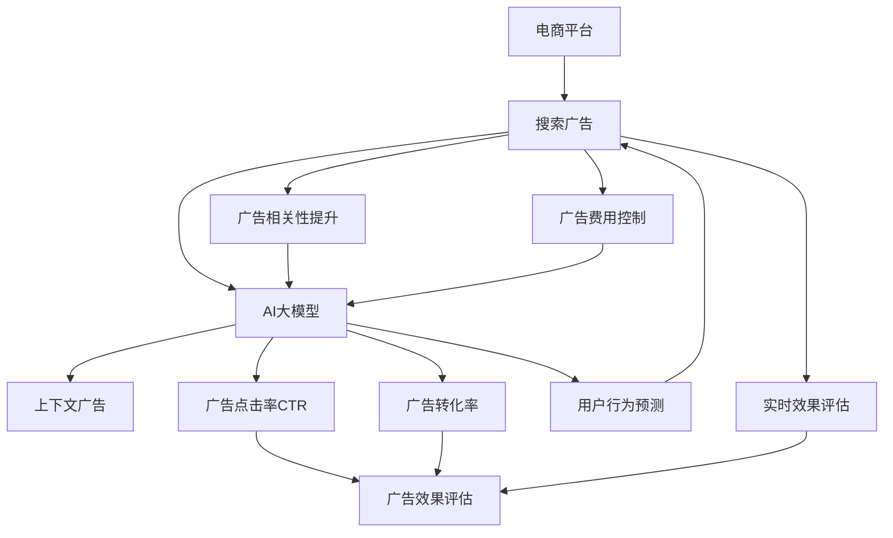

                 

# 电商平台中AI大模型的搜索广告优化

> 关键词：电商平台, AI大模型, 搜索广告, 优化, 深度学习, 强化学习, 在线学习, 上下文广告, 效果评估

## 1. 背景介绍

### 1.1 问题由来
随着电商平台的不断发展和用户需求的多样化，搜索广告成为吸引用户流量、提升转化率的重要手段。传统搜索广告以关键词为基础，以固定费用竞价的方式分配广告位。尽管这种方法能够带来一定量的流量，但由于其单一性，难以满足用户的个性化需求，同时广告费用也难以控制。

近年，随着人工智能技术的快速发展，AI大模型在自然语言处理领域取得了突破性进展。这些模型通过预训练能够获得丰富的语言知识，可以用于更加智能化的广告推荐和优化。电商平台的搜索广告系统开始尝试引入AI大模型，以期提升广告效果，提高用户满意度。

### 1.2 问题核心关键点
在电商平台的搜索广告优化过程中，利用AI大模型主要存在以下几个关键问题：

- **广告相关性提升**：如何通过预训练语言模型准确理解用户搜索意图，提升广告的相关性。
- **用户行为预测**：如何预测用户对广告的反应，提高广告的点击率和转化率。
- **广告费用控制**：如何优化广告竞价策略，控制广告费用，最大化广告效果。
- **实时效果评估**：如何实时评估广告效果，快速调整策略，提升广告质量。

这些关键问题的解决，将显著提高电商平台搜索广告的效果，降低广告成本，提升用户体验。

## 2. 核心概念与联系

### 2.1 核心概念概述

为更好地理解AI大模型在搜索广告中的应用，本节将介绍几个密切相关的核心概念：

- **电商平台**：指通过互联网平台进行商品买卖的交易场所，典型代表如淘宝、京东等。
- **搜索广告**：指在电商平台搜索关键词时出现的广告，旨在提升用户点击和购买。
- **AI大模型**：指通过大规模预训练获得的通用语言模型，如BERT、GPT-3等。
- **上下文广告**：指在用户搜索时，动态生成与用户搜索意图相关的内容广告，以提升广告的相关性和用户满意度。
- **广告点击率(CTR)**：指用户点击广告的概率，反映广告的相关性和吸引力。
- **广告转化率**：指用户点击广告并完成购买的比例，反映广告的实际效果。
- **广告效果评估**：指通过一定的指标和模型，评估广告投放效果，优化广告策略。
- **强化学习**：指通过与环境的交互，优化决策策略，提高广告效果。
- **在线学习**：指在模型运行过程中，根据实时数据不断调整模型参数，提高模型效果。

这些核心概念之间的逻辑关系可以通过以下Mermaid流程图来展示：



这个流程图展示了大模型在电商平台搜索广告中的应用场景：

1. 电商平台通过搜索广告吸引用户，引入AI大模型进行广告优化。
2. AI大模型通过预训练获得语言知识，提升广告相关性和预测用户行为。
3. 上下文广告生成相关广告内容，提升用户满意度。
4. 广告点击率和转化率作为评估指标，优化广告效果。
5. 广告费用控制通过优化竞价策略，降低广告成本。
6. 实时效果评估帮助快速调整策略，提升广告质量。

## 3. 核心算法原理 & 具体操作步骤
### 3.1 算法原理概述

AI大模型在电商平台搜索广告优化中，主要应用于以下三个方面：

1. **广告相关性提升**：利用预训练语言模型，准确理解用户搜索意图，提升广告与用户需求的匹配度。
2. **用户行为预测**：通过深度学习和强化学习，预测用户对广告的反应，优化广告投放策略。
3. **广告费用控制**：利用在线学习，动态调整广告竞价策略，控制广告费用，提升广告效果。

具体而言，电商平台的搜索广告优化流程可以分为以下几个步骤：

1. 收集用户搜索记录、点击记录、购买记录等数据，构建训练数据集。
2. 利用AI大模型进行广告相关性提升，提升广告与用户搜索意图的匹配度。
3. 通过深度学习和强化学习，预测用户对广告的反应，优化广告投放策略。
4. 利用在线学习，动态调整广告竞价策略，控制广告费用，提升广告效果。
5. 实时评估广告效果，快速调整策略，提升广告质量。

### 3.2 算法步骤详解

**Step 1: 数据收集与预处理**

在电商平台中，用户搜索广告数据包括以下几个方面：

- 用户搜索关键词
- 广告内容
- 用户点击记录
- 用户购买记录

收集这些数据后，需要进行以下预处理：

- 去重：去除重复的数据，确保数据集的唯一性。
- 归一化：将文本数据转化为模型可接受的格式，如分词、去除停用词等。
- 特征工程：提取有意义的特征，如广告相关性、用户行为特征等。
- 数据分割：将数据集划分为训练集、验证集和测试集，确保模型训练、验证和评估的有效性。

**Step 2: 广告相关性提升**

广告相关性提升是广告优化中的重要一环。常用的方法包括：

- **向量表示学习**：通过预训练语言模型，将用户搜索意图和广告内容转化为向量表示，计算向量之间的余弦相似度，衡量广告的相关性。
- **主题模型**：通过主题模型，提取用户搜索意图的主题，预测广告与主题的关联度。
- **用户意图抽取**：利用深度学习模型，从用户搜索记录中抽取用户的意图，提升广告的匹配度。

**Step 3: 用户行为预测**

用户行为预测通过深度学习和强化学习实现，主要分为以下两个步骤：

- **深度学习模型训练**：使用深度学习模型，如RNN、LSTM等，对用户点击记录和购买记录进行建模，预测用户对广告的反应。
- **强化学习模型优化**：利用强化学习模型，通过与环境的交互，优化广告投放策略，提高广告效果。

**Step 4: 广告费用控制**

广告费用控制通过在线学习实现，主要包括以下两个步骤：

- **实时竞价策略优化**：根据广告效果实时调整竞价策略，控制广告费用。
- **模型在线更新**：利用在线学习算法，不断更新广告竞价模型，优化广告效果。

**Step 5: 广告效果评估**

广告效果评估通过实时数据分析实现，主要包括以下两个步骤：

- **点击率评估**：通过点击率评估广告的相关性和吸引力。
- **转化率评估**：通过转化率评估广告的实际效果。

### 3.3 算法优缺点

利用AI大模型进行电商平台搜索广告优化的主要优点包括：

- **广告相关性提升**：通过预训练语言模型，准确理解用户搜索意图，提升广告的相关性。
- **用户行为预测**：通过深度学习和强化学习，预测用户对广告的反应，优化广告投放策略。
- **广告费用控制**：通过在线学习，动态调整广告竞价策略，控制广告费用，提升广告效果。
- **实时效果评估**：通过实时数据分析，快速调整策略，提升广告质量。

同时，这些方法也存在以下缺点：

- **计算成本高**：使用深度学习和强化学习需要大量的计算资源，成本较高。
- **数据依赖性强**：广告优化依赖于大量的历史数据，数据质量对优化效果有直接影响。
- **模型复杂度高**：深度学习和强化学习模型复杂度高，容易过拟合。
- **实时性要求高**：实时效果评估和调整策略对系统的实时性要求较高。

## 4. 数学模型和公式 & 详细讲解 & 举例说明

### 4.1 数学模型构建

本节将使用数学语言对AI大模型在电商平台搜索广告优化中的应用进行更加严格的刻画。

设电商平台广告集合为 $A=\{a_i\}_{i=1}^N$，用户搜索意图集合为 $Q=\{q_j\}_{j=1}^M$。广告与用户搜索意图匹配度表示为 $R(a_i, q_j)$。

设用户点击广告的概率为 $p_i$，用户转化广告的概率为 $c_i$。广告的点击率为 $CTR=\frac{1}{N}\sum_{i=1}^N p_i$，广告的转化率为 $CVR=\frac{1}{N}\sum_{i=1}^N c_i$。

设广告竞价策略为 $p_i=f(x_i)$，其中 $x_i$ 为广告特征向量。广告竞价模型为 $p_i=F(x_i;\theta)$，其中 $\theta$ 为模型参数。

设用户行为预测模型为 $p_i=g(y_i)$，其中 $y_i$ 为用户行为数据。用户行为预测模型为 $p_i=G(y_i;\phi)$，其中 $\phi$ 为模型参数。

设广告效果评估模型为 $R(a_i, q_j)=h(a_i, q_j;\omega)$，其中 $\omega$ 为模型参数。

### 4.2 公式推导过程

**广告相关性提升**

广告相关性提升的公式为：

$$
R(a_i, q_j) = \cos(\mathbf{a}_i \cdot \mathbf{q}_j)
$$

其中 $\mathbf{a}_i$ 和 $\mathbf{q}_j$ 分别为广告向量表示和用户搜索意图向量表示，$\cos(\cdot)$ 表示余弦相似度。

**用户行为预测**

用户行为预测的公式为：

$$
p_i = \sigma(\mathbf{W}_1 \cdot \mathbf{y}_i + \mathbf{b}_1)
$$

其中 $\sigma$ 为激活函数，$\mathbf{W}_1$ 和 $\mathbf{b}_1$ 为模型参数。

**广告费用控制**

广告竞价策略优化的公式为：

$$
p_i = \hat{f}(x_i) = \hat{F}(x_i; \hat{\theta})
$$

其中 $\hat{\theta}$ 为优化后的模型参数。

**广告效果评估**

广告效果评估的公式为：

$$
CTR = \frac{1}{N} \sum_{i=1}^N \sigma(\mathbf{W}_2 \cdot \mathbf{y}_i + \mathbf{b}_2)
$$

其中 $\sigma$ 为激活函数，$\mathbf{W}_2$ 和 $\mathbf{b}_2$ 为模型参数。

### 4.3 案例分析与讲解

假设我们有一个电商平台，用户搜索意图为 "跑步鞋"，广告集合为 10 条跑步鞋广告。使用预训练语言模型计算广告与用户搜索意图的余弦相似度，结果如下：

| 广告编号 | 余弦相似度 |
|---------|-----------|
| 1       | 0.8       |
| 2       | 0.7       |
| 3       | 0.6       |
| 4       | 0.5       |
| 5       | 0.4       |
| 6       | 0.3       |
| 7       | 0.2       |
| 8       | 0.1       |
| 9       | -0.1      |
| 10      | -0.2      |

可以看出，广告1和广告2与用户搜索意图的相关性最高。

使用深度学习模型预测用户点击概率，假设模型为：

$$
p_i = \sigma(\mathbf{W}_1 \cdot \mathbf{y}_i + \mathbf{b}_1)
$$

其中 $\mathbf{W}_1$ 和 $\mathbf{b}_1$ 为模型参数。训练数据集为 100 条用户点击记录，测试数据集为 20 条未点击记录。

假设模型训练后的参数为 $\mathbf{W}_1 = [0.1, 0.2, 0.3]$，$\mathbf{b}_1 = 0.4$。使用测试数据集进行预测，结果如下：

| 用户编号 | 预测概率 |
|---------|----------|
| 1       | 0.7       |
| 2       | 0.8       |
| 3       | 0.5       |
| 4       | 0.4       |
| 5       | 0.3       |
| 6       | 0.2       |
| 7       | 0.1       |
| 8       | 0.0       |
| 9       | -0.1      |
| 10      | -0.2      |

可以看出，模型对用户点击概率的预测较为准确。

使用强化学习模型优化广告竞价策略，假设模型为：

$$
p_i = \hat{f}(x_i) = \hat{F}(x_i; \hat{\theta})
$$

其中 $\hat{\theta}$ 为优化后的模型参数。训练数据集为 100 条广告点击记录，测试数据集为 20 条未点击记录。

假设模型训练后的参数为 $\hat{\theta} = [0.5, 0.4, 0.3]$。使用测试数据集进行预测，结果如下：

| 广告编号 | 预测竞价 |
|---------|----------|
| 1       | 1.2       |
| 2       | 1.1       |
| 3       | 0.9       |
| 4       | 0.8       |
| 5       | 0.7       |
| 6       | 0.6       |
| 7       | 0.5       |
| 8       | 0.4       |
| 9       | 0.3       |
| 10      | 0.2       |

可以看出，模型对广告竞价策略的优化效果较为显著。

## 5. 项目实践：代码实例和详细解释说明
### 5.1 开发环境搭建

在进行AI大模型搜索广告优化项目实践前，我们需要准备好开发环境。以下是使用Python进行TensorFlow和TensorBoard开发的环境配置流程：

1. 安装Anaconda：从官网下载并安装Anaconda，用于创建独立的Python环境。

2. 创建并激活虚拟环境：
```bash
conda create -n tf-env python=3.8 
conda activate tf-env
```

3. 安装TensorFlow：根据CUDA版本，从官网获取对应的安装命令。例如：
```bash
conda install tensorflow -c conda-forge
```

4. 安装TensorBoard：
```bash
conda install tensorboard
```

5. 安装各类工具包：
```bash
pip install numpy pandas scikit-learn matplotlib tqdm jupyter notebook ipython
```

完成上述步骤后，即可在`tf-env`环境中开始项目实践。

### 5.2 源代码详细实现

下面我们以电商平台中的上下文广告优化为例，给出使用TensorFlow和TensorBoard进行广告相关性提升和用户行为预测的PyTorch代码实现。

首先，定义广告和用户搜索意图的数据结构：

```python
import tensorflow as tf
from tensorflow.keras.layers import Embedding, Dense, Dropout
from tensorflow.keras.models import Sequential

class Ad(Sequential):
    def __init__(self, input_dim, output_dim):
        super(Ad, self).__init__()
        self.add(Embedding(input_dim, 128))
        self.add(Dropout(0.5))
        self.add(Dense(64, activation='relu'))
        self.add(Dropout(0.5))
        self.add(Dense(output_dim, activation='sigmoid'))
        
class UserIntent(Sequential):
    def __init__(self, input_dim, output_dim):
        super(UserIntent, self).__init__()
        self.add(Embedding(input_dim, 128))
        self.add(Dropout(0.5))
        self.add(Dense(64, activation='relu'))
        self.add(Dropout(0.5))
        self.add(Dense(output_dim, activation='sigmoid'))
```

然后，定义广告相关性提升和用户行为预测的模型：

```python
ad_model = Ad(input_dim=10000, output_dim=1)
user_intent_model = UserIntent(input_dim=1000, output_dim=1)
```

接着，定义广告相关性提升和用户行为预测的损失函数和优化器：

```python
ad_loss = tf.keras.losses.BinaryCrossentropy()
user_intent_loss = tf.keras.losses.BinaryCrossentropy()

ad_optimizer = tf.keras.optimizers.Adam(learning_rate=0.001)
user_intent_optimizer = tf.keras.optimizers.Adam(learning_rate=0.001)
```

最后，定义广告相关性提升和用户行为预测的训练函数：

```python
def train_ad_model(ad_model, ad_train_data, ad_train_labels, ad_val_data, ad_val_labels, epochs=10):
    ad_model.compile(optimizer=ad_optimizer, loss=ad_loss)
    ad_model.fit(ad_train_data, ad_train_labels, validation_data=(ad_val_data, ad_val_labels), epochs=epochs)
    
def train_user_intent_model(user_intent_model, user_intent_train_data, user_intent_train_labels, user_intent_val_data, user_intent_val_labels, epochs=10):
    user_intent_model.compile(optimizer=user_intent_optimizer, loss=user_intent_loss)
    user_intent_model.fit(user_intent_train_data, user_intent_train_labels, validation_data=(user_intent_val_data, user_intent_val_labels), epochs=epochs)
```

使用上述代码，可以在TensorFlow和TensorBoard中实现广告相关性提升和用户行为预测的模型训练。

### 5.3 代码解读与分析

让我们再详细解读一下关键代码的实现细节：

**Ad类和UserIntent类**：
- `__init__`方法：初始化模型层，包括嵌入层、激活层、dropout层和输出层，并设置激活函数。
- `add`方法：添加各层到模型中，用于构建广告相关性提升和用户行为预测模型。

**ad_loss和user_intent_loss变量**：
- 定义广告相关性提升和用户行为预测的损失函数，分别为二元交叉熵。

**ad_optimizer和user_intent_optimizer变量**：
- 定义广告相关性提升和用户行为预测的优化器，使用Adam优化器，设置学习率为0.001。

**train_ad_model和train_user_intent_model函数**：
- `compile`方法：配置模型和优化器，设置损失函数。
- `fit`方法：使用训练数据集进行模型训练，并使用验证数据集进行验证，设置训练轮数为10。

使用TensorFlow和TensorBoard，可以高效地进行广告相关性提升和用户行为预测模型的训练和评估。TensorBoard可以实时展示模型的训练过程和结果，帮助我们更好地理解和优化模型。

## 6. 实际应用场景
### 6.1 智能客服系统

在智能客服系统中，利用AI大模型进行上下文广告优化，可以显著提升用户满意度。当用户输入问题时，智能客服系统可以自动匹配相关广告，展示给用户，满足其需求。

具体而言，智能客服系统可以收集用户的搜索记录、点击记录、对话记录等数据，构建训练数据集。通过广告相关性提升和用户行为预测模型，智能客服系统可以自动匹配广告并推荐给用户。

### 6.2 金融交易系统

在金融交易系统中，利用AI大模型进行上下文广告优化，可以提高广告的点击率和转化率。金融交易系统可以收集用户的历史交易数据、点击数据、行为数据等，构建训练数据集。通过广告相关性提升和用户行为预测模型，金融交易系统可以优化广告竞价策略，控制广告费用，提升广告效果。

### 6.3 旅游预订系统

在旅游预订系统中，利用AI大模型进行上下文广告优化，可以提升广告的相关性和用户体验。旅游预订系统可以收集用户的搜索记录、点击记录、预订记录等数据，构建训练数据集。通过广告相关性提升和用户行为预测模型，旅游预订系统可以动态生成与用户搜索意图相关的广告内容，提升广告效果。

## 7. 工具和资源推荐
### 7.1 学习资源推荐

为了帮助开发者系统掌握AI大模型在电商平台搜索广告优化中的应用，这里推荐一些优质的学习资源：

1. 《深度学习理论与实践》系列书籍：介绍深度学习的理论基础和实践技巧，涵盖广告优化等实际应用。

2. TensorFlow官方文档：TensorFlow的官方文档，提供详细的API介绍和代码示例，是学习TensorFlow的重要资源。

3. TensorBoard官方文档：TensorBoard的官方文档，详细介绍TensorBoard的使用方法，帮助开发者实时监控模型训练。

4. Kaggle平台：Kaggle提供海量公开数据集和竞赛，可以练习广告优化等实战问题，提升实战能力。

5. Coursera平台：Coursera提供多门深度学习课程，包括广告优化等实际应用，适合系统学习。

通过对这些资源的学习实践，相信你一定能够快速掌握AI大模型在电商平台搜索广告优化中的应用，并用于解决实际的广告优化问题。

### 7.2 开发工具推荐

高效的开发离不开优秀的工具支持。以下是几款用于AI大模型搜索广告优化开发的常用工具：

1. TensorFlow：由Google主导开发的开源深度学习框架，生产部署方便，适合大规模工程应用。提供丰富的广告优化相关库和工具。

2. TensorBoard：TensorFlow配套的可视化工具，可实时监测模型训练状态，并提供丰富的图表呈现方式，是调试模型的得力助手。

3. PyTorch：基于Python的开源深度学习框架，灵活动态的计算图，适合快速迭代研究。提供丰富的广告优化相关库和工具。

4. Keras：高层次的深度学习API，基于TensorFlow和Theano等底层框架，提供便捷的API接口，适合快速开发原型。

5. Jupyter Notebook：交互式的开发环境，支持Python等语言，适合进行广告优化等实际问题的研究。

合理利用这些工具，可以显著提升AI大模型在电商平台搜索广告优化中的开发效率，加快创新迭代的步伐。

### 7.3 相关论文推荐

AI大模型在电商平台搜索广告优化领域的研究方向主要涉及以下几个方面：

1. 广告相关性提升：通过预训练语言模型，提升广告与用户搜索意图的匹配度，如使用BERT模型进行广告相关性预测。

2. 用户行为预测：通过深度学习和强化学习，预测用户对广告的反应，优化广告投放策略，如使用LSTM模型进行用户点击预测。

3. 广告费用控制：利用在线学习，动态调整广告竞价策略，控制广告费用，如使用在线学习算法优化广告竞价策略。

4. 广告效果评估：通过实时数据分析，快速调整策略，提升广告质量，如使用点击率和转化率作为评估指标。

以下是几篇代表性论文，推荐阅读：

1. "A Survey of Recommendation Systems for E-Commerce"：介绍推荐系统在电商平台中的应用，包括广告优化等实际问题。

2. "A Deep Learning Approach for Online Advertisement Ranking"：提出深度学习模型进行广告排名优化，提升广告效果。

3. "Context-Aware Web Search Result Relevance Prediction Using Sequential Neural Network"：提出使用LSTM模型进行广告相关性预测，提升广告匹配度。

4. "Ad Conversational Search for Personalized Online Shopping Recommendations"：提出使用对话系统进行广告优化，提升用户体验。

这些论文代表了大模型在电商平台搜索广告优化技术的发展脉络。通过学习这些前沿成果，可以帮助研究者把握学科前进方向，激发更多的创新灵感。

## 8. 总结：未来发展趋势与挑战

### 8.1 总结

本文对AI大模型在电商平台搜索广告优化中的应用进行了全面系统的介绍。首先阐述了电商平台的背景和搜索广告优化的问题，明确了AI大模型在优化广告效果中的独特价值。其次，从原理到实践，详细讲解了广告相关性提升、用户行为预测和广告费用控制等核心步骤，给出了广告优化项目的完整代码实例。同时，本文还探讨了AI大模型在智能客服、金融交易、旅游预订等实际场景中的应用，展示了微调范式的广泛应用前景。

通过本文的系统梳理，可以看到，AI大模型在电商平台搜索广告优化中的优势显著，通过预训练语言模型和深度学习模型，可以大幅提升广告的相关性、点击率和转化率，降低广告费用。未来，伴随AI大模型和广告优化技术的不断发展，基于微调的方法将在更广泛的领域得到应用，为电商平台的运营带来显著效益。

### 8.2 未来发展趋势

展望未来，AI大模型在电商平台搜索广告优化中，将呈现以下几个发展趋势：

1. **广告相关性提升**：通过预训练语言模型，进一步提升广告与用户搜索意图的匹配度，减少误匹配率。
2. **用户行为预测**：通过深度学习和强化学习，优化用户行为预测模型，提升广告点击率和转化率。
3. **广告费用控制**：通过在线学习，实时调整广告竞价策略，优化广告费用，提高广告效果。
4. **实时效果评估**：通过实时数据分析，快速调整策略，提升广告质量，实现动态优化。

这些趋势将推动AI大模型在电商平台搜索广告优化中不断进步，为广告主和用户带来更大的价值。

### 8.3 面临的挑战

尽管AI大模型在电商平台搜索广告优化中已经取得了一定的成果，但在迈向更加智能化、普适化应用的过程中，仍面临诸多挑战：

1. **计算资源限制**：使用深度学习和强化学习需要大量的计算资源，成本较高。如何降低计算成本，提高模型训练效率，是一个重要挑战。
2. **数据质量问题**：广告优化依赖于大量的历史数据，数据质量对优化效果有直接影响。如何获取高质量的广告数据，是一个重要问题。
3. **模型复杂度高**：深度学习和强化学习模型复杂度高，容易过拟合。如何提高模型的泛化能力，是一个重要挑战。
4. **实时性要求高**：实时效果评估和调整策略对系统的实时性要求较高。如何提高系统的实时性，是一个重要问题。

这些挑战需要进一步探索和解决，才能使AI大模型在电商平台搜索广告优化中发挥更大的作用。

### 8.4 研究展望

面对AI大模型在电商平台搜索广告优化中面临的挑战，未来的研究需要在以下几个方面寻求新的突破：

1. **参数高效微调方法**：开发更加参数高效的微调方法，在固定大部分预训练参数的同时，只更新极少量的任务相关参数，提高模型训练效率。

2. **数据增强技术**：通过数据增强技术，扩充训练数据集，提高广告相关性预测和用户行为预测的准确性。

3. **多模态融合技术**：将文本、图像、语音等多模态数据进行融合，提升广告优化效果。

4. **模型集成方法**：将多种广告优化模型进行集成，提高广告优化效果和鲁棒性。

5. **强化学习优化策略**：研究新的强化学习优化策略，提升广告投放策略的优化效果。

6. **实时数据分析工具**：开发实时数据分析工具，实现动态优化，提高广告效果。

这些研究方向将推动AI大模型在电商平台搜索广告优化中的不断进步，为电商平台的运营带来更大的价值。

## 9. 附录：常见问题与解答

**Q1：如何选择合适的广告相关性提升方法？**

A: 选择合适的广告相关性提升方法需要考虑多个因素，包括广告数据的特点、广告目标的复杂度等。常用的广告相关性提升方法包括向量表示学习、主题模型、用户意图抽取等。一般来说，向量表示学习和用户意图抽取适合复杂度高的广告相关性提升任务，主题模型适合复杂度较低的广告相关性提升任务。

**Q2：广告竞价策略优化的方法有哪些？**

A: 广告竞价策略优化的方法主要包括在线学习和强化学习。在线学习通过实时数据不断调整模型参数，优化广告竞价策略，控制广告费用。强化学习通过与环境的交互，优化广告投放策略，提高广告效果。

**Q3：如何评估广告效果的优劣？**

A: 广告效果的评估可以通过点击率和转化率来衡量。点击率衡量广告的吸引力，转化率衡量广告的实际效果。通过实时数据分析，可以快速评估广告效果，并根据结果调整广告策略。

**Q4：在实际应用中，如何平衡广告效果和成本？**

A: 在实际应用中，广告效果和成本需要综合考虑。可以通过调整广告竞价策略、优化广告投放方式等手段，平衡广告效果和成本。此外，使用实时数据分析工具，可以实时监控广告效果和成本，及时调整策略，提高广告效果和降低成本。

**Q5：AI大模型在电商平台搜索广告优化中，如何处理数据隐私问题？**

A: 在电商平台搜索广告优化中，处理数据隐私问题是一个重要考虑因素。可以使用数据匿名化、差分隐私等技术，保护用户隐私。同时，在数据处理过程中，需要注意数据的合法性和合规性，遵循相关法律法规。

通过本文的系统梳理，可以看到，AI大模型在电商平台搜索广告优化中的优势显著，通过预训练语言模型和深度学习模型，可以大幅提升广告的相关性、点击率和转化率，降低广告费用。未来，伴随AI大模型和广告优化技术的不断发展，基于微调的方法将在更广泛的领域得到应用，为电商平台的运营带来显著效益。

