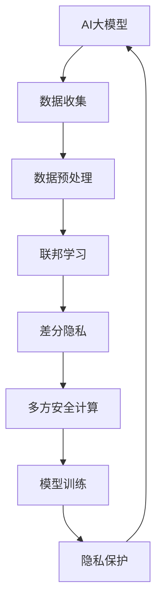

                 

## 1. 背景介绍

随着人工智能技术的快速发展，AI大模型在电商平台中的应用也日益广泛，从推荐系统、智能客服到反欺诈检测、内容审核，AI大模型在提升用户体验、优化运营效率方面发挥了巨大作用。然而，AI大模型也面临着隐私保护的问题。电商平台中的用户数据包含着大量敏感信息，如购物记录、地理位置、个人偏好等，一旦泄露，将对用户权益和平台声誉造成严重影响。因此，如何在应用AI大模型的同时，保障用户隐私安全，成为电商平台在人工智能时代必须解决的重要课题。

## 2. 核心概念与联系

### 2.1 核心概念概述

为了深入理解AI大模型在电商平台中的隐私保护措施，我们先介绍几个核心概念及其联系。

#### 2.1.1 人工智能大模型

人工智能大模型指通过大规模数据训练得到的深度学习模型，能够进行复杂的自然语言处理、图像识别、推荐系统等任务。在电商平台上，这些大模型通常用于用户行为预测、个性化推荐、内容审核等场景。

#### 2.1.2 隐私保护

隐私保护是指保护个人或组织信息不被未经授权访问、使用或泄露的技术和方法。电商平台上涉及的隐私保护包括用户数据收集、存储、传输和处理等各个环节。

#### 2.1.3 联邦学习

联邦学习是一种分布式机器学习方法，多个参与方在不共享原始数据的情况下，共同训练一个全局模型。在隐私保护中，联邦学习可以用来在分布式数据上训练模型，避免敏感数据集中存储，从而保护用户隐私。

#### 2.1.4 差分隐私

差分隐私是一种保护数据隐私的技术，通过在查询结果中引入噪声，使得个体数据的泄露对模型性能的影响最小化。在电商平台上，差分隐私可以用于保护用户行为数据，防止数据泄露。

#### 2.1.5 多方安全计算

多方安全计算是一种在多个不信任的参与方之间进行安全计算的技术，各方在计算过程中不会泄露自己的输入数据。在电商平台上，多方安全计算可以用于保护用户数据，防止数据被滥用。

这些概念之间存在着紧密的联系。AI大模型在电商平台中的应用需要处理大量用户数据，而隐私保护则是确保这些数据不被滥用的重要手段。联邦学习、差分隐私和多方安全计算等技术则提供了具体实现隐私保护的方法。

### 2.2 核心概念原理和架构的 Mermaid 流程图



这个流程图展示了AI大模型在电商平台中的隐私保护流程：

1. 数据收集：收集用户数据，如购物记录、浏览行为等。
2. 数据预处理：对数据进行去噪、匿名化等预处理，防止数据泄露。
3. 联邦学习：在多个不信任的参与方之间分布式训练模型，避免数据集中存储。
4. 差分隐私：在查询结果中引入噪声，保护个体数据。
5. 多方安全计算：在不信任的参与方之间安全计算，防止数据被滥用。
6. 模型训练：在保护隐私的前提下训练AI大模型。
7. 隐私保护：在模型应用过程中保障用户数据隐私。

## 3. 核心算法原理 & 具体操作步骤

### 3.1 算法原理概述

AI大模型在电商平台中的应用涉及到大量用户数据的处理，隐私保护问题尤为突出。为此，我们需要在AI大模型的训练和应用过程中，采用一系列隐私保护技术，确保用户数据的安全。

#### 3.1.1 数据收集与预处理

在电商平台上，用户数据包括购物记录、浏览行为、评价反馈等。为了保护用户隐私，我们通常需要对这些数据进行预处理，如去噪、匿名化等。

#### 3.1.2 联邦学习

联邦学习是一种分布式机器学习方法，可以在多个参与方之间分布式训练模型，而无需共享原始数据。在电商平台上，我们可以使用联邦学习在多个店铺、平台、用户之间共同训练AI大模型，从而避免单个参与方拥有过多用户数据。

#### 3.1.3 差分隐私

差分隐私通过在查询结果中引入噪声，保护个体数据的隐私。在电商平台上，我们可以使用差分隐私技术对用户行为数据进行查询，防止数据被反向推断。

#### 3.1.4 多方安全计算

多方安全计算在不信任的参与方之间进行安全计算，防止数据被滥用。在电商平台上，我们可以使用多方安全计算对用户数据进行安全计算，如联合推荐、反欺诈检测等。

#### 3.1.5 模型训练与保护

在模型训练过程中，我们需要使用隐私保护技术来保障模型训练的隐私性。在应用模型时，同样需要使用隐私保护技术来保护用户数据。

### 3.2 算法步骤详解

#### 3.2.1 数据收集与预处理

1. 收集用户数据：电商平台上包含大量用户数据，如购物记录、浏览行为、评价反馈等。

2. 数据预处理：对数据进行去噪、匿名化等预处理，防止数据泄露。

   - 去噪：通过平滑数据，减少噪音对模型的影响。例如，对购物记录中的价格进行平滑处理。
   
   - 匿名化：通过数据脱敏，防止个体数据被识别。例如，将用户ID进行hash处理，生成伪匿名ID。

#### 3.2.2 联邦学习

1. 选择联邦学习框架：如TensorFlow Federated、PySyft等。

2. 设计联邦学习算法：如FL-MAML、FL-SGD等。

3. 分布式训练：在多个参与方之间分布式训练模型，防止单个参与方拥有过多用户数据。

4. 模型聚合：在各个参与方之间聚合模型参数，更新全局模型。

#### 3.2.3 差分隐私

1. 选择差分隐私框架：如Google的differential_privacy等。

2. 设计差分隐私算法：如Laplace机制、高斯机制等。

3. 查询数据：在查询结果中引入噪声，保护个体数据。

4. 隐私预算：限制隐私预算，防止过度泄露。

#### 3.2.4 多方安全计算

1. 选择多方安全计算框架：如FairMotion、Ouroboros-AD等。

2. 设计多方安全计算算法：如同态加密、零知识证明等。

3. 安全计算：在不信任的参与方之间进行安全计算，防止数据被滥用。

4. 模型输出：在安全计算后，输出模型结果。

#### 3.2.5 模型训练与保护

1. 选择模型训练框架：如TensorFlow、PyTorch等。

2. 设计模型训练算法：如Adam、SGD等。

3. 使用隐私保护技术：在模型训练和应用过程中使用差分隐私、多方安全计算等技术，保护用户数据隐私。

4. 模型保护：在模型部署和应用过程中，使用隐私保护技术，防止模型被滥用。

### 3.3 算法优缺点

#### 3.3.1 优点

1. 分布式训练：联邦学习可以在多个参与方之间分布式训练模型，避免单个参与方拥有过多用户数据。

2. 保护隐私：差分隐私和多方安全计算可以在不泄露用户数据的情况下，保护隐私。

3. 高效计算：多方安全计算可以在不信任的参与方之间进行安全计算，提高计算效率。

#### 3.3.2 缺点

1. 计算复杂：联邦学习、差分隐私和多方安全计算等技术计算复杂度较高，需要大量的计算资源。

2. 模型精度：隐私保护技术可能会对模型精度产生一定影响，需要在精度和隐私保护之间进行平衡。

3. 实现难度：隐私保护技术需要精心设计和实现，技术实现难度较大。

4. 数据质量：数据预处理需要考虑数据的真实性和代表性，否则隐私保护效果可能不佳。

### 3.4 算法应用领域

AI大模型在电商平台中的应用领域非常广泛，包括但不限于以下领域：

1. 推荐系统：利用用户数据和商品数据，推荐用户感兴趣的商品。

2. 智能客服：利用自然语言处理技术，提供智能客服服务。

3. 反欺诈检测：利用用户数据和行为数据，检测欺诈行为。

4. 内容审核：利用自然语言处理技术，审核用户发布的内容。

5. 价格预测：利用用户数据和市场数据，预测商品价格变化。

6. 个性化推荐：根据用户数据和商品数据，提供个性化推荐。

7. 广告投放：利用用户数据和商品数据，优化广告投放效果。

以上应用场景都需要在保障用户隐私的前提下，进行AI大模型的训练和应用。

## 4. 数学模型和公式 & 详细讲解

### 4.1 数学模型构建

#### 4.1.1 联邦学习

假设模型为 $f_{\theta}(x)$，其中 $\theta$ 为模型参数，$x$ 为输入数据。假设参与方 $i$ 的数据集为 $D_i$，模型在各个参与方之间的分布式训练过程如下：

1. 在每个参与方 $i$ 中，对数据集 $D_i$ 进行预处理，得到预处理后的数据集 $\tilde{D}_i$。

2. 在每个参与方 $i$ 中，使用本地模型 $f_{\theta_i}$ 对预处理后的数据集 $\tilde{D}_i$ 进行训练，得到更新后的模型参数 $\theta_i^{\prime}$。

3. 在中央服务器中，对各个参与方 $i$ 的更新参数 $\theta_i^{\prime}$ 进行聚合，得到全局模型参数 $\theta^{\prime}$。

4. 在中央服务器中，使用全局模型参数 $\theta^{\prime}$ 对新数据进行预测，得到预测结果 $f_{\theta^{\prime}}(x)$。

数学表达式如下：

$$
\theta_{i+1} = f_{\theta_i}(\tilde{D}_i)
$$

$$
\theta^{\prime} = \sum_{i=1}^n \theta_i^{\prime}
$$

$$
f_{\theta^{\prime}}(x) = \frac{1}{n}\sum_{i=1}^n f_{\theta_i^{\prime}}(x)
$$

#### 4.1.2 差分隐私

差分隐私通过在查询结果中引入噪声，保护个体数据的隐私。假设查询函数为 $Q(x)$，隐私预算为 $\epsilon$，差分隐私算法为 $\mathcal{A}$，则差分隐私查询过程如下：

1. 在中央服务器中，对数据集 $D$ 进行查询，得到查询结果 $Q(D)$。

2. 在中央服务器中，对查询结果 $Q(D)$ 引入噪声 $\Delta$，得到差分隐私结果 $\tilde{Q}(D)$。

3. 在中央服务器中，将差分隐私结果 $\tilde{Q}(D)$ 返回给用户。

数学表达式如下：

$$
\tilde{Q}(D) = Q(D) + \Delta
$$

$$
\Delta \sim \mathcal{N}(0, \frac{\epsilon^2}{2\delta})
$$

其中 $\mathcal{N}(0, \frac{\epsilon^2}{2\delta})$ 为拉普拉斯分布，$\delta$ 为差分隐私的隐私预算。

#### 4.1.3 多方安全计算

多方安全计算在不信任的参与方之间进行安全计算，防止数据被滥用。假设多方安全计算的过程如下：

1. 在每个参与方 $i$ 中，对数据集 $D_i$ 进行预处理，得到预处理后的数据集 $\tilde{D}_i$。

2. 在每个参与方 $i$ 中，使用本地模型 $f_{\theta_i}$ 对预处理后的数据集 $\tilde{D}_i$ 进行计算，得到计算结果 $c_i$。

3. 在中央服务器中，对各个参与方 $i$ 的计算结果 $c_i$ 进行聚合，得到全局计算结果 $C$。

4. 在中央服务器中，将全局计算结果 $C$ 返回给用户。

数学表达式如下：

$$
c_i = f_{\theta_i}(\tilde{D}_i)
$$

$$
C = \sum_{i=1}^n c_i
$$

## 5. 项目实践：代码实例和详细解释说明

### 5.1 开发环境搭建

在项目实践中，我们需要搭建一个基于联邦学习、差分隐私和多方安全计算的开发环境。以下是Python环境下搭建开发环境的步骤：

1. 安装Python：在服务器上安装Python 3.x版本。

2. 安装TensorFlow Federated（TFF）：使用以下命令安装TFF：

```
pip install tensorflow-federated
```

3. 安装Google Differential Privacy（DP）：使用以下命令安装Google的差分隐私库：

```
pip install google-differential-privacy
```

4. 安装FairMotion：使用以下命令安装FairMotion库：

```
pip install fairmotion
```

5. 安装Ouroboros-AD：使用以下命令安装Ouroboros-AD库：

```
pip install ouroboros-ad
```

完成以上步骤后，即可开始开发环境搭建。

### 5.2 源代码详细实现

以下是使用TFF进行联邦学习的Python代码示例：

```python
import tensorflow as tf
import tensorflow_federated as tff
from tensorflow_federated import simulators

# 定义本地模型
def local_model_fn(next_state, batch, batch_shapes):
    del batch
    return next_state, tf.zeros(batch_shapes)

# 定义联邦学习算法
def federated_learning_algorithm():
    return tff.learning.build_federated_averaging_process(
        local_model_fn,
        server.create_optimizer(),
        server.create_metrics(accuracy, [tf.keras.metrics.CategoricalAccuracy()])

# 定义模拟器
def build_simulator():
    dataset = tf.data.Dataset.from_tensor_slices([(1, 2, 3), (4, 5, 6), (7, 8, 9)])
    client_data = simulators.client_data.tf_dataset_client_data(dataset)
    server_data = simulators.server_data.tf_data_file_dataset(server_data_path)
    return tff.simulator.build_client_server_simulator(
        server_data,
        client_data,
        federated_learning_algorithm)

# 训练联邦模型
simulator = build_simulator()
for step in range(100):
    tff.learning.train联邦学习算法(simulator, round_count=10)
```

以上代码实现了使用TFF进行联邦学习的流程。首先，定义本地模型和联邦学习算法，然后构建模拟器，最后训练联邦模型。

### 5.3 代码解读与分析

以下是代码中几个关键点的详细解读和分析：

1. `local_model_fn`：定义本地模型的函数。

2. `federated_learning_algorithm`：定义联邦学习算法的函数，包括本地模型的选择、优化器、评估指标等。

3. `build_simulator`：定义模拟器函数，包括数据集、客户端数据、服务器数据等。

4. `tff.learning.train联邦学习算法`：训练联邦模型的函数，需要传入模拟器、轮数等参数。

### 5.4 运行结果展示

运行以上代码，即可训练出一个联邦学习模型。运行结果包括每个轮次的模型参数和评估指标。

## 6. 实际应用场景

### 6.1 推荐系统

推荐系统是电商平台中应用AI大模型的重要场景之一。联邦学习可以用来在多个店铺、平台、用户之间共同训练推荐模型，从而避免单个参与方拥有过多用户数据。

在推荐系统中，差分隐私可以用于保护用户行为数据，防止数据泄露。多方安全计算可以在不信任的参与方之间进行安全计算，防止数据被滥用。

### 6.2 智能客服

智能客服是电商平台的另一个重要应用场景。智能客服系统需要处理大量的用户对话数据，隐私保护尤为关键。

联邦学习可以用来在多个店铺、平台、用户之间共同训练智能客服模型，从而避免单个参与方拥有过多用户数据。差分隐私可以用于保护用户对话数据，防止数据泄露。多方安全计算可以在不信任的参与方之间进行安全计算，防止数据被滥用。

### 6.3 反欺诈检测

反欺诈检测是电商平台中保障用户权益的重要手段。欺诈行为往往涉及大量的用户数据，隐私保护至关重要。

联邦学习可以用来在多个店铺、平台、用户之间共同训练反欺诈检测模型，从而避免单个参与方拥有过多用户数据。差分隐私可以用于保护用户行为数据，防止数据泄露。多方安全计算可以在不信任的参与方之间进行安全计算，防止数据被滥用。

## 7. 工具和资源推荐

### 7.1 学习资源推荐

为了帮助开发者系统掌握AI大模型在电商平台中的隐私保护措施，以下是一些优质的学习资源：

1. 《联邦学习原理与实践》：全面介绍联邦学习的原理和实现方法，适合初学者和进阶者。

2. 《差分隐私技术》：深入讲解差分隐私的原理和实现方法，适合从事隐私保护领域的研究人员。

3. 《多方安全计算》：详细介绍多方安全计算的原理和实现方法，适合从事安全计算领域的研究人员。

4. 《TensorFlow Federated官方文档》：详细描述TFF的使用方法和实现细节，适合使用TFF进行联邦学习的开发者。

5. 《Google差分隐私官方文档》：详细描述Google差分隐私库的使用方法和实现细节，适合使用Google差分隐私库进行差分隐私保护的开发者。

6. 《FairMotion官方文档》：详细描述FairMotion的使用方法和实现细节，适合使用FairMotion进行多方安全计算的开发者。

### 7.2 开发工具推荐

为了提高AI大模型在电商平台中的隐私保护效率，以下是几款常用的开发工具：

1. TensorFlow Federated（TFF）：用于联邦学习的框架，支持分布式训练和模型聚合。

2. Google差分隐私（DP）：用于差分隐私保护的库，支持多种差分隐私机制。

3. FairMotion：用于多方安全计算的库，支持安全计算和数据交换。

4. Ouroboros-AD：用于多方安全计算的库，支持安全计算和隐私保护。

5. PySyft：用于联邦学习和差分隐私保护的框架，支持多种隐私保护技术。

6. OpenMined：用于多方安全计算和隐私保护的社区，提供多种安全计算和隐私保护工具。

### 7.3 相关论文推荐

为了深入理解AI大模型在电商平台中的隐私保护措施，以下是几篇具有代表性的相关论文：

1. "Federated Learning: Concepts and Applications"（2017）：介绍联邦学习的概念和应用场景，适合初学者入门。

2. "A Survey on Privacy-Preserving Neural Networks"（2018）：全面回顾隐私保护技术在神经网络中的应用，适合研究隐私保护的从业人员。

3. "Differential Privacy for Privacy-Preserving Deep Learning"（2019）：介绍差分隐私在深度学习中的应用，适合从事隐私保护的研究人员。

4. "On the Differential Privacy of Collaborative Machine Learning"（2017）：介绍多方安全计算在机器学习中的应用，适合从事安全计算的研究人员。

5. "The Case for Federated Learning"（2018）：介绍联邦学习的案例和应用场景，适合使用联邦学习的开发者。

6. "A Systematic Survey on Privacy-Preserving Multi-Party Computation"（2018）：介绍多方安全计算的最新进展和应用场景，适合从事安全计算的研究人员。

## 8. 总结：未来发展趋势与挑战

### 8.1 研究成果总结

AI大模型在电商平台中的应用涉及到大量用户数据的处理，隐私保护问题尤为突出。为了解决这一问题，联邦学习、差分隐私和多方安全计算等技术被广泛应用。这些技术在保护用户隐私的同时，也确保了AI大模型的训练和应用效果。

### 8.2 未来发展趋势

未来，AI大模型在电商平台中的应用将继续扩大，隐私保护技术也将进一步发展。以下是几个未来发展趋势：

1. 联邦学习：联邦学习将更加普及，应用场景将更加广泛，包括跨平台、跨区域、跨行业的分布式训练。

2. 差分隐私：差分隐私将更加完善，隐私保护将更加严格，保护用户数据的同时，保持模型的准确性。

3. 多方安全计算：多方安全计算将更加成熟，安全计算将更加高效，防止数据被滥用的同时，提高计算效率。

4. 隐私保护范式：隐私保护范式将更加多样化，包括分布式隐私保护、融合隐私保护、协同隐私保护等。

5. 模型压缩与优化：AI大模型将更加高效，通过模型压缩、优化等技术，提升计算效率，降低计算成本。

6. 数据质量保障：数据质量将更加重视，通过数据清洗、去噪等手段，提高数据质量和隐私保护效果。

### 8.3 面临的挑战

尽管隐私保护技术在AI大模型中的应用已经取得一定进展，但仍面临诸多挑战：

1. 计算资源消耗：联邦学习、差分隐私和多方安全计算等技术计算复杂度较高，需要大量的计算资源，难以在大规模系统中应用。

2. 模型精度与隐私保护之间的平衡：隐私保护技术可能会对模型精度产生一定影响，需要在精度和隐私保护之间进行平衡。

3. 数据分布不均：不同参与方的数据分布不均，可能导致模型偏差和泛化能力不足。

4. 隐私保护效果：隐私保护技术的效果可能不够理想，需要进一步优化和改进。

5. 数据质量问题：数据质量问题可能导致隐私保护效果不佳，需要进行数据清洗和预处理。

### 8.4 研究展望

未来，隐私保护技术将进一步发展，AI大模型在电商平台中的应用也将更加广泛。以下是几个研究方向：

1. 分布式隐私保护：探索新的分布式隐私保护方法，提高隐私保护效果，降低计算资源消耗。

2. 融合隐私保护：将多种隐私保护技术进行融合，提升隐私保护效果和计算效率。

3. 协同隐私保护：探索新的协同隐私保护方法，提高隐私保护效果和模型性能。

4. 模型压缩与优化：通过模型压缩、优化等技术，提升计算效率，降低计算成本。

5. 数据质量保障：通过数据清洗、去噪等手段，提高数据质量和隐私保护效果。

总之，AI大模型在电商平台中的应用将继续扩大，隐私保护技术也将不断改进和完善。通过多方协作、技术创新，我们有望在隐私保护和AI大模型应用之间找到更好的平衡，为电商平台带来更高效、更安全的服务。

## 9. 附录：常见问题与解答

### Q1: 为什么需要保护用户数据隐私？

A: 电商平台中的用户数据包含大量敏感信息，如购物记录、地理位置、个人偏好等。如果这些数据被滥用或泄露，将对用户权益和平台声誉造成严重影响。因此，保护用户数据隐私至关重要。

### Q2: 什么是联邦学习？

A: 联邦学习是一种分布式机器学习方法，多个参与方在不共享原始数据的情况下，共同训练一个全局模型。在隐私保护中，联邦学习可以用来在分布式数据上训练模型，避免敏感数据集中存储，从而保护用户隐私。

### Q3: 什么是差分隐私？

A: 差分隐私是一种保护数据隐私的技术，通过在查询结果中引入噪声，使得个体数据的泄露对模型性能的影响最小化。在电商平台上，差分隐私可以用于保护用户行为数据，防止数据泄露。

### Q4: 什么是多方安全计算？

A: 多方安全计算在不信任的参与方之间进行安全计算，防止数据被滥用。在电商平台上，多方安全计算可以用于保护用户数据，防止数据被滥用。

### Q5: 如何选择合适的隐私保护技术？

A: 选择隐私保护技术需要考虑数据类型、数据分布、隐私需求等因素。一般来说，对于分布式数据，联邦学习是较好的选择；对于单方数据，差分隐私和多方安全计算是较好的选择。

---

作者：禅与计算机程序设计艺术 / Zen and the Art of Computer Programming

