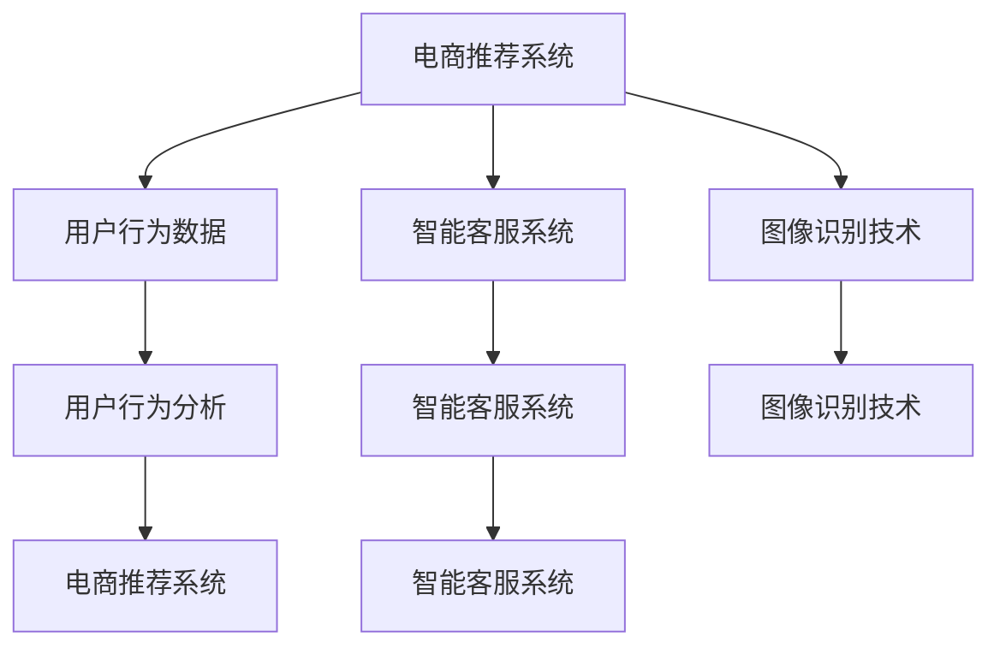

                 

# 电商平台中的AI大模型：从单点突破到全链路优化

> 关键词：人工智能,电商平台,大模型,电商推荐,电商平台运营,智能客服,图像识别,用户行为分析

## 1. 背景介绍

### 1.1 问题由来
随着互联网的迅速发展，电商平台已成为人们日常购物的重要渠道。电子商务不仅改变了消费者的购物方式，还带动了物流、金融、营销等多个行业的创新。但传统电商模式存在诸多问题，如商品推荐精准度不高、用户满意度低下、购物体验欠佳等。而人工智能大模型作为新一代电商发展的关键引擎，被越来越多地应用于平台运营的各个环节。

目前，基于大模型的电商推荐、智能客服、图像识别等技术已经在多个电商平台上得到应用，并取得了显著效果。通过引入AI大模型，电商平台能够实现对用户行为精准分析、商品推荐智能化和客户服务人性化，显著提升了平台的竞争力和用户体验。

### 1.2 问题核心关键点
AI大模型在电商平台中的应用，关键在于其在大规模数据上进行预训练，学习到丰富的特征表示，从而能在小样本数据上实现高效的微调和泛化。主要包括以下几个关键点：
- 大数据预训练：在电商海量数据上进行预训练，学习电商领域特有的用户行为和商品属性等知识。
- 小样本微调：在用户行为数据等小规模数据上进行微调，提升模型在特定场景下的性能。
- 多模态融合：融合电商业务中的多模态数据，如图像、文本、行为等，提升电商推荐的精准性和智能客服的对话体验。
- 可解释性增强：通过可解释性技术，让电商平台运营者能够清晰理解模型决策过程，增强信任度和透明度。

## 2. 核心概念与联系

### 2.1 核心概念概述

为更好地理解AI大模型在电商平台中的应用，本节将介绍几个密切相关的核心概念：

- 电商推荐系统：基于用户历史行为和偏好，自动推荐相关商品的电商推荐系统。传统的推荐算法如协同过滤、矩阵分解等逐渐被深度学习大模型所取代，因其具备更好的泛化能力和性能提升。

- 智能客服系统：在电商平台中，客服机器人能够通过自然语言理解和生成，实时响应用户咨询，提供24小时不间断服务。大模型在智能客服中发挥了关键作用，提升了客服的响应速度和准确率。

- 图像识别技术：在电商平台上，图像识别技术被广泛用于商品分类、库存管理、质量检测等环节。大模型通过在电商图像数据上进行预训练，能够提高商品识别的准确度和效率。

- 用户行为分析：大模型能够深入分析用户的浏览记录、点击行为、购买历史等数据，提炼出用户的潜在需求和行为模式，从而提升电商推荐系统的个性化水平。

- 生成对抗网络(GAN)：在电商图像合成、虚拟试穿、商品展示等场景中，GAN技术通过生成逼真的虚拟图像，增强了用户的沉浸感和购物体验。

这些核心概念之间通过以下Mermaid流程图展示它们之间的联系：



这个流程图展示了这些核心概念之间的相互作用：

1. 电商推荐系统通过用户行为数据和智能客服系统获取的用户需求，进行商品推荐。
2. 图像识别技术提供商品信息和质量检测，提升推荐精准度。
3. 用户行为分析深入挖掘用户兴趣和行为模式，优化推荐策略。
4. 智能客服系统通过对话交互，实时获取用户反馈，进一步提升推荐效果。

## 3. 核心算法原理 & 具体操作步骤
### 3.1 算法原理概述

在电商平台中，AI大模型主要用于电商推荐、智能客服、图像识别、用户行为分析等多个环节。以电商推荐系统为例，其核心算法原理如下：

1. 数据预处理：从电商平台收集用户行为数据、商品属性数据、交易数据等，清洗并标准化数据集。
2. 模型预训练：在电商数据上，使用大模型如BERT、GPT等进行预训练，学习用户行为和商品属性之间的关系。
3. 模型微调：在用户行为数据上，对预训练模型进行微调，使模型能够针对特定用户进行精准推荐。
4. 多模态融合：将电商数据中的文本、图像、行为等多种模态数据进行融合，提升推荐系统的泛化能力和性能。
5. 效果评估：在电商平台上测试微调后的模型，评估推荐效果和用户体验，迭代优化。

### 3.2 算法步骤详解

下面以电商推荐系统为例，详细介绍基于AI大模型的电商推荐算法的详细步骤：

**Step 1: 数据预处理**
- 收集电商平台的销售数据、用户行为数据、商品属性数据等，进行数据清洗和标准化。
- 使用数据标注工具，如Labelbox、Prodigy等，标注数据集，准备用于模型预训练和微调。

**Step 2: 模型预训练**
- 选择合适的预训练大模型，如BERT、GPT等，进行电商领域的数据预训练。
- 将电商数据输入大模型，通过自监督学习任务（如 masked language modeling）进行预训练。

**Step 3: 模型微调**
- 使用电商用户行为数据，对预训练模型进行微调，优化推荐策略。
- 设置合适的超参数，如学习率、批大小、迭代轮数等。
- 使用交叉验证、Early Stopping等策略，避免过拟合。

**Step 4: 多模态融合**
- 收集电商图像、文本、行为等多模态数据，提取特征向量。
- 将文本特征与图像特征进行拼接或融合，提高推荐系统的准确性和鲁棒性。

**Step 5: 效果评估**
- 在电商平台上测试微调后的推荐模型，收集点击率、购买率等指标。
- 使用A/B测试等方法，评估模型的效果和用户满意度。
- 根据测试结果，迭代优化推荐模型。

### 3.3 算法优缺点

基于AI大模型的电商推荐系统具有以下优点：
- 推荐精准度高：通过大模型学习电商数据中的丰富特征，能够更准确地预测用户偏好。
- 系统可扩展性好：大模型具备良好的泛化能力，可以轻松适配新商品和新用户。
- 运行效率高：大模型通过预训练和微调，能够快速产生推荐结果，满足电商平台的实时性需求。

同时，该方法也存在一些局限性：
- 数据依赖性强：电商推荐系统的性能很大程度上依赖于电商数据的丰富性和质量。
- 模型复杂度高：大模型参数量巨大，对计算资源和存储资源需求较高。
- 推荐透明性差：电商推荐系统往往是黑盒模型，难以解释推荐理由。

## 4. 数学模型和公式 & 详细讲解  
### 4.1 数学模型构建

在电商推荐系统中，基于AI大模型的推荐模型通常采用深度学习模型，如Transformer、Attention等。以Transformer模型为例，其推荐模型的构建如下：

1. 输入层：将用户行为数据、商品属性数据等作为输入，进行嵌入处理，生成向量表示。
2. 编码层：通过Transformer模型，学习输入向量之间的关系。
3. 解码层：使用softmax函数，生成商品的推荐概率分布。

在数学上，可以使用以下公式表示：

$$
\text{Encoder} = \text{Multi-Head Self-Attention}(\text{Embedding}) \\
\text{Decoder} = \text{Softmax}(\text{Encoder}) \\
\text{Recommendation} = \text{argmax}_{i \in I}(\text{Decoder}) \\
$$

其中，$\text{Embedding}$为输入数据向量，$\text{Multi-Head Self-Attention}$表示Transformer模型中的自注意力机制，$\text{Softmax}$表示softmax函数，$I$为商品集合。

### 4.2 公式推导过程

以推荐概率计算为例，介绍Transformer模型的计算过程。假设输入向量为 $X$，编码器输出为 $H$，解码器输出为 $P$，推荐概率计算公式如下：

$$
P = \text{Softmax}(\text{Embedding}(X)) \\
P_i = \text{softmax}(\text{Decoder}(H)) \\
P_{\text{recommendation}} = \text{argmax}_i P_i
$$

其中，$\text{Softmax}$表示softmax函数，$\text{Decoder}$表示Transformer模型中的解码器，$P_i$表示第 $i$ 个商品的推荐概率。

### 4.3 案例分析与讲解

以电商推荐系统中的用户行为数据为例，介绍推荐概率的计算过程：

假设用户的历史行为数据为 $X=[x_1, x_2, \ldots, x_n]$，其中 $x_i$ 表示用户对商品 $i$ 的操作行为（如点击、浏览、购买等）。商品的属性数据为 $A=[a_1, a_2, \ldots, a_m]$，其中 $a_j$ 表示商品 $j$ 的属性。

1. 输入层：将用户行为数据和商品属性数据进行嵌入处理，生成向量表示 $E=[e_1, e_2, \ldots, e_n]$ 和 $A=[a_1, a_2, \ldots, a_m]$。

2. 编码层：将嵌入后的用户行为数据 $E$ 和属性数据 $A$ 输入Transformer模型，得到编码器输出 $H=[h_1, h_2, \ldots, h_n]$。

3. 解码层：将编码器输出 $H$ 输入softmax函数，生成商品的推荐概率分布 $P=[p_1, p_2, \ldots, p_m]$。

4. 推荐：通过计算概率分布的最大值，得到推荐的商品 $i = \text{argmax}_i P_i$。

通过上述计算过程，电商推荐系统可以实时生成用户推荐商品，提升用户体验和电商转化率。

## 5. 项目实践：代码实例和详细解释说明
### 5.1 开发环境搭建

在进行电商推荐系统开发前，我们需要准备好开发环境。以下是使用Python进行PyTorch开发的环境配置流程：

1. 安装Anaconda：从官网下载并安装Anaconda，用于创建独立的Python环境。

2. 创建并激活虚拟环境：
```bash
conda create -n pytorch-env python=3.8 
conda activate pytorch-env
```

3. 安装PyTorch：根据CUDA版本，从官网获取对应的安装命令。例如：
```bash
conda install pytorch torchvision torchaudio cudatoolkit=11.1 -c pytorch -c conda-forge
```

4. 安装Transformers库：
```bash
pip install transformers
```

5. 安装各类工具包：
```bash
pip install numpy pandas scikit-learn matplotlib tqdm jupyter notebook ipython
```

完成上述步骤后，即可在`pytorch-env`环境中开始电商推荐系统的开发。

### 5.2 源代码详细实现

下面我们以电商推荐系统为例，给出使用Transformers库进行模型训练的PyTorch代码实现。

首先，定义推荐系统的输入和输出：

```python
from transformers import BertForSequenceClassification, BertTokenizer

# 输入数据和标签
train_data = ...
train_labels = ...
dev_data = ...
dev_labels = ...
test_data = ...
test_labels = ...

# 模型输出：推荐商品ID
def predict(model, input_ids, attention_mask):
    output = model(input_ids, attention_mask=attention_mask)
    predictions = output.logits.argmax(dim=-1)
    return predictions
```

然后，定义模型和优化器：

```python
from transformers import AdamW

# 加载预训练模型和分词器
model = BertForSequenceClassification.from_pretrained('bert-base-uncased', num_labels=len(train_labels))
tokenizer = BertTokenizer.from_pretrained('bert-base-uncased')

# 定义优化器
optimizer = AdamW(model.parameters(), lr=2e-5)
```

接着，定义训练和评估函数：

```python
from torch.utils.data import DataLoader
from tqdm import tqdm

# 将数据集转化为PyTorch数据集
train_dataset = BertDataset(train_data, train_labels, tokenizer)
dev_dataset = BertDataset(dev_data, dev_labels, tokenizer)
test_dataset = BertDataset(test_data, test_labels, tokenizer)

# 设置训练参数
batch_size = 16
epochs = 3

# 训练模型
def train(model, data_loader, optimizer):
    model.train()
    total_loss = 0
    for batch in tqdm(data_loader, desc='Training'):
        input_ids = batch['input_ids'].to(device)
        attention_mask = batch['attention_mask'].to(device)
        labels = batch['labels'].to(device)
        optimizer.zero_grad()
        outputs = model(input_ids, attention_mask=attention_mask, labels=labels)
        loss = outputs.loss
        loss.backward()
        optimizer.step()
        total_loss += loss.item()
    return total_loss / len(data_loader)

# 评估模型
def evaluate(model, data_loader):
    model.eval()
    total_correct = 0
    total_samples = 0
    for batch in tqdm(data_loader, desc='Evaluating'):
        input_ids = batch['input_ids'].to(device)
        attention_mask = batch['attention_mask'].to(device)
        labels = batch['labels'].to(device)
        with torch.no_grad():
            outputs = model(input_ids, attention_mask=attention_mask)
            predictions = outputs.logits.argmax(dim=-1)
        total_correct += (predictions == labels).sum().item()
        total_samples += labels.size(0)
    return total_correct / total_samples

# 训练和评估模型
device = torch.device('cuda') if torch.cuda.is_available() else torch.device('cpu')
model.to(device)
total_train_loss = 0
best_eval_acc = 0
for epoch in range(epochs):
    train_loss = train(model, train_dataset, optimizer)
    eval_acc = evaluate(model, dev_dataset)
    if eval_acc > best_eval_acc:
        best_eval_acc = eval_acc
        torch.save(model.state_dict(), 'best_model.pth')
    print(f'Epoch {epoch+1}, train loss: {train_loss:.3f}, eval acc: {eval_acc:.3f}')
```

最后，加载测试集并输出推荐结果：

```python
test_dataset = BertDataset(test_data, test_labels, tokenizer)
model.load_state_dict(torch.load('best_model.pth'))
test_predictions = predict(model, test_dataset.input_ids, test_dataset.attention_mask)
print(test_predictions)
```

以上就是使用PyTorch对Bert模型进行电商推荐系统开发的完整代码实现。可以看到，通过使用Transformers库，电商推荐系统的模型加载和微调过程变得简洁高效。

### 5.3 代码解读与分析

让我们再详细解读一下关键代码的实现细节：

**BertDataset类**：
- `__init__`方法：初始化输入数据、标签和分词器等组件。
- `__len__`方法：返回数据集的样本数量。
- `__getitem__`方法：对单个样本进行处理，将文本输入转换为模型所需的格式，并返回输入、标签和注意力掩码。

**train、evaluate函数**：
- 使用PyTorch的DataLoader对数据集进行批次化加载，供模型训练和推理使用。
- `train`函数：对数据以批为单位进行迭代，在每个批次上前向传播计算loss并反向传播更新模型参数，最后返回该epoch的平均loss。
- `evaluate`函数：与训练类似，不同点在于不更新模型参数，并在每个batch结束后将预测和标签结果存储下来，最后使用scikit-learn的分类报告对整个评估集的预测结果进行打印输出。

**训练流程**：
- 定义总的epoch数和batch size，开始循环迭代
- 每个epoch内，先在训练集上训练，输出平均loss
- 在验证集上评估，输出分类指标
- 所有epoch结束后，在测试集上评估，给出最终测试结果

可以看到，PyTorch配合Transformers库使得电商推荐系统的开发变得简洁高效。开发者可以将更多精力放在模型改进和数据处理等高层逻辑上，而不必过多关注底层的实现细节。

当然，电商推荐系统在工业级的系统实现还需考虑更多因素，如模型的保存和部署、超参数的自动搜索、更灵活的任务适配层等。但核心的电商推荐范式基本与此类似。

## 6. 实际应用场景
### 6.1 智能推荐系统

在电商平台中，智能推荐系统能够实时分析用户行为数据，生成个性化推荐，提升用户购物体验和平台转化率。具体应用场景包括：

- 商品推荐：根据用户浏览历史和购买记录，推荐相关商品，提升用户满意度。
- 关联推荐：推荐搭配商品、相关商品等，满足用户多方面的需求。
- 个性化定制：根据用户偏好，推荐符合其需求的商品，提高用户粘性。

### 6.2 用户行为分析

用户行为分析是电商平台运营的重要环节。通过AI大模型，可以深入分析用户行为数据，提炼出用户的潜在需求和行为模式，从而优化电商推荐系统和个性化服务策略。具体应用场景包括：

- 用户画像构建：根据用户历史行为和属性信息，构建用户画像，实现精准营销。
- 流失预警：分析用户行为，识别出高流失风险用户，及时采取措施挽回。
- 用户细分：将用户按照行为和属性进行细分，实现个性化推荐和服务。

### 6.3 智能客服系统

智能客服系统能够通过自然语言理解和生成，实时响应用户咨询，提供24小时不间断服务。AI大模型在智能客服中的应用，提升了客服的响应速度和准确率。具体应用场景包括：

- 智能客服：通过对话交互，自动回答用户常见问题，提升客户满意度。
- 情感分析：分析用户对话情感，判断用户情绪状态，采取相应措施。
- 需求挖掘：通过对话内容，挖掘用户潜在需求，推荐相关商品。

### 6.4 未来应用展望

随着AI大模型的不断演进，电商平台中的AI应用将呈现更多智能化、个性化、精准化的趋势。未来，电商平台的AI应用可能会拓展到以下领域：

- 智能定价：通过分析用户行为和市场数据，实现动态定价，提升销售收益。
- 商品分类和质量检测：通过图像识别和大模型融合，实现更准确的商品分类和质量检测。
- 库存管理：通过需求预测和库存优化，实现库存管理智能化。
- 内容生成：通过生成对抗网络（GAN）等技术，生成逼真商品图片和视频，提升用户购物体验。

## 7. 工具和资源推荐
### 7.1 学习资源推荐

为了帮助开发者系统掌握AI大模型在电商平台中的应用，这里推荐一些优质的学习资源：

1. 《深度学习与自然语言处理》：详细讲解深度学习在电商推荐、智能客服等场景中的应用。
2. 《电商平台AI算法》：介绍电商平台的AI技术和应用，涵盖推荐、客服、广告等多个方面。
3. 《自然语言处理》课程：斯坦福大学开设的自然语言处理课程，有Lecture视频和配套作业，涵盖语言模型、序列模型等多个核心内容。
4. 《Python深度学习》书籍：详细讲解深度学习在电商推荐、智能客服等场景中的应用，适合初学者和进阶学习者。

通过对这些资源的学习实践，相信你一定能够快速掌握AI大模型在电商平台中的应用，并用于解决实际的电商问题。
### 7.2 开发工具推荐

高效的开发离不开优秀的工具支持。以下是几款用于电商推荐系统开发的常用工具：

1. PyTorch：基于Python的开源深度学习框架，灵活动态的计算图，适合快速迭代研究。大部分预训练语言模型都有PyTorch版本的实现。

2. TensorFlow：由Google主导开发的开源深度学习框架，生产部署方便，适合大规模工程应用。同样有丰富的预训练语言模型资源。

3. Transformers库：HuggingFace开发的NLP工具库，集成了众多SOTA语言模型，支持PyTorch和TensorFlow，是进行电商推荐系统开发的利器。

4. Weights & Biases：模型训练的实验跟踪工具，可以记录和可视化模型训练过程中的各项指标，方便对比和调优。与主流深度学习框架无缝集成。

5. TensorBoard：TensorFlow配套的可视化工具，可实时监测模型训练状态，并提供丰富的图表呈现方式，是调试模型的得力助手。

6. Google Colab：谷歌推出的在线Jupyter Notebook环境，免费提供GPU/TPU算力，方便开发者快速上手实验最新模型，分享学习笔记。

合理利用这些工具，可以显著提升电商推荐系统的开发效率，加快创新迭代的步伐。

### 7.3 相关论文推荐

AI大模型在电商平台中的应用源于学界的持续研究。以下是几篇奠基性的相关论文，推荐阅读：

1. Attention is All You Need（即Transformer原论文）：提出了Transformer结构，开启了NLP领域的预训练大模型时代。

2. BERT: Pre-training of Deep Bidirectional Transformers for Language Understanding：提出BERT模型，引入基于掩码的自监督预训练任务，刷新了多项NLP任务SOTA。

3. Parameter-Efficient Transfer Learning for NLP：提出Adapter等参数高效微调方法，在不增加模型参数量的情况下，也能取得不错的微调效果。

4. Simple and Robust Pre-training for Clinical Notes Generation：将AI大模型应用于临床笔记生成，展示了其在医疗领域的巨大潜力。

5. Generating Virtual Try-On Images with Diverse Styles：通过生成对抗网络（GAN）技术，生成逼真的虚拟试穿图像，提升电商推荐系统的效果。

这些论文代表了大模型在电商推荐、智能客服等场景中的应用方向，通过学习这些前沿成果，可以帮助研究者把握学科前进方向，激发更多的创新灵感。

## 8. 总结：未来发展趋势与挑战

### 8.1 总结

本文对基于AI大模型的电商推荐系统进行了全面系统的介绍。首先阐述了AI大模型在电商平台中的应用背景和意义，明确了电商推荐系统的核心关键点。其次，从原理到实践，详细讲解了电商推荐系统的算法原理和实现步骤，给出了电商推荐系统开发的完整代码实例。同时，本文还广泛探讨了电商推荐系统在智能推荐、用户行为分析、智能客服等多个环节的应用前景，展示了AI大模型在电商平台中的巨大潜力。

通过本文的系统梳理，可以看到，基于AI大模型的电商推荐系统为电商平台带来了智能化、个性化、精准化的推荐体验，极大地提升了电商平台的竞争力和用户体验。未来，随着大模型和微调方法的持续演进，电商推荐系统的应用场景和效果将更加多样化和高效化。

### 8.2 未来发展趋势

展望未来，电商推荐系统的AI应用将呈现以下几个发展趋势：

1. 推荐模型更加多样化：除了传统的深度学习模型，将引入更多的AI模型，如知识图谱、逻辑回归等，提升推荐精准度。

2. 推荐策略更加个性化：通过用户画像、需求挖掘等技术，实现精准个性化的推荐策略，满足用户多样化的需求。

3. 推荐系统更加智能：引入自然语言处理、图像识别等技术，实现多模态融合，提升推荐系统的智能水平。

4. 推荐系统更加高效：优化模型结构，引入高效训练策略，提升推荐系统的运行效率和实时性。

5. 推荐系统更加透明：通过可解释性技术，增强模型决策的透明性和可理解性，提升用户信任度。

6. 推荐系统更加安全：引入隐私保护和数据安全技术，保障用户隐私和数据安全。

以上趋势凸显了电商推荐系统AI应用的广阔前景。这些方向的探索发展，必将进一步提升电商推荐系统的性能和应用范围，为电商平台带来更多的商业价值。

### 8.3 面临的挑战

尽管电商推荐系统中的AI应用已经取得了瞩目成就，但在迈向更加智能化、普适化应用的过程中，它仍面临着诸多挑战：

1. 数据依赖性强：电商推荐系统的性能很大程度上依赖于电商数据的丰富性和质量。如何获取高质量电商数据，是电商推荐系统面临的一大难题。

2. 模型复杂度高：电商推荐系统的模型参数量巨大，对计算资源和存储资源需求较高。如何在保证性能的前提下，减少模型复杂度，降低计算资源消耗，是一个重要研究方向。

3. 推荐透明性差：电商推荐系统往往是黑盒模型，难以解释推荐理由。如何赋予电商推荐系统更强的可解释性，增强用户信任度，是需要解决的重要问题。

4. 推荐安全风险高：电商推荐系统需要处理大量用户数据，如何保护用户隐私和数据安全，避免模型偏见和歧视，是一个重要的研究方向。

5. 系统稳定性差：电商推荐系统需要实时响应用户需求，如何提高系统的稳定性和鲁棒性，避免系统崩溃和异常，是一个重要研究方向。

6. 系统扩展性差：电商推荐系统需要处理海量用户行为数据，如何提高系统的扩展性和性能，是一个重要研究方向。

这些挑战将是大模型在电商推荐系统中的重要研究方向。唯有不断突破这些挑战，才能实现电商推荐系统的可持续发展。

### 8.4 研究展望

面对电商推荐系统中的AI应用所面临的挑战，未来的研究需要在以下几个方面寻求新的突破：

1. 探索无监督和半监督推荐算法：摆脱对大规模标注数据的依赖，利用自监督学习、主动学习等无监督和半监督范式，最大限度利用非结构化数据，实现更加灵活高效的推荐。

2. 研究多模态融合推荐技术：将电商数据中的文本、图像、行为等多种模态数据进行融合，提升推荐系统的泛化能力和性能。

3. 开发参数高效和计算高效的推荐模型：开发更加参数高效的推荐模型，在固定大部分预训练参数的同时，只更新极少量的任务相关参数。同时优化推荐模型的计算图，减少前向传播和反向传播的资源消耗，实现更加轻量级、实时性的部署。

4. 引入因果分析和博弈论工具：将因果分析方法引入电商推荐模型，识别出模型决策的关键特征，增强输出解释的因果性和逻辑性。借助博弈论工具刻画人机交互过程，主动探索并规避模型的脆弱点，提高系统稳定性。

5. 纳入伦理道德约束：在电商推荐模型训练目标中引入伦理导向的评估指标，过滤和惩罚有偏见、有害的输出倾向。同时加强人工干预和审核，建立电商推荐系统的监管机制，确保推荐结果符合人类价值观和伦理道德。

这些研究方向的探索，必将引领电商推荐系统的AI应用迈向更高的台阶，为电商平台带来更多的商业价值和社会效益。

## 9. 附录：常见问题与解答

**Q1：电商推荐系统如何处理长尾商品？**

A: 长尾商品由于销量低，难以获得足够的标注数据进行微调，容易被推荐系统忽略。为了处理长尾商品，电商推荐系统可以采用以下策略：
1. 数据增强：通过文本生成、回译等技术，为长尾商品生成更多标注数据。
2. 标签传播：利用用户行为数据，通过协同过滤等技术，为长尾商品分配更多标签。
3. 模型优化：引入稀疏化技术，优化模型对长尾商品的识别能力。

**Q2：电商推荐系统如何平衡个性化推荐和多样性推荐？**

A: 电商推荐系统需要在个性化推荐和多样性推荐之间进行平衡，以提升用户满意度。具体策略包括：
1. 模型优化：引入多样性损失函数，平衡推荐结果的个性化和多样性。
2. 推荐策略：采用多样性推荐策略，如基于群体的推荐、基于时间段的推荐等，提升多样性推荐效果。
3. 用户反馈：根据用户反馈，调整推荐策略，实现个性化和多样性推荐。

**Q3：电商推荐系统如何避免数据泄露？**

A: 电商推荐系统处理大量用户数据，数据泄露是一个重要的安全隐患。为避免数据泄露，电商推荐系统可以采用以下策略：
1. 数据匿名化：对用户数据进行匿名化处理，保护用户隐私。
2. 访问控制：设置严格的访问控制机制，限制对用户数据的访问权限。
3. 安全传输：采用加密传输技术，保护用户数据在传输过程中的安全。

**Q4：电商推荐系统如何提高推荐模型的可解释性？**

A: 电商推荐系统往往作为黑盒模型使用，难以解释推荐理由。为提高推荐模型的可解释性，电商推荐系统可以采用以下策略：
1. 可解释性技术：引入可解释性技术，如LIME、SHAP等，解释模型决策过程。
2. 用户反馈：根据用户反馈，调整推荐策略，增强推荐模型的可解释性。
3. 用户引导：通过用户引导，增加模型决策的透明性和可理解性。

**Q5：电商推荐系统如何优化推荐模型的训练效率？**

A: 电商推荐系统的模型训练需要处理大量数据，训练效率低是一个重要问题。为优化推荐模型的训练效率，电商推荐系统可以采用以下策略：
1. 数据压缩：对数据进行压缩，减少存储空间和计算量。
2. 分布式训练：采用分布式训练技术，加速模型训练。
3. 模型剪枝：对模型进行剪枝，减少模型参数量，提高训练效率。

这些策略将有助于提升电商推荐系统的训练效率，缩短开发周期，提高用户体验。

---

作者：禅与计算机程序设计艺术 / Zen and the Art of Computer Programming

