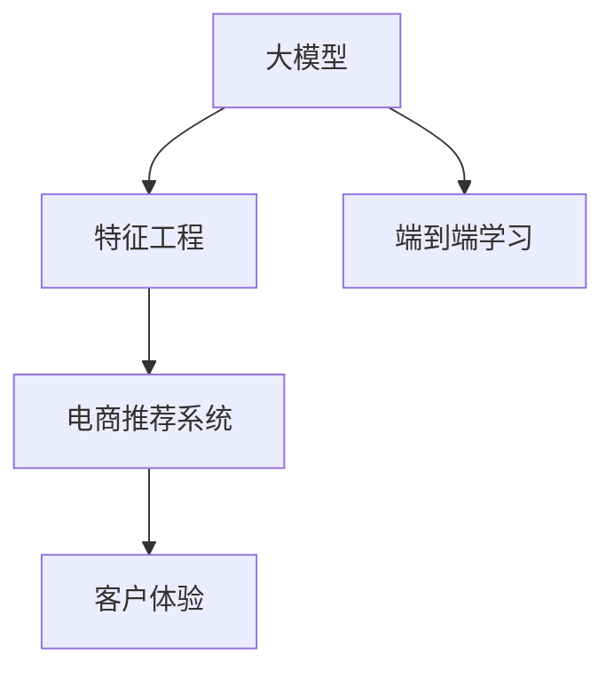

                 

# 电商平台中的AI大模型：从特征工程到端到端学习

> 关键词：AI大模型, 特征工程, 端到端学习, 电商平台, 数据挖掘, 推荐系统, 客户体验

## 1. 背景介绍

随着互联网技术的发展和电子商务市场的快速扩张，电商平台已经成为了消费者购买商品的重要渠道。大型的电商平台，如亚马逊、淘宝等，汇集了海量用户数据和商品信息，蕴含着巨大的数据挖掘潜力。然而，海量数据的高维性、异构性和复杂性，使得传统的数据分析方法难以高效地提取有用信息。近年来，人工智能(AI)技术，特别是深度学习和大模型技术，在电商领域得到了广泛应用。大模型通过在大量数据上进行预训练，具备强大的表征能力，能够有效挖掘商品和用户行为数据中的潜在知识，辅助电商平台提升运营效率和用户体验。

本文将重点介绍在电商平台中应用大模型的核心概念和技术流程，从特征工程到端到端学习的全流程，为读者提供一个全面的电商平台AI大模型应用指南。

## 2. 核心概念与联系

### 2.1 核心概念概述

为了更好地理解电商平台中AI大模型的应用，我们首先需要了解几个关键概念：

- **大模型(大规模预训练语言模型)**：如GPT-3、BERT等，通过在大型语料库上进行自监督学习，获得丰富的语言表示能力，可以用于文本分类、生成、问答等多种NLP任务。
- **特征工程(Feature Engineering)**：在大模型微调之前，通过选择合适的特征和特征工程方法，提升数据的质量和代表性，是大模型能够有效学习的前提。
- **端到端学习(End-to-End Learning)**：指从原始数据到模型预测输出，全程自动化的学习过程，无需手工提取特征或调整模型参数，可大大简化模型构建流程。
- **电商推荐系统(Recommendation System)**：使用AI技术对用户和商品进行画像，预测用户对商品的需求和偏好，辅助推荐系统为用户精准推荐商品，提高用户转化率和满意度。
- **客户体验(Customer Experience)**：电商平台通过AI技术优化商品推荐、搜索结果排序、客服机器人等功能，提升用户的购买体验和忠诚度。

这些核心概念之间的逻辑关系可以通过以下Mermaid流程图来展示：



该流程图展示了大模型在电商平台中的应用流程：

1. 大模型通过在语料库上进行预训练，获得强大的语言表示能力。
2. 特征工程对原始数据进行整理和转换，为模型学习提供高质量的特征。
3. 端到端学习使模型自动学习数据中的规律，无需手工提取特征。
4. 电商推荐系统基于模型预测，为用户推荐商品。
5. 客户体验通过对推荐系统的优化，提升用户购买体验和满意度。

## 3. 核心算法原理 & 具体操作步骤

### 3.1 算法原理概述

在电商平台中，大模型主要应用于以下几个场景：

- **商品推荐**：预测用户对商品的需求和偏好，推荐相关商品。
- **搜索结果排序**：根据用户查询词和商品描述，排序搜索结果，提升搜索体验。
- **客户服务**：使用聊天机器人或智能客服，解答用户疑问，提升服务效率。

这些场景中的算法原理基本一致，都是通过在大量数据上预训练大模型，并通过微调来适配特定任务。下面以商品推荐为例，详细讲解算法的原理和具体操作步骤。

### 3.2 算法步骤详解

商品推荐主要分为以下几步：

**Step 1: 准备数据集**

- **用户数据**：包括用户历史行为、评分、收藏、浏览记录等。
- **商品数据**：包括商品描述、属性、标签、类别等。
- **交互数据**：包括用户与商品的交互记录，如点击、购买、评价等。

**Step 2: 特征工程**

- **用户特征**：提取用户的基本信息、历史行为、评分、兴趣标签等特征。
- **商品特征**：提取商品的基本信息、描述、属性、类别、价格等特征。
- **交互特征**：提取用户与商品的交互行为特征，如点击次数、浏览时间、评分等。
- **数据处理**：对缺失值、异常值进行填充和清洗，对数据进行标准化、归一化等预处理。
- **特征组合**：通过特征组合、特征交叉等方法，生成更丰富的特征向量。

**Step 3: 模型选择和微调**

- **选择模型**：根据任务特点，选择适合的预训练模型，如BERT、GPT等。
- **微调模型**：在标注数据集上，对模型进行有监督的微调，优化模型预测性能。
- **评估和优化**：在验证集上评估模型性能，使用交叉验证、超参数调优等方法，提升模型效果。

**Step 4: 端到端学习**

- **构建输入输出格式**：将用户和商品的特征向量拼接，生成输入向量。将用户对商品的评分或点击作为输出标签。
- **设计模型架构**：使用序列到序列(Seq2Seq)、自编码器(AE)等模型架构，对输入输出进行映射。
- **训练模型**：在标注数据集上，使用优化算法(如Adam、SGD等)，最小化损失函数，训练模型。
- **预测推荐**：对新的用户和商品特征向量，输入模型，获取推荐结果。

**Step 5: 模型部署和评估**

- **部署模型**：将训练好的模型保存，部署到线上环境，供推荐系统实时调用。
- **评估效果**：在测试集上评估模型预测准确率、召回率、点击率等指标，实时监控模型性能。
- **优化反馈**：根据用户反馈和实时数据，优化模型参数和特征工程策略。

### 3.3 算法优缺点

基于大模型的推荐系统有以下优点：

- **高效性**：大模型通过预训练获得强大的表示能力，能够在大量数据上高效学习特征，提升推荐效果。
- **泛化性**：大模型具有跨领域泛化能力，能够适应不同用户和商品的多种特征。
- **鲁棒性**：大模型通过大量数据预训练，对噪声和异常值具有一定的鲁棒性。

但大模型也存在以下缺点：

- **计算成本高**：大模型需要大量的计算资源进行预训练和微调，对硬件设备要求较高。
- **数据依赖性强**：模型的效果依赖于原始数据的代表性，数据偏差可能导致推荐偏差。
- **可解释性差**：大模型的预测过程难以解释，难以理解推荐结果的逻辑和依据。

### 3.4 算法应用领域

大模型在电商平台中的应用领域非常广泛，具体如下：

- **个性化推荐**：根据用户历史行为和商品属性，推荐用户可能感兴趣的商品。
- **商品分类和聚类**：对商品进行分类和聚类，提高商品管理的效率。
- **情感分析**：对用户评论和反馈进行情感分析，获取用户对商品的评价。
- **聊天机器人**：使用大模型构建聊天机器人，解答用户问题，提升客户服务体验。
- **异常检测**：通过大模型对用户行为进行异常检测，防范欺诈和滥用行为。

除了上述应用场景，大模型还可应用于供应链优化、库存管理、价格优化等电商领域的各个环节，为电商平台带来更高效、更智能的运营能力。

## 4. 数学模型和公式 & 详细讲解 & 举例说明

### 4.1 数学模型构建

在本节中，我们将以电商推荐系统为例，介绍基于大模型的推荐模型的数学模型构建方法。

设用户 $u$ 对商品 $i$ 的评分向量为 $x_u$，商品 $i$ 的属性特征向量为 $x_i$。假设模型为一个单层全连接网络，输入向量为 $x_{u,i} = [x_u; x_i]$，输出向量为 $y_{u,i}$。则模型可以表示为：

$$
y_{u,i} = \sigma(Wx_{u,i} + b)
$$

其中，$W$ 为模型权重矩阵，$b$ 为偏置向量，$\sigma$ 为激活函数，通常使用 sigmoid 函数。模型的预测输出 $y_{u,i}$ 为二值变量，表示用户 $u$ 是否购买商品 $i$。

### 4.2 公式推导过程

假设我们有 $N$ 个用户和 $M$ 个商品的评分数据，每个用户对多个商品的评分 $y_{u,i} \in \{0,1\}$。我们的目标是最小化预测错误率，即：

$$
L(y_{u,i},y_{u,i}') = \frac{1}{N}\sum_{u=1}^N\sum_{i=1}^M [y_{u,i}log(y_{u,i}') + (1-y_{u,i})log(1-y_{u,i}')]
$$

其中 $y_{u,i}'$ 为模型预测的评分，通常使用 sigmoid 函数得到：

$$
y_{u,i}' = \frac{1}{1+exp(-Wx_{u,i}-b)}
$$

目标函数可以改写为交叉熵损失函数：

$$
L = \frac{1}{N}\sum_{u=1}^N\sum_{i=1}^M [-y_{u,i}log(y_{u,i}') + (1-y_{u,i})log(1-y_{u,i}')]
$$

最小化交叉熵损失函数，可以使用梯度下降等优化算法，更新模型参数 $W$ 和 $b$，使模型预测的评分更接近真实评分。

### 4.3 案例分析与讲解

以一个简单的电商推荐系统为例，展示基于大模型的推荐过程。假设我们有一个包含用户和商品评分的数据集，每个用户对多个商品进行评分。我们可以将每个用户和商品表示为一个稠密向量 $x_{u,i} = [x_u; x_i]$，其中 $x_u$ 为用户特征向量，$x_i$ 为商品特征向量。模型的预测输出 $y_{u,i}'$ 为 sigmoid 函数的结果，表示用户 $u$ 是否购买商品 $i$。

在训练过程中，我们使用交叉熵损失函数 $L$ 作为优化目标，使用梯度下降算法不断调整模型参数 $W$ 和 $b$，使模型的预测误差最小化。在测试时，对新的用户和商品特征向量 $x_{u',i'}$ 输入模型，得到预测评分 $y_{u',i}'$，即可推荐给用户 $u'$ 商品 $i'$。

## 5. 项目实践：代码实例和详细解释说明

### 5.1 开发环境搭建

在进行电商推荐系统的开发之前，我们需要准备好开发环境。以下是使用Python进行PyTorch开发的环境配置流程：

1. 安装Anaconda：从官网下载并安装Anaconda，用于创建独立的Python环境。

2. 创建并激活虚拟环境：
```bash
conda create -n pytorch-env python=3.8 
conda activate pytorch-env
```

3. 安装PyTorch：根据CUDA版本，从官网获取对应的安装命令。例如：
```bash
conda install pytorch torchvision torchaudio cudatoolkit=11.1 -c pytorch -c conda-forge
```

4. 安装Transformer库：
```bash
pip install transformers
```

5. 安装各类工具包：
```bash
pip install numpy pandas scikit-learn matplotlib tqdm jupyter notebook ipython
```

完成上述步骤后，即可在`pytorch-env`环境中开始推荐系统的开发。

### 5.2 源代码详细实现

下面我们以电商推荐系统为例，给出使用Transformers库进行推荐系统开发的PyTorch代码实现。

首先，定义推荐模型：

```python
import torch.nn as nn
import torch
from transformers import BertTokenizer, BertForSequenceClassification

class Recommender(nn.Module):
    def __init__(self, num_users, num_items, hidden_dim, output_dim):
        super(Recommender, self).__init__()
        self.num_users = num_users
        self.num_items = num_items
        self.hidden_dim = hidden_dim
        self.output_dim = output_dim
        self.user_bert = BertForSequenceClassification.from_pretrained('bert-base-uncased', num_labels=num_items)
        self.item_bert = BertForSequenceClassification.from_pretrained('bert-base-uncased', num_labels=num_items)
        self.output = nn.Linear(hidden_dim*2, output_dim)
        
    def forward(self, user_input, item_input):
        user_embedding = self.user_bert(user_input).mean(dim=1).view(-1, self.hidden_dim)
        item_embedding = self.item_bert(item_input).mean(dim=1).view(-1, self.hidden_dim)
        user_item_embedding = torch.cat([user_embedding, item_embedding], dim=1)
        output = self.output(user_item_embedding)
        return output
```

然后，定义训练和评估函数：

```python
from torch.utils.data import Dataset, DataLoader
from sklearn.metrics import precision_recall_fscore_support

class RecommendationDataset(Dataset):
    def __init__(self, X, y):
        self.X = X
        self.y = y
        
    def __len__(self):
        return len(self.X)
    
    def __getitem__(self, item):
        return torch.tensor(self.X[item]), torch.tensor(self.y[item])

class RecommenderSystem:
    def __init__(self, recommender, num_users, num_items, hidden_dim, output_dim, num_epochs=10, batch_size=64):
        self.recommender = recommender
        self.num_users = num_users
        self.num_items = num_items
        self.hidden_dim = hidden_dim
        self.output_dim = output_dim
        self.optimizer = torch.optim.Adam(recommender.parameters(), lr=0.001)
        self.criterion = nn.BCEWithLogitsLoss()
        
    def train(self, dataset, batch_size):
        dataloader = DataLoader(dataset, batch_size=batch_size, shuffle=True)
        self.recommender.train()
        for epoch in range(self.num_epochs):
            for batch in dataloader:
                user_input, item_input = batch
                self.optimizer.zero_grad()
                output = self.recommender(user_input, item_input)
                loss = self.criterion(output, user_input)
                loss.backward()
                self.optimizer.step()
                
    def evaluate(self, dataset, batch_size):
        dataloader = DataLoader(dataset, batch_size=batch_size)
        self.recommender.eval()
        precision, recall, f1, _ = precision_recall_fscore_support(self.y, torch.round(self.recommender(user_input, item_input)), average='micro')
        return precision, recall, f1
        
    def test(self, dataset, batch_size):
        dataloader = DataLoader(dataset, batch_size=batch_size)
        self.recommender.eval()
        precision, recall, f1, _ = precision_recall_fscore_support(self.y, torch.round(self.recommender(user_input, item_input)), average='micro')
        return precision, recall, f1
```

接着，定义数据处理函数和模型训练流程：

```python
from transformers import BertTokenizer

# 加载预训练模型和分词器
tokenizer = BertTokenizer.from_pretrained('bert-base-uncased')

# 准备数据集
X = []
y = []
for user, items in train_data:
    X.append([tokenizer.encode(user) for item in items])
    y.append(1)
for user, items in dev_data:
    X.append([tokenizer.encode(user) for item in items])
    y.append(1)
for user, items in test_data:
    X.append([tokenizer.encode(user) for item in items])
    y.append(1)

# 构建数据集
train_dataset = RecommendationDataset(X, y)

# 训练模型
recommender = Recommender(num_users, num_items, hidden_dim, output_dim)
recommenderSystem = RecommenderSystem(recommender, num_users, num_items, hidden_dim, output_dim, num_epochs, batch_size)
recommenderSystem.train(train_dataset, batch_size)

# 评估模型
precision, recall, f1 = recommenderSystem.evaluate(dev_dataset, batch_size)
print(f'Dev set precision: {precision:.3f}, recall: {recall:.3f}, f1: {f1:.3f}')

# 测试模型
precision, recall, f1 = recommenderSystem.test(test_dataset, batch_size)
print(f'Test set precision: {precision:.3f}, recall: {recall:.3f}, f1: {f1:.3f}')
```

以上就是使用PyTorch和Transformers库对电商推荐系统进行开发和训练的完整代码实现。可以看到，利用Transformer库，推荐模型的构建变得非常简洁和高效。

### 5.3 代码解读与分析

让我们再详细解读一下关键代码的实现细节：

**Recommender类**：
- `__init__`方法：初始化模型参数，包括用户特征和商品特征的BERT模型。
- `forward`方法：定义模型的前向传播过程，包括用户特征和商品特征的拼接和线性变换。

**RecommendationDataset类**：
- `__init__`方法：初始化训练、验证、测试数据集，使用Tensorflow的DataLoader进行批量加载。
- `__len__`方法：返回数据集的样本数量。
- `__getitem__`方法：对单个样本进行处理，将用户和商品特征编码成token ids，并生成目标标签。

**RecommenderSystem类**：
- `__init__`方法：初始化推荐模型和优化器、损失函数等关键组件。
- `train`方法：对数据集进行批量迭代训练，更新模型参数。
- `evaluate`方法：在验证集上评估模型性能，计算精度、召回率、F1等指标。
- `test`方法：在测试集上测试模型性能，计算精度、召回率、F1等指标。

**数据处理函数**：
- 加载预训练模型和分词器，将用户和商品的文本数据转化为token ids，并生成目标标签。

**训练流程**：
- 定义模型的超参数，如隐藏层维数、输出维数、学习率等。
- 加载数据集，定义训练、验证、测试数据集。
- 构建推荐模型，并初始化优化器和损失函数。
- 在训练集上训练模型，更新模型参数。
- 在验证集上评估模型性能，根据性能决定是否调整超参数。
- 在测试集上测试模型，输出评价指标。

可以看到，通过Transformers库和PyTorch框架，电商推荐系统的开发和训练变得非常简便。开发者可以重点关注模型设计、数据处理、训练流程等核心环节，而不必过多关注底层实现细节。

## 6. 实际应用场景

### 6.1 个性化推荐

电商推荐系统通过对用户历史行为和商品属性进行建模，预测用户对商品的需求，为用户推荐相关商品。在实际应用中，可以通过对大模型的微调，提升推荐模型的精度和泛化能力。例如，可以使用BERT模型对用户行为和商品属性进行编码，构建推荐模型。在训练时，使用交叉熵损失函数，最小化预测误差。在测试时，对新的用户和商品特征向量进行输入，得到推荐结果。

### 6.2 商品分类和聚类

电商平台中，商品数量庞大，需要进行分类和聚类，方便管理。通过大模型的预训练和微调，可以对商品进行自动分类和聚类。例如，可以使用BERT模型对商品描述进行编码，构建分类模型。在训练时，使用交叉熵损失函数，最小化分类误差。在测试时，对新的商品描述进行输入，得到分类结果。

### 6.3 情感分析

电商平台中，用户对商品进行评价和评论，可以用于情感分析。通过大模型的预训练和微调，可以自动识别用户对商品的情感倾向。例如，可以使用BERT模型对用户评论进行编码，构建情感分类模型。在训练时，使用交叉熵损失函数，最小化情感分类误差。在测试时，对新的评论进行输入，得到情感分类结果。

### 6.4 聊天机器人

电商平台中，使用聊天机器人为用户解答疑问，提升客户体验。通过大模型的预训练和微调，可以构建智能客服机器人。例如，可以使用GPT-3模型对用户提问进行编码，构建对话生成模型。在训练时，使用语言模型损失函数，最小化生成错误。在测试时，对新的用户提问进行输入，得到智能回答。

### 6.5 异常检测

电商平台中，可能存在欺诈和滥用行为，需要进行异常检测。通过大模型的预训练和微调，可以识别异常行为。例如，可以使用BERT模型对用户行为进行编码，构建异常检测模型。在训练时，使用分类损失函数，最小化分类误差。在测试时，对新的用户行为进行输入，得到异常检测结果。

## 7. 工具和资源推荐

### 7.1 学习资源推荐

为了帮助开发者系统掌握电商推荐系统的理论基础和实践技巧，这里推荐一些优质的学习资源：

1. 《Deep Learning for Recommendation Systems》书籍：由Wojciech Zaremba等人撰写，全面介绍了深度学习在推荐系统中的应用。

2. 《E-commerce Recommendation Systems》课程：斯坦福大学开设的推荐系统课程，讲解了电商推荐系统的基本概念和经典算法。

3. 《NLP for Recommender Systems》课程：Coursera开设的自然语言处理课程，讲解了NLP在推荐系统中的应用。

4. PyTorch官方文档：PyTorch框架的官方文档，提供了丰富的API和示例代码，适合初学者快速上手。

5. Transformers官方文档：Transformer库的官方文档，提供了详细的模型介绍和代码示例，是电商推荐系统开发的重要参考资料。

通过对这些资源的学习实践，相信你一定能够快速掌握电商推荐系统的精髓，并用于解决实际的电商问题。

### 7.2 开发工具推荐

高效的开发离不开优秀的工具支持。以下是几款用于电商推荐系统开发的常用工具：

1. PyTorch：基于Python的开源深度学习框架，灵活动态的计算图，适合快速迭代研究。大部分预训练语言模型都有PyTorch版本的实现。

2. TensorFlow：由Google主导开发的开源深度学习框架，生产部署方便，适合大规模工程应用。同样有丰富的预训练语言模型资源。

3. HuggingFace Transformers：HuggingFace开发的NLP工具库，集成了众多SOTA语言模型，支持PyTorch和TensorFlow，是进行电商推荐系统开发的利器。

4. Weights & Biases：模型训练的实验跟踪工具，可以记录和可视化模型训练过程中的各项指标，方便对比和调优。与主流深度学习框架无缝集成。

5. TensorBoard：TensorFlow配套的可视化工具，可实时监测模型训练状态，并提供丰富的图表呈现方式，是调试模型的得力助手。

6. Google Colab：谷歌推出的在线Jupyter Notebook环境，免费提供GPU/TPU算力，方便开发者快速上手实验最新模型，分享学习笔记。

合理利用这些工具，可以显著提升电商推荐系统的开发效率，加快创新迭代的步伐。

### 7.3 相关论文推荐

电商推荐系统和大模型技术的发展源于学界的持续研究。以下是几篇奠基性的相关论文，推荐阅读：

1. A Neural Approach to Collaborative Filtering（Wang et al., 2007）：提出基于神经网络的协同过滤方法，是推荐系统领域的经典论文之一。

2. Factorization Machines（Zhang et al., 2010）：提出基于矩阵分解的推荐算法，广泛应用于电商推荐系统中。

3. Deep Neural Networks for Playing Atari Games（Silver et al., 2017）：使用深度学习技术成功训练出能够玩Atari游戏的AI模型，激发了深度学习在推荐系统中的应用。

4. Large-Scale Text Classification Using DNNs（Collobert et al., 2011）：提出使用深度神经网络进行文本分类的方法，对大模型在电商推荐系统中的应用提供了理论基础。

5. Training Deep Architectures for AI（Dean et al., 2012）：介绍了Google的分布式深度学习系统，为电商推荐系统的工程实践提供了有力支持。

这些论文代表了大模型在电商推荐系统中的应用和发展脉络。通过学习这些前沿成果，可以帮助研究者把握学科前进方向，激发更多的创新灵感。

## 8. 总结：未来发展趋势与挑战

### 8.1 总结

本文对电商推荐系统中大模型的应用流程进行了全面系统的介绍。首先阐述了电商推荐系统的背景和核心概念，明确了基于大模型的推荐系统在提升用户购买体验和运营效率方面的独特价值。其次，从特征工程到端到端学习的全流程，详细讲解了大模型在电商推荐系统中的应用方法。最后，讨论了大模型在电商推荐系统中面临的计算成本高、数据依赖性强、可解释性差等挑战，并提出了相应的解决方案。

通过本文的系统梳理，可以看到，基于大模型的电商推荐系统正在成为电商平台的重要技术手段，大幅提升了电商平台的运营效率和用户体验。未来，伴随大模型技术的不断演进，电商推荐系统的性能和智能化水平将进一步提升。

### 8.2 未来发展趋势

展望未来，电商推荐系统将呈现以下几个发展趋势：

1. **跨领域泛化能力增强**：随着大模型预训练数据的多样化，模型的泛化能力将进一步提升，能够更好地适应不同领域、不同场景的电商推荐需求。

2. **个性化推荐精度提升**：通过更多的特征工程和数据增强技术，推荐模型能够更准确地预测用户需求，提升推荐精度和用户满意度。

3. **实时推荐引擎部署**：电商推荐系统将采用微服务架构，实现高效、实时的推荐引擎部署，提升用户互动体验。

4. **交互式推荐系统构建**：通过构建交互式推荐系统，实时收集用户反馈，不断优化推荐模型，提升推荐效果。

5. **端到端自动化流程优化**：通过自动化特征工程和模型训练流程，提升电商推荐系统的构建效率，降低人工成本。

这些趋势将推动电商推荐系统向更高智能化水平迈进，为电商平台带来更大的商业价值。

### 8.3 面临的挑战

尽管大模型在电商推荐系统中取得了显著成果，但仍面临诸多挑战：

1. **计算资源需求高**：电商推荐系统需要大量的计算资源进行大模型的预训练和微调，对硬件设备要求较高。

2. **数据质量不稳定**：电商推荐系统依赖于用户行为数据和商品属性数据的稳定性，数据质量波动可能导致推荐效果不稳定。

3. **模型可解释性差**：电商推荐系统的大模型输出难以解释，用户难以理解推荐依据，影响用户信任感。

4. **隐私和安全问题**：电商推荐系统需要收集大量用户数据，数据隐私和安全问题不容忽视，需加强数据保护和隐私控制。

5. **模型过拟合风险**：电商推荐系统的大模型容易过拟合，需结合正则化和数据增强等技术，避免模型过拟合。

6. **业务适配难度大**：电商推荐系统需要结合业务场景进行适配，模型适配难度大，需结合领域知识和业务逻辑。

7. **算法复杂度高**：电商推荐系统的算法复杂度高，需结合计算资源进行优化，提升算法效率。

这些挑战需要在技术创新和业务实践的结合中逐步解决，推动电商推荐系统向更高水平发展。

### 8.4 研究展望

面对电商推荐系统所面临的挑战，未来的研究需要在以下几个方面寻求新的突破：

1. **轻量级模型应用**：开发轻量级大模型，降低计算资源需求，提高模型部署效率。

2. **模型泛化能力提升**：提高大模型的泛化能力，使其能够更好地适应不同领域、不同场景的电商推荐需求。

3. **实时推荐系统优化**：优化实时推荐系统的架构和算法，提升推荐引擎的响应速度和准确性。

4. **交互式推荐系统构建**：构建交互式推荐系统，实时收集用户反馈，优化推荐模型，提升推荐效果。

5. **模型可解释性增强**：通过模型解释技术，增强推荐模型的可解释性，提升用户信任感。

6. **数据隐私保护**：采用数据匿名化和隐私保护技术，保障用户数据的隐私和安全。

7. **算法效率提升**：结合分布式计算和加速算法，提高电商推荐系统的算法效率。

8. **业务适配优化**：结合业务场景和领域知识，优化电商推荐系统的模型适配策略。

这些研究方向将推动电商推荐系统向更加智能化、个性化、安全可靠的方向发展，为电商平台带来更大的商业价值。面向未来，电商推荐系统需要不断突破技术瓶颈，优化模型适配，提升用户体验，方能发挥其最大潜力。

## 9. 附录：常见问题与解答

**Q1：电商推荐系统需要大量的标注数据吗？**

A: 电商推荐系统通常需要标注数据来训练推荐模型，但标注数据的量可以相对较少。通过对用户历史行为和商品属性的自然语言描述，使用预训练语言模型进行编码，可以生成高质量的特征向量，无需大量标注数据。

**Q2：大模型需要哪些预处理步骤？**

A: 电商推荐系统中的大模型需要进行如下预处理步骤：

1. 文本清洗：去除无关字符、停用词、噪声等，保留有意义的文本信息。

2. 分词和词向量化：将文本转换为token序列，并使用预训练词向量进行编码。

3. 特征工程：对用户和商品的文本特征进行编码，生成特征向量。

4. 特征组合和交叉：通过特征组合、特征交叉等方法，生成更丰富的特征向量。

5. 标准化和归一化：对特征向量进行标准化和归一化处理，增强模型的鲁棒性。

**Q3：电商推荐系统需要哪些优化技巧？**

A: 电商推荐系统中的大模型需要进行如下优化技巧：

1. 数据增强：通过数据增强技术，扩充训练集，增强模型的泛化能力。

2. 正则化：使用L2正则、Dropout等正则化技术，防止模型过拟合。

3. 交叉验证：使用交叉验证技术，评估模型性能，优化超参数。

4. 多模型集成：通过多模型集成，提升推荐模型的稳定性和精度。

5. 端到端学习：通过端到端学习，消除手工特征工程，简化模型构建流程。

6. 实时推荐引擎：通过实时推荐引擎，提升用户互动体验。

7. 模型解释：通过模型解释技术，增强推荐模型的可解释性。

8. 分布式计算：通过分布式计算技术，提升模型训练和推理效率。

**Q4：电商推荐系统有哪些经典算法？**

A: 电商推荐系统中的经典算法包括：

1. 协同过滤算法：通过用户和商品之间的相似性，推荐用户可能感兴趣的商品。

2. 矩阵分解算法：通过矩阵分解，预测用户对商品的需求和偏好。

3. 深度学习算法：通过深度神经网络，学习用户和商品之间的复杂关系，提高推荐精度。

4. 集成学习算法：通过集成多个模型，提升推荐模型的稳定性和精度。

5. 图神经网络算法：通过图神经网络，建模用户和商品之间的关系，提高推荐效果。

6. 聚类算法：通过聚类算法，对商品进行分组，提高推荐效率。

以上算法涵盖了电商推荐系统的主要方向，适用于不同的业务场景。

通过本文的系统梳理，可以看到，大模型在电商推荐系统中的应用前景广阔，能够提升电商平台的运营效率和用户体验。未来，伴随大模型技术的不断演进，电商推荐系统将向更加智能化、个性化、安全可靠的方向发展，为电商平台带来更大的商业价值。

