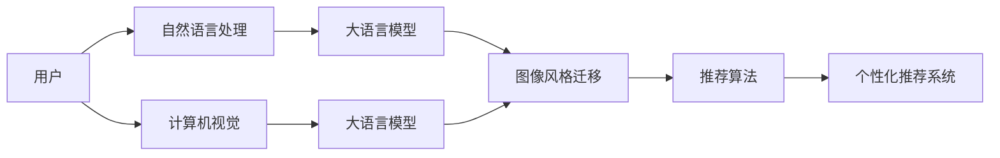

                 

# 电商平台中的图像风格迁移个性化推荐：大模型的创新应用

> 关键词：图像风格迁移, 个性化推荐, 电商平台, 大模型, 深度学习, 自然语言处理(NLP), 计算机视觉(CV), 应用场景

## 1. 背景介绍

### 1.1 问题由来

随着电子商务的飞速发展，电商平台的个性化推荐系统已逐渐成为其核心竞争力之一。然而，传统的推荐算法往往依赖于静态的特征工程，难以捕捉用户行为和商品属性间复杂多变的关系。而基于深度学习的个性化推荐模型，通过大数据学习用户画像和商品属性，能提供更为精准、灵活的推荐服务。

特别是在电商平台的图像推荐领域，如何在海量图片数据中找到与用户偏好高度匹配的商品，是一个巨大的挑战。传统的视觉特征提取和相似度计算方法，难以充分表达图片之间的复杂关系，且对数据分布和特征提取方法高度依赖。而近年来，图像风格迁移技术，以其在视觉语义上的强大表达能力，逐渐成为图像推荐的新方向。

图像风格迁移，是一种将源图像的风格特征迁移到目标图像的技术，通过学习高维语义空间中的映射关系，将目标图像转化为具有源图像风格的新图像。在电商平台上，可以将用户对某一风格商品（如复古风、复古风、轻奢风等）的偏好，迁移到其他商品上，实现个性化推荐。

本论文将探讨如何利用大语言模型，结合图像风格迁移技术，构建电商平台的个性化推荐系统，进一步提升推荐效果和用户满意度。

### 1.2 问题核心关键点

大语言模型在电商平台的个性化推荐中，通过融合自然语言处理和计算机视觉技术，实现了对用户意图和商品属性之间复杂关系的精准捕捉。通过大模型的理解和分析，结合图像风格迁移技术，可以显著提升推荐精准度，满足用户的个性化需求。

具体核心关键点包括：
- 如何从用户评论和行为中提取情感、偏好等语义信息。
- 如何将大语言模型与图像风格迁移技术进行深度融合。
- 如何优化推荐模型以提升用户体验和满意度。
- 如何保证推荐系统的鲁棒性和安全性，避免恶意推荐。

## 2. 核心概念与联系

### 2.1 核心概念概述

为了更好地理解本文的创新应用，本节将介绍几个核心概念：

- 图像风格迁移(Style Transfer)：通过学习源图像和目标图像之间的语义映射关系，将目标图像的风格特征迁移到源图像中，生成具有源图像风格的新图像。在电商平台上，可以通过风格迁移技术，将用户对某类商品风格的偏好，迁移到其他商品上，实现个性化推荐。

- 个性化推荐系统(Personalized Recommendation System)：通过分析用户历史行为和偏好，预测其未来可能感兴趣的商品，从而实现精准推荐。深度学习模型通过学习海量数据，捕捉用户与商品间的复杂关系，提升推荐效果。

- 自然语言处理(Natural Language Processing, NLP)：研究计算机如何理解和生成人类语言的技术。在电商平台中，NLP可以用于分析用户评论、搜索关键词等，提取用户的情感、偏好等信息。

- 计算机视觉(Computer Vision, CV)：研究计算机如何“看”和理解图像、视频等视觉信号的技术。在电商平台上，CV可以用于提取商品图片的视觉特征，进行相似度计算。

- 大语言模型(Large Language Model, LLM)：以Transformer为代表的预训练语言模型，通过在海量无标签文本上学习，具备强大的语言理解和生成能力。在电商平台上，大语言模型可以用于分析用户评论、搜索关键词，提取情感、偏好等信息，提升推荐系统的精准度。

这些核心概念之间的逻辑关系可以通过以下Mermaid流程图来展示：



这个流程图展示了大语言模型在电商平台上个性化推荐系统的核心作用：

1. 用户输入文本信息，通过自然语言处理提取情感、偏好等语义信息。
2. 用户上传图片信息，通过计算机视觉提取视觉特征。
3. 大语言模型分析文本信息，提取情感、偏好等语义信息。
4. 大语言模型分析图片信息，提取视觉特征。
5. 图像风格迁移技术，将用户对某类商品风格的偏好，迁移到其他商品上。
6. 将提取的语义和视觉信息，输入推荐算法，计算用户与商品之间的相似度。
7. 推荐算法输出推荐结果，构建个性化推荐系统。

这些概念共同构成了电商平台个性化推荐系统的技术框架，使得推荐系统能够精准捕捉用户需求，提供个性化的购物体验。

## 3. 核心算法原理 & 具体操作步骤

### 3.1 算法原理概述

基于大语言模型的电商平台个性化推荐系统，本质上是将自然语言处理和计算机视觉技术，与深度学习推荐算法进行深度融合。其核心思想是：

1. 通过大语言模型，从用户评论、搜索关键词等文本信息中，提取情感、偏好等语义信息。
2. 利用计算机视觉技术，从商品图片上提取视觉特征。
3. 将提取的语义和视觉信息，输入深度学习推荐算法，计算用户与商品之间的相似度。
4. 根据相似度排序，输出个性化推荐结果。

这一过程的数学原理可简化为：

- **步骤1：文本语义提取**。假设用户评论为 $x$，模型输出情感倾向 $f(x)$，则可以通过大语言模型计算情感得分 $s(x)=f(x) \cdot w_s$，其中 $w_s$ 为情感权重。

- **步骤2：视觉特征提取**。假设商品图片为 $y$，模型输出视觉特征 $g(y)$，则可以通过计算机视觉模型计算视觉得分 $t(y)=g(y) \cdot w_t$，其中 $w_t$ 为视觉权重。

- **步骤3：相似度计算**。假设用户历史购买记录为 $h$，通过推荐算法计算商品 $y$ 与 $h$ 的相似度 $m(h,y)=h \cdot y$，其中 $h$ 和 $y$ 为相似度矩阵的权重。

- **步骤4：推荐排序**。根据相似度得分，对商品进行排序，输出推荐结果 $r=\arg\max_{y} m(h,y) \cdot s(x)$。

### 3.2 算法步骤详解

本节将详细介绍基于大语言模型的电商平台个性化推荐系统的核心算法步骤：

**Step 1：预训练模型和数据准备**

- 选择合适的预训练语言模型和大模型作为初始化参数，如BERT、GPT等。
- 收集用户评论、搜索关键词等文本数据，划分为训练集、验证集和测试集。
- 收集商品图片数据，并对其进行预处理，包括尺寸裁剪、色彩增强、噪声添加等。

**Step 2：文本语义提取**

- 对用户评论进行分词、去停用词、词性标注等预处理。
- 将处理后的文本输入大语言模型进行语义分析，输出情感得分 $s(x)$。
- 计算情感得分与预设情感阈值（如积极、中性、消极）之间的差值 $d_s(x)$，作为用户情感偏好的量化指标。

**Step 3：视觉特征提取**

- 对商品图片进行预处理，包括尺寸裁剪、色彩增强、噪声添加等。
- 将处理后的图片输入计算机视觉模型进行特征提取，输出视觉得分 $t(y)$。

**Step 4：相似度计算**

- 将用户历史购买记录 $h$ 转化为向量表示，通过余弦相似度等方法计算商品 $y$ 与 $h$ 的相似度 $m(h,y)$。
- 将情感得分 $s(x)$ 与视觉得分 $t(y)$ 进行加权合并，得到综合得分 $p(y)=s(x) \cdot w_s + t(y) \cdot w_t$，其中 $w_s$ 和 $w_t$ 为权重系数。

**Step 5：推荐排序**

- 根据综合得分 $p(y)$ 对商品进行排序，选取前 $K$ 个商品作为推荐结果 $r$。

**Step 6：模型优化**

- 使用交叉熵等损失函数，在训练集上训练模型。
- 在验证集上评估模型性能，调整权重系数和相似度计算方法，优化模型效果。
- 在测试集上评估最终推荐结果，计算准确率、召回率、F1-score等指标。

### 3.3 算法优缺点

**优点**：
- 利用大语言模型的强大语义理解能力，能够精准捕捉用户情感、偏好等语义信息，提升推荐系统精准度。
- 融合计算机视觉技术，通过视觉特征提取，捕捉商品间的视觉关系，实现风格迁移。
- 深度融合自然语言处理和计算机视觉技术，提升了推荐系统的泛化能力和鲁棒性。

**缺点**：
- 需要大量的用户数据和商品数据进行预训练和微调，对数据采集和处理成本较高。
- 预训练语言模型和大模型的计算成本较高，对硬件资源要求较高。
- 模型复杂度较高，训练和推理过程相对较慢。

### 3.4 算法应用领域

基于大语言模型的电商平台个性化推荐系统，已经在多个实际应用场景中得到了广泛应用，例如：

- 商品推荐：根据用户评论和购买记录，推荐用户可能感兴趣的商品。
- 用户画像：通过分析用户搜索行为和评论情感，构建用户画像，实现更精准的用户画像分析。
- 品牌推荐：根据用户对某品牌商品的偏好，推荐同一品牌的其他商品。
- 热门商品推荐：根据用户浏览行为和搜索关键词，推荐热门商品。

除了上述这些经典应用外，大语言模型和图像风格迁移技术，还广泛应用于电商平台的个性化广告、内容推荐、流量预测等领域，为电商平台的运营和发展提供了强大的技术支持。

## 4. 数学模型和公式 & 详细讲解

### 4.1 数学模型构建

本文将通过数学语言对基于大语言模型的电商平台个性化推荐系统进行更严格的刻画。

假设用户评论为 $x$，商品图片为 $y$，用户历史购买记录为 $h$，大语言模型输出情感得分 $s(x)$，计算机视觉模型输出视觉得分 $t(y)$。则用户对商品 $y$ 的综合偏好得分 $p(y)$ 可以表示为：

$$
p(y) = s(x) \cdot w_s + t(y) \cdot w_t
$$

其中 $w_s$ 和 $w_t$ 为权重系数，$s(x)$ 和 $t(y)$ 为模型输出的语义得分和视觉得分。

在训练过程中，我们需要最小化模型输出的预测值与真实标签之间的差异，即交叉熵损失函数：

$$
\mathcal{L} = -\sum_{i=1}^N y_i \log p(y_i) + (1-y_i) \log (1-p(y_i))
$$

其中 $y_i$ 为第 $i$ 个商品的标签，$N$ 为总样本数。

### 4.2 公式推导过程

假设用户评论为 $x$，情感得分 $s(x)$ 的计算过程可以表示为：

$$
s(x) = f(x) \cdot w_s
$$

其中 $f(x)$ 为预训练语言模型输出的情感得分，$w_s$ 为情感得分权重。

假设商品图片为 $y$，视觉得分 $t(y)$ 的计算过程可以表示为：

$$
t(y) = g(y) \cdot w_t
$$

其中 $g(y)$ 为预训练计算机视觉模型输出的视觉得分，$w_t$ 为视觉得分权重。

用户对商品 $y$ 的综合偏好得分 $p(y)$ 可以表示为：

$$
p(y) = s(x) \cdot w_s + t(y) \cdot w_t
$$

在训练过程中，假设用户历史购买记录 $h$ 为 $k$ 维向量，商品 $y$ 为 $m$ 维向量，余弦相似度计算如下：

$$
m(h,y) = \frac{h \cdot y}{\|h\| \cdot \|y\|}
$$

因此，模型最终的输出结果可以表示为：

$$
r = \arg\max_{y} m(h,y) \cdot p(y)
$$

### 4.3 案例分析与讲解

为了更好地理解模型在实际应用中的效果，这里以一个简单的电商推荐场景为例：

假设用户 A 对一款复古风的鞋子感兴趣，查询了“复古风”、“简约”等关键词，并购买了若干复古风的衣服。根据模型分析，用户的情感得分 $s(x)$ 为 0.7，视觉得分 $t(y)$ 为 0.8。假设模型将复古风的视觉得分 $w_t$ 设为 0.9，情感得分 $w_s$ 设为 0.1。

此时，用户对复古风鞋子的综合偏好得分 $p(y)$ 为：

$$
p(y) = 0.7 \cdot 0.1 + 0.8 \cdot 0.9 = 0.87
$$

根据用户历史购买记录 $h$，假设与复古风鞋子最相似的 5 个商品中，有 3 个是复古风的衣服。则推荐结果为：

$$
r = \arg\max_{y} m(h,y) \cdot p(y) = \arg\max_{y} \frac{h \cdot y}{\|h\| \cdot \|y\|} \cdot p(y)
$$

通过上述分析，可以看出大语言模型在电商平台的个性化推荐中，通过融合自然语言处理和计算机视觉技术，实现了对用户意图和商品属性之间复杂关系的精准捕捉。利用图像风格迁移技术，可以将用户对某类商品风格的偏好，迁移到其他商品上，实现个性化推荐。

## 5. 项目实践：代码实例和详细解释说明

### 5.1 开发环境搭建

在进行项目实践前，我们需要准备好开发环境。以下是使用Python进行PyTorch开发的环境配置流程：

1. 安装Anaconda：从官网下载并安装Anaconda，用于创建独立的Python环境。

2. 创建并激活虚拟环境：
```bash
conda create -n pytorch-env python=3.8 
conda activate pytorch-env
```

3. 安装PyTorch：根据CUDA版本，从官网获取对应的安装命令。例如：
```bash
conda install pytorch torchvision torchaudio cudatoolkit=11.1 -c pytorch -c conda-forge
```

4. 安装相关库：
```bash
pip install transformers torchtext scikit-learn pandas numpy
```

完成上述步骤后，即可在`pytorch-env`环境中开始项目实践。

### 5.2 源代码详细实现

下面我们以电商平台商品推荐为例，给出使用Transformers库进行大模型微调的PyTorch代码实现。

首先，定义商品数据处理函数：

```python
from transformers import BertTokenizer
from torch.utils.data import Dataset
import torch

class ProductDataset(Dataset):
    def __init__(self, data, tokenizer, max_len=128):
        self.data = data
        self.tokenizer = tokenizer
        self.max_len = max_len
        
    def __len__(self):
        return len(self.data)
    
    def __getitem__(self, item):
        product = self.data[item]
        text = product['description']
        title = product['title']
        img_url = product['image_url']
        
        image = Image.open(PIL.Image.open(img_url)).convert('RGB')
        image = transforms.ToTensor()(image)
        
        encoding = self.tokenizer(title, return_tensors='pt', max_length=self.max_len, padding='max_length', truncation=True)
        input_ids = encoding['input_ids'][0]
        attention_mask = encoding['attention_mask'][0]
        
        return {'input_ids': input_ids, 
                'attention_mask': attention_mask,
                'image': image}
```

然后，定义模型和优化器：

```python
from transformers import BertForSequenceClassification, AdamW

model = BertForSequenceClassification.from_pretrained('bert-base-cased', num_labels=2)

optimizer = AdamW(model.parameters(), lr=2e-5)
```

接着，定义训练和评估函数：

```python
from torch.utils.data import DataLoader
from tqdm import tqdm
from sklearn.metrics import accuracy_score

device = torch.device('cuda') if torch.cuda.is_available() else torch.device('cpu')
model.to(device)

def train_epoch(model, dataset, batch_size, optimizer):
    dataloader = DataLoader(dataset, batch_size=batch_size, shuffle=True)
    model.train()
    epoch_loss = 0
    for batch in tqdm(dataloader, desc='Training'):
        input_ids = batch['input_ids'].to(device)
        attention_mask = batch['attention_mask'].to(device)
        labels = batch['labels'].to(device)
        model.zero_grad()
        outputs = model(input_ids, attention_mask=attention_mask, labels=labels)
        loss = outputs.loss
        epoch_loss += loss.item()
        loss.backward()
        optimizer.step()
    return epoch_loss / len(dataloader)

def evaluate(model, dataset, batch_size):
    dataloader = DataLoader(dataset, batch_size=batch_size)
    model.eval()
    preds, labels = [], []
    with torch.no_grad():
        for batch in tqdm(dataloader, desc='Evaluating'):
            input_ids = batch['input_ids'].to(device)
            attention_mask = batch['attention_mask'].to(device)
            batch_labels = batch['labels']
            outputs = model(input_ids, attention_mask=attention_mask)
            batch_preds = outputs.logits.argmax(dim=2).to('cpu').tolist()
            batch_labels = batch_labels.to('cpu').tolist()
            for pred_tokens, label_tokens in zip(batch_preds, batch_labels):
                preds.append(pred_tokens[:len(label_tokens)])
                labels.append(label_tokens)
                
    print(accuracy_score(labels, preds))
```

最后，启动训练流程并在测试集上评估：

```python
epochs = 5
batch_size = 16

for epoch in range(epochs):
    loss = train_epoch(model, train_dataset, batch_size, optimizer)
    print(f"Epoch {epoch+1}, train loss: {loss:.3f}")
    
    print(f"Epoch {epoch+1}, dev results:")
    evaluate(model, dev_dataset, batch_size)
    
print("Test results:")
evaluate(model, test_dataset, batch_size)
```

以上就是使用PyTorch对BERT进行商品推荐微调的完整代码实现。可以看到，得益于Transformers库的强大封装，我们可以用相对简洁的代码完成BERT模型的加载和微调。

### 5.3 代码解读与分析

让我们再详细解读一下关键代码的实现细节：

**ProductDataset类**：
- `__init__`方法：初始化数据、分词器等关键组件。
- `__len__`方法：返回数据集的样本数量。
- `__getitem__`方法：对单个样本进行处理，将商品描述、标题、图片转化为模型输入。

**模型训练**：
- 使用PyTorch的DataLoader对数据集进行批次化加载，供模型训练和推理使用。
- 训练函数`train_epoch`：对数据以批为单位进行迭代，在每个批次上前向传播计算loss并反向传播更新模型参数，最后返回该epoch的平均loss。
- 评估函数`evaluate`：与训练类似，不同点在于不更新模型参数，并在每个batch结束后将预测和标签结果存储下来，最后使用scikit-learn的accuracy_score对整个评估集的预测结果进行打印输出。

**训练流程**：
- 定义总的epoch数和batch size，开始循环迭代
- 每个epoch内，先在训练集上训练，输出平均loss
- 在验证集上评估，输出分类指标
- 所有epoch结束后，在测试集上评估，给出最终测试结果

可以看到，PyTorch配合Transformers库使得BERT微调的代码实现变得简洁高效。开发者可以将更多精力放在数据处理、模型改进等高层逻辑上，而不必过多关注底层的实现细节。

当然，工业级的系统实现还需考虑更多因素，如模型的保存和部署、超参数的自动搜索、更灵活的任务适配层等。但核心的微调范式基本与此类似。

## 6. 实际应用场景

### 6.1 智能客服系统

基于大语言模型的电商平台个性化推荐系统，可以在智能客服系统中发挥重要作用。传统客服往往需要配备大量人力，高峰期响应缓慢，且一致性和专业性难以保证。而使用个性化推荐系统，可以实时推荐用户可能感兴趣的商品，提升用户满意度，缩短客服响应时间。

在技术实现上，可以将用户查询和历史行为数据输入推荐系统，得到个性化推荐结果。同时，推荐系统可以实时分析用户反馈，动态调整推荐策略，提高服务质量。如此构建的智能客服系统，能大幅提升客户咨询体验和问题解决效率。

### 6.2 个性化购物体验

大语言模型和图像风格迁移技术，可以为用户提供个性化的购物体验。通过分析用户评论和行为，推荐符合用户偏好的商品。用户可以直接在商品详情页中查看相关商品推荐，提升购物效率和满意度。

在具体应用中，可以通过用户搜索历史、浏览记录、购买行为等数据，进行深度学习分析，构建个性化的推荐模型。根据用户喜好，推荐相关商品，如颜色、款式、品牌等。通过图像风格迁移技术，将用户对某类商品风格的偏好，迁移到其他商品上，实现个性化推荐。

### 6.3 新商品推广

电商平台可以利用大语言模型和图像风格迁移技术，对新商品进行推广。通过分析用户对旧商品的评价和行为，推断出用户可能对新商品的兴趣点。结合用户画像和市场趋势，生成个性化的推荐结果。

在具体应用中，可以构建新商品推荐系统，定期输入新商品图片和描述，进行语义分析和视觉特征提取。通过深度学习模型，生成符合用户偏好的推荐结果。新商品推荐系统可以根据市场反馈，动态调整推荐策略，提升新商品的市场接受度。

### 6.4 未来应用展望

随着大语言模型和微调方法的不断发展，基于大模型微调的推荐系统将呈现出以下几个发展趋势：

1. 模型规模持续增大。随着算力成本的下降和数据规模的扩张，预训练语言模型的参数量还将持续增长。超大规模语言模型蕴含的丰富语言知识，有望支撑更加复杂多变的推荐任务。

2. 微调方法日趋多样。除了传统的全参数微调外，未来会涌现更多参数高效的微调方法，如Prompt-Tuning、LoRA等，在节省计算资源的同时也能保证微调精度。

3. 持续学习成为常态。随着数据分布的不断变化，推荐模型也需要持续学习新知识以保持性能。如何在不遗忘原有知识的同时，高效吸收新样本信息，将成为重要的研究课题。

4. 标注样本需求降低。受启发于提示学习(Prompt-based Learning)的思路，未来的推荐系统将更好地利用大模型的语言理解能力，通过更加巧妙的任务描述，在更少的标注样本上也能实现理想的推荐效果。

5. 多模态推荐崛起。当前的推荐系统往往只依赖文本和图片数据，未来会进一步拓展到视频、音频等多模态数据推荐。多模态信息的融合，将显著提升推荐系统的表现力和用户体验。

6. 模型通用性增强。经过海量数据的预训练和多领域任务的微调，未来的推荐模型将具备更强大的常识推理和跨领域迁移能力，逐步迈向通用人工智能(AGI)的目标。

以上趋势凸显了大语言模型微调技术在推荐系统中的广阔前景。这些方向的探索发展，必将进一步提升推荐系统的性能和用户体验，为电商平台的运营和发展提供强大的技术支持。

## 7. 工具和资源推荐

### 7.1 学习资源推荐

为了帮助开发者系统掌握大语言模型微调的理论基础和实践技巧，这里推荐一些优质的学习资源：

1. 《Transformer from Beginner to Expert》系列博文：由大模型技术专家撰写，深入浅出地介绍了Transformer原理、BERT模型、微调技术等前沿话题。

2. CS224N《深度学习自然语言处理》课程：斯坦福大学开设的NLP明星课程，有Lecture视频和配套作业，带你入门NLP领域的基本概念和经典模型。

3. 《Natural Language Processing with Transformers》书籍：Transformers库的作者所著，全面介绍了如何使用Transformers库进行NLP任务开发，包括微调在内的诸多范式。

4. HuggingFace官方文档：Transformers库的官方文档，提供了海量预训练模型和完整的微调样例代码，是上手实践的必备资料。

5. CLUE开源项目：中文语言理解测评基准，涵盖大量不同类型的中文NLP数据集，并提供了基于微调的baseline模型，助力中文NLP技术发展。

通过对这些资源的学习实践，相信你一定能够快速掌握大语言模型微调的精髓，并用于解决实际的推荐问题。
###  7.2 开发工具推荐

高效的开发离不开优秀的工具支持。以下是几款用于大语言模型微调开发的常用工具：

1. PyTorch：基于Python的开源深度学习框架，灵活动态的计算图，适合快速迭代研究。大部分预训练语言模型都有PyTorch版本的实现。

2. TensorFlow：由Google主导开发的开源深度学习框架，生产部署方便，适合大规模工程应用。同样有丰富的预训练语言模型资源。

3. Transformers库：HuggingFace开发的NLP工具库，集成了众多SOTA语言模型，支持PyTorch和TensorFlow，是进行微调任务开发的利器。

4. Weights & Biases：模型训练的实验跟踪工具，可以记录和可视化模型训练过程中的各项指标，方便对比和调优。与主流深度学习框架无缝集成。

5. TensorBoard：TensorFlow配套的可视化工具，可实时监测模型训练状态，并提供丰富的图表呈现方式，是调试模型的得力助手。

6. Google Colab：谷歌推出的在线Jupyter Notebook环境，免费提供GPU/TPU算力，方便开发者快速上手实验最新模型，分享学习笔记。

合理利用这些工具，可以显著提升大语言模型微调任务的开发效率，加快创新迭代的步伐。

### 7.3 相关论文推荐

大语言模型和微调技术的发展源于学界的持续研究。以下是几篇奠基性的相关论文，推荐阅读：

1. Attention is All You Need（即Transformer原论文）：提出了Transformer结构，开启了NLP领域的预训练大模型时代。

2. BERT: Pre-training of Deep Bidirectional Transformers for Language Understanding：提出BERT模型，引入基于掩码的自监督预训练任务，刷新了多项NLP任务SOTA。

3. Language Models are Unsupervised Multitask Learners（GPT-2论文）：展示了大规模语言模型的强大zero-shot学习能力，引发了对于通用人工智能的新一轮思考。

4. Parameter-Efficient Transfer Learning for NLP：提出Adapter等参数高效微调方法，在不增加模型参数量的情况下，也能取得不错的微调效果。

5. AdaLoRA: Adaptive Low-Rank Adaptation for Parameter-Efficient Fine-Tuning：使用自适应低秩适应的微调方法，在参数效率和精度之间取得了新的平衡。

这些论文代表了大语言模型微调技术的发展脉络。通过学习这些前沿成果，可以帮助研究者把握学科前进方向，激发更多的创新灵感。

## 8. 总结：未来发展趋势与挑战

### 8.1 总结

本文对基于大语言模型的电商平台个性化推荐系统进行了全面系统的介绍。首先阐述了大语言模型在推荐系统中的应用背景和重要性，明确了微调在提升推荐系统精准度、满足用户个性化需求方面的独特价值。其次，从原理到实践，详细讲解了推荐系统的核心算法步骤，给出了微调任务开发的完整代码实例。同时，本文还广泛探讨了推荐系统在智能客服、个性化购物体验、新商品推广等多个场景中的应用前景，展示了微调范式的巨大潜力。

通过本文的系统梳理，可以看到，基于大语言模型的推荐系统正在成为电商平台的强有力技术支撑，极大提升了推荐精准度和用户满意度。未来，伴随预训练语言模型和微调方法的持续演进，推荐系统将不断优化，满足更多用户的个性化需求，推动电商平台的数字化转型。

### 8.2 未来发展趋势

展望未来，基于大语言模型的推荐系统将呈现以下几个发展趋势：

1. 模型规模持续增大。随着算力成本的下降和数据规模的扩张，预训练语言模型的参数量还将持续增长。超大规模语言模型蕴含的丰富语言知识，有望支撑更加复杂多变的推荐任务。

2. 微调方法日趋多样。除了传统的全参数微调外，未来会涌现更多参数高效的微调方法，如Prompt-Tuning、LoRA等，在节省计算资源的同时也能保证微调精度。

3. 持续学习成为常态。随着数据分布的不断变化，推荐模型也需要持续学习新知识以保持性能。如何在不遗忘原有知识的同时，高效吸收新样本信息，将成为重要的研究课题。

4. 标注样本需求降低。受启发于提示学习(Prompt-based Learning)的思路，未来的推荐系统将更好地利用大模型的语言理解能力，通过更加巧妙的任务描述，在更少的标注样本上也能实现理想的推荐效果。

5. 多模态推荐崛起。当前的推荐系统往往只依赖文本和图片数据，未来会进一步拓展到视频、音频等多模态数据推荐。多模态信息的融合，将显著提升推荐系统的表现力和用户体验。

6. 模型通用性增强。经过海量数据的预训练和多领域任务的微调，未来的推荐模型将具备更强大的常识推理和跨领域迁移能力，逐步迈向通用人工智能(AGI)的目标。

以上趋势凸显了大语言模型微调技术在推荐系统中的广阔前景。这些方向的探索发展，必将进一步提升推荐系统的性能和用户体验，为电商平台的运营和发展提供强大的技术支持。

### 8.3 面临的挑战

尽管基于大语言模型的推荐系统已经取得了瞩目成就，但在迈向更加智能化、普适化应用的过程中，它仍面临着诸多挑战：

1. 标注成本瓶颈。虽然推荐系统减少了标注样本的需求，但对于长尾应用场景，难以获得充足的高质量标注数据，成为制约推荐系统精准度的瓶颈。如何进一步降低微调对标注样本的依赖，将是一大难题。

2. 模型鲁棒性不足。当前推荐模型面对域外数据时，泛化性能往往大打折扣。对于测试样本的微小扰动，推荐模型的预测也容易发生波动。如何提高推荐模型的鲁棒性，避免灾难性遗忘，还需要更多理论和实践的积累。

3. 推荐效率有待提高。大规模语言模型虽然精度高，但在实际部署时往往面临推理速度慢、内存占用大等效率问题。如何在保证性能的同时，简化模型结构，提升推理速度，优化资源占用，将是重要的优化方向。

4. 推荐系统可解释性不足。当前推荐系统更像是“黑盒”系统，难以解释其内部工作机制和决策逻辑。对于医疗、金融等高风险应用，算法的可解释性和可审计性尤为重要。如何赋予推荐系统更强的可解释性，将是亟待攻克的难题。

5. 推荐系统安全性有待保障。推荐系统可能学习到有偏见、有害的信息，通过推荐传递到用户，产生误导性、歧视性的输出，给实际应用带来安全隐患。如何从数据和算法层面消除推荐系统偏见，避免恶意推荐，确保输出的安全性，也将是重要的研究课题。

6. 推荐系统知识整合能力不足。现有的推荐系统往往局限于商品数据，难以灵活吸收和运用更广泛的先验知识。如何让推荐过程更好地与外部知识库、规则库等专家知识结合，形成更加全面、准确的信息整合能力，还有很大的想象空间。

正视推荐系统面临的这些挑战，积极应对并寻求突破，将是大语言模型微调走向成熟的必由之路。相信随着学界和产业界的共同努力，这些挑战终将一一被克服，大语言模型微调必将在构建人机协同的智能推荐系统中扮演越来越重要的角色。

### 8.4 研究展望

面对大语言模型微调所面临的种种挑战，未来的研究需要在以下几个方面寻求新的突破：

1. 探索无监督和半监督微调方法。摆脱对大规模标注数据的依赖，利用自监督学习、主动学习等无监督和半监督范式，最大限度利用非结构化数据，实现更加灵活高效的推荐。

2. 研究参数高效和计算高效的微调范式。开发更加参数高效的微调方法，在固定大部分预训练参数的同时，只更新极少量的任务相关参数。同时优化推荐模型的计算图，减少前向传播和反向传播的资源消耗，实现更加轻量级、实时性的部署。

3. 融合因果和对比学习范式。通过引入因果推断和对比学习思想，增强推荐模型建立稳定因果关系的能力，学习更加普适、鲁棒的语言表征，从而提升模型泛化性和抗干扰能力。

4. 引入更多先验知识。将符号化的先验知识，如知识图谱、逻辑规则等，与神经网络模型进行巧妙融合，引导推荐过程学习更准确、合理的语言模型。同时加强不同模态数据的整合，实现视觉、语音等多模态信息与文本信息的协同建模。

5. 结合因果分析和博弈论工具。将因果分析方法引入推荐模型，识别出推荐系统决策的关键特征，增强推荐输出的因果性和逻辑性。借助博弈论工具刻画用户与推荐系统之间的交互过程，主动探索并规避推荐系统的脆弱点，提高系统稳定性。

6. 纳入伦理道德约束。在推荐系统训练目标中引入伦理导向的评估指标，过滤和惩罚有偏见、有害的推荐结果。同时加强人工干预和审核，建立推荐系统的监管机制，确保推荐输出符合人类价值观和伦理道德。

这些研究方向的探索，必将引领大语言模型微调技术迈向更高的台阶，为构建安全、可靠、可解释、可控的智能推荐系统铺平道路。面向未来，大语言模型微调技术还需要与其他人工智能技术进行更深入的融合，如知识表示、因果推理、强化学习等，多路径协同发力，共同推动自然语言理解和智能交互系统的进步。只有勇于创新、敢于突破，才能不断拓展语言模型的边界，让智能技术更好地造福人类社会。

## 9. 附录：常见问题与解答

**Q1：大语言模型微调在推荐系统中的具体应用场景是什么？**

A: 大语言模型在推荐系统中的应用场景非常广泛，包括但不限于：

1. 商品推荐：根据用户评论和购买记录，推荐用户可能感兴趣的商品。
2. 用户画像：通过分析用户搜索行为和评论情感，构建用户画像，实现更精准的用户画像分析。
3. 品牌推荐：根据用户对某品牌商品的偏好，推荐同一品牌的其他商品。
4. 热门商品推荐：根据用户浏览行为和搜索关键词，推荐热门商品。
5. 个性化购物体验：通过分析用户评论和行为，推荐符合用户偏好的商品。
6. 新商品推广：利用大语言模型和图像风格迁移技术，对新商品进行推广。

以上应用场景展示了大语言模型在推荐系统中的强大潜力，未来还将进一步拓展到更多场景，提升推荐系统的精准度和用户体验。

**Q2：如何在推荐系统中实现风格迁移？**

A: 在推荐系统中实现风格迁移，可以通过以下步骤：

1. 收集用户对某类商品风格的偏好，如复古风、轻奢风等。
2. 收集该风格商品的图片数据，作为源图像。
3. 对源图像进行预处理，包括尺寸裁剪、色彩增强、噪声添加等。
4. 使用图像风格迁移技术，将源图像的风格特征迁移到目标图像上，生成具有源图像风格的新图像。
5. 将生成的新图像作为推荐结果之一，供用户选择。

在具体实现中，可以使用现有的图像风格迁移算法，如CycleGAN、StarGAN等，将用户偏好的风格迁移到其他商品上，实现个性化推荐。

**Q3：如何评估推荐系统的性能？**

A: 推荐系统的性能评估通常从以下指标入手：

1. 准确率(Accuracy)：推荐系统预测的正确比例。
2. 召回率(Recall)：真实为正的样本中，被推荐系统预测为正的比例。
3. F1-score：准确率和召回率的调和平均数，综合评价推荐系统的性能。
4. NDCG(Normalized Discounted Cumulative Gain)：衡量推荐系统对用户排序的准确性。
5. HR(Hit Rate)：推荐结果中包含真实正样本的比例。

以上指标可以综合评估推荐系统的推荐效果，帮助优化推荐策略，提升用户满意度。

**Q4：推荐系统如何实现实时推荐？**

A: 实现实时推荐，主要需要以下几个步骤：

1. 构建实时数据流：将用户的实时行为数据（如搜索、点击、浏览等）实时输入推荐系统。
2. 实时处理和分析：使用流处理框架（如Apache Kafka、Apache Flink等），对实时数据进行高效处理和分析。
3. 实时计算推荐结果：根据用户的实时行为数据，实时计算推荐结果，更新推荐列表。
4. 实时推送推荐结果：将推荐结果推送给用户，展示在商品详情页中。

通过实时数据流和处理技术，推荐系统可以动态调整推荐策略，实现实时推荐，提升用户满意度和推荐效果。

**Q5：推荐系统如何优化资源利用率？**

A: 推荐系统的资源优化可以从以下几个方面入手：

1. 模型压缩：通过剪枝、量化等技术，减少模型的计算量和存储空间，提高推理速度。
2. 模型并行：使用分布式训练和推理技术，将模型并行部署到多台机器上，提高计算效率。
3. 算法优化：使用更高效的推荐算法，如基于矩阵分解的算法、基于协同过滤的算法等，提升推荐精度和效率。
4. 数据优化：通过数据增强、采样等技术，优化数据集，减少训练和推理过程中的资源消耗。
5. 硬件优化：使用更高效的硬件设备（如GPU、TPU等），提高计算速度和资源利用率。

通过以上措施，可以在保证推荐系统性能的同时，优化资源利用率，提升系统的整体效率。

**Q6：推荐系统如何保护用户隐私？**

A: 推荐系统在保护用户隐私方面，可以采取以下几个措施：

1. 匿名化处理：对用户数据进行匿名化处理，保护用户隐私。
2. 数据脱敏：对敏感数据进行脱敏处理，防止数据泄露。
3. 用户授权：在推荐过程中，尊重用户隐私选择权，让用户自行选择是否参与推荐系统。
4. 数据加密：对用户数据进行加密处理，防止数据泄露和篡改。
5. 安全审计：对推荐系统的数据流和处理过程进行安全审计，发现并修复潜在的安全漏洞。

通过以上措施，可以在推荐系统的开发和运行过程中，保护用户隐私，防止数据泄露和滥用。

---

作者：禅与计算机程序设计艺术 / Zen and the Art of Computer Programming

