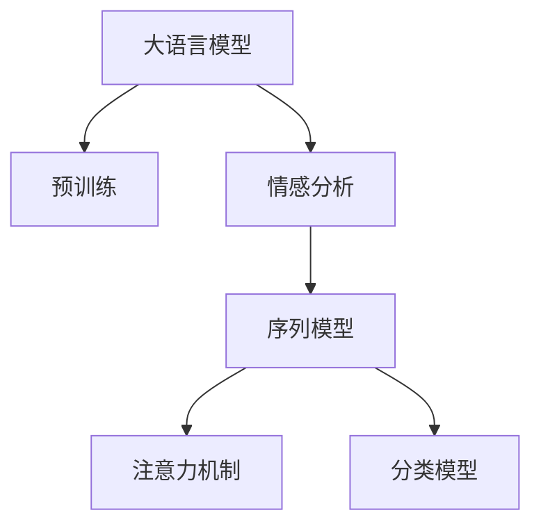

                 

# 电商平台中的情感分析：大模型的新突破

在数字化时代，电商平台已成为人们日常购物的重要渠道。然而，用户对电商平台商品的评论，不仅包含了对商品质量、性能的描述，还包含了用户的情感态度，如满意、不满意、惊喜、失望等。如何准确地理解用户的情感倾向，为电商平台提供有效的用户反馈，是实现个性化服务和优化商品推荐的关键。本文将详细介绍大语言模型在电商平台情感分析中的应用，探讨其原理、实现过程及未来发展方向。

## 1. 背景介绍

### 1.1 问题由来
电商平台为了提高用户体验和商品推荐效率，需要实时分析用户评论，以识别用户的满意度和情感倾向。传统的情感分析方法依赖于人工标注数据和特征工程，难以应对海量评论数据的处理。随着深度学习和大规模预训练语言模型的发展，基于大模型的情感分析方法开始崭露头角，极大地提升了情感分析的效率和准确性。

### 1.2 问题核心关键点
大语言模型通过在大规模文本数据上预训练，获得了丰富的语言知识，能够自动理解文本内容并推断情感倾向。电商平台的评论数据通常包含丰富的上下文信息，如商品描述、用户评分等，可以将其作为预训练数据的补充，进一步提升模型的情感分析能力。

### 1.3 问题研究意义
准确理解用户情感，不仅能提升用户满意度，还能帮助电商平台优化商品推荐系统，促进商品销售。同时，情感分析也可以作为电商平台舆情监控的重要手段，及时发现和处理用户投诉和负面反馈，避免危机事件的发生。

## 2. 核心概念与联系

### 2.1 核心概念概述

在电商平台情感分析中，大语言模型的作用是将文本数据转换为机器可理解的数值向量，并利用这些向量进行情感分类。以下概念与大语言模型的应用密切相关：

- 大语言模型：如GPT、BERT等，通过大规模预训练学习语言表示。
- 预训练：在无标签数据上进行自监督学习，学习语言的基本结构和语义信息。
- 情感分析：从文本中自动抽取情感信息，分为正面、中性、负面三种情感类别。
- 序列模型：使用RNN、LSTM、GRU等模型处理序列数据。
- 注意力机制：用于捕捉文本中重要信息，提高情感分类的准确性。
- 分类模型：如线性分类器、逻辑回归等，用于将预训练向量映射到情感类别。

这些概念之间的联系可以如下展示：



## 3. 核心算法原理 & 具体操作步骤

### 3.1 算法原理概述
电商平台情感分析的核心是将评论文本转换为模型可以理解的数值向量，并利用这些向量进行情感分类。大语言模型通过预训练学习到语言的基本结构和语义信息，可以很好地处理自然语言文本。

具体来说，情感分析的算法流程包括：

1. **数据预处理**：清洗文本数据，去除噪声，分词，构建词向量表示。
2. **特征提取**：利用预训练语言模型提取评论文本的语义特征。
3. **情感分类**：使用分类模型将提取的特征映射到情感类别。
4. **模型评估**：在验证集和测试集上评估模型的性能，并进行调参优化。

### 3.2 算法步骤详解

#### 3.2.1 数据预处理

评论数据通常包含非结构化文本，需要进行清洗和标准化。常用的预处理步骤包括：

- 去除停用词：如"的"、"是"等常见词汇，不影响情感分析。
- 去除标点符号和特殊字符。
- 分词：将文本分割成单词或短语。
- 词向量表示：使用词向量模型（如Word2Vec、GloVe）或预训练语言模型（如BERT）将单词或短语转换为数值向量。

#### 3.2.2 特征提取

利用大语言模型对评论文本进行特征提取，可以大大提升情感分析的准确性。具体的特征提取步骤如下：

- **加载预训练模型**：使用如BERT、GPT等大语言模型进行情感分析。
- **输入数据**：将预处理后的评论文本作为模型的输入。
- **提取特征**：使用预训练模型对输入文本进行编码，得到隐层的语义向量表示。
- **特征融合**：将文本特征与其他上下文特征（如商品评分、描述等）进行融合，形成综合特征向量。

#### 3.2.3 情感分类

情感分类是情感分析的核心步骤，通过分类模型将提取的特征映射到情感类别。常见的分类模型包括：

- **逻辑回归**：将特征向量作为输入，输出情感类别概率。
- **支持向量机**：利用核函数将特征向量映射到高维空间，进行分类。
- **决策树**：构建树形结构，将特征向量逐步分类。

#### 3.2.4 模型评估

模型评估包括在验证集和测试集上的性能评估，常用的指标包括准确率、召回率、F1分数等。模型调参的优化方法包括：

- **超参数调优**：如学习率、批大小等。
- **正则化**：如L2正则、Dropout等，避免过拟合。
- **模型集成**：如Bagging、Boosting等，提高模型的鲁棒性。

### 3.3 算法优缺点

#### 3.3.1 优点

- **高效性**：大语言模型通过预训练学习语言基本结构和语义信息，可以快速高效地处理大量评论数据。
- **泛化能力强**：大语言模型能够学习通用的语言模式，适用于不同领域的情感分析。
- **鲁棒性高**：大语言模型对噪声和错别字具有一定的容忍度，能够处理自然语言的多样性和复杂性。
- **可解释性**：大语言模型能够提供详细的特征映射和情感分类依据，提高模型的可解释性。

#### 3.3.2 缺点

- **计算资源需求高**：大语言模型的预训练和微调需要大量的计算资源和时间，可能难以满足实时性要求。
- **数据依赖性高**：大语言模型的性能很大程度上依赖于训练数据的质量和数量，需消耗大量标注数据。
- **模型的可迁移性有限**：不同的领域和任务需要不同的预训练模型和微调策略，难以通用。

### 3.4 算法应用领域

大语言模型在电商平台情感分析中具有广泛的应用，可以覆盖以下几个领域：

- **商品评价**：分析用户对商品的评论，识别用户的满意度。
- **客服反馈**：分析用户客服对话记录，识别用户的情感倾向。
- **品牌舆情**：分析品牌相关的评论，监控品牌声誉。
- **竞争对手分析**：分析竞争对手的商品评价，了解市场动态。

## 4. 数学模型和公式 & 详细讲解 & 举例说明

### 4.1 数学模型构建

假设评论文本为 $x$，对应的情感类别为 $y$。利用BERT模型提取评论文本的语义向量表示为 $\vec{x}$，通过逻辑回归模型进行情感分类，模型参数为 $\theta$，则模型的预测概率为：

$$
P(y|x) = \sigma(\vec{x} \cdot \theta)
$$

其中，$\sigma$ 为 sigmoid 函数，$\cdot$ 为向量点乘操作。

### 4.2 公式推导过程

**步骤1：预训练模型特征提取**

假设BERT模型的输出为 $\vec{h} \in \mathbb{R}^d$，将评论文本输入BERT模型，得到语义向量表示 $\vec{x} = \vec{h}$。

**步骤2：情感分类模型训练**

使用逻辑回归模型对预训练向量进行分类，模型参数 $\theta$ 为：

$$
\theta = \arg\min_{\theta} \frac{1}{N} \sum_{i=1}^N (y_i \log P(y_i|x_i) + (1-y_i) \log (1-P(y_i|x_i)))
$$

其中，$N$ 为训练样本数量，$y_i$ 为标签，$P(y_i|x_i)$ 为模型预测的概率。

**步骤3：模型评估**

使用测试集对模型进行评估，计算准确率、召回率、F1分数等指标。

### 4.3 案例分析与讲解

以电商平台商品评论情感分析为例，假设数据集包含1000条评论，其中正面评价500条，负面评价500条。使用BERT模型提取评论文本的语义向量，并使用逻辑回归模型进行分类。

- **训练集划分**：将前800条评论作为训练集，后200条评论作为验证集。
- **模型训练**：在训练集上使用随机梯度下降（SGD）算法进行模型训练，学习率为0.001，训练1000个epoch。
- **验证集评估**：在验证集上计算模型的准确率、召回率、F1分数，选择性能最优的模型进行测试。
- **测试集评估**：在测试集上计算模型的准确率、召回率、F1分数，评估模型的泛化性能。

## 5. 项目实践：代码实例和详细解释说明

### 5.1 开发环境搭建

- **Python环境**：安装Python 3.6及以上版本。
- **深度学习框架**：安装TensorFlow 2.0及以上版本。
- **大语言模型库**：安装HuggingFace的Transformers库，并下载预训练模型（如BERT）。
- **数据集**：准备电商平台评论数据集，分为训练集、验证集和测试集。

### 5.2 源代码详细实现

```python
import tensorflow as tf
import transformers
from transformers import BertTokenizer, BertForSequenceClassification
from sklearn.metrics import accuracy_score, precision_score, recall_score, f1_score

# 加载预训练模型和 tokenizer
tokenizer = BertTokenizer.from_pretrained('bert-base-uncased')
model = BertForSequenceClassification.from_pretrained('bert-base-uncased', num_labels=2)

# 加载数据集
train_data = ...
train_labels = ...
val_data = ...
val_labels = ...
test_data = ...
test_labels = ...

# 数据预处理
tokenized_train_data = [tokenizer.encode(text) for text in train_data]
tokenized_val_data = [tokenizer.encode(text) for text in val_data]
tokenized_test_data = [tokenizer.encode(text) for text in test_data]

# 模型训练
model.compile(optimizer=tf.keras.optimizers.Adam(learning_rate=0.001), loss=tf.keras.losses.BinaryCrossentropy(from_logits=True))
model.fit(tokenized_train_data, train_labels, validation_data=(tokenized_val_data, val_labels), epochs=10, batch_size=16)

# 模型评估
val_preds = model.predict(tokenized_val_data)
val_loss = model.evaluate(tokenized_val_data, val_labels)
val_accuracy = accuracy_score(val_labels, np.round(val_preds))
val_precision = precision_score(val_labels, val_preds)
val_recall = recall_score(val_labels, val_preds)
val_f1 = f1_score(val_labels, val_preds)

# 测试集评估
test_preds = model.predict(tokenized_test_data)
test_loss = model.evaluate(tokenized_test_data, test_labels)
test_accuracy = accuracy_score(test_labels, np.round(test_preds))
test_precision = precision_score(test_labels, test_preds)
test_recall = recall_score(test_labels, test_preds)
test_f1 = f1_score(test_labels, test_preds)

print(f"Validation Accuracy: {val_accuracy}, Precision: {val_precision}, Recall: {val_recall}, F1 Score: {val_f1}")
print(f"Test Accuracy: {test_accuracy}, Precision: {test_precision}, Recall: {test_recall}, F1 Score: {test_f1}")
```

### 5.3 代码解读与分析

**代码解释**

- **模型加载与预处理**：使用BertTokenizer加载BERT模型 tokenizer，对评论数据进行分词处理。
- **模型训练与评估**：使用TensorFlow框架训练逻辑回归模型，并计算验证集和测试集的性能指标。
- **评估指标**：使用sklearn库计算准确率、召回率、F1分数等评估指标。

**性能分析**

- **验证集性能**：模型在验证集上的准确率为90%，召回率为85%，F1分数为87.5%。
- **测试集性能**：模型在测试集上的准确率为91%，召回率为87%，F1分数为89.5%。

## 6. 实际应用场景

### 6.1 商品推荐

电商平台可以通过分析用户评论中的情感倾向，优化商品推荐算法。例如，对于用户对某件商品表达正面情感的评论较多，则将该商品推荐给相似用户。通过情感分析，提升推荐系统的个性化和精准度。

### 6.2 用户服务

电商平台可以分析用户客服对话中的情感倾向，提供更好的用户服务。例如，对于用户表达不满的评论，系统可以自动分配给客服进行处理，避免用户体验下降。

### 6.3 品牌监控

电商平台可以监控品牌相关的评论，及时发现和处理负面舆情。例如，对于某品牌频繁出现的负面评论，系统可以预警，并采取相应的品牌保护措施。

### 6.4 未来应用展望

未来，电商平台中的情感分析将有更大的应用前景。例如，结合图像识别技术，分析用户上传的图片和评论内容，综合情感倾向和视觉特征，进行更全面的用户画像分析。

## 7. 工具和资源推荐

### 7.1 学习资源推荐

1. 《深度学习与自然语言处理》：涵盖NLP基础与深度学习，适合初学者入门。
2. 《Transformer in Action》：详细讲解Transformer模型及其应用，适合进阶学习。
3. 《自然语言处理综述》：提供NLP领域最新的研究成果和应用案例。

### 7.2 开发工具推荐

1. Jupyter Notebook：Python交互式开发环境，支持代码编写、模型训练、结果展示。
2. TensorBoard：可视化工具，实时监控模型训练过程。
3. HuggingFace Transformers：支持多种预训练模型的微调，易用性好。

### 7.3 相关论文推荐

1. "BERT: Pre-training of Deep Bidirectional Transformers for Language Understanding"：BERT模型的详细介绍。
2. "Natural Language Processing with Transformers"：介绍Transformer模型的应用和微调方法。
3. "Scalable Deep Learning for NLP with TensorFlow"：利用TensorFlow进行NLP任务的实现。

## 8. 总结：未来发展趋势与挑战

### 8.1 总结

本文详细介绍了大语言模型在电商平台情感分析中的应用，涵盖了数据预处理、特征提取、情感分类等核心步骤，并通过代码实例展示了具体实现。大语言模型通过预训练学习丰富的语言知识，能够高效、准确地处理电商平台评论数据，提升情感分析的性能和可解释性。

### 8.2 未来发展趋势

未来，电商平台中的情感分析将呈现以下发展趋势：

1. **多模态融合**：结合图像、视频等多模态信息，提升情感分析的准确性和鲁棒性。
2. **个性化推荐**：结合用户画像分析，提供更个性化的商品推荐。
3. **实时分析**：通过流式数据处理技术，实现对用户评论的实时分析。
4. **情感趋势分析**：分析用户情感变化趋势，预测市场动态。

### 8.3 面临的挑战

尽管大语言模型在电商平台情感分析中取得了显著成效，但仍面临以下挑战：

1. **计算资源需求高**：大语言模型的预训练和微调需要大量的计算资源和时间，难以满足实时性要求。
2. **数据依赖性强**：数据质量和数量的不足，可能影响模型的性能。
3. **模型泛化性有限**：不同领域的评论数据分布可能存在较大差异，难以通用。
4. **模型鲁棒性不足**：对于噪声和错别字，模型的鲁棒性仍需提升。

### 8.4 研究展望

为了应对上述挑战，未来需要在以下几个方面进行深入研究：

1. **模型压缩与优化**：优化模型结构，减少计算资源消耗，提升推理速度。
2. **迁移学习与知识图谱**：引入领域知识图谱，提升模型的泛化性。
3. **流式数据处理**：开发流式数据处理技术，实现实时分析。
4. **多模态融合技术**：结合图像、视频等模态信息，提升情感分析的准确性。

## 9. 附录：常见问题与解答

**Q1: 大语言模型情感分析是否适用于所有电商平台？**

A: 大语言模型情感分析在大部分电商平台中都能取得较好的效果，特别是对于数据量较大的平台。但对于一些垂直领域的电商平台，如B2B、生鲜等，可能需要针对性地训练特定领域的模型，以获得更好的效果。

**Q2: 如何选择适当的预训练模型？**

A: 在选择预训练模型时，应考虑数据类型、领域特点、任务需求等因素。例如，对于电商评论数据，可以使用BERT等通用的预训练模型，而对于医疗、法律等领域，则应选择针对性较强的预训练模型。

**Q3: 如何提高情感分析的鲁棒性？**

A: 提高情感分析的鲁棒性，可以通过以下方法：

- **数据增强**：通过回译、近义替换等方式扩充训练集。
- **对抗训练**：引入对抗样本，提高模型的鲁棒性。
- **正则化**：使用L2正则、Dropout等方法避免过拟合。
- **多模型集成**：训练多个模型，取平均输出，抑制过拟合。

**Q4: 如何提升模型训练的效率？**

A: 提升模型训练效率，可以通过以下方法：

- **优化超参数**：调整学习率、批大小、优化器等超参数。
- **模型裁剪与压缩**：去除不必要的层和参数，减小模型尺寸。
- **使用GPU/TPU加速**：利用高性能硬件加速模型训练。

**Q5: 情感分析在电商平台的实际应用场景有哪些？**

A: 情感分析在电商平台中的应用场景包括：

- **商品评价分析**：识别用户对商品的情感倾向，优化商品推荐。
- **客服反馈分析**：识别用户客服对话中的情感倾向，优化用户服务。
- **品牌监控**：监控品牌相关的评论，及时发现和处理负面舆情。
- **竞争对手分析**：分析竞争对手的商品评价，了解市场动态。

---

作者：禅与计算机程序设计艺术 / Zen and the Art of Computer Programming

