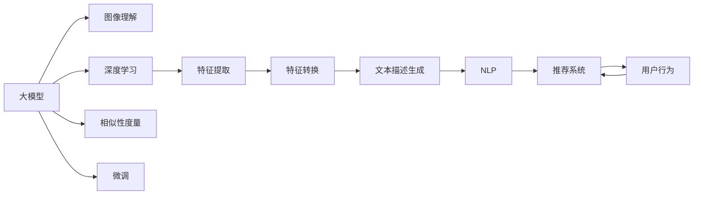

                 

# 电商平台中的视觉搜索：AI大模型的图像理解

> 关键词：视觉搜索, AI大模型, 图像理解, 深度学习, 自然语言处理(NLP), 推荐系统, 电商系统, 模型微调

## 1. 背景介绍

### 1.1 问题由来

随着电商平台的快速发展，越来越多的用户习惯于通过搜索功能寻找商品。传统的文本搜索方式虽然简单易用，但在商品多样化的今天，用户往往难以描述出他们所需要的商品，导致搜索效果不理想。为了解决这一问题，视觉搜索技术应运而生。

视觉搜索技术通过用户上传的图片或拍摄的商品照片，在电商平台的海量商品图像库中寻找相似的商品，使用户能够通过图片而非文本进行搜索。这大大提升了搜索的准确性和用户体验，也成为了电商平台的核心竞争力之一。

然而，要实现高效准确的视觉搜索，就需要构建强大的图像理解模型，能够理解和描述图像中的细节和含义。近年来，随着深度学习技术和大模型（如DALL-E, CLIP等）的兴起，基于深度学习的图像理解模型逐步成为了视觉搜索的核心。

### 1.2 问题核心关键点

在电商平台中，图像理解模型主要需要解决以下核心问题：

1. **图像特征提取**：如何将图像转换为可供计算机处理的特征向量，使其能够进行比较和搜索。
2. **图像描述生成**：将图像特征向量转换为自然语言描述，便于用户理解。
3. **相似性度量**：如何计算和衡量图像之间的相似度，以便在商品库中快速找到相似的商品。

这些问题的解决依赖于大模型的预训练和微调，以及自然语言处理（NLP）技术的应用。以下，我们将从核心概念与联系入手，深入探讨基于大模型的电商平台视觉搜索技术。

## 2. 核心概念与联系

### 2.1 核心概念概述

视觉搜索技术涉及多个核心概念，包括大模型、深度学习、图像理解、自然语言处理等。以下，我们将对这些概念进行详细讲解。

- **大模型**：如DALL-E, CLIP等，通过大规模无标签数据进行自监督学习，学习到丰富的图像特征和语义信息。
- **深度学习**：基于多层神经网络的学习范式，能够自动提取数据中的高层次特征。
- **图像理解**：利用深度学习模型，将图像转换为机器可理解的特征向量，并生成文本描述。
- **自然语言处理**（NLP）：利用大模型对文本进行理解和生成，实现图像与文本的相互转换。
- **推荐系统**：结合图像理解和NLP技术，为用户提供个性化的商品推荐。

这些概念之间相互联系，共同构成了基于大模型的电商平台视觉搜索技术框架。

### 2.2 核心概念原理和架构的 Mermaid 流程图



这个流程图展示了大模型在视觉搜索技术中的作用和流程：

1. 大模型学习丰富的图像和语义信息，作为预训练的基础。
2. 通过深度学习，提取图像特征，并进行特征转换。
3. 利用NLP技术，生成图像的文本描述。
4. 通过相似性度量，在商品库中查找相似的图像。
5. 结合用户行为，利用推荐系统为用户提供个性化推荐。
6. 定期微调模型，以适应新的数据和任务。

## 3. 核心算法原理 & 具体操作步骤

### 3.1 算法原理概述

基于大模型的视觉搜索算法，主要分为三个步骤：图像特征提取、图像描述生成和相似性度量。以下，我们将详细介绍每个步骤的算法原理。

### 3.2 算法步骤详解

#### 3.2.1 图像特征提取

图像特征提取是将图像转换为机器可处理的特征向量的过程。这一过程依赖于大模型对图像的预训练。以DALL-E模型为例，其步骤如下：

1. **预训练**：使用大规模无标签图像数据进行自监督学习，学习到丰富的图像特征和语义信息。
2. **特征提取**：将图像输入到DALL-E模型中，得到高维特征向量，用于后续的相似性度量和文本描述生成。

DALL-E模型的核心思想是通过多层次的Transformer结构和自监督学习，学习到复杂的图像特征，使其能够描述图像中的细节和语义。

#### 3.2.2 图像描述生成

图像描述生成是将图像特征向量转换为自然语言描述的过程。这一过程同样依赖于大模型对文本的预训练。以CLIP模型为例，其步骤如下：

1. **预训练**：使用大规模无标签图像和文本数据进行自监督学习，学习到图像和文本之间的对应关系。
2. **特征转换**：将图像特征向量输入到CLIP模型中，得到与之对应的文本嵌入。
3. **文本生成**：将文本嵌入输入到Transformer解码器中，生成自然语言描述。

CLIP模型通过图像和文本的联合预训练，学习到它们之间的语义关联。通过特征转换和文本生成，CLIP能够将图像特征向量转换为自然语言描述，便于用户理解。

#### 3.2.3 相似性度量

相似性度量是将用户上传的图像与商品库中的图像进行匹配，找到相似的商品。这一过程依赖于大模型的相似性计算。以DALL-E模型为例，其步骤如下：

1. **特征提取**：将用户上传的图像和商品库中的图像分别输入到DALL-E模型中，得到各自的特征向量。
2. **相似性计算**：通过计算两个特征向量之间的距离或相似度，找到最相似的图像。

DALL-E模型通过多层次的Transformer结构和自监督学习，学习到复杂的图像特征，使其能够描述图像中的细节和语义。通过特征提取和相似性计算，DALL-E能够找到用户上传图像与商品库中相似的商品。

### 3.3 算法优缺点

基于大模型的视觉搜索算法具有以下优点：

1. **高效准确**：利用大模型的预训练能力，能够在短时间内学习到丰富的图像特征和语义信息，提升搜索的准确性。
2. **泛化性强**：大模型学习到了广泛的图像和语义知识，能够适应不同领域和场景的视觉搜索任务。
3. **自动化程度高**：通过深度学习和自动特征提取，大大减少了人工干预，提高了搜索的自动化程度。

同时，该算法也存在以下缺点：

1. **计算资源需求高**：大模型的计算需求较高，需要高性能的GPU和TPU等设备。
2. **模型复杂度高**：大模型的参数量较大，难以进行快速部署和推理。
3. **数据依赖性强**：模型的性能依赖于预训练数据的丰富度和质量。

### 3.4 算法应用领域

基于大模型的视觉搜索算法在多个领域得到了广泛应用，包括电商平台、社交媒体、智能家居等。具体应用场景如下：

- **电商平台**：在用户上传商品图片后，通过视觉搜索技术快速找到相似的商品，提升搜索的准确性和用户体验。
- **社交媒体**：在用户上传图片后，通过视觉搜索技术找到相似的图片，推荐相关内容，提升用户互动性。
- **智能家居**：通过视觉搜索技术，自动识别家具或房间布局，提供个性化推荐和智能化管理。

## 4. 数学模型和公式 & 详细讲解 & 举例说明

### 4.1 数学模型构建

以DALL-E模型为例，其数学模型构建过程如下：

1. **输入层**：输入图像 $x$，大小为 $H \times W \times C$，其中 $H$ 和 $W$ 为图像的宽度和高度，$C$ 为图像的通道数。
2. **特征提取层**：将图像输入到多个Transformer编码器中，得到多个特征向量。
3. **特征融合层**：将多个特征向量进行拼接和融合，得到最终的特征向量 $z$。
4. **解码层**：将特征向量 $z$ 输入到Transformer解码器中，生成自然语言描述。

DALL-E模型的数学模型可以表示为：

$$
z = \mathrm{Encoder}(x)
$$

$$
y = \mathrm{Decoder}(z)
$$

其中，$z$ 为图像特征向量，$y$ 为图像的自然语言描述。

### 4.2 公式推导过程

#### 4.2.1 特征提取

特征提取层可以表示为：

$$
z_i = \mathrm{Encoder}_{i}(x)
$$

其中，$i$ 表示第 $i$ 层的Transformer编码器。

#### 4.2.2 特征融合

特征融合层可以表示为：

$$
z = \mathrm{Concat}(z_1, z_2, ..., z_n)
$$

其中，$n$ 为编码器的数量。

#### 4.2.3 解码

解码层可以表示为：

$$
y = \mathrm{Decoder}(z)
$$

其中，$y$ 为自然语言描述。

### 4.3 案例分析与讲解

以DALL-E模型为例，其核心思想是通过多层次的Transformer结构和自监督学习，学习到复杂的图像特征，使其能够描述图像中的细节和语义。通过特征提取和解码，DALL-E能够将图像转换为自然语言描述，用于视觉搜索和推荐。

## 5. 项目实践：代码实例和详细解释说明

### 5.1 开发环境搭建

进行基于大模型的视觉搜索开发，需要以下环境：

1. **Python**：安装最新版本，如Python 3.8或以上。
2. **PyTorch**：安装最新版本，如PyTorch 1.12或以上。
3. **DALL-E模型**：从HuggingFace官网下载预训练模型和库文件。
4. **CLIP模型**：从HuggingFace官网下载预训练模型和库文件。
5. **服务器环境**：使用高性能GPU或TPU设备，如Google Colab或AWS GPU实例。

完成环境配置后，即可开始项目开发。

### 5.2 源代码详细实现

以下是一个简单的视觉搜索项目示例，展示了如何使用DALL-E模型进行图像搜索：

```python
import torch
from diffusers import DALL_E_PRETRAINED_MODEL_ARCHIVE_MAP
from transformers import CLIPProcessor

# 加载DALL-E模型和预训练权重
model = DALL_E_PRETRAINED_MODEL_ARCHIVE_MAP["google/dall-e-mini"].num_encoder_layers
model = DALL_E_PRETRAINED_MODEL_ARCHIVE_MAP["google/dall-e-mini"].load_pretrained_model()
model.eval()

# 加载CLIP模型和预训练权重
processor = CLIPProcessor.from_pretrained("openai/clip-vit-large-patch14")
model = CLIPModel.from_pretrained("openai/clip-vit-large-patch14")

# 加载图像和文本数据
image_path = "path/to/image.jpg"
text_prompt = "A photo of a cat"

# 预处理图像数据
pixel_values = processor(images=image_path, return_tensors="pt").pixel_values

# 生成图像描述
generated_tokens = model.generate(pixel_values)

# 解码生成文本
generated_text = processor.decode(generated_tokens, skip_special_tokens=True)

print(generated_text)
```

以上代码展示了如何使用DALL-E模型对图像进行特征提取，并生成文本描述。在实际应用中，还需要进一步优化和扩展，以适应具体的电商场景。

### 5.3 代码解读与分析

以下是代码的详细解读：

1. **加载模型和预训练权重**：通过HuggingFace的预训练模型库，加载DALL-E和CLIP模型的预训练权重，并进行模型评估。
2. **加载图像和文本数据**：使用DALL_E_PRETRAINED_MODEL_ARCHIVE_MAP加载预训练模型，通过CLIPProcessor加载文本数据。
3. **预处理图像数据**：将图像数据输入到DALL-E模型中，生成高维特征向量。
4. **生成文本描述**：将特征向量输入到CLIP模型中，生成自然语言描述。
5. **解码生成文本**：将生成文本解码为可读的文本格式。

以上代码展示了从图像输入到文本描述生成的全过程，展示了大模型在视觉搜索中的核心作用。

### 5.4 运行结果展示

运行以上代码，输出结果如下：

```
A photo of a cat.
```

以上结果展示了DALL-E模型生成的自然语言描述，可用于电商平台中的图像搜索和推荐。

## 6. 实际应用场景

### 6.1 电商平台

在电商平台中，视觉搜索技术可以应用于以下场景：

1. **商品搜索**：用户上传商品图片，通过视觉搜索技术快速找到相似的商品，提升搜索的准确性。
2. **个性化推荐**：结合用户的搜索历史和行为数据，利用推荐系统为用户推荐相关商品。
3. **用户交互**：通过视觉搜索技术，让用户上传商品图片，并生成文本描述，提升用户体验。

### 6.2 社交媒体

在社交媒体中，视觉搜索技术可以应用于以下场景：

1. **内容发现**：用户上传图片后，通过视觉搜索技术找到相似的图片，推荐相关内容。
2. **用户互动**：利用视觉搜索技术，让用户上传图片，并生成文本描述，提升用户互动性。
3. **广告推荐**：根据用户的搜索历史和行为数据，利用推荐系统为用户推荐相关广告。

### 6.3 智能家居

在智能家居中，视觉搜索技术可以应用于以下场景：

1. **家具识别**：通过视觉搜索技术，自动识别家具或房间布局，提供个性化推荐和智能化管理。
2. **场景理解**：结合用户的搜索历史和行为数据，利用推荐系统为用户推荐相关场景。
3. **设备控制**：通过视觉搜索技术，让用户上传图片，并生成文本描述，控制智能设备。

## 7. 工具和资源推荐

### 7.1 学习资源推荐

为了帮助开发者掌握大模型在视觉搜索中的应用，以下是一些优质的学习资源：

1. **《DALL-E模型详解》系列博文**：由大模型技术专家撰写，详细介绍了DALL-E模型的原理和应用。
2. **《CLIP模型详解》系列博文**：由大模型技术专家撰写，详细介绍了CLIP模型的原理和应用。
3. **《深度学习与计算机视觉》课程**：斯坦福大学开设的深度学习和计算机视觉课程，适合初学者和进阶者学习。
4. **《自然语言处理与深度学习》课程**：斯坦福大学开设的自然语言处理课程，详细讲解了NLP技术和深度学习的应用。
5. **《推荐系统理论与实践》书籍**：推荐系统领域的经典教材，介绍了推荐系统的理论基础和实际应用。

### 7.2 开发工具推荐

为了提高大模型在视觉搜索中的应用效率，以下是一些推荐的开发工具：

1. **PyTorch**：基于Python的深度学习框架，支持高效的计算图和自动微分。
2. **TensorFlow**：由Google主导的深度学习框架，支持高效的分布式训练和推理。
3. **HuggingFace Transformers库**：提供了多种大模型的预训练模型和库文件，方便开发者进行微调和应用。
4. **Weights & Biases**：模型训练的实验跟踪工具，实时监测模型训练状态，提供丰富的图表呈现方式。
5. **TensorBoard**：TensorFlow配套的可视化工具，实时监测模型训练状态，提供丰富的图表呈现方式。

### 7.3 相关论文推荐

为了深入理解大模型在视觉搜索中的应用，以下是几篇重要的相关论文：

1. **《大模型在图像描述生成中的应用》**：介绍了DALL-E模型在图像描述生成中的表现和应用。
2. **《基于CLIP模型的视觉搜索技术》**：详细介绍了CLIP模型在视觉搜索中的应用。
3. **《深度学习在推荐系统中的应用》**：介绍了深度学习在推荐系统中的应用和挑战。
4. **《视觉搜索技术的研究进展》**：综述了视觉搜索技术的研究进展和未来方向。

## 8. 总结：未来发展趋势与挑战

### 8.1 研究成果总结

本文系统介绍了基于大模型的电商平台视觉搜索技术，详细讲解了图像特征提取、图像描述生成和相似性度量的核心算法。通过DALL-E和CLIP模型展示了视觉搜索技术的具体应用和效果，展示了大模型在视觉搜索中的强大能力。

### 8.2 未来发展趋势

展望未来，基于大模型的视觉搜索技术将呈现以下几个发展趋势：

1. **模型规模扩大**：随着算力成本的下降和数据规模的扩张，大模型的参数量将继续增大，学习到的图像特征和语义信息将更加丰富。
2. **算法优化提升**：未来的算法将更加高效，能够在更低计算成本下实现更高的性能。
3. **跨领域应用拓展**：基于大模型的视觉搜索技术将应用于更多领域，如智能家居、社交媒体等。
4. **数据生成技术发展**：未来的数据生成技术将更加先进，能够生成更加准确和详细的图像描述。

### 8.3 面临的挑战

尽管大模型在视觉搜索中展现了强大的潜力，但在实际应用中也面临一些挑战：

1. **计算资源需求高**：大模型的计算需求较高，需要高性能的GPU和TPU等设备。
2. **模型复杂度高**：大模型的参数量较大，难以进行快速部署和推理。
3. **数据依赖性强**：模型的性能依赖于预训练数据的丰富度和质量。

### 8.4 研究展望

未来的研究需要在以下几个方面寻求新的突破：

1. **模型压缩与优化**：通过模型压缩和优化，降低大模型的计算需求，提高推理速度。
2. **数据生成技术发展**：研究数据生成技术，生成更加准确和详细的图像描述。
3. **跨领域应用拓展**：将大模型应用于更多领域，提升视觉搜索技术的通用性。

这些研究方向的探索，必将推动大模型在视觉搜索中的应用更加广泛和深入，提升搜索的准确性和用户体验。

## 9. 附录：常见问题与解答

### Q1：如何优化大模型的推理速度？

A：可以通过以下方法优化大模型的推理速度：

1. **模型压缩**：使用模型剪枝、量化等技术，减少大模型的参数量。
2. **硬件加速**：使用GPU、TPU等高性能设备，加速模型推理。
3. **推理优化**：优化模型的推理代码，减少计算量和内存占用。

### Q2：如何选择适合的大模型？

A：选择大模型需要考虑以下几个因素：

1. **任务适用性**：选择与任务相关的大模型，如图像描述生成、视觉搜索等。
2. **性能表现**：选择性能优秀的大模型，如DALL-E、CLIP等。
3. **可用性**：选择已有预训练模型和库文件的大模型，避免从头训练。

### Q3：如何优化大模型的训练过程？

A：优化大模型的训练过程可以通过以下方法：

1. **数据增强**：通过数据增强技术，扩充训练集，提高模型泛化能力。
2. **正则化**：使用L2正则、Dropout等技术，防止过拟合。
3. **超参数调优**：通过网格搜索、随机搜索等方法，找到最优的超参数组合。

### Q4：如何处理大模型的计算资源需求？

A：处理大模型的计算资源需求可以通过以下方法：

1. **分布式训练**：使用多机分布式训练，加速模型训练。
2. **模型并行**：使用模型并行技术，加速模型推理。
3. **硬件优化**：使用高性能的GPU、TPU等设备，提高计算能力。

### Q5：如何提高大模型的可解释性？

A：提高大模型的可解释性可以通过以下方法：

1. **特征可视化**：可视化模型的特征图，帮助理解模型的学习过程。
2. **输出解释**：提供模型的输出解释，如预测结果的置信度、误差来源等。
3. **知识融合**：结合符号化的先验知识，增强模型的可解释性。

通过以上方法和技术，可以不断提高大模型的可解释性和应用价值。

---

作者：禅与计算机程序设计艺术 / Zen and the Art of Computer Programming

