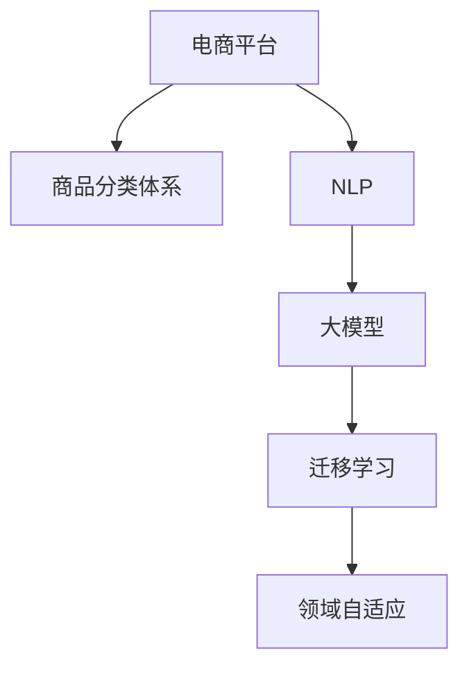

                 

# 电商平台商品分类体系：AI大模型的自动构建

> 关键词：电商平台,商品分类体系,自动构建,人工智能,自然语言处理,NLP,大模型,深度学习

## 1. 背景介绍

### 1.1 问题由来

在现代电子商务时代，商品分类体系是电商平台管理商品、推荐商品、搜索商品的基础。一个结构清晰、分类合理、维护便捷的商品分类体系，能够显著提升用户体验和平台运营效率。

然而，在实际电商平台上，商品分类体系构建和维护仍面临诸多挑战：
1. **商品种类繁多**：电商平台商品种类繁多，涉及从服饰、食品、家居到数码产品等多个品类，分类难度极大。
2. **数据质量参差不齐**：商品信息可能存在标题不一致、描述模糊、图片不规范等问题，影响分类的准确性。
3. **动态更新频繁**：随着新商品不断上架，现有分类体系需要频繁更新和维护，成本较高。
4. **专家知识依赖**：商品分类依赖人工标注，需要大量专业知识和经验，难以自动化。

为解决上述问题，电商企业纷纷探索利用人工智能技术自动构建和维护商品分类体系。其中，大模型在自然语言处理(NLP)领域的最新进展，为商品分类体系的自动构建提供了新的思路和工具。

### 1.2 问题核心关键点

实现电商平台商品分类体系的自动构建，主要需要解决以下核心问题：
1. **商品信息抽取**：从商品标题、描述、图片等文本或图像信息中，自动抽取商品属性和类别标签。
2. **分类体系构建**：基于抽取的商品属性和类别标签，构建和维护一个层次清晰、结构合理的商品分类体系。
3. **分类体系评估**：对自动构建的分类体系进行评估和优化，确保其符合用户需求和业务规则。
4. **动态更新机制**：构建一个动态更新机制，实时更新和维护商品分类体系，适应电商平台不断变化的商品结构。

本文将围绕上述核心问题，详细介绍如何利用大模型和NLP技术，实现电商平台的商品分类体系的自动构建。

## 2. 核心概念与联系

### 2.1 核心概念概述

为更好地理解商品分类体系的自动构建方法，本节将介绍几个关键概念及其之间的联系：

- **电商平台**：在线销售商品的平台，如淘宝、京东、亚马逊等。
- **商品分类体系**：电商平台对商品进行分类的框架体系，包括根节点、子节点、节点层次等。
- **自然语言处理(NLP)**：涉及计算机处理和理解自然语言的技术，包括文本预处理、特征抽取、模型训练等。
- **大模型**：如BERT、GPT、XLNet等大规模预训练语言模型，通过自监督学习任务训练，具备强大的语言理解和生成能力。
- **迁移学习**：将一个领域学习到的知识，迁移应用到另一个不同但相关的领域的学习方法。
- **领域自适应**：针对特定领域的数据和任务，调整预训练模型的参数，使其适应新任务。

这些概念之间的联系可以通过以下Mermaid流程图来展示：



这个流程图展示了电商平台、商品分类体系、NLP、大模型以及迁移学习和领域自适应之间的内在联系：

1. 电商平台依赖于商品分类体系进行商品管理和运营。
2. NLP技术用于处理和理解商品信息，抽取商品属性和类别标签。
3. 大模型在NLP任务的预训练中学习到丰富的语言知识，通过迁移学习适应商品分类任务。
4. 领域自适应技术进一步调整大模型参数，使其更好地适应电商平台的特定需求。

## 3. 核心算法原理 & 具体操作步骤
### 3.1 算法原理概述

商品分类体系的自动构建，本质上是一个领域自适应的迁移学习过程。其核心思想是：将大模型在通用领域的知识迁移到特定领域（电商平台商品分类），通过有限的标注数据和自适应微调，构建出符合电商业务需求的商品分类体系。

具体而言，我们可以将自动构建商品分类体系的过程分为以下三个步骤：

1. **商品信息抽取**：利用NLP技术，从商品标题、描述、图片等信息中，自动抽取商品属性和类别标签。
2. **分类体系构建**：基于抽取的商品属性和类别标签，构建一个层次清晰、结构合理的商品分类体系。
3. **体系评估与优化**：对自动构建的分类体系进行评估和优化，确保其符合用户需求和业务规则。

### 3.2 算法步骤详解

**Step 1: 数据预处理**

在商品分类体系的自动构建过程中，首先需要对商品信息进行预处理，将其转换为模型可以处理的格式。具体步骤如下：

1. **数据收集**：收集电商平台的商品数据，包括商品标题、描述、图片等。
2. **数据清洗**：去除重复、无关、低质量的商品信息，确保数据的一致性和完整性。
3. **文本归一化**：对商品标题、描述进行分词、去停用词、词形还原等预处理，统一格式。

**Step 2: 商品信息抽取**

商品信息抽取是商品分类体系自动构建的第一步。其目标是从商品信息中提取出有用的属性和类别标签，用于构建分类体系。具体步骤如下：

1. **特征工程**：设计特征提取模型，从商品标题、描述等文本信息中，提取出与分类相关的特征。
2. **模型选择与训练**：选择合适的NLP模型（如BERT、GPT等），在标注数据上训练特征提取模型。
3. **特征融合**：将不同特征源（如商品标题、描述、图片等）的特征融合，生成最终的特征向量。

**Step 3: 分类体系构建**

基于抽取的商品属性和类别标签，构建一个层次清晰、结构合理的商品分类体系。具体步骤如下：

1. **分类算法选择**：选择合适的分类算法（如层次聚类、k-means等），构建初始分类体系。
2. **层次化构建**：根据商品属性和类别标签的相似度，逐层构建分类体系，形成根节点、子节点、叶子节点等层次结构。
3. **优化与调整**：根据用户反馈和业务规则，对分类体系进行优化和调整，确保其符合实际需求。

**Step 4: 体系评估与优化**

构建的商品分类体系需要经过评估和优化，以确保其准确性和实用性。具体步骤如下：

1. **评估指标选择**：选择适合电商平台的评估指标，如分类准确率、召回率、F1分数等。
2. **数据集划分**：将数据集划分为训练集、验证集和测试集，用于模型训练、评估和测试。
3. **模型微调**：在训练集上训练分类模型，并在验证集上评估和微调，确保模型泛化性能。
4. **体系调整**：根据测试结果，对分类体系进行微调，优化分类标签和层次结构。

### 3.3 算法优缺点

自动构建商品分类体系的方法具有以下优点：

1. **高效低成本**：利用大模型和NLP技术，可以自动处理海量商品信息，显著降低人工标注成本和时间投入。
2. **精度高**：大模型具备强大的语言理解和生成能力，通过迁移学习能够构建高精度的商品分类体系。
3. **动态更新**：商品分类体系可以动态更新，及时反映商品结构的变动，保持数据的实时性和准确性。
4. **自适应性强**：通过领域自适应技术，大模型可以适应电商平台的特定需求，构建符合业务规则的分类体系。

同时，该方法也存在一定的局限性：

1. **数据质量依赖**：自动构建分类体系的效果依赖于原始商品信息的质量，数据质量差可能导致分类错误。
2. **模型泛化能力**：大模型的泛化能力可能受限于特定领域的标注数据量，标注数据不足可能导致模型过拟合。
3. **计算资源需求**：构建高质量的商品分类体系需要大量的计算资源，大模型的训练和推理消耗较高。
4. **体系调整复杂**：分类体系的优化调整需要专业知识和技术支持，具有一定的复杂性。

尽管存在这些局限性，但总体而言，自动构建商品分类体系的方法在提升电商平台的商品管理效率和用户体验方面具有显著优势。

### 3.4 算法应用领域

基于大模型和NLP技术，自动构建商品分类体系的方法可以广泛应用于多个电商领域，如：

1. **在线零售**：对商品进行自动分类，提高搜索和推荐效率。
2. **跨境电商**：处理多语言商品信息，构建全球化的分类体系。
3. **直播电商**：实时更新商品分类，辅助主播进行商品推荐。
4. **二手交易**：自动分类二手商品，提升平台交易活跃度。
5. **社区电商**：构建社区商品的分类体系，促进社区成员互动。

## 4. 数学模型和公式 & 详细讲解  
### 4.1 数学模型构建

假设我们收集到了电商平台的一批商品数据 $D=\{(x_i, y_i)\}_{i=1}^N$，其中 $x_i$ 表示商品信息，$y_i$ 表示对应的类别标签。

为了从商品信息中提取属性和类别标签，我们可以构建一个特征提取模型 $f_{\theta}$，通过训练使得其最小化损失函数：

$$
\mathcal{L}(\theta) = \frac{1}{N}\sum_{i=1}^N \ell(f_{\theta}(x_i), y_i)
$$

其中 $\ell$ 为损失函数，如交叉熵损失、均方误差损失等。

在得到特征提取模型后，我们可以使用层次聚类、k-means等算法对商品进行分类，构建分类体系。假设构建的分类体系包含 $K$ 个类别，每个类别的分布为 $p_k$，则分类体系的最优参数 $\theta^*$ 可以通过最大化似然函数求解：

$$
\theta^* = \mathop{\arg\min}_{\theta} \mathcal{L}(\theta) = \mathop{\arg\min}_{\theta} \sum_{k=1}^K -\sum_{i=1}^N p_k \log f_{\theta}(x_i)
$$

其中 $f_{\theta}(x_i)$ 表示商品信息 $x_i$ 属于类别 $k$ 的概率。

### 4.2 公式推导过程

在商品分类体系构建过程中，我们使用了层次聚类算法。以下是对层次聚类算法中关键公式的推导。

假设我们构建的分类体系包含 $K$ 个类别，每个类别的分布为 $p_k$。层次聚类的目标是将商品分为 $K$ 个类别，使得总误差最小。具体而言，可以定义聚类误差为：

$$
\mathcal{E} = \sum_{k=1}^K p_k \sum_{i=1}^N \log f_{\theta}(x_i)
$$

其中 $f_{\theta}(x_i)$ 表示商品信息 $x_i$ 属于类别 $k$ 的概率。

为了最小化聚类误差，我们可以定义一个目标函数：

$$
\min_{C} \sum_{k=1}^K \log \prod_{i \in C_k} f_{\theta}(x_i)
$$

其中 $C_k$ 表示包含类别 $k$ 的商品集合。

利用层次聚类算法，我们可以通过逐步合并类别来最小化目标函数。设当前最相似的类别为 $i$ 和 $j$，其合并后的类别为 $k$，则合并规则可以表示为：

$$
\mathop{\min}_{\alpha \in [0,1]} \min_{k \in \{C_i, C_j\}} \left\{ \sum_{k \in C_i} \log f_{\theta}(x_k) + \alpha \sum_{k \in C_j} \log f_{\theta}(x_k) \right\}
$$

其中 $\alpha$ 表示类别 $i$ 和 $j$ 合并后类别 $k$ 中，属于类别 $i$ 的概率权重。

通过不断合并类别，最终得到分类体系的最优参数 $\theta^*$。

### 4.3 案例分析与讲解

以下以一个简单的商品分类案例来说明层次聚类算法的具体实现。

假设我们有一个电商平台，收集到了一些商品信息，如商品名称、描述和类别标签。

```
商品1: 服装, 颜色: 红色, 尺码: L, 价格: 100元
商品2: 电子产品, 品牌: Apple, 型号: iPhone X, 价格: 8000元
商品3: 化妆品, 品牌: L'Oreal, 产品名称: 口红, 价格: 50元
商品4: 食品, 品牌: 蒙牛, 产品名称: 牛奶, 价格: 10元
```

我们可以将商品信息 $x$ 表示为一个向量，其中包含品牌、类别、价格等特征。

利用层次聚类算法，我们可以逐步合并类别，构建出分类体系。以下是一个简单的聚类过程：

1. 初始化每个商品为一个类别。
2. 找出最相似的类别，合并为一个新的类别。例如，商品1和商品3都属于化妆品类别，可以合并为一个新的类别。
3. 继续合并，构建出更高级别的分类体系。例如，商品1、商品3、商品4都属于食品类别，可以合并为一个更高级别的食品类别。
4. 最终得到分类体系的最优参数 $\theta^*$，其中每个类别的分布 $p_k$ 可以通过训练得到。

## 5. 项目实践：代码实例和详细解释说明
### 5.1 开发环境搭建

在进行商品分类体系的自动构建实践前，我们需要准备好开发环境。以下是使用Python进行PyTorch开发的环境配置流程：

1. 安装Anaconda：从官网下载并安装Anaconda，用于创建独立的Python环境。

2. 创建并激活虚拟环境：
```bash
conda create -n pytorch-env python=3.8 
conda activate pytorch-env
```

3. 安装PyTorch：根据CUDA版本，从官网获取对应的安装命令。例如：
```bash
conda install pytorch torchvision torchaudio cudatoolkit=11.1 -c pytorch -c conda-forge
```

4. 安装各类工具包：
```bash
pip install numpy pandas scikit-learn matplotlib tqdm jupyter notebook ipython
```

完成上述步骤后，即可在`pytorch-env`环境中开始商品分类体系的自动构建实践。

### 5.2 源代码详细实现

以下是使用PyTorch和Transformers库进行商品分类体系自动构建的代码实现。

首先，定义数据处理函数：

```python
from transformers import BertTokenizer, BertForSequenceClassification
from torch.utils.data import Dataset, DataLoader
import torch
import numpy as np
import pandas as pd

class的商品分类数据集

```

