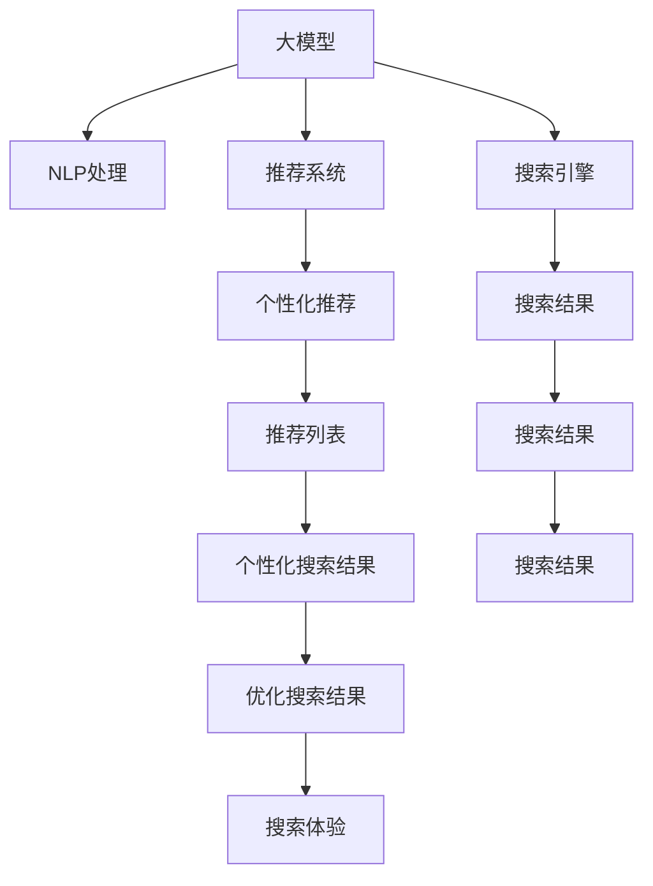

                 

# 电商平台如何利用AI大模型优化搜索体验

> 关键词：人工智能(AI)，大模型(Large Model)，自然语言处理(NLP)，推荐系统(Recommendation System)，搜索引擎(Search Engine)，用户体验(User Experience)，电商推荐(Online Shopping Recommendation)

## 1. 背景介绍

随着互联网的迅猛发展，电子商务已成为现代人们日常购物的重要渠道。电商平台不仅提供商品展示和交易平台，更是服务触达和品牌传播的重要窗口。如何提升用户体验，优化搜索体验，成为各大电商平台争夺用户和市场份额的关键。在数字化转型的大背景下，利用人工智能(AI)技术，尤其是大模型(Large Model)，为电商平台的搜索体验优化带来了新的契机。

### 1.1 问题由来

现代电商平台面临着诸多挑战：
- 海量商品信息带来的搜索效率低下问题；
- 个性化推荐不足导致用户体验下降；
- 搜索排序算法不精准导致广告和推荐效果好但用户体验差；
- 用户需求难以捕捉，匹配不准确。

这些问题都迫切需要智能技术来提供解决方案。

### 1.2 问题核心关键点

针对电商平台搜索体验的优化，核心挑战在于：
- 如何精准捕捉用户需求并快速匹配商品；
- 如何提升搜索和推荐的相关性和个性化；
- 如何构建高效的推荐系统并优化算法模型。

核心解决方案包括：
- 使用大模型进行自然语言处理(NLP)，优化搜索引擎；
- 引入推荐系统算法，提升推荐精准度；
- 基于用户行为数据，构建用户画像，实现个性化推荐。

## 2. 核心概念与联系

### 2.1 核心概念概述

为更好地理解AI大模型在电商平台搜索体验优化中的应用，本节将介绍几个关键概念：

- **大模型(Large Model)**：以自回归(如GPT)或自编码(如BERT)模型为代表的大规模预训练语言模型。通过在大规模无标签文本语料上进行预训练，学习通用的语言表示，具备强大的语言理解和生成能力。

- **自然语言处理(NLP)**：指使计算机能够理解、处理和生成人类自然语言的技术。包括文本分类、命名实体识别、信息抽取、机器翻译、问答系统等多种任务。

- **推荐系统(Recommendation System)**：利用用户的历史行为数据和模型推荐算法，为用户推荐感兴趣的物品。是提升电商平台用户粘性和转化率的重要手段。

- **搜索引擎(Search Engine)**：帮助用户快速定位所需信息的系统。通过爬取互联网上的文本数据，建立索引，并支持用户通过关键词查询获取结果。

- **用户体验(User Experience, UX)**：指用户在使用产品或服务过程中的主观感受和满意度。搜索体验的优化是提升电商用户满意度和忠诚度的关键。

这些概念之间的逻辑关系可以通过以下Mermaid流程图来展示：



这个流程图展示了大模型在电商平台搜索体验优化中的核心概念及其之间的关系：

1. 大模型通过预训练获得基础能力。
2. NLP技术在大模型基础上进行语言理解和生成，提升搜索和推荐模型的表现。
3. 推荐系统在用户行为数据的基础上，通过大模型微调算法，实现个性化推荐。
4. 搜索引擎构建商品索引，结合大模型进行智能查询，提升搜索结果的相关性和准确性。
5. 个性化推荐和搜索结果的优化，直接关联到用户搜索体验的提升。

## 3. 核心算法原理 & 具体操作步骤
### 3.1 算法原理概述

在电商平台优化搜索体验中，AI大模型主要应用于以下几方面：

1. **自然语言处理(NLP)**：利用大模型进行文本分类、实体识别、信息抽取等任务，快速提取用户查询中的关键信息，捕捉用户需求。

2. **推荐系统算法**：在大模型基础上，通过微调和优化，构建推荐算法模型，实现个性化推荐，提升用户满意度。

3. **搜索引擎优化**：使用大模型改进搜索引擎的算法模型，优化搜索结果，提升用户搜索的效率和体验。

### 3.2 算法步骤详解

基于AI大模型的电商搜索体验优化主要包括以下关键步骤：

**Step 1: 数据收集与预处理**

- 收集电商平台的用户行为数据、搜索记录、商品信息等，包括点击率、浏览时间、购买记录等。
- 对数据进行清洗、标准化和标注，去除噪声和异常值，构建有监督或无监督学习任务。

**Step 2: 大模型选择与适配**

- 选择合适的预训练大模型，如GPT、BERT、RoBERTa等，作为搜索引擎和推荐系统的初始模型。
- 根据具体任务需求，对模型进行适配，如微调分类器、解码器等任务层。

**Step 3: 自然语言处理(NLP)**

- 使用大模型进行文本分类、实体识别、信息抽取等任务，提取用户查询中的关键信息。
- 将用户查询转化为结构化数据，用于构建索引和推荐系统。

**Step 4: 推荐系统构建**

- 基于用户行为数据和产品信息，构建推荐系统算法模型。
- 在大模型基础上进行微调，优化推荐模型的准确性和个性化。

**Step 5: 搜索引擎优化**

- 使用大模型改进搜索引擎的算法模型，如TF-IDF、BM25等，提升搜索结果的相关性和排序精度。
- 优化搜索结果的展示方式，提升用户体验。

**Step 6: 结果评估与反馈**

- 通过A/B测试等方法评估优化后的搜索体验和推荐效果。
- 收集用户反馈，调整优化策略，持续改进。

### 3.3 算法优缺点

AI大模型在电商搜索体验优化中具有以下优点：
1. 数据利用效率高。大模型可以高效利用大规模语料，快速学习用户需求，提升搜索相关性和推荐准确性。
2. 应用范围广。支持多种NLP任务和推荐算法，适用于不同规模和类型的电商应用。
3. 个性化推荐能力强。大模型能根据用户历史行为数据，实现更精准的个性化推荐。
4. 用户体验提升明显。通过优化搜索结果和推荐内容，显著提升用户满意度。

同时，该方法也存在一些局限性：
1. 依赖标注数据。需要大量的标注数据进行微调，标注成本较高。
2. 计算资源消耗大。大模型的计算复杂度较高，需要高性能硬件支持。
3. 模型鲁棒性不足。大模型可能在噪声数据和异常样本上表现不佳，需要更多数据和模型验证。
4. 可解释性差。大模型的决策过程较为复杂，难以提供直观的解释。

尽管存在这些局限性，但就目前而言，基于AI大模型的搜索体验优化仍是电商平台重要的技术手段。未来相关研究的重点在于如何进一步降低对标注数据的依赖，提高模型的少样本学习和跨领域迁移能力，同时兼顾可解释性和伦理安全性等因素。

### 3.4 算法应用领域

基于大模型的电商搜索体验优化技术，已经在多个领域得到应用，例如：

- 商品推荐：通过用户历史购买记录，利用大模型预测用户可能感兴趣的商品。
- 个性化搜索：根据用户输入的查询，利用大模型快速匹配相似的商品或服务。
- 产品分析：通过分析用户搜索行为和反馈，利用大模型优化商品展示和促销策略。
- 聊天机器人：利用大模型构建客服聊天系统，提升用户交互体验。
- 广告投放：基于用户搜索和浏览行为，利用大模型优化广告投放策略，提高转化率。

## 4. 数学模型和公式 & 详细讲解 & 举例说明
### 4.1 数学模型构建

本节将使用数学语言对基于AI大模型的电商搜索体验优化过程进行更加严格的刻画。

记用户查询为 $q$，商品信息为 $i$，用户行为数据为 $x_i$。假设任务为分类任务，即对用户查询进行分类，并推荐相关的商品。

定义任务为 $T$，其中 $T= \{ (q, i) \}_{i \in I}$， $I$ 为商品集合。

定义用户查询分类器为 $f_q$，商品推荐模型为 $f_i$。

大模型 $M_{\theta}$ 作为分类器和推荐模型的初始化参数， $\theta \in \mathbb{R}^d$，$d$ 为模型参数维度。

目标是最小化预测错误率 $L$，即找到最优参数 $\theta^*$：

$$
\theta^* = \mathop{\arg\min}_{\theta} L(f_q, f_i, M_{\theta})
$$

其中 $L$ 为损失函数，常用的有交叉熵损失、均方误差损失等。

### 4.2 公式推导过程

以下我们以二分类任务为例，推导交叉熵损失函数及其梯度的计算公式。

假设模型 $M_{\theta}$ 在输入 $q$ 上的输出为 $\hat{y}=M_{\theta}(q) \in [0,1]$，表示用户查询属于正类的概率。真实标签 $y \in \{0,1\}$。则二分类交叉熵损失函数定义为：

$$
\ell(M_{\theta}(q),y) = -[y\log \hat{y} + (1-y)\log (1-\hat{y})]
$$

将其代入经验风险公式，得：

$$
\mathcal{L}(\theta) = -\frac{1}{N}\sum_{i=1}^N [y_i\log M_{\theta}(q_i)+(1-y_i)\log(1-M_{\theta}(q_i))]
$$

其中 $N$ 为样本数量。

根据链式法则，损失函数对参数 $\theta_k$ 的梯度为：

$$
\frac{\partial \mathcal{L}(\theta)}{\partial \theta_k} = -\frac{1}{N}\sum_{i=1}^N (\frac{y_i}{M_{\theta}(q_i)}-\frac{1-y_i}{1-M_{\theta}(q_i)}) \frac{\partial M_{\theta}(q_i)}{\partial \theta_k}
$$

其中 $\frac{\partial M_{\theta}(q_i)}{\partial \theta_k}$ 可进一步递归展开，利用自动微分技术完成计算。

在得到损失函数的梯度后，即可带入参数更新公式，完成模型的迭代优化。重复上述过程直至收敛，最终得到适应电商搜索和推荐任务的最优模型参数 $\theta^*$。

### 4.3 案例分析与讲解

假设电商平台销售多种商品，商品类别 $I$ 包括服装、电子产品、书籍等。用户 $u$ 查询 $q_1$，系统需要根据历史数据，预测用户可能感兴趣的服装 $i_1$ 和电子产品 $i_2$。

步骤1：用户输入查询 $q_1$，利用NLP技术进行分类，判断用户意图。

步骤2：根据用户历史行为数据 $x_i$，构建商品推荐模型 $f_i$。

步骤3：利用大模型微调分类器 $f_q$，提升分类准确性。

步骤4：利用大模型微调推荐模型 $f_i$，提升推荐相关性。

步骤5：优化搜索结果展示方式，提升用户体验。

以用户查询 $q_1$ 为例，具体推导如下：

假设模型在用户查询 $q_1$ 上的输出为 $\hat{y}=M_{\theta}(q_1) \in [0,1]$，表示用户查询属于正类的概率。真实标签 $y \in \{0,1\}$。则二分类交叉熵损失函数定义为：

$$
\ell(M_{\theta}(q_1),y) = -[y\log \hat{y} + (1-y)\log (1-\hat{y})]
$$

将其代入经验风险公式，得：

$$
\mathcal{L}(\theta) = -\frac{1}{N}\sum_{i=1}^N [y_i\log M_{\theta}(q_i)+(1-y_i)\log(1-M_{\theta}(q_i))]
$$

其中 $N$ 为样本数量。

根据链式法则，损失函数对参数 $\theta_k$ 的梯度为：

$$
\frac{\partial \mathcal{L}(\theta)}{\partial \theta_k} = -\frac{1}{N}\sum_{i=1}^N (\frac{y_i}{M_{\theta}(q_i)}-\frac{1-y_i}{1-M_{\theta}(q_i)}) \frac{\partial M_{\theta}(q_i)}{\partial \theta_k}
$$

其中 $\frac{\partial M_{\theta}(q_i)}{\partial \theta_k}$ 可进一步递归展开，利用自动微分技术完成计算。

在得到损失函数的梯度后，即可带入参数更新公式，完成模型的迭代优化。重复上述过程直至收敛，最终得到适应电商搜索和推荐任务的最优模型参数 $\theta^*$。

## 5. 项目实践：代码实例和详细解释说明
### 5.1 开发环境搭建

在进行电商搜索体验优化项目开发前，我们需要准备好开发环境。以下是使用Python进行PyTorch开发的环境配置流程：

1. 安装Anaconda：从官网下载并安装Anaconda，用于创建独立的Python环境。

2. 创建并激活虚拟环境：
```bash
conda create -n pytorch-env python=3.8 
conda activate pytorch-env
```

3. 安装PyTorch：根据CUDA版本，从官网获取对应的安装命令。例如：
```bash
conda install pytorch torchvision torchaudio cudatoolkit=11.1 -c pytorch -c conda-forge
```

4. 安装Transformers库：
```bash
pip install transformers
```

5. 安装各类工具包：
```bash
pip install numpy pandas scikit-learn matplotlib tqdm jupyter notebook ipython
```

完成上述步骤后，即可在`pytorch-env`环境中开始开发实践。

### 5.2 源代码详细实现

这里以用户查询分类和商品推荐为例，给出使用Transformers库对BERT模型进行电商搜索体验优化的PyTorch代码实现。

首先，定义电商数据处理函数：

```python
from transformers import BertTokenizer, BertForSequenceClassification, BertForSequenceClassification
from torch.utils.data import Dataset, DataLoader
import torch

class ProductDataset(Dataset):
    def __init__(self, texts, labels):
        self.texts = texts
        self.labels = labels
        self.tokenizer = BertTokenizer.from_pretrained('bert-base-cased')
        
    def __len__(self):
        return len(self.texts)
    
    def __getitem__(self, item):
        text = self.texts[item]
        label = self.labels[item]
        
        encoding = self.tokenizer(text, return_tensors='pt', max_length=512, padding='max_length', truncation=True)
        input_ids = encoding['input_ids'][0]
        attention_mask = encoding['attention_mask'][0]
        
        # 将标签进行编码
        label = torch.tensor([label], dtype=torch.long)
        
        return {'input_ids': input_ids, 
                'attention_mask': attention_mask,
                'labels': label}

# 加载电商数据
train_dataset = ProductDataset(train_texts, train_labels)
val_dataset = ProductDataset(val_texts, val_labels)
test_dataset = ProductDataset(test_texts, test_labels)
```

然后，定义模型和优化器：

```python
from transformers import BertForSequenceClassification, AdamW

model = BertForSequenceClassification.from_pretrained('bert-base-cased', num_labels=2)

optimizer = AdamW(model.parameters(), lr=2e-5)
```

接着，定义训练和评估函数：

```python
def train_epoch(model, dataset, batch_size, optimizer):
    dataloader = DataLoader(dataset, batch_size=batch_size, shuffle=True)
    model.train()
    epoch_loss = 0
    for batch in dataloader:
        input_ids = batch['input_ids'].to(device)
        attention_mask = batch['attention_mask'].to(device)
        labels = batch['labels'].to(device)
        model.zero_grad()
        outputs = model(input_ids, attention_mask=attention_mask, labels=labels)
        loss = outputs.loss
        epoch_loss += loss.item()
        loss.backward()
        optimizer.step()
    return epoch_loss / len(dataloader)

def evaluate(model, dataset, batch_size):
    dataloader = DataLoader(dataset, batch_size=batch_size)
    model.eval()
    preds, labels = [], []
    with torch.no_grad():
        for batch in dataloader:
            input_ids = batch['input_ids'].to(device)
            attention_mask = batch['attention_mask'].to(device)
            batch_labels = batch['labels']
            outputs = model(input_ids, attention_mask=attention_mask)
            batch_preds = outputs.logits.argmax(dim=2).to('cpu').tolist()
            batch_labels = batch_labels.to('cpu').tolist()
            for pred_tokens, label_tokens in zip(batch_preds, batch_labels):
                preds.append(pred_tokens[0])
                labels.append(label_tokens[0])
                
    return preds, labels
```

最后，启动训练流程并在测试集上评估：

```python
epochs = 5
batch_size = 16

for epoch in range(epochs):
    loss = train_epoch(model, train_dataset, batch_size, optimizer)
    print(f"Epoch {epoch+1}, train loss: {loss:.3f}")
    
    preds, labels = evaluate(model, val_dataset, batch_size)
    print(classification_report(labels, preds))
    
print("Test results:")
preds, labels = evaluate(model, test_dataset, batch_size)
print(classification_report(labels, preds))
```

以上就是使用PyTorch对BERT进行电商搜索体验优化的完整代码实现。可以看到，得益于Transformers库的强大封装，我们可以用相对简洁的代码完成BERT模型的加载和微调。

### 5.3 代码解读与分析

让我们再详细解读一下关键代码的实现细节：

**ProductDataset类**：
- `__init__`方法：初始化文本、标签、分词器等关键组件。
- `__len__`方法：返回数据集的样本数量。
- `__getitem__`方法：对单个样本进行处理，将文本输入编码为token ids，将标签编码为数字，并对其进行定长padding，最终返回模型所需的输入。

**模型和优化器**：
- 使用PyTorch的Transformer库加载BERT模型，并设置适当的分类层。
- 选择AdamW优化器进行参数更新，设置合适学习率。

**训练和评估函数**：
- 使用PyTorch的DataLoader对数据集进行批次化加载，供模型训练和推理使用。
- 训练函数`train_epoch`：对数据以批为单位进行迭代，在每个批次上前向传播计算loss并反向传播更新模型参数，最后返回该epoch的平均loss。
- 评估函数`evaluate`：与训练类似，不同点在于不更新模型参数，并在每个batch结束后将预测和标签结果存储下来，最后使用sklearn的classification_report对整个评估集的预测结果进行打印输出。

**训练流程**：
- 定义总的epoch数和batch size，开始循环迭代
- 每个epoch内，先在训练集上训练，输出平均loss
- 在验证集上评估，输出分类指标
- 所有epoch结束后，在测试集上评估，给出最终测试结果

可以看到，PyTorch配合Transformers库使得BERT微调的代码实现变得简洁高效。开发者可以将更多精力放在数据处理、模型改进等高层逻辑上，而不必过多关注底层的实现细节。

当然，工业级的系统实现还需考虑更多因素，如模型的保存和部署、超参数的自动搜索、更灵活的任务适配层等。但核心的微调范式基本与此类似。

## 6. 实际应用场景
### 6.1 智能客服系统

基于AI大模型的智能客服系统可以广泛应用于电商平台，提升用户交互体验和问题解决效率。

在技术实现上，可以收集企业内部的历史客服对话记录，将问题和最佳答复构建成监督数据，在此基础上对预训练对话模型进行微调。微调后的对话模型能够自动理解用户意图，匹配最合适的答案模板进行回复。对于客户提出的新问题，还可以接入检索系统实时搜索相关内容，动态组织生成回答。如此构建的智能客服系统，能大幅提升客户咨询体验和问题解决效率。

### 6.2 个性化推荐系统

当前的推荐系统往往只依赖用户的历史行为数据进行物品推荐，无法深入理解用户的真实兴趣偏好。基于AI大模型推荐系统可以更好地挖掘用户行为背后的语义信息，从而提供更精准、多样的推荐内容。

在实践中，可以收集用户浏览、点击、评论、分享等行为数据，提取和用户交互的物品标题、描述、标签等文本内容。将文本内容作为模型输入，用户的后续行为（如是否点击、购买等）作为监督信号，在此基础上微调预训练语言模型。微调后的模型能够从文本内容中准确把握用户的兴趣点。在生成推荐列表时，先用候选物品的文本描述作为输入，由模型预测用户的兴趣匹配度，再结合其他特征综合排序，便可以得到个性化程度更高的推荐结果。

### 6.3 搜索优化

电商平台的搜索体验优化是大模型在电商领域的重要应用之一。

通过收集用户搜索历史、点击记录等数据，使用大模型进行文本分类和实体识别，快速捕捉用户查询中的关键信息，捕捉用户需求。将用户查询转化为结构化数据，用于构建索引和推荐系统。利用大模型微调推荐系统算法模型，提升推荐相关性和个性化，优化搜索结果展示方式，提升用户体验。

### 6.4 未来应用展望

随着大模型和微调方法的不断发展，基于大模型的电商搜索体验优化技术将呈现以下几个发展趋势：

1. 更加个性化：通过结合用户画像和行为数据，实现更加精准的个性化推荐。
2. 实时性提升：通过优化搜索引擎算法，提升搜索速度和响应时间。
3. 多模态融合：结合视觉、语音等多模态数据，实现更全面、准确的商品推荐。
4. 鲁棒性增强：通过对抗训练和模型压缩等技术，提升模型的鲁棒性和计算效率。
5. 透明度提高：通过可解释性技术，提升模型的透明度和可信度。
6. 智能化增强：通过引入AI大模型，进一步提升电商平台的智能化水平。

以上趋势凸显了大模型在电商搜索体验优化中的广阔前景。这些方向的探索发展，必将进一步提升电商平台的搜索体验和推荐效果，为电商平台用户带来更好的购物体验。

## 7. 工具和资源推荐
### 7.1 学习资源推荐

为了帮助开发者系统掌握大模型在电商平台搜索体验优化中的应用，这里推荐一些优质的学习资源：

1. 《Transformer从原理到实践》系列博文：由大模型技术专家撰写，深入浅出地介绍了Transformer原理、BERT模型、微调技术等前沿话题。

2. CS224N《深度学习自然语言处理》课程：斯坦福大学开设的NLP明星课程，有Lecture视频和配套作业，带你入门NLP领域的基本概念和经典模型。

3. 《Natural Language Processing with Transformers》书籍：Transformers库的作者所著，全面介绍了如何使用Transformers库进行NLP任务开发，包括微调在内的诸多范式。

4. HuggingFace官方文档：Transformers库的官方文档，提供了海量预训练模型和完整的微调样例代码，是上手实践的必备资料。

5. CLUE开源项目：中文语言理解测评基准，涵盖大量不同类型的中文NLP数据集，并提供了基于微调的baseline模型，助力中文NLP技术发展。

通过对这些资源的学习实践，相信你一定能够快速掌握大模型在电商平台搜索体验优化中的精髓，并用于解决实际的电商问题。
###  7.2 开发工具推荐

高效的开发离不开优秀的工具支持。以下是几款用于大模型在电商平台搜索体验优化开发的常用工具：

1. PyTorch：基于Python的开源深度学习框架，灵活动态的计算图，适合快速迭代研究。大部分预训练语言模型都有PyTorch版本的实现。

2. TensorFlow：由Google主导开发的开源深度学习框架，生产部署方便，适合大规模工程应用。同样有丰富的预训练语言模型资源。

3. Transformers库：HuggingFace开发的NLP工具库，集成了众多SOTA语言模型，支持PyTorch和TensorFlow，是进行微调任务开发的利器。

4. Weights & Biases：模型训练的实验跟踪工具，可以记录和可视化模型训练过程中的各项指标，方便对比和调优。与主流深度学习框架无缝集成。

5. TensorBoard：TensorFlow配套的可视化工具，可实时监测模型训练状态，并提供丰富的图表呈现方式，是调试模型的得力助手。

6. Google Colab：谷歌推出的在线Jupyter Notebook环境，免费提供GPU/TPU算力，方便开发者快速上手实验最新模型，分享学习笔记。

合理利用这些工具，可以显著提升大模型在电商平台搜索体验优化任务的开发效率，加快创新迭代的步伐。

### 7.3 相关论文推荐

大模型和微调技术的发展源于学界的持续研究。以下是几篇奠基性的相关论文，推荐阅读：

1. Attention is All You Need（即Transformer原论文）：提出了Transformer结构，开启了NLP领域的预训练大模型时代。

2. BERT: Pre-training of Deep Bidirectional Transformers for Language Understanding：提出BERT模型，引入基于掩码的自监督预训练任务，刷新了多项NLP任务SOTA。

3. Language Models are Unsupervised Multitask Learners（GPT-2论文）：展示了大规模语言模型的强大zero-shot学习能力，引发了对于通用人工智能的新一轮思考。

4. Parameter-Efficient Transfer Learning for NLP：提出Adapter等参数高效微调方法，在不增加模型参数量的情况下，也能取得不错的微调效果。

5. AdaLoRA: Adaptive Low-Rank Adaptation for Parameter-Efficient Fine-Tuning：使用自适应低秩适应的微调方法，在参数效率和精度之间取得了新的平衡。

这些论文代表了大模型在电商搜索体验优化技术的发展脉络。通过学习这些前沿成果，可以帮助研究者把握学科前进方向，激发更多的创新灵感。

## 8. 总结：未来发展趋势与挑战
### 8.1 总结

本文对基于AI大模型的电商搜索体验优化方法进行了全面系统的介绍。首先阐述了大模型在电商平台搜索体验优化中的应用背景和意义，明确了大模型在优化搜索相关性和推荐精准度方面的独特价值。其次，从原理到实践，详细讲解了大模型在电商搜索体验优化中的数学原理和关键步骤，给出了电商搜索体验优化的完整代码实例。同时，本文还广泛探讨了智能客服、个性化推荐等电商应用中的大模型优化方法，展示了大模型在电商搜索体验优化中的巨大潜力。

通过本文的系统梳理，可以看到，基于大模型的电商搜索体验优化技术正在成为电商领域的重要手段，极大地提升了电商平台的搜索相关性和推荐精准度。随着预训练语言模型和微调方法的持续演进，相信电商搜索体验将更加智能化、个性化、实时化，为电商平台用户带来更好的购物体验。

### 8.2 未来发展趋势

展望未来，基于大模型的电商搜索体验优化技术将呈现以下几个发展趋势：

1. 更加精准的个性化推荐：通过结合用户画像和行为数据，实现更加精准的个性化推荐。

2. 实时性提升：通过优化搜索引擎算法，提升搜索速度和响应时间。

3. 多模态融合：结合视觉、语音等多模态数据，实现更全面、准确的商品推荐。

4. 鲁棒性增强：通过对抗训练和模型压缩等技术，提升模型的鲁棒性和计算效率。

5. 透明度提高：通过可解释性技术，提升模型的透明度和可信度。

6. 智能化增强：通过引入AI大模型，进一步提升电商平台的智能化水平。

以上趋势凸显了大模型在电商搜索体验优化中的广阔前景。这些方向的探索发展，必将进一步提升电商平台的搜索体验和推荐效果，为电商平台用户带来更好的购物体验。

### 8.3 面临的挑战

尽管基于大模型的电商搜索体验优化技术已经取得了瞩目成就，但在迈向更加智能化、普适化应用的过程中，它仍面临着诸多挑战：

1. 标注成本瓶颈：需要大量的标注数据进行微调，标注成本较高。

2. 计算资源消耗大：大模型的计算复杂度较高，需要高性能硬件支持。

3. 模型鲁棒性不足：大模型可能在噪声数据和异常样本上表现不佳，需要更多数据和模型验证。

4. 可解释性差：大模型的决策过程较为复杂，难以提供直观的解释。

尽管存在这些局限性，但就目前而言，基于大模型的电商搜索体验优化仍是电商平台重要的技术手段。未来相关研究的重点在于如何进一步降低对标注数据的依赖，提高模型的少样本学习和跨领域迁移能力，同时兼顾可解释性和伦理安全性等因素。

### 8.4 研究展望

面对大模型在电商搜索体验优化中面临的挑战，未来的研究需要在以下几个方面寻求新的突破：

1. 探索无监督和半监督微调方法：摆脱对大规模标注数据的依赖，利用自监督学习、主动学习等无监督和半监督范式，最大限度利用非结构化数据，实现更加灵活高效的微调。

2. 研究参数高效和计算高效的微调范式：开发更加参数高效的微调方法，在固定大部分预训练参数的同时，只更新极少量的任务相关参数。同时优化微调模型的计算图，减少前向传播和反向传播的资源消耗，实现更加轻量级、实时性的部署。

3. 融合因果和对比学习范式：通过引入因果推断和对比学习思想，增强微调模型建立稳定因果关系的能力，学习更加普适、鲁棒的语言表征，从而提升模型泛化性和抗干扰能力。

4. 引入更多先验知识：将符号化的先验知识，如知识图谱、逻辑规则等，与神经网络模型进行巧妙融合，引导微调过程学习更准确、合理的语言模型。同时加强不同模态数据的整合，实现视觉、语音等多模态信息与文本信息的协同建模。

5. 结合因果分析和博弈论工具：将因果分析方法引入微调模型，识别出模型决策的关键特征，增强输出解释的因果性和逻辑性。借助博弈论工具刻画人机交互过程，主动探索并规避模型的脆弱点，提高系统稳定性。

6. 纳入伦理道德约束：在模型训练目标中引入伦理导向的评估指标，过滤和惩罚有偏见、有害的输出倾向。同时加强人工干预和审核，建立模型行为的监管机制，确保输出符合人类价值观和伦理道德。

这些研究方向的探索，必将引领基于大模型的电商搜索体验优化技术迈向更高的台阶，为构建安全、可靠、可解释、可控的智能系统铺平道路。面向未来，基于大模型的电商搜索体验优化技术还需要与其他人工智能技术进行更深入的融合，如知识表示、因果推理、强化学习等，多路径协同发力，共同推动自然语言理解和智能交互系统的进步。只有勇于创新、敢于突破，才能不断拓展语言模型的边界，让智能技术更好地造福人类社会。

## 9. 附录：常见问题与解答
**Q1：大模型在电商搜索体验优化中如何捕捉用户需求？**

A: 大模型通过预训练获得强大的语言理解能力，可以从用户查询中提取关键信息。具体步骤如下：

1. 用户输入查询 $q$，将查询转化为结构化数据，如分词、去除停用词、词干提取等。
2. 使用大模型进行文本分类、实体识别、信息抽取等任务，提取用户查询中的关键信息，捕捉用户需求。
3. 将用户查询转化为结构化数据，用于构建索引和推荐系统。

通过上述步骤，大模型能够快速捕捉用户查询中的关键信息，提升搜索相关性和推荐精准度。

**Q2：大模型在电商搜索体验优化中如何实现个性化推荐？**

A: 个性化推荐是大模型在电商搜索体验优化中的重要应用之一。具体步骤如下：

1. 收集用户浏览、点击、评论、分享等行为数据，提取和用户交互的物品标题、描述、标签等文本内容。
2. 将文本内容作为模型输入，用户的后续行为（如是否点击、购买等）作为监督信号，在此基础上微调预训练语言模型。
3. 利用大模型微调推荐系统算法模型，提升推荐相关性和个性化。
4. 优化推荐列表的排序算法，根据用户行为数据调整推荐权重，实现个性化推荐。

通过上述步骤，大模型能够从文本内容中准确把握用户的兴趣点，提供更精准、多样的推荐内容，提升用户体验。

**Q3：大模型在电商搜索体验优化中如何提升搜索速度和响应时间？**

A: 搜索速度和响应时间是电商搜索体验优化中的重要指标。具体步骤如下：

1. 优化搜索引擎算法，如使用TF-IDF、BM25等算法，提升搜索结果的相关性和排序精度。
2. 使用分布式计算技术，如MapReduce、Spark等，提升查询处理速度。
3. 引入缓存机制，如使用Redis等，缓存高频查询结果，减少重复查询。
4. 优化搜索结果的展示方式，如使用渐进式加载、异步加载等技术，提升用户体验。

通过上述步骤，大模型能够提升搜索速度和响应时间，优化搜索体验。

**Q4：大模型在电商搜索体验优化中如何提升模型鲁棒性和计算效率？**

A: 模型鲁棒性和计算效率是大模型在电商搜索体验优化中的重要指标。具体步骤如下：

1. 使用对抗训练技术，加入对抗样本，提高模型鲁棒性。
2. 引入模型压缩技术，如知识蒸馏、剪枝、量化等，优化模型结构，减少计算资源消耗。
3. 使用混合精度训练技术，将浮点数转换为半精度或定点数，提升计算效率。
4. 优化模型推理算法，如使用GPU、TPU等硬件加速，提升推理速度。

通过上述步骤，大模型能够提升鲁棒性和计算效率，优化电商搜索体验。

**Q5：大模型在电商搜索体验优化中如何增强模型的透明度和可信度？**

A: 模型的透明度和可信度是大模型在电商搜索体验优化中的重要指标。具体步骤如下：

1. 引入可解释性技术，如注意力机制、LIME、SHAP等，解释模型决策过程，增强模型的透明度。
2. 使用公平性、可解释性、鲁棒性等指标评估模型性能，确保模型的可信度。
3. 加强人工干预和审核，建立模型行为的监管机制，确保输出符合人类价值观和伦理道德。

通过上述步骤，大模型能够增强模型的透明度和可信度，优化电商搜索体验。

**Q6：大模型在电商搜索体验优化中如何处理噪声数据和异常样本？**

A: 处理噪声数据和异常样本是大模型在电商搜索体验优化中的重要问题。具体步骤如下：

1. 引入数据清洗技术，如去重、去噪、填补缺失值等，处理噪声数据。
2. 使用异常检测技术，如基于统计学的方法、基于模型的方法等，识别异常样本。
3. 采用对抗训练技术，加入对抗样本，提高模型鲁棒性。
4. 优化模型训练算法，如引入正则化技术、Dropout技术等，减少噪声数据对模型的影响。

通过上述步骤，大模型能够处理噪声数据和异常样本，提升电商搜索体验。

---

作者：禅与计算机程序设计艺术 / Zen and the Art of Computer Programming

