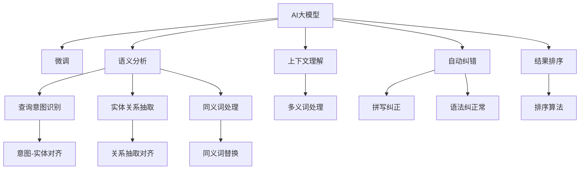

                 

# 电商平台搜索query理解：AI大模型的语义分析

## 1. 背景介绍

### 1.1 问题由来

随着电商平台的蓬勃发展，搜索功能成为用户获取商品信息的重要入口。传统的搜索系统通常基于关键词匹配，无法处理同义词、多义词、语境变化等自然语言问题。用户输入的查询通常包含语法错误、拼写错误、模糊描述等噪声，导致搜索效果欠佳。为了提升搜索准确率和用户体验，电商平台亟需一种更智能、更高效的搜索技术。

近年来，AI大模型如BERT、GPT等在自然语言处理领域取得了巨大突破，其强大的语言理解和生成能力为电商平台搜索query理解提供了新的思路。利用AI大模型进行语义分析，可以理解用户输入的查询意图，减少噪音干扰，生成更加精准的搜索结果。

### 1.2 问题核心关键点

实现AI大模型在电商平台搜索中的应用，需要解决以下关键问题：

- 如何对电商领域的语料进行标注和预处理，构建高质量的训练数据集。
- 如何选择合适的预训练语言模型进行微调，以适应电商平台搜索的特定需求。
- 如何在模型训练和应用过程中避免过拟合和泛化问题，确保模型的通用性和稳定性。
- 如何设计合理的损失函数和评价指标，准确评估搜索模型的效果。
- 如何优化模型推理速度，提升搜索系统的响应性能。

这些问题构成了AI大模型在电商平台搜索应用的核心挑战，解决这些问题将极大地提升搜索系统的智能化水平。

## 2. 核心概念与联系

### 2.1 核心概念概述

为更好地理解AI大模型在电商平台搜索query理解中的应用，本节将介绍几个密切相关的核心概念：

- AI大模型(AI Large Model)：如BERT、GPT等，以Transformer为基础的深度学习模型，具备强大的语言理解和生成能力，可以处理大规模无标签文本数据。
- 微调(Fine-tuning)：在预训练模型的基础上，通过下游任务的少量标注数据进行有监督学习，优化模型在特定任务上的性能。
- 语义分析(Semantic Analysis)：通过理解查询的自然语言语义，识别查询中的关键实体、关系、意图等信息，提升搜索结果的准确性和相关性。
- 自动纠错(Automatic Correction)：在查询输入过程中，利用语言模型进行语法、拼写等错误纠正，提升查询的质量。
- 上下文理解(Context Understanding)：利用大模型理解查询的前后文关系，解决多义词、同义词等问题。
- 结果排序(Result Ranking)：根据查询意图和上下文信息，对搜索结果进行排序，确保最相关、最符合用户需求的商品排在最前面。

这些核心概念之间的逻辑关系可以通过以下Mermaid流程图来展示：



这个流程图展示了大语言模型在电商平台搜索中的应用流程：

1. 通过微调，大语言模型学习电商平台特有的商品语料。
2. 利用语义分析、自动纠错、上下文理解等技术，解析查询的自然语言语义，提取关键信息。
3. 通过结果排序算法，对搜索结果进行排序，确保查询意图和上下文信息与商品匹配度最大化。

## 3. 核心算法原理 & 具体操作步骤
### 3.1 算法原理概述

基于AI大模型的电商平台搜索query理解，本质上是一个自然语言处理中的语义分析问题。其核心思想是：将查询转化为模型可理解的向量表示，通过理解查询的语义和上下文信息，生成对应的搜索结果。

具体而言，假设查询为 $q$，模型将其转化为向量表示 $q^*$。电商平台商品集为 $\mathcal{S}$，每个商品有一个向量表示 $s_i$。根据相似度函数 $sim(q^*, s_i)$，计算查询与每个商品的相似度。最终的搜索结果 $r(q)$ 根据相似度进行排序，输出前N个商品作为推荐结果。

### 3.2 算法步骤详解

基于AI大模型的电商平台搜索query理解，主要包括以下几个关键步骤：

**Step 1: 数据预处理**

- 收集电商平台的商品描述、用户评论等文本数据，进行清洗和标注。
- 将商品描述作为模型训练的语料，进行分词、去除停用词、构建词典等预处理。
- 将标注数据划分为训练集、验证集和测试集，用于模型训练、验证和测试。

**Step 2: 模型选择与微调**

- 选择合适的预训练语言模型，如BERT、GPT等，进行微调。
- 设计任务适配层，如分类头、解码器等，适配电商搜索任务。
- 设置微调超参数，如学习率、批大小、迭代轮数等。

**Step 3: 查询处理与解析**

- 将用户输入的查询 $q$ 进行分词、去除停用词等预处理。
- 使用微调后的模型，将查询 $q$ 转化为向量表示 $q^*$。
- 利用语义分析技术，解析查询的自然语言语义，提取关键实体、关系、意图等信息。

**Step 4: 结果生成与排序**

- 对电商平台商品集 $\mathcal{S}$ 中的每个商品，使用微调后的模型，生成向量表示 $s_i^*$。
- 计算查询 $q^*$ 与每个商品 $s_i^*$ 的相似度，得到相似度向量 $sim(q^*, s_i^*)$。
- 根据相似度向量对商品进行排序，生成前N个商品作为搜索结果。

**Step 5: 查询纠错与上下文理解**

- 使用自动纠错技术，对查询进行拼写、语法等错误纠正，提升查询质量。
- 利用上下文理解技术，解析查询的前后文关系，解决多义词、同义词等问题。

**Step 6: 反馈优化**

- 收集用户对搜索结果的点击、评分等反馈信息，用于模型优化。
- 利用强化学习等方法，不断优化模型参数和策略，提升搜索效果。

以上是基于AI大模型的电商平台搜索query理解的一般流程。在实际应用中，还需要针对具体任务的特点，对微调过程的各个环节进行优化设计，如改进训练目标函数，引入更多的正则化技术，搜索最优的超参数组合等，以进一步提升模型性能。

### 3.3 算法优缺点

基于AI大模型的电商平台搜索query理解，具有以下优点：

- 强大的语言理解和生成能力，可以处理复杂多变的查询，提高搜索的准确性和相关性。
- 可以通过微调，适应电商平台的特定需求，生成更符合用户预期的搜索结果。
- 可以利用已有的预训练模型，降低开发成本和周期。

同时，该方法也存在一定的局限性：

- 对标注数据的依赖较大，标注成本较高。
- 模型的计算资源消耗较大，推理速度较慢。
- 模型的泛化能力有待提升，面对新出现的商品和查询，可能无法及时适应。
- 模型的可解释性不足，难以直观理解其决策过程。

尽管存在这些局限性，但就目前而言，基于AI大模型的搜索技术仍是大模型应用的主流范式。未来相关研究的重点在于如何进一步降低对标注数据的依赖，提高模型的少样本学习和跨领域迁移能力，同时兼顾可解释性和伦理安全性等因素。

### 3.4 算法应用领域

基于AI大模型的电商平台搜索query理解，已经在多个实际应用场景中得到验证，例如：

- 商品搜索：根据用户输入的查询，自动匹配相关商品，推荐相似商品。
- 相关商品推荐：根据用户浏览历史和购买记录，自动推荐相关商品，提高复购率。
- 用户评论分析：自动分析用户评论，提取商品评价和反馈信息，辅助商品改进。
- 个性化推荐：根据用户兴趣和行为数据，自动生成个性化推荐，提升用户满意度。
- 用户意图识别：自动分析用户意图，根据不同需求，提供相应的服务和推荐。

除了上述这些经典应用外，AI大模型搜索技术还被创新性地应用到更多场景中，如智能客服、个性化内容推荐等，为电商平台的智能化转型提供了新的技术支持。随着预训练模型和搜索技术的不断进步，相信电商平台搜索功能将更加智能、精准、个性化，极大提升用户体验。

## 4. 数学模型和公式 & 详细讲解  
### 4.1 数学模型构建

本节将使用数学语言对基于AI大模型的电商平台搜索query理解过程进行更加严格的刻画。

设查询 $q$ 的分词后结果为 $w_1, w_2, ..., w_n$，每个词的嵌入表示为 $e_i$。电商平台商品集为 $\mathcal{S}$，每个商品的描述向量为 $s_i$。查询的向量表示为 $q^*$，商品向量的表示为 $s_i^*$。模型的语义分析功能为 $f$，结果排序算法为 $r$。

定义查询与商品之间的相似度函数 $sim(q^*, s_i^*)$，可以采用余弦相似度、点积相似度等方法。则最终的搜索结果 $r(q)$ 可以表示为：

$$
r(q) = \{s_i \mid sim(q^*, s_i^*) \geq \theta\} \cap \mathcal{S} \cap r_N
$$

其中 $\theta$ 为相似度阈值，$r_N$ 表示搜索结果不超过N个。

### 4.2 公式推导过程

以余弦相似度为例，进行查询与商品相似度的计算。

设查询向量为 $q^* = [q_1^*, q_2^*, ..., q_n^*]$，商品向量为 $s_i^* = [s_{i1}^*, s_{i2}^*, ..., s_{in}^*]$，则余弦相似度为：

$$
sim(q^*, s_i^*) = \frac{\sum_{j=1}^n q_j^* \cdot s_{ij}^*}{\sqrt{\sum_{j=1}^n (q_j^*)^2} \cdot \sqrt{\sum_{j=1}^n (s_{ij}^*)^2}}
$$

查询 $q$ 的向量表示 $q^*$ 可以通过微调后的模型 $M_{\theta}$ 进行计算：

$$
q^* = M_{\theta}(q) = \left[ e_1, e_2, ..., e_n \right]
$$

其中 $e_i = M_{\theta}(w_i)$ 为模型对每个词的嵌入表示。

将 $q^*$ 和 $s_i^*$ 代入余弦相似度公式，得到：

$$
sim(q^*, s_i^*) = \frac{\sum_{j=1}^n e_j^* \cdot s_{ij}^*}{\sqrt{\sum_{j=1}^n (e_j^*)^2} \cdot \sqrt{\sum_{j=1}^n (s_{ij}^*)^2}}
$$

在得到相似度向量后，可以根据阈值 $\theta$ 和排序算法 $r$，生成最终的结果集 $r(q)$。

### 4.3 案例分析与讲解

以商品搜索为例，详细讲解基于AI大模型的电商平台搜索query理解的具体实现。

假设电商平台有10万个商品，每个商品描述长度为100个词。查询 $q = "黑色T恤"，查询向量 $q^* = [e_1, e_2, ..., e_{100}]$，商品向量 $s_1^*, s_2^*, ..., s_{10^4}^*$ 作为输入，计算每个商品的相似度。

具体步骤如下：

1. 构建词典，将查询和商品描述中的所有词映射为模型可理解的向量表示 $e_i$ 和 $s_{ij}^*$。

2. 使用微调后的模型 $M_{\theta}$ 计算查询向量 $q^*$ 和每个商品向量 $s_i^*$。

3. 计算余弦相似度 $sim(q^*, s_i^*)$，根据阈值 $\theta$ 过滤相似度大于阈值的结果，保留前N个商品。

4. 使用结果排序算法 $r$ 对商品进行排序，生成最终的搜索结果 $r(q)$。

以上步骤展示了基于AI大模型的电商平台搜索query理解的基本流程。在实际应用中，还需要考虑查询纠错、上下文理解、反馈优化等环节，进一步提升搜索效果。

## 5. 项目实践：代码实例和详细解释说明
### 5.1 开发环境搭建

在进行搜索query理解实践前，我们需要准备好开发环境。以下是使用Python进行PyTorch开发的环境配置流程：

1. 安装Anaconda：从官网下载并安装Anaconda，用于创建独立的Python环境。

2. 创建并激活虚拟环境：
```bash
conda create -n search-env python=3.8 
conda activate search-env
```

3. 安装PyTorch：根据CUDA版本，从官网获取对应的安装命令。例如：
```bash
conda install pytorch torchvision torchaudio cudatoolkit=11.1 -c pytorch -c conda-forge
```

4. 安装Transformers库：
```bash
pip install transformers
```

5. 安装各类工具包：
```bash
pip install numpy pandas scikit-learn matplotlib tqdm jupyter notebook ipython
```

完成上述步骤后，即可在`search-env`环境中开始搜索query理解实践。

### 5.2 源代码详细实现

下面我们以商品搜索任务为例，给出使用Transformers库对BERT模型进行搜索query理解开发的PyTorch代码实现。

首先，定义商品查询处理函数：

```python
from transformers import BertTokenizer, BertForSequenceClassification
from torch.utils.data import Dataset, DataLoader
import torch

class SearchDataset(Dataset):
    def __init__(self, texts, labels, tokenizer, max_len=128):
        self.texts = texts
        self.labels = labels
        self.tokenizer = tokenizer
        self.max_len = max_len
        
    def __len__(self):
        return len(self.texts)
    
    def __getitem__(self, item):
        text = self.texts[item]
        label = self.labels[item]
        
        encoding = self.tokenizer(text, return_tensors='pt', max_length=self.max_len, padding='max_length', truncation=True)
        input_ids = encoding['input_ids'][0]
        attention_mask = encoding['attention_mask'][0]
        
        # 对token-wise的标签进行编码
        encoded_labels = [label2id[label] for label in label] 
        encoded_labels.extend([label2id['O']] * (self.max_len - len(encoded_labels)))
        labels = torch.tensor(encoded_labels, dtype=torch.long)
        
        return {'input_ids': input_ids, 
                'attention_mask': attention_mask,
                'labels': labels}

# 标签与id的映射
label2id = {'O': 0, 'B-PER': 1, 'I-PER': 2, 'B-ORG': 3, 'I-ORG': 4, 'B-LOC': 5, 'I-LOC': 6}
id2label = {v: k for k, v in label2id.items()}

# 创建dataset
tokenizer = BertTokenizer.from_pretrained('bert-base-cased')

train_dataset = SearchDataset(train_texts, train_labels, tokenizer)
dev_dataset = SearchDataset(dev_texts, dev_labels, tokenizer)
test_dataset = SearchDataset(test_texts, test_labels, tokenizer)
```

然后，定义模型和优化器：

```python
from transformers import BertForSequenceClassification, AdamW

model = BertForSequenceClassification.from_pretrained('bert-base-cased', num_labels=len(label2id))

optimizer = AdamW(model.parameters(), lr=2e-5)
```

接着，定义训练和评估函数：

```python
from torch.utils.data import DataLoader
from tqdm import tqdm
from sklearn.metrics import classification_report

device = torch.device('cuda') if torch.cuda.is_available() else torch.device('cpu')
model.to(device)

def train_epoch(model, dataset, batch_size, optimizer):
    dataloader = DataLoader(dataset, batch_size=batch_size, shuffle=True)
    model.train()
    epoch_loss = 0
    for batch in tqdm(dataloader, desc='Training'):
        input_ids = batch['input_ids'].to(device)
        attention_mask = batch['attention_mask'].to(device)
        labels = batch['labels'].to(device)
        model.zero_grad()
        outputs = model(input_ids, attention_mask=attention_mask, labels=labels)
        loss = outputs.loss
        epoch_loss += loss.item()
        loss.backward()
        optimizer.step()
    return epoch_loss / len(dataloader)

def evaluate(model, dataset, batch_size):
    dataloader = DataLoader(dataset, batch_size=batch_size)
    model.eval()
    preds, labels = [], []
    with torch.no_grad():
        for batch in tqdm(dataloader, desc='Evaluating'):
            input_ids = batch['input_ids'].to(device)
            attention_mask = batch['attention_mask'].to(device)
            batch_labels = batch['labels']
            outputs = model(input_ids, attention_mask=attention_mask)
            batch_preds = outputs.logits.argmax(dim=2).to('cpu').tolist()
            batch_labels = batch_labels.to('cpu').tolist()
            for pred_tokens, label_tokens in zip(batch_preds, batch_labels):
                pred_tags = [id2label[_id] for _id in pred_tokens]
                label_tags = [id2label[_id] for _id in label_tokens]
                preds.append(pred_tags[:len(label_tags)])
                labels.append(label_tags)
                
    print(classification_report(labels, preds))
```

最后，启动训练流程并在测试集上评估：

```python
epochs = 5
batch_size = 16

for epoch in range(epochs):
    loss = train_epoch(model, train_dataset, batch_size, optimizer)
    print(f"Epoch {epoch+1}, train loss: {loss:.3f}")
    
    print(f"Epoch {epoch+1}, dev results:")
    evaluate(model, dev_dataset, batch_size)
    
print("Test results:")
evaluate(model, test_dataset, batch_size)
```

以上就是使用PyTorch对BERT进行商品搜索任务开发的完整代码实现。可以看到，得益于Transformers库的强大封装，我们可以用相对简洁的代码完成BERT模型的加载和搜索query理解的微调。

### 5.3 代码解读与分析

让我们再详细解读一下关键代码的实现细节：

**SearchDataset类**：
- `__init__`方法：初始化文本、标签、分词器等关键组件。
- `__len__`方法：返回数据集的样本数量。
- `__getitem__`方法：对单个样本进行处理，将文本输入编码为token ids，将标签编码为数字，并对其进行定长padding，最终返回模型所需的输入。

**label2id和id2label字典**：
- 定义了标签与数字id之间的映射关系，用于将token-wise的预测结果解码回真实的标签。

**训练和评估函数**：
- 使用PyTorch的DataLoader对数据集进行批次化加载，供模型训练和推理使用。
- 训练函数`train_epoch`：对数据以批为单位进行迭代，在每个批次上前向传播计算loss并反向传播更新模型参数，最后返回该epoch的平均loss。
- 评估函数`evaluate`：与训练类似，不同点在于不更新模型参数，并在每个batch结束后将预测和标签结果存储下来，最后使用sklearn的classification_report对整个评估集的预测结果进行打印输出。

**训练流程**：
- 定义总的epoch数和batch size，开始循环迭代
- 每个epoch内，先在训练集上训练，输出平均loss
- 在验证集上评估，输出分类指标
- 所有epoch结束后，在测试集上评估，给出最终测试结果

可以看到，PyTorch配合Transformers库使得BERT微调的代码实现变得简洁高效。开发者可以将更多精力放在数据处理、模型改进等高层逻辑上，而不必过多关注底层的实现细节。

当然，工业级的系统实现还需考虑更多因素，如模型的保存和部署、超参数的自动搜索、更灵活的任务适配层等。但核心的微调范式基本与此类似。

## 6. 实际应用场景
### 6.1 智能客服系统

基于AI大模型的搜索query理解技术，可以广泛应用于智能客服系统的构建。传统客服往往需要配备大量人力，高峰期响应缓慢，且一致性和专业性难以保证。而使用微调后的搜索模型，可以7x24小时不间断服务，快速响应客户咨询，用自然流畅的语言解答各类常见问题。

在技术实现上，可以收集企业内部的历史客服对话记录，将问题和最佳答复构建成监督数据，在此基础上对预训练搜索模型进行微调。微调后的搜索模型能够自动理解用户意图，匹配最合适的答复模板进行回复。对于客户提出的新问题，还可以接入检索系统实时搜索相关内容，动态组织生成回答。如此构建的智能客服系统，能大幅提升客户咨询体验和问题解决效率。

### 6.2 金融舆情监测

金融机构需要实时监测市场舆论动向，以便及时应对负面信息传播，规避金融风险。传统的人工监测方式成本高、效率低，难以应对网络时代海量信息爆发的挑战。基于AI大模型的文本分类和情感分析技术，为金融舆情监测提供了新的解决方案。

具体而言，可以收集金融领域相关的新闻、报道、评论等文本数据，并对其进行主题标注和情感标注。在此基础上对预训练语言模型进行微调，使其能够自动判断文本属于何种主题，情感倾向是正面、中性还是负面。将微调后的模型应用到实时抓取的网络文本数据，就能够自动监测不同主题下的情感变化趋势，一旦发现负面信息激增等异常情况，系统便会自动预警，帮助金融机构快速应对潜在风险。

### 6.3 个性化推荐系统

当前的推荐系统往往只依赖用户的历史行为数据进行物品推荐，无法深入理解用户的真实兴趣偏好。基于AI大模型的搜索query理解技术，个性化推荐系统可以更好地挖掘用户行为背后的语义信息，从而提供更精准、多样的推荐内容。

在实践中，可以收集用户浏览、点击、评论、分享等行为数据，提取和用户交互的物品标题、描述、标签等文本内容。将文本内容作为模型输入，用户的后续行为（如是否点击、购买等）作为监督信号，在此基础上微调预训练语言模型。微调后的模型能够从文本内容中准确把握用户的兴趣点。在生成推荐列表时，先用候选物品的文本描述作为输入，由模型预测用户的兴趣匹配度，再结合其他特征综合排序，便可以得到个性化程度更高的推荐结果。

### 6.4 未来应用展望

随着AI大模型和搜索query理解技术的不断发展，基于微调范式将在更多领域得到应用，为传统行业带来变革性影响。

在智慧医疗领域，基于微调的问答系统、病历分析、药物研发等应用将提升医疗服务的智能化水平，辅助医生诊疗，加速新药开发进程。

在智能教育领域，微调技术可应用于作业批改、学情分析、知识推荐等方面，因材施教，促进教育公平，提高教学质量。

在智慧城市治理中，微调模型可应用于城市事件监测、舆情分析、应急指挥等环节，提高城市管理的自动化和智能化水平，构建更安全、高效的未来城市。

此外，在企业生产、社会治理、文娱传媒等众多领域，基于大模型搜索query理解的人工智能应用也将不断涌现，为经济社会发展注入新的动力。相信随着技术的日益成熟，搜索query理解技术必将成为人工智能落地应用的重要范式，推动人工智能技术在垂直行业的规模化落地。

## 7. 工具和资源推荐
### 7.1 学习资源推荐

为了帮助开发者系统掌握AI大模型在电商平台搜索query理解的理论基础和实践技巧，这里推荐一些优质的学习资源：

1. 《Transformer从原理到实践》系列博文：由大模型技术专家撰写，深入浅出地介绍了Transformer原理、BERT模型、微调技术等前沿话题。

2. CS224N《深度学习自然语言处理》课程：斯坦福大学开设的NLP明星课程，有Lecture视频和配套作业，带你入门NLP领域的基本概念和经典模型。

3. 《Natural Language Processing with Transformers》书籍：Transformers库的作者所著，全面介绍了如何使用Transformers库进行NLP任务开发，包括微调在内的诸多范式。

4. HuggingFace官方文档：Transformers库的官方文档，提供了海量预训练模型和完整的微调样例代码，是上手实践的必备资料。

5. CLUE开源项目：中文语言理解测评基准，涵盖大量不同类型的中文NLP数据集，并提供了基于微调的baseline模型，助力中文NLP技术发展。

通过对这些资源的学习实践，相信你一定能够快速掌握AI大模型在电商平台搜索query理解中的精髓，并用于解决实际的NLP问题。
###  7.2 开发工具推荐

高效的开发离不开优秀的工具支持。以下是几款用于AI大模型搜索query理解开发的常用工具：

1. PyTorch：基于Python的开源深度学习框架，灵活动态的计算图，适合快速迭代研究。大部分预训练语言模型都有PyTorch版本的实现。

2. TensorFlow：由Google主导开发的开源深度学习框架，生产部署方便，适合大规模工程应用。同样有丰富的预训练语言模型资源。

3. Transformers库：HuggingFace开发的NLP工具库，集成了众多SOTA语言模型，支持PyTorch和TensorFlow，是进行搜索query理解开发的利器。

4. Weights & Biases：模型训练的实验跟踪工具，可以记录和可视化模型训练过程中的各项指标，方便对比和调优。与主流深度学习框架无缝集成。

5. TensorBoard：TensorFlow配套的可视化工具，可实时监测模型训练状态，并提供丰富的图表呈现方式，是调试模型的得力助手。

6. Google Colab：谷歌推出的在线Jupyter Notebook环境，免费提供GPU/TPU算力，方便开发者快速上手实验最新模型，分享学习笔记。

合理利用这些工具，可以显著提升AI大模型搜索query理解的开发效率，加快创新迭代的步伐。

### 7.3 相关论文推荐

AI大模型和搜索query理解技术的发展源于学界的持续研究。以下是几篇奠基性的相关论文，推荐阅读：

1. Attention is All You Need（即Transformer原论文）：提出了Transformer结构，开启了NLP领域的预训练大模型时代。

2. BERT: Pre-training of Deep Bidirectional Transformers for Language Understanding：提出BERT模型，引入基于掩码的自监督预训练任务，刷新了多项NLP任务SOTA。

3. Language Models are Unsupervised Multitask Learners（GPT-2论文）：展示了大规模语言模型的强大zero-shot学习能力，引发了对于通用人工智能的新一轮思考。

4. Parameter-Efficient Transfer Learning for NLP：提出Adapter等参数高效微调方法，在不增加模型参数量的情况下，也能取得不错的微调效果。

5. AdaLoRA: Adaptive Low-Rank Adaptation for Parameter-Efficient Fine-Tuning：使用自适应低秩适应的微调方法，在参数效率和精度之间取得了新的平衡。

6. Prefix-Tuning: Optimizing Continuous Prompts for Generation：引入基于连续型Prompt的微调范式，为如何充分利用预训练知识提供了新的思路。

这些论文代表了大语言模型搜索query理解技术的发展脉络。通过学习这些前沿成果，可以帮助研究者把握学科前进方向，激发更多的创新灵感。

## 8. 总结：未来发展趋势与挑战

### 8.1 总结

本文对基于AI大模型的电商平台搜索query理解方法进行了全面系统的介绍。首先阐述了AI大模型和搜索query理解的研究背景和意义，明确了搜索query理解在电商平台中的独特价值。其次，从原理到实践，详细讲解了搜索query理解模型的数学原理和关键步骤，给出了搜索query理解任务开发的完整代码实例。同时，本文还广泛探讨了搜索query理解方法在智能客服、金融舆情、个性化推荐等多个行业领域的应用前景，展示了搜索query理解技术的重要性和潜力。

通过本文的系统梳理，可以看到，基于AI大模型的搜索query理解方法正在成为NLP领域的重要范式，极大地提升了电商平台的搜索智能化水平，为传统行业带来了智能化转型的新机遇。

### 8.2 未来发展趋势

展望未来，AI大模型搜索query理解技术将呈现以下几个发展趋势：

1. 模型规模持续增大。随着算力成本的下降和数据规模的扩张，预训练语言模型的参数量还将持续增长。超大批次的训练和推理，将进一步提升模型的处理能力和效果。

2. 微调方法日趋多样。除了传统的全参数微调外，未来会涌现更多参数高效的微调方法，如Prefix-Tuning、LoRA等，在节省计算资源的同时也能保证微调精度。

3. 持续学习成为常态。随着数据分布的不断变化，搜索query理解模型也需要持续学习新知识以保持性能。如何在不遗忘原有知识的同时，高效吸收新样本信息，将成为重要的研究课题。

4. 标注样本需求降低。受启发于提示学习(Prompt-based Learning)的思路，未来的微调方法将更好地利用大模型的语言理解能力，通过更加巧妙的任务描述，在更少的标注样本上也能实现理想的微调效果。

5. 模型通用性增强。经过海量数据的预训练和多领域任务的微调，未来的搜索query理解模型将具备更强大的常识推理和跨领域迁移能力，逐步迈向通用人工智能(AGI)的目标。

以上趋势凸显了AI大模型搜索query理解技术的广阔前景。这些方向的探索发展，必将进一步提升搜索系统的性能和应用范围，为人类认知智能的进化带来深远影响。

### 8.3 面临的挑战

尽管AI大模型搜索query理解技术已经取得了瞩目成就，但在迈向更加智能化、普适化应用的过程中，它仍面临着诸多挑战：

1. 标注成本瓶颈。虽然微调大大降低了标注数据的需求，但对于长尾应用场景，难以获得充足的高质量标注数据，成为制约微调性能的瓶颈。如何进一步降低微调对标注样本的依赖，将是一大难题。

2. 模型鲁棒性不足。当前搜索query理解模型面对域外数据时，泛化性能往往大打折扣。对于测试样本的微小扰动，模型容易发生波动。如何提高模型的鲁棒性，避免灾难性遗忘，还需要更多理论和实践的积累。

3. 推理效率有待提高。大规模语言模型虽然精度高，但在实际部署时往往面临推理速度慢、内存占用大等效率问题。如何在保证性能的同时，简化模型结构，提升推理速度，优化资源占用，将是重要的优化方向。

4. 可解释性亟需加强。当前搜索query理解模型更像是"黑盒"系统，难以直观理解其决策过程。对于医疗、金融等高风险应用，算法的可解释性和可审计性尤为重要。如何赋予搜索query理解模型更强的可解释性，将是亟待攻克的难题。

5. 安全性有待保障。预训练语言模型难免会学习到有偏见、有害的信息，通过搜索query理解模型传递到搜索结果中，产生误导性、歧视性的输出，给实际应用带来安全隐患。如何从数据和算法层面消除模型偏见，避免恶意用途，确保输出的安全性，也将是重要的研究课题。

6. 知识整合能力不足。现有的搜索query理解模型往往局限于任务内数据，难以灵活吸收和运用更广泛的先验知识。如何让搜索query理解过程更好地与外部知识库、规则库等专家知识结合，形成更加全面、准确的信息整合能力，还有很大的想象空间。

正视搜索query理解面临的这些挑战，积极应对并寻求突破，将是大模型搜索query理解技术走向成熟的必由之路。相信随着学界和产业界的共同努力，这些挑战终将一一被克服，搜索query理解技术必将在构建人机协同的智能时代中扮演越来越重要的角色。

### 8.4 研究展望

面对搜索query理解技术所面临的种种挑战，未来的研究需要在以下几个方面寻求新的突破：

1. 探索无监督和半监督搜索query理解方法。摆脱对大规模标注数据的依赖，利用自监督学习、主动学习等无监督和半监督范式，最大限度利用非结构化数据，实现更加灵活高效的搜索query理解。

2. 研究参数高效和计算高效的搜索query理解范式。开发更加参数高效的搜索query理解方法，在固定大部分预训练参数的同时，只更新极少量的任务相关参数。同时优化搜索query理解模型的计算图，减少前向传播和反向传播的资源消耗，实现更加轻量级、实时性的部署。

3. 融合因果和对比学习范式。通过引入因果推断和对比学习思想，增强搜索query理解模型建立稳定因果关系的能力，学习更加普适、鲁棒的语言表征，从而提升模型泛化性和抗干扰能力。

4. 引入更多先验知识。将符号化的先验知识，如知识图谱、逻辑规则等，与神经网络模型进行巧妙融合，引导搜索query理解过程学习更准确、合理的语言模型。同时加强不同模态数据的整合，实现视觉、语音等多模态信息与文本信息的协同建模。

5. 结合因果分析和博弈论工具。将因果分析方法引入搜索query理解模型，识别出模型决策的关键特征，增强输出解释的因果性和逻辑性。借助博弈论工具刻画人机交互过程，主动探索并规避模型的脆弱点，提高系统稳定性。

6. 纳入伦理道德约束。在模型训练目标中引入伦理导向的评估指标，过滤和惩罚有偏见、有害的输出倾向。同时加强人工干预和审核，建立模型行为的监管机制，确保输出符合人类价值观和伦理道德。

这些研究方向的探索，必将引领搜索query理解技术迈向更高的台阶，为构建安全、可靠、可解释、可控的智能系统铺平道路。面向未来，搜索query理解技术还需要与其他人工智能技术进行更深入的融合，如知识表示、因果推理、强化学习等，多路径协同发力，共同推动自然语言理解和智能交互系统的进步。只有勇于创新、敢于突破，才能不断拓展搜索query理解模型的边界，让智能技术更好地造福人类社会。

## 9. 附录：常见问题与解答
**Q1：AI大模型在电商平台搜索query理解中有什么优势？**

A: AI大模型在电商平台搜索query理解中的优势主要体现在以下几个方面：

1. 强大的语言理解和生成能力，可以处理复杂多变的查询，提高搜索的准确性和相关性。
2. 可以通过微调，适应电商平台的特定需求，生成更符合用户预期的搜索结果。
3. 利用已有的预训练模型，降低开发成本和周期。
4. 能够理解用户输入的查询意图，减少噪音干扰，提升查询质量。
5. 能够解析查询的自然语言语义，提取关键实体、关系、意图等信息，生成更精准的搜索结果。

综上所述，AI大模型在电商平台搜索query理解中的应用，可以显著提升搜索系统的智能化水平，带来更好的用户体验和业务效果。

**Q2：如何选择适合的预训练语言模型进行微调？**

A: 选择合适的预训练语言模型进行微调，需要考虑以下几个因素：

1. 任务的复杂度：对于简单的检索任务，可以使用较小的预训练模型，如BERT、RoBERTa等。对于更复杂的文本分类、关系抽取等任务，需要使用更大、更先进的模型，如BERT、GPT等。

2. 数据规模：数据规模较大的任务，可以使用更大参数量的模型，如GPT-2、BERT-Large等。数据规模较小的任务，可以使用较小的模型，如BERT、RoBERTa等。

3. 性能要求：对于对精度要求较高的任务，可以使用性能更强的模型，如GPT、BERT-Base等。对于对速度要求较高的任务，可以使用更轻量级的模型，如DistilBERT、RoBERTa等。

4. 应用场景：不同的应用场景可能需要不同的模型。例如，电商搜索需要理解商品描述和用户查询，可以选择BERT、RoBERTa等模型。金融舆情监测需要处理金融文本，可以选择BERT-Base、BERT-Large等模型。

选择合适的预训练模型，可以显著提升微调后的搜索query理解模型的性能和效果。

**Q3：在模型训练和应用过程中，如何避免过拟合和泛化问题？**

A: 避免过拟合和泛化问题，可以采取以下几种策略：

1. 数据增强：通过对训练样本进行改写、回译等方式丰富训练集多样性。例如，可以对用户查询进行同义词替换、部分词汇隐藏等操作，生成更多的训练样本。

2. 正则化技术：使用L2正则、Dropout、Early Stopping等方法，防止模型过度适应小规模训练集。例如，可以设置适当的L2正则化系数、Dropout率、Early Stopping策略等。

3. 对抗训练：加入对抗样本，提高模型鲁棒性。例如，可以使用对抗样本生成算法，生成一些难以识别的样本，训练模型的鲁棒性。

4. 参数高效微调：只更新少量的模型参数，而固定大部分预训练权重不变。例如，可以使用Adapter、Prefix等参数高效微调方法，在不增加模型参数量的情况下，也能取得不错的微调效果。

5. 少样本学习和零样本学习：利用AI大模型的强大语言理解能力，在少样本和零样本情况下也能生成较准确的搜索结果。例如，可以通过精心设计的输入文本格式，引导模型按期望方式输出，减少微调参数。

通过以上方法，可以在模型训练和应用过程中避免过拟合和泛化问题，确保模型的通用性和稳定性。

**Q4：在实际应用中，如何优化搜索query理解模型的推理速度？**

A: 优化搜索query理解模型的推理速度，可以采取以下几种策略：

1. 模型裁剪：去除不必要的层和参数，减小模型尺寸，加快推理速度。例如，可以使用模型裁剪工具，如QAT（Quantization Aware Training）、DQN（Dynamic Quantization）等，将浮点模型转为定点模型，压缩存储空间，提高计算效率。

2. 量化加速：将浮点模型转为定点模型，压缩存储空间，提高计算效率。例如，可以使用量化加速技术，将模型中的浮点参数转为定点参数，降低内存占用，提升推理速度。

3. 模型并行：通过多卡并行计算，提高模型的计算效率。例如，可以使用模型并行技术，如TensorFlow的模型并行、PyTorch的DataParallel等，将模型分布到多个GPU上，并行计算，提升推理速度。

4. 压缩存储：采用模型压缩技术，如剪枝、量化、蒸馏等，减小模型的存储空间和计算量。例如，可以使用剪枝技术，去除冗余的参数和连接，减小模型尺寸。

5. 硬件加速：利用GPU、TPU等高性能硬件设备，加速模型的计算和推理。例如，可以使用GPU加速技术，提高模型的计算速度和推理效率。

通过以上方法，可以优化搜索query理解模型的推理速度，提升搜索系统的响应性能，提高用户体验。

**Q5：如何提高搜索query理解模型的可解释性？**

A: 提高搜索query理解模型的可解释性，可以采取以下几种策略：

1. 解释模型决策路径：通过分析模型输出，识别出关键特征和决策路径，解释模型的决策过程。例如，可以使用LIME（Local Interpretable Model-agnostic Explanations）、SHAP（SHapley Additive exPlanations）等方法，生成模型的局部可解释性结果，解释模型的决策过程。

2. 可视化模型结果：通过可视化工具，展示模型的输入、输出和中间过程，帮助用户理解模型的决策逻辑。例如，可以使用TensorBoard、MATPLOTLIB等可视化工具，生成模型的可视化结果，展示模型的计算过程和结果。

3. 引入专家知识：将领域专家的知识引入模型训练过程中，增强模型的可解释性。例如，可以将专家知识库、规则库等，与神经网络模型进行融合，增强模型的可解释性。

4. 自动解释技术：利用自动解释技术，自动生成模型的可解释性结果。例如，可以使用自动解释算法，自动生成模型的可解释性结果，帮助用户理解模型的决策过程。

5. 多模型集成：通过集成多个模型的输出，增强模型的可解释性。例如，可以使用模型集成技术，将多个模型的输出进行融合，生成可解释性结果，解释模型的决策过程。

通过以上方法，可以提高搜索query理解模型的可解释性，帮助用户理解模型的决策过程，提高模型的可信度和可靠性。

---

作者：禅与计算机程序设计艺术 / Zen and the Art of Computer Programming

