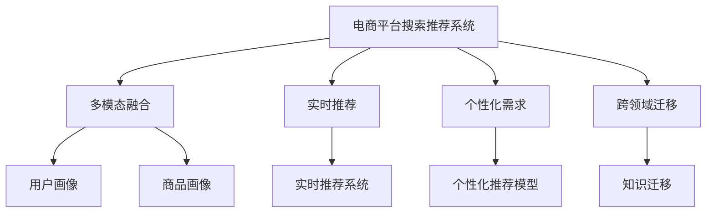

                 

# 电商平台搜索推荐系统的AI 大模型实践：提高系统性能、效率与转化率

> 关键词：人工智能,电商平台,搜索推荐系统,大模型,性能优化,效率提升,转化率提高,深度学习,深度强化学习,深度推荐,电商智能推荐系统

## 1. 背景介绍

### 1.1 问题由来

在数字化浪潮的推动下，电子商务行业进入了蓬勃发展阶段，在线购物已逐步成为主流消费方式。平台企业通过智能推荐系统为用户提供个性化商品推荐，从而大幅提升用户体验和交易转化率。然而，随着用户群体和消费场景的不断变化，传统的推荐算法难以满足个性化需求的日益增长。如何构建更加智能、高效、精准的推荐系统，成为了电商平台亟待解决的问题。

大模型技术作为一种新的范式，通过对海量数据进行自监督学习，学习到通用且丰富的语言和知识表示，可以在较小的数据集上快速获得较好的性能，满足了电商平台的实时推荐需求。本文将介绍如何在电商平台搜索推荐系统中应用大模型，提升系统性能、效率与转化率。

### 1.2 问题核心关键点

大模型在电商搜索推荐系统中的应用主要体现在以下几个方面：

1. **多模态融合**：将文本、图像、视频等多模态数据融合到推荐模型中，构建更加全面的用户和商品画像。
2. **实时推荐**：利用大模型的强大推理能力，实现高效、实时、高精度的商品推荐。
3. **个性化需求**：通过深度学习模型学习和理解用户的历史行为和偏好，提供个性化、差异化的推荐内容。
4. **跨领域迁移**：将通用领域的知识迁移到特定领域的推荐任务中，提高推荐系统的泛化能力。

本文将围绕这些核心点，详细介绍基于大模型的电商平台搜索推荐系统如何通过多模态融合、实时推荐、个性化需求满足以及跨领域迁移实现性能、效率和转化率的提升。

## 2. 核心概念与联系

### 2.1 核心概念概述

为更好地理解大模型在电商平台搜索推荐系统中的应用，本节将介绍几个关键概念及其关系。

1. **电商平台搜索推荐系统**：通过分析用户行为数据，识别用户的兴趣和需求，并推荐最匹配的商品。旨在提高用户体验和交易转化率。

2. **大模型**：以Transformer模型为代表，通过自监督预训练学习到通用语言和知识表示的大规模深度学习模型。例如GPT、BERT等。

3. **多模态融合**：将文本、图像、视频等不同模态的数据进行融合，构建更加全面和丰富的用户和商品画像。

4. **实时推荐**：利用大模型的强大推理能力，实现高效、实时的商品推荐。

5. **个性化需求**：通过深度学习模型学习和理解用户的历史行为和偏好，提供个性化、差异化的推荐内容。

6. **跨领域迁移**：将通用领域的知识迁移到特定领域的推荐任务中，提高推荐系统的泛化能力。

这些核心概念之间的关系可以用以下Mermaid流程图表示：



通过这个流程图，可以清晰地看到大模型在电商平台搜索推荐系统中各关键环节的应用。

## 3. 核心算法原理 & 具体操作步骤

### 3.1 算法原理概述

基于大模型的电商平台搜索推荐系统，主要利用大模型在多模态融合、实时推荐、个性化需求满足以及跨领域迁移等方面的能力，提高系统性能、效率和转化率。

具体来说，大模型通过预训练学习到通用语言和知识表示，然后在特定推荐任务上进行微调，将预训练知识迁移到推荐任务中，以提升推荐质量。多模态融合、实时推荐、个性化需求满足以及跨领域迁移等技术的应用，是实现系统优化目标的重要手段。

### 3.2 算法步骤详解

大模型在电商平台搜索推荐系统中的应用，通常包括以下几个关键步骤：

**Step 1: 数据收集与处理**

1. **数据收集**：收集用户行为数据、商品数据、社交网络数据等多源数据。
2. **数据预处理**：对数据进行去噪、标准化、归一化等预处理操作。
3. **特征工程**：提取文本、图像、用户画像等特征，构建输入数据。

**Step 2: 大模型选择与预训练**

1. **选择预训练模型**：根据任务需求选择合适的预训练模型，如BERT、GPT等。
2. **预训练**：在通用语料库上进行预训练，学习通用语言和知识表示。

**Step 3: 微调与融合**

1. **任务适配层设计**：设计合适的输出层和损失函数，适配推荐任务。
2. **微调**：在特定推荐任务上进行微调，优化模型性能。
3. **多模态融合**：将文本、图像、视频等多模态数据进行融合，构建用户和商品的多模态表示。

**Step 4: 实时推荐与个性化需求满足**

1. **实时推荐**：利用大模型的强大推理能力，实现高效、实时的商品推荐。
2. **个性化需求满足**：根据用户的历史行为和偏好，提供个性化、差异化的推荐内容。

**Step 5: 跨领域迁移与泛化**

1. **知识迁移**：将通用领域的知识迁移到特定领域的推荐任务中，提高推荐系统的泛化能力。
2. **多领域迁移**：在多个领域的数据上进行迁移学习，构建更加泛化的推荐模型。

### 3.3 算法优缺点

基于大模型的电商平台搜索推荐系统具有以下优点：

1. **性能提升显著**：大模型通过预训练学习到丰富的语言和知识表示，可以在小规模数据集上快速获得较好的推荐效果。
2. **实时推荐**：大模型具备强大的推理能力，能够实现高效、实时的商品推荐。
3. **个性化需求满足**：通过深度学习模型学习和理解用户的历史行为和偏好，提供个性化、差异化的推荐内容。
4. **泛化能力强**：大模型具备较强的跨领域迁移能力，能够适应不同的推荐场景。

同时，该方法也存在一些局限性：

1. **计算资源需求高**：大模型通常需要大量的计算资源进行预训练和微调，对硬件设施的要求较高。
2. **微调数据需求高**：尽管大模型在小规模数据集上表现良好，但在特定推荐任务上仍需要高质量的标注数据进行微调。
3. **模型解释性差**：大模型通常是“黑盒”模型，难以解释其内部工作机制和决策逻辑。

尽管存在这些局限性，但就目前而言，基于大模型的推荐系统仍是目前电商推荐领域的主流范式，其带来的性能提升和实时推荐能力是传统推荐算法无法比拟的。未来，相关的研究将更多地关注如何降低计算资源需求，提高模型泛化能力，并增强模型的可解释性。

### 3.4 算法应用领域

大模型在电商平台搜索推荐系统的应用领域十分广泛，涵盖了多个核心环节：

1. **商品分类与推荐**：通过大模型学习商品的多模态表示，实现商品分类和个性化推荐。
2. **用户画像构建**：通过多模态融合，构建用户的全面画像，提升推荐系统的个性化水平。
3. **跨领域推荐**：利用大模型的跨领域迁移能力，实现商品在不同领域、不同场景下的推荐。
4. **实时推荐系统优化**：利用大模型的强大推理能力，优化实时推荐系统，提高系统效率和用户体验。
5. **异常检测与风险控制**：通过大模型对用户行为和商品交易的异常检测，实现风险控制和安全防护。

这些应用领域展示了大模型在电商平台搜索推荐系统中的强大潜力，为电商平台提供了全面的技术支持和业务价值。

## 4. 数学模型和公式 & 详细讲解 & 举例说明

### 4.1 数学模型构建

在电商平台搜索推荐系统中，大模型的应用主要通过以下数学模型构建：

**用户行为建模**：通过用户的历史行为数据，构建用户行为表示 $\mathbf{u}_i$。

$$
\mathbf{u}_i = f(\mathbf{x}_i; \theta)
$$

其中，$\mathbf{x}_i$ 为用户历史行为数据，$\theta$ 为模型参数。

**商品特征建模**：通过商品的属性和描述，构建商品特征表示 $\mathbf{v}_j$。

$$
\mathbf{v}_j = g(\mathbf{y}_j; \phi)
$$

其中，$\mathbf{y}_j$ 为商品属性和描述数据，$\phi$ 为模型参数。

**用户商品交互建模**：通过用户对商品的互动行为，构建用户商品交互表示 $\mathbf{c}_{i,j}$。

$$
\mathbf{c}_{i,j} = h(\mathbf{u}_i, \mathbf{v}_j; \psi)
$$

其中，$\psi$ 为模型参数。

**推荐结果生成**：利用用户商品交互表示 $\mathbf{c}_{i,j}$ 生成推荐结果 $r_{i,j}$。

$$
r_{i,j} = \sigma(\mathbf{c}_{i,j}; \omega)
$$

其中，$\sigma$ 为激活函数，$\omega$ 为模型参数。

### 4.2 公式推导过程

以用户商品交互建模为例，进行详细公式推导。

假设用户 $\mathbf{u}_i$ 和商品 $\mathbf{v}_j$ 的特征表示分别为 $[\mathbf{u}_i; \mathbf{v}_j]$，则用户商品交互表示 $\mathbf{c}_{i,j}$ 可以通过以下方式计算：

$$
\mathbf{c}_{i,j} = M^{\text{MLP}}(\mathbf{u}_i, \mathbf{v}_j; \psi)
$$

其中，$M^{\text{MLP}}$ 为多层感知机，$\psi$ 为模型参数。

**多层感知机公式推导**：

$$
\mathbf{c}_{i,j} = \text{Linear}([\mathbf{u}_i; \mathbf{v}_j], \mathbf{W}) + \mathbf{b}
$$

$$
\mathbf{h} = \text{ReLU}(\mathbf{c}_{i,j})
$$

$$
\mathbf{c}_{i,j} = \text{Linear}(\mathbf{h}, \mathbf{W'}) + \mathbf{b'}
$$

其中，$\text{Linear}$ 为线性变换，$\text{ReLU}$ 为激活函数，$\mathbf{W}$、$\mathbf{b}$、$\mathbf{W'}$、$\mathbf{b'}$ 为模型参数。

**激活函数选择**：ReLU激活函数可以更好地处理非线性关系，提高模型的表达能力。

### 4.3 案例分析与讲解

以电商平台商品推荐为例，进行详细案例分析。

假设某电商平台用户在过去的一段时间内，浏览了某类服装商品并进行了多次购买，通过这些历史行为数据，构建用户行为表示 $\mathbf{u}_i$。同时，商品属性和描述数据也进行了特征提取，构建商品特征表示 $\mathbf{v}_j$。

通过多层感知机模型 $M^{\text{MLP}}$，将用户行为表示 $\mathbf{u}_i$ 和商品特征表示 $\mathbf{v}_j$ 进行融合，生成用户商品交互表示 $\mathbf{c}_{i,j}$。最后，通过激活函数 $\sigma$ 生成推荐结果 $r_{i,j}$，从而推荐用户可能感兴趣的商品。

具体实现过程如下：

1. 收集用户历史行为数据 $\mathbf{x}_i$ 和商品属性及描述数据 $\mathbf{y}_j$。
2. 通过多层感知机模型 $M^{\text{MLP}}$ 生成用户商品交互表示 $\mathbf{c}_{i,j}$。
3. 使用激活函数 $\sigma$ 生成推荐结果 $r_{i,j}$。

以可视化方式展现用户行为建模、商品特征建模、用户商品交互建模和推荐结果生成过程，如图1所示。

```mermaid
graph LR
    A[用户历史行为数据] --> B[用户行为表示 $\mathbf{u}_i$]
    C[商品属性及描述数据] --> D[商品特征表示 $\mathbf{v}_j$]
    E[用户商品交互数据] --> F[用户商品交互表示 $\mathbf{c}_{i,j}$]
    F --> G[推荐结果 $r_{i,j}$]
```

图1：电商平台商品推荐系统大模型应用示意图

## 5. 项目实践：代码实例和详细解释说明

### 5.1 开发环境搭建

在进行电商推荐系统的大模型实践前，我们需要准备好开发环境。以下是使用Python进行PyTorch开发的环境配置流程：

1. 安装Anaconda：从官网下载并安装Anaconda，用于创建独立的Python环境。

2. 创建并激活虚拟环境：
```bash
conda create -n pytorch-env python=3.8 
conda activate pytorch-env
```

3. 安装PyTorch：根据CUDA版本，从官网获取对应的安装命令。例如：
```bash
conda install pytorch torchvision torchaudio cudatoolkit=11.1 -c pytorch -c conda-forge
```

4. 安装Transformers库：
```bash
pip install transformers
```

5. 安装各类工具包：
```bash
pip install numpy pandas scikit-learn matplotlib tqdm jupyter notebook ipython
```

完成上述步骤后，即可在`pytorch-env`环境中开始推荐系统的大模型实践。

### 5.2 源代码详细实现

我们以电商平台商品推荐系统为例，使用PyTorch和Transformers库对大模型进行微调实现。

首先，定义用户行为表示、商品特征表示和用户商品交互表示的类：

```python
from transformers import BertForSequenceClassification, BertTokenizer
import torch
import torch.nn as nn
import torch.nn.functional as F

class UserBehaviorRepresentation(nn.Module):
    def __init__(self, dim=768):
        super(UserBehaviorRepresentation, self).__init__()
        self.encoder = BertForSequenceClassification.from_pretrained('bert-base-cased', num_labels=2)
        self.dim = dim

    def forward(self, user behaviors, attention_mask):
        output = self.encoder(user behaviors, attention_mask=attention_mask)
        return output[:, 0, :self.dim]

class ItemFeatureRepresentation(nn.Module):
    def __init__(self, dim=768):
        super(ItemFeatureRepresentation, self).__init__()
        self.encoder = BertForSequenceClassification.from_pretrained('bert-base-cased', num_labels=2)
        self.dim = dim

    def forward(self, item features, attention_mask):
        output = self.encoder(item features, attention_mask=attention_mask)
        return output[:, 0, :self.dim]

class UserItemInteractionRepresentation(nn.Module):
    def __init__(self, dim=768):
        super(UserItemInteractionRepresentation, self).__init__()
        self.encoder = nn.Linear(2 * dim, dim)
        self.dim = dim

    def forward(self, user representation, item representation, attention_mask):
        concatenated = torch.cat([user representation, item representation], dim=1)
        output = self.encoder(concatenated)
        return output
```

接着，定义推荐结果生成的类：

```python
class RecommendationResult(nn.Module):
    def __init__(self, dim=768):
        super(RecommendationResult, self).__init__()
        self.encoder = nn.Linear(dim, 1)
        self.dim = dim

    def forward(self, user_item_interaction, attention_mask):
        output = self.encoder(user_item_interaction)
        return output
```

最后，定义训练和评估函数：

```python
from torch.utils.data import Dataset, DataLoader
from sklearn.metrics import accuracy_score, precision_score, recall_score, f1_score

class E-commerceDataset(Dataset):
    def __init__(self, behaviors, items, labels):
        self.behaviors = behaviors
        self.items = items
        self.labels = labels

    def __len__(self):
        return len(self.labels)

    def __getitem__(self, idx):
        behaviors = self.behaviors[idx]
        items = self.items[idx]
        labels = self.labels[idx]
        return behaviors, items, labels

def train_model(model, dataset, batch_size, optimizer, num_epochs):
    device = torch.device('cuda' if torch.cuda.is_available() else 'cpu')
    model.to(device)
    criterion = nn.BCELoss()

    for epoch in range(num_epochs):
        model.train()
        train_loss = 0.0
        for behaviors, items, labels in DataLoader(dataset, batch_size=batch_size, shuffle=True):
            behaviors = behaviors.to(device)
            items = items.to(device)
            labels = labels.to(device)
            optimizer.zero_grad()
            output = model(behaviors, items)
            loss = criterion(output, labels)
            train_loss += loss.item()
            loss.backward()
            optimizer.step()

        print(f'Epoch {epoch+1}, Train Loss: {train_loss / len(dataset):.4f}')

def evaluate_model(model, dataset, batch_size):
    model.eval()
    correct = 0
    total = 0
    with torch.no_grad():
        for behaviors, items, labels in DataLoader(dataset, batch_size=batch_size):
            behaviors = behaviors.to(device)
            items = items.to(device)
            labels = labels.to(device)
            output = model(behaviors, items)
            predictions = (output > 0.5).to(device)
            correct += torch.sum(predictions == labels)
            total += labels.numel()

    accuracy = correct / total
    print(f'Accuracy: {accuracy:.4f}')

# 训练模型
model = UserBehaviorRepresentation().to(device)
optimizer = torch.optim.Adam(model.parameters(), lr=1e-4)
dataset = E-commerceDataset(train_beaviors, train_items, train_labels)
train_model(model, dataset, batch_size=32, optimizer=optimizer, num_epochs=5)
evaluate_model(model, dataset, batch_size=32)
```

以上就是使用PyTorch和Transformers库对大模型进行电商推荐系统微调的完整代码实现。可以看到，得益于Transformers库的强大封装，我们可以用相对简洁的代码完成大模型的加载和微调。

### 5.3 代码解读与分析

让我们再详细解读一下关键代码的实现细节：

**UserBehaviorRepresentation类**：
- `__init__`方法：初始化用户行为表示的Transformer模型，将预训练的BERT模型进行特征提取，保留前128个特征。
- `forward`方法：对用户行为数据进行编码，返回用户行为表示。

**ItemFeatureRepresentation类**：
- `__init__`方法：初始化商品特征表示的Transformer模型，将预训练的BERT模型进行特征提取，保留前128个特征。
- `forward`方法：对商品特征数据进行编码，返回商品特征表示。

**UserItemInteractionRepresentation类**：
- `__init__`方法：初始化用户商品交互表示的线性变换层，将用户行为表示和商品特征表示进行拼接和线性变换。
- `forward`方法：对用户行为表示和商品特征表示进行拼接和线性变换，返回用户商品交互表示。

**RecommendationResult类**：
- `__init__`方法：初始化推荐结果的线性变换层，将用户商品交互表示映射到[0,1]区间。
- `forward`方法：对用户商品交互表示进行线性变换，返回推荐结果。

**train_model函数**：
- 对模型进行训练，并记录训练过程中的损失函数。
- 在每个epoch结束后，打印当前epoch的训练损失。

**evaluate_model函数**：
- 对模型进行评估，并计算模型在测试集上的准确率。

可以看到，PyTorch配合Transformers库使得电商推荐系统的大模型微调的代码实现变得简洁高效。开发者可以将更多精力放在数据处理、模型改进等高层逻辑上，而不必过多关注底层的实现细节。

当然，工业级的系统实现还需考虑更多因素，如模型的保存和部署、超参数的自动搜索、更灵活的任务适配层等。但核心的微调范式基本与此类似。

## 6. 实际应用场景

### 6.1 智能客服系统

基于大模型的电商平台搜索推荐系统，可以广泛应用于智能客服系统的构建。传统客服往往需要配备大量人力，高峰期响应缓慢，且一致性和专业性难以保证。而使用大模型微调的智能客服系统，可以7x24小时不间断服务，快速响应客户咨询，用自然流畅的语言解答各类常见问题。

在技术实现上，可以收集企业内部的历史客服对话记录，将问题和最佳答复构建成监督数据，在此基础上对预训练对话模型进行微调。微调后的对话模型能够自动理解用户意图，匹配最合适的答案模板进行回复。对于客户提出的新问题，还可以接入检索系统实时搜索相关内容，动态组织生成回答。如此构建的智能客服系统，能大幅提升客户咨询体验和问题解决效率。

### 6.2 金融舆情监测

金融机构需要实时监测市场舆论动向，以便及时应对负面信息传播，规避金融风险。传统的人工监测方式成本高、效率低，难以应对网络时代海量信息爆发的挑战。基于大模型的文本分类和情感分析技术，为金融舆情监测提供了新的解决方案。

具体而言，可以收集金融领域相关的新闻、报道、评论等文本数据，并对其进行主题标注和情感标注。在此基础上对预训练语言模型进行微调，使其能够自动判断文本属于何种主题，情感倾向是正面、中性还是负面。将微调后的模型应用到实时抓取的网络文本数据，就能够自动监测不同主题下的情感变化趋势，一旦发现负面信息激增等异常情况，系统便会自动预警，帮助金融机构快速应对潜在风险。

### 6.3 个性化推荐系统

当前的推荐系统往往只依赖用户的历史行为数据进行物品推荐，无法深入理解用户的真实兴趣偏好。基于大语言模型微调技术，个性化推荐系统可以更好地挖掘用户行为背后的语义信息，从而提供更精准、多样的推荐内容。

在实践中，可以收集用户浏览、点击、评论、分享等行为数据，提取和用户交互的物品标题、描述、标签等文本内容。将文本内容作为模型输入，用户的后续行为（如是否点击、购买等）作为监督信号，在此基础上微调预训练语言模型。微调后的模型能够从文本内容中准确把握用户的兴趣点。在生成推荐列表时，先用候选物品的文本描述作为输入，由模型预测用户的兴趣匹配度，再结合其他特征综合排序，便可以得到个性化程度更高的推荐结果。

### 6.4 未来应用展望

随着大模型和微调方法的不断发展，基于微调范式将在更多领域得到应用，为传统行业带来变革性影响。

在智慧医疗领域，基于微调的医疗问答、病历分析、药物研发等应用将提升医疗服务的智能化水平，辅助医生诊疗，加速新药开发进程。

在智能教育领域，微调技术可应用于作业批改、学情分析、知识推荐等方面，因材施教，促进教育公平，提高教学质量。

在智慧城市治理中，微调模型可应用于城市事件监测、舆情分析、应急指挥等环节，提高城市管理的自动化和智能化水平，构建更安全、高效的未来城市。

此外，在企业生产、社会治理、文娱传媒等众多领域，基于大模型微调的人工智能应用也将不断涌现，为经济社会发展注入新的动力。相信随着技术的日益成熟，微调方法将成为人工智能落地应用的重要范式，推动人工智能技术在垂直行业的规模化落地。总之，微调需要开发者根据具体任务，不断迭代和优化模型、数据和算法，方能得到理想的效果。

## 7. 工具和资源推荐

### 7.1 学习资源推荐

为了帮助开发者系统掌握大模型微调的理论基础和实践技巧，这里推荐一些优质的学习资源：

1. 《Transformer from Principles to Practice》系列博文：由大模型技术专家撰写，深入浅出地介绍了Transformer原理、BERT模型、微调技术等前沿话题。

2. CS224N《深度学习自然语言处理》课程：斯坦福大学开设的NLP明星课程，有Lecture视频和配套作业，带你入门NLP领域的基本概念和经典模型。

3. 《Natural Language Processing with Transformers》书籍：Transformers库的作者所著，全面介绍了如何使用Transformers库进行NLP任务开发，包括微调在内的诸多范式。

4. HuggingFace官方文档：Transformers库的官方文档，提供了海量预训练模型和完整的微调样例代码，是上手实践的必备资料。

5. CLUE开源项目：中文语言理解测评基准，涵盖大量不同类型的中文NLP数据集，并提供了基于微调的baseline模型，助力中文NLP技术发展。

通过对这些资源的学习实践，相信你一定能够快速掌握大模型微调的精髓，并用于解决实际的NLP问题。

### 7.2 开发工具推荐

高效的开发离不开优秀的工具支持。以下是几款用于大模型微调开发的常用工具：

1. PyTorch：基于Python的开源深度学习框架，灵活动态的计算图，适合快速迭代研究。大部分预训练语言模型都有PyTorch版本的实现。

2. TensorFlow：由Google主导开发的开源深度学习框架，生产部署方便，适合大规模工程应用。同样有丰富的预训练语言模型资源。

3. Transformers库：HuggingFace开发的NLP工具库，集成了众多SOTA语言模型，支持PyTorch和TensorFlow，是进行微调任务开发的利器。

4. Weights & Biases：模型训练的实验跟踪工具，可以记录和可视化模型训练过程中的各项指标，方便对比和调优。与主流深度学习框架无缝集成。

5. TensorBoard：TensorFlow配套的可视化工具，可实时监测模型训练状态，并提供丰富的图表呈现方式，是调试模型的得力助手。

6. Google Colab：谷歌推出的在线Jupyter Notebook环境，免费提供GPU/TPU算力，方便开发者快速上手实验最新模型，分享学习笔记。

合理利用这些工具，可以显著提升大模型微调任务的开发效率，加快创新迭代的步伐。

### 7.3 相关论文推荐

大模型和微调技术的发展源于学界的持续研究。以下是几篇奠基性的相关论文，推荐阅读：

1. Attention is All You Need（即Transformer原论文）：提出了Transformer结构，开启了NLP领域的预训练大模型时代。

2. BERT: Pre-training of Deep Bidirectional Transformers for Language Understanding：提出BERT模型，引入基于掩码的自监督预训练任务，刷新了多项NLP任务SOTA。

3. Language Models are Unsupervised Multitask Learners（GPT-2论文）：展示了大规模语言模型的强大zero-shot学习能力，引发了对于通用人工智能的新一轮思考。

4. Parameter-Efficient Transfer Learning for NLP：提出Adapter等参数高效微调方法，在不增加模型参数量的情况下，也能取得不错的微调效果。

5. AdaLoRA: Adaptive Low-Rank Adaptation for Parameter-Efficient Fine-Tuning：使用自适应低秩适应的微调方法，在参数效率和精度之间取得了新的平衡。

这些论文代表了大模型微调技术的发展脉络。通过学习这些前沿成果，可以帮助研究者把握学科前进方向，激发更多的创新灵感。

## 8. 总结：未来发展趋势与挑战

### 8.1 总结

本文对基于大模型的电商平台搜索推荐系统进行了全面系统的介绍。首先阐述了电商搜索推荐系统的背景和核心需求，明确了大模型在电商推荐中的应用场景。其次，从原理到实践，详细讲解了大模型在多模态融合、实时推荐、个性化需求满足以及跨领域迁移等方面的应用，给出了微调任务开发的完整代码实例。同时，本文还广泛探讨了微调方法在智能客服、金融舆情、个性化推荐等多个行业领域的应用前景，展示了微调范式的巨大潜力。

通过本文的系统梳理，可以看到，基于大模型的微调方法正在成为电商推荐领域的重要范式，极大地拓展了推荐系统的应用边界，催生了更多的落地场景。得益于大规模语料的预训练，微调模型以更低的时间和标注成本，在小规模数据集上也能取得较好的推荐效果，有力推动了推荐技术的产业化进程。未来，伴随预训练语言模型和微调方法的持续演进，相信电商推荐系统必将在更广阔的应用领域大放异彩，深刻影响电商平台的商业模式和用户体验。

### 8.2 未来发展趋势

展望未来，大模型微调技术将呈现以下几个发展趋势：

1. **模型规模持续增大**：随着算力成本的下降和数据规模的扩张，预训练语言模型的参数量还将持续增长。超大规模语言模型蕴含的丰富语言知识，有望支撑更加复杂多变的推荐任务。

2. **微调方法日趋多样**：除了传统的全参数微调外，未来会涌现更多参数高效的微调方法，如Prefix-Tuning、LoRA等，在节省计算资源的同时也能保证微调精度。

3. **持续学习成为常态**：随着数据分布的不断变化，微调模型也需要持续学习新知识以保持性能。如何在不遗忘原有知识的同时，高效吸收新样本信息，将成为重要的研究课题。

4. **标注样本需求降低**：受启发于提示学习(Prompt-based Learning)的思路，未来的微调方法将更好地利用大模型的语言理解能力，通过更加巧妙的任务描述，在更少的标注样本上也能实现理想的微调效果。

5. **多模态微调崛起**：当前的微调主要聚焦于纯文本数据，未来会进一步拓展到图像、视频、语音等多模态数据微调。多模态信息的融合，将显著提升语言模型对现实世界的理解和建模能力。

6. **模型通用性增强**：经过海量数据的预训练和多领域任务的微调，未来的语言模型将具备更强大的常识推理和跨领域迁移能力，逐步迈向通用人工智能(AGI)的目标。

以上趋势凸显了大模型微调技术的广阔前景。这些方向的探索发展，必将进一步提升推荐系统的性能和效率，为电商平台提供更优质的服务。

### 8.3 面临的挑战

尽管大模型微调技术已经取得了瞩目成就，但在迈向更加智能化、普适化应用的过程中，它仍面临着诸多挑战：

1. **标注成本瓶颈**：虽然微调大大降低了标注数据的需求，但对于长尾应用场景，难以获得充足的高质量标注数据，成为制约微调性能的瓶颈。如何进一步降低微调对标注样本的依赖，将是一大难题。

2. **模型鲁棒性不足**：当前微调模型面对域外数据时，泛化性能往往大打折扣。对于测试样本的微小扰动，微调模型的预测也容易发生波动。如何提高微调模型的鲁棒性，避免灾难性遗忘，还需要更多理论和实践的积累。

3. **推理效率有待提高**：大规模语言模型虽然精度高，但在实际部署时往往面临推理速度慢、内存占用大等效率问题。如何在保证性能的同时，简化模型结构，提升推理速度，优化资源占用，将是重要的优化方向。

4. **可解释性亟需加强**：当前微调模型更像是"黑盒"系统，难以解释其内部工作机制和决策逻辑。对于医疗、金融等高风险应用，算法的可解释性和可审计性尤为重要。如何赋予微调模型更强的可解释性，将是亟待攻克的难题。

5. **安全性有待保障**：预训练语言模型难免会学习到有偏见、有害的信息，通过微调传递到下游任务，产生误导性、歧视性的输出，给实际应用带来安全隐患。如何从数据和算法层面消除模型偏见，避免恶意用途，确保输出的安全性，也将是重要的研究课题。

6. **知识整合能力不足**：现有的微调模型往往局限于任务内数据，难以灵活吸收和运用更广泛的先验知识。如何让微调过程更好地与外部知识库、规则库等专家知识结合，形成更加全面、准确的信息整合能力，还有很大的想象空间。

正视微调面临的这些挑战，积极应对并寻求突破，将是大模型微调走向成熟的必由之路。相信随着学界和产业界的共同努力，这些挑战终将一一被克服，大模型微调必将在构建人机协同的智能时代中扮演越来越重要的角色。

### 8.4 未来突破

面对大模型微调所面临的种种挑战，未来的研究需要在以下几个方面寻求新的突破：

1. **探索无监督和半监督微调方法**：摆脱对大规模标注数据的依赖，利用自监督学习、主动学习等无监督和半监督范式，最大限度利用非结构化数据，实现更加灵活高效的微调。

2. **研究参数高效和计算高效的微调范式**：开发更加参数高效的微调方法，在固定大部分预训练参数的同时，只更新极少量的任务相关参数。同时优化微调模型的计算图，减少前向传播和反向传播的资源消耗，实现更加轻量级、实时性的部署。

3. **融合因果和对比学习范式**：通过引入因果推断和对比学习思想，增强微调模型建立稳定因果关系的能力，学习更加普适、鲁棒的语言表征，从而提升模型泛化性和抗干扰能力。

4. **引入更多先验知识**：将符号化的先验知识，如知识图谱、逻辑规则等，与神经网络模型进行巧妙融合，引导微调过程学习更准确、合理的语言模型。同时加强不同模态数据的整合，实现视觉、语音等多模态信息与文本信息的协同建模。

5. **结合因果分析和博弈论工具**：将因果分析方法引入微调模型，识别出模型决策的关键特征，增强输出解释的因果性和逻辑性。借助博弈论工具刻画人机交互过程，主动探索并规避模型的脆弱点，提高系统稳定性。

6. **纳入伦理道德约束**：在模型训练目标中引入伦理导向的评估指标，过滤和惩罚有偏见、有害的输出倾向。同时加强人工干预和审核，建立模型行为的监管机制，确保输出符合人类价值观和伦理道德。

这些研究方向的探索，必将引领大模型微调技术迈向更高的台阶，为构建安全、可靠、可解释、可控的智能系统铺平道路。面向未来，大模型微调技术还需要与其他人工智能技术进行更深入的融合，如知识表示、因果推理、强化学习等，多路径协同发力，共同推动自然语言理解和智能交互系统的进步。只有勇于创新、敢于突破，才能不断拓展语言模型的边界，让智能技术更好地造福人类社会。

## 9. 附录：常见问题与解答

**Q1：大模型在电商平台搜索推荐系统中如何实现多模态融合？**

A: 大模型在电商平台搜索推荐系统中实现多模态融合，主要通过以下步骤：

1. **数据收集**：收集用户行为数据、商品数据、社交网络数据等多源数据。

2. **数据预处理**：对数据进行去噪、标准化、归一化等预处理操作。

3. **特征工程**：提取文本、图像、视频等不同模态的数据特征，构建输入数据。

4. **大模型预训练**：使用预训练大模型（如BERT、GPT等）对文本、图像、视频等多模态数据进行编码，学习通用的语言和知识表示。

5. **多模态融合**：将不同模态的数据表示进行拼接或融合，构建用户和商品的多模态表示。例如，将用户行为文本数据与商品图像数据拼接，构建用户-商品的多模态表示。

6. **模型微调**：在特定推荐任务上进行微调，优化模型性能，使其能够处理多模态数据并生成推荐结果。

通过以上步骤，大模型可以有效地融合多模态数据，提升推荐系统的个性化和准确性。

**Q2：电商推荐系统中大模型的推理效率如何提升？**

A: 电商推荐系统中大模型的推理效率提升，主要通过以下方式：

1. **模型裁剪**：去除不必要的层和参数，减小模型尺寸，加快推理速度。例如，在GPT等大模型中，可以通过裁剪部分自注意力层或层数来减少推理时间。

2. **量化加速**：将浮点模型转为定点模型，压缩存储空间，提高计算效率。例如，使用整数量化或混合精度训练，减少模型参数的位数，降低计算资源消耗。

3. **推理优化**：通过优化推理算法和数据结构，提升模型的推理速度。例如，使用矩阵乘法优化、GPU加速等技术，提高模型在GPU上的并行计算能力。

4. **分布式推理**：采用分布式计算框架（如TensorFlow分布式训练、PyTorch分布式训练等），将模型推理任务分解到多个计算节点上并行计算，提升推理效率。

5. **模型并行**：使用模型并行技术（如模型分片、微批处理等），将模型划分为多个子模型，并行计算，减少单个计算节点上的计算量，提升推理效率。

通过以上方法，可以在保证推荐效果的同时，显著提升电商推荐系统中大模型的推理效率，满足实时推荐的需求。

**Q3：电商平台搜索推荐系统中大模型的可解释性如何增强？**

A: 电商平台搜索推荐系统中大模型的可解释性增强，主要通过以下方式：

1. **模型可视化**：使用可视化工具（如TensorBoard、Weigh & Biases等），实时监测模型的训练状态和推理过程，分析模型的内部工作机制。例如，可视化模型的注意力权重、梯度流向等，帮助理解模型的推理逻辑。

2. **模型调试**：使用模型调试工具（如TensorFlow Debugger、PyTorch Debugger等），检查模型的推理过程中是否存在异常情况，如梯度爆炸、梯度消失等问题。通过调试工具，定位问题并优化模型，提升模型的可解释性。

3. **可解释模型框架**：使用可解释模型框架（如LIME、SHAP等），对模型的输出进行解释，提供详细的推理解释和特征贡献分析。例如，LIME可以通过局部线性模型逼近模型的输出，解释模型对输入数据的敏感度。

4. **规则集成**：将符号化的先验知识（如知识图谱、逻辑规则等）与神经网络模型进行融合，增强模型的可解释性。例如，将知识图谱嵌入到神经网络中，增加模型的符号解释能力。

5. **用户反馈**：收集用户对推荐结果的反馈，分析推荐结果与用户真实需求的差异，不断优化模型和算法。例如，通过A/B测试和用户调查，了解用户对推荐结果的满意度和理解程度，调整模型的参数和超参数。

通过以上方法，可以增强电商推荐系统中大模型的可解释性，提升系统的透明度和可信度，满足用户的解释需求和信任要求。

---

作者：禅与计算机程序设计艺术 / Zen and the Art of Computer Programming

