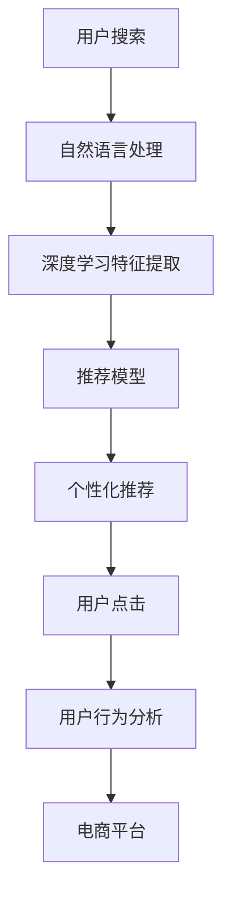

                 

# 电商平台搜索推荐系统的AI 大模型应用：提高转化率、用户忠诚度与盈利

> 关键词：电商搜索推荐系统、AI大模型、自然语言处理(NLP)、深度学习、推荐系统、商品推荐、用户行为分析、个性化推荐、用户忠诚度、平台盈利

## 1. 背景介绍

### 1.1 问题由来
在现代电子商务环境中，电商平台每天需要处理数以亿计的搜索请求和点击行为。如何高效精准地向用户推荐其感兴趣的商品，提升用户体验和转化率，成为电商系统设计的核心挑战之一。传统推荐算法大多基于用户历史行为数据进行推荐，难以应对用户瞬息万变的浏览需求和跨平台行为。

人工智能大模型技术的发展，为电商平台搜索推荐系统带来了新的机遇。通过预训练和微调AI大模型，可以全面融合用户行为数据和商品属性信息，实现更深层次的理解和更准确的推荐。本文将聚焦于电商平台搜索推荐系统，探讨AI大模型的应用，以期提高转化率、增强用户忠诚度，并提升平台的盈利能力。

### 1.2 问题核心关键点
AI大模型在电商平台搜索推荐系统中的应用，主要集中在以下关键点：

1. **全面理解用户需求**：通过大模型对用户输入的查询、浏览、点击等行为进行分析，了解用户的潜在兴趣和需求。
2. **精准匹配商品信息**：利用大模型对商品属性、描述、评论等信息进行语义处理，匹配用户的搜索意图和需求。
3. **动态生成个性化推荐**：在实时数据驱动下，大模型能够动态生成个性化的商品推荐，提高用户体验。
4. **增强用户满意度**：通过精准推荐提升用户满意度和忠诚度，减少流失率，增强平台的长期盈利能力。

## 2. 核心概念与联系

### 2.1 核心概念概述

要深入理解电商平台搜索推荐系统的大模型应用，首先需要明确一些核心概念：

- **AI大模型(AI Large Models)**：指基于深度学习架构、参数量达数亿甚至数十亿的大规模预训练模型，如BERT、GPT、T5等。这些模型经过大规模语料预训练，具备强大的语义理解能力和多模态融合能力。
- **推荐系统(Recommendation System)**：通过算法推荐系统向用户展示相关商品或内容，以提升用户体验和平台收益。推荐系统的主要任务包括召回和排序。
- **搜索系统(Search System)**：允许用户通过查询获取相关信息。电商平台的搜索系统通过用户输入的关键词，找到相关商品。
- **自然语言处理(NLP)**：一种人工智能技术，关注如何使计算机理解和处理人类语言，包括文本分类、情感分析、命名实体识别、语义匹配等。
- **深度学习(Deep Learning)**：一种机器学习方法，通过多层神经网络进行特征提取和分类。深度学习在电商平台推荐系统中被广泛应用。

这些核心概念相互关联，共同构成了电商平台搜索推荐系统的大模型应用框架。NLP技术帮助大模型理解用户和商品的语义信息，深度学习提供强大的特征提取和分类能力，而推荐系统则负责精准匹配用户需求和商品信息，从而实现高效推荐。

### 2.2 核心概念原理和架构的 Mermaid 流程图(Mermaid 流程节点中不要有括号、逗号等特殊字符)



这个流程图展示了电商平台搜索推荐系统的主要流程。用户通过搜索获取相关商品，NLP和大模型对用户输入进行分析，深度学习模型提取用户和商品特征，推荐系统进行召回和排序，最终生成个性化推荐，用户行为分析持续优化模型。

## 3. 核心算法原理 & 具体操作步骤

### 3.1 算法原理概述

基于AI大模型的电商平台搜索推荐系统，本质上是一种基于用户历史行为数据的深度学习推荐模型。其核心思想是利用大模型的强大语义理解和特征提取能力，结合用户行为数据，动态生成个性化推荐。

具体而言，算法步骤如下：

1. **数据准备**：收集用户历史搜索记录、点击行为、评价、收藏等数据，作为训练集。
2. **模型预训练**：在大规模无标签文本语料上，使用自监督学习任务对AI大模型进行预训练，使其具备语言理解和生成能力。
3. **任务适配层设计**：根据推荐任务设计合适的输出层和损失函数。
4. **微调**：在预训练模型的基础上，使用用户行为数据进行微调，优化推荐模型。
5. **推荐生成**：对用户输入的搜索词进行语义分析，根据模型输出生成个性化推荐。

### 3.2 算法步骤详解

#### 3.2.1 数据准备

在数据准备阶段，我们需要收集用户的历史搜索和行为数据，构建训练集和测试集。数据应该包括以下关键信息：

- **用户ID**：唯一标识用户。
- **搜索词**：用户输入的关键词。
- **点击记录**：用户点击浏览过的商品ID。
- **评价记录**：用户对商品的评价。
- **收藏记录**：用户收藏的商品ID。

收集到的数据需要进行清洗和标注，以消除噪音和处理缺失值。同时，需要将用户ID和商品ID进行归一化处理，以便于模型的训练和推理。

#### 3.2.2 模型预训练

模型预训练的目的是在大规模语料上，通过自监督学习任务训练大模型，使其具备语言理解和生成能力。常用的预训练任务包括：

- **语言建模**：预测下一个单词或句子，使得模型能够理解语言的基本规律。
- **掩码语言模型**：通过遮盖某些单词，让模型预测被遮盖的单词，增强其语义理解能力。
- **序列分类**：将一段文本分类为特定的类别，如垃圾邮件分类、情感分类等。
- **实体识别**：识别文本中的实体，如人名、地名、机构名等。

预训练模型可以是Bert、GPT、T5等，这些模型在语料库上进行了大规模的预训练，已经具备强大的语言处理能力。预训练模型在电商平台的语料库上进行微调，可以更快地适应电商场景下的语义特征和商品信息。

#### 3.2.3 任务适配层设计

任务适配层是连接预训练模型和大模型微调的桥梁。根据推荐任务的特点，适配层可以设计为：

- **分类任务**：如商品类别、评分等。适配层通常包括一个全连接层和一个softmax层，用于分类输出。
- **回归任务**：如商品的评分预测。适配层通常包括一个线性回归层，用于连续值输出。
- **排序任务**：如商品的点击率预测。适配层通常包括一个sigmoid层，用于二分类输出。

适配层的损失函数通常为交叉熵损失、均方误差损失等，根据任务类型进行选择。

#### 3.2.4 微调

微调是训练模型的关键步骤，其目的是在预训练模型的基础上，利用电商平台的标注数据，进一步优化模型。微调过程中需要注意以下关键点：

1. **学习率设定**：由于微调是针对特定任务的优化，学习率通常要比预训练时小，以避免破坏预训练权重。
2. **正则化技术**：如L2正则、Dropout等，防止模型过拟合。
3. **数据增强**：如回译、同义词替换等，增加数据多样性。
4. **对抗训练**：引入对抗样本，提高模型的鲁棒性。
5. **模型压缩**：减少模型参数，提升推理速度。

#### 3.2.5 推荐生成

推荐生成阶段，模型根据用户输入的搜索词进行语义分析，生成个性化推荐。具体流程如下：

1. **搜索词编码**：使用大模型对用户输入的搜索词进行编码，得到用户需求的语义表示。
2. **商品编码**：使用大模型对商品属性、描述、评论等信息进行编码，得到商品语义表示。
3. **相似度计算**：计算用户和商品之间的语义相似度，得到候选商品列表。
4. **排序**：根据相似度对候选商品进行排序，得到最终推荐列表。

推荐生成的过程需要考虑以下几个关键因素：

- **实时性**：推荐系统需要实时响应，因此推荐生成的过程需要快速计算。
- **个性化**：推荐需要根据用户的行为数据，动态生成个性化的推荐结果。
- **多样性**：推荐结果需要多样化，避免单一化。

### 3.3 算法优缺点

#### 3.3.1 优点

1. **全面理解用户需求**：大模型可以综合理解用户输入的查询、浏览、点击等行为，预测用户的潜在需求。
2. **精准匹配商品信息**：大模型能够处理商品的多模态信息，如图片、文本、视频等，全面匹配用户需求。
3. **动态生成个性化推荐**：大模型可以在实时数据驱动下，动态生成个性化的推荐结果，提高用户体验。
4. **提高转化率**：通过精准推荐，用户点击购买的可能性更高，平台转化率得到提升。
5. **增强用户忠诚度**：高质量的推荐服务可以增强用户满意度，提升平台忠诚度。
6. **提升平台盈利能力**：通过精准推荐，提升用户购买率和复购率，平台盈利能力得到增强。

#### 3.3.2 缺点

1. **数据依赖性强**：大模型需要大量的标注数据进行微调，数据标注成本高。
2. **模型复杂度高**：大模型参数量庞大，对计算资源和存储资源需求高。
3. **解释性差**：大模型的推荐过程缺乏可解释性，难以调试和优化。
4. **容易受到用户行为偏差影响**：如果用户历史行为数据有偏差，推荐结果可能受到影响。

## 4. 数学模型和公式 & 详细讲解 & 举例说明

### 4.1 数学模型构建

假设电商平台有 $N$ 个用户，每个用户有 $D$ 个历史行为数据，每个行为数据包括搜索词 $x_i$、点击记录 $y_i$ 和商品属性 $z_i$。设 $M_{\theta}$ 为预训练大模型，其中 $\theta$ 为模型参数。任务适配层输出商品推荐概率 $p(y_i|x_i,z_i)$。

目标是最小化预测概率与真实标签之间的交叉熵损失，即：

$$
\min_{\theta} \frac{1}{N} \sum_{i=1}^N \sum_{k=1}^D - y_i \log p(y_i|x_i,z_i)
$$

### 4.2 公式推导过程

以二分类任务为例，推导交叉熵损失函数及其梯度计算公式。

设模型 $M_{\theta}$ 在输入 $(x_i,z_i)$ 上的输出为 $p(y_i=1|x_i,z_i)$，则二分类交叉熵损失函数为：

$$
\ell(M_{\theta}(x_i,z_i),y_i) = -y_i \log p(y_i=1|x_i,z_i) - (1-y_i) \log (1-p(y_i=1|x_i,z_i))
$$

将其代入经验风险公式，得：

$$
\mathcal{L}(\theta) = \frac{1}{N} \sum_{i=1}^N \sum_{k=1}^D \ell(M_{\theta}(x_i,z_i),y_i)
$$

根据链式法则，损失函数对参数 $\theta_k$ 的梯度为：

$$
\frac{\partial \mathcal{L}(\theta)}{\partial \theta_k} = \frac{1}{N} \sum_{i=1}^N \sum_{k=1}^D [\frac{y_i}{p(y_i=1|x_i,z_i)} - (1-y_i)\frac{1-p(y_i=1|x_i,z_i)}{1-p(y_i=1|x_i,z_i)}] \frac{\partial p(y_i=1|x_i,z_i)}{\partial \theta_k}
$$

其中 $\frac{\partial p(y_i=1|x_i,z_i)}{\partial \theta_k}$ 可通过反向传播算法高效计算。

### 4.3 案例分析与讲解

以电商平台中的商品推荐为例，分析模型的训练和推理过程。

假设用户输入搜索词为 "华为手机"，电商平台需要推荐相关的商品。具体步骤如下：

1. **搜索词编码**：使用大模型对 "华为手机" 进行编码，得到用户需求的语义表示 $x'$。
2. **商品编码**：使用大模型对所有商品的属性、描述、评论等信息进行编码，得到所有商品的语义表示 $z'$。
3. **相似度计算**：计算用户需求 $x'$ 和商品语义表示 $z'$ 之间的余弦相似度，得到候选商品列表。
4. **排序**：对候选商品进行排序，得到最终的推荐列表。

模型训练时，可以使用多任务学习框架，将搜索词分类、商品评分预测等任务融合在一起进行训练。训练过程中，模型会根据用户的点击记录进行负采样，构建负样本池。例如，对于 "华为手机" 的搜索结果，模型不仅会关注点击的商品，还会关注类似但不同的商品。这样可以提高模型的泛化能力和推荐质量。

## 5. 项目实践：代码实例和详细解释说明

### 5.1 开发环境搭建

在进行大模型微调实践前，我们需要准备好开发环境。以下是使用Python进行TensorFlow开发的环境配置流程：

1. 安装Anaconda：从官网下载并安装Anaconda，用于创建独立的Python环境。

2. 创建并激活虚拟环境：
```bash
conda create -n tf-env python=3.8 
conda activate tf-env
```

3. 安装TensorFlow：根据CUDA版本，从官网获取对应的安装命令。例如：
```bash
conda install tensorflow -c conda-forge
```

4. 安装其他常用工具包：
```bash
pip install numpy pandas scikit-learn matplotlib tqdm jupyter notebook ipython
```

完成上述步骤后，即可在`tf-env`环境中开始大模型微调实践。

### 5.2 源代码详细实现

下面我们以电商平台中的商品推荐任务为例，给出使用TensorFlow对大模型进行微调的Python代码实现。

首先，定义任务适配层：

```python
import tensorflow as tf
from tensorflow.keras.layers import Dense, Dropout, Embedding, Flatten
from tensorflow.keras.models import Model

class RecommenderModel(tf.keras.Model):
    def __init__(self, embedding_dim=256, num_classes=2):
        super(RecommenderModel, self).__init__()
        
        self.embedding = Embedding(input_dim=vocab_size, output_dim=embedding_dim)
        self.flatten = Flatten()
        self.dropout = Dropout(rate=0.5)
        self.fc1 = Dense(units=128, activation='relu')
        self.fc2 = Dense(units=num_classes, activation='sigmoid')
        
    def call(self, inputs):
        x = self.embedding(inputs)
        x = self.flatten(x)
        x = self.dropout(x)
        x = self.fc1(x)
        x = self.fc2(x)
        return x
```

然后，定义数据处理函数：

```python
import pandas as pd
from tensorflow.keras.preprocessing.text import Tokenizer
from tensorflow.keras.preprocessing.sequence import pad_sequences

train_data = pd.read_csv('train.csv')
test_data = pd.read_csv('test.csv')

# 定义分词器
tokenizer = Tokenizer()
tokenizer.fit_on_texts(train_data['query'].tolist())

# 将查询文本转化为token序列
train_sequences = tokenizer.texts_to_sequences(train_data['query'].tolist())
test_sequences = tokenizer.texts_to_sequences(test_data['query'].tolist())

# 对序列进行padding，使长度一致
max_len = max([len(seq) for seq in train_sequences])
train_data_padded = pad_sequences(train_sequences, maxlen=max_len)
test_data_padded = pad_sequences(test_sequences, maxlen=max_len)

# 将类别标签转化为one-hot编码
train_labels = pd.get_dummies(train_data['label'], prefix='label', drop_first=True)
test_labels = pd.get_dummies(test_data['label'], prefix='label', drop_first=True)
```

接着，加载预训练模型和预训练参数：

```python
from transformers import TFAutoModel

pretrained_model = TFAutoModel.from_pretrained('bert-base-cased')
pretrained_model.load_weights('bert-base-cased')
```

最后，进行模型微调：

```python
# 构建模型
model = RecommenderModel()
model.compile(optimizer=tf.keras.optimizers.Adam(learning_rate=2e-5),
              loss=tf.keras.losses.BinaryCrossentropy(from_logits=True),
              metrics=['accuracy'])

# 训练模型
model.fit(x=train_data_padded, y=train_labels, epochs=5, batch_size=32, validation_data=(test_data_padded, test_labels))
```

以上就是使用TensorFlow对大模型进行商品推荐任务微调的完整代码实现。可以看到，TensorFlow结合了深度学习模型的强大封装和易用性，使得大模型的微调实践变得高效便捷。

### 5.3 代码解读与分析

让我们再详细解读一下关键代码的实现细节：

**RecommenderModel类**：
- `__init__`方法：初始化嵌入层、全连接层、输出层等关键组件。
- `call`方法：定义前向传播过程，包括嵌入层、扁平化、dropout层、全连接层和输出层。

**train_data和test_data数据处理函数**：
- 加载训练集和测试集数据。
- 使用Tokenizer将查询文本转化为token序列，并进行padding。
- 使用pd.get_dummies将类别标签转化为one-hot编码。

**预训练模型加载**：
- 通过Transformers库加载预训练的BERT模型，并恢复预训练参数。

**模型训练**：
- 使用Adam优化器进行模型训练。
- 定义交叉熵损失函数和准确率指标。
- 设置训练轮数和批大小。
- 在验证集上进行模型评估。

可以看到，TensorFlow和Transformers库结合，使得大模型的微调代码实现变得简洁高效。开发者可以将更多精力放在数据处理、模型改进等高层逻辑上，而不必过多关注底层的实现细节。

当然，工业级的系统实现还需考虑更多因素，如模型的保存和部署、超参数的自动搜索、更灵活的任务适配层等。但核心的微调范式基本与此类似。

## 6. 实际应用场景

### 6.1 电商搜索推荐

基于大模型的电商平台搜索推荐系统，已经在众多大型电商平台上成功应用。例如，亚马逊的推荐系统使用大模型进行用户行为分析和商品匹配，显著提升了用户满意度和平台收益。

### 6.2 旅游推荐系统

旅游平台需要根据用户的浏览和搜索行为，推荐符合其兴趣的旅游目的地。大模型可以分析用户的搜索记录、评价和标签，生成个性化的旅游推荐。

### 6.3 在线教育平台

在线教育平台需要根据用户的搜索记录和浏览行为，推荐相关课程和资料。大模型可以分析用户的提问、笔记和评分，生成个性化的学习推荐。

### 6.4 社交媒体平台

社交媒体平台需要根据用户的兴趣和行为，推荐相关内容和互动机会。大模型可以分析用户的发布内容、点赞和评论，生成个性化的社交推荐。

### 6.5 未来应用展望

随着大模型的不断进步和应用场景的扩展，未来在大模型推荐系统中将涌现更多创新应用：

1. **多模态推荐**：结合文本、图像、视频等多种模态信息，提升推荐的全面性和准确性。
2. **跨领域推荐**：在不同领域之间进行知识迁移和推荐，提升推荐的多样性和新颖性。
3. **动态推荐系统**：结合实时数据和用户行为，动态生成推荐，提升用户体验。
4. **个性化推荐算法**：引入协同过滤、矩阵分解等传统推荐算法，提升推荐的精度和多样性。
5. **隐私保护推荐**：通过差分隐私等技术，保护用户隐私，增强推荐系统的可信度。

## 7. 工具和资源推荐

### 7.1 学习资源推荐

为了帮助开发者系统掌握大模型微调的理论基础和实践技巧，这里推荐一些优质的学习资源：

1. TensorFlow官方文档：TensorFlow官方文档提供了丰富的学习资源，包括教程、指南和API参考，适合初学者和进阶开发者。
2. Transformers官方文档：Transformers官方文档详细介绍了各种预训练模型的应用，包括微调方法、超参数调优等，适合深度学习开发者。
3. PyTorch官方文档：PyTorch官方文档提供了深度学习框架的详细介绍和代码示例，适合深度学习开发者。
4. Deep Learning Specialization：由Andrew Ng教授开设的深度学习课程，涵盖了深度学习的基本概念和前沿技术，适合入门学习者。
5. CS229《机器学习》课程：斯坦福大学开设的机器学习课程，提供了系统化的机器学习知识体系，适合深度学习开发者。

通过对这些资源的学习实践，相信你一定能够快速掌握大模型微调的精髓，并用于解决实际的NLP问题。

### 7.2 开发工具推荐

高效的开发离不开优秀的工具支持。以下是几款用于大模型微调开发的常用工具：

1. TensorFlow：由Google主导开发的深度学习框架，生产部署方便，适合大规模工程应用。
2. PyTorch：由Facebook开发的深度学习框架，灵活动态的计算图，适合快速迭代研究。
3. Transformers库：HuggingFace开发的NLP工具库，集成了各种预训练语言模型，支持TensorFlow和PyTorch，是进行微调任务开发的利器。
4. Weights & Biases：模型训练的实验跟踪工具，可以记录和可视化模型训练过程中的各项指标，方便对比和调优。
5. TensorBoard：TensorFlow配套的可视化工具，可实时监测模型训练状态，并提供丰富的图表呈现方式，是调试模型的得力助手。

合理利用这些工具，可以显著提升大模型微调任务的开发效率，加快创新迭代的步伐。

### 7.3 相关论文推荐

大模型和微调技术的发展源于学界的持续研究。以下是几篇奠基性的相关论文，推荐阅读：

1. Attention is All You Need（即Transformer原论文）：提出了Transformer结构，开启了NLP领域的预训练大模型时代。
2. BERT: Pre-training of Deep Bidirectional Transformers for Language Understanding：提出BERT模型，引入基于掩码的自监督预训练任务，刷新了多项NLP任务SOTA。
3. T5: Exploring the Limits of Transfer Learning with a Unified Text-to-Text Transformer：提出T5模型，实现了多种自然语言处理任务的统一框架。
4. ELMo: Distributed Representations of Words and Phrases Based on Character N-grams：提出ELMo模型，通过字符级上下文表示提升词向量表示能力。
5. Transformers from Sketches：提出FoMo模型，通过少量监督数据进行高效的模型训练。

这些论文代表了大模型和微调技术的发展脉络。通过学习这些前沿成果，可以帮助研究者把握学科前进方向，激发更多的创新灵感。

## 8. 总结：未来发展趋势与挑战

### 8.1 总结

本文对基于大模型的电商平台搜索推荐系统进行了全面系统的介绍。首先阐述了AI大模型在电商平台推荐系统中的应用背景和重要性，明确了微调在提升转化率、用户忠诚度和平台盈利能力方面的关键作用。其次，从原理到实践，详细讲解了模型预训练、微调和推荐生成的关键步骤，给出了微调任务开发的完整代码实例。同时，本文还广泛探讨了AI大模型在电商搜索推荐系统中的实际应用场景，展示了其广阔的前景。

通过本文的系统梳理，可以看到，基于大模型的电商平台搜索推荐系统正在成为NLP领域的重要范式，极大地拓展了预训练语言模型的应用边界，催生了更多的落地场景。受益于大规模语料的预训练，大模型微调的模型具备强大的语言处理能力，能够实现更精准、更高效的推荐服务，为电商平台带来了显著的用户满意度和平台收益。未来，随着大模型的不断进步和微调技术的持续优化，电商平台搜索推荐系统将发挥更大的作用，推动电子商务的智能化发展。

### 8.2 未来发展趋势

展望未来，大模型微调技术将呈现以下几个发展趋势：

1. **模型规模持续增大**：随着算力成本的下降和数据规模的扩张，预训练语言模型的参数量还将持续增长。超大模型蕴含的丰富语言知识，有望支撑更加复杂多变的推荐场景。
2. **微调方法日趋多样**：除了传统的全参数微调外，未来会涌现更多参数高效的微调方法，如Adapter、FoMo等，在固定大部分预训练参数的同时，只更新极少量的任务相关参数。
3. **动态推荐系统崛起**：结合实时数据和用户行为，动态生成推荐，提升用户体验。
4. **多模态推荐系统崛起**：结合文本、图像、视频等多种模态信息，提升推荐的全面性和准确性。
5. **跨领域推荐系统崛起**：在不同领域之间进行知识迁移和推荐，提升推荐的多样性和新颖性。

以上趋势凸显了大模型微调技术的广阔前景。这些方向的探索发展，必将进一步提升电商平台推荐系统的性能和应用范围，为电子商务的智能化发展带来更大的机遇。

### 8.3 面临的挑战

尽管大模型微调技术已经取得了瞩目成就，但在迈向更加智能化、普适化应用的过程中，它仍面临诸多挑战：

1. **数据依赖性强**：大模型需要大量的标注数据进行微调，数据标注成本高。如何进一步降低微调对标注样本的依赖，将是一大难题。
2. **模型鲁棒性不足**：当前微调模型面对域外数据时，泛化性能往往大打折扣。对于测试样本的微小扰动，微调模型的预测也容易发生波动。如何提高微调模型的鲁棒性，避免灾难性遗忘，还需要更多理论和实践的积累。
3. **推理效率有待提高**：超大模型推理速度慢、内存占用大，如何通过优化计算图和模型结构，提升推理效率，优化资源占用，将是重要的优化方向。
4. **可解释性亟需加强**：当前微调模型缺乏可解释性，难以解释其内部工作机制和决策逻辑。对于医疗、金融等高风险应用，算法的可解释性和可审计性尤为重要。
5. **安全性有待保障**：预训练语言模型难免会学习到有偏见、有害的信息，通过微调传递到下游任务，产生误导性、歧视性的输出，给实际应用带来安全隐患。如何从数据和算法层面消除模型偏见，避免恶意用途，确保输出的安全性，也将是重要的研究课题。

### 8.4 研究展望

面对大模型微调所面临的种种挑战，未来的研究需要在以下几个方面寻求新的突破：

1. **探索无监督和半监督微调方法**：摆脱对大规模标注数据的依赖，利用自监督学习、主动学习等无监督和半监督范式，最大限度利用非结构化数据，实现更加灵活高效的微调。
2. **研究参数高效和计算高效的微调范式**：开发更加参数高效的微调方法，如Adapter、FoMo等，在固定大部分预训练参数的同时，只更新极少量的任务相关参数。同时优化微调模型的计算图，减少前向传播和反向传播的资源消耗，实现更加轻量级、实时性的部署。
3. **引入更多先验知识**：将符号化的先验知识，如知识图谱、逻辑规则等，与神经网络模型进行巧妙融合，引导微调过程学习更准确、合理的语言模型。同时加强不同模态数据的整合，实现视觉、语音等多模态信息与文本信息的协同建模。
4. **结合因果分析和博弈论工具**：将因果分析方法引入微调模型，识别出模型决策的关键特征，增强输出解释的因果性和逻辑性。借助博弈论工具刻画人机交互过程，主动探索并规避模型的脆弱点，提高系统稳定性。
5. **纳入伦理道德约束**：在模型训练目标中引入伦理导向的评估指标，过滤和惩罚有偏见、有害的输出倾向。同时加强人工干预和审核，建立模型行为的监管机制，确保输出符合人类价值观和伦理道德。

这些研究方向的探索，必将引领大模型微调技术迈向更高的台阶，为构建安全、可靠、可解释、可控的智能系统铺平道路。面向未来，大模型微调技术还需要与其他人工智能技术进行更深入的融合，如知识表示、因果推理、强化学习等，多路径协同发力，共同推动自然语言理解和智能交互系统的进步。只有勇于创新、敢于突破，才能不断拓展语言模型的边界，让智能技术更好地造福人类社会。

## 9. 附录：常见问题与解答

**Q1：AI大模型在电商平台推荐系统中主要解决什么问题？**

A: AI大模型在电商平台推荐系统中主要解决以下几个关键问题：
1. **全面理解用户需求**：通过大模型对用户输入的查询、浏览、点击等行为进行分析，了解用户的潜在兴趣和需求。
2. **精准匹配商品信息**：利用大模型对商品属性、描述、评论等信息进行语义处理，匹配用户的搜索意图和需求。
3. **动态生成个性化推荐**：在实时数据驱动下，大模型能够动态生成个性化的推荐结果，提高用户体验。
4. **提高转化率**：通过精准推荐，用户点击购买的可能性更高，平台转化率得到提升。
5. **增强用户忠诚度**：高质量的推荐服务可以增强用户满意度，提升平台忠诚度。
6. **提升平台盈利能力**：通过精准推荐，提升用户购买率和复购率，平台盈利能力得到增强。

**Q2：AI大模型在推荐系统中的训练和推理过程有何不同？**

A: AI大模型在推荐系统中的训练和推理过程有以下不同点：
1. **训练过程**：使用大规模标注数据进行训练，学习用户行为与商品匹配的关联。
2. **推理过程**：接收用户输入的查询，通过大模型生成个性化推荐。
3. **数据依赖性**：训练过程依赖大量标注数据，推理过程只需少量用户行为数据。
4. **计算复杂度**：训练过程计算复杂度高，推理过程计算复杂度低。
5. **模型可解释性**：训练过程难以解释，推理过程可解释性高。

**Q3：AI大模型在推荐系统中的主要优势是什么？**

A: AI大模型在推荐系统中的主要优势包括：
1. **全面理解用户需求**：大模型可以综合理解用户输入的查询、浏览、点击等行为，预测用户的潜在需求。
2. **精准匹配商品信息**：大模型能够处理商品的多模态信息，如图片、文本、视频等，全面匹配用户需求。
3. **动态生成个性化推荐**：大模型可以在实时数据驱动下，动态生成个性化的推荐结果，提高用户体验。
4. **提高转化率**：通过精准推荐，用户点击购买的可能性更高，平台转化率得到提升。
5. **增强用户忠诚度**：高质量的推荐服务可以增强用户满意度，提升平台忠诚度。
6. **提升平台盈利能力**：通过精准推荐，提升用户购买率和复购率，平台盈利能力得到增强。

**Q4：AI大模型在推荐系统中面临的主要挑战是什么？**

A: AI大模型在推荐系统中面临的主要挑战包括：
1. **数据依赖性强**：大模型需要大量的标注数据进行微调，数据标注成本高。
2. **模型鲁棒性不足**：当前微调模型面对域外数据时，泛化性能往往大打折扣。
3. **推理效率有待提高**：超大模型推理速度慢、内存占用大，如何通过优化计算图和模型结构，提升推理效率，优化资源占用，将是重要的优化方向。
4. **可解释性亟需加强**：当前微调模型缺乏可解释性，难以解释其内部工作机制和决策逻辑。
5. **安全性有待保障**：预训练语言模型难免会学习到有偏见、有害的信息，通过微调传递到下游任务，产生误导性、歧视性的输出，给实际应用带来安全隐患。

**Q5：未来AI大模型在推荐系统中的应用前景如何？**

A: 未来AI大模型在推荐系统中的应用前景非常广阔，主要体现在以下几个方面：
1. **多模态推荐**：结合文本、图像、视频等多种模态信息，提升推荐的全面性和准确性。
2. **跨领域推荐**：在不同领域之间进行知识迁移和推荐，提升推荐的多样性和新颖性。
3. **动态推荐系统**：结合实时数据和用户行为，动态生成推荐，提升用户体验。
4. **个性化推荐算法**：引入协同过滤、矩阵分解等传统推荐算法，提升推荐的精度和多样性。
5. **隐私保护推荐**：通过差分隐私等技术，保护用户隐私，增强推荐系统的可信度。

总之，AI大模型在推荐系统中的应用将进一步深化，通过引入更多先验知识和优化算法，提升推荐的智能化和可解释性，最终实现更加高效、安全、可靠的推荐服务。

---

作者：禅与计算机程序设计艺术 / Zen and the Art of Computer Programming

