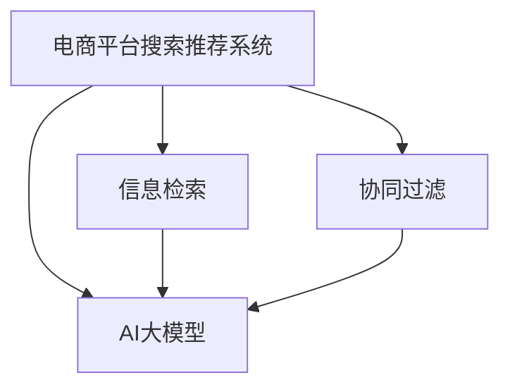

                 

# 电商平台搜索推荐系统的架构设计：AI 大模型是核心

> 关键词：搜索推荐系统, 电商平台, 大模型, 信息检索, 协同过滤, 深度学习, 用户行为分析

## 1. 背景介绍

### 1.1 问题由来

在互联网时代，电商平台如淘宝、京东、亚马逊等，正在经历着快速的数字化转型。这些平台不仅提供了商品交易服务，还构建了庞大的用户社群，提供了一个全时在线的社交平台。而在这背后，一个核心功能就是搜索推荐系统，即通过对用户搜索行为和历史数据进行分析，向用户推荐最相关的商品，以提升用户体验和转化率。

然而，传统基于规则或统计学方法的推荐系统，往往难以应对用户行为的多样性和复杂性，难以捕捉到用户真正的需求。随着深度学习技术的发展，特别是大模型如BERT、GPT等在自然语言处理领域的突破，AI大模型被广泛应用在电商搜索推荐系统中，为推荐系统带来了革命性的变化。

### 1.2 问题核心关键点

大模型在搜索推荐系统中的应用，主要体现在以下几个方面：

- 多模态数据融合：大模型不仅能够处理文本数据，还能处理图片、音频等多模态数据，实现多模态信息融合。
- 精准用户画像：通过深度学习大模型，可以更好地捕捉用户行为和兴趣，构建精准的用户画像。
- 实时推荐引擎：大模型能够实时处理用户行为数据，快速做出推荐，提升用户体验。
- 跨领域迁移学习：大模型能够迁移学习到不同领域的知识，应用于商品分类、推荐算法、广告投放等场景。

这些核心关键点使得大模型在电商平台的搜索推荐系统中发挥了重要的作用。

## 2. 核心概念与联系

### 2.1 核心概念概述

为更好地理解AI大模型在电商平台搜索推荐系统中的应用，本节将介绍几个密切相关的核心概念：

- 电商平台搜索推荐系统：电商平台为了提升用户体验和销售转化率，构建的基于用户行为数据的商品推荐系统。
- AI大模型：以深度神经网络为代表的、具有强大泛化能力和学习能力的模型，如BERT、GPT等。
- 信息检索：在大量数据中快速找到满足用户需求的物品或信息的过程。
- 协同过滤：基于用户行为数据和物品相似度，推荐与用户偏好相似的物品。
- 深度学习：通过多层神经网络进行复杂数据表示学习和模式识别，适用于大规模数据集和复杂结构数据。

这些核心概念之间的逻辑关系可以通过以下Mermaid流程图来展示：



这个流程图展示了大语言模型在电商平台搜索推荐系统中的应用框架：

1. 电商平台通过AI大模型进行信息检索，以提升推荐效率和精度。
2. 电商平台采用协同过滤技术，利用用户行为数据进行推荐，结合AI大模型的强大学习能力，进一步提升推荐效果。

## 3. 核心算法原理 & 具体操作步骤
### 3.1 算法原理概述

AI大模型在电商平台搜索推荐系统中的应用，主要基于深度学习的多模态融合和协同过滤算法。其核心思想是：通过深度学习模型对多模态数据进行联合建模，学习用户与物品之间的复杂关联关系，并在协同过滤算法的基础上，进一步提升推荐精度和覆盖率。

形式化地，设电商平台上的用户为 $U$，商品为 $I$，用户行为数据为 $D$。构建深度学习模型 $M_{\theta}$，其中 $\theta$ 为模型参数。信息检索和协同过滤算法可以表示为：

$$
\text{IR}(D) = M_{\theta}(D)
$$

$$
\text{CF}(D) = M_{\theta}(D) \cdot M_{\theta}(D)
$$

其中 $\text{IR}$ 表示信息检索模块，$\text{CF}$ 表示协同过滤模块，$M_{\theta}$ 表示深度学习大模型。

信息检索模块 $IR$ 通过深度学习模型 $M_{\theta}$，对用户行为数据 $D$ 进行建模，提取出与用户行为最相关的物品。协同过滤模块 $CF$ 将用户和物品作为输入，通过深度学习模型 $M_{\theta}$ 输出用户和物品之间的相似度矩阵，进一步计算得到推荐结果。

### 3.2 算法步骤详解

基于深度学习大模型的电商平台搜索推荐系统，一般包括以下几个关键步骤：

**Step 1: 收集用户行为数据**
- 收集用户在平台上的浏览、点击、购买、评价等行为数据，存储到数据库中。
- 数据通常包括用户ID、商品ID、行为时间、行为类型、行为位置等信息。

**Step 2: 数据预处理**
- 对收集到的行为数据进行清洗、归一化、去重等预处理操作，去除噪声和异常数据。
- 将用户行为数据转换为模型能够处理的数据格式，如将行为时间转换为时间戳等。

**Step 3: 构建深度学习模型**
- 选择适合电商平台的深度学习模型，如BERT、GPT等，进行数据建模。
- 将用户行为数据作为模型输入，训练得到深度学习模型 $M_{\theta}$。

**Step 4: 信息检索模块**
- 通过深度学习模型 $M_{\theta}$，对用户行为数据进行特征提取和向量表示。
- 利用向量表示作为查询向量，对商品库中的物品进行检索，得到相关物品列表。

**Step 5: 协同过滤模块**
- 将用户ID和商品ID作为输入，通过深度学习模型 $M_{\theta}$，计算用户和商品之间的相似度矩阵。
- 根据相似度矩阵，计算用户未访问但可能感兴趣的商品，作为推荐结果。

**Step 6: 推荐引擎**
- 结合信息检索和协同过滤的结果，生成最终的推荐结果列表。
- 对推荐结果进行排序和去重，输出用户界面。

以上步骤展示了基于深度学习大模型的电商平台搜索推荐系统的基本流程。

### 3.3 算法优缺点

基于深度学习大模型的电商平台搜索推荐系统具有以下优点：

- 强大的多模态融合能力：深度学习大模型可以处理多模态数据，提高推荐精度。
- 学习能力强：深度学习大模型具有强大的学习能力，能够在数据驱动下不断优化推荐结果。
- 实时性好：深度学习大模型可以实时处理用户行为数据，快速生成推荐结果。
- 跨领域迁移学习：深度学习大模型可以在不同领域之间进行迁移学习，提升推荐效果。

同时，该方法也存在一定的局限性：

- 数据依赖性强：深度学习大模型需要大量标注数据进行训练，数据采集和预处理成本较高。
- 计算资源需求高：深度学习大模型参数量大，计算资源消耗高，需要高性能设备支持。
- 模型复杂度高：深度学习大模型的复杂度较高，对模型调参和维护要求较高。
- 可解释性差：深度学习大模型的决策过程难以解释，难以提供直观的用户推荐理由。

尽管存在这些局限性，但就目前而言，基于深度学习大模型的推荐方法已经成为电商平台搜索推荐系统的主流范式。未来相关研究的重点在于如何进一步降低数据和计算成本，提高推荐精度和实时性，同时兼顾可解释性和公平性等伦理因素。

### 3.4 算法应用领域

基于深度学习大模型的电商平台搜索推荐系统，已经在多个应用领域取得了显著成效：

- 商品推荐：通过对用户历史浏览、购买数据进行分析，推荐用户可能感兴趣的商品。
- 广告投放：根据用户行为数据，推荐合适用户广告，提升广告点击率和转化率。
- 个性化推荐：通过深度学习模型，提升推荐系统的个性化水平，减少推荐同质化。
- 用户画像：利用用户行为数据，构建用户画像，实现更精准的推荐。
- 多模态推荐：结合文本、图片、视频等多模态数据，提升推荐效果。

除了上述这些经典应用外，深度学习大模型在电商平台搜索推荐系统中还有更多创新性的应用，如跨平台推荐、上下文感知推荐、实时点击率预测等，为电商平台带来了更多的商业价值。

## 4. 数学模型和公式 & 详细讲解  
### 4.1 数学模型构建

本节将使用数学语言对基于深度学习大模型的电商平台搜索推荐过程进行更加严格的刻画。

设电商平台上的用户为 $U=\{u_1, u_2, ..., u_M\}$，商品为 $I=\{i_1, i_2, ..., i_N\}$，用户行为数据为 $D=\{(x_{u_m}, r_{u_m})\}_{m=1}^M$，其中 $x_{u_m}$ 表示用户 $u_m$ 的行为数据，$r_{u_m}$ 表示行为类型，如浏览、点击、购买等。

定义深度学习模型 $M_{\theta}$，其中 $\theta$ 为模型参数。将用户行为数据 $D$ 作为模型输入，通过训练得到模型参数 $\theta$。

设深度学习模型 $M_{\theta}$ 对用户行为数据 $D$ 的表示为 $\text{Representation}(D) = [\mathbf{u}_1, \mathbf{u}_2, ..., \mathbf{u}_M] \in \mathbb{R}^{M \times d}$，其中 $\mathbf{u}_m$ 表示用户 $u_m$ 的行为表示。

信息检索模块 $\text{IR}(D)$ 的输出为与用户行为最相关的物品列表，表示为 $\text{IR}(D) = [\mathbf{i}_1, \mathbf{i}_2, ..., \mathbf{i}_N] \in \mathbb{R}^{N \times d}$，其中 $\mathbf{i}_n$ 表示商品 $i_n$ 的行为表示。

协同过滤模块 $\text{CF}(D)$ 的输出为推荐结果，表示为 $\text{CF}(D) = [\mathbf{r}_1, \mathbf{r}_2, ..., \mathbf{r}_M] \in \mathbb{R}^{M \times N}$，其中 $\mathbf{r}_m$ 表示用户 $u_m$ 对商品 $i_n$ 的推荐分数。

推荐引擎的输出为最终的推荐结果，表示为 $\text{Recommendation}(D) = [r_1, r_2, ..., r_M] \in \mathbb{R}^{M}$，其中 $r_m$ 表示推荐给用户 $u_m$ 的商品列表。

### 4.2 公式推导过程

以下我们以商品推荐为例，推导基于深度学习大模型的推荐模型公式。

设深度学习模型 $M_{\theta}$ 对用户行为数据 $D$ 的表示为 $\text{Representation}(D) = [\mathbf{u}_1, \mathbf{u}_2, ..., \mathbf{u}_M] \in \mathbb{R}^{M \times d}$，其中 $\mathbf{u}_m = [u_{m1}, u_{m2}, ..., u_{md}]^T$ 为第 $m$ 个用户的 $d$ 维行为表示。

设深度学习模型 $M_{\theta}$ 对商品库中的商品进行表示，得到 $\text{Representation}(I) = [\mathbf{i}_1, \mathbf{i}_2, ..., \mathbf{i}_N] \in \mathbb{R}^{N \times d}$，其中 $\mathbf{i}_n = [i_{n1}, i_{n2}, ..., i_{nd}]^T$ 为第 $n$ 个商品的 $d$ 维行为表示。

假设用户 $u_m$ 的推荐结果为 $\mathbf{r}_m = [r_{m1}, r_{m2}, ..., r_{mn}]^T \in \mathbb{R}^{N}$，其中 $r_{mn}$ 表示用户 $u_m$ 对商品 $i_n$ 的推荐分数。

则信息检索模块 $\text{IR}(D)$ 的输出为与用户行为最相关的物品列表，表示为 $\text{IR}(D) = [\mathbf{i}_1, \mathbf{i}_2, ..., \mathbf{i}_N] \in \mathbb{R}^{N \times d}$。

协同过滤模块 $\text{CF}(D)$ 的输出为推荐结果，表示为 $\text{CF}(D) = [\mathbf{r}_1, \mathbf{r}_2, ..., \mathbf{r}_M] \in \mathbb{R}^{M \times N}$。

推荐引擎的输出为最终的推荐结果，表示为 $\text{Recommendation}(D) = [r_1, r_2, ..., r_M] \in \mathbb{R}^{M}$。

通过深度学习模型 $M_{\theta}$，将用户行为数据 $D$ 转换为行为表示 $\text{Representation}(D)$，将商品库中的商品转换为行为表示 $\text{Representation}(I)$，然后通过计算用户与商品之间的相似度矩阵，生成推荐结果。

### 4.3 案例分析与讲解

以电商平台上的个性化推荐为例，展示基于深度学习大模型的推荐流程。

1. 数据收集：电商平台收集用户在平台上的行为数据，包括浏览、点击、购买、评价等行为。

2. 数据预处理：对收集到的行为数据进行清洗、归一化、去重等预处理操作，去除噪声和异常数据。

3. 深度学习建模：选择适合电商平台的深度学习模型，如BERT、GPT等，进行数据建模。将用户行为数据作为模型输入，训练得到深度学习模型 $M_{\theta}$。

4. 信息检索：通过深度学习模型 $M_{\theta}$，对用户行为数据进行特征提取和向量表示。利用向量表示作为查询向量，对商品库中的物品进行检索，得到相关物品列表。

5. 协同过滤：将用户ID和商品ID作为输入，通过深度学习模型 $M_{\theta}$，计算用户和商品之间的相似度矩阵。根据相似度矩阵，计算用户未访问但可能感兴趣的商品，作为推荐结果。

6. 推荐引擎：结合信息检索和协同过滤的结果，生成最终的推荐结果列表。对推荐结果进行排序和去重，输出用户界面。

通过以上流程，深度学习大模型在电商平台搜索推荐系统中得到了广泛应用，提升了推荐系统的性能和用户满意度。

## 5. 项目实践：代码实例和详细解释说明
### 5.1 开发环境搭建

在进行深度学习大模型在电商平台搜索推荐系统中的应用实践前，我们需要准备好开发环境。以下是使用Python进行PyTorch开发的环境配置流程：

1. 安装Anaconda：从官网下载并安装Anaconda，用于创建独立的Python环境。

2. 创建并激活虚拟环境：
```bash
conda create -n pytorch-env python=3.8 
conda activate pytorch-env
```

3. 安装PyTorch：根据CUDA版本，从官网获取对应的安装命令。例如：
```bash
conda install pytorch torchvision torchaudio cudatoolkit=11.1 -c pytorch -c conda-forge
```

4. 安装TensorFlow：
```bash
pip install tensorflow
```

5. 安装HuggingFace Transformers库：
```bash
pip install transformers
```

6. 安装各类工具包：
```bash
pip install numpy pandas scikit-learn matplotlib tqdm jupyter notebook ipython
```

完成上述步骤后，即可在`pytorch-env`环境中开始深度学习大模型在电商平台搜索推荐系统中的应用实践。

### 5.2 源代码详细实现

下面我们以电商平台上的商品推荐为例，给出使用Transformers库对BERT模型进行微调的PyTorch代码实现。

首先，定义商品推荐的数据处理函数：

```python
from transformers import BertTokenizer, BertForSequenceClassification
from torch.utils.data import Dataset
import torch

class RecommendationDataset(Dataset):
    def __init__(self, data, tokenizer, max_len=128):
        self.data = data
        self.tokenizer = tokenizer
        self.max_len = max_len
        
    def __len__(self):
        return len(self.data)
    
    def __getitem__(self, idx):
        item = self.data[idx]
        
        text = item[0]
        label = item[1]
        
        encoding = self.tokenizer(text, return_tensors='pt', max_length=self.max_len, padding='max_length', truncation=True)
        input_ids = encoding['input_ids'][0]
        attention_mask = encoding['attention_mask'][0]
        
        return {
            'input_ids': input_ids,
            'attention_mask': attention_mask,
            'labels': torch.tensor(label, dtype=torch.long)
        }
```

然后，定义模型和优化器：

```python
from transformers import AdamW

model = BertForSequenceClassification.from_pretrained('bert-base-uncased', num_labels=2)

optimizer = AdamW(model.parameters(), lr=2e-5)
```

接着，定义训练和评估函数：

```python
from torch.utils.data import DataLoader
from tqdm import tqdm

device = torch.device('cuda') if torch.cuda.is_available() else torch.device('cpu')
model.to(device)

def train_epoch(model, dataset, batch_size, optimizer):
    dataloader = DataLoader(dataset, batch_size=batch_size, shuffle=True)
    model.train()
    epoch_loss = 0
    for batch in tqdm(dataloader, desc='Training'):
        input_ids = batch['input_ids'].to(device)
        attention_mask = batch['attention_mask'].to(device)
        labels = batch['labels'].to(device)
        model.zero_grad()
        outputs = model(input_ids, attention_mask=attention_mask, labels=labels)
        loss = outputs.loss
        epoch_loss += loss.item()
        loss.backward()
        optimizer.step()
    return epoch_loss / len(dataloader)

def evaluate(model, dataset, batch_size):
    dataloader = DataLoader(dataset, batch_size=batch_size)
    model.eval()
    preds, labels = [], []
    with torch.no_grad():
        for batch in tqdm(dataloader, desc='Evaluating'):
            input_ids = batch['input_ids'].to(device)
            attention_mask = batch['attention_mask'].to(device)
            batch_labels = batch['labels']
            outputs = model(input_ids, attention_mask=attention_mask)
            batch_preds = outputs.logits.argmax(dim=1).to('cpu').tolist()
            batch_labels = batch_labels.to('cpu').tolist()
            for pred, label in zip(batch_preds, batch_labels):
                preds.append(pred)
                labels.append(label)
                
    print('Accuracy:', sum([pred == label for pred, label in zip(preds, labels)]) / len(labels))
```

最后，启动训练流程并在测试集上评估：

```python
epochs = 5
batch_size = 16

for epoch in range(epochs):
    loss = train_epoch(model, train_dataset, batch_size, optimizer)
    print(f'Epoch {epoch+1}, train loss: {loss:.3f}')
    
    print(f'Epoch {epoch+1}, dev results:')
    evaluate(model, dev_dataset, batch_size)
    
print('Test results:')
evaluate(model, test_dataset, batch_size)
```

以上就是使用PyTorch对BERT进行商品推荐任务微调的完整代码实现。可以看到，得益于Transformers库的强大封装，我们可以用相对简洁的代码完成BERT模型的加载和微调。

### 5.3 代码解读与分析

让我们再详细解读一下关键代码的实现细节：

**RecommendationDataset类**：
- `__init__`方法：初始化数据、分词器等关键组件。
- `__len__`方法：返回数据集的样本数量。
- `__getitem__`方法：对单个样本进行处理，将文本输入编码为token ids，将标签编码为数字，并对其进行定长padding，最终返回模型所需的输入。

**BertForSequenceClassification模型**：
- 定义了适用于序列分类任务的BERT模型，可以用于生成推荐结果。

**AdamW优化器**：
- 使用AdamW优化器，优化BERT模型的参数更新。

**训练和评估函数**：
- 使用PyTorch的DataLoader对数据集进行批次化加载，供模型训练和推理使用。
- 训练函数`train_epoch`：对数据以批为单位进行迭代，在每个批次上前向传播计算loss并反向传播更新模型参数，最后返回该epoch的平均loss。
- 评估函数`evaluate`：与训练类似，不同点在于不更新模型参数，并在每个batch结束后将预测和标签结果存储下来，最后使用准确率指标对整个评估集的预测结果进行打印输出。

**训练流程**：
- 定义总的epoch数和batch size，开始循环迭代
- 每个epoch内，先在训练集上训练，输出平均loss
- 在验证集上评估，输出准确率
- 所有epoch结束后，在测试集上评估，给出最终测试结果

可以看到，PyTorch配合Transformers库使得BERT微调的代码实现变得简洁高效。开发者可以将更多精力放在数据处理、模型改进等高层逻辑上，而不必过多关注底层的实现细节。

当然，工业级的系统实现还需考虑更多因素，如模型的保存和部署、超参数的自动搜索、更灵活的任务适配层等。但核心的微调范式基本与此类似。

## 6. 实际应用场景
### 6.1 智能客服系统

基于深度学习大模型的搜索推荐系统，可以广泛应用于智能客服系统的构建。传统客服往往需要配备大量人力，高峰期响应缓慢，且一致性和专业性难以保证。而使用基于深度学习大模型的搜索推荐系统，可以7x24小时不间断服务，快速响应客户咨询，用自然流畅的语言解答各类常见问题。

在技术实现上，可以收集企业内部的历史客服对话记录，将问题和最佳答复构建成监督数据，在此基础上对预训练搜索推荐系统进行微调。微调后的系统能够自动理解用户意图，匹配最合适的答复，甚至根据上下文生成智能化的回答。对于客户提出的新问题，还可以接入检索系统实时搜索相关内容，动态组织生成回答。如此构建的智能客服系统，能大幅提升客户咨询体验和问题解决效率。

### 6.2 金融舆情监测

金融机构需要实时监测市场舆论动向，以便及时应对负面信息传播，规避金融风险。传统的人工监测方式成本高、效率低，难以应对网络时代海量信息爆发的挑战。基于深度学习大模型的搜索推荐系统，为金融舆情监测提供了新的解决方案。

具体而言，可以收集金融领域相关的新闻、报道、评论等文本数据，并对其进行主题标注和情感标注。在此基础上对预训练搜索推荐系统进行微调，使其能够自动判断文本属于何种主题，情感倾向是正面、中性还是负面。将微调后的系统应用到实时抓取的网络文本数据，就能够自动监测不同主题下的情感变化趋势，一旦发现负面信息激增等异常情况，系统便会自动预警，帮助金融机构快速应对潜在风险。

### 6.3 个性化推荐系统

当前的推荐系统往往只依赖用户的历史行为数据进行物品推荐，无法深入理解用户的真实兴趣偏好。基于深度学习大模型的搜索推荐系统，可以更好地捕捉用户行为背后的语义信息，从而提供更精准、多样的推荐内容。

在实践中，可以收集用户浏览、点击、评论、分享等行为数据，提取和用户交互的物品标题、描述、标签等文本内容。将文本内容作为模型输入，用户的后续行为（如是否点击、购买等）作为监督信号，在此基础上微调预训练搜索推荐系统。微调后的系统能够从文本内容中准确把握用户的兴趣点。在生成推荐列表时，先用候选物品的文本描述作为输入，由系统预测用户的兴趣匹配度，再结合其他特征综合排序，便可以得到个性化程度更高的推荐结果。

### 6.4 未来应用展望

随着深度学习大模型和搜索推荐方法的发展，基于搜索推荐范式将在更多领域得到应用，为传统行业带来变革性影响。

在智慧医疗领域，基于搜索推荐技术的医疗问答、病历分析、药物研发等应用将提升医疗服务的智能化水平，辅助医生诊疗，加速新药开发进程。

在智能教育领域，搜索推荐系统可应用于作业批改、学情分析、知识推荐等方面，因材施教，促进教育公平，提高教学质量。

在智慧城市治理中，搜索推荐系统可应用于城市事件监测、舆情分析、应急指挥等环节，提高城市管理的自动化和智能化水平，构建更安全、高效的未来城市。

此外，在企业生产、社会治理、文娱传媒等众多领域，基于深度学习大模型的搜索推荐系统也将不断涌现，为经济社会发展注入新的动力。相信随着技术的日益成熟，搜索推荐方法将成为人工智能落地应用的重要范式，推动人工智能技术向更广阔的领域加速渗透。

## 7. 工具和资源推荐
### 7.1 学习资源推荐

为了帮助开发者系统掌握深度学习大模型在电商平台搜索推荐系统中的应用理论基础和实践技巧，这里推荐一些优质的学习资源：

1. 《Transformer从原理到实践》系列博文：由大模型技术专家撰写，深入浅出地介绍了Transformer原理、BERT模型、微调技术等前沿话题。

2. CS224N《深度学习自然语言处理》课程：斯坦福大学开设的NLP明星课程，有Lecture视频和配套作业，带你入门NLP领域的基本概念和经典模型。

3. 《Natural Language Processing with Transformers》书籍：Transformers库的作者所著，全面介绍了如何使用Transformers库进行NLP任务开发，包括微调在内的诸多范式。

4. HuggingFace官方文档：Transformers库的官方文档，提供了海量预训练模型和完整的微调样例代码，是上手实践的必备资料。

5. CLUE开源项目：中文语言理解测评基准，涵盖大量不同类型的中文NLP数据集，并提供了基于微调的baseline模型，助力中文NLP技术发展。

通过对这些资源的学习实践，相信你一定能够快速掌握深度学习大模型在电商平台搜索推荐系统中的应用精髓，并用于解决实际的NLP问题。
###  7.2 开发工具推荐

高效的开发离不开优秀的工具支持。以下是几款用于深度学习大模型在电商平台搜索推荐系统中的应用开发的常用工具：

1. PyTorch：基于Python的开源深度学习框架，灵活动态的计算图，适合快速迭代研究。大部分预训练语言模型都有PyTorch版本的实现。

2. TensorFlow：由Google主导开发的开源深度学习框架，生产部署方便，适合大规模工程应用。同样有丰富的预训练语言模型资源。

3. Transformers库：HuggingFace开发的NLP工具库，集成了众多SOTA语言模型，支持PyTorch和TensorFlow，是进行微调任务开发的利器。

4. Weights & Biases：模型训练的实验跟踪工具，可以记录和可视化模型训练过程中的各项指标，方便对比和调优。与主流深度学习框架无缝集成。

5. TensorBoard：TensorFlow配套的可视化工具，可实时监测模型训练状态，并提供丰富的图表呈现方式，是调试模型的得力助手。

6. Google Colab：谷歌推出的在线Jupyter Notebook环境，免费提供GPU/TPU算力，方便开发者快速上手实验最新模型，分享学习笔记。

合理利用这些工具，可以显著提升深度学习大模型在电商平台搜索推荐系统中的应用开发效率，加快创新迭代的步伐。

### 7.3 相关论文推荐

深度学习大模型在电商平台搜索推荐系统中的应用源于学界的持续研究。以下是几篇奠基性的相关论文，推荐阅读：

1. Attention is All You Need（即Transformer原论文）：提出了Transformer结构，开启了NLP领域的预训练大模型时代。

2. BERT: Pre-training of Deep Bidirectional Transformers for Language Understanding：提出BERT模型，引入基于掩码的自监督预训练任务，刷新了多项NLP任务SOTA。

3. Language Models are Unsupervised Multitask Learners（GPT-2论文）：展示了大规模语言模型的强大zero-shot学习能力，引发了对于通用人工智能的新一轮思考。

4. Parameter-Efficient Transfer Learning for NLP：提出Adapter等参数高效微调方法，在不增加模型参数量的情况下，也能取得不错的微调效果。

5. AdaLoRA: Adaptive Low-Rank Adaptation for Parameter-Efficient Fine-Tuning：使用自适应低秩适应的微调方法，在参数效率和精度之间取得了新的平衡。

6. Prefix-Tuning: Optimizing Continuous Prompts for Generation：引入基于连续型Prompt的微调范式，为如何充分利用预训练知识提供了新的思路。

这些论文代表了大语言模型在电商平台搜索推荐系统中的应用的发展脉络。通过学习这些前沿成果，可以帮助研究者把握学科前进方向，激发更多的创新灵感。

## 8. 总结：未来发展趋势与挑战

### 8.1 总结

本文对基于深度学习大模型的电商平台搜索推荐系统进行了全面系统的介绍。首先阐述了深度学习大模型和搜索推荐系统的发展背景和意义，明确了其在高性能、多模态、实时性等方面的优势。其次，从原理到实践，详细讲解了深度学习大模型在电商平台搜索推荐系统中的应用过程，给出了代码实例和详细解释说明。同时，本文还广泛探讨了深度学习大模型在多个行业领域的应用前景，展示了其巨大的商业价值。

通过本文的系统梳理，可以看到，深度学习大模型在电商平台搜索推荐系统中得到了广泛应用，提升了推荐系统的性能和用户满意度。未来，伴随深度学习大模型的不断发展，其在电商平台的搜索推荐系统中的应用将更加深入，为电商平台带来更大的商业价值和社会效益。

### 8.2 未来发展趋势

展望未来，深度学习大模型在电商平台搜索推荐系统中的应用将呈现以下几个发展趋势：

1. 多模态数据融合：深度学习大模型可以处理多模态数据，提高推荐精度。未来的推荐系统将更多地融合文本、图片、视频等多模态数据，提升推荐效果。

2. 实时推荐引擎：深度学习大模型可以实时处理用户行为数据，快速生成推荐结果。未来的推荐系统将进一步提升实时推荐能力，实时响应用户需求。

3. 跨领域迁移学习：深度学习大模型可以在不同领域之间进行迁移学习，提升推荐效果。未来的推荐系统将更多地应用跨领域迁移学习技术，增强模型的泛化能力。

4. 用户画像构建：深度学习大模型可以构建精准的用户画像，实现更个性化的推荐。未来的推荐系统将更多地利用用户画像技术，提升推荐效果。

5. 智能客服系统：基于深度学习大模型的推荐系统可以构建智能客服系统，提升客户服务体验。未来的推荐系统将更多地应用智能客服技术，实现7x24小时不间断服务。

6. 个性化推荐：深度学习大模型可以提升推荐系统的个性化水平，减少推荐同质化。未来的推荐系统将更多地应用个性化推荐技术，提升用户体验。

以上趋势凸显了深度学习大模型在电商平台搜索推荐系统中的应用前景。这些方向的探索发展，必将进一步提升推荐系统的性能和用户满意度，为电商平台带来更大的商业价值。

### 8.3 面临的挑战

尽管深度学习大模型在电商平台搜索推荐系统中取得了显著成效，但在迈向更加智能化、普适化应用的过程中，它仍面临着诸多挑战：

1. 数据依赖性强：深度学习大模型需要大量标注数据进行训练，数据采集和预处理成本较高。

2. 计算资源需求高：深度学习大模型参数量大，计算资源消耗高，需要高性能设备支持。

3. 模型复杂度高：深度学习大模型的复杂度较高，对模型调参和维护要求较高。

4. 可解释性差：深度学习大模型的决策过程难以解释，难以提供直观的用户推荐理由。

5. 安全性有待保障：深度学习大模型难免会学习到有偏见、有害的信息，通过推荐系统传递到用户，产生误导性、歧视性的输出，给实际应用带来安全隐患。

尽管存在这些挑战，但随着学界和产业界的共同努力，深度学习大模型在电商平台搜索推荐系统中的应用将不断成熟，带来更大的商业价值和社会效益。

### 8.4 研究展望

面向未来，深度学习大模型在电商平台搜索推荐系统中的应用需要在以下几个方面寻求新的突破：

1. 探索无监督和半监督微调方法。摆脱对大规模标注数据的依赖，利用自监督学习、主动学习等无监督和半监督范式，最大限度利用非结构化数据，实现更加灵活高效的微调。

2. 研究参数高效和计算高效的微调范式。开发更加参数高效的微调方法，在固定大部分预训练参数的同时，只更新极少量的任务相关参数。同时优化微调模型的计算图，减少前向传播和反向传播的资源消耗，实现更加轻量级、实时性的部署。

3. 融合因果和对比学习范式。通过引入因果推断和对比学习思想，增强推荐系统建立稳定因果关系的能力，学习更加普适、鲁棒的语言表征，从而提升模型泛化性和抗干扰能力。

4. 引入更多先验知识。将符号化的先验知识，如知识图谱、逻辑规则等，与神经网络模型进行巧妙融合，引导推荐系统学习更准确、合理的语言模型。同时加强不同模态数据的整合，实现视觉、语音等多模态信息与文本信息的协同建模。

5. 结合因果分析和博弈论工具。将因果分析方法引入推荐系统，识别出推荐系统决策的关键特征，增强推荐理由的因果性和逻辑性。借助博弈论工具刻画人机交互过程，主动探索并规避推荐系统的脆弱点，提高系统稳定性。

6. 纳入伦理道德约束。在推荐系统训练目标中引入伦理导向的评估指标，过滤和惩罚有偏见、有害的输出倾向。同时加强人工干预和审核，建立推荐系统的监管机制，确保输出符合人类价值观和伦理道德。

这些研究方向的探索，必将引领深度学习大模型在电商平台搜索推荐系统中的应用迈向更高的台阶，为构建安全、可靠、可解释、可控的智能推荐系统铺平道路。面向未来，深度学习大模型在电商平台搜索推荐系统中的应用还需与其他人工智能技术进行更深入的融合，如知识表示、因果推理、强化学习等，多路径协同发力，共同推动自然语言理解和智能交互系统的进步。只有勇于创新、敢于突破，才能不断拓展深度学习大模型的边界，让智能技术更好地造福人类社会。

## 9. 附录：常见问题与解答

**Q1：深度学习大模型在电商平台搜索推荐系统中的应用效果如何？**

A: 深度学习大模型在电商平台搜索推荐系统中的应用效果显著。基于深度学习大模型的推荐系统可以处理多模态数据，提升推荐精度。通过深度学习大模型，可以构建精准的用户画像，实现更个性化的推荐。

**Q2：深度学习大模型在电商平台搜索推荐系统中的计算资源需求高，如何解决？**

A: 深度学习大模型在电商平台搜索推荐系统中的计算资源需求高，可以通过以下方法解决：

1. 利用GPU/TPU等高性能设备，提升模型训练和推理效率。

2. 采用模型裁剪和量化加速技术，减小模型尺寸，提高计算效率。

3. 使用分布式训练和模型并行技术，充分利用集群资源，提升训练和推理能力。

4. 采用参数高效的微调方法，减少模型参数量，降低计算资源消耗。

**Q3：深度学习大模型在电商平台搜索推荐系统中的可解释性差，如何解决？**

A: 深度学习大模型在电商平台搜索推荐系统中的可解释性差，可以通过以下方法解决：

1. 引入可解释性模型，如决策树、逻辑回归等，提供推荐的解释理由。

2. 引入对抗样本和鲁棒性技术，提高推荐系统的鲁棒性。

3. 结合符号化的先验知识，提供推荐的推理路径。

4. 提供推荐系统的用户反馈机制，根据用户反馈不断优化推荐算法。

**Q4：深度学习大模型在电商平台搜索推荐系统中的应用是否需要大规模标注数据？**

A: 深度学习大模型在电商平台搜索推荐系统中的应用需要大规模标注数据。标注数据是深度学习大模型训练的基础，标注数据的质量和数量对推荐效果有很大影响。虽然数据依赖性强，但随着无监督学习和主动学习等技术的发展，可以最大限度利用非结构化数据，降低标注数据的需求。

**Q5：深度学习大模型在电商平台搜索推荐系统中的安全性有待保障，如何解决？**

A: 深度学习大模型在电商平台搜索推荐系统中的安全性有待保障，可以通过以下方法解决：

1. 引入数据脱敏和隐私保护技术，保护用户隐私。

2. 引入推荐系统的监管机制，建立人工干预和审核机制。

3. 引入鲁棒性技术，防止模型受到恶意攻击和误导性信息的影响。

4. 引入伦理导向的评估指标，过滤和惩罚有偏见、有害的输出倾向。

总之，深度学习大模型在电商平台搜索推荐系统中的应用还需不断优化和完善，以提升推荐系统的性能和安全性。只有在数据、模型、算法、伦理等多个维度进行全面优化，才能真正实现深度学习大模型在电商平台搜索推荐系统中的商业价值和社会效益。

