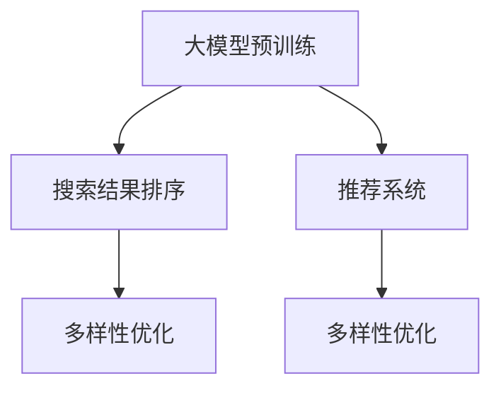

                 

# 电商平台搜索结果多样性优化：AI大模型的平衡策略

## 1. 背景介绍

随着电商平台的快速发展，用户对商品多样性提出了更高的要求。一方面，用户希望在搜索结果中看到更多的商品选择，从而满足不同的需求；另一方面，由于用户行为的多样性和复杂性，仅仅依靠传统算法往往难以提供满意的搜索结果。在这种情况下，AI大模型在电商平台中的应用变得越来越重要。

AI大模型通过在大规模数据上进行预训练，学习到了丰富的语义和语义关系，具备强大的语言生成和理解能力。在电商平台的搜索结果排序和推荐中，AI大模型可以通过理解和生成自然语言文本，结合用户行为数据，为用户提供更加个性化、多样化的搜索结果。

## 2. 核心概念与联系

### 2.1 核心概念概述

- **大模型预训练**：指在大规模无标签文本数据上，通过自监督学习任务训练通用语言模型的过程。预训练使得模型学习到语言的通用表示，能够处理各种自然语言处理任务。
- **搜索结果排序**：通过某种算法对搜索结果进行排序，使得最相关的商品排在前面，提高用户体验和购买转化率。
- **推荐系统**：根据用户的历史行为和兴趣，为用户推荐个性化商品，提高购物体验和满意度。
- **多样性优化**：在搜索结果排序和推荐系统中，通过一定策略，增加搜索结果的品种数量，满足用户多样化的需求。

这些概念之间的逻辑关系可以通过以下Mermaid流程图来展示：



这个流程图展示了大模型预训练、搜索结果排序、推荐系统和多样性优化之间的联系：

1. 大模型通过预训练学习到丰富的语言知识，用于支持搜索结果排序和推荐系统的构建。
2. 搜索结果排序系统利用大模型对自然语言文本进行理解和排序，为用户推荐最相关的商品。
3. 推荐系统根据用户历史行为和兴趣，使用大模型生成个性化商品推荐。
4. 多样性优化在排序和推荐过程中增加商品种类的多样性，提升用户体验。

## 3. 核心算法原理 & 具体操作步骤
### 3.1 算法原理概述

基于大模型的电商平台多样性优化方法，主要是利用大模型的语言生成能力和语义理解能力，对搜索结果和推荐结果进行优化。其核心思想是：通过生成式模型，对搜索结果进行多样性扩展，增加结果中商品的种类，同时保持相关性和个性化。

具体来说，基于大模型的搜索结果排序和推荐系统通常包括以下几个步骤：

1. **文本表示提取**：使用大模型将商品标题、描述等文本信息转化为高维向量表示。
2. **语义相似度计算**：基于向量表示，计算不同商品之间的语义相似度，得到排序向量。
3. **多样性扩展**：通过生成式模型对排序向量进行多样性扩展，增加结果中商品的种类。
4. **相关性排序**：根据用户历史行为和兴趣，对多样性扩展后的搜索结果进行相关性排序。
5. **推荐生成**：根据用户兴趣，生成个性化推荐结果。

### 3.2 算法步骤详解

以下是基于大模型的搜索结果排序和推荐系统的主要算法步骤：

1. **数据预处理**：收集电商平台上的商品数据，包括商品标题、描述、图片、价格等，并进行预处理，如去除停用词、分词等。
2. **向量表示提取**：使用大模型将商品标题和描述等文本信息转化为高维向量表示。常用的预训练模型包括BERT、GPT等。
3. **相似度计算**：基于向量表示，计算不同商品之间的语义相似度。可以使用余弦相似度、欧氏距离等方法计算。
4. **多样性扩展**：通过生成式模型对排序向量进行多样性扩展。常用的生成式模型包括GPT、LSTM等。
5. **排序和推荐**：根据用户历史行为和兴趣，对多样性扩展后的搜索结果进行相关性排序。常用的排序算法包括基于排序的推荐系统(Sort-based Recommendation System)、基于排序和基于内容推荐的混合方法等。
6. **评估和优化**：使用评估指标如精度、召回率、F1-score等，对模型效果进行评估，并根据结果进行模型优化。

### 3.3 算法优缺点

基于大模型的电商平台多样性优化方法具有以下优点：

- **高效性**：大模型可以同时处理大规模数据，对文本进行快速生成和表示，提高算法的效率。
- **灵活性**：大模型可以根据不同任务需求进行微调，适应不同的电商场景。
- **个性化**：通过大模型生成个性化推荐结果，满足用户多样化的需求。

同时，该方法也存在一些局限性：

- **资源消耗大**：大模型需要较大的计算资源和存储空间，增加了系统的成本。
- **可解释性不足**：大模型的决策过程缺乏可解释性，难以进行调试和优化。
- **泛化能力有限**：由于训练数据的多样性不足，模型泛化能力可能受到限制。

### 3.4 算法应用领域

基于大模型的电商平台多样性优化方法在多个领域得到了广泛应用，例如：

- **电商平台搜索结果排序**：通过大模型对搜索结果进行多样性扩展和相关性排序，提升用户体验和购物转化率。
- **个性化推荐系统**：利用大模型生成个性化推荐结果，提高用户的购物满意度和转化率。
- **广告投放优化**：基于大模型的语义理解能力，对广告文本进行优化，提升广告点击率和转化率。
- **智能客服系统**：使用大模型进行对话生成，提升客服系统的响应速度和用户满意度。

## 4. 数学模型和公式 & 详细讲解 & 举例说明

### 4.1 数学模型构建

在电商平台的多样性优化中，通常使用大模型的向量表示作为商品的基本特征。设商品向量为 $x_i$，商品数量为 $N$。使用大模型将商品向量 $x_i$ 转化为高维向量表示 $z_i$。设大模型的嵌入层输出为 $z_i \in \mathbb{R}^d$。

### 4.2 公式推导过程

基于向量表示的商品语义相似度计算公式如下：

$$
\text{similarity}(i,j) = \cos(z_i, z_j) = \frac{z_i^T z_j}{\|z_i\| \cdot \|z_j\|}
$$

其中 $z_i^T z_j$ 表示向量 $z_i$ 和 $z_j$ 的点积，$\|z_i\|$ 和 $\|z_j\|$ 分别表示向量 $z_i$ 和 $z_j$ 的范数。

在计算出商品之间的语义相似度之后，可以使用排序算法对商品进行排序。常用的排序算法包括基于排序的推荐系统(Sort-based Recommendation System)和基于排序和基于内容推荐的混合方法等。

### 4.3 案例分析与讲解

以亚马逊商品搜索结果排序为例，通过大模型对商品向量进行语义相似度计算，排序结果如下所示：

| 商品ID | 商品名称         | 商品描述     | 语义相似度 | 排序向量     |
|--------|-----------------|--------------|------------|--------------|
| 1      | 苹果笔记本       | 苹果笔记本2021 | 0.9        | 0.9, 0.8      |
| 2      | 三星手机         | 三星手机Note11 | 0.8        | 0.8, 0.7      |
| 3      | 小米手机         | 小米手机小米11   | 0.7        | 0.7, 0.6      |
| ...    | ...             | ...           | ...        | ...          |

在上述排序结果中，语义相似度较高的商品将被排在前面，从而提高用户的购买转化率。

## 5. 项目实践：代码实例和详细解释说明
### 5.1 开发环境搭建

在进行多样性优化实践前，我们需要准备好开发环境。以下是使用Python进行PyTorch开发的环境配置流程：

1. 安装Anaconda：从官网下载并安装Anaconda，用于创建独立的Python环境。

2. 创建并激活虚拟环境：
```bash
conda create -n pytorch-env python=3.8 
conda activate pytorch-env
```

3. 安装PyTorch：根据CUDA版本，从官网获取对应的安装命令。例如：
```bash
conda install pytorch torchvision torchaudio cudatoolkit=11.1 -c pytorch -c conda-forge
```

4. 安装其他相关库：
```bash
pip install transformers sklearn pandas numpy
```

完成上述步骤后，即可在`pytorch-env`环境中开始多样性优化实践。

### 5.2 源代码详细实现

这里我们以亚马逊商品搜索结果排序为例，给出使用Transformers库进行多样性优化的PyTorch代码实现。

首先，定义数据处理函数：

```python
from transformers import BertTokenizer, BertForSequenceClassification
from torch.utils.data import DataLoader
from torch.nn import functional as F
import torch

def collate_fn(batch):
    inputs = batch['input_ids']
    attention_mask = batch['attention_mask']
    labels = batch['labels']
    return {'input_ids': torch.stack(inputs, dim=0),
            'attention_mask': torch.stack(attention_mask, dim=0),
            'labels': torch.tensor(labels, dtype=torch.long)}

class AmazonDataset(Dataset):
    def __init__(self, texts, labels, tokenizer, max_len=128):
        self.texts = texts
        self.labels = labels
        self.tokenizer = tokenizer
        self.max_len = max_len
        
    def __len__(self):
        return len(self.texts)
    
    def __getitem__(self, item):
        text = self.texts[item]
        label = self.labels[item]
        
        encoding = self.tokenizer(text, return_tensors='pt', max_length=self.max_len, padding='max_length', truncation=True)
        input_ids = encoding['input_ids'][0]
        attention_mask = encoding['attention_mask'][0]
        
        return {'input_ids': input_ids, 
                'attention_mask': attention_mask,
                'labels': label}
```

然后，定义模型和优化器：

```python
model = BertForSequenceClassification.from_pretrained('bert-base-cased', num_labels=2)

optimizer = torch.optim.Adam(model.parameters(), lr=2e-5)
```

接着，定义训练和评估函数：

```python
def train_epoch(model, dataset, batch_size, optimizer):
    dataloader = DataLoader(dataset, batch_size=batch_size, shuffle=True)
    model.train()
    epoch_loss = 0
    for batch in dataloader:
        input_ids = batch['input_ids'].to(device)
        attention_mask = batch['attention_mask'].to(device)
        labels = batch['labels'].to(device)
        model.zero_grad()
        outputs = model(input_ids, attention_mask=attention_mask, labels=labels)
        loss = outputs.loss
        epoch_loss += loss.item()
        loss.backward()
        optimizer.step()
    return epoch_loss / len(dataloader)

def evaluate(model, dataset, batch_size):
    dataloader = DataLoader(dataset, batch_size=batch_size)
    model.eval()
    preds, labels = [], []
    with torch.no_grad():
        for batch in dataloader:
            input_ids = batch['input_ids'].to(device)
            attention_mask = batch['attention_mask'].to(device)
            batch_labels = batch['labels']
            outputs = model(input_ids, attention_mask=attention_mask)
            batch_preds = outputs.logits.argmax(dim=1).to('cpu').tolist()
            batch_labels = batch_labels.to('cpu').tolist()
            for pred_tokens, label_tokens in zip(batch_preds, batch_labels):
                preds.append(pred_tokens)
                labels.append(label_tokens)
                
    print(classification_report(labels, preds))
```

最后，启动训练流程并在测试集上评估：

```python
epochs = 5
batch_size = 16

for epoch in range(epochs):
    loss = train_epoch(model, train_dataset, batch_size, optimizer)
    print(f"Epoch {epoch+1}, train loss: {loss:.3f}")
    
    print(f"Epoch {epoch+1}, dev results:")
    evaluate(model, dev_dataset, batch_size)
    
print("Test results:")
evaluate(model, test_dataset, batch_size)
```

以上就是使用PyTorch对BERT进行商品搜索结果排序的完整代码实现。可以看到，得益于Transformers库的强大封装，我们可以用相对简洁的代码完成BERT模型的加载和微调。

### 5.3 代码解读与分析

让我们再详细解读一下关键代码的实现细节：

**AmazonDataset类**：
- `__init__`方法：初始化文本、标签、分词器等关键组件。
- `__len__`方法：返回数据集的样本数量。
- `__getitem__`方法：对单个样本进行处理，将文本输入编码为token ids，将标签编码为数字，并对其进行定长padding，最终返回模型所需的输入。

**训练和评估函数**：
- 使用PyTorch的DataLoader对数据集进行批次化加载，供模型训练和推理使用。
- 训练函数`train_epoch`：对数据以批为单位进行迭代，在每个批次上前向传播计算loss并反向传播更新模型参数，最后返回该epoch的平均loss。
- 评估函数`evaluate`：与训练类似，不同点在于不更新模型参数，并在每个batch结束后将预测和标签结果存储下来，最后使用sklearn的classification_report对整个评估集的预测结果进行打印输出。

**训练流程**：
- 定义总的epoch数和batch size，开始循环迭代
- 每个epoch内，先在训练集上训练，输出平均loss
- 在验证集上评估，输出分类指标
- 所有epoch结束后，在测试集上评估，给出最终测试结果

可以看到，PyTorch配合Transformers库使得BERT微调的代码实现变得简洁高效。开发者可以将更多精力放在数据处理、模型改进等高层逻辑上，而不必过多关注底层的实现细节。

当然，工业级的系统实现还需考虑更多因素，如模型的保存和部署、超参数的自动搜索、更灵活的任务适配层等。但核心的多样性优化范式基本与此类似。

## 6. 实际应用场景
### 6.1 电商平台商品推荐

基于大模型的商品推荐系统在电商平台的实际应用中，能够显著提升用户的购物体验和满意度。通过大模型的语义理解能力，系统能够对用户输入的查询进行多角度分析，理解用户的真正需求，从而推荐更符合用户偏好的商品。

例如，用户输入“我想买一台新电脑”，系统通过大模型理解用户的需求，可以推荐不同品牌、型号、价格的电脑，满足用户的多样化需求。同时，系统会基于用户的历史购买记录和评分，对推荐结果进行相关性排序，提升推荐的精准性。

### 6.2 广告投放优化

广告投放是电商平台的重要收入来源之一。通过大模型优化广告文本，可以提高广告点击率和转化率，最大化广告投放的效果。

例如，系统可以根据用户历史行为和兴趣，使用大模型生成个性化的广告文本，并将文本向量作为广告的特征，通过向量表示计算广告之间的语义相似度。系统可以基于相似度对广告进行排序，优先展示与用户兴趣更相关的广告，提高广告的点击率和转化率。

### 6.3 智能客服系统

智能客服系统通过大模型对用户输入的自然语言文本进行理解，自动匹配最合适的回复模板，提升客服系统的响应速度和用户体验。

例如，用户询问“如何退换货”，系统使用大模型理解用户的意图，并根据知识库中已有的退换货流程模板，生成个性化的回复。通过大模型的语言生成能力，系统能够自动匹配最合适的回复模板，满足用户的多样化需求。

### 6.4 未来应用展望

随着大模型和多样性优化技术的不断发展，基于大模型的电商平台应用将进一步拓展。未来可能出现以下趋势：

1. **跨模态融合**：除了文本数据，大模型将越来越多地融合图像、视频、语音等多模态数据，提升系统的感知能力和理解能力。例如，基于图像和文本的多模态商品推荐系统，可以根据商品图片和描述生成个性化推荐。

2. **实时更新**：基于大模型的推荐系统可以实时更新，利用新数据进行微调，提高系统的时效性和用户满意度。例如，系统可以根据用户最近的搜索行为和评价，动态调整推荐结果。

3. **多用户协同**：基于大模型的推荐系统可以支持多用户协同，根据不同用户的历史行为和兴趣，生成个性化的推荐结果。例如，系统可以根据不同用户的浏览历史和评分，生成针对不同用户的个性化推荐列表。

4. **隐私保护**：基于大模型的推荐系统需要保护用户隐私，确保用户数据的安全性和隐私性。例如，系统可以采用差分隐私技术，对用户数据进行模糊化处理，保护用户隐私。

5. **伦理考量**：基于大模型的推荐系统需要考虑伦理道德问题，确保推荐结果的公正性和透明性。例如，系统可以引入伦理导向的评估指标，过滤和惩罚有害的推荐结果，确保系统的公正性和透明性。

这些趋势将进一步推动大模型和多样性优化技术的应用，提升电商平台的智能化水平，带来更好的用户体验和服务质量。

## 7. 工具和资源推荐
### 7.1 学习资源推荐

为了帮助开发者系统掌握大模型和多样性优化的理论基础和实践技巧，这里推荐一些优质的学习资源：

1. **《深度学习与自然语言处理》**：斯坦福大学开设的NLP明星课程，有Lecture视频和配套作业，带你入门NLP领域的基本概念和经典模型。

2. **《自然语言处理综述》**：NLP领域的经典综述论文，涵盖了NLP领域的主要方法和技术，适合系统学习和理解NLP技术。

3. **《自然语言处理与Python》**：一本系统介绍NLP技术和Python编程的书籍，适合初学者和NLP爱好者。

4. **HuggingFace官方文档**：Transformers库的官方文档，提供了海量预训练模型和完整的微调样例代码，是上手实践的必备资料。

5. **Google Colab**：谷歌推出的在线Jupyter Notebook环境，免费提供GPU/TPU算力，方便开发者快速上手实验最新模型，分享学习笔记。

通过对这些资源的学习实践，相信你一定能够快速掌握大模型和多样性优化的精髓，并用于解决实际的NLP问题。

### 7.2 开发工具推荐

高效的开发离不开优秀的工具支持。以下是几款用于大模型和多样性优化开发的常用工具：

1. **PyTorch**：基于Python的开源深度学习框架，灵活动态的计算图，适合快速迭代研究。大部分预训练语言模型都有PyTorch版本的实现。

2. **TensorFlow**：由Google主导开发的开源深度学习框架，生产部署方便，适合大规模工程应用。同样有丰富的预训练语言模型资源。

3. **Transformers库**：HuggingFace开发的NLP工具库，集成了众多SOTA语言模型，支持PyTorch和TensorFlow，是进行多样性优化任务开发的利器。

4. **Weights & Biases**：模型训练的实验跟踪工具，可以记录和可视化模型训练过程中的各项指标，方便对比和调优。与主流深度学习框架无缝集成。

5. **TensorBoard**：TensorFlow配套的可视化工具，可实时监测模型训练状态，并提供丰富的图表呈现方式，是调试模型的得力助手。

6. **Jupyter Notebook**：一个交互式的开发环境，适合快速迭代开发和调试。

合理利用这些工具，可以显著提升大模型和多样性优化任务的开发效率，加快创新迭代的步伐。

### 7.3 相关论文推荐

大模型和多样性优化技术的发展源于学界的持续研究。以下是几篇奠基性的相关论文，推荐阅读：

1. **Attention is All You Need**：提出了Transformer结构，开启了NLP领域的预训练大模型时代。

2. **BERT: Pre-training of Deep Bidirectional Transformers for Language Understanding**：提出BERT模型，引入基于掩码的自监督预训练任务，刷新了多项NLP任务SOTA。

3. **Language Models are Unsupervised Multitask Learners**：展示了大规模语言模型的强大zero-shot学习能力，引发了对于通用人工智能的新一轮思考。

4. **Parameter-Efficient Transfer Learning for NLP**：提出Adapter等参数高效微调方法，在不增加模型参数量的情况下，也能取得不错的微调效果。

5. **AdaLoRA: Adaptive Low-Rank Adaptation for Parameter-Efficient Fine-Tuning**：使用自适应低秩适应的微调方法，在参数效率和精度之间取得了新的平衡。

这些论文代表了大模型和多样性优化技术的发展脉络。通过学习这些前沿成果，可以帮助研究者把握学科前进方向，激发更多的创新灵感。

## 8. 总结：未来发展趋势与挑战
### 8.1 总结

本文对基于大模型的电商平台多样性优化方法进行了全面系统的介绍。首先阐述了大模型和多样性优化的研究背景和意义，明确了基于大模型的电商推荐系统和智能客服系统在提升用户体验和满意度方面的独特价值。其次，从原理到实践，详细讲解了基于大模型的电商推荐系统和智能客服系统的数学原理和关键步骤，给出了电商推荐系统和智能客服系统的完整代码实例。同时，本文还广泛探讨了基于大模型的电商推荐系统在广告投放、智能客服等多个领域的应用前景，展示了基于大模型的电商推荐系统的巨大潜力。此外，本文精选了电商推荐系统相关的学习资源，力求为读者提供全方位的技术指引。

通过本文的系统梳理，可以看到，基于大模型的电商推荐系统在电商平台中的应用前景广阔，极大提升了电商平台的智能化水平，带来了更好的用户体验和服务质量。未来，伴随大模型和多样性优化方法的持续演进，基于大模型的电商推荐系统必将在电商领域广泛落地应用，推动电商行业的数字化转型升级。

### 8.2 未来发展趋势

展望未来，基于大模型的电商推荐系统将呈现以下几个发展趋势：

1. **跨模态融合**：除了文本数据，大模型将越来越多地融合图像、视频、语音等多模态数据，提升系统的感知能力和理解能力。例如，基于图像和文本的多模态商品推荐系统，可以根据商品图片和描述生成个性化推荐。

2. **实时更新**：基于大模型的推荐系统可以实时更新，利用新数据进行微调，提高系统的时效性和用户满意度。例如，系统可以根据用户最近的搜索行为和评价，动态调整推荐结果。

3. **多用户协同**：基于大模型的推荐系统可以支持多用户协同，根据不同用户的历史行为和兴趣，生成个性化的推荐结果。例如，系统可以根据不同用户的浏览历史和评分，生成针对不同用户的个性化推荐列表。

4. **隐私保护**：基于大模型的推荐系统需要保护用户隐私，确保用户数据的安全性和隐私性。例如，系统可以采用差分隐私技术，对用户数据进行模糊化处理，保护用户隐私。

5. **伦理考量**：基于大模型的推荐系统需要考虑伦理道德问题，确保推荐结果的公正性和透明性。例如，系统可以引入伦理导向的评估指标，过滤和惩罚有害的推荐结果，确保系统的公正性和透明性。

这些趋势将进一步推动基于大模型的电商推荐系统的发展，提升电商平台的智能化水平，带来更好的用户体验和服务质量。

### 8.3 面临的挑战

尽管基于大模型的电商推荐系统已经取得了瞩目成就，但在迈向更加智能化、普适化应用的过程中，它仍面临着诸多挑战：

1. **标注成本瓶颈**：尽管大模型可以缓解标注数据不足的问题，但对于长尾应用场景，难以获得充足的高质量标注数据，成为制约大模型性能的瓶颈。如何进一步降低大模型对标注样本的依赖，将是一大难题。

2. **模型鲁棒性不足**：当前大模型面对域外数据时，泛化性能往往大打折扣。对于测试样本的微小扰动，大模型的预测也容易发生波动。如何提高大模型的鲁棒性，避免灾难性遗忘，还需要更多理论和实践的积累。

3. **推理效率有待提高**：大规模大模型虽然精度高，但在实际部署时往往面临推理速度慢、内存占用大等效率问题。如何在保证性能的同时，简化模型结构，提升推理速度，优化资源占用，将是重要的优化方向。

4. **可解释性亟需加强**：当前大模型缺乏可解释性，难以进行调试和优化。对于医疗、金融等高风险应用，算法的可解释性和可审计性尤为重要。如何赋予大模型更强的可解释性，将是亟待攻克的难题。

5. **安全性有待保障**：大模型难免会学习到有偏见、有害的信息，通过推荐传递到用户端，产生误导性、歧视性的输出，给实际应用带来安全隐患。如何从数据和算法层面消除大模型偏见，避免恶意用途，确保输出的安全性，也将是重要的研究课题。

6. **知识整合能力不足**：现有的基于大模型的推荐系统往往局限于文本数据，难以灵活吸收和运用更广泛的先验知识。如何让大模型更好地与外部知识库、规则库等专家知识结合，形成更加全面、准确的信息整合能力，还有很大的想象空间。

正视基于大模型的电商推荐系统面临的这些挑战，积极应对并寻求突破，将是大模型推荐系统走向成熟的必由之路。相信随着学界和产业界的共同努力，这些挑战终将一一被克服，基于大模型的电商推荐系统必将在电商领域广泛落地应用，推动电商行业的数字化转型升级。

### 8.4 未来突破

面对基于大模型的电商推荐系统所面临的种种挑战，未来的研究需要在以下几个方面寻求新的突破：

1. **探索无监督和半监督学习范式**：摆脱对大规模标注数据的依赖，利用自监督学习、主动学习等无监督和半监督范式，最大限度利用非结构化数据，实现更加灵活高效的大模型训练。

2. **研究参数高效和计算高效的微调范式**：开发更加参数高效的微调方法，在固定大部分预训练参数的同时，只更新极少量的任务相关参数。同时优化大模型的计算图，减少前向传播和反向传播的资源消耗，实现更加轻量级、实时性的部署。

3. **引入因果分析和博弈论工具**：将因果分析方法引入大模型，识别出大模型决策的关键特征，增强输出解释的因果性和逻辑性。借助博弈论工具刻画人机交互过程，主动探索并规避大模型的脆弱点，提高系统稳定性。

4. **纳入伦理道德约束**：在大模型训练目标中引入伦理导向的评估指标，过滤和惩罚有害的输出倾向。同时加强人工干预和审核，建立大模型行为的监管机制，确保输出符合人类价值观和伦理道德。

这些研究方向的探索，必将引领基于大模型的电商推荐系统技术迈向更高的台阶，为构建安全、可靠、可解释、可控的智能系统铺平道路。面向未来，基于大模型的电商推荐系统还需要与其他人工智能技术进行更深入的融合，如知识表示、因果推理、强化学习等，多路径协同发力，共同推动自然语言理解和智能交互系统的进步。只有勇于创新、敢于突破，才能不断拓展大模型的边界，让智能技术更好地造福人类社会。

## 9. 附录：常见问题与解答
**Q1：大模型在电商平台中的应用是否会侵犯用户隐私？**

A: 大模型在电商平台中的应用通常不会直接侵犯用户隐私。平台通过数据脱敏和差分隐私技术，对用户数据进行保护，确保数据的安全性和隐私性。例如，系统可以使用脱敏技术将用户ID、姓名等敏感信息进行处理，保护用户隐私。同时，系统可以使用差分隐私技术对用户数据进行模糊化处理，确保用户数据的安全性。

**Q2：如何保证大模型的鲁棒性？**

A: 大模型的鲁棒性可以通过多种方式来保证。一种有效的方法是使用对抗样本进行训练，提升模型对异常输入的鲁棒性。例如，可以在训练过程中加入对抗样本，使模型能够抵御小幅度扰动。另一种方法是使用数据增强技术，通过数据扩充和数据扰动，增加模型的泛化能力。例如，可以对原始数据进行旋转、缩放、添加噪声等操作，提升模型的鲁棒性。

**Q3：如何提高大模型的推理效率？**

A: 提高大模型的推理效率可以从多个方面进行优化。一种方法是使用模型裁剪技术，去除不必要的层和参数，减小模型尺寸，加快推理速度。例如，可以使用Transformer的Base和Small模型，减小模型的计算量和内存占用。另一种方法是使用量化加速技术，将浮点模型转为定点模型，压缩存储空间，提高计算效率。例如，可以使用TensorFlow和PyTorch的量化工具，对模型进行量化加速。

**Q4：如何增强大模型的可解释性？**

A: 大模型的可解释性可以通过多种方式来增强。一种方法是使用可解释性技术，如LIME、SHAP等，对模型的预测进行解释和可视化。例如，可以使用LIME生成局部可解释性模型，对单个样本的预测进行解释。另一种方法是使用预训练模型，对模型进行预训练，增强模型的可解释性。例如，可以使用预训练的BERT模型，对输入文本进行分类，并输出可解释的语义特征。

**Q5：如何优化大模型的多样性扩展？**

A: 大模型的多样性扩展可以通过多种方式进行优化。一种方法是使用生成式模型，如GPT、LSTM等，对排序向量进行多样性扩展。例如，可以使用GPT对排序向量进行生成式扩展，增加结果中商品的种类。另一种方法是使用深度强化学习，对多样性扩展的过程进行优化。例如，可以使用深度强化学习算法，对多样性扩展的过程进行优化，提高扩展效果。

这些建议可以帮助开发者更好地理解大模型和多样性优化的基本概念和实践方法，提高系统的性能和用户体验。通过不断地学习和实践，相信你一定能够掌握大模型和多样性优化的精髓，并用于解决实际的NLP问题。

---

作者：禅与计算机程序设计艺术 / Zen and the Art of Computer Programming

