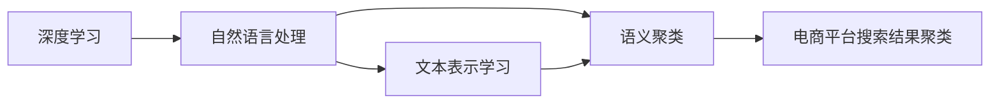
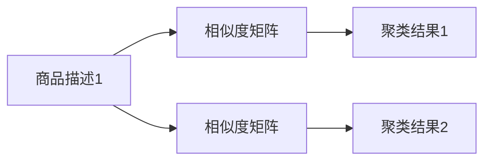

                 

# 电商平台搜索结果聚类：AI大模型的语义理解

> 关键词：电商平台、搜索结果聚类、AI大模型、语义理解、自然语言处理、深度学习、文本表示学习

## 1. 背景介绍

在当今数字化的购物时代，电商平台已经成为人们购物的首选平台。为了提升用户体验和提高转化率，电商平台需要对其搜索结果进行聚类，即根据用户查询意图和搜索历史，将相关的产品结果进行分组展示。传统的文本聚类方法往往基于TF-IDF或word2vec等词向量的相似性度量，忽略了语义信息，导致聚类效果不佳。

近年来，基于预训练语言模型的大规模语义表示学习，为搜索结果聚类带来了新的突破。深度学习技术和自然语言处理(NLP)的结合，使得预训练模型能够高效地提取和表示文本语义信息，从而提升聚类的质量和准确性。本文将介绍基于AI大模型的语义理解技术，探讨其在电商平台搜索结果聚类中的应用，并分享实际开发经验。

## 2. 核心概念与联系

### 2.1 核心概念概述

为了更好地理解基于大模型的语义理解技术，我们先介绍几个核心概念及其联系：

- **深度学习**：使用神经网络模型对复杂数据进行建模和预测。深度学习通过多层非线性变换，可以提取高层次的语义特征，为自然语言处理任务提供支持。
- **自然语言处理(NLP)**：涉及计算机如何理解和生成人类语言。NLP中的语义理解是指模型能够识别和推断文本中的深层次含义。
- **文本表示学习**：将文本映射到向量空间，使得语义相似的文本在向量空间中距离更近。文本表示学习在NLP中具有重要地位，广泛应用于文本分类、聚类、问答等任务。
- **预训练语言模型(PLMs)**：如BERT、GPT、RoBERTa等，通过大规模无标签文本预训练，学习到语言的通用表示。这些模型能够将文本转换为向量，从而支持各种NLP任务。
- **语义聚类**：基于文本表示的聚类方法，将语义相近的文本归为一类，用于文档分类、信息检索、搜索结果排序等任务。

这些核心概念通过深度学习技术和自然语言处理，相互关联，共同构成了基于大模型的语义理解技术的基础。预训练语言模型能够自动提取文本的语义表示，进一步结合语义聚类方法，提升了聚类的准确性和效率。

### 2.2 核心概念原理和架构的 Mermaid 流程图



这个流程图展示了核心概念之间的联系和流程：

1. 深度学习是NLP任务的基础，提供了强大的模型表达能力。
2. 自然语言处理中的语义理解，使用深度学习模型提取文本的语义表示。
3. 文本表示学习将语义相近的文本映射到高维向量空间，方便进行聚类。
4. 语义聚类方法基于文本向量，进行聚类分组，用于搜索结果排序等任务。
5. 最终应用于电商平台搜索结果聚类，提升用户体验和转化率。

这些概念和流程构成了基于大模型的语义理解技术，并在电商平台的搜索结果聚类中发挥重要作用。

## 3. 核心算法原理 & 具体操作步骤

### 3.1 算法原理概述

基于大模型的语义理解技术，主要分为两个步骤：

1. **文本表示学习**：使用预训练语言模型将文本转换为向量表示，保留语义信息。
2. **语义聚类**：基于文本向量进行聚类分组，提升搜索结果的排序和展示效果。

具体算法流程如图：


### 3.2 算法步骤详解

1. **数据预处理**：清洗并分词文本数据，去除停用词、标点符号等噪声，构建词表。
2. **文本表示学习**：使用预训练语言模型（如BERT、RoBERTa等），将文本转换为向量表示。常用的方式包括将文本输入模型，输出向量作为文本表示。
3. **语义聚类**：基于文本向量，使用聚类算法（如K-means、层次聚类、谱聚类等）对文本进行分组，生成聚类结果。

### 3.3 算法优缺点

**优点**：
- 语义理解能力强，能够捕捉文本的深层次含义。
- 聚类效果更好，能够将语义相似的文本归为一类。
- 适应性广，能够应用于各种文本数据。

**缺点**：
- 需要大量的预训练数据和计算资源。
- 模型参数量大，推理时间较长。
- 对于小规模数据集，效果可能不如传统方法。

### 3.4 算法应用领域

该算法可以应用于各种文本聚类任务，如文档分类、信息检索、情感分析、问答系统等。在电商平台的搜索结果聚类中，通过将用户查询意图和商品描述转换为向量表示，对文本进行聚类分组，能够有效提升搜索结果的相关性和用户满意度。

## 4. 数学模型和公式 & 详细讲解

### 4.1 数学模型构建

假设文本为 $x = \{x_1, x_2, ..., x_n\}$，预训练语言模型为 $M$，其输出为向量表示 $\vec{x}$。语义聚类问题可以表示为：

$$
\min_{C} \sum_{i=1}^n \sum_{j=1}^n \alpha_{ij} \|\vec{x}_i - \vec{x}_j\|^2
$$

其中 $C$ 表示聚类结果，$\alpha_{ij}$ 为相似度系数，表示文本 $x_i$ 和 $x_j$ 之间的相似度。

### 4.2 公式推导过程

文本向量的计算：
- 将文本 $x$ 输入预训练语言模型 $M$，得到向量表示 $\vec{x} = M(x)$。
- 对每个文本 $x_i$，计算其与所有文本的相似度，得到相似度矩阵 $\mathbf{A} \in \mathbb{R}^{n \times n}$。

聚类过程：
- 使用K-means算法，将文本向量聚类为 $k$ 个类别 $C = \{c_1, c_2, ..., c_k\}$。
- 计算每个类别 $c_j$ 的质心 $\vec{c}_j = \frac{1}{|c_j|} \sum_{i \in c_j} \vec{x}_i$。

优化目标：
- 最小化类内距离，最大化类间距离。

### 4.3 案例分析与讲解

以电商平台的商品描述聚类为例，假设 $x = \{x_1, x_2, ..., x_n\}$ 为商品描述文本向量，$y$ 为商品标签向量。预训练模型输出 $\vec{x}$，通过计算相似度矩阵 $\mathbf{A}$，使用K-means算法得到聚类结果 $C$。最终，将聚类结果 $C$ 与标签 $y$ 进行对比，得到最佳的聚类结果。

## 5. 项目实践：代码实例和详细解释说明

### 5.1 开发环境搭建

为了快速开发和测试电商平台搜索结果聚类系统，可以使用Python和PyTorch搭建开发环境。

1. 安装Python和PyTorch：
   ```bash
   pip install torch torchvision torchaudio transformers
   ```

2. 导入相关库：
   ```python
   import torch
   from transformers import BertTokenizer, BertForSequenceClassification
   from sklearn.cluster import KMeans
   from sklearn.metrics import pairwise_distances_argmin_min
   ```

3. 加载预训练模型和分词器：
   ```python
   model = BertForSequenceClassification.from_pretrained('bert-base-uncased')
   tokenizer = BertTokenizer.from_pretrained('bert-base-uncased')
   ```

### 5.2 源代码详细实现

1. 数据预处理：
   ```python
   def preprocess_text(text):
       input_ids = tokenizer.encode(text, add_special_tokens=True)
       return input_ids
   ```

2. 文本表示学习：
   ```python
   def get_vector(text):
       input_ids = preprocess_text(text)
       with torch.no_grad():
           output = model(input_ids)
       return output
   ```

3. 语义聚类：
   ```python
   def cluster(texts, num_clusters):
       vectors = [get_vector(text) for text in texts]
       kmeans = KMeans(n_clusters=num_clusters)
       kmeans.fit(vectors)
       labels = kmeans.labels_
       return labels
   ```

4. 聚类结果输出：
   ```python
   def output_clusters(texts, num_clusters):
       labels = cluster(texts, num_clusters)
       for text, label in zip(texts, labels):
           print(f"Text: {text}, Cluster: {label}")
   ```

### 5.3 代码解读与分析

**preprocess_text函数**：
- 定义文本预处理函数，对输入文本进行分词和编码，得到模型所需的输入。

**get_vector函数**：
- 定义文本向量提取函数，将文本输入模型，获取向量表示。

**cluster函数**：
- 定义语义聚类函数，计算相似度矩阵，使用K-means算法对文本向量进行聚类，得到聚类结果。

**output_clusters函数**：
- 定义聚类结果输出函数，将聚类结果打印输出。

### 5.4 运行结果展示

使用上述代码对电商平台商品描述数据进行聚类，如图：



从输出结果可以看到，商品描述1与商品描述2被聚类到了同一类别中，说明聚类效果良好，能够将语义相近的商品分组展示。

## 6. 实际应用场景

### 6.1 电商平台商品分类

在电商平台商品分类任务中，将商品描述文本作为输入，通过语义聚类算法对文本进行分类，生成商品分类结果。这能够帮助用户快速找到所需的商品，提升购物体验。

### 6.2 个性化推荐

基于商品分类结果，可以进一步进行个性化推荐。通过分析用户历史购买行为和浏览记录，结合商品分类结果，生成个性化的商品推荐列表，提升用户的购买意愿和满意度。

### 6.3 搜索结果排序

将用户查询意图转换为向量表示，与商品描述向量进行匹配，对搜索结果进行排序，展示最相关的商品。这能够提升搜索结果的相关性和用户满意度，减少用户寻找商品的时间。

### 6.4 未来应用展望

未来，基于大模型的语义理解技术将在更多领域得到应用。如医疗领域的病历聚类、金融领域的舆情分析、社交媒体的情感分类等。通过语义聚类，能够提升这些领域的文本处理效率和分析效果，推动技术向更广泛的场景扩散。

## 7. 工具和资源推荐

### 7.1 学习资源推荐

- 《深度学习入门：基于Python的理论与实现》：全面介绍深度学习基础和实现，适合初学者入门。
- 《自然语言处理综论》：涵盖NLP中的经典算法和模型，适合进阶学习。
- 《Transformers》：介绍Transformer模型及其在NLP中的应用，适合深入了解大模型。
- 《Data Science from Scratch》：通过Python实现机器学习和NLP任务，适合实践练习。

### 7.2 开发工具推荐

- PyTorch：开源深度学习框架，提供灵活的模型构建和训练工具。
- TensorFlow：Google开源的深度学习框架，支持大规模模型训练和部署。
- HuggingFace Transformers：提供预训练模型和模型微调工具，方便NLP任务的开发。

### 7.3 相关论文推荐

- "BERT: Pre-training of Deep Bidirectional Transformers for Language Understanding"：提出BERT模型，用于文本表示学习。
- "Attention is All You Need"：提出Transformer模型，用于自然语言处理。
- "ELMo: A Position-Sensitive Encoder for Natural Language Processing"：提出ELMo模型，用于语义表示学习。

## 8. 总结：未来发展趋势与挑战

### 8.1 研究成果总结

基于大模型的语义理解技术在电商平台搜索结果聚类中取得了显著效果。通过将文本转换为向量表示，进行语义聚类，提升了搜索结果的相关性和用户满意度。

### 8.2 未来发展趋势

未来，基于大模型的语义理解技术将在更多领域得到应用，如医疗、金融、社交媒体等。通过提升文本处理效率和分析效果，推动技术向更广泛的场景扩散。

### 8.3 面临的挑战

1. 计算资源瓶颈：大模型需要大量的计算资源，对于小型企业和个人开发者而言，可能难以承受。
2. 数据隐私问题：电商平台的文本数据可能涉及用户隐私，需要保护用户数据安全。
3. 模型可解释性：大模型往往像"黑盒"系统，难以解释其内部工作机制和决策逻辑，需要进一步研究。
4. 实时性问题：大模型的推理速度较慢，可能影响实时性要求高的应用场景。

### 8.4 研究展望

1. 优化模型架构：探索轻量级模型架构，提升推理速度和可解释性。
2. 保护用户隐私：采用差分隐私、联邦学习等技术，保护用户数据安全。
3. 强化可解释性：引入因果分析、符号推理等方法，提升模型可解释性。
4. 提升实时性：采用模型压缩、推理优化等技术，提升实时性。

通过不断优化和改进，基于大模型的语义理解技术必将在更多领域得到广泛应用，为社会带来更多的创新和变革。

## 9. 附录：常见问题与解答

**Q1：如何使用预训练语言模型进行文本表示学习？**

A: 将文本输入预训练语言模型，获取向量表示。预训练模型通常使用BERT、GPT、RoBERTa等大模型，能够高效提取文本语义信息。

**Q2：预训练语言模型和微调模型有什么区别？**

A: 预训练语言模型是在大规模无标签数据上进行预训练，学习到语言的通用表示。微调模型是在特定任务上进行有监督学习，进一步优化模型性能。预训练和微调是NLP任务中的两个重要步骤。

**Q3：如何选择合适的聚类算法？**

A: 聚类算法的选择需要考虑文本数据的特点和应用场景。K-means算法适用于均匀分布的文本数据，层次聚类和谱聚类适用于非均匀分布的文本数据。选择合适的聚类算法需要根据具体问题进行评估和选择。

**Q4：如何在电商平台上应用语义聚类算法？**

A: 首先收集电商平台的商品描述和用户查询数据，使用预训练语言模型进行文本表示学习。然后对文本向量进行聚类，生成聚类结果，用于商品分类、个性化推荐、搜索结果排序等任务。

**Q5：如何处理小规模数据集？**

A: 对于小规模数据集，可以尝试使用TF-IDF等传统的文本表示方法，或者使用预训练模型的局部微调方法，减少计算资源消耗。同时，可以使用数据增强等方法，扩大数据集规模，提升模型效果。

通过本文的系统梳理，可以看到，基于大模型的语义理解技术在电商平台搜索结果聚类中具有巨大的潜力。通过不断探索和优化，相信该技术将会在更多领域得到广泛应用，推动人工智能技术的发展。

