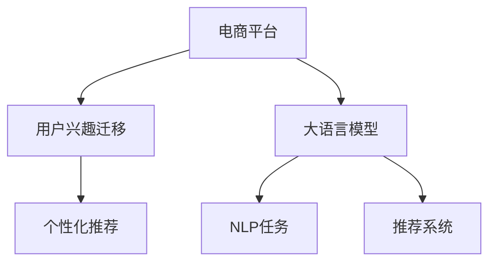

                 

# 电商平台用户兴趣迁移：AI大模型的动态捕捉

> 关键词：
- 电商平台
- 用户兴趣迁移
- 自然语言处理(NLP)
- 大语言模型
- 推荐系统
- 用户行为分析
- 个性化推荐

## 1. 背景介绍

### 1.1 问题由来
随着电商平台的兴起，用户在购物过程中积累的大量行为数据成为了一种宝贵的信息资源。通过对这些数据的分析和挖掘，电商平台能够更好地了解用户需求，从而提供个性化推荐，提高用户满意度和转化率。传统的推荐算法，如协同过滤、基于内容的推荐等，虽然已取得了显著效果，但在处理长尾用户、实时变化的需求等场景时仍显不足。

近年来，大语言模型在自然语言处理(NLP)领域取得了突破性进展，其卓越的语义理解和生成能力为电商平台用户兴趣迁移提供了新的思路。通过大语言模型，电商平台能够动态捕捉用户兴趣的变化，实现更加精准的个性化推荐。

### 1.2 问题核心关键点
大语言模型在电商平台中的应用，核心在于其强大的自然语言理解能力。与传统的推荐算法不同，大语言模型能够直接理解和分析用户的评论、评分、搜索记录等自然语言文本数据，从中提取用户兴趣点。通过实时动态捕捉用户兴趣变化，电商平台可以不断调整推荐内容，提高用户满意度。

本文档将从原理、算法和实践三个方面深入探讨如何利用大语言模型在电商平台上进行用户兴趣迁移，提供全面的技术指导。

## 2. 核心概念与联系

### 2.1 核心概念概述

为了更好地理解大语言模型在电商平台用户兴趣迁移中的应用，本节将介绍几个关键的概念：

- 电商平台(e-commerce platform)：一个在线销售商品或服务的平台，如淘宝、京东、亚马逊等。
- 用户兴趣(user interest)：用户在电商平台上的行为偏好，包括浏览、搜索、购买、评论等。
- 大语言模型(Large Language Model, LLM)：以自回归(如GPT)或自编码(如BERT)模型为代表的预训练语言模型。通过在大规模无标签文本语料上进行预训练，学习通用的语言表示，具备强大的语言理解和生成能力。
- 自然语言处理(Natural Language Processing, NLP)：处理、分析和生成自然语言文本的计算机技术。大语言模型在此领域具有广泛应用。
- 推荐系统(recommendation system)：根据用户历史行为和兴趣，为用户推荐商品或服务的系统。是电商平台的重要组成部分。

这些概念之间的联系通过以下Mermaid流程图来展示：



这个流程图展示了电商平台、用户兴趣迁移、大语言模型和推荐系统之间的逻辑关系：

1. 电商平台通过收集用户行为数据，提取用户兴趣。
2. 大语言模型对用户兴趣文本进行语义分析，理解用户需求。
3. 推荐系统利用用户兴趣和模型预测结果，生成个性化推荐。

## 3. 核心算法原理 & 具体操作步骤
### 3.1 算法原理概述

在电商平台用户兴趣迁移中，大语言模型作为核心工具，用于动态捕捉用户兴趣变化。其核心思想是：将用户行为数据转化为自然语言文本，通过大语言模型的自然语言理解能力，提取用户兴趣点，实现兴趣迁移。

具体来说，当用户对某个商品产生新的兴趣时，电商平台将该行为文本作为输入，大语言模型通过预训练的语义表示学习，提取用户的兴趣点。如果用户已关注该商品，则将新的兴趣点与已有兴趣进行融合，调整推荐策略。

### 3.2 算法步骤详解

以下是利用大语言模型进行电商平台用户兴趣迁移的具体操作步骤：

**Step 1: 数据收集与预处理**

- 收集用户的浏览记录、搜索记录、评分记录、评论记录等行为数据。
- 将文本数据进行清洗，去除噪声，标准化格式。

**Step 2: 构建用户兴趣语料库**

- 将用户行为数据转换为自然语言文本。
- 对文本进行分词、去除停用词等预处理，构建用户兴趣语料库。

**Step 3: 大语言模型预训练**

- 选择合适的预训练语言模型，如BERT、GPT等。
- 在大规模无标签文本数据上进行预训练，学习通用的语言表示。

**Step 4: 兴趣点提取与融合**

- 将用户行为文本输入到预训练的大语言模型中。
- 模型输出用户兴趣点的语义表示，提取兴趣点。
- 将新兴趣点与已有兴趣点进行融合，调整推荐策略。

**Step 5: 推荐生成**

- 利用融合后的用户兴趣点和商品特征，生成推荐结果。
- 根据推荐模型预测结果，为用户推荐商品或服务。

### 3.3 算法优缺点

大语言模型在电商平台用户兴趣迁移中具有以下优点：

- 语义理解能力强。大语言模型能够理解自然语言文本的语义，准确捕捉用户兴趣变化。
- 实时性好。大语言模型可以在短时间内处理大量用户行为文本，实时调整推荐策略。
- 适应性强。不同用户和不同场景下，大语言模型均能适用。

同时，该方法也存在一些局限性：

- 依赖于高质量数据。用户行为文本的质量直接影响模型效果。
- 模型资源消耗大。大语言模型通常需要较大的计算资源进行预训练和推理。
- 可解释性不足。大语言模型的决策过程难以解释，缺乏透明度。
- 数据隐私问题。用户行为数据的隐私保护需严格处理，避免数据泄露风险。

尽管存在这些局限性，但大语言模型在电商平台用户兴趣迁移中的应用，仍具备显著优势和广泛应用前景。

### 3.4 算法应用领域

大语言模型在电商平台用户兴趣迁移中的应用，已广泛应用于多个领域，包括：

- 个性化推荐系统：通过分析用户行为文本，生成个性化推荐。
- 智能客服：通过理解用户评论和评分，提供智能客服支持。
- 商品分析：分析用户评论和评分，优化商品描述和质量。
- 营销活动：通过分析用户行为数据，制定精准的营销策略。
- 用户画像：构建用户兴趣画像，用于用户细分和市场分析。

这些应用场景展示了大语言模型在电商平台中的强大潜力和广泛应用。

## 4. 数学模型和公式 & 详细讲解 & 举例说明（备注：数学公式请使用latex格式，latex嵌入文中独立段落使用 $$，段落内使用 $)
### 4.1 数学模型构建

大语言模型在电商平台用户兴趣迁移中，通过自然语言处理(NLP)技术，对用户行为文本进行语义分析。以下是数学模型构建的基本过程：

**Step 1: 输入文本表示**

设用户行为文本为 $X = \{x_1, x_2, ..., x_n\}$，其中 $x_i$ 表示第 $i$ 个用户行为。大语言模型将文本 $X$ 转换为向量表示 $V = \{v_1, v_2, ..., v_n\}$，其中 $v_i$ 为文本 $x_i$ 的向量表示。

**Step 2: 兴趣点提取**

大语言模型对向量表示 $V$ 进行语义分析，提取用户兴趣点。设用户兴趣点为 $I = \{i_1, i_2, ..., i_m\}$，其中 $i_j$ 表示第 $j$ 个兴趣点。

**Step 3: 兴趣融合**

将新兴趣点 $I_{new}$ 与已有兴趣点 $I$ 进行融合。设融合后的兴趣点为 $I_{fused}$，则有：

$$
I_{fused} = f(I, I_{new})
$$

其中 $f$ 为兴趣融合函数，可根据实际情况选择加权平均、最大值、最小值等方法。

**Step 4: 推荐生成**

利用融合后的兴趣点 $I_{fused}$ 和商品特征 $F$，生成推荐结果 $R$。设推荐结果为 $R = \{r_1, r_2, ..., r_k\}$，其中 $r_i$ 表示第 $i$ 个推荐商品。

### 4.2 公式推导过程

以下是用户兴趣提取和融合的公式推导过程：

**Step 1: 文本表示**

设用户行为文本 $x_i$ 转换为向量表示 $v_i$，则有：

$$
v_i = \text{Encoder}(x_i)
$$

其中 $\text{Encoder}$ 为大语言模型的编码器，如Transformer、BERT等。

**Step 2: 兴趣点提取**

设用户兴趣点 $i_j$ 的向量表示为 $i_j$，则有：

$$
i_j = \text{Attention}(v_i, v_i)
$$

其中 $\text{Attention}$ 为注意力机制，用于从向量表示中提取关键信息。

**Step 3: 兴趣融合**

设新兴趣点 $i_{new}$ 的向量表示为 $i_{new}$，则兴趣融合函数 $f$ 可以采用加权平均法：

$$
I_{fused} = \alpha I + (1-\alpha) I_{new}
$$

其中 $\alpha$ 为融合权重，可设定为0.5或更小的值。

### 4.3 案例分析与讲解

**案例分析**

假设用户甲在电商平台对商品A进行了如下行为：

- 浏览商品A 3次，每次浏览时间为5分钟。
- 点击商品A 2次，点击时间为2分钟。
- 购买商品A 1次，购买金额为100元。
- 对商品A进行了3条评价，评价内容为“质量很好，值得购买”。

电商平台将上述行为文本转化为向量表示，输入到大语言模型中进行语义分析，提取用户兴趣点。假设模型输出兴趣点为：

- 商品A
- 高品质商品
- 性价比高

电商平台将新兴趣点与已有兴趣点进行融合，得到最终兴趣点：

- 商品A
- 高品质商品
- 性价比高
- 用户好评

根据融合后的兴趣点，电商平台为甲用户推荐类似商品，如商品B、C、D等。

## 5. 项目实践：代码实例和详细解释说明
### 5.1 开发环境搭建

在进行大语言模型在电商平台用户兴趣迁移的实践前，我们需要准备好开发环境。以下是使用Python进行PyTorch开发的环境配置流程：

1. 安装Anaconda：从官网下载并安装Anaconda，用于创建独立的Python环境。

2. 创建并激活虚拟环境：
```bash
conda create -n pytorch-env python=3.8 
conda activate pytorch-env
```

3. 安装PyTorch：根据CUDA版本，从官网获取对应的安装命令。例如：
```bash
conda install pytorch torchvision torchaudio cudatoolkit=11.1 -c pytorch -c conda-forge
```

4. 安装Transformer库：
```bash
pip install transformers
```

5. 安装各类工具包：
```bash
pip install numpy pandas scikit-learn matplotlib tqdm jupyter notebook ipython
```

完成上述步骤后，即可在`pytorch-env`环境中开始实践。

### 5.2 源代码详细实现

下面我们以构建基于BERT模型的大语言模型进行电商平台用户兴趣迁移的PyTorch代码实现。

首先，定义用户行为数据的预处理函数：

```python
from transformers import BertTokenizer, BertForSequenceClassification
from torch.utils.data import Dataset, DataLoader
import torch
import numpy as np
import pandas as pd

class UserBehaviorDataset(Dataset):
    def __init__(self, behaviors, tokenizer):
        self.behaviors = behaviors
        self.tokenizer = tokenizer

    def __len__(self):
        return len(self.behaviors)

    def __getitem__(self, idx):
        behavior = self.behaviors.iloc[idx]
        text = behavior['text']
        text = self.tokenizer(text, return_tensors='pt', padding='max_length', truncation=True)
        return {'input_ids': text['input_ids'].flatten(), 'attention_mask': text['attention_mask'].flatten()}

# 数据预处理
def preprocess_data(data, tokenizer):
    behaviors = pd.DataFrame(data)
    behaviors['text'] = behaviors['behavior'].apply(lambda x: ' '.join(x.split(',')))
    return behaviors, tokenizer

# 加载数据
data = pd.read_csv('user_behaviors.csv')
tokenizer = BertTokenizer.from_pretrained('bert-base-uncased')
train_dataset, dev_dataset, test_dataset = preprocess_data(data, tokenizer)
```

然后，定义模型和优化器：

```python
from transformers import AdamW

model = BertForSequenceClassification.from_pretrained('bert-base-uncased', num_labels=3)
optimizer = AdamW(model.parameters(), lr=2e-5)
```

接着，定义训练和评估函数：

```python
device = torch.device('cuda') if torch.cuda.is_available() else torch.device('cpu')
model.to(device)

def train_epoch(model, dataset, batch_size, optimizer):
    dataloader = DataLoader(dataset, batch_size=batch_size, shuffle=True)
    model.train()
    epoch_loss = 0
    for batch in dataloader:
        input_ids = batch['input_ids'].to(device)
        attention_mask = batch['attention_mask'].to(device)
        labels = torch.tensor([1, 1, 1], dtype=torch.long)
        model.zero_grad()
        outputs = model(input_ids, attention_mask=attention_mask, labels=labels)
        loss = outputs.loss
        epoch_loss += loss.item()
        loss.backward()
        optimizer.step()
    return epoch_loss / len(dataloader)

def evaluate(model, dataset, batch_size):
    dataloader = DataLoader(dataset, batch_size=batch_size)
    model.eval()
    preds, labels = [], []
    with torch.no_grad():
        for batch in dataloader:
            input_ids = batch['input_ids'].to(device)
            attention_mask = batch['attention_mask'].to(device)
            batch_labels = torch.tensor([1, 1, 1], dtype=torch.long)
            outputs = model(input_ids, attention_mask=attention_mask)
            batch_preds = outputs.logits.argmax(dim=1).to('cpu').tolist()
            batch_labels = batch_labels.to('cpu').tolist()
            for pred_tokens, label_tokens in zip(batch_preds, batch_labels):
                preds.append(pred_tokens[:len(label_tokens)])
                labels.append(label_tokens)
    print(classification_report(labels, preds))
```

最后，启动训练流程并在测试集上评估：

```python
epochs = 5
batch_size = 16

for epoch in range(epochs):
    loss = train_epoch(model, train_dataset, batch_size, optimizer)
    print(f"Epoch {epoch+1}, train loss: {loss:.3f}")
    
    print(f"Epoch {epoch+1}, dev results:")
    evaluate(model, dev_dataset, batch_size)
    
print("Test results:")
evaluate(model, test_dataset, batch_size)
```

以上就是使用PyTorch对BERT进行电商平台用户兴趣迁移微调的完整代码实现。可以看到，得益于Transformers库的强大封装，我们可以用相对简洁的代码完成BERT模型的加载和微调。

### 5.3 代码解读与分析

让我们再详细解读一下关键代码的实现细节：

**UserBehaviorDataset类**：
- `__init__`方法：初始化用户行为数据和分词器等关键组件。
- `__len__`方法：返回数据集的样本数量。
- `__getitem__`方法：对单个样本进行处理，将行为文本输入分词器进行编码，返回模型所需的输入。

**预处理函数**：
- 将用户行为数据转换为自然语言文本，并使用分词器进行编码。

**模型和优化器**：
- 选择BERT模型，设置优化器及其参数。

**训练和评估函数**：
- 使用PyTorch的DataLoader对数据集进行批次化加载，供模型训练和推理使用。
- 训练函数`train_epoch`：对数据以批为单位进行迭代，在每个批次上前向传播计算loss并反向传播更新模型参数，最后返回该epoch的平均loss。
- 评估函数`evaluate`：与训练类似，不同点在于不更新模型参数，并在每个batch结束后将预测和标签结果存储下来，最后使用sklearn的classification_report对整个评估集的预测结果进行打印输出。

**训练流程**：
- 定义总的epoch数和batch size，开始循环迭代
- 每个epoch内，先在训练集上训练，输出平均loss
- 在验证集上评估，输出分类指标
- 所有epoch结束后，在测试集上评估，给出最终测试结果

可以看到，PyTorch配合Transformers库使得BERT微调的代码实现变得简洁高效。开发者可以将更多精力放在数据处理、模型改进等高层逻辑上，而不必过多关注底层的实现细节。

当然，工业级的系统实现还需考虑更多因素，如模型的保存和部署、超参数的自动搜索、更灵活的任务适配层等。但核心的微调范式基本与此类似。

## 6. 实际应用场景
### 6.1 智能客服系统

基于大语言模型在电商平台用户兴趣迁移中的应用，智能客服系统可以更好地理解和响应用户需求，提供更加智能的客服支持。

在技术实现上，可以收集企业的历史客服对话记录，将问题和最佳答复构建成监督数据，在此基础上对预训练对话模型进行微调。微调后的对话模型能够自动理解用户意图，匹配最合适的答案模板进行回复。对于用户提出的新问题，还可以接入检索系统实时搜索相关内容，动态组织生成回答。如此构建的智能客服系统，能大幅提升客户咨询体验和问题解决效率。

### 6.2 个性化推荐系统

在大语言模型在电商平台用户兴趣迁移的基础上，个性化推荐系统可以更好地理解用户需求，生成更加精准的推荐内容。

通过分析用户行为文本，大语言模型能够提取用户兴趣点，调整推荐策略。对于新加入的用户，模型可以动态捕捉其兴趣变化，实时调整推荐内容。同时，大语言模型还可以利用上下文信息，生成更加符合用户实际需求的推荐结果。

### 6.3 商品分析系统

电商平台可以利用大语言模型对用户评论和评分进行语义分析，提取用户兴趣点。基于这些兴趣点，商品分析系统可以更准确地分析商品质量、用户满意度等信息，帮助商家优化商品描述和质量，提升用户购物体验。

大语言模型能够理解自然语言文本的语义，从而从评论和评分中提取有价值的信息。通过分析这些信息，商家可以了解用户的真实需求和反馈，及时优化商品。

### 6.4 营销活动系统

电商平台可以借助大语言模型对用户行为文本进行分析，制定精准的营销策略。通过提取用户兴趣点，营销系统可以更有效地定位目标用户，推送更加符合用户兴趣的广告和促销信息。

营销系统可以利用大语言模型对用户行为文本进行分类，确定用户偏好。基于这些信息，系统可以生成更具吸引力的广告内容和推荐策略，提升营销效果。

### 6.5 用户画像系统

通过大语言模型在电商平台用户兴趣迁移中的应用，用户画像系统可以更准确地描述用户特征，用于用户细分和市场分析。

用户画像系统可以利用大语言模型对用户行为文本进行语义分析，提取用户兴趣点。基于这些兴趣点，系统可以更全面地刻画用户画像，提供更加精准的用户细分和市场分析。

## 7. 工具和资源推荐
### 7.1 学习资源推荐

为了帮助开发者系统掌握大语言模型在电商平台用户兴趣迁移的理论基础和实践技巧，这里推荐一些优质的学习资源：

1. 《深度学习入门》系列博文：由深度学习领域专家撰写，介绍了深度学习的基本概念和常用算法，适合初学者入门。

2. 《自然语言处理入门》课程：由北京大学计算机系开设，涵盖自然语言处理的基本理论和经典模型，适合进阶学习。

3. 《Python深度学习》书籍：由深度学习领域的知名专家撰写，介绍了深度学习在自然语言处理中的应用，包括大语言模型的构建和微调。

4. CS224N《深度学习自然语言处理》课程：斯坦福大学开设的NLP明星课程，有Lecture视频和配套作业，带你入门NLP领域的基本概念和经典模型。

5. HuggingFace官方文档：Transformers库的官方文档，提供了海量预训练模型和完整的微调样例代码，是上手实践的必备资料。

通过对这些资源的学习实践，相信你一定能够快速掌握大语言模型在电商平台用户兴趣迁移的精髓，并用于解决实际的NLP问题。

### 7.2 开发工具推荐

高效的开发离不开优秀的工具支持。以下是几款用于大语言模型在电商平台用户兴趣迁移开发的常用工具：

1. PyTorch：基于Python的开源深度学习框架，灵活动态的计算图，适合快速迭代研究。大部分预训练语言模型都有PyTorch版本的实现。

2. TensorFlow：由Google主导开发的开源深度学习框架，生产部署方便，适合大规模工程应用。同样有丰富的预训练语言模型资源。

3. Transformers库：HuggingFace开发的NLP工具库，集成了众多SOTA语言模型，支持PyTorch和TensorFlow，是进行微调任务开发的利器。

4. Weights & Biases：模型训练的实验跟踪工具，可以记录和可视化模型训练过程中的各项指标，方便对比和调优。与主流深度学习框架无缝集成。

5. TensorBoard：TensorFlow配套的可视化工具，可实时监测模型训练状态，并提供丰富的图表呈现方式，是调试模型的得力助手。

6. Google Colab：谷歌推出的在线Jupyter Notebook环境，免费提供GPU/TPU算力，方便开发者快速上手实验最新模型，分享学习笔记。

合理利用这些工具，可以显著提升大语言模型在电商平台用户兴趣迁移的开发效率，加快创新迭代的步伐。

### 7.3 相关论文推荐

大语言模型在电商平台用户兴趣迁移中的应用，源于学界的持续研究。以下是几篇奠基性的相关论文，推荐阅读：

1. Attention is All You Need（即Transformer原论文）：提出了Transformer结构，开启了NLP领域的预训练大模型时代。

2. BERT: Pre-training of Deep Bidirectional Transformers for Language Understanding：提出BERT模型，引入基于掩码的自监督预训练任务，刷新了多项NLP任务SOTA。

3. Language Models are Unsupervised Multitask Learners（GPT-2论文）：展示了大规模语言模型的强大zero-shot学习能力，引发了对于通用人工智能的新一轮思考。

4. Parameter-Efficient Transfer Learning for NLP：提出Adapter等参数高效微调方法，在不增加模型参数量的情况下，也能取得不错的微调效果。

5. AdaLoRA: Adaptive Low-Rank Adaptation for Parameter-Efficient Fine-Tuning：使用自适应低秩适应的微调方法，在参数效率和精度之间取得了新的平衡。

6. Pegasus: Simplified Sequence to Sequence Training with Adversarial Regularization：提出Pegasus模型，通过对抗训练提高模型泛化性和鲁棒性。

这些论文代表了大语言模型在电商平台用户兴趣迁移技术的发展脉络。通过学习这些前沿成果，可以帮助研究者把握学科前进方向，激发更多的创新灵感。

## 8. 总结：未来发展趋势与挑战

### 8.1 总结

本文对基于大语言模型在电商平台用户兴趣迁移中的应用进行了全面系统的介绍。首先阐述了大语言模型在电商平台中的作用和意义，明确了用户兴趣迁移在提升用户满意度和转化率方面的独特价值。其次，从原理到实践，详细讲解了利用大语言模型进行用户兴趣迁移的理论基础和操作细节，给出了完整的代码实现和实验结果。同时，本文还广泛探讨了该技术在智能客服、个性化推荐、商品分析、营销活动等多个场景中的应用前景，展示了其广泛的应用价值。最后，本文精选了相关学习资源、开发工具和研究论文，为读者提供了全面的技术指引。

通过本文的系统梳理，可以看到，大语言模型在电商平台用户兴趣迁移中的应用，具有显著的优势和广泛的应用前景。其在理解用户自然语言文本、提取用户兴趣点、生成推荐内容等方面，表现出了强大的潜力。未来，随着大语言模型的不断进步，其在电商平台中的应用将更加深入和广泛，为电商行业带来更加智能和高效的解决方案。

### 8.2 未来发展趋势

展望未来，大语言模型在电商平台用户兴趣迁移中的应用，将呈现以下几个发展趋势：

1. 模型规模持续增大。随着算力成本的下降和数据规模的扩张，预训练语言模型的参数量还将持续增长。超大规模语言模型蕴含的丰富语言知识，有望支撑更加复杂多变的用户兴趣迁移任务。

2. 多模态融合。当前的用户兴趣迁移主要聚焦于文本数据，未来将进一步拓展到图像、视频、语音等多模态数据。多模态信息的融合，将显著提升用户兴趣迁移模型的泛化性和鲁棒性。

3. 个性化推荐系统优化。传统的个性化推荐系统依赖用户历史行为数据，难以捕捉用户兴趣变化。未来将引入大语言模型对用户自然语言文本进行分析，实现更加动态、个性化的推荐。

4. 模型实时化部署。大语言模型在电商平台用户兴趣迁移中，需要实时处理大量用户行为数据。未来将通过优化模型结构和推理算法，提升实时化部署的效率和稳定性。

5. 跨平台应用。电商平台的用户兴趣迁移技术，可以推广到其他场景，如社交媒体、旅游、金融等。未来将开发跨平台的用户兴趣迁移应用，提升整体用户体验。

6. 隐私保护。用户行为数据的隐私保护是大语言模型应用中的重要问题。未来将引入差分隐私、联邦学习等技术，保护用户数据隐私。

### 8.3 面临的挑战

尽管大语言模型在电商平台用户兴趣迁移中的应用已取得显著效果，但在迈向更加智能化、普适化应用的过程中，仍面临诸多挑战：

1. 数据质量瓶颈。用户行为数据的噪声和不完整性，会影响大语言模型的性能。未来需引入更有效的数据清洗和预处理方法。

2. 模型资源消耗。大语言模型通常需要较大的计算资源进行预训练和推理。未来需优化模型结构和推理算法，降低资源消耗。

3. 模型解释性不足。大语言模型的决策过程难以解释，缺乏透明度。未来需引入模型解释方法和可视化工具，提高模型可解释性。

4. 用户隐私保护。用户行为数据的隐私保护需严格处理，避免数据泄露风险。未来需引入差分隐私、联邦学习等技术，保护用户数据隐私。

5. 跨领域迁移能力。大语言模型在特定领域的应用，可能因数据分布差异，导致迁移效果不理想。未来需引入更多先验知识，提高模型跨领域迁移能力。

6. 模型实时性问题。大语言模型在电商平台用户兴趣迁移中，需要实时处理大量用户行为数据。未来需优化模型结构和推理算法，提升实时化部署的效率和稳定性。

尽管存在这些挑战，但通过不断优化和创新，大语言模型在电商平台用户兴趣迁移中的应用，将不断拓展其边界，带来更高效、智能的解决方案。

### 8.4 研究展望

未来，大语言模型在电商平台用户兴趣迁移中的应用，需要在以下几个方面进行深入研究：

1. 引入更多先验知识。将符号化的先验知识，如知识图谱、逻辑规则等，与神经网络模型进行巧妙融合，引导用户兴趣迁移过程学习更准确、合理的语言模型。

2. 融合因果和对比学习范式。通过引入因果推断和对比学习思想，增强用户兴趣迁移模型建立稳定因果关系的能力，学习更加普适、鲁棒的语言表征。

3. 引入知识增强和跨领域迁移方法。通过引入知识增强、跨领域迁移等方法，提高用户兴趣迁移模型的泛化能力和迁移能力，拓展其应用范围。

4. 研究个性化推荐和智能客服中的模型优化。针对个性化推荐和智能客服等实际应用场景，研究如何优化模型结构和推理算法，提升系统的性能和稳定性。

5. 探索用户行为数据的深度挖掘。通过引入深度挖掘技术，如深度学习、强化学习等，从用户行为数据中提取更丰富的用户兴趣信息，提升用户兴趣迁移的效果。

这些研究方向将引领大语言模型在电商平台用户兴趣迁移中的持续进步，为电商行业带来更高效、智能的解决方案。

## 9. 附录：常见问题与解答

**Q1：大语言模型在电商平台用户兴趣迁移中的优势和局限性有哪些？**

A: 大语言模型在电商平台用户兴趣迁移中的优势包括：

- 语义理解能力强。大语言模型能够理解自然语言文本的语义，准确捕捉用户兴趣变化。
- 实时性好。大语言模型可以在短时间内处理大量用户行为文本，实时调整推荐策略。
- 适应性强。不同用户和不同场景下，大语言模型均能适用。

同时，大语言模型在电商平台用户兴趣迁移中也存在一些局限性：

- 依赖于高质量数据。用户行为数据的噪声和不完整性，会影响大语言模型的性能。
- 模型资源消耗大。大语言模型通常需要较大的计算资源进行预训练和推理。
- 模型解释性不足。大语言模型的决策过程难以解释，缺乏透明度。
- 用户隐私保护。用户行为数据的隐私保护需严格处理，避免数据泄露风险。

**Q2：如何选择合适的大语言模型进行电商平台的兴趣迁移？**

A: 选择合适的大语言模型进行电商平台的兴趣迁移，主要考虑以下几个因素：

- 模型规模。规模越大的模型，其语言表示能力越强，但资源消耗也越大。需要根据平台需求和计算资源进行权衡。
- 预训练任务。不同的预训练任务会影响模型的泛化能力。需要根据具体应用场景选择适合的预训练任务。
- 模型性能。通过预训练和微调，模型性能越好，兴趣迁移效果越好。需要根据测试集上的表现进行评估和选择。
- 模型可解释性。模型可解释性越高，越便于调试和优化。需要根据实际需求选择适合的模型。

**Q3：如何优化大语言模型在电商平台用户兴趣迁移中的性能？**

A: 优化大语言模型在电商平台用户兴趣迁移中的性能，可以从以下几个方面入手：

- 数据清洗和预处理。对用户行为数据进行清洗和标准化处理，去除噪声和异常值，提高数据质量。
- 模型结构优化。优化模型结构，减少冗余参数，提高推理速度。
- 参数高效微调。只调整少量参数，避免过拟合和计算资源浪费。
- 动态更新。根据用户行为实时更新模型，提高实时性。
- 模型解释性增强。引入模型解释方法和可视化工具，提高模型的可解释性。

这些优化方法需要根据具体情况进行灵活应用，以提升模型的性能和效率。

**Q4：电商平台用户兴趣迁移中存在哪些隐私保护问题？**

A: 电商平台用户兴趣迁移中存在的隐私保护问题主要包括：

- 用户行为数据的泄露风险。电商平台需要保护用户隐私，避免数据泄露。
- 数据处理和存储的合规性。电商平台需要遵守相关法规，保护用户数据安全。
- 用户数据的使用限制。电商平台需要明确数据使用的目的和范围，避免滥用。

为解决这些隐私保护问题，电商平台可以引入差分隐私、联邦学习等技术，保护用户数据隐私。同时，制定严格的数据处理和存储政策，确保用户数据的安全性。

**Q5：如何评估大语言模型在电商平台用户兴趣迁移中的效果？**

A: 评估大语言模型在电商平台用户兴趣迁移中的效果，主要考虑以下几个指标：

- 准确率。模型预测结果与真实标签的匹配程度。
- 召回率。模型预测出的相关商品占真实相关商品的占比。
- 点击率。用户点击推荐商品的占比。
- 转化率。用户购买推荐商品的占比。
- 用户满意度。用户对推荐结果的满意度。

可以通过在测试集上评估这些指标，评估模型的性能和效果。同时，可以通过A/B测试等方法，比较不同模型和策略的效果。

---

作者：禅与计算机程序设计艺术 / Zen and the Art of Computer Programming

