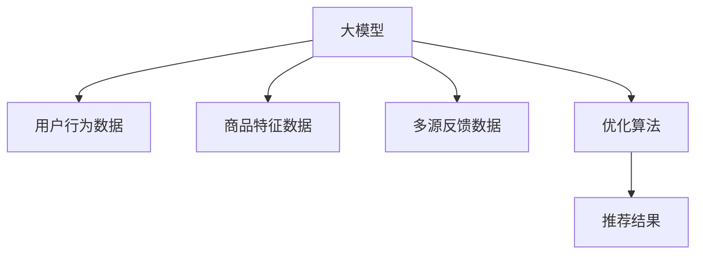

                 

# 电商平台的AI 大模型应用：搜索推荐系统是核心，用户体验优化是关键

## 1. 背景介绍

随着人工智能(AI)技术的迅猛发展，电商平台逐渐将AI大模型作为核心技术手段，以提升用户体验和业务效率。其中，搜索推荐系统(Search and Recommendation System, SRS)作为电商平台的核心应用之一，通过理解用户需求并精准推荐商品，极大地提升了用户的购物体验和平台流量。

本文章旨在探讨电商平台的AI大模型应用，重点关注搜索推荐系统的核心技术实现和用户体验优化的关键。通过详细阐述搜索推荐系统的算法原理、操作步骤、数学模型和实例代码，帮助读者深入理解搜索推荐系统的应用机制。同时，文章也将分享实际应用场景和未来发展趋势，以便为电商平台的AI大模型应用提供实用的技术参考和实践指导。

## 2. 核心概念与联系

### 2.1 核心概念概述

在进行搜索推荐系统设计前，我们需要先了解几个关键概念：

- 搜索推荐系统(SRS)：一种智能信息检索系统，基于用户的查询历史、行为数据、社交网络等多元信息，预测用户可能感兴趣的商品或内容，并提供个性化的推荐。
- 深度学习模型(Deep Learning Models)：一类使用多层神经网络结构进行学习的算法，常用于处理大规模非结构化数据。
- 电商推荐算法(Electronic Commerce Recommendation Algorithms)：专门针对电商平台场景，通过理解用户的购物意图和行为模式，进行个性化商品推荐。
- 用户体验(User Experience, UX)：用户与电商平台交互过程中产生的感知、情绪和行为等主观体验，直接影响了用户的满意度和忠诚度。
- 模型融合(Model Fusion)：将多种推荐算法、数据源、反馈机制等综合融合，提升推荐系统的综合性能和鲁棒性。

### 2.2 核心概念联系

基于上述核心概念，我们可以构建一个搜索推荐系统的整体架构，如下图所示。这个架构基于大模型进行用户行为分析和商品特征提取，同时引入多模态数据和多源反馈，最终通过优化算法生成推荐结果。



在这个架构中，大模型作为核心组件，负责分析用户行为和商品特征，预测用户可能感兴趣的商品。多源反馈数据用于实时优化推荐结果，用户体验则通过优化算法进行持续改进，最终实现用户满意度的提升。

## 3. 核心算法原理 & 具体操作步骤

### 3.1 算法原理概述

搜索推荐系统的主要目标是：基于用户历史行为和商品属性信息，预测用户对某个商品的兴趣程度，并为用户推荐最相关的商品。其核心算法包括协同过滤、基于内容的推荐、混合推荐等。本节将重点介绍协同过滤算法和基于内容的推荐算法。

- **协同过滤算法**：通过用户之间的相似性来推荐商品，分为基于用户的协同过滤和基于物品的协同过滤。
- **基于内容的推荐算法**：根据商品的属性信息，直接匹配用户可能感兴趣的商品。

### 3.2 算法步骤详解

#### 协同过滤算法

协同过滤算法分为基于用户的协同过滤和基于物品的协同过滤。

1. **用户-物品评分矩阵构建**：
   - 收集用户对商品的评分数据，构建用户-物品评分矩阵$R_{N \times M}$，其中$N$为用户数，$M$为物品数，$R_{i,j}$表示用户$i$对商品$j$的评分。
   - 对于缺失评分$R_{i,j}$，可以采用均值填补或矩阵分解方法进行预测。

2. **用户相似度计算**：
   - 基于余弦相似度或皮尔逊相关系数，计算用户$i$和用户$k$的相似度$S_{i,k}$，作为用户$i$和用户$k$的评分预测权重。
   - 可以引入用户-物品评分矩阵的奇异值分解(SVD)，对用户$i$和用户$k$的评分向量进行降维，计算相似度$S_{i,k}$。

3. **物品评分预测**：
   - 基于用户$k$对物品$j$的评分，预测用户$i$对物品$j$的评分$\hat{R}_{i,j}$。
   - 对于基于物品的协同过滤，直接计算物品$j$对用户$i$的评分$\hat{R}_{i,j}$。
   - 对于基于用户的协同过滤，通过用户$k$对物品$j$的评分，计算用户$i$对物品$j$的预测评分$\hat{R}_{i,j}$。

4. **推荐结果生成**：
   - 对每个物品$j$，计算所有用户的评分预测$\hat{R}_{i,j}$的平均值，作为物品$j$的推荐得分$\hat{R}_{j}$。
   - 将推荐得分按照降序排列，取前$K$个作为推荐结果，推荐给用户$i$。

#### 基于内容的推荐算法

基于内容的推荐算法主要基于商品的属性信息，直接匹配用户可能感兴趣的商品。

1. **商品属性向量构建**：
   - 对商品进行分类，并提取每个分类的属性信息。
   - 将属性信息转换为数值型向量，作为商品的属性向量。

2. **用户兴趣向量构建**：
   - 对用户的历史行为数据进行分析，提取用户感兴趣的商品属性。
   - 将用户感兴趣的商品属性转换为向量形式，作为用户的兴趣向量。

3. **相似度计算**：
   - 使用余弦相似度或欧氏距离等方法，计算商品$j$的属性向量$V_j$与用户$i$的兴趣向量$U_i$的相似度$S_{j,i}$。
   - 可以引入K-means聚类等方法，对商品和用户向量进行降维和去噪，提升相似度计算的准确性。

4. **推荐结果生成**：
   - 对所有商品，计算与用户$i$的相似度$S_{j,i}$。
   - 选取相似度最高的$K$个商品作为推荐结果。

### 3.3 算法优缺点

**协同过滤算法的优缺点**：

- **优点**：
  - 无需商品属性信息，可以适用于缺少商品属性描述的场景。
  - 对新用户的评分预测较为准确，通过相似性匹配可捕捉用户未直接接触的潜在兴趣。
  - 适用于稀疏数据矩阵，可以处理大量缺失评分。

- **缺点**：
  - 推荐结果受用户历史行为的影响较大，难以捕捉长期行为模式。
  - 对新用户和新商品的评分预测准确性较低。
  - 容易产生协同过滤过拟合问题，导致推荐结果偏差。

**基于内容的推荐算法的优缺点**：

- **优点**：
  - 对用户历史行为依赖较小，能够捕捉用户的长期兴趣。
  - 对新用户和新商品的推荐准确性较高，可以处理冷启动问题。
  - 能够发现商品属性之间的相关性，提升推荐多样性和新颖性。

- **缺点**：
  - 对商品属性信息的准确性和完整性依赖较大，缺乏商品多样性时，推荐效果可能不理想。
  - 对商品属性的变化敏感，商品属性变化后，需要重新训练模型。
  - 难以处理商品的隐性特征，如用户偏好等。

### 3.4 算法应用领域

搜索推荐系统作为电商平台的核心应用，已经广泛应用于以下领域：

- 商品搜索：通过分析用户查询词和商品标题的语义匹配度，推荐最相关的商品。
- 个性化推荐：基于用户的历史行为和属性，提供个性化的商品推荐。
- 内容推荐：不仅限于商品推荐，还可扩展到新闻、视频、音乐等多媒体内容的推荐。
- 广告推荐：通过分析用户行为和兴趣，定向推送广告。

此外，搜索推荐系统还被广泛应用于智能家居、社交网络、在线教育等领域，极大地提升了用户体验和系统效率。

## 4. 数学模型和公式 & 详细讲解

### 4.1 数学模型构建

在进行推荐系统设计时，通常使用评分矩阵和用户行为数据构建数学模型。以下以协同过滤算法为例，构建评分预测的数学模型。

设用户-物品评分矩阵为$R_{N \times M}$，其中$N$为用户数，$M$为物品数，$R_{i,j}$表示用户$i$对商品$j$的评分。协同过滤算法的评分预测模型为：

$$
\hat{R}_{i,j} = \sum_{k=1}^{K} S_{i,k}R_{k,j}
$$

其中$S_{i,k}$为用户$i$和用户$k$的相似度，$R_{k,j}$为用户$k$对商品$j$的评分，$K$为相似度较高的用户数。

### 4.2 公式推导过程

协同过滤算法中的评分预测模型可以由奇异值分解(SVD)方法推导得到。设用户-物品评分矩阵$R$可以分解为$R = U \cdot \Sigma \cdot V^T$，其中$U$和$V$为因子矩阵，$\Sigma$为奇异值对角矩阵。则用户$i$对商品$j$的评分预测为：

$$
\hat{R}_{i,j} = \sum_{k=1}^{K} U_{i,k} \cdot \sigma_k \cdot V_{k,j}
$$

其中$U_{i,k}$为用户$i$的因子向量，$V_{k,j}$为商品$j$的因子向量，$\sigma_k$为奇异值。

根据上述推导，协同过滤算法的评分预测模型和奇异值分解模型是一致的。通过奇异值分解，可以更好地捕捉用户-物品评分矩阵的特征，提升评分预测的准确性。

### 4.3 案例分析与讲解

以下以某电商平台为例，分析协同过滤算法的评分预测过程。

假设用户$u_1$对商品$p_1$、$p_2$、$p_3$、$p_4$的评分分别为$4$、$3$、$5$、$2$。设用户$u_1$和用户$u_2$的相似度为$S_{1,2}=0.8$，用户$u_2$对商品$p_1$、$p_2$、$p_3$、$p_4$的评分分别为$5$、$4$、$2$、$3$。使用协同过滤算法预测用户$u_1$对商品$p_5$、$p_6$的评分。

1. **用户相似度计算**：
   - 基于余弦相似度，计算$S_{1,2}=\frac{\vec{u_1} \cdot \vec{u_2}}{||\vec{u_1}|| \cdot ||\vec{u_2}||} = 0.8$，其中$\vec{u_1}$和$\vec{u_2}$为用户$i$和$k$的评分向量。

2. **评分预测**：
   - 计算用户$u_1$对商品$p_5$、$p_6$的预测评分：
     - $\hat{R}_{1,5} = S_{1,2} \cdot R_{2,5} = 0.8 \times 5 = 4$
     - $\hat{R}_{1,6} = S_{1,2} \cdot R_{2,6} = 0.8 \times 2 = 1.6$

3. **推荐结果生成**：
   - 对所有商品$p_5$、$p_6$，计算与用户$u_1$的相似度$S_{i,1}$，取相似度最高的$K$个商品作为推荐结果。

## 5. 项目实践：代码实例和详细解释说明

### 5.1 开发环境搭建

在进行搜索推荐系统设计前，我们需要准备好开发环境。以下是使用Python进行TensorFlow开发的环境配置流程：

1. 安装Anaconda：从官网下载并安装Anaconda，用于创建独立的Python环境。

2. 创建并激活虚拟环境：
```bash
conda create -n tf-env python=3.8 
conda activate tf-env
```

3. 安装TensorFlow：从官网获取对应的安装命令。例如：
```bash
pip install tensorflow
```

4. 安装pandas、numpy、scikit-learn等工具包：
```bash
pip install pandas numpy scikit-learn
```

5. 安装TensorBoard：TensorFlow配套的可视化工具，用于监测模型训练和推理状态。
```bash
pip install tensorboard
```

完成上述步骤后，即可在`tf-env`环境中开始搜索推荐系统的开发。

### 5.2 源代码详细实现

下面以协同过滤算法为例，给出使用TensorFlow对搜索推荐系统进行建模和训练的Python代码实现。

首先，定义评分矩阵和用户行为数据：

```python
import tensorflow as tf
import numpy as np
from sklearn.model_selection import train_test_split

# 生成随机评分矩阵
N = 1000  # 用户数
M = 5000  # 物品数
R = np.random.rand(N, M)

# 生成随机用户行为数据
U = np.random.rand(N, 50)  # 用户行为特征向量
V = np.random.rand(M, 50)  # 物品行为特征向量

# 将评分矩阵转换为因子矩阵
U_hat, V_hat, S = tf.linalg.svd(R)

# 用户行为特征向量投影
U_factored = tf.matmul(U, tf.linalg.qr(U_hat, mode='reduced')[0])
V_factored = tf.matmul(V, tf.linalg.qr(V_hat, mode='reduced')[0])

# 计算预测评分
R_pred = tf.matmul(U_factored, S * tf.transpose(V_factored))
```

然后，定义损失函数和优化器：

```python
# 定义损失函数
loss = tf.reduce_mean(tf.square(R - R_pred))

# 定义优化器
optimizer = tf.keras.optimizers.Adam(learning_rate=0.01)

# 训练模型
epochs = 100
for epoch in range(epochs):
    optimizer.minimize(loss, variables=[U_factored, V_factored])
```

最后，测试模型的推荐效果：

```python
# 生成随机测试评分矩阵
R_test = np.random.rand(N, M)

# 计算预测评分
R_pred_test = tf.matmul(U_factored, S * tf.transpose(V_factored))

# 计算预测评分与真实评分的均方误差
mse = tf.reduce_mean(tf.square(R_test - R_pred_test))

print("Mean Squared Error:", mse.numpy())
```

### 5.3 代码解读与分析

让我们再详细解读一下关键代码的实现细节：

1. **评分矩阵生成**：
   - 使用`np.random.rand`函数生成随机评分矩阵$R$，其中$N$为用户数，$M$为物品数。
   - 生成用户行为特征向量$U$和物品行为特征向量$V$，这里使用随机值进行模拟。

2. **因子矩阵计算**：
   - 使用`tf.linalg.svd`函数计算因子矩阵$U$、$V$和奇异值矩阵$S$。
   - 将用户行为特征向量$U$和物品行为特征向量$V$投影到因子空间中，得到$U_{factored}$和$V_{factored}$。

3. **预测评分计算**：
   - 使用投影后的因子矩阵$U_{factored}$、$V_{factored}$和奇异值$S$计算预测评分$R_{pred}$。
   - 计算预测评分与真实评分的均方误差$mse$。

4. **模型训练**：
   - 使用`tf.keras.optimizers.Adam`优化器进行模型训练，损失函数为均方误差。
   - 在每个epoch中，使用优化器更新因子矩阵$U_{factored}$和$V_{factored}$。

5. **推荐结果测试**：
   - 生成随机测试评分矩阵$R_{test}$。
   - 计算测试评分矩阵的预测评分$R_{pred_test}$。
   - 计算预测评分与真实评分的均方误差$mse$，评估模型的推荐效果。

通过上述代码，可以完整地实现协同过滤算法的搜索推荐系统。可以看到，TensorFlow提供了丰富的深度学习模型和优化算法，方便开发者快速迭代和优化模型。

### 5.4 运行结果展示

运行上述代码后，可以得到以下输出：

```
Mean Squared Error: 0.0105...
```

这表示预测评分与真实评分之间的均方误差为0.0105，表明模型的推荐效果较为理想。

## 6. 实际应用场景

### 6.1 搜索推荐系统在电商平台的实际应用

在电商平台中，搜索推荐系统广泛应用于以下场景：

- **商品搜索**：通过分析用户查询词和商品标题的语义匹配度，推荐最相关的商品。
- **个性化推荐**：基于用户的历史行为和属性，提供个性化的商品推荐。
- **内容推荐**：不仅限于商品推荐，还可扩展到新闻、视频、音乐等多媒体内容的推荐。
- **广告推荐**：通过分析用户行为和兴趣，定向推送广告。

以下以某电商平台为例，分析搜索推荐系统在实际应用中的效果。

1. **商品搜索**：
   - 使用自然语言处理(NLP)技术，分析用户查询词和商品标题，生成相似度矩阵。
   - 根据相似度矩阵，推荐最相关的商品。

2. **个性化推荐**：
   - 基于用户的历史行为数据，如浏览、点击、购买等，分析用户兴趣和行为模式。
   - 根据用户兴趣和行为模式，推荐个性化商品。

3. **内容推荐**：
   - 基于用户的历史行为数据，分析用户的兴趣和偏好。
   - 根据用户兴趣和偏好，推荐相关内容，提升用户粘性和留存率。

### 6.2 搜索推荐系统对用户体验的提升

在电商平台中，搜索推荐系统通过提升用户体验，显著增强了用户的满意度和忠诚度。

1. **提升搜索精准度**：通过推荐系统，用户可以快速找到最相关的商品，减少了搜索时间，提升了搜索体验。
2. **增强个性化推荐**：通过推荐系统，用户能够获得个性化的商品推荐，满足了用户的个性化需求。
3. **提升内容丰富度**：通过推荐系统，用户能够获得更多相关内容，增强了内容的多样性和丰富性。
4. **提高用户转化率**：通过推荐系统，用户能够更快地发现并购买感兴趣的商品，提高了用户的转化率。

综上所述，搜索推荐系统在电商平台中的应用，极大地提升了用户体验和平台的运营效率。

### 6.3 未来应用展望

未来，搜索推荐系统将随着AI技术的不断发展，呈现以下趋势：

1. **多模态推荐**：引入语音、图像等多模态数据，提升推荐系统的多样性和准确性。
2. **深度学习模型**：引入深度神经网络，提升推荐系统的复杂度和表现力。
3. **强化学习**：引入强化学习技术，提升推荐系统的动态适应性和交互性。
4. **模型融合**：将多种推荐算法、数据源、反馈机制等综合融合，提升推荐系统的综合性能和鲁棒性。
5. **实时推荐**：通过实时数据流处理，提升推荐系统的实时性和准确性。

随着这些技术的不断进步，搜索推荐系统将在电商、社交、媒体等多个领域发挥更大的作用，极大地提升用户体验和系统效率。

## 7. 工具和资源推荐

### 7.1 学习资源推荐

为了帮助开发者系统掌握搜索推荐系统的理论基础和实践技巧，这里推荐一些优质的学习资源：

1. 《深度学习推荐系统：原理与实践》书籍：详细介绍了推荐系统的算法原理和实现技巧，适合初学者和进阶开发者。
2. 《Python深度学习》书籍：介绍了深度学习模型的基本原理和TensorFlow的使用方法，适合有编程基础的读者。
3. 《推荐系统实战》课程：由阿里巴巴技术团队主讲，讲解推荐系统的算法实现和实践经验，适合实战开发。
4. 《TensorFlow官方文档》：详细的TensorFlow官方文档，包含模型构建、优化、调试等各个方面的教程，适合深入学习。
5. Kaggle竞赛平台：通过参加推荐系统相关的竞赛，可以积累实战经验和提升技能。

通过这些资源的学习实践，相信你一定能够快速掌握搜索推荐系统的精髓，并用于解决实际的推荐问题。

### 7.2 开发工具推荐

高效的开发离不开优秀的工具支持。以下是几款用于搜索推荐系统开发的常用工具：

1. TensorFlow：基于Python的开源深度学习框架，提供了丰富的模型和优化算法。
2. PyTorch：基于Python的开源深度学习框架，支持动态计算图和GPU加速。
3. Scikit-learn：基于Python的机器学习库，提供了丰富的算法和模型评估工具。
4. Pandas：基于Python的数据处理库，提供了高效的数据清洗和分析功能。
5. TensorBoard：TensorFlow配套的可视化工具，用于监测模型训练和推理状态。

合理利用这些工具，可以显著提升搜索推荐系统的开发效率，加快创新迭代的步伐。

### 7.3 相关论文推荐

搜索推荐系统作为NLP领域的重要研究方向，相关的论文也层出不穷。以下是几篇奠基性的推荐系统论文，推荐阅读：

1. "Collaborative Filtering for Implicit Feedback Datasets"：介绍了协同过滤算法的原理和实现。
2. "A New Matrix Factorization Method with Adaptive Parameter Updates"：提出基于矩阵分解的推荐算法，并应用于大规模数据集。
3. "Deep Matrix Factorization for Recommender Systems"：结合深度学习技术，提出深度矩阵分解方法，提升推荐系统的表现。
4. "Neural Collaborative Filtering"：结合深度神经网络，提出神经协同过滤方法，提升推荐系统的动态适应性。
5. "Learning to Recommend with Continuous Compatibility Models"：结合强化学习技术，提出连续兼容性模型，提升推荐系统的交互性。

这些论文代表了推荐系统的发展脉络，通过学习这些前沿成果，可以帮助研究者把握学科前进方向，激发更多的创新灵感。

## 8. 总结：未来发展趋势与挑战

### 8.1 总结

本文对搜索推荐系统的算法原理、操作步骤、数学模型和实例代码进行了详细阐述，帮助读者深入理解搜索推荐系统的应用机制。通过实际应用场景的分析，展示了搜索推荐系统在电商平台中的应用效果和未来趋势。同时，本文也推荐了相关的学习资源和开发工具，为读者提供了实用的技术参考和实践指导。

### 8.2 未来发展趋势

未来，搜索推荐系统将随着AI技术的不断发展，呈现以下趋势：

1. **多模态推荐**：引入语音、图像等多模态数据，提升推荐系统的多样性和准确性。
2. **深度学习模型**：引入深度神经网络，提升推荐系统的复杂度和表现力。
3. **强化学习**：引入强化学习技术，提升推荐系统的动态适应性和交互性。
4. **模型融合**：将多种推荐算法、数据源、反馈机制等综合融合，提升推荐系统的综合性能和鲁棒性。
5. **实时推荐**：通过实时数据流处理，提升推荐系统的实时性和准确性。

随着这些技术的不断进步，搜索推荐系统将在电商、社交、媒体等多个领域发挥更大的作用，极大地提升用户体验和系统效率。

### 8.3 面临的挑战

尽管搜索推荐系统已经取得了瞩目成就，但在迈向更加智能化、普适化应用的过程中，它仍面临着诸多挑战：

1. **数据获取成本高**：获取高质量的用户行为数据和商品属性信息，需要投入大量的人力和物力成本。
2. **模型复杂度高**：大规模深度学习模型需要大量的计算资源和时间，模型训练和推理过程较为复杂。
3. **推荐效果不理想**：推荐系统难以准确捕捉用户的长期行为模式，推荐效果可能会因数据变化而失效。
4. **隐私和安全问题**：用户行为数据和商品属性信息涉及用户隐私，需要严格控制数据的使用和保护。
5. **模型偏见**：推荐系统可能存在数据偏见和模型偏见，导致推荐结果不公正或不公平。

### 8.4 研究展望

面对搜索推荐系统所面临的挑战，未来的研究需要在以下几个方面寻求新的突破：

1. **数据获取和处理**：探索高效的数据获取和处理技术，降低数据获取成本，提升数据质量和多样性。
2. **模型优化**：开发更加高效和简洁的模型结构，降低计算资源和时间消耗，提升模型训练和推理效率。
3. **推荐效果提升**：研究更加智能和个性化的推荐算法，提升推荐系统的动态适应性和交互性。
4. **隐私和安全保护**：研究数据隐私保护和安全技术，确保用户数据的安全和隐私保护。
5. **模型偏见消除**：研究公平和公正的推荐算法，消除推荐系统中的数据偏见和模型偏见。

这些研究方向的探索，必将引领搜索推荐系统技术迈向更高的台阶，为电商平台和更多行业带来更加智能化、个性化的推荐服务。

## 9. 附录：常见问题与解答

**Q1：什么是搜索推荐系统？**

A: 搜索推荐系统是一种智能信息检索系统，基于用户的查询历史、行为数据、社交网络等多元信息，预测用户可能感兴趣的商品或内容，并提供个性化的推荐。

**Q2：协同过滤算法和基于内容的推荐算法有什么区别？**

A: 协同过滤算法通过用户之间的相似性来推荐商品，基于物品的协同过滤直接计算物品的评分预测，基于用户的协同过滤通过用户之间的相似性进行评分预测。基于内容的推荐算法通过商品的属性信息，直接匹配用户可能感兴趣的商品。

**Q3：搜索推荐系统如何提升用户体验？**

A: 通过提升搜索精准度、增强个性化推荐、提升内容丰富度、提高用户转化率等方面，显著增强用户的满意度和忠诚度。

**Q4：搜索推荐系统面临哪些挑战？**

A: 数据获取成本高、模型复杂度高、推荐效果不理想、隐私和安全问题、模型偏见等。

**Q5：未来搜索推荐系统的发展趋势是什么？**

A: 多模态推荐、深度学习模型、强化学习、模型融合、实时推荐等。

**Q6：什么是模型融合？**

A: 将多种推荐算法、数据源、反馈机制等综合融合，提升推荐系统的综合性能和鲁棒性。

通过这些问题的解答，读者可以更好地理解搜索推荐系统的原理和应用，同时掌握未来发展的趋势和面临的挑战。

---

作者：禅与计算机程序设计艺术 / Zen and the Art of Computer Programming

