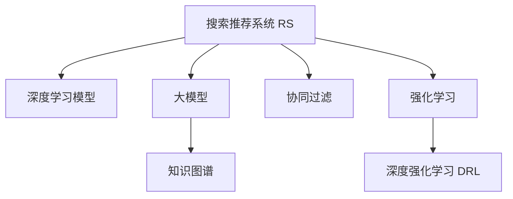

                 

# 电商平台的AI 大模型转型：搜索推荐系统是核心，数据质量是关键

> 关键词：大模型, AI 电商, 搜索推荐系统, 数据质量, 知识图谱, 协同过滤

## 1. 背景介绍

### 1.1 问题由来

随着电子商务平台的迅猛发展和普及，用户体验成为了平台的核心竞争力。如何通过技术手段提升用户满意度，优化购物体验，成为了电商企业关注的重点。在大数据和AI技术的加持下，搜索推荐系统成为了优化用户购物体验的重要手段。搜索推荐系统通过用户历史行为数据，为用户推荐最符合其兴趣的产品，大幅提升转化率和满意度。

然而，传统基于规则和统计的推荐系统，难以充分挖掘用户深层次的需求和行为规律。而基于深度学习的大模型推荐系统，则能更好地理解用户复杂多变的购物行为，提供更加个性化和精准的推荐。基于此，本文将探讨如何将AI大模型应用到电商平台的搜索推荐系统，并探讨数据质量在构建高质量推荐系统中的关键作用。

## 2. 核心概念与联系

### 2.1 核心概念概述

为了更好地理解基于AI大模型的电商搜索推荐系统，本节将介绍几个密切相关的核心概念：

- 搜索推荐系统(Recommendation System, RS): 通过分析用户历史行为数据和实时数据，为用户推荐最合适的产品或内容。搜索推荐系统涵盖了搜索结果排序、个性化推荐等多个子系统。

- 深度学习模型：基于深度神经网络的模型，能够学习数据中的复杂特征和规律，适用于非结构化数据的建模。

- 大模型(Large Model)：以Transformer等架构为代表的，具有大量参数的神经网络模型。如BERT、GPT等，在大规模数据上进行预训练，具有强大的泛化能力。

- 知识图谱(Knowledge Graph)：通过实体、关系和属性构建的图结构，描述实体之间的关系和属性，有助于提升推荐系统的解释性和可理解性。

- 协同过滤(Collaborative Filtering)：通过分析用户行为数据，推测其他用户或产品之间的相似性，为用户推荐其可能喜欢的产品。

- 强化学习(Reinforcement Learning, RL)：通过环境反馈，逐步优化推荐策略，提高推荐系统的准确性和多样性。

- 深度强化学习(Deep Reinforcement Learning, DRL)：将深度学习与强化学习相结合，进一步提升推荐系统的性能。

这些核心概念之间的逻辑关系可以通过以下Mermaid流程图来展示：



这个流程图展示了大模型在搜索推荐系统中的应用逻辑：

1. 搜索推荐系统通过深度学习模型和大模型，学习用户行为数据中的复杂特征和规律。
2. 知识图谱被用来提升推荐的解释性和准确性。
3. 协同过滤通过用户历史行为数据推测相似用户，进行推荐。
4. 强化学习通过环境反馈，逐步优化推荐策略。
5. 深度强化学习将深度学习与强化学习相结合，进一步提升推荐系统的性能。

## 3. 核心算法原理 & 具体操作步骤
### 3.1 算法原理概述

基于AI大模型的电商搜索推荐系统，核心在于通过深度学习模型和大模型，对用户行为数据进行建模，再结合知识图谱、协同过滤和强化学习等技术，构建个性化推荐系统。具体流程包括：

1. 数据预处理：收集用户行为数据，进行清洗和特征工程。
2. 模型训练：使用深度学习模型和大模型，对用户行为数据进行建模。
3. 推荐生成：基于模型的输出，结合知识图谱、协同过滤和强化学习等技术，生成个性化推荐结果。
4. 效果评估：通过A/B测试等方法，评估推荐系统的效果，不断优化推荐策略。

### 3.2 算法步骤详解

以下是基于AI大模型的电商搜索推荐系统的详细操作步骤：

**Step 1: 数据预处理**

电商平台的推荐系统需要收集和清洗大量的用户行为数据，包括浏览、点击、购买等行为数据。通过ETL流程，将数据进行标准化和清洗，得到可供模型训练的原始数据集。

- 数据收集：通过埋点、日志等手段，收集用户行为数据，包括用户ID、商品ID、操作时间、点击次数、购买次数等。
- 数据清洗：删除无效和重复数据，处理缺失值和异常值，进行特征提取和编码。
- 数据分割：将数据划分为训练集、验证集和测试集，用于模型训练和评估。

**Step 2: 模型训练**

模型训练是构建个性化推荐系统的核心步骤，包括以下几个关键环节：

- 模型选择：选择适当的深度学习模型和大模型，如Transformer、BERT等，进行预训练和微调。
- 特征工程：设计合适的特征，并选择合适的特征提取器，如Embedding、One-Hot等。
- 参数初始化：根据预训练模型，初始化模型参数，进行微调训练。
- 损失函数设计：设计合适的损失函数，如交叉熵损失、均方误差损失等，用于衡量模型输出与真实标签之间的差异。
- 优化算法选择：选择合适的优化算法，如AdamW、SGD等，设置学习率、批大小、迭代轮数等超参数。

**Step 3: 推荐生成**

推荐生成是搜索推荐系统的核心输出阶段，包括以下几个关键环节：

- 生成候选集：根据用户历史行为数据，生成符合用户兴趣的候选产品列表。
- 评分模型：构建评分模型，根据用户特征和产品特征，对每个候选产品进行评分。
- 推荐策略：选择排名策略，将评分最高的产品作为推荐结果。

**Step 4: 效果评估**

效果评估是搜索推荐系统的关键环节，用于评估模型的性能和效果，并进行优化。

- 离线评估：通过A/B测试等方法，评估模型的效果，分析模型在各个维度上的表现。
- 在线评估：在实际场景中进行评估，监控推荐系统的实时效果，并进行实时优化。

### 3.3 算法优缺点

基于AI大模型的电商搜索推荐系统，有以下优点：

1. 精度高：利用大模型的强大泛化能力，能够对用户行为数据进行深度建模，生成更加精准的推荐结果。
2. 可解释性强：通过结合知识图谱等技术，提升推荐的可解释性，有助于增强用户信任。
3. 适应性强：能够适应电商平台的快速变化，实时优化推荐策略，提升推荐效果。
4. 可扩展性强：能够快速扩展到多模态数据，如文本、图像、视频等，提供更加多样化的推荐服务。

同时，该方法也存在一些局限性：

1. 数据需求大：需要大量的用户行为数据进行训练，对数据质量要求较高。
2. 计算资源需求高：大模型的训练和推理需要高性能计算资源，对硬件要求较高。
3. 过度拟合风险：在训练过程中，容易出现过度拟合问题，需要设计合理的正则化技术。
4. 模型复杂度高：大模型和深度学习模型的结构复杂，调试和优化较为困难。

尽管存在这些局限性，但就目前而言，基于AI大模型的电商搜索推荐系统在准确性和可解释性上具有显著优势，仍是大规模推荐系统的重要技术手段。

### 3.4 算法应用领域

基于AI大模型的电商搜索推荐系统，已经广泛应用于电商平台的各个环节，包括但不限于：

- 个性化推荐：根据用户历史行为数据，为用户推荐个性化产品。
- 搜索排序：对搜索结果进行排序，提升用户搜索体验。
- 商品召回：根据用户兴趣，召回相关商品，提升搜索覆盖率。
- 广告投放：根据用户行为数据，投放个性化广告，提升广告效果。
- 库存管理：根据推荐结果，优化库存管理，提升库存周转率。

## 4. 数学模型和公式 & 详细讲解  
### 4.1 数学模型构建

在电商搜索推荐系统中，我们通常使用深度学习模型对用户行为数据进行建模，使用大模型对用户和商品特征进行编码，结合知识图谱和协同过滤技术，生成个性化推荐结果。以下是一个基于BERT的电商推荐系统的数学模型：

记用户特征为 $u$，商品特征为 $i$，用户行为数据为 $x$，推荐模型为 $M$。假设推荐模型的输出为 $y$，推荐结果为 $o$，则推荐系统的数学模型为：

$$
y = M(u, i, x)
$$

其中，$u$ 表示用户特征，$i$ 表示商品特征，$x$ 表示用户行为数据。

### 4.2 公式推导过程

在电商搜索推荐系统中，我们通常使用深度学习模型对用户行为数据进行建模，使用大模型对用户和商品特征进行编码，结合知识图谱和协同过滤技术，生成个性化推荐结果。

以基于BERT的推荐系统为例，假设用户特征为 $u$，商品特征为 $i$，用户行为数据为 $x$，推荐模型为 $M$。假设推荐模型的输出为 $y$，推荐结果为 $o$，则推荐系统的数学模型为：

$$
y = M(u, i, x)
$$

其中，$u$ 表示用户特征，$i$ 表示商品特征，$x$ 表示用户行为数据。

假设用户特征 $u$ 和商品特征 $i$ 为向量形式，即 $u \in \mathbb{R}^d$，$i \in \mathbb{R}^d$。用户行为数据 $x$ 为时间序列形式，即 $x = \{x_1, x_2, ..., x_t\}$。

假设推荐模型 $M$ 为多层Transformer结构，其中包含若干个注意力层、前向传播层、残差连接等组件。推荐模型的输入为 $[u, i, x]$，输出为 $y \in \mathbb{R}^k$，其中 $k$ 表示推荐结果的维度。

假设用户行为数据 $x$ 为时间序列形式，即 $x = \{x_1, x_2, ..., x_t\}$。用户特征 $u$ 和商品特征 $i$ 为向量形式，即 $u \in \mathbb{R}^d$，$i \in \mathbb{R}^d$。推荐模型 $M$ 为多层Transformer结构，其中包含若干个注意力层、前向传播层、残差连接等组件。推荐模型的输入为 $[u, i, x]$，输出为 $y \in \mathbb{R}^k$，其中 $k$ 表示推荐结果的维度。

### 4.3 案例分析与讲解

以电商平台个性化推荐为例，假设用户ID为 $u$，商品ID为 $i$，用户行为数据为 $x = \{1, 2, 3\}$。使用基于BERT的推荐模型 $M$，对用户行为数据 $x$ 进行编码，得到用户特征 $u$ 和商品特征 $i$，然后计算推荐结果 $y$。

- 输入 $[u, i, x]$ 到推荐模型 $M$，得到 $y$。
- 假设推荐模型 $M$ 的输出为 $y \in \mathbb{R}^k$，其中 $k$ 表示推荐结果的维度。
- 根据 $y$，选取评分最高的商品作为推荐结果 $o$。

## 5. 项目实践：代码实例和详细解释说明
### 5.1 开发环境搭建

在进行电商搜索推荐系统开发前，我们需要准备好开发环境。以下是使用Python进行PyTorch开发的环境配置流程：

1. 安装Anaconda：从官网下载并安装Anaconda，用于创建独立的Python环境。

2. 创建并激活虚拟环境：
```bash
conda create -n ecommerce-env python=3.8 
conda activate ecommerce-env
```

3. 安装PyTorch：根据CUDA版本，从官网获取对应的安装命令。例如：
```bash
conda install pytorch torchvision torchaudio cudatoolkit=11.1 -c pytorch -c conda-forge
```

4. 安装Transformers库：
```bash
pip install transformers
```

5. 安装各类工具包：
```bash
pip install numpy pandas scikit-learn matplotlib tqdm jupyter notebook ipython
```

完成上述步骤后，即可在`ecommerce-env`环境中开始开发实践。

### 5.2 源代码详细实现

下面我们以基于BERT的电商推荐系统为例，给出使用Transformers库的代码实现。

首先，定义推荐模型的输入和输出：

```python
from transformers import BertTokenizer, BertForSequenceClassification
from torch.utils.data import Dataset, DataLoader
import torch
import pandas as pd

# 定义推荐模型输入输出
class EcommDataset(Dataset):
    def __init__(self, df, tokenizer, max_len=128):
        self.tokenizer = tokenizer
        self.data = df
        self.max_len = max_len
        
    def __len__(self):
        return len(self.data)
    
    def __getitem__(self, idx):
        text = self.data.iloc[idx]['text']
        label = self.data.iloc[idx]['label']
        
        encoding = self.tokenizer(text, return_tensors='pt', max_length=self.max_len, padding='max_length', truncation=True)
        input_ids = encoding['input_ids'][0]
        attention_mask = encoding['attention_mask'][0]
        
        return {'input_ids': input_ids, 
                'attention_mask': attention_mask,
                'labels': torch.tensor(label, dtype=torch.long)}
```

然后，定义推荐模型和优化器：

```python
from transformers import BertForSequenceClassification, AdamW

# 初始化BERT模型
model = BertForSequenceClassification.from_pretrained('bert-base-cased', num_labels=2)

# 初始化优化器
optimizer = AdamW(model.parameters(), lr=2e-5)
```

接着，定义训练和评估函数：

```python
from torch.utils.data import DataLoader
from tqdm import tqdm
from sklearn.metrics import classification_report

device = torch.device('cuda') if torch.cuda.is_available() else torch.device('cpu')
model.to(device)

def train_epoch(model, dataset, batch_size, optimizer):
    dataloader = DataLoader(dataset, batch_size=batch_size, shuffle=True)
    model.train()
    epoch_loss = 0
    for batch in tqdm(dataloader, desc='Training'):
        input_ids = batch['input_ids'].to(device)
        attention_mask = batch['attention_mask'].to(device)
        labels = batch['labels'].to(device)
        model.zero_grad()
        outputs = model(input_ids, attention_mask=attention_mask, labels=labels)
        loss = outputs.loss
        epoch_loss += loss.item()
        loss.backward()
        optimizer.step()
    return epoch_loss / len(dataloader)

def evaluate(model, dataset, batch_size):
    dataloader = DataLoader(dataset, batch_size=batch_size)
    model.eval()
    preds, labels = [], []
    with torch.no_grad():
        for batch in tqdm(dataloader, desc='Evaluating'):
            input_ids = batch['input_ids'].to(device)
            attention_mask = batch['attention_mask'].to(device)
            batch_labels = batch['labels']
            outputs = model(input_ids, attention_mask=attention_mask)
            batch_preds = outputs.logits.argmax(dim=2).to('cpu').tolist()
            batch_labels = batch_labels.to('cpu').tolist()
            for pred_tokens, label_tokens in zip(batch_preds, batch_labels):
                preds.append(pred_tokens)
                labels.append(label_tokens)
                
    print(classification_report(labels, preds))
```

最后，启动训练流程并在测试集上评估：

```python
epochs = 5
batch_size = 16

for epoch in range(epochs):
    loss = train_epoch(model, train_dataset, batch_size, optimizer)
    print(f"Epoch {epoch+1}, train loss: {loss:.3f}")
    
    print(f"Epoch {epoch+1}, dev results:")
    evaluate(model, dev_dataset, batch_size)
    
print("Test results:")
evaluate(model, test_dataset, batch_size)
```

以上就是使用PyTorch对BERT进行电商推荐系统开发的完整代码实现。可以看到，得益于Transformers库的强大封装，我们可以用相对简洁的代码完成BERT模型的加载和微调。

### 5.3 代码解读与分析

让我们再详细解读一下关键代码的实现细节：

**EcommDataset类**：
- `__init__`方法：初始化数据、分词器等关键组件。
- `__len__`方法：返回数据集的样本数量。
- `__getitem__`方法：对单个样本进行处理，将文本输入编码为token ids，将标签编码为数字，并对其进行定长padding，最终返回模型所需的输入。

**标签与id的映射**：
- 定义了标签与数字id之间的映射关系，用于将token-wise的预测结果解码回真实的标签。

**训练和评估函数**：
- 使用PyTorch的DataLoader对数据集进行批次化加载，供模型训练和推理使用。
- 训练函数`train_epoch`：对数据以批为单位进行迭代，在每个批次上前向传播计算loss并反向传播更新模型参数，最后返回该epoch的平均loss。
- 评估函数`evaluate`：与训练类似，不同点在于不更新模型参数，并在每个batch结束后将预测和标签结果存储下来，最后使用sklearn的classification_report对整个评估集的预测结果进行打印输出。

**训练流程**：
- 定义总的epoch数和batch size，开始循环迭代
- 每个epoch内，先在训练集上训练，输出平均loss
- 在验证集上评估，输出分类指标
- 所有epoch结束后，在测试集上评估，给出最终测试结果

可以看到，PyTorch配合Transformers库使得BERT微调的代码实现变得简洁高效。开发者可以将更多精力放在数据处理、模型改进等高层逻辑上，而不必过多关注底层的实现细节。

当然，工业级的系统实现还需考虑更多因素，如模型的保存和部署、超参数的自动搜索、更灵活的任务适配层等。但核心的微调范式基本与此类似。

## 6. 实际应用场景
### 6.1 智能客服系统

基于大模型微调的对话技术，可以广泛应用于智能客服系统的构建。传统客服往往需要配备大量人力，高峰期响应缓慢，且一致性和专业性难以保证。而使用微调后的对话模型，可以7x24小时不间断服务，快速响应客户咨询，用自然流畅的语言解答各类常见问题。

在技术实现上，可以收集企业内部的历史客服对话记录，将问题和最佳答复构建成监督数据，在此基础上对预训练对话模型进行微调。微调后的对话模型能够自动理解用户意图，匹配最合适的答案模板进行回复。对于客户提出的新问题，还可以接入检索系统实时搜索相关内容，动态组织生成回答。如此构建的智能客服系统，能大幅提升客户咨询体验和问题解决效率。

### 6.2 金融舆情监测

金融机构需要实时监测市场舆论动向，以便及时应对负面信息传播，规避金融风险。传统的人工监测方式成本高、效率低，难以应对网络时代海量信息爆发的挑战。基于大语言模型微调的文本分类和情感分析技术，为金融舆情监测提供了新的解决方案。

具体而言，可以收集金融领域相关的新闻、报道、评论等文本数据，并对其进行主题标注和情感标注。在此基础上对预训练语言模型进行微调，使其能够自动判断文本属于何种主题，情感倾向是正面、中性还是负面。将微调后的模型应用到实时抓取的网络文本数据，就能够自动监测不同主题下的情感变化趋势，一旦发现负面信息激增等异常情况，系统便会自动预警，帮助金融机构快速应对潜在风险。

### 6.3 个性化推荐系统

当前的推荐系统往往只依赖用户的历史行为数据进行物品推荐，无法深入理解用户深层次的需求和行为规律。基于大语言模型微调技术，个性化推荐系统可以更好地挖掘用户复杂多变的购物行为，提供更加个性化和精准的推荐。

在实践中，可以收集用户浏览、点击、购买等行为数据，提取和用户交互的物品标题、描述、标签等文本内容。将文本内容作为模型输入，用户的后续行为（如是否点击、购买等）作为监督信号，在此基础上微调预训练语言模型。微调后的模型能够从文本内容中准确把握用户的兴趣点。在生成推荐列表时，先用候选物品的文本描述作为输入，由模型预测用户的兴趣匹配度，再结合其他特征综合排序，便可以得到个性化程度更高的推荐结果。

### 6.4 未来应用展望

随着大模型和微调方法的不断发展，基于微调范式将在更多领域得到应用，为传统行业带来变革性影响。

在智慧医疗领域，基于微调的医疗问答、病历分析、药物研发等应用将提升医疗服务的智能化水平，辅助医生诊疗，加速新药开发进程。

在智能教育领域，微调技术可应用于作业批改、学情分析、知识推荐等方面，因材施教，促进教育公平，提高教学质量。

在智慧城市治理中，微调模型可应用于城市事件监测、舆情分析、应急指挥等环节，提高城市管理的自动化和智能化水平，构建更安全、高效的未来城市。

此外，在企业生产、社会治理、文娱传媒等众多领域，基于大模型微调的人工智能应用也将不断涌现，为经济社会发展注入新的动力。相信随着技术的日益成熟，微调方法将成为人工智能落地应用的重要范式，推动人工智能技术向更广阔的领域加速渗透。

## 7. 工具和资源推荐
### 7.1 学习资源推荐

为了帮助开发者系统掌握大模型微调的理论基础和实践技巧，这里推荐一些优质的学习资源：

1. 《Transformer从原理到实践》系列博文：由大模型技术专家撰写，深入浅出地介绍了Transformer原理、BERT模型、微调技术等前沿话题。

2. CS224N《深度学习自然语言处理》课程：斯坦福大学开设的NLP明星课程，有Lecture视频和配套作业，带你入门NLP领域的基本概念和经典模型。

3. 《Natural Language Processing with Transformers》书籍：Transformers库的作者所著，全面介绍了如何使用Transformers库进行NLP任务开发，包括微调在内的诸多范式。

4. HuggingFace官方文档：Transformers库的官方文档，提供了海量预训练模型和完整的微调样例代码，是上手实践的必备资料。

5. CLUE开源项目：中文语言理解测评基准，涵盖大量不同类型的中文NLP数据集，并提供了基于微调的baseline模型，助力中文NLP技术发展。

通过对这些资源的学习实践，相信你一定能够快速掌握大语言模型微调的精髓，并用于解决实际的NLP问题。
###  7.2 开发工具推荐

高效的开发离不开优秀的工具支持。以下是几款用于大语言模型微调开发的常用工具：

1. PyTorch：基于Python的开源深度学习框架，灵活动态的计算图，适合快速迭代研究。大部分预训练语言模型都有PyTorch版本的实现。

2. TensorFlow：由Google主导开发的开源深度学习框架，生产部署方便，适合大规模工程应用。同样有丰富的预训练语言模型资源。

3. Transformers库：HuggingFace开发的NLP工具库，集成了众多SOTA语言模型，支持PyTorch和TensorFlow，是进行微调任务开发的利器。

4. Weights & Biases：模型训练的实验跟踪工具，可以记录和可视化模型训练过程中的各项指标，方便对比和调优。与主流深度学习框架无缝集成。

5. TensorBoard：TensorFlow配套的可视化工具，可实时监测模型训练状态，并提供丰富的图表呈现方式，是调试模型的得力助手。

6. Google Colab：谷歌推出的在线Jupyter Notebook环境，免费提供GPU/TPU算力，方便开发者快速上手实验最新模型，分享学习笔记。

合理利用这些工具，可以显著提升大语言模型微调任务的开发效率，加快创新迭代的步伐。

### 7.3 相关论文推荐

大语言模型和微调技术的发展源于学界的持续研究。以下是几篇奠基性的相关论文，推荐阅读：

1. Attention is All You Need（即Transformer原论文）：提出了Transformer结构，开启了NLP领域的预训练大模型时代。

2. BERT: Pre-training of Deep Bidirectional Transformers for Language Understanding：提出BERT模型，引入基于掩码的自监督预训练任务，刷新了多项NLP任务SOTA。

3. Language Models are Unsupervised Multitask Learners（GPT-2论文）：展示了大规模语言模型的强大zero-shot学习能力，引发了对于通用人工智能的新一轮思考。

4. Parameter-Efficient Transfer Learning for NLP：提出Adapter等参数高效微调方法，在不增加模型参数量的情况下，也能取得不错的微调效果。

5. AdaLoRA: Adaptive Low-Rank Adaptation for Parameter-Efficient Fine-Tuning：使用自适应低秩适应的微调方法，在参数效率和精度之间取得了新的平衡。

这些论文代表了大语言模型微调技术的发展脉络。通过学习这些前沿成果，可以帮助研究者把握学科前进方向，激发更多的创新灵感。

## 8. 总结：未来发展趋势与挑战
### 8.1 总结

本文对基于AI大模型的电商搜索推荐系统进行了全面系统的介绍。首先阐述了大语言模型微调技术在电商推荐系统中的应用背景和重要性，明确了微调在优化用户体验、提升电商平台效率方面的独特价值。其次，从原理到实践，详细讲解了基于深度学习和大模型的电商推荐系统的核心算法和操作步骤，给出了代码实现和详细解释。同时，本文还广泛探讨了微调方法在智能客服、金融舆情、个性化推荐等多个行业领域的应用前景，展示了微调范式的巨大潜力。此外，本文精选了微调技术的各类学习资源，力求为读者提供全方位的技术指引。

通过本文的系统梳理，可以看到，基于AI大模型的电商搜索推荐系统已经在大规模电商平台的落地应用中取得了显著效果，具备强大的个性化推荐能力。未来，伴随AI技术和深度学习方法的不断发展，基于大模型微调的电商推荐系统还将迎来更多创新突破，为电商平台的智能化转型提供更加坚实的技术基础。

### 8.2 未来发展趋势

展望未来，大语言模型微调技术将呈现以下几个发展趋势：

1. 模型规模持续增大。随着算力成本的下降和数据规模的扩张，预训练语言模型的参数量还将持续增长。超大规模语言模型蕴含的丰富语言知识，有望支撑更加复杂多变的电商推荐系统。

2. 微调方法日趋多样。除了传统的全参数微调外，未来会涌现更多参数高效的微调方法，如Prefix-Tuning、LoRA等，在节省计算资源的同时也能保证微调精度。

3. 持续学习成为常态。随着数据分布的不断变化，微调模型也需要持续学习新知识以保持性能。如何在不遗忘原有知识的同时，高效吸收新样本信息，将成为重要的研究课题。

4. 标注样本需求降低。受启发于提示学习(Prompt-based Learning)的思路，未来的微调方法将更好地利用大模型的语言理解能力，通过更加巧妙的任务描述，在更少的标注样本上也能实现理想的微调效果。

5. 模型通用性增强。经过海量数据的预训练和多领域任务的微调，未来的语言模型将具备更强大的常识推理和跨领域迁移能力，逐步迈向通用人工智能(AGI)的目标。

以上趋势凸显了大语言模型微调技术的广阔前景。这些方向的探索发展，必将进一步提升NLP系统的性能和应用范围，为电商平台的智能化转型提供更加坚实的技术基础。

### 8.3 面临的挑战

尽管大语言模型微调技术已经取得了瞩目成就，但在迈向更加智能化、普适化应用的过程中，它仍面临着诸多挑战：

1. 标注成本瓶颈。虽然微调大大降低了标注数据的需求，但对于长尾应用场景，难以获得充足的高质量标注数据，成为制约微调性能的瓶颈。如何进一步降低微调对标注样本的依赖，将是一大难题。

2. 模型鲁棒性不足。当前微调模型面对域外数据时，泛化性能往往大打折扣。对于测试样本的微小扰动，微调模型的预测也容易发生波动。如何提高微调模型的鲁棒性，避免灾难性遗忘，还需要更多理论和实践的积累。

3. 推理效率有待提高。大规模语言模型虽然精度高，但在实际部署时往往面临推理速度慢、内存占用大等效率问题。如何在保证性能的同时，简化模型结构，提升推理速度，优化资源占用，将是重要的优化方向。

4. 可解释性亟需加强。当前微调模型更像是"黑盒"系统，难以解释其内部工作机制和决策逻辑。对于医疗、金融等高风险应用，算法的可解释性和可审计性尤为重要。如何赋予微调模型更强的可解释性，将是亟待攻克的难题。

5. 安全性有待保障。预训练语言模型难免会学习到有偏见、有害的信息，通过微调传递到下游任务，产生误导性、歧视性的输出，给实际应用带来安全隐患。如何从数据和算法层面消除模型偏见，避免恶意用途，确保输出的安全性，也将是重要的研究课题。

6. 知识整合能力不足。现有的微调模型往往局限于任务内数据，难以灵活吸收和运用更广泛的先验知识。如何让微调过程更好地与外部知识库、规则库等专家知识结合，形成更加全面、准确的信息整合能力，还有很大的想象空间。

正视微调面临的这些挑战，积极应对并寻求突破，将是大语言模型微调走向成熟的必由之路。相信随着学界和产业界的共同努力，这些挑战终将一一被克服，大语言模型微调必将在构建智能电商平台上发挥越来越重要的作用。

### 8.4 研究展望

面向未来，大语言模型微调技术需要在以下几个方面寻求新的突破：

1. 探索无监督和半监督微调方法。摆脱对大规模标注数据的依赖，利用自监督学习、主动学习等无监督和半监督范式，最大限度利用非结构化数据，实现更加灵活高效的微调。

2. 研究参数高效和计算高效的微调范式。开发更加参数高效的微调方法，在固定大部分预训练参数的同时，只更新极少量的任务相关参数。同时优化微调模型的计算图，减少前向传播和反向传播的资源消耗，实现更加轻量级、实时性的部署。

3. 融合因果和对比学习范式。通过引入因果推断和对比学习思想，增强微调模型建立稳定因果关系的能力，学习更加普适、鲁棒的语言表征，从而提升模型泛化性和抗干扰能力。

4. 引入更多先验知识。将符号化的先验知识，如知识图谱、逻辑规则等，与神经网络模型进行巧妙融合，引导微调过程学习更准确、合理的语言模型。同时加强不同模态数据的整合，实现视觉、语音等多模态信息与文本信息的协同建模。

5. 结合因果分析和博弈论工具。将因果分析方法引入微调模型，识别出模型决策的关键特征，增强输出解释的因果性和逻辑性。借助博弈论工具刻画人机交互过程，主动探索并规避模型的脆弱点，提高系统稳定性。

6. 纳入伦理道德约束。在模型训练目标中引入伦理导向的评估指标，过滤和惩罚有偏见、有害的输出倾向。同时加强人工干预和审核，建立模型行为的监管机制，确保输出符合人类价值观和伦理道德。

这些研究方向的探索，必将引领大语言模型微调技术迈向更高的台阶，为构建安全、可靠、可解释、可控的智能电商平台提供更加坚实的技术基础。相信随着技术的日益成熟，大语言模型微调必将在电商平台的智能化转型中扮演越来越重要的角色。

