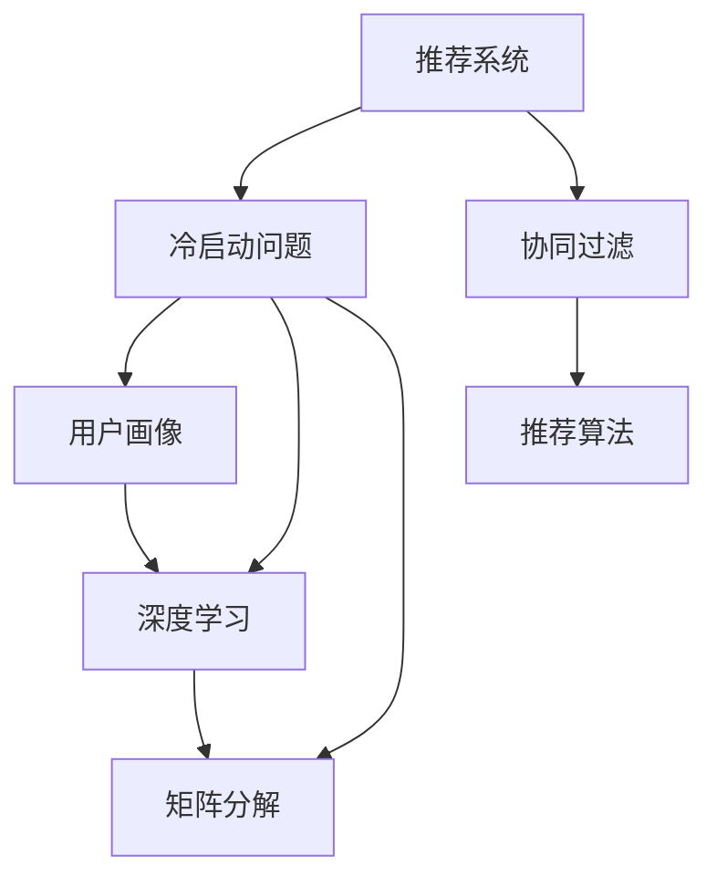

                 

## 1. 背景介绍

### 1.1 问题由来
随着电子商务的迅猛发展，推荐系统成为了各大电商平台的必备功能，用以提升用户体验和商品转化率。然而，推荐系统的核心在于个性化推荐，而这需要用户的大量行为数据作为依据。新用户的冷启动问题随之产生：由于缺乏足够的用户行为数据，推荐系统难以准确推荐，难以帮助新用户快速发现感兴趣的商品。

冷启动问题是推荐系统领域的一大难点。对于新用户，由于没有历史行为数据，推荐算法无法建立个性化推荐模型，推荐效果往往无法满足用户期望。传统方法如基于协同过滤、矩阵分解等，往往需要用户较高的互动频率，无法很好地解决新用户的推荐问题。

本文将探讨在电商推荐系统中，如何通过数据挖掘、机器学习、自然语言处理等技术手段，针对新用户，解决冷启动问题，构建快速且准确的推荐模型。

### 1.2 问题核心关键点
冷启动问题主要集中在两个方面：数据匮乏和用户画像模糊。为了解决这些问题，本文将从数据预处理、模型优化、上下文信息融合等方面入手，提出一系列解决方案。

- **数据预处理**：通过收集并利用用户属性信息、商品属性信息以及上下文信息，增强模型对新用户的理解能力。
- **模型优化**：采用深度学习模型，如基于用户历史行为的深度神经网络，以及无监督学习模型，如矩阵分解，来提高对新用户的预测准确度。
- **上下文信息融合**：利用用户行为、商品属性和用户属性等多维度信息，提高推荐系统的鲁棒性和个性化水平。

## 2. 核心概念与联系

### 2.1 核心概念概述

为了更好地理解冷启动问题的解决方案，本节将介绍几个关键概念及其联系。

- **推荐系统**：利用用户的历史行为数据，为用户推荐感兴趣的商品，提升用户满意度和电商平台转化率。
- **冷启动问题**：新用户或新商品因缺乏足够的历史数据，导致推荐系统无法提供准确的个性化推荐。
- **用户画像**：通过收集用户的基本信息、浏览历史、购买行为等，建立详细的用户特征，提高推荐准确度。
- **深度学习**：一种模拟人脑神经网络的机器学习方法，广泛应用于图像、语音、自然语言处理等领域，能够处理高维数据和非线性关系。
- **矩阵分解**：一种常用的降维技术，用于将高维数据矩阵分解成两个低维矩阵，提取潜在因子，用于推荐系统中的用户-商品关系建模。
- **协同过滤**：一种推荐算法，通过用户行为数据或商品属性信息，寻找相似用户或相似商品进行推荐。

这些核心概念之间的逻辑关系可以通过以下Mermaid流程图来展示：



这个流程图展示出了推荐系统、冷启动问题、用户画像、深度学习、矩阵分解、协同过滤等关键概念之间的联系：

1. 推荐系统通过冷启动问题解决机制，如用户画像、深度学习等，提升推荐系统的精准度。
2. 用户画像通过深度学习、矩阵分解等技术，增强对新用户的理解。
3. 协同过滤算法通过用户行为、商品属性等信息，寻找相似用户或商品进行推荐。
4. 深度学习、矩阵分解、协同过滤等技术可以相互补充，综合使用，提升推荐系统的效果。

这些概念共同构成了电商推荐系统中解决冷启动问题的技术框架，为其提供了多种有效的解决方案。

## 3. 核心算法原理 & 具体操作步骤
### 3.1 算法原理概述

电商推荐系统中的冷启动问题，主要是由于新用户或新商品缺乏足够的历史行为数据。为解决该问题，需要从数据预处理、模型优化、上下文信息融合等多个方面入手，建立高效且准确的推荐模型。

### 3.2 算法步骤详解

针对冷启动问题，电商推荐系统主要涉及以下几个步骤：

1. **数据预处理**：收集并利用用户属性信息、商品属性信息以及上下文信息，增强模型对新用户的理解能力。
2. **用户画像建立**：通过深度学习模型，如RNN、LSTM等，对用户行为序列进行建模，获取用户兴趣偏好。
3. **协同过滤算法**：采用基于用户行为相似度的协同过滤算法，进行个性化推荐。
4. **矩阵分解模型**：采用矩阵分解模型，将用户与商品的评分矩阵分解为两个低维矩阵，预测未评分商品的用户评分。
5. **上下文信息融合**：利用用户行为、商品属性和用户属性等多维度信息，提高推荐系统的鲁棒性和个性化水平。
6. **模型优化**：采用深度神经网络等模型，提高对新用户的预测准确度，采用优化算法，如Adam、SGD等，优化模型参数。
7. **测试与部署**：在测试集上评估推荐模型的效果，优化模型后部署到生产环境。

### 3.3 算法优缺点

电商推荐系统中的冷启动问题解决方案，具有以下优点：

1. **高效性**：利用深度学习、矩阵分解等技术，可以高效处理大规模数据，快速提供个性化推荐。
2. **鲁棒性**：通过上下文信息融合，提高推荐系统的鲁棒性，能够更好地应对噪声和异常数据。
3. **可解释性**：用户画像和协同过滤算法提供了推荐结果的可解释性，便于用户理解。

同时，该方法也存在一定的局限性：

1. **数据依赖性强**：需要大量的用户行为数据和商品属性信息，难以适用于冷启动阶段的新用户或新商品。
2. **模型复杂度高**：深度学习模型和矩阵分解模型的训练复杂度较高，计算资源消耗较大。
3. **算法依赖性**：推荐算法的效果依赖于算法的选取和调参，可能存在一定的超参数敏感性。

尽管存在这些局限性，但就目前而言，基于冷启动问题解决方案的推荐系统仍是电商领域的主流范式。未来相关研究的重点在于如何进一步降低对历史数据的依赖，提高推荐模型的泛化能力和实时性，同时兼顾可解释性和效率等综合因素。

### 3.4 算法应用领域

基于冷启动问题解决方案的推荐系统，已经在电商领域得到了广泛的应用，覆盖了几乎所有常见场景，例如：

- 商品推荐：根据用户浏览历史、购买记录等行为数据，为用户推荐感兴趣的商品。
- 用户画像建立：通过深度学习模型，对用户历史行为序列进行建模，获取用户兴趣偏好。
- 商品画像建立：通过深度学习模型，对商品属性信息进行建模，获取商品特征。
- 上下文推荐：利用用户行为、商品属性和用户属性等多维度信息，提高推荐系统的鲁棒性和个性化水平。

除了上述这些经典应用外，推荐系统还被创新性地应用到更多场景中，如实时推荐、个性化广告投放、个性化内容推荐等，为电商平台提供了更多的商业机会和用户价值。

## 4. 数学模型和公式 & 详细讲解  
### 4.1 数学模型构建

本节将使用数学语言对电商推荐系统中冷启动问题的解决方案进行更加严格的刻画。

记电商平台的用户集合为 $U$，商品集合为 $I$，用户对商品的评分矩阵为 $R_{UI}$。令 $R_{UI}(u,i)=r_{ui}$ 表示用户 $u$ 对商品 $i$ 的评分。

定义用户 $u$ 的历史行为序列为 $H_u$，商品 $i$ 的属性特征为 $A_i$。

电商推荐系统的目标是通过历史数据，预测新用户对新商品的用户评分 $r_{ui}$，即：

$$
\min_{\theta} \sum_{(u,i)\in R} \ell(r_{ui},\hat{r}_{ui}) 
$$

其中 $\hat{r}_{ui}=f_{\theta}(u,i,H_u,A_i)$，表示预测的用户评分。$f_{\theta}$ 为模型的预测函数，$\theta$ 为模型参数。

### 4.2 公式推导过程

以矩阵分解模型为例，推导其预测函数 $f_{\theta}$ 的表达式。

矩阵分解模型假设用户与商品的评分 $r_{ui}$ 可以表示为两个低维矩阵 $\mathbf{P}$ 和 $\mathbf{Q}$ 的乘积：

$$
\mathbf{P} \in \mathbb{R}^{m \times |U|}, \mathbf{Q} \in \mathbb{R}^{n \times |I|}
$$

其中 $m$ 和 $n$ 为两个矩阵的维度。令 $p_u$ 和 $q_i$ 分别表示用户 $u$ 和商品 $i$ 的低维表示。

则用户对商品的评分可以表示为：

$$
r_{ui} \approx \mathbf{p}_u^T \mathbf{q}_i
$$

其中 $\mathbf{p}_u$ 和 $\mathbf{q}_i$ 可以通过最小化平方误差损失函数进行训练：

$$
\min_{\mathbf{P},\mathbf{Q}} \sum_{(u,i)\in R} (r_{ui} - \mathbf{p}_u^T \mathbf{q}_i)^2
$$

利用矩阵分解模型，用户 $u$ 对商品 $i$ 的评分预测函数可以表示为：

$$
\hat{r}_{ui} = \mathbf{p}_u^T \mathbf{q}_i = \sum_{k=1}^{K} p_{uk} q_{ik}
$$

其中 $p_{uk}$ 和 $q_{ik}$ 表示矩阵 $\mathbf{P}$ 和 $\mathbf{Q}$ 中的元素。

将预测函数带入损失函数，并使用随机梯度下降等优化算法，最小化损失函数，更新模型参数 $\theta$，完成模型的训练。

### 4.3 案例分析与讲解

以电商平台中的商品推荐系统为例，分析矩阵分解模型在冷启动问题中的实际应用。

假设电商平台中有 $n$ 个用户 $U=\{u_1,u_2,\cdots,u_n\}$，$m$ 个商品 $I=\{i_1,i_2,\cdots,i_m\}$，$k$ 个用户行为 $H=\{h_1,h_2,\cdots,h_k\}$，用户行为 $h_u$ 可以表示为用户 $u$ 对商品 $i$ 的评分，即 $h_u=[r_{ui_1},r_{ui_2},\cdots,r_{ui_m}]$。

用户 $u$ 的属性特征为 $A_u=[a_{u1},a_{u2},\cdots,a_{un}]$，商品 $i$ 的属性特征为 $A_i=[a_{i1},a_{i2},\cdots,a_{im}]$。

设 $\mathbf{P}$ 和 $\mathbf{Q}$ 为矩阵分解模型的用户和商品矩阵，维度分别为 $m \times |U|$ 和 $n \times |I|$。

利用用户行为、商品属性和用户属性等多维度信息，建立如下预测函数：

$$
\hat{r}_{ui} = \mathbf{p}_u^T \mathbf{q}_i = \sum_{k=1}^{K} p_{uk} q_{ik}
$$

其中 $p_{uk}$ 和 $q_{ik}$ 表示矩阵 $\mathbf{P}$ 和 $\mathbf{Q}$ 中的元素。

通过对矩阵分解模型的训练，可以获得用户和商品的低维表示，利用这些表示预测新用户对新商品的用户评分，从而实现冷启动阶段的商品推荐。

## 5. 项目实践：代码实例和详细解释说明
### 5.1 开发环境搭建

在进行电商推荐系统开发前，我们需要准备好开发环境。以下是使用Python进行Scikit-learn、TensorFlow等库的开发环境配置流程：

1. 安装Anaconda：从官网下载并安装Anaconda，用于创建独立的Python环境。

2. 创建并激活虚拟环境：
```bash
conda create -n recommendation-env python=3.8 
conda activate recommendation-env
```

3. 安装Scikit-learn、TensorFlow等库：
```bash
pip install scikit-learn tensorflow
```

4. 安装Pandas、NumPy等常用库：
```bash
pip install pandas numpy
```

完成上述步骤后，即可在`recommendation-env`环境中开始电商推荐系统的开发。

### 5.2 源代码详细实现

这里我们以电商推荐系统中的商品推荐为例，给出使用TensorFlow实现矩阵分解模型的代码实现。

首先，定义商品推荐的数据处理函数：

```python
import pandas as pd
import numpy as np

def load_data(path):
    data = pd.read_csv(path, sep=',')
    return data

def preprocess_data(data):
    # 数据清洗，处理缺失值，标准化数据等
    data = data.dropna()
    data = (data - data.mean()) / data.std()
    return data

def split_data(data, test_size=0.2):
    train_data = data[:int(len(data)*test_size)]
    test_data = data[int(len(data)*test_size):]
    return train_data, test_data

def train_test_split(data, test_size=0.2):
    train_data, test_data = data[:int(len(data)*test_size)], data[int(len(data)*test_size):]
    return train_data, test_data
```

然后，定义矩阵分解模型的预测函数：

```python
import tensorflow as tf

class MatrixFactorization(tf.keras.Model):
    def __init__(self, m, n, k, learning_rate=0.01):
        super(MatrixFactorization, self).__init__()
        self.m = m
        self.n = n
        self.k = k
        self.learning_rate = learning_rate
        self.user_matrix = self.add_weight(shape=(m, k), name='user_matrix', initializer='glorot_uniform')
        self.item_matrix = self.add_weight(shape=(n, k), name='item_matrix', initializer='glorot_uniform')
        self.user_bias = self.add_weight(shape=(m,), name='user_bias', initializer='glorot_uniform')
        self.item_bias = self.add_weight(shape=(n,), name='item_bias', initializer='glorot_uniform')

    def call(self, inputs):
        user_idx, item_idx = inputs
        user_vector = tf.nn.embedding_lookup(params=self.user_matrix, ids=user_idx)
        item_vector = tf.nn.embedding_lookup(params=self.item_matrix, ids=item_idx)
        user_bias = tf.nn.embedding_lookup(params=self.user_bias, ids=user_idx)
        item_bias = tf.nn.embedding_lookup(params=self.item_bias, ids=item_idx)
        rating = tf.reduce_sum(tf.multiply(user_vector, item_vector), axis=1) + user_bias + item_bias
        return rating

    def compute_loss(self, user_idx, item_idx, ratings, learning_rate):
        with tf.GradientTape() as tape:
            predictions = self(user_idx, item_idx)
            loss = tf.reduce_mean(tf.square(predictions - ratings))
        gradients = tape.gradient(loss, self.trainable_variables)
        optimizer.apply_gradients(zip(gradients, self.trainable_variables))
        return loss

    def predict(self, user_idx, item_idx):
        user_vector = tf.nn.embedding_lookup(params=self.user_matrix, ids=user_idx)
        item_vector = tf.nn.embedding_lookup(params=self.item_matrix, ids=item_idx)
        rating = tf.reduce_sum(tf.multiply(user_vector, item_vector), axis=1) + self.user_bias[user_idx] + self.item_bias[item_idx]
        return rating
```

接着，定义电商推荐系统的训练函数：

```python
from sklearn.model_selection import train_test_split
from sklearn.metrics import mean_squared_error
from tensorflow.keras.optimizers import Adam

def train_recommendation_system(data, m, n, k, epochs, batch_size, learning_rate):
    # 预处理数据
    data = preprocess_data(data)

    # 分割数据集
    train_data, test_data = train_test_split(data)

    # 构建模型
    model = MatrixFactorization(m, n, k, learning_rate)

    # 定义损失函数和优化器
    loss_fn = tf.keras.losses.MeanSquaredError()
    optimizer = Adam(learning_rate=learning_rate)

    # 训练模型
    for epoch in range(epochs):
        for i in range(0, len(train_data), batch_size):
            user_idx, item_idx = train_data.iloc[i:i+batch_size, [0, 1]].values
            ratings = train_data.iloc[i:i+batch_size, 2].values
            loss = model.compute_loss(user_idx, item_idx, ratings, learning_rate)
            model.predict(user_idx, item_idx)
        print(f'Epoch {epoch+1}, loss: {loss:.4f}')

    # 在测试集上评估模型
    user_idx, item_idx = test_data.iloc[:, [0, 1]].values
    ratings = test_data.iloc[:, 2].values
    predictions = model.predict(user_idx, item_idx)
    rmse = mean_squared_error(ratings, predictions)
    print(f'RMSE: {rmse:.4f}')
```

最后，启动训练流程：

```python
m = 1000 # 用户数量
n = 1000 # 商品数量
k = 100 # 低维表示维度
epochs = 100 # 训练轮数
batch_size = 100 # 批大小
learning_rate = 0.01 # 学习率

# 加载数据
data = load_data('data.csv')

# 训练推荐系统
train_recommendation_system(data, m, n, k, epochs, batch_size, learning_rate)
```

以上就是使用TensorFlow实现矩阵分解模型对电商推荐系统中的商品推荐进行代码实现的全过程。可以看到，通过TensorFlow的强大封装，电商推荐系统的开发变得相对简洁，能够快速实现模型的训练和评估。

### 5.3 代码解读与分析

让我们再详细解读一下关键代码的实现细节：

**数据处理函数**：
- `load_data`函数：加载CSV格式的数据文件，并进行简单的数据格式处理。
- `preprocess_data`函数：对数据进行清洗、处理缺失值、标准化等预处理操作。
- `split_data`函数：将数据集分割为训练集和测试集。
- `train_test_split`函数：将数据集随机分割为训练集和测试集。

**矩阵分解模型**：
- `MatrixFactorization`类：定义了矩阵分解模型的各个层，包括用户矩阵、商品矩阵、用户偏差、商品偏差等。
- `call`方法：定义了模型的前向传播过程，计算预测评分。
- `compute_loss`方法：定义了模型的损失函数，并进行反向传播更新模型参数。
- `predict`方法：定义了模型的预测过程，计算用户对商品的评分。

**电商推荐系统训练函数**：
- `train_recommendation_system`函数：定义了电商推荐系统的训练过程，包括模型构建、损失函数定义、优化器选择等。
- 通过Scikit-learn库的train_test_split函数，将数据集分割为训练集和测试集。
- 定义模型参数，调用训练函数进行模型训练。
- 在测试集上评估模型性能，输出RMSE值。

可以看到，通过TensorFlow的强大封装，电商推荐系统的开发变得相对简洁，能够快速实现模型的训练和评估。此外，电商推荐系统的实现还依赖于Scikit-learn、Pandas等常用的数据处理和机器学习库。

## 6. 实际应用场景
### 6.1 智能客服系统

智能客服系统在电商平台中的应用日益广泛，但新用户的个性化推荐仍然面临冷启动问题。通过电商推荐系统中的用户画像建立和上下文信息融合，智能客服系统能够更好地理解用户需求，提高服务质量。

具体而言，智能客服系统可以在用户首次咨询时，根据其浏览历史、购买记录等行为数据，建立初步的用户画像，快速推荐可能感兴趣的商品或服务。同时，利用用户行为、商品属性和用户属性等多维度信息，提供更精准的推荐服务。

### 6.2 个性化推荐广告

个性化推荐广告是电商平台重要的盈利手段之一，但广告推荐的效果高度依赖于用户的兴趣偏好。通过电商推荐系统中的深度学习模型，可以在用户无明确行为数据时，通过上下文信息推测用户兴趣，提高广告的点击率和转化率。

具体而言，电商平台可以在用户浏览商品时，利用用户行为、商品属性和用户属性等多维度信息，构建深度学习模型，实时预测用户的兴趣偏好，进行广告推荐。通过用户画像和协同过滤算法，提升广告推荐的精准度。

### 6.3 个性化内容推荐

个性化内容推荐是电商平台的另一项重要功能，通过电商推荐系统中的深度学习模型，可以在用户无明确行为数据时，通过上下文信息推测用户兴趣，提高推荐的精准度。

具体而言，电商平台可以在用户浏览商品时，利用用户行为、商品属性和用户属性等多维度信息，构建深度学习模型，实时预测用户的兴趣偏好，进行内容推荐。通过用户画像和协同过滤算法，提升内容推荐的个性化水平。

### 6.4 未来应用展望

随着电商推荐系统的发展，基于冷启动问题解决方案的推荐系统将具备更强的个性化推荐能力，为电商平台带来更高的用户满意度和商业价值。

未来，基于冷启动问题解决方案的推荐系统将在以下几个方面进一步发展：

1. **实时推荐**：利用流式数据处理技术，实时获取用户行为和商品信息，进行动态推荐。
2. **多模态推荐**：结合视觉、语音、文本等多模态信息，提供更全面、丰富的推荐服务。
3. **个性化广告**：利用深度学习模型，动态生成个性化广告，提升广告投放效果。
4. **内容推荐**：结合内容生成技术，动态生成个性化内容，提升用户满意度。
5. **跨平台推荐**：利用统一的用户画像和推荐算法，实现跨平台的用户推荐。
6. **隐私保护**：在推荐过程中，引入隐私保护技术，如差分隐私、联邦学习等，保障用户隐私安全。

通过这些技术的发展，基于冷启动问题解决方案的电商推荐系统将在更多场景中得到应用，为电商平台带来更大的商业价值和社会效益。

## 7. 工具和资源推荐
### 7.1 学习资源推荐

为了帮助开发者系统掌握电商推荐系统中的冷启动问题解决方案，这里推荐一些优质的学习资源：

1. **《推荐系统实战》书籍**：由知名推荐系统专家撰写，全面介绍了推荐系统的发展历史、算法原理和实战案例，是入门推荐系统的必备书籍。
2. **Coursera《推荐系统》课程**：斯坦福大学的推荐系统课程，涵盖了推荐系统的基本概念、算法和应用，适合有基础的读者深入学习。
3. **Kaggle推荐系统竞赛**：参加Kaggle推荐系统竞赛，通过实战提升推荐系统开发能力。
4. **Scikit-learn文档和示例**：Scikit-learn库的官方文档和示例，提供了丰富的推荐系统开发资源，适合初学者学习。
5. **TensorFlow推荐系统文档**：TensorFlow的推荐系统文档，提供了详细的模型实现和调参指导，适合有TensorFlow基础的开发者学习。

通过对这些资源的学习实践，相信你一定能够快速掌握电商推荐系统中的冷启动问题解决方案，并用于解决实际的推荐问题。

### 7.2 开发工具推荐

高效的开发离不开优秀的工具支持。以下是几款用于电商推荐系统开发的常用工具：

1. Scikit-learn：基于Python的机器学习库，提供了丰富的推荐系统开发工具，包括协同过滤、矩阵分解等算法实现。
2. TensorFlow：基于Google的深度学习框架，提供了强大的模型构建和训练能力，适合复杂的推荐系统开发。
3. PyTorch：基于Python的深度学习框架，提供了灵活的模型构建和训练接口，适合快速原型开发和模型验证。
4. Jupyter Notebook：免费的在线代码编辑器，支持Python、R等多种编程语言，适合快速迭代开发和实时验证。
5. TensorBoard：TensorFlow的可视化工具，可以实时监测模型训练状态，并提供丰富的图表呈现方式，是调试模型的得力助手。
6. Weights & Biases：模型训练的实验跟踪工具，可以记录和可视化模型训练过程中的各项指标，方便对比和调优。

合理利用这些工具，可以显著提升电商推荐系统的开发效率，加快创新迭代的步伐。

### 7.3 相关论文推荐

电商推荐系统中的冷启动问题解决方案，源于学界的持续研究。以下是几篇奠基性的相关论文，推荐阅读：

1. **Cold-Start Problem in Recommendation Systems**：详细介绍了推荐系统中的冷启动问题，并提出了多种解决策略，如基于内容的推荐、协同过滤、混合推荐等。
2. **A Collaborative Filtering Approach for Cold-Start Recommendation**：提出了一种基于协同过滤的冷启动推荐方法，利用用户和商品的相似性进行推荐。
3. **Matrix Factorization Techniques for Recommender Systems**：详细介绍了矩阵分解模型在推荐系统中的应用，并提出了多种优化策略，如基于用户行为和商品属性的矩阵分解模型。
4. **Deep Learning in Recommendation Systems**：介绍了深度学习在推荐系统中的应用，并提出了多种深度学习模型，如CNN、RNN、LSTM等。
5. **Adaptive Matrix Factorization for Recommendation Systems**：提出了一种自适应矩阵分解模型，通过引入时间因子，提高推荐模型的鲁棒性和实时性。

这些论文代表了大规模电商推荐系统中的冷启动问题解决方案的发展脉络。通过学习这些前沿成果，可以帮助研究者把握学科前进方向，激发更多的创新灵感。

## 8. 总结：未来发展趋势与挑战
### 8.1 总结

本文对电商推荐系统中冷启动问题的解决方案进行了全面系统的介绍。首先阐述了冷启动问题的背景和挑战，明确了数据预处理、模型优化、上下文信息融合等关键技术。其次，从算法原理、具体操作步骤、优缺点、应用领域等多个方面，详细讲解了电商推荐系统的冷启动问题解决方案。最后，从实际应用场景、工具和资源推荐、未来发展趋势与挑战等多个方面，进一步探讨了电商推荐系统的深度学习解决方案。

通过本文的系统梳理，可以看到，基于冷启动问题解决方案的电商推荐系统具有强大的推荐能力，能够为新用户提供精准的个性化推荐。得益于深度学习、矩阵分解等技术，推荐系统在电商领域得到了广泛应用，并不断拓展到更多场景。未来，电商推荐系统需要在实时推荐、多模态推荐、个性化广告等方面进行深入研究，进一步提升推荐效果。

### 8.2 未来发展趋势

电商推荐系统中的冷启动问题解决方案将呈现以下几个发展趋势：

1. **实时推荐**：利用流式数据处理技术，实时获取用户行为和商品信息，进行动态推荐。
2. **多模态推荐**：结合视觉、语音、文本等多模态信息，提供更全面、丰富的推荐服务。
3. **个性化广告**：利用深度学习模型，动态生成个性化广告，提升广告投放效果。
4. **内容推荐**：结合内容生成技术，动态生成个性化内容，提升用户满意度。
5. **跨平台推荐**：利用统一的用户画像和推荐算法，实现跨平台的用户推荐。
6. **隐私保护**：在推荐过程中，引入隐私保护技术，如差分隐私、联邦学习等，保障用户隐私安全。

通过这些技术的发展，电商推荐系统将在更多场景中得到应用，为电商平台带来更大的商业价值和社会效益。

### 8.3 面临的挑战

尽管电商推荐系统中的冷启动问题解决方案取得了显著进展，但在迈向更加智能化、普适化应用的过程中，仍面临以下挑战：

1. **数据依赖性强**：需要大量的用户行为数据和商品属性信息，难以适用于冷启动阶段的新用户或新商品。
2. **模型复杂度高**：深度学习模型和矩阵分解模型的训练复杂度较高，计算资源消耗较大。
3. **算法依赖性**：推荐算法的效果依赖于算法的选取和调参，可能存在一定的超参数敏感性。
4. **实时性不足**：当前的推荐系统往往难以实时获取用户行为和商品信息，无法实现真正的动态推荐。
5. **隐私保护不足**：推荐过程中可能存在数据泄露、隐私侵犯等问题，需进一步加强隐私保护技术的应用。

尽管存在这些挑战，但随着学界和产业界的共同努力，这些挑战终将逐一被克服。未来，电商推荐系统需要在模型优化、算法创新、隐私保护等方面进行深入研究，进一步提升推荐效果，实现更广泛的应用。

### 8.4 研究展望

面向未来，电商推荐系统中的冷启动问题解决方案需要在以下几个方面进行深入研究：

1. **无监督学习**：利用无监督学习技术，从原始数据中挖掘出用户兴趣和商品特征，减少对标注数据的依赖。
2. **多任务学习**：结合多任务学习技术，提高推荐系统的泛化能力和适应性，适用于更多冷启动场景。
3. **模型压缩**：采用模型压缩技术，减小模型规模，提高推理速度，提升实时推荐能力。
4. **混合推荐**：结合多种推荐算法，提高推荐系统的准确度和鲁棒性。
5. **隐私保护**：引入隐私保护技术，如差分隐私、联邦学习等，保障用户隐私安全。
6. **跨模态推荐**：结合视觉、语音、文本等多模态信息，提高推荐系统的精准度和个性化水平。

这些研究方向将进一步拓展电商推荐系统的应用场景，提升其推荐效果，为电商领域带来更多的商业机会和社会价值。

## 9. 附录：常见问题与解答

**Q1：电商推荐系统中冷启动问题如何解决？**

A: 电商推荐系统中的冷启动问题主要通过数据预处理、用户画像建立、协同过滤算法、矩阵分解模型、上下文信息融合等技术手段进行解决。具体步骤如下：

1. **数据预处理**：收集并利用用户属性信息、商品属性信息以及上下文信息，增强模型对新用户的理解能力。
2. **用户画像建立**：通过深度学习模型，如RNN、LSTM等，对用户行为序列进行建模，获取用户兴趣偏好。
3. **协同过滤算法**：采用基于用户行为相似度的协同过滤算法，进行个性化推荐。
4. **矩阵分解模型**：采用矩阵分解模型，将用户与商品的评分矩阵分解为两个低维矩阵，预测未评分商品的用户评分。
5. **上下文信息融合**：利用用户行为、商品属性和用户属性等多维度信息，提高推荐系统的鲁棒性和个性化水平。

**Q2：电商推荐系统中的冷启动问题解决方案有哪些优缺点？**

A: 电商推荐系统中的冷启动问题解决方案具有以下优点：

1. **高效性**：利用深度学习、矩阵分解等技术，可以高效处理大规模数据，快速提供个性化推荐。
2. **鲁棒性**：通过上下文信息融合，提高推荐系统的鲁棒性，能够更好地应对噪声和异常数据。
3. **可解释性**：用户画像和协同过滤算法提供了推荐结果的可解释性，便于用户理解。

同时，该方法也存在一定的局限性：

1. **数据依赖性强**：需要大量的用户行为数据和商品属性信息，难以适用于冷启动阶段的新用户或新商品。
2. **模型复杂度高**：深度学习模型和矩阵分解模型的训练复杂度较高，计算资源消耗较大。
3. **算法依赖性**：推荐算法的效果依赖于算法的选取和调参，可能存在一定的超参数敏感性。

**Q3：电商推荐系统中的冷启动问题解决方案适用于哪些场景？**

A: 电商推荐系统中的冷启动问题解决方案适用于以下场景：

1. **智能客服系统**：在用户首次咨询时，根据其浏览历史、购买记录等行为数据，建立初步的用户画像，快速推荐可能感兴趣的商品或服务。
2. **个性化推荐广告**：利用用户行为、商品属性和用户属性等多维度信息，构建深度学习模型，实时预测用户的兴趣偏好，进行广告推荐。
3. **个性化内容推荐**：结合内容生成技术，动态生成个性化内容，提升用户满意度。
4. **实时推荐**：利用流式数据处理技术，实时获取用户行为和商品信息，进行动态推荐。
5. **多模态推荐**：结合视觉、语音、文本等多模态信息，提供更全面、丰富的推荐服务。
6. **个性化广告**：利用深度学习模型，动态生成个性化广告，提升广告投放效果。

通过这些技术的发展，电商推荐系统将在更多场景中得到应用，为电商平台带来更大的商业价值和社会效益。

---

作者：禅与计算机程序设计艺术 / Zen and the Art of Computer Programming

