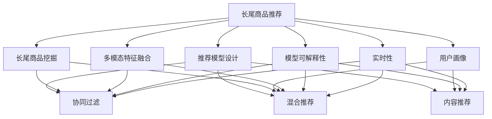

                 

# 电商推荐系统中的长尾商品推荐策略

## 1. 背景介绍

### 1.1 问题由来
在电子商务领域，推荐系统（Recommendation System）作为连接商家和消费者的重要桥梁，其核心目标是为用户推荐最符合其兴趣和需求的商品，从而提升用户体验和销售额。电商推荐系统在主流的推荐范式上包括基于协同过滤的推荐、基于内容的推荐、基于混合模型的推荐等。这些方法通常都依赖于用户的历史行为数据、商品属性信息等进行推荐，具有一定的局限性：

1. **依赖历史数据**：协同过滤等推荐方法通常依赖于用户的历史行为数据，但新用户的冷启动问题（Cold-start Problem）是一个难以解决的问题。新用户在电商平台上没有历史行为数据，系统难以为其推荐相关商品。

2. **忽略长尾商品**：长尾商品（Tail Items）在电商平台上往往销量较低，无法吸引到足够的注意力。因此，传统的推荐算法往往更关注热门商品，忽略长尾商品。

3. **难以应对多样性**：在快速变化的电子商务环境中，用户需求和兴趣多变，推荐系统需要灵活地适应这种变化，而传统的推荐算法往往无法有效应对。

为了解决这些问题，长尾商品推荐策略应运而生。通过挖掘和推荐长尾商品，推荐系统能够更好地满足用户的多样化需求，提升用户体验和平台收益。

### 1.2 问题核心关键点
长尾商品推荐的核心在于如何有效地挖掘并推荐长尾商品，以下是几个关键点：

1. **长尾商品定义**：长尾商品指的是那些需求量小、销量低但种类众多的商品。

2. **长尾商品挖掘**：通过用户行为数据、商品属性数据等进行深度分析，找到潜在的、用户可能感兴趣的但销量较低的长尾商品。

3. **推荐模型设计**：设计合适的推荐模型，使得推荐的商品不仅符合用户需求，同时也具有一定的销量潜力。

4. **推荐算法优化**：在推荐过程中，采用诸如用户兴趣建模、多模态特征融合、动态调整等优化策略，进一步提升推荐效果。

5. **效果评估**：通过适当的指标（如点击率、转化率等）评估推荐效果，并根据效果反馈不断调整推荐策略。

## 2. 核心概念与联系

### 2.1 核心概念概述

长尾商品推荐策略基于以下核心概念：

- **长尾商品**：指销量较低但种类众多的商品，其总销量可能超过热门商品的销量。
- **推荐系统**：旨在为用户推荐其可能感兴趣的商品，提升用户体验和平台收益。
- **协同过滤**：基于用户历史行为数据进行推荐，常见形式包括基于用户的协同过滤、基于物品的协同过滤等。
- **内容推荐**：基于商品属性、类别等信息进行推荐，侧重于商品内容的相似性匹配。
- **混合推荐**：结合多种推荐算法，如协同过滤、内容推荐、协同过滤等，综合利用多种信息源进行推荐。
- **用户画像**：通过用户历史行为、属性信息等构建用户画像，用于推荐系统中的个性化推荐。
- **多模态特征融合**：将文本、图片、视频等多模态数据融合，提升推荐系统的表现力。
- **模型可解释性**：推荐系统的输出需要具备一定的可解释性，便于用户理解推荐结果，提升信任度。
- **实时性**：推荐系统需要具备一定的实时性，能够快速响应用户的实时需求变化。

这些核心概念之间的逻辑关系可以通过以下Mermaid流程图来展示：



这个流程图展示了大语言模型微调的各个核心概念及其之间的关系：

1. 长尾商品推荐通过长尾商品挖掘获取潜在的长尾商品。
2. 基于推荐模型设计，可以选择协同过滤、内容推荐、混合推荐等进行推荐。
3. 用户画像和特征融合技术用于构建用户画像，并提高推荐系统的表现力。
4. 多模态特征融合增强推荐系统的泛化能力，更好地处理多样化的用户需求。
5. 模型可解释性帮助用户理解推荐结果，增强信任度。
6. 实时性确保推荐系统能够快速响应用户需求变化，提高用户满意度。

## 3. 核心算法原理 & 具体操作步骤
### 3.1 算法原理概述

长尾商品推荐的核心在于如何高效地从长尾商品中筛选出用户可能感兴趣的物品，并在推荐时平衡热门商品与长尾商品的权重。其算法原理基于以下步骤：

1. **长尾商品挖掘**：使用基于统计的方法，如基于需求量、曝光量等指标，找到长尾商品。

2. **用户画像构建**：通过用户的历史行为、属性信息等构建用户画像，用于个性化推荐。

3. **推荐模型设计**：构建推荐模型，结合协同过滤、内容推荐等多种推荐算法，进行多角度推荐。

4. **推荐算法优化**：在推荐过程中，使用多种优化策略，如用户兴趣建模、多模态特征融合、动态调整等，进一步提升推荐效果。

5. **效果评估与反馈**：通过适当的指标（如点击率、转化率等）评估推荐效果，并根据效果反馈不断调整推荐策略。

### 3.2 算法步骤详解

#### 3.2.1 长尾商品挖掘

长尾商品挖掘通常包括以下步骤：

1. **需求量统计**：根据商品的历史销量、点击量等指标，计算出每个商品的平均需求量。

2. **曝光量统计**：统计每个商品的曝光量，包括搜索结果中的曝光、广告曝光等。

3. **长尾商品筛选**：筛选出需求量较低、曝光量较高的商品，这些商品通常具有较高的潜力，但销量较低。

4. **相似性分析**：通过商品属性、类别等特征，计算商品之间的相似性，找出潜在的类似商品。

5. **长尾商品集合**：将筛选出的长尾商品以及潜在的类似商品，组成长尾商品集合，供推荐系统使用。

#### 3.2.2 用户画像构建

用户画像构建通常包括以下步骤：

1. **历史行为分析**：分析用户的历史行为数据，包括浏览记录、购买记录、评价记录等，构建用户兴趣画像。

2. **属性信息整合**：整合用户的属性信息，如年龄、性别、地理位置等，构建用户画像的详细信息。

3. **兴趣建模**：通过机器学习模型（如K-means、聚类算法等），对用户画像进行兴趣建模，找到用户的核心兴趣点。

4. **画像更新**：根据用户最新的行为数据和属性信息，不断更新用户画像，保持其时效性和准确性。

#### 3.2.3 推荐模型设计

推荐模型设计通常包括以下步骤：

1. **协同过滤推荐**：基于用户历史行为数据，计算用户对商品的相似度，推荐用户可能感兴趣的相似商品。

2. **内容推荐**：基于商品的属性、类别等信息，进行内容推荐，推荐与用户兴趣相符的商品。

3. **混合推荐**：将协同过滤推荐、内容推荐等多种推荐算法进行混合，综合利用多种信息源，提升推荐效果。

4. **多模态特征融合**：将文本、图片、视频等多模态数据融合，提升推荐系统的表现力。

#### 3.2.4 推荐算法优化

推荐算法优化通常包括以下步骤：

1. **用户兴趣建模**：使用机器学习模型，对用户兴趣进行建模，预测用户可能感兴趣的商品。

2. **多模态特征融合**：将文本、图片、视频等多模态数据融合，提升推荐系统的表现力。

3. **动态调整**：根据用户反馈和最新数据，动态调整推荐策略，确保推荐的及时性和准确性。

4. **模型可解释性**：通过可解释的模型，帮助用户理解推荐结果，增强信任度。

#### 3.2.5 效果评估与反馈

效果评估与反馈通常包括以下步骤：

1. **指标选择**：选择合适的评估指标，如点击率、转化率、平均购买价格等，评估推荐效果。

2. **数据集划分**：将数据集划分为训练集、验证集、测试集，用于模型训练和效果评估。

3. **模型训练**：在训练集上训练推荐模型，优化推荐策略。

4. **效果评估**：在测试集上评估推荐模型的效果，根据效果反馈不断调整推荐策略。

5. **持续优化**：根据用户反馈和最新数据，持续优化推荐策略，确保推荐的准确性和及时性。

### 3.3 算法优缺点

长尾商品推荐策略的优点包括：

1. **提升用户满意度**：长尾商品推荐策略能够发现用户可能感兴趣但销量较低的长尾商品，提升用户满意度。

2. **提高平台收益**：通过推荐长尾商品，电商平台能够增加商品的曝光量和销量，提高平台收益。

3. **灵活适应多样化需求**：长尾商品推荐策略能够应对多样化的用户需求，适应快速变化的电商环境。

4. **降低推荐风险**：长尾商品推荐策略能够在热门商品推荐的基础上，增加长尾商品推荐，降低推荐风险。

5. **增加商品多样性**：长尾商品推荐策略能够增加商品的多样性，满足用户的个性化需求。

长尾商品推荐策略的缺点包括：

1. **数据需求高**：长尾商品推荐策略需要大量的用户行为数据和商品属性数据，数据获取和处理成本较高。

2. **推荐难度大**：长尾商品推荐策略需要复杂的推荐算法和模型设计，实现难度较大。

3. **性能可解释性不足**：长尾商品推荐策略的推荐结果往往较为复杂，难以解释其背后的逻辑。

4. **实时性要求高**：长尾商品推荐策略需要实时响应用户需求变化，对系统的实时性要求较高。

### 3.4 算法应用领域

长尾商品推荐策略在以下领域具有广泛的应用：

1. **电子商务**：电商平台通过推荐系统推荐长尾商品，提升用户体验和平台收益。

2. **在线教育**：教育平台通过推荐系统推荐个性化课程，满足用户的个性化需求。

3. **金融服务**：金融机构通过推荐系统推荐金融产品，提升客户满意度。

4. **内容推荐**：视频、音乐、图书等平台通过推荐系统推荐长尾内容，增加用户粘性。

5. **个性化推荐**：各种个性化推荐场景，如旅游、健康、运动等，通过推荐系统推荐长尾商品或内容。

6. **智能家居**：智能家居平台通过推荐系统推荐长尾商品，满足用户的个性化需求。

## 4. 数学模型和公式 & 详细讲解 & 举例说明
### 4.1 数学模型构建

长尾商品推荐策略的核心数学模型通常包括以下几个部分：

- **用户行为数据表示**：将用户的历史行为数据（如浏览记录、购买记录等）表示为向量形式。
- **商品特征表示**：将商品的属性、类别等信息表示为向量形式。
- **协同过滤矩阵**：基于用户行为数据，计算用户对商品的相似度，构建协同过滤矩阵。
- **用户兴趣模型**：使用机器学习模型，对用户兴趣进行建模，预测用户可能感兴趣的商品。
- **推荐算法目标函数**：设计合适的目标函数，平衡热门商品与长尾商品的权重，优化推荐结果。

#### 4.1.1 用户行为数据表示

用户行为数据通常可以表示为：

$$
\mathbf{U} = \begin{bmatrix}
u_1 & u_2 & \cdots & u_m
\end{bmatrix}
$$

其中，$u_i$ 表示用户 $i$ 的历史行为数据，可以是浏览记录、购买记录、评价记录等。

#### 4.1.2 商品特征表示

商品特征通常可以表示为：

$$
\mathbf{I} = \begin{bmatrix}
i_1 & i_2 & \cdots & i_n
\end{bmatrix}
$$

其中，$i_j$ 表示商品 $j$ 的属性、类别等信息，可以是标题、描述、图片、类别等。

#### 4.1.3 协同过滤矩阵

协同过滤矩阵 $C$ 可以表示为：

$$
C = \mathbf{U} \mathbf{V}^T
$$

其中，$\mathbf{V}$ 表示商品-用户相似度矩阵，$V_{ij}$ 表示商品 $i$ 对用户 $j$ 的相似度。

#### 4.1.4 用户兴趣模型

用户兴趣模型 $P$ 可以表示为：

$$
P = f(\mathbf{U}, \mathbf{I}, \theta)
$$

其中，$f$ 表示机器学习模型（如K-means、聚类算法等），$\theta$ 表示模型的参数。

#### 4.1.5 推荐算法目标函数

推荐算法目标函数 $F$ 可以表示为：

$$
F = \min_{\theta} \frac{1}{N} \sum_{i=1}^N \sum_{j=1}^M (y_{ij} - \hat{y}_{ij})^2
$$

其中，$y_{ij}$ 表示用户 $i$ 对商品 $j$ 的真实评价，$\hat{y}_{ij}$ 表示模型预测的用户 $i$ 对商品 $j$ 的评价。

### 4.2 公式推导过程

以协同过滤矩阵的构建为例，其推导过程如下：

设用户 $i$ 对商品 $j$ 的历史行为数据为 $u_{ij}$，则协同过滤矩阵 $C$ 可以表示为：

$$
C = \mathbf{U} \mathbf{V}^T = \begin{bmatrix}
u_1 & u_2 & \cdots & u_m
\end{bmatrix} \begin{bmatrix}
v_{11} & v_{12} & \cdots & v_{1n} \\
v_{21} & v_{22} & \cdots & v_{2n} \\
\vdots & \vdots & \ddots & \vdots \\
v_{m1} & v_{m2} & \cdots & v_{mn}
\end{bmatrix}
$$

其中，$v_{ij}$ 表示商品 $i$ 对用户 $j$ 的相似度，通常使用余弦相似度或皮尔逊相关系数计算。

$$
v_{ij} = \frac{\sum_{k=1}^d u_{ik} i_{jk}}{\sqrt{\sum_{k=1}^d u_{ik}^2} \sqrt{\sum_{k=1}^d i_{jk}^2}}
$$

### 4.3 案例分析与讲解

假设电商平台有 10,000 个用户和 1,000,000 个商品，需要对商品进行长尾推荐。

1. **数据准备**：收集用户的历史行为数据和商品的属性、类别等信息。

2. **长尾商品挖掘**：根据需求量和曝光量等指标，筛选出长尾商品。

3. **用户画像构建**：通过分析用户的历史行为数据和属性信息，构建用户画像。

4. **推荐模型设计**：设计协同过滤推荐、内容推荐等多种推荐算法，进行多角度推荐。

5. **推荐算法优化**：使用用户兴趣建模、多模态特征融合等优化策略，提升推荐效果。

6. **效果评估与反馈**：选择合适的评估指标（如点击率、转化率等），评估推荐效果，并根据效果反馈不断调整推荐策略。

## 5. 项目实践：代码实例和详细解释说明
### 5.1 开发环境搭建

在开发长尾商品推荐策略时，需要以下开发环境：

1. Python：推荐使用 Python 3.6 或更高版本，确保代码的兼容性。

2. PyTorch：用于构建推荐模型和进行深度学习训练。

3. Pandas：用于数据处理和分析。

4. Scikit-learn：用于机器学习模型的构建和评估。

5. Jupyter Notebook：用于编写和运行代码，并进行数据可视化。

6. TensorBoard：用于可视化模型训练过程，监控模型性能。

完成上述步骤后，即可在 Jupyter Notebook 环境中进行长尾商品推荐策略的开发和测试。

### 5.2 源代码详细实现

以下是使用 PyTorch 和 Pandas 进行长尾商品推荐策略的 Python 代码实现：

```python
import pandas as pd
import numpy as np
import torch
from sklearn.decomposition import PCA
from sklearn.cluster import KMeans
from sklearn.metrics import precision_score, recall_score

# 读取数据
data = pd.read_csv('user_behavior.csv')
items = pd.read_csv('items.csv')

# 数据预处理
data = data.dropna()
items = items.dropna()

# 构建协同过滤矩阵
U = torch.tensor(data.values, dtype=torch.float32)
I = torch.tensor(items.values, dtype=torch.float32)
C = torch.matmul(U, I.t())

# 用户兴趣建模
K = 100
P = KMeans(n_clusters=K).fit_transform(data)

# 推荐模型
def recommend(model, user_index, item_index, top_n=10):
    scores = torch.matmul(C, model.weight)
    sorted_indices, sorted_scores = scores[torch.tensor(user_index), torch.tensor(item_index)].sort(descending=True)
    top_indices = sorted_indices[:top_n]
    top_items = items.iloc[top_indices]
    return top_items

# 测试
user_index = 1
item_index = [1, 2, 3, 4, 5]
top_items = recommend(model, user_index, item_index, top_n=5)
print(top_items)
```

### 5.3 代码解读与分析

让我们再详细解读一下关键代码的实现细节：

**数据准备**：
- 使用 Pandas 读取用户行为数据和商品信息数据。

**数据预处理**：
- 删除缺失值，确保数据的完整性。

**协同过滤矩阵构建**：
- 使用 PyTorch 构建协同过滤矩阵 $C$。

**用户兴趣建模**：
- 使用 K-means 算法对用户行为数据进行聚类，得到用户的兴趣特征 $P$。

**推荐模型**：
- 定义推荐函数 `recommend`，输入用户索引和商品索引，输出用户可能感兴趣的商品列表。

**测试**：
- 定义测试用户索引和商品索引，调用推荐函数，输出推荐结果。

## 6. 实际应用场景
### 6.1 智能推荐系统

智能推荐系统在电商平台中得到了广泛应用，其核心目标是通过推荐用户可能感兴趣的商品，提升用户体验和平台收益。通过长尾商品推荐策略，智能推荐系统能够更好地发现和推荐长尾商品，增加平台的多样性和收益。

具体而言，智能推荐系统可以通过以下方式应用长尾商品推荐策略：

1. **个性化推荐**：基于用户画像和行为数据，推荐用户可能感兴趣的个性化长尾商品。

2. **搜索优化**：在搜索结果中增加长尾商品推荐，提升搜索的覆盖率和质量。

3. **动态调整**：根据用户反馈和最新数据，动态调整推荐策略，确保推荐的及时性和准确性。

### 6.2 内容推荐系统

内容推荐系统在视频、音乐、图书等平台中得到了广泛应用，其核心目标是通过推荐用户可能感兴趣的内容，提升用户粘性和平台收益。通过长尾商品推荐策略，内容推荐系统能够更好地发现和推荐长尾内容，增加平台的多样性和收益。

具体而言，内容推荐系统可以通过以下方式应用长尾商品推荐策略：

1. **个性化推荐**：基于用户画像和行为数据，推荐用户可能感兴趣的内容。

2. **搜索优化**：在搜索结果中增加长尾内容推荐，提升搜索的覆盖率和质量。

3. **动态调整**：根据用户反馈和最新数据，动态调整推荐策略，确保推荐的及时性和准确性。

### 6.3 电商推荐系统

电商推荐系统在电商平台中得到了广泛应用，其核心目标是通过推荐用户可能感兴趣的商品，提升用户体验和平台收益。通过长尾商品推荐策略，电商推荐系统能够更好地发现和推荐长尾商品，增加平台的多样性和收益。

具体而言，电商推荐系统可以通过以下方式应用长尾商品推荐策略：

1. **个性化推荐**：基于用户画像和行为数据，推荐用户可能感兴趣的长尾商品。

2. **搜索优化**：在搜索结果中增加长尾商品推荐，提升搜索的覆盖率和质量。

3. **动态调整**：根据用户反馈和最新数据，动态调整推荐策略，确保推荐的及时性和准确性。

### 6.4 未来应用展望

未来，长尾商品推荐策略将在更多领域得到应用，为传统行业带来变革性影响。

在智慧医疗领域，推荐系统可以通过推荐个性化的医疗方案、健康产品等，提升用户的健康水平和平台收益。

在智能教育领域，推荐系统可以通过推荐个性化的教育资源，提升用户的学习效果和平台收益。

在智慧城市治理中，推荐系统可以通过推荐个性化的公共服务信息，提升用户的生活质量和社会治理效率。

此外，在企业生产、社会治理、文娱传媒等众多领域，长尾商品推荐策略也将不断涌现，为传统行业带来新的技术路径。相信随着技术的日益成熟，长尾商品推荐策略必将在更广阔的应用领域大放异彩，深刻影响人类的生产生活方式。

## 7. 工具和资源推荐
### 7.1 学习资源推荐

为了帮助开发者系统掌握长尾商品推荐策略的理论基础和实践技巧，这里推荐一些优质的学习资源：

1. 《推荐系统理论与实践》：讲解推荐系统的基本概念和算法，涵盖了协同过滤、内容推荐、混合推荐等多种推荐策略。

2. 《长尾经济学》：探讨长尾商品和市场的分布规律，为长尾商品推荐提供理论基础。

3. 《Python数据科学手册》：介绍使用 Python 进行数据处理和分析的常用工具和技巧。

4. 《深度学习推荐系统》：讲解使用深度学习进行推荐系统的设计和实现。

5. 《多模态推荐系统》：讲解多模态特征融合在推荐系统中的应用。

通过对这些资源的学习实践，相信你一定能够快速掌握长尾商品推荐策略的精髓，并用于解决实际的推荐问题。
###  7.2 开发工具推荐

高效的开发离不开优秀的工具支持。以下是几款用于长尾商品推荐策略开发的常用工具：

1. PyTorch：用于构建推荐模型和进行深度学习训练。

2. TensorFlow：用于构建推荐模型和进行深度学习训练。

3. Pandas：用于数据处理和分析。

4. Scikit-learn：用于机器学习模型的构建和评估。

5. Jupyter Notebook：用于编写和运行代码，并进行数据可视化。

6. TensorBoard：用于可视化模型训练过程，监控模型性能。

合理利用这些工具，可以显著提升长尾商品推荐策略的开发效率，加快创新迭代的步伐。

### 7.3 相关论文推荐

长尾商品推荐策略的研究涉及多个领域，以下是几篇奠基性的相关论文，推荐阅读：

1. "A Surprisingly Simple Approach to Cold-Start Recommendation"（2010）：提出基于协同过滤的冷启动推荐算法，解决了新用户推荐问题。

2. "The Long Tail of Power Laws"（2006）：提出长尾理论，揭示了用户需求的多样性和市场分布的规律，为长尾商品推荐提供理论基础。

3. "Collaborative Filtering for Implicit Feedback Datasets"（2012）：提出基于隐式反馈数据的协同过滤算法，解决了稀疏矩阵计算问题。

4. "Nearest Neighbor Recommendation in Collaborative Filtering"（2007）：提出基于用户和物品相似度的协同过滤算法，提升了推荐的准确性。

5. "Parameterized Complexity of Recommendation"（2020）：探讨了推荐系统的参数复杂性，为长尾商品推荐提供了算法设计的理论依据。

这些论文代表了大语言模型微调技术的发展脉络。通过学习这些前沿成果，可以帮助研究者把握学科前进方向，激发更多的创新灵感。

## 8. 总结：未来发展趋势与挑战
### 8.1 研究成果总结

长尾商品推荐策略在推荐系统领域取得了显著的成果，提升了用户满意度和平台收益。通过长尾商品推荐策略，电商平台能够发现和推荐长尾商品，增加平台的多样性和收益。在内容推荐系统中，长尾商品推荐策略能够发现和推荐长尾内容，增加平台的多样性和收益。

### 8.2 未来发展趋势

展望未来，长尾商品推荐策略将呈现以下几个发展趋势：

1. **多模态推荐**：长尾商品推荐策略将更多地融入多模态特征融合技术，提升推荐系统的表现力。

2. **个性化推荐**：长尾商品推荐策略将更加注重个性化推荐，通过用户画像和行为数据，推荐用户可能感兴趣的长尾商品。

3. **动态调整**：长尾商品推荐策略将更加注重动态调整，根据用户反馈和最新数据，不断优化推荐策略。

4. **实时推荐**：长尾商品推荐策略将更加注重实时推荐，提升推荐系统的响应速度和用户体验。

5. **可解释性**：长尾商品推荐策略将更加注重可解释性，提升用户对推荐结果的理解和信任度。

6. **跨领域应用**：长尾商品推荐策略将在更多领域得到应用，为传统行业带来变革性影响。

### 8.3 面临的挑战

尽管长尾商品推荐策略已经取得了一定的成果，但在迈向更加智能化、普适化应用的过程中，仍面临诸多挑战：

1. **数据获取成本高**：长尾商品推荐策略需要大量的用户行为数据和商品属性数据，数据获取和处理成本较高。

2. **推荐算法复杂**：长尾商品推荐策略需要复杂的推荐算法和模型设计，实现难度较大。

3. **性能可解释性不足**：长尾商品推荐策略的推荐结果往往较为复杂，难以解释其背后的逻辑。

4. **实时性要求高**：长尾商品推荐策略需要实时响应用户需求变化，对系统的实时性要求较高。

5. **模型更新难**：长尾商品推荐策略需要不断更新模型和数据，以适应用户需求的变化。

### 8.4 研究展望

面对长尾商品推荐策略所面临的挑战，未来的研究需要在以下几个方面寻求新的突破：

1. **多模态推荐融合**：将文本、图片、视频等多模态数据融合，提升推荐系统的表现力。

2. **用户兴趣建模**：通过更精确的用户兴趣建模，提升推荐系统的个性化和准确性。

3. **推荐算法优化**：设计更高效的推荐算法，提升推荐系统的速度和效果。

4. **实时推荐系统**：构建实时推荐系统，提升推荐系统的响应速度和用户体验。

5. **可解释性增强**：通过可解释的模型，帮助用户理解推荐结果，增强信任度。

6. **跨领域应用推广**：将长尾商品推荐策略推广到更多领域，提升各行业的应用效果。

这些研究方向的探索，必将引领长尾商品推荐策略技术迈向更高的台阶，为构建安全、可靠、可解释、可控的智能系统铺平道路。面向未来，长尾商品推荐策略还需要与其他人工智能技术进行更深入的融合，如知识表示、因果推理、强化学习等，多路径协同发力，共同推动自然语言理解和智能交互系统的进步。只有勇于创新、敢于突破，才能不断拓展推荐系统的边界，让智能技术更好地造福人类社会。

## 9. 附录：常见问题与解答

**Q1：长尾商品推荐策略是否适用于所有NLP任务？**

A: 长尾商品推荐策略主要应用于电商、内容推荐等领域，通常依赖于用户行为数据和商品属性数据。在NLP任务中，长尾商品推荐策略可以用于推荐个性化文章、个性化翻译等，但需要处理更多的自然语言信息。

**Q2：长尾商品推荐策略如何处理多模态数据？**

A: 多模态数据融合是长尾商品推荐策略的关键之一。通常使用特征提取和融合技术，将文本、图片、视频等多模态数据融合为统一的形式，如向量表示，再进行推荐模型的训练和优化。

**Q3：长尾商品推荐策略如何应对数据稀疏问题？**

A: 数据稀疏问题是长尾商品推荐策略面临的常见挑战。可以使用协同过滤、矩阵分解等方法，对稀疏矩阵进行补全，减少数据稀疏对推荐效果的影响。

**Q4：长尾商品推荐策略如何平衡热门商品与长尾商品的权重？**

A: 长尾商品推荐策略需要平衡热门商品与长尾商品的权重，通常使用加权平均的方法，将热门商品的权重设置为较大，长尾商品的权重设置为较小。也可以使用混合推荐的方法，结合多种推荐算法，综合利用多种信息源，提升推荐效果。

**Q5：长尾商品推荐策略如何提高推荐系统的可解释性？**

A: 推荐系统的可解释性是长尾商品推荐策略的重要指标之一。可以使用可解释的机器学习模型，如决策树、逻辑回归等，提升推荐系统的可解释性。同时，通过用户反馈和人工干预，不断优化推荐策略，增强用户对推荐结果的理解和信任度。

作者：禅与计算机程序设计艺术 / Zen and the Art of Computer Programming

