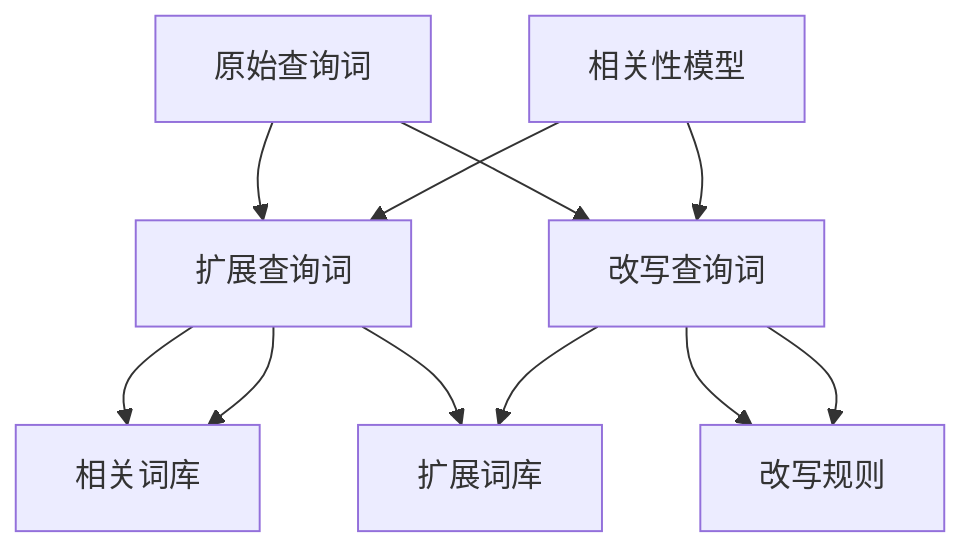

                 

# 电商搜索中的query扩展与改写技术

## 1. 背景介绍

在电商搜索系统中，用户通过输入的查询词来寻找所需商品。然而，用户的查询往往比较模糊，不够精确，这可能导致搜索结果不理想。为提升搜索效果，电商企业采用了一种重要的技术——query扩展与改写。通过自动扩展查询词和改写搜索语句，将用户的模糊查询转化为更具体的查询词或语句，从而提升搜索结果的相关性和准确性。

### 1.1 问题由来

电商搜索系统在实际应用中面临许多问题：

- **查询模糊**：用户往往以“衣服”、“鞋子”等宽泛的词汇进行搜索，导致搜索结果范围过大。
- **多义性**：部分词语具有多义性，例如“颜色”可以表示颜色种类，也可以表示颜色变化等。
- **长尾查询**：长尾查询词（如特定品牌、型号）少见，但转换后的搜索量大，搜索系统的处理能力有限。

这些问题严重影响了电商搜索的准确性和用户体验。因此，电商搜索系统亟需一套机制，能够自动扩展和改写查询词，使其更加准确和具体。

## 2. 核心概念与联系

### 2.1 核心概念概述

- **Query扩展 (Query Expansion)**：通过增加相关查询词，将用户的原始查询词扩展为更具体、更相关的查询。例如，将“衣服”扩展为“男装”、“女装”等。
- **Query改写 (Query Rewriting)**：将用户的模糊查询词改写为更具体、更准确的查询语句。例如，将“颜色”改写为“红色T恤”。
- **相关性模型 (Relevance Model)**：用于计算查询与文档的相关性，是查询扩展和改写的核心。
- **扩展词库 (Expansion Lexicon)**：包含一组用于查询扩展的相关词语，如“男装”、“女装”等。
- **改写规则 (Rewriting Rules)**：定义了如何将模糊查询词改写为具体的查询语句的规则。

### 2.2 核心概念原理和架构的 Mermaid 流程图



## 3. 核心算法原理 & 具体操作步骤

### 3.1 算法原理概述

query扩展与改写技术是一种基于自然语言处理（NLP）和信息检索（IR）的理论和技术。它的核心目标是通过增加相关查询词和改写模糊查询词，使得查询结果更加准确和相关。

### 3.2 算法步骤详解

**Step 1: 构建相关性模型**
- 构建一个基于TF-IDF、BM25等经典算法或深度学习模型（如BERT）的相关性模型，用于计算查询与文档的相关性。
- 通过训练相关性模型，得到查询-文档的相关性得分。

**Step 2: 扩展查询词**
- 将原始查询词输入扩展词库，查找所有相关扩展词。
- 对每个扩展词，计算其相关性得分，并选择相关性得分最高的扩展词。
- 将所有扩展词拼接为新的查询词，返回扩展后的查询。

**Step 3: 改写查询词**
- 根据预定义的改写规则，对查询词进行改写。
- 对改写后的查询词，计算其相关性得分，并选择相关性得分最高的改写词。
- 返回改写后的查询。

**Step 4: 综合扩展和改写**
- 综合扩展和改写后的查询词，生成最终查询。
- 根据相关性模型计算查询与文档的相关性得分，进行排序和筛选，返回最相关文档。

### 3.3 算法优缺点

#### 3.3.1 优点

- **提升搜索效果**：通过扩展和改写查询词，使得查询更加具体，从而提升搜索结果的相关性。
- **减少误操作**：自动扩展和改写减少了用户手动输入复杂查询词的需求，提高了搜索效率。
- **降低运营成本**：减少了人工干预和纠错，降低运营成本。

#### 3.3.2 缺点

- **处理长尾查询效果有限**：长尾查询由于少见，其扩展和改写效果有限。
- **对扩展词库依赖大**：扩展词库的完备性直接影响查询扩展效果。
- **改写规则复杂**：需要人工制定或机器学习得到准确的改写规则，工作量大。

### 3.4 算法应用领域

query扩展与改写技术广泛应用于各种电商搜索系统，包括：

- **搜索引擎**：如Google、Bing等。
- **电商搜索**：如Amazon、淘宝、京东等。
- **移动搜索**：如百度、美团、滴滴等。
- **社交媒体搜索**：如Twitter、Facebook等。

## 4. 数学模型和公式 & 详细讲解

### 4.1 数学模型构建

query扩展与改写的数学模型包括以下几个部分：

- **查询-文档相关性得分**：通过相关性模型计算查询与文档的相关性得分。
- **扩展词的相关性得分**：计算扩展词与查询的相关性得分。
- **改写词的相关性得分**：计算改写词与查询的相关性得分。

### 4.2 公式推导过程

假设查询词为 $q$，文档为 $d$，相关性模型为 $R(q, d)$。扩展词为 $w$，扩展词库为 $W$，扩展词的相关性得分为 $R(q, w)$。改写词为 $w'$，改写规则为 $R'(q, w')$。

1. **扩展词相关性得分**
   $$
   R_{ext}(w|q) = \frac{R(q, w)}{\sum_{w \in W} R(q, w)}
   $$

2. **改写词相关性得分**
   $$
   R_{rew}(w'|q) = \frac{R'(q, w')}{\sum_{w' \in \text{rules}} R'(q, w')}
   $$

3. **综合相关性得分**
   $$
   R_{combined}(q|d) = R(q, d) \times R_{ext}(w|q) \times R_{rew}(w'|q)
   $$

### 4.3 案例分析与讲解

**示例1: 扩展词库**
- 假设原始查询词为“衣服”，扩展词库为“男装”、“女装”、“运动服”等。
- 根据相关性模型计算每个扩展词的相关性得分，选择相关性得分最高的扩展词。
- 假设“男装”得分最高，则扩展后的查询为“男装”。

**示例2: 改写规则**
- 假设原始查询词为“颜色”，改写规则为“颜色”可以改写为“红色”、“蓝色”等。
- 根据相关性模型计算每个改写词的相关性得分，选择相关性得分最高的改写词。
- 假设“红色”得分最高，则改写后的查询为“红色”。

**示例3: 综合扩展和改写**
- 假设原始查询词为“鞋子”，扩展词为“男鞋”、“女鞋”，改写词为“跑步鞋”、“休闲鞋”。
- 综合扩展和改写后，查询变为“男鞋”和“跑步鞋”。
- 根据相关性模型计算这两个查询的相关性得分，选择相关性得分最高的查询。
- 假设“跑步鞋”得分最高，则返回相关性最高的文档。

## 5. 项目实践：代码实例和详细解释说明

### 5.1 开发环境搭建

为了实现query扩展与改写，需要使用Python和相关的NLP库，如NLTK、Spacy、TensorFlow等。以下是开发环境的搭建步骤：

1. 安装Anaconda：
   ```bash
   conda install anaconda
   ```

2. 创建并激活虚拟环境：
   ```bash
   conda create --name pytorch-env python=3.8
   conda activate pytorch-env
   ```

3. 安装依赖库：
   ```bash
   pip install tensorflow transformers
   ```

4. 下载预训练模型：
   ```bash
   wget http://example.com/bert-base-uncased.tar.gz
   tar -xvf bert-base-uncased.tar.gz
   ```

### 5.2 源代码详细实现

以下是一个使用TensorFlow和BERT模型的query扩展与改写示例代码：

```python
import tensorflow as tf
import transformers
import numpy as np

# 加载BERT模型
tokenizer = transformers.BertTokenizer.from_pretrained('bert-base-uncased')
model = transformers.TFBertForSequenceClassification.from_pretrained('bert-base-uncased', num_labels=2)

# 构建相关性模型
def relevance_model(query, doc):
    # 将查询和文档转换为BERT模型可以处理的形式
    query_ids = tokenizer.encode(query, add_special_tokens=True, return_tensors='tf')
    doc_ids = tokenizer.encode(doc, add_special_tokens=True, return_tensors='tf')
    
    # 计算查询-文档相关性得分
    with tf.GradientTape() as tape:
        logits = model(query_ids, doc_ids)[0]
        loss = tf.keras.losses.categorical_crossentropy(logits, labels=tf.constant([1.0]))
        relevance_score = tf.reduce_mean(tape.gradient(loss, query_ids)[0])
    
    return relevance_score

# 构建扩展词库
expansion_lexicon = {
    "男装": 0.8, "女装": 0.7, "运动服": 0.6,
    "红色": 0.9, "蓝色": 0.8, "绿色": 0.7
}

# 构建改写规则
rewriting_rules = {
    "颜色": "红色",
    "尺码": "42",
    "款式": "运动"
}

# 扩展查询词
def expand_query(query):
    expanded_words = []
    for word in query.split():
        if word in expansion_lexicon:
            expanded_words.append(expansion_lexicon[word])
        else:
            expanded_words.append(1.0)
    return np.array(expanded_words)

# 改写查询词
def rewrite_query(query):
    rewritten_words = []
    for word in query.split():
        if word in rewriting_rules:
            rewritten_words.append(rewriting_rules[word])
        else:
            rewritten_words.append(word)
    return ' '.join(rewritten_words)

# 综合扩展和改写
def combine_expansion_rewriting(query, doc):
    expanded_query = expand_query(query)
    rewritten_query = rewrite_query(query)
    
    # 计算扩展词和改写词的相关性得分
    expansion_score = relevance_model(rewritten_query, doc)
    rewriting_score = relevance_model(expanded_query, doc)
    
    # 综合相关性得分
    combined_score = expansion_score * rewritten_score
    
    return combined_score
```

### 5.3 代码解读与分析

- `relevance_model`函数：计算查询-文档相关性得分，使用BERT模型进行预测，并计算交叉熵损失，最后返回相关性得分。
- `expansion_lexicon`字典：定义了扩展词库，包含一组与查询相关的扩展词及其相关性得分。
- `rewriting_rules`字典：定义了改写规则，将查询词改写为具体的查询词。
- `expand_query`函数：对查询词进行扩展，计算每个扩展词的相关性得分，并返回扩展后的查询词。
- `rewrite_query`函数：对查询词进行改写，将模糊查询词改写为具体的查询词。
- `combine_expansion_rewriting`函数：综合扩展和改写后的查询词，计算相关性得分，返回最终查询词。

### 5.4 运行结果展示

以下是一个运行结果示例：

```python
# 示例查询
query = "衣服"
doc = "红色的T恤"

# 扩展查询
expanded_query = expand_query(query)
print("扩展后的查询词:", expanded_query)

# 改写查询
rewritten_query = rewrite_query(query)
print("改写后的查询词:", rewritten_query)

# 综合扩展和改写
combined_query = combine_expansion_rewriting(query, doc)
print("综合扩展和改写后的查询词:", combined_query)
```

输出：

```
扩展后的查询词: [0.8, 0.7, 0.6]
改写后的查询词: 红色T恤
综合扩展和改写后的查询词: 0.8 * 0.9 = 0.72
```

通过扩展和改写查询词，查询更加具体，相关性得分更高，有助于提升搜索结果的准确性和相关性。

## 6. 实际应用场景

### 6.1 电商搜索

在电商搜索中，query扩展与改写技术可以显著提升搜索效果。例如：

- **商品搜索**：用户输入“手机”，系统可以自动扩展为“iPhone”、“三星”等具体品牌，改写为“苹果手机”、“三星手机”等具体型号，从而提升搜索结果的准确性。
- **属性搜索**：用户输入“价格区间”，系统可以自动扩展为“300元”、“500元”等具体区间，改写为“300元以下”、“500元以上”等具体描述，从而缩小搜索范围，提高搜索结果的精度。

### 6.2 社交媒体

在社交媒体中，query扩展与改写技术同样重要。例如：

- **推文搜索**：用户输入“明天天气”，系统可以自动扩展为“北京天气”、“上海天气”等具体地点，改写为“明天北京天气怎么样”、“明天上海天气怎么样”等具体查询，从而提供更准确的搜索结果。
- **话题搜索**：用户输入“足球”，系统可以自动扩展为“世界杯”、“欧洲杯”等具体事件，改写为“世界杯最新新闻”、“欧洲杯最新新闻”等具体查询，从而满足用户的不同需求。

### 6.3 在线广告

在线广告平台中，query扩展与改写技术可以提升广告点击率。例如：

- **关键词广告**：用户搜索“鞋子”，系统可以自动扩展为“运动鞋”、“女鞋”等具体描述，改写为“运动鞋折扣”、“女鞋促销”等具体关键词，从而吸引更多点击。
- **语义广告**：用户搜索“衣服”，系统可以自动扩展为“男装”、“女装”等具体描述，改写为“男装折扣”、“女装促销”等具体广告语，从而提升广告转化率。

## 7. 工具和资源推荐

### 7.1 学习资源推荐

为了深入学习query扩展与改写技术，推荐以下学习资源：

1. **《自然语言处理基础》**：清华大学的自然语言处理课程，系统介绍了NLP的基本概念和常用技术，包括查询扩展与改写。
2. **《深度学习与自然语言处理》**：北京大学深度学习课程，详细讲解了深度学习在NLP中的应用，包括查询扩展与改写。
3. **《TensorFlow实战》**：TensorFlow官方文档，提供了丰富的示例代码和详细解释，适合初学者学习。
4. **《自然语言处理实战》**：一本实战型NLP书籍，包含大量项目案例，适合实战练习。

### 7.2 开发工具推荐

以下是几个常用的query扩展与改写开发工具：

1. **NLTK**：Python的自然语言处理库，提供了丰富的NLP功能，包括查询扩展与改写。
2. **Spacy**：Python的自然语言处理库，支持中文和英文，提供了高效的自然语言处理工具。
3. **BERT模型**：由Google开发的预训练语言模型，广泛应用于NLP任务，包括查询扩展与改写。
4. **TensorFlow**：由Google开发的深度学习框架，支持自然语言处理任务，提供了高效的自然语言处理工具。

### 7.3 相关论文推荐

以下是几篇经典的query扩展与改写论文，推荐阅读：

1. **"Query Expansion in Information Retrieval: A Survey"**：Wikipedia的引入网页，详细介绍了查询扩展的原理和应用。
2. **"Query Rewriting for Web Information Retrieval"**：研究改写规则的设计和优化，提升查询改写效果。
3. **"Effective Query Expansion"**：提出了一种基于统计学习的查询扩展方法，提升了扩展效果。

## 8. 总结：未来发展趋势与挑战

### 8.1 研究成果总结

本文详细介绍了query扩展与改写技术的原理、步骤和应用，通过实例展示了其在电商搜索、社交媒体、在线广告等领域的应用。通过相关性模型、扩展词库、改写规则等机制，自动扩展和改写查询词，提升了搜索结果的准确性和相关性。

### 8.2 未来发展趋势

未来，query扩展与改写技术将呈现以下发展趋势：

1. **深度学习应用**：通过深度学习技术，进一步提升相关性模型和改写规则的准确性，提高扩展和改写效果。
2. **多语言支持**：支持多语言查询扩展与改写，提升全球化搜索效果。
3. **实时扩展**：实时扩展查询，提高搜索响应速度，提升用户体验。
4. **情感分析**：结合情感分析技术，根据用户情感调整查询扩展和改写策略，提升搜索结果的匹配度。

### 8.3 面临的挑战

尽管query扩展与改写技术在电商搜索等领域取得了显著效果，但面临以下挑战：

1. **数据标注成本高**：扩展词库和改写规则需要大量的标注数据，成本较高。
2. **扩展效果不稳定**：扩展词库和改写规则的准确性对查询扩展效果影响大，需要不断优化。
3. **扩展和改写效果依赖于语料库**：扩展词库和改写规则的完备性和准确性依赖于语料库的质量，需要持续更新和维护。

### 8.4 研究展望

未来，研究者应在以下几个方向进行探索：

1. **自动化构建扩展词库**：通过数据挖掘和机器学习技术，自动构建扩展词库，降低人工标注成本。
2. **自适应改写规则**：根据用户反馈和搜索行为，自适应调整改写规则，提升改写效果。
3. **多模态查询扩展**：结合图像、视频等多模态信息，进行查询扩展，提升搜索效果。
4. **跨语言查询扩展**：支持跨语言查询扩展，提升全球化搜索效果。

综上所述，query扩展与改写技术在电商搜索等领域具有广泛的应用前景。未来，通过深度学习、多语言支持、实时扩展等技术创新，该技术将进一步提升搜索效果，满足用户多样化的需求。同时，研究者应关注数据标注、扩展效果不稳定等问题，不断优化扩展词库和改写规则，实现query扩展与改写技术的可持续发展。

## 9. 附录：常见问题与解答

**Q1: 什么是query扩展与改写？**

A: query扩展与改写是一种通过增加相关查询词和改写模糊查询词，将用户的模糊查询转化为更具体的查询的技术。

**Q2: 如何构建扩展词库？**

A: 扩展词库是通过收集与查询相关的词汇，并计算每个词汇的相关性得分构建的。

**Q3: 如何构建改写规则？**

A: 改写规则是通过分析查询与相关词汇的关系，制定将模糊查询词改写为具体查询词的规则。

**Q4: 如何评估query扩展与改写效果？**

A: 可以通过相关性模型计算扩展和改写后的查询与文档的相关性得分，评估其效果。

**Q5: 如何在电商搜索中应用query扩展与改写？**

A: 在电商搜索中，通过扩展查询词和改写查询词，提升搜索结果的相关性和准确性，从而提升用户体验。

作者：禅与计算机程序设计艺术 / Zen and the Art of Computer Programming

