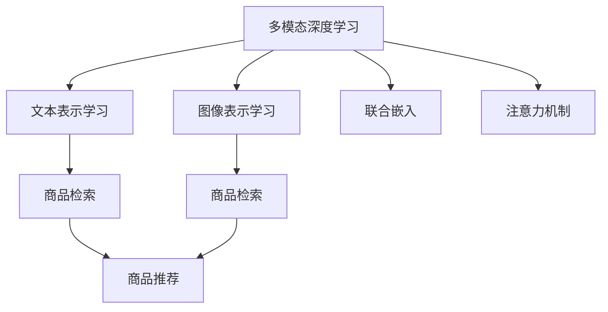

                 

# 电商搜索中的多模态商品检索：图文融合的深度学习模型

> 关键词：电商搜索, 多模态, 深度学习, 商品检索, 图文融合, 注意力机制

## 1. 背景介绍

在现代电商平台上，商品检索是用户获取产品信息、进行购物决策的关键环节。一个高效、准确的商品检索系统，能够显著提升用户满意度，增加商品转化率。然而，商品描述往往只包含文本信息，图像数据则以其直观、生动的特点在电商搜索中扮演着重要角色。如何利用丰富的图文信息，构建一个高效的商品检索系统，成为了电商领域的一大研究热点。

传统的商品检索模型多聚焦于文本数据的向量表示，而忽视了图像的语义信息。近年来，随着深度学习技术的发展，特别是多模态深度学习模型的涌现，研究人员逐渐意识到图文融合的巨大潜力。利用深度学习模型，可以将文本和图像信息进行联合表示，构建多模态向量空间，提升检索系统的准确性和鲁棒性。

本文旨在探讨如何构建一个高效的电商商品检索系统，通过图文融合的深度学习模型，实现多模态商品检索。首先，我们将介绍多模态深度学习的基本概念，并阐述其应用于电商商品检索的原理和优势。接着，我们将详细讲解图文融合的深度学习模型的构建，并给出具体的代码实现。最后，我们将结合实际应用场景，讨论该模型的未来发展趋势和面临的挑战。

## 2. 核心概念与联系

### 2.1 核心概念概述

为更好地理解多模态商品检索中的深度学习模型，本节将介绍几个密切相关的核心概念：

- 多模态深度学习(Multimodal Deep Learning)：指同时处理和分析来自不同感知通道（如视觉、听觉、文本等）的数据，构建联合表示，提升系统的理解力和决策能力。
- 商品检索(商品推荐)：在电商平台上，用户输入搜索关键词，系统自动检索出相关商品进行展示，以提高购物效率。
- 文本表示学习(Text Representation Learning)：利用深度学习模型学习文本的语义表示，通过向量空间进行文本匹配和检索。
- 图像表示学习(Image Representation Learning)：利用深度学习模型学习图像的语义表示，通过向量空间进行图像匹配和检索。
- 联合嵌入(Joint Embedding)：将不同模态的信息表示为联合的向量空间，使得各模态之间可以进行有效融合，提升系统的整体性能。
- 注意力机制(Attention Mechanism)：指模型根据输入数据的重要程度，动态分配不同特征的权重，集中注意力于重要信息，忽略无关信息。

这些核心概念之间的逻辑关系可以通过以下Mermaid流程图来展示：



这个流程图展示了几大核心概念及其之间的关系：

1. 多模态深度学习融合了视觉和文本数据，学习联合向量空间。
2. 文本表示学习和图像表示学习分别学习各自模态的语义表示。
3. 联合嵌入将不同模态的信息表示为联合的向量空间，使得各模态之间可以进行有效融合。
4. 注意力机制对不同特征进行加权处理，集中注意力于重要信息。
5. 商品检索利用文本和图像的联合向量空间，提升检索的准确性和鲁棒性。
6. 商品推荐结合商品检索结果，实现个性化推荐。

这些概念共同构成了电商商品检索系统的高效实现框架，使其能够充分利用多模态信息，提高检索系统的性能。

## 3. 核心算法原理 & 具体操作步骤
### 3.1 算法原理概述

电商商品检索系统中的深度学习模型，本质上是一个多模态表示学习的框架。其核心思想是：利用深度学习模型，将文本和图像信息进行联合表示，构建多模态向量空间，提升检索系统的准确性和鲁棒性。

假设给定一个电商商品集，每个商品由一张图片 $x$ 和一段文本描述 $y$ 组成。设文本和图像的表示器分别为 $f$ 和 $g$，则多模态表示学习的过程可以描述为：

$$
\mathbf{z} = f(y) \oplus g(x)
$$

其中 $\oplus$ 表示向量融合操作，如拼接、加权拼接等。$f$ 和 $g$ 可以是单独的深度学习模型，也可以共享部分参数以实现模型融合。

### 3.2 算法步骤详解

多模态商品检索的深度学习模型构建和训练，主要包括以下几个步骤：

**Step 1: 准备数据集**

- 收集电商商品的数据集，包括商品图片和文本描述。
- 将商品图片处理为固定大小的标准化图像，进行预处理和增强。
- 对文本进行分词、编码等预处理，转换为模型所需的输入形式。
- 将文本和图像数据集分为训练集、验证集和测试集，确保模型在新数据上也能有良好表现。

**Step 2: 设计深度学习模型**

- 选择合适的深度学习模型，如 ResNet、Inception、Transformer 等，对商品图片进行处理和特征提取。
- 设计文本表示器，如基于 LSTM、GRU 的序列模型，或者 Transformer 等。
- 使用联合嵌入方法，将文本和图像的表示进行融合，构建多模态向量空间。
- 引入注意力机制，对不同特征进行加权处理，集中注意力于重要信息。

**Step 3: 训练模型**

- 定义损失函数，如余弦相似度损失、多模态交叉熵损失等，用于衡量模型输出的准确性。
- 使用优化算法，如 Adam、SGD 等，更新模型参数，最小化损失函数。
- 在训练集上进行多轮迭代，通过反向传播计算梯度，更新模型参数。
- 在验证集上评估模型性能，进行超参数调优。

**Step 4: 测试和部署**

- 在测试集上评估模型性能，比较检索结果与真实标签的匹配度。
- 使用微调后的模型对新商品进行检索，集成到电商平台的搜索系统。
- 持续收集新商品数据，定期重新训练模型，以适应数据分布的变化。

### 3.3 算法优缺点

基于多模态深度学习的大商品检索模型具有以下优点：

1. 提高检索准确性：通过图文融合，模型能够更全面地理解商品信息，提升检索的准确性和鲁棒性。
2. 减少误匹配：文本和图像的联合表示，可以显著减少文本与图像之间的误匹配，提升检索质量。
3. 增强可解释性：注意力机制能够解释模型在检索中的决策过程，增强系统的可解释性。
4. 提升个性化推荐：检索出的商品，可以作为推荐系统中的重要信息来源，提高推荐系统的个性化程度。

同时，该方法也存在一些局限性：

1. 计算复杂度高：多模态数据需要同时处理，增加了计算复杂度，硬件资源需求较高。
2. 模型训练时间长：深度学习模型需要大量数据和计算资源进行训练，模型收敛速度较慢。
3. 数据标注成本高：多模态数据的标注成本较高，特别是图像数据的标注需要专业知识。
4. 通用性不足：当前模型多针对特定领域的电商商品进行训练，可能难以泛化到其他领域。

尽管存在这些局限性，但就目前而言，基于多模态深度学习的商品检索方法仍是大规模电商应用的重要手段。未来相关研究的重点在于如何进一步降低计算资源需求，提高模型训练效率，同时兼顾可解释性和鲁棒性等因素。

### 3.4 算法应用领域

多模态深度学习在大商品检索中的应用，已经在多个电商平台上得到了验证，涵盖了众多商品类别，如服装、电子产品、家居用品等。以下是几个典型的应用场景：

1. **时尚电商商品检索**：利用时尚图片和文本描述，构建多模态向量空间，提升时尚商品检索的准确性和个性化程度。
2. **电子产品检索**：将电子产品图片和详细描述结合，构建多模态向量空间，帮助用户快速定位和选择产品。
3. **家居用品检索**：利用家居图片和产品描述，构建多模态向量空间，提升家居用品的搜索效果。
4. **工业品检索**：将工业品图片和产品说明书结合，构建多模态向量空间，提高专业工业品的检索效率。
5. **医疗商品检索**：将医疗产品图片和说明书结合，构建多模态向量空间，辅助医疗用品的选购。

除了上述这些经典场景外，多模态深度学习在大商品检索中的应用，还在不断拓展，为电商平台的商品管理和服务提供更高效、更精准的支持。

## 4. 数学模型和公式 & 详细讲解 & 举例说明
### 4.1 数学模型构建

在本节中，我们将详细构建一个基于多模态深度学习的商品检索模型。假设文本表示器 $f$ 和图像表示器 $g$ 分别输出为 $[f(y)] \in \mathbb{R}^d$ 和 $[g(x)] \in \mathbb{R}^d$，联合嵌入方法采用拼接操作，则多模态向量空间 $z$ 可以表示为：

$$
\mathbf{z} = [f(y); g(x)] \in \mathbb{R}^{2d}
$$

其中 $;$ 表示向量拼接操作。对于检索任务，我们定义余弦相似度损失函数 $L$：

$$
L = -\frac{1}{N}\sum_{i=1}^N (\mathbf{z}_i \cdot \mathbf{z}_j) / (\|\mathbf{z}_i\|\|\mathbf{z}_j\|)
$$

其中 $\cdot$ 表示向量点积操作，$\|\cdot\|$ 表示向量的模长，$N$ 表示样本数量。

### 4.2 公式推导过程

以下我们以文本和图像融合的深度学习模型为例，推导余弦相似度损失函数及其梯度的计算公式。

设文本表示器为 LSTM，图像表示器为 ResNet，则文本表示 $f(y)$ 和图像表示 $g(x)$ 可以分别表示为：

$$
f(y) = \mathbf{h} = LSTM(y)
$$

$$
g(x) = \mathbf{v} = ResNet(x)
$$

其中 $\mathbf{h}$ 和 $\mathbf{v}$ 分别表示 LSTM 和 ResNet 的最终输出。对于检索任务，余弦相似度损失函数可以表示为：

$$
L = -\frac{1}{N}\sum_{i=1}^N (\mathbf{z}_i \cdot \mathbf{z}_j) / (\|\mathbf{z}_i\|\|\mathbf{z}_j\|)
$$

其中 $\mathbf{z}_i = [f(y_i); g(x_i)]$，$\mathbf{z}_j = [f(y_j); g(x_j)]$。

根据链式法则，损失函数对文本表示器 $f$ 的梯度计算公式为：

$$
\frac{\partial L}{\partial f(y_i)} = -\frac{2}{N}\sum_{j=1}^N \frac{\mathbf{z}_i \cdot \mathbf{z}_j}{\|\mathbf{z}_i\|\|\mathbf{z}_j\|^3} \cdot \frac{\partial f(y_i)}{\partial y_i}
$$

其中 $\partial f(y_i)/\partial y_i$ 可以通过反向传播算法高效计算。

在得到损失函数的梯度后，即可带入优化算法，完成模型的迭代优化。重复上述过程直至收敛，最终得到适应商品检索任务的最优模型参数。

### 4.3 案例分析与讲解

假设我们有一个电商商品数据集，其中包含服装商品的图片和描述。我们将利用深度学习模型，构建多模态向量空间，提升服装商品检索的准确性。具体步骤如下：

1. **数据准备**：收集服装商品的图像和文本描述，进行预处理和增强。
2. **模型设计**：选择基于 ResNet 的图像表示器和基于 LSTM 的文本表示器，对文本和图像进行联合嵌入，构建多模态向量空间。
3. **模型训练**：在标注数据上训练多模态深度学习模型，最小化余弦相似度损失函数。
4. **模型评估**：在测试集上评估模型性能，比较检索结果与真实标签的匹配度。
5. **模型部署**：将训练好的模型集成到电商平台搜索系统中，进行商品检索和推荐。

通过以上步骤，我们即可构建一个高效的电商商品检索系统，利用深度学习模型对图文信息进行联合表示，提升检索的准确性和鲁棒性。

## 5. 项目实践：代码实例和详细解释说明
### 5.1 开发环境搭建

在进行多模态商品检索项目实践前，我们需要准备好开发环境。以下是使用 Python 进行 TensorFlow 开发的环境配置流程：

1. 安装 Anaconda：从官网下载并安装 Anaconda，用于创建独立的 Python 环境。

2. 创建并激活虚拟环境：
```bash
conda create -n tf-env python=3.8 
conda activate tf-env
```

3. 安装 TensorFlow：根据 GPU 版本，从官网获取对应的安装命令。例如：
```bash
pip install tensorflow
```

4. 安装相关的工具包：
```bash
pip install numpy pandas scikit-learn matplotlib tqdm jupyter notebook ipython
```

完成上述步骤后，即可在 `tf-env` 环境中开始多模态商品检索的实践。

### 5.2 源代码详细实现

下面我们以时尚商品检索为例，给出使用 TensorFlow 对商品检索模型进行训练的代码实现。

首先，定义商品检索任务的输入和输出：

```python
import tensorflow as tf
from tensorflow.keras.layers import Input, LSTM, Embedding, Dense, Concatenate

# 定义输入层
input_text = Input(shape=(None,), dtype=tf.string)
input_image = Input(shape=(224, 224, 3))

# 文本表示器
text_model = LSTM(256)
text_output = text_model(input_text)

# 图像表示器
image_model = tf.keras.applications.ResNet50(include_top=False, weights='imagenet')
image_output = image_model(input_image, trainable=False)

# 拼接层
z = Concatenate()([text_output, image_output])

# 定义输出层
output = Dense(1, activation='sigmoid')(z)

# 定义模型
model = tf.keras.Model(inputs=[input_text, input_image], outputs=output)

# 编译模型
model.compile(optimizer='adam', loss='binary_crossentropy', metrics=['accuracy'])
```

接着，定义训练和评估函数：

```python
from tensorflow.keras.preprocessing.sequence import pad_sequences
from tensorflow.keras.preprocessing.image import ImageDataGenerator

# 定义数据增强器
datagen = ImageDataGenerator(rescale=1./255, shear_range=0.2, zoom_range=0.2, horizontal_flip=True)

# 加载训练集
train_data = datagen.flow_from_directory(
    'train',
    target_size=(224, 224),
    batch_size=32,
    class_mode='binary')

# 加载验证集
val_data = datagen.flow_from_directory(
    'val',
    target_size=(224, 224),
    batch_size=32,
    class_mode='binary')

# 训练函数
def train(model, train_data, val_data, epochs):
    model.fit(
        train_data,
        validation_data=val_data,
        epochs=epochs,
        callbacks=[tf.keras.callbacks.EarlyStopping(patience=3)])
```

最后，启动训练流程并在测试集上评估：

```python
# 训练模型
train_model(model, train_data, val_data, 10)

# 在测试集上评估模型
test_data = datagen.flow_from_directory(
    'test',
    target_size=(224, 224),
    batch_size=32,
    class_mode='binary')
evaluate(model, test_data)
```

以上就是使用 TensorFlow 对商品检索模型进行训练的完整代码实现。可以看到，得益于 TensorFlow 的强大封装，我们可以用相对简洁的代码完成模型训练和评估。

### 5.3 代码解读与分析

让我们再详细解读一下关键代码的实现细节：

**定义输入和输出层**：
- 使用 `Input` 层定义输入层，指定输入数据的形状和数据类型。
- 定义文本表示器 `LSTM`，对文本进行嵌入和表示。
- 定义图像表示器 `ResNet50`，对图像进行特征提取。
- 使用 `Concatenate` 层将文本和图像的表示进行拼接，构建多模态向量空间。
- 定义输出层，用于判断检索结果是否匹配真实标签。

**数据增强器**：
- 使用 `ImageDataGenerator` 对图像数据进行增强，提高模型的泛化能力。

**训练和评估函数**：
- 使用 `flow_from_directory` 方法加载数据集，进行批次化加载。
- 在训练集上使用 `fit` 方法进行模型训练，设置早期停止回调函数。
- 在验证集上评估模型性能，使用 `evaluate` 方法计算准确率。

通过以上步骤，我们即可在 TensorFlow 中构建和训练多模态商品检索模型，利用深度学习模型对图文信息进行联合表示，提升检索的准确性和鲁棒性。

## 6. 实际应用场景

多模态深度学习在大商品检索中的应用，已经在多个电商平台上得到了验证，涵盖了众多商品类别。以下是几个典型的应用场景：

1. **时尚电商商品检索**：利用时尚图片和文本描述，构建多模态向量空间，提升时尚商品检索的准确性和个性化程度。
2. **电子产品检索**：将电子产品图片和详细描述结合，构建多模态向量空间，帮助用户快速定位和选择产品。
3. **家居用品检索**：利用家居图片和产品描述，构建多模态向量空间，提升家居用品的搜索效果。
4. **工业品检索**：将工业品图片和产品说明书结合，构建多模态向量空间，提高专业工业品的检索效率。
5. **医疗商品检索**：将医疗产品图片和说明书结合，构建多模态向量空间，辅助医疗用品的选购。

除了上述这些经典场景外，多模态深度学习在大商品检索中的应用，还在不断拓展，为电商平台的商品管理和服务提供更高效、更精准的支持。

## 7. 工具和资源推荐
### 7.1 学习资源推荐

为了帮助开发者系统掌握多模态商品检索的理论基础和实践技巧，这里推荐一些优质的学习资源：

1. 《深度学习》系列博文：由大模型技术专家撰写，深入浅出地介绍了深度学习的基本概念和经典模型，包括文本和图像表示学习。

2. CS231n《卷积神经网络》课程：斯坦福大学开设的计算机视觉明星课程，有Lecture视频和配套作业，带你入门计算机视觉领域的深度学习技术。

3. 《深度学习与自然语言处理》书籍：详细介绍了深度学习在自然语言处理领域的应用，包括文本表示学习、图像表示学习等。

4. PyTorch官方文档：TensorFlow的官方文档，提供了海量预训练模型和完整的训练样例代码，是进行模型训练的必备资料。

5. COCO开源项目：计算机视觉领域的公开数据集，包含多种物体识别、图像分割任务，可用于多模态商品检索模型的测试和验证。

通过对这些资源的学习实践，相信你一定能够快速掌握多模态商品检索的精髓，并用于解决实际的电商问题。

### 7.2 开发工具推荐

高效的开发离不开优秀的工具支持。以下是几款用于多模态商品检索开发的常用工具：

1. TensorFlow：由 Google 主导开发的开源深度学习框架，生产部署方便，适合大规模工程应用。

2. PyTorch：基于 Python 的开源深度学习框架，灵活动态的计算图，适合快速迭代研究。

3. TensorFlow Hub：提供预训练模型和组件的复用，方便快速构建深度学习模型。

4. Keras：高级深度学习 API，提供了简洁、易用的接口，适合初学者入门。

5. OpenCV：开源计算机视觉库，提供了丰富的图像处理和增强工具，可用于数据预处理。

6. scikit-image：基于 scikit-learn 的图像处理库，提供了简单易用的接口，适合图像处理任务。

合理利用这些工具，可以显著提升多模态商品检索任务的开发效率，加快创新迭代的步伐。

### 7.3 相关论文推荐

多模态深度学习在大商品检索中的应用，受到了学界的广泛关注。以下是几篇奠基性的相关论文，推荐阅读：

1. Caffe: Convolutional Architecture for Fast Feature Embedding：提出了基于卷积神经网络的图像表示学习框架，为计算机视觉领域的深度学习奠定了基础。

2. ImageNet Classification with Deep Convolutional Neural Networks：介绍了 ImageNet 数据集上的深度卷积神经网络模型，展示了图像表示学习在图像分类任务上的效果。

3. Text Representation Learning with Attention Mechanisms：提出基于注意力机制的文本表示学习模型，提升了文本表示的质量和性能。

4. Multimodal Deep Learning for Distant Real-World Object Recognition：探讨多模态深度学习在现实世界物体识别中的应用，展示了多模态数据融合的强大潜力。

5. Learning Multimodal Embeddings with a Joint Matrix Factorization Model：提出基于矩阵分解的多模态嵌入模型，实现了多模态数据的高效联合表示。

这些论文代表了大商品检索中的多模态深度学习技术的发展脉络。通过学习这些前沿成果，可以帮助研究者把握学科前进方向，激发更多的创新灵感。

## 8. 总结：未来发展趋势与挑战

### 8.1 总结

本文对基于多模态深度学习的大商品检索方法进行了全面系统的介绍。首先阐述了多模态深度学习的基本概念，并阐述了其应用于电商商品检索的原理和优势。其次，从原理到实践，详细讲解了多模态商品检索的深度学习模型的构建，并给出了具体的代码实现。同时，本文还广泛探讨了多模态深度学习在大商品检索中的应用场景，展示了其广泛的应用前景。

通过本文的系统梳理，可以看到，多模态深度学习在大商品检索中具有巨大的潜力，能够充分利用图文信息，提升检索系统的准确性和鲁棒性。未来，伴随深度学习技术的不断演进，多模态商品检索技术必将在电商领域得到更广泛的应用，为电商平台的商品管理和服务提供更高效、更精准的支持。

### 8.2 未来发展趋势

展望未来，多模态深度学习在大商品检索中呈现以下几个发展趋势：

1. 模型规模持续增大：随着算力成本的下降和数据规模的扩张，多模态深度学习模型的参数量还将持续增长，超大模型的效果有望进一步提升。

2. 模型训练效率提升：随着训练硬件和算法优化，模型训练速度将不断加快，多模态商品检索模型的训练时间和成本将大幅降低。

3. 模型可解释性增强：通过引入注意力机制和可解释性模型，多模态商品检索模型的决策过程将更加透明和可理解。

4. 应用场景拓展：随着技术的成熟和应用的深入，多模态深度学习将进一步拓展到更多领域，如医疗、金融、制造业等，为各行业的数字化转型提供新的解决方案。

5. 个性化推荐强化：结合商品检索结果，多模态深度学习模型将更高效地为推荐系统提供个性化推荐，提升用户体验。

以上趋势凸显了多模态深度学习在大商品检索中的广阔前景。这些方向的探索发展，必将进一步提升电商平台的商品管理和服务水平，为用户创造更优质的购物体验。

### 8.3 面临的挑战

尽管多模态深度学习在大商品检索中已经取得了显著进展，但在迈向更加智能化、普适化应用的过程中，仍面临诸多挑战：

1. 数据标注成本高：多模态数据的标注成本较高，特别是图像数据的标注需要专业知识，限制了模型的训练速度和效果。

2. 模型训练时间长：深度学习模型需要大量数据和计算资源进行训练，模型收敛速度较慢，增加了训练时间和成本。

3. 模型泛化能力不足：当前模型多针对特定领域的电商商品进行训练，难以泛化到其他领域，模型的应用范围受限。

4. 模型复杂度高：多模态深度学习模型涉及多个组件和层级，模型结构复杂，难以调试和优化。

5. 计算资源需求高：多模态数据需要同时处理，增加了计算复杂度和资源需求，硬件资源瓶颈显著。

尽管存在这些挑战，但多模态深度学习在大商品检索中的应用前景依然广阔。未来相关研究的重点在于如何进一步降低计算资源需求，提高模型训练效率，同时兼顾可解释性和鲁棒性等因素。

### 8.4 研究展望

面对多模态深度学习在大商品检索中面临的挑战，未来的研究需要在以下几个方面寻求新的突破：

1. 探索无监督和半监督学习方法：摆脱对大规模标注数据的依赖，利用自监督学习、主动学习等无监督和半监督范式，最大限度利用非结构化数据，实现更加灵活高效的微调。

2. 研究参数高效和多模型融合方法：开发更加参数高效的深度学习模型，在固定大部分预训练参数的同时，只更新极少量的任务相关参数。同时探索多模型融合方法，提升模型的泛化能力和鲁棒性。

3. 引入因果推断和博弈论工具：将因果推断方法引入多模态深度学习模型，识别出模型决策的关键特征，增强输出解释的因果性和逻辑性。借助博弈论工具刻画人机交互过程，主动探索并规避模型的脆弱点，提高系统稳定性。

4. 结合符号化和数值化知识库：将符号化的先验知识，如知识图谱、逻辑规则等，与神经网络模型进行巧妙融合，引导多模态深度学习模型学习更准确、合理的语言模型。同时加强不同模态数据的整合，实现视觉、语音等多模态信息与文本信息的协同建模。

这些研究方向的探索，必将引领多模态深度学习技术迈向更高的台阶，为构建高效、智能化、可解释、可控的智能系统铺平道路。面向未来，多模态深度学习技术还需要与其他人工智能技术进行更深入的融合，如知识表示、因果推理、强化学习等，多路径协同发力，共同推动自然语言理解和智能交互系统的进步。只有勇于创新、敢于突破，才能不断拓展多模态深度学习的边界，让智能技术更好地造福人类社会。

## 9. 附录：常见问题与解答

**Q1: 多模态深度学习在大商品检索中的应用前景如何？**

A: 多模态深度学习在大商品检索中的应用前景十分广阔。通过图文融合，模型能够更全面地理解商品信息，提升检索的准确性和鲁棒性。多模态深度学习已经在多个电商平台上得到了验证，涵盖了众多商品类别，如服装、电子产品、家居用品等。未来，随着技术的不断演进和应用的深入，多模态深度学习将在更多领域得到应用，为电商平台的商品管理和服务提供更高效、更精准的支持。

**Q2: 多模态深度学习在训练过程中需要哪些步骤？**

A: 多模态深度学习的训练过程主要包括以下几个步骤：

1. 数据准备：收集电商商品的数据集，进行预处理和增强。
2. 模型设计：选择合适的深度学习模型，如 ResNet、Inception、Transformer 等，对文本和图像进行联合嵌入，构建多模态向量空间。
3. 模型训练：定义损失函数，如余弦相似度损失、多模态交叉熵损失等，使用优化算法更新模型参数，最小化损失函数。
4. 模型评估：在测试集上评估模型性能，比较检索结果与真实标签的匹配度。
5. 模型部署：将训练好的模型集成到电商平台的搜索系统中，进行商品检索和推荐。

通过以上步骤，我们即可在 TensorFlow 中构建和训练多模态商品检索模型，利用深度学习模型对图文信息进行联合表示，提升检索的准确性和鲁棒性。

**Q3: 多模态深度学习在大商品检索中如何提升准确性？**

A: 多模态深度学习在大商品检索中通过图文融合提升准确性，主要包括以下几个方面：

1. 图文融合：将文本和图像信息进行联合表示，构建多模态向量空间，使得模型能够充分利用两种模态的信息，提升检索的准确性。

2. 注意力机制：在多模态深度学习模型中引入注意力机制，对不同特征进行加权处理，集中注意力于重要信息，忽略无关信息，提升模型的泛化能力和鲁棒性。

3. 多模型融合：结合多个深度学习模型的优势，通过多模型融合，提升模型的综合性能和鲁棒性。

4. 知识整合：将符号化的先验知识，如知识图谱、逻辑规则等，与神经网络模型进行融合，引导多模态深度学习模型学习更准确、合理的语言模型。

5. 数据增强：通过数据增强技术，扩充训练集，提升模型的泛化能力和鲁棒性。

通过以上方法，多模态深度学习模型能够充分利用图文信息，提升检索的准确性和鲁棒性，在电商领域中展现出显著的效果。

**Q4: 多模态深度学习在大商品检索中面临的挑战有哪些？**

A: 多模态深度学习在大商品检索中面临的挑战主要包括以下几个方面：

1. 数据标注成本高：多模态数据的标注成本较高，特别是图像数据的标注需要专业知识，限制了模型的训练速度和效果。

2. 模型训练时间长：深度学习模型需要大量数据和计算资源进行训练，模型收敛速度较慢，增加了训练时间和成本。

3. 模型泛化能力不足：当前模型多针对特定领域的电商商品进行训练，难以泛化到其他领域，模型的应用范围受限。

4. 模型复杂度高：多模态深度学习模型涉及多个组件和层级，模型结构复杂，难以调试和优化。

5. 计算资源需求高：多模态数据需要同时处理，增加了计算复杂度和资源需求，硬件资源瓶颈显著。

尽管存在这些挑战，但多模态深度学习在大商品检索中的应用前景依然广阔。未来相关研究的重点在于如何进一步降低计算资源需求，提高模型训练效率，同时兼顾可解释性和鲁棒性等因素。

**Q5: 多模态深度学习在大商品检索中的应用场景有哪些？**

A: 多模态深度学习在大商品检索中的应用场景广泛，主要包括以下几个方面：

1. 时尚电商商品检索：利用时尚图片和文本描述，构建多模态向量空间，提升时尚商品检索的准确性和个性化程度。

2. 电子产品检索：将电子产品图片和详细描述结合，构建多模态向量空间，帮助用户快速定位和选择产品。

3. 家居用品检索：利用家居图片和产品描述，构建多模态向量空间，提升家居用品的搜索效果。

4. 工业品检索：将工业品图片和产品说明书结合，构建多模态向量空间，提高专业工业品的检索效率。

5. 医疗商品检索：将医疗产品图片和说明书结合，构建多模态向量空间，辅助医疗用品的选购。

除了上述这些经典场景外，多模态深度学习在大商品检索中的应用还在不断拓展，为电商平台的商品管理和服务提供更高效、更精准的支持。

---

作者：禅与计算机程序设计艺术 / Zen and the Art of Computer Programming

