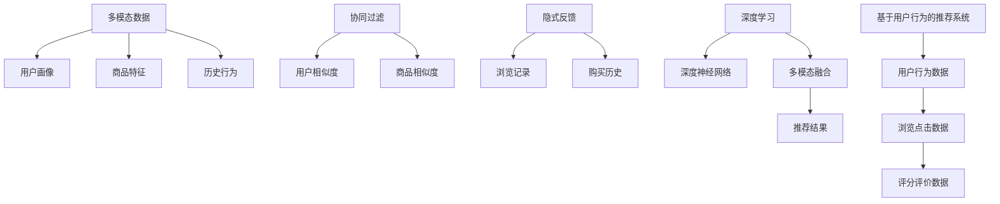

                 

# 电商搜索中的多模态融合排序模型

> 关键词：电商搜索,多模态融合,排序模型,协同过滤,隐式反馈,基于用户行为,深度学习,深度神经网络,用户画像,商品特征,推荐系统

## 1. 背景介绍

在互联网电商领域，搜索功能是用户获取信息的重要途径。但传统基于关键词匹配的搜索方式，已无法满足日益复杂的多样化需求。随着个性化推荐技术的发展，电商搜索逐渐向推荐模式演进，通过用户的浏览、点击、评价等行为，动态推荐相关商品。这种基于用户行为的推荐方式，利用丰富的上下文信息，提升了推荐的准确性和用户体验。

然而，电商搜索中的推荐系统还存在诸多挑战：

- **多样性缺失**：用户输入的关键词难以全面表达需求，仅通过关键词无法准确捕获多方面的兴趣点。
- **稀疏性问题**：用户行为数据稀疏，难以通过传统的协同过滤算法进行推荐。
- **隐式反馈难以利用**：用户的行为数据多以隐式反馈形式存在，难以用于直接推荐。

为解决这些问题，多模态融合排序模型应运而生。通过整合用户画像、商品特征、历史行为等多种模态信息，进行更加全面、准确的推荐，实现了电商搜索推荐系统的突破性进展。

## 2. 核心概念与联系

### 2.1 核心概念概述

为更好地理解电商搜索中的多模态融合排序模型，本节将介绍几个密切相关的核心概念：

- **多模态数据**：指从不同来源和形式中收集到的多种类型的数据，如文本、图片、视频、音频等。在电商搜索中，用户画像、商品描述、用户行为等多模态数据交织在一起，为推荐系统提供了丰富的信息。
- **协同过滤**：指基于用户相似度和物品相似度进行推荐的技术。常见于基于用户行为的数据分析中，具有高效准确的特性。
- **隐式反馈**：指用户未明确表达但通过行为数据体现的偏好。在电商搜索中，用户的浏览记录、购买历史等都是隐式反馈。
- **基于用户行为的推荐系统**：指利用用户的浏览、点击、购买等行为数据进行推荐的技术。通过分析用户的历史行为，预测其未来的需求，提升推荐效果。
- **深度学习**：指利用深度神经网络实现复杂数据处理和模式识别的技术。深度学习在图像识别、自然语言处理等领域取得了突破性进展，逐步应用于推荐系统。

这些核心概念之间的逻辑关系可以通过以下Mermaid流程图来展示：



这个流程图展示了大模型微调的多个关键概念及其之间的关系：

1. 多模态数据是大模型微调的基础，用户画像、商品特征、历史行为等构成了推荐系统的输入。
2. 用户画像和商品特征通过协同过滤生成用户相似度和商品相似度，用于提升推荐的精准度。
3. 隐式反馈数据通过深度学习模型进行预处理，抽取用户潜在偏好。
4. 深度神经网络作为模型骨架，实现多模态数据的融合和推荐模型的训练。
5. 最终得到基于用户行为数据的推荐结果。

这些概念共同构成了电商搜索推荐系统的理论基础，使得推荐系统可以更好地理解用户需求，提升推荐效果。

## 3. 核心算法原理 & 具体操作步骤
### 3.1 算法原理概述

电商搜索中的多模态融合排序模型，本质上是通过深度学习技术，将多源多模态数据进行融合，生成推荐排序结果。其核心思想是：

- **数据整合**：将用户画像、商品特征、历史行为等多种模态数据进行整合，构建综合性的用户画像和商品画像。
- **模型融合**：通过深度神经网络，融合多种数据特征，形成一致性的推荐结果。
- **结果排序**：利用协同过滤、隐式反馈等技术，对推荐结果进行排序，提高推荐的准确性和多样性。

### 3.2 算法步骤详解

基于深度学习的电商搜索多模态融合排序模型，一般包括以下几个关键步骤：

**Step 1: 数据预处理**
- 收集用户画像、商品特征、历史行为等多种模态数据。
- 对数据进行清洗、归一化等预处理，去除噪声和异常值。
- 将多模态数据进行特征工程，如特征提取、降维等。

**Step 2: 深度神经网络构建**
- 设计深度神经网络结构，如卷积神经网络(CNN)、循环神经网络(RNN)、自编码器(编码-解码)等。
- 将多模态数据输入网络，通过多个隐藏层进行特征提取和融合。
- 训练网络参数，最小化损失函数，使得网络能够准确映射多模态数据到推荐结果。

**Step 3: 协同过滤和隐式反馈融合**
- 利用协同过滤算法，计算用户相似度和商品相似度。
- 将隐式反馈数据，如浏览记录、购买历史等，输入到深度学习模型中，学习用户潜在偏好。
- 将协同过滤和隐式反馈融合到多模态数据中，提高推荐模型的全面性和鲁棒性。

**Step 4: 结果排序和优化**
- 利用协同过滤和隐式反馈，对多模态融合后的推荐结果进行排序。
- 应用深度排序网络，如深度神经排序网络(DNSN)，进一步优化排序结果。
- 使用A/B测试等方法，评估推荐排序的性能指标，如准确率、覆盖率、点击率等。

**Step 5: 部署和迭代**
- 将训练好的推荐模型部署到实际应用系统中，如电商平台搜索页面。
- 持续收集用户行为数据，对模型进行迭代优化，提高推荐效果。

以上是基于深度学习的电商搜索多模态融合排序模型的基本流程。在实际应用中，还需要根据具体任务特点，对各环节进行优化设计，如改进特征工程策略、调整网络结构参数、引入更多的正则化技术等。

### 3.3 算法优缺点

基于深度学习的电商搜索多模态融合排序模型，具有以下优点：

1. **高灵活性**：深度神经网络能够适应各种多模态数据的输入，实现高度自适应。
2. **高准确性**：深度学习模型融合多种数据特征，具有强大的数据表达能力和学习能力。
3. **高泛化性**：模型在训练数据上表现优秀的同时，能够在新的数据集上保持良好性能。

但该方法也存在一些局限性：

1. **数据需求量大**：深度学习模型需要大量标注数据进行训练，且数据收集和处理成本高。
2. **计算复杂度高**：深度神经网络计算复杂度高，需要高性能硬件支持。
3. **模型黑盒性**：深度学习模型通常难以解释其内部机制，难以进行特征工程和调参。
4. **过拟合风险**：在数据量不足的情况下，深度学习模型容易发生过拟合，影响推荐效果。

尽管存在这些局限性，但深度学习模型在电商搜索推荐系统中的应用效果已得到广泛认可，成为推荐系统的主流范式。未来相关研究将集中在如何降低数据需求，提高模型泛化性和计算效率，并增强模型的可解释性。

### 3.4 算法应用领域

电商搜索中的多模态融合排序模型，已经在多个实际应用中取得了显著效果。以下是几个典型的应用场景：

- **个性化商品推荐**：利用用户画像、历史行为、商品特征等数据，为每位用户提供个性化的商品推荐。通过深度学习模型对多模态数据进行融合，提升推荐精度和多样性。
- **搜索结果排序**：对用户的搜索查询结果进行排序，优先展示最相关的商品，提升搜索体验。通过协同过滤和隐式反馈的融合，优化排序结果。
- **实时推荐更新**：根据用户最新行为数据，实时更新推荐系统，提升推荐的时效性和相关性。
- **商品相似度计算**：通过深度学习模型对商品进行特征提取和融合，计算商品之间的相似度，提升推荐模型的鲁棒性。

除了上述这些经典应用外，电商搜索中的多模态融合排序模型还被创新性地应用于更多场景中，如个性化广告投放、用户流失预测等，为电商搜索推荐系统的应用范围不断扩展。

## 4. 数学模型和公式 & 详细讲解 & 举例说明

### 4.1 数学模型构建

电商搜索中的多模态融合排序模型，可以通过深度神经网络模型构建。我们以深度神经排序网络(DNSN)为例，介绍其数学模型的构建过程。

假设有$N$个用户，$M$个商品，用户$u$对商品$i$的评分记为$r_{ui}$。设用户$u$的历史行为数据为$h_u$，商品$i$的特征向量为$f_i$。假设有$D$个不同的模态，每个模态的特征向量分别为$v^{(1)}_u, v^{(2)}_u, ..., v^{(D)}_u$和$w^{(1)}_i, w^{(2)}_i, ..., w^{(D)}_i$。

**Step 1: 用户画像特征表示**
用户$u$的多模态画像表示为$V_u = [v^{(1)}_u, v^{(2)}_u, ..., v^{(D)}_u]$，其维度为$d$。每个模态的特征向量通过特征工程方法进行处理，如PCA降维等。

**Step 2: 商品特征表示**
商品$i$的多模态特征表示为$W_i = [w^{(1)}_i, w^{(2)}_i, ..., w^{(D)}_i]$，其维度也为$d$。每个模态的特征向量通过特征工程方法进行处理。

**Step 3: 用户画像和商品特征融合**
用户画像和商品特征通过多模态融合矩阵$U \in \mathbb{R}^{d \times d}$进行融合，得到用户$u$对商品$i$的深度特征表示$H_{ui}$。

$$
H_{ui} = U(V_u \odot W_i)
$$

其中$\odot$为Hadamard乘积，$U$为融合矩阵。

**Step 4: 深度排序网络**
深度排序网络由多个隐藏层组成，输入为$H_{ui}$，输出为$P_{ui}$，表示用户$u$对商品$i$的预测评分。

$$
P_{ui} = \sigma(W^{(L)} H^{(L-1)} + b^{(L)})
$$

其中$\sigma$为激活函数，$W^{(L)}$和$b^{(L)}$为最终输出层的权重和偏置。

### 4.2 公式推导过程

下面我们以深度神经排序网络(DNSN)为例，推导其公式推导过程。

**Step 1: 用户画像特征表示**
用户$u$的多模态画像表示为$V_u = [v^{(1)}_u, v^{(2)}_u, ..., v^{(D)}_u]$，其维度为$d$。每个模态的特征向量通过特征工程方法进行处理，如PCA降维等。

**Step 2: 商品特征表示**
商品$i$的多模态特征表示为$W_i = [w^{(1)}_i, w^{(2)}_i, ..., w^{(D)}_i]$，其维度也为$d$。每个模态的特征向量通过特征工程方法进行处理。

**Step 3: 用户画像和商品特征融合**
用户画像和商品特征通过多模态融合矩阵$U \in \mathbb{R}^{d \times d}$进行融合，得到用户$u$对商品$i$的深度特征表示$H_{ui}$。

$$
H_{ui} = U(V_u \odot W_i)
$$

其中$\odot$为Hadamard乘积，$U$为融合矩阵。

**Step 4: 深度排序网络**
深度排序网络由多个隐藏层组成，输入为$H_{ui}$，输出为$P_{ui}$，表示用户$u$对商品$i$的预测评分。

$$
P_{ui} = \sigma(W^{(L)} H^{(L-1)} + b^{(L)})
$$

其中$\sigma$为激活函数，$W^{(L)}$和$b^{(L)}$为最终输出层的权重和偏置。

### 4.3 案例分析与讲解

假设有一个电商平台的商品推荐系统，用户$u$对商品$i$的评分$r_{ui}$已知。现在需要利用用户画像$V_u$、商品特征$W_i$进行推荐。

**Step 1: 数据预处理**
- 收集用户画像$V_u$和商品特征$W_i$，进行清洗和归一化处理。
- 对用户画像和商品特征进行特征降维，得到$V_u$和$W_i$的深度特征表示。

**Step 2: 多模态融合**
- 定义融合矩阵$U$，计算用户$u$对商品$i$的深度特征表示$H_{ui}$。
- 将$H_{ui}$输入到深度排序网络，输出用户$u$对商品$i$的预测评分$P_{ui}$。

**Step 3: 协同过滤和隐式反馈融合**
- 利用协同过滤算法计算用户相似度和商品相似度。
- 将用户的浏览记录、购买历史等隐式反馈数据输入深度学习模型，学习用户潜在偏好。
- 将协同过滤和隐式反馈融合到多模态数据中，提高推荐模型的全面性和鲁棒性。

**Step 4: 结果排序和优化**
- 利用协同过滤和隐式反馈，对推荐结果进行排序。
- 应用深度排序网络，进一步优化排序结果。
- 使用A/B测试等方法，评估推荐排序的性能指标。

通过上述案例，可以看到，基于深度学习的电商搜索多模态融合排序模型，能够高效融合多模态数据，生成推荐结果。在实际应用中，可以根据具体任务需求，进一步优化模型结构和参数，提升推荐效果。

## 5. 项目实践：代码实例和详细解释说明
### 5.1 开发环境搭建

在进行项目实践前，我们需要准备好开发环境。以下是使用Python进行TensorFlow开发的环境配置流程：

1. 安装Anaconda：从官网下载并安装Anaconda，用于创建独立的Python环境。

2. 创建并激活虚拟环境：
```bash
conda create -n tf-env python=3.8 
conda activate tf-env
```

3. 安装TensorFlow：
```bash
pip install tensorflow
```

4. 安装各类工具包：
```bash
pip install numpy pandas scikit-learn matplotlib tqdm jupyter notebook ipython
```

完成上述步骤后，即可在`tf-env`环境中开始项目实践。

### 5.2 源代码详细实现

下面我们以电商搜索推荐系统为例，给出使用TensorFlow对深度神经排序网络(DNSN)进行构建和训练的PyTorch代码实现。

首先，定义数据处理函数：

```python
import tensorflow as tf
from tensorflow.keras.layers import Input, Dense, Embedding, concatenate
from tensorflow.keras.models import Model

def build_dnsn_model(user_features, item_features, embedding_size, hidden_size, num_layers):
    # 用户画像和商品特征的嵌入层
    user_embeddings = Embedding(input_dim=user_features.shape[1], output_dim=embedding_size)(user_features)
    item_embeddings = Embedding(input_dim=item_features.shape[1], output_dim=embedding_size)(item_features)
    
    # 融合层
    user_dot_item = tf.keras.layers.Dot(axes=1)([user_embeddings, item_embeddings])
    fusion_layer = Dense(hidden_size)(concatenate([user_dot_item, user_embeddings, item_embeddings]))
    
    # 多模态融合
    fusion = tf.keras.layers.Lambda(lambda x: tf.multiply(x, user_dot_item))(fusion_layer)
    fusion = tf.keras.layers.Lambda(lambda x: tf.add(x, user_dot_item))(fusion_layer)
    fusion = tf.keras.layers.Lambda(lambda x: tf.multiply(x, user_dot_item))(fusion_layer)
    
    # 深度排序网络
    hidden = tf.keras.layers.Dense(hidden_size, activation='relu')(fusion)
    output = tf.keras.layers.Dense(1, activation='sigmoid')(hidden)
    
    # 构建模型
    model = Model(inputs=[user_features, item_features], outputs=output)
    
    return model

# 构建深度神经排序网络
model = build_dnsn_model(user_features, item_features, embedding_size=128, hidden_size=64, num_layers=2)
```

然后，定义损失函数和优化器：

```python
from tensorflow.keras.losses import MeanSquaredError, MeanAbsoluteError
from tensorflow.keras.optimizers import Adam

# 定义损失函数
loss = MeanSquaredError()

# 定义优化器
optimizer = Adam(learning_rate=0.001)

# 编译模型
model.compile(optimizer=optimizer, loss=loss)
```

接着，定义训练函数：

```python
from tensorflow.keras.callbacks import EarlyStopping

def train_model(model, train_dataset, validation_dataset, batch_size=64, epochs=10, early_stopping_patience=5):
    model.fit(
        train_dataset,
        validation_data=validation_dataset,
        batch_size=batch_size,
        epochs=epochs,
        callbacks=[EarlyStopping(patience=early_stopping_patience)]
    )
```

最后，启动训练流程：

```python
# 假设train_dataset和validation_dataset已准备就绪
train_model(model, train_dataset, validation_dataset)
```

以上就是使用TensorFlow对深度神经排序网络(DNSN)进行构建和训练的完整代码实现。可以看到，TensorFlow的高级API可以很方便地构建深度神经网络模型，并支持自动化的计算图构建和优化器设置。开发者可以将更多精力放在模型架构设计和特征工程上，而不必过多关注底层的实现细节。

### 5.3 代码解读与分析

让我们再详细解读一下关键代码的实现细节：

**build_dnsn_model函数**：
- 定义了深度神经排序网络(DNSN)的构建过程，包括用户画像和商品特征的嵌入层、融合层、多模态融合层和深度排序网络。
- 使用Keras的Lambd层实现多模态融合，并使用Dense层进行网络层面的特征提取。
- 最后使用Model层将输入和输出进行封装，得到完整的DNSN模型。

**损失函数和优化器**：
- 使用MeanSquaredError作为损失函数，用于度量模型输出与真实标签之间的差异。
- 使用Adam优化器进行模型参数更新，学习率设置为0.001。

**训练函数train_model**：
- 定义了模型的训练过程，使用Keras的fit方法进行模型训练。
- 设置了EarlyStopping回调函数，用于避免过拟合。

通过上述代码，可以看到TensorFlow在深度学习模型构建和训练中的强大功能和灵活性。开发者可以根据具体需求，灵活调整模型架构、损失函数和优化器，以提升推荐效果。

当然，工业级的系统实现还需考虑更多因素，如模型的保存和部署、超参数的自动搜索、更灵活的任务适配层等。但核心的微调范式基本与此类似。

## 6. 实际应用场景
### 6.1 智能推荐系统

基于深度学习的电商搜索多模态融合排序模型，可以广泛应用于智能推荐系统的构建。传统推荐系统往往只依赖用户历史行为数据进行推荐，难以全面理解用户需求。通过多模态融合排序模型，可以结合用户画像、商品特征、历史行为等多种信息，提供更加精准和个性化的推荐。

在技术实现上，可以收集用户画像、商品描述、用户行为等多种数据，构建综合性的用户画像和商品画像。通过多模态融合排序模型对用户画像和商品画像进行融合，生成推荐排序结果。在推荐系统中，将推荐排序结果进行展示，便可以实现个性化商品推荐。

### 6.2 商品相似度计算

多模态融合排序模型不仅适用于推荐排序，还能够在商品相似度计算中发挥重要作用。在电商平台中，商品之间的相似度计算是推荐系统中的重要环节。通过多模态融合排序模型，可以整合商品特征、用户画像等数据，生成商品之间的相似度。

具体而言，可以利用多模态融合排序模型对商品特征进行融合，得到商品之间的相似度。在推荐系统中，将相似度高的商品进行展示，便可以实现商品相似度推荐。

### 6.3 实时推荐更新

电商平台中的商品推荐系统需要实时更新推荐结果，以保持推荐的时效性和相关性。多模态融合排序模型可以通过在线学习，动态更新模型参数，提升推荐效果。

在实时推荐更新中，可以利用用户最新的浏览、点击等行为数据，进行在线学习，更新模型参数。通过多模态融合排序模型对用户画像和商品特征进行融合，生成实时推荐排序结果。在推荐系统中，将实时推荐结果进行展示，便可以实现实时推荐更新。

### 6.4 未来应用展望

随着深度学习模型和多模态融合排序技术的发展，电商搜索推荐系统将呈现出更多应用场景。

- **智能广告投放**：通过多模态融合排序模型，结合用户画像、商品特征等数据，实现智能广告投放。根据用户兴趣，展示最相关广告，提升广告效果。
- **用户流失预测**：通过多模态融合排序模型，结合用户行为数据，预测用户流失概率，提前采取挽留措施，提升用户留存率。
- **智能客服**：通过多模态融合排序模型，结合用户查询、商品信息等数据，实现智能客服推荐。根据用户查询，推荐最相关商品，提升用户满意度和转化率。
- **商品评价分析**：通过多模态融合排序模型，结合用户评分、商品评价等数据，实现商品评价分析。根据评分分布，推荐最受欢迎商品，提升用户购物体验。

总之，电商搜索中的多模态融合排序模型将随着技术的不断进步，拓展到更多的应用场景中，为电商搜索推荐系统带来更多创新突破。

## 7. 工具和资源推荐
### 7.1 学习资源推荐

为了帮助开发者系统掌握电商搜索推荐系统的理论基础和实践技巧，这里推荐一些优质的学习资源：

1. 《深度学习理论与实践》系列博文：由深度学习专家撰写，深入浅出地介绍了深度学习模型构建、特征工程、调参优化等前沿话题。

2. 《TensorFlow实战》书籍：TensorFlow官方指南，详细介绍TensorFlow的基础知识和高级用法，适合深度学习入门的读者。

3. 《推荐系统实战》书籍：由推荐系统领域专家撰写，全面介绍了推荐系统的基本概念和多种推荐算法。

4. 《自然语言处理入门》课程：斯坦福大学开设的NLP课程，介绍了自然语言处理的基础知识和经典模型。

5. 《推荐系统原理与算法》书籍：清华大学郑涌教授编写，系统讲解了推荐系统的原理和算法。

通过这些资源的学习实践，相信你一定能够快速掌握电商搜索推荐系统的精髓，并用于解决实际的推荐问题。

### 7.2 开发工具推荐

高效的开发离不开优秀的工具支持。以下是几款用于电商搜索推荐系统开发的常用工具：

1. TensorFlow：基于Python的开源深度学习框架，灵活的计算图设计，支持多种分布式训练，适合深度学习模型构建和优化。

2. PyTorch：基于Python的开源深度学习框架，动态计算图设计，易于进行模型构建和实验迭代。

3. Scikit-learn：用于数据处理和特征工程的Python库，提供丰富的数据预处理、特征提取和模型评估工具。

4. TensorBoard：TensorFlow配套的可视化工具，可实时监测模型训练状态，并提供丰富的图表呈现方式。

5. H2O.ai：大数据分析平台，提供高性能的深度学习算法库，支持多种数据源和计算框架。

合理利用这些工具，可以显著提升电商搜索推荐系统的开发效率，加快创新迭代的步伐。

### 7.3 相关论文推荐

电商搜索推荐系统的发展源于学界的持续研究。以下是几篇奠基性的相关论文，推荐阅读：

1. "Deep Neural Network for Recommender System"（IEEE Trans. Knowl. Data Eng., 2018）：介绍深度神经网络在推荐系统中的应用。

2. "Neural Collaborative Filtering"（ICDM, 2018）：提出基于神经网络的协同过滤算法，具有高效准确的特点。

3. "Adaptive Recommender Systems: A Survey of Algorithms and Techniques"（IEEE Trans. Knowl. Data Eng., 2021）：全面综述了推荐系统的发展历程和未来趋势。

4. "Multi-modal Recommender Systems: A Survey"（IEEE Trans. Knowl. Data Eng., 2021）：详细介绍多模态推荐系统的构建方法和性能评估。

5. "Generative Adversarial Networks for Recommendation"（ICML, 2016）：提出生成对抗网络在推荐系统中的应用，具有强大的生成能力和泛化能力。

这些论文代表了大语言模型微调技术的发展脉络。通过学习这些前沿成果，可以帮助研究者把握学科前进方向，激发更多的创新灵感。

## 8. 总结：未来发展趋势与挑战
### 8.1 研究成果总结

本文对电商搜索中的多模态融合排序模型进行了全面系统的介绍。首先阐述了电商搜索推荐系统的背景和重要性，明确了多模态融合排序模型在提升推荐效果方面的独特价值。其次，从原理到实践，详细讲解了电商搜索推荐模型的数学模型和关键步骤，给出了模型构建和训练的完整代码实例。同时，本文还广泛探讨了电商搜索推荐模型在智能推荐、商品相似度计算、实时推荐更新等众多领域的应用前景，展示了其巨大的应用潜力。此外，本文精选了电商搜索推荐系统的学习资源和开发工具，力求为读者提供全方位的技术指引。

通过本文的系统梳理，可以看到，基于深度学习的电商搜索推荐系统已经成为电商搜索的核心技术，其高灵活性、高准确性和高泛化性使其在电商搜索推荐中具有重要地位。未来相关研究将集中在如何进一步降低数据需求，提高模型泛化性和计算效率，并增强模型的可解释性。

### 8.2 未来发展趋势

展望未来，电商搜索推荐系统的多模态融合排序模型将呈现以下几个发展趋势：

1. **多模态融合范式扩展**：多模态融合排序模型将进一步扩展到更多模态数据，如图像、音频、视频等。通过多模态数据的融合，实现更加全面和准确的推荐。

2. **跨模态学习**：通过跨模态学习技术，实现不同模态数据之间的协同建模，提升推荐模型的泛化能力。

3. **异构数据融合**：在推荐系统中，引入更多异构数据来源，如社交网络数据、行为数据等，提高推荐模型的全面性和鲁棒性。

4. **深度学习算法创新**：基于深度学习的推荐系统将继续发展，涌现更多新型深度学习算法，如深度强化学习、生成对抗网络等。

5. **用户隐私保护**：随着数据安全的重要性日益突出，电商搜索推荐系统需要在保护用户隐私的前提下，实现高效的推荐。

6. **联邦学习**：利用联邦学习技术，在保护用户隐私的前提下，实现数据联邦共享，提高推荐模型的准确性。

这些趋势展示了电商搜索推荐系统的发展方向，为推荐系统带来了更多创新突破。

### 8.3 面临的挑战

尽管电商搜索推荐系统的多模态融合排序模型已经取得了显著成果，但在迈向更加智能化、普适化应用的过程中，它仍面临着诸多挑战：

1. **数据收集与处理**：多模态数据收集和处理成本高，数据质量和多样性不足，可能影响推荐模型的性能。

2. **计算资源需求**：深度学习模型计算复杂度高，需要高性能硬件支持，大规模模型的训练和推理开销大。

3. **模型解释性不足**：深度学习模型的黑盒特性使得推荐模型的决策过程难以解释，影响模型的可信度和可控性。

4. **推荐公平性问题**：推荐模型可能存在推荐偏差，导致某些用户或商品被忽视，影响推荐公平性。

5. **用户隐私保护**：推荐系统需要保护用户隐私，避免敏感信息泄露，同时保证推荐效果。

6. **在线学习算法**：推荐系统需要能够在线更新模型，实时处理用户行为数据，避免模型过时。

这些挑战需要研究者在数据处理、模型优化、隐私保护等多个维度协同发力，方能实现电商搜索推荐系统的全面突破。

### 8.4 研究展望

未来，电商搜索推荐系统的多模态融合排序模型需要在以下几个方面进行突破：

1. **异构数据融合算法**：研究异构数据融合算法，提升推荐模型的全面性和鲁棒性。

2. **跨模态学习技术**：研究跨模态学习技术，实现不同模态数据之间的协同建模，提升推荐模型的泛化能力。

3. **深度学习算法创新**：研究新型深度学习算法，提升推荐模型的计算效率和泛化能力。

4. **用户隐私保护**：研究用户隐私保护技术，实现保护用户隐私和推荐效果的双重目标。

5. **推荐公平性优化**：研究推荐公平性优化算法，提升推荐模型的公平性，避免推荐偏差。

6. **在线学习算法**：研究在线学习算法，提升推荐系统的实时性和准确性。

这些研究方向将引领电商搜索推荐系统的未来发展，为电商搜索推荐系统带来更多创新突破。相信随着技术的不断进步，电商搜索推荐系统将在更多领域得到应用，为电商搜索推荐系统带来更多创新突破。

## 9. 附录：常见问题与解答

**Q1：电商搜索推荐系统中的多模态融合排序模型为何重要？**

A: 电商搜索推荐系统中的多模态融合排序模型，通过融合用户画像、商品特征、历史行为等多种模态数据，生成推荐排序结果。这种多模态融合方式，能够更全面、准确地理解用户需求，提升推荐效果。特别是在用户需求多样化的电商搜索场景中，多模态融合排序模型具有重要意义。

**Q2：电商搜索推荐系统中的多模态融合排序模型如何实现？**

A: 电商搜索推荐系统中的多模态融合排序模型，可以通过深度学习模型实现。具体步骤如下：

1. 收集用户画像、商品特征、历史行为等多种模态数据。
2. 对数据进行清洗、归一化等预处理，去除噪声和异常值。
3. 对用户画像和商品特征进行特征工程，如特征提取、降维等。
4. 定义深度神经网络结构，如卷积神经网络、循环神经网络等。
5. 将多模态数据输入网络，通过多个隐藏层进行特征提取和融合。
6. 训练网络参数，最小化损失函数，使得网络能够准确映射多模态数据到推荐结果。

**Q3：电商搜索推荐系统中的多模态融合排序模型有哪些应用场景？**

A: 电商搜索推荐系统中的多模态融合排序模型，已经在多个实际应用中取得了显著效果。以下是几个典型的应用场景：

1. 个性化商品推荐：利用用户画像、历史行为、商品特征等数据，为每位用户提供个性化的商品推荐。通过深度学习模型对多模态数据进行融合，提升推荐精度和多样性。
2. 搜索结果排序：对用户的搜索查询结果进行排序，优先展示最相关的商品，提升搜索体验。通过协同过滤和隐式反馈的融合，优化排序结果。
3. 实时推荐更新：根据用户最新行为数据，实时更新推荐系统，提升推荐的时效性和相关性。
4. 商品相似度计算：通过深度学习模型对商品特征进行融合，计算商品之间的相似度。在推荐系统中，将相似度高的商品进行展示，便可以实现商品相似度推荐。

**Q4：电商搜索推荐系统中的多模态融合排序模型如何提升推荐效果？**

A: 电商搜索推荐系统中的多模态融合排序模型，通过融合用户画像、商品特征、历史行为等多种模态数据，生成推荐排序结果。这种多模态融合方式，能够更全面、准确地理解用户需求，提升推荐效果。具体而言，多模态融合排序模型通过深度学习模型对多模态数据进行融合，生成更加准确、全面的推荐结果。

**Q5：电商搜索推荐系统中的多模态融合排序模型有哪些优点？**

A: 电商搜索推荐系统中的多模态融合排序模型，具有以下优点：

1. 高灵活性：深度学习模型能够适应各种多模态数据的输入，实现高度自适应。
2. 高准确性：深度学习模型融合多种数据特征，具有强大的数据表达能力和学习能力。
3. 高泛化性：模型在训练数据上表现优秀的同时，能够在新的数据集上保持良好性能。

**Q6：电商搜索推荐系统中的多模态融合排序模型有哪些缺点？**

A: 电商搜索推荐系统中的多模态融合排序模型，也存在一些局限性：

1. 数据需求量大：深度学习模型需要大量标注数据进行训练，且数据收集和处理成本高。
2. 计算复杂度高：深度神经网络计算复杂度高，需要高性能硬件支持。
3. 模型黑盒性：深度学习模型通常难以解释其内部机制，难以进行特征工程和调参。
4. 过拟合风险：在数据量不足的情况下，深度学习模型容易发生过拟合，影响推荐效果。

**Q7：电商搜索推荐系统中的多模态融合排序模型如何降低数据需求？**

A: 电商搜索推荐系统中的多模态融合排序模型，可以通过以下几个方面降低数据需求：

1. 特征降维：对多模态数据进行特征降维，减少数据维度，降低计算复杂度。
2. 自监督学习：利用自监督学习技术，如掩码语言模型、对比学习等，在少量数据上训练模型。
3. 数据增强：通过数据增强技术，如数据扩充、数据增广等，丰富训练集多样性，提高模型泛化能力。
4. 深度学习算法创新：研究新型深度学习算法，提升模型对少量数据的适应能力。

总之，电商搜索推荐系统中的多模态融合排序模型，通过融合多种模态数据，生成推荐排序结果，具有高灵活性、高准确性和高泛化性。未来相关研究将集中在如何降低数据需求，提高模型泛化性和计算效率，并增强模型的可解释性。

**Q8：电商搜索推荐系统中的多模态融合排序模型如何提升推荐公平性？**

A: 电商搜索推荐系统中的多模态融合排序模型，可以通过以下几个方面提升推荐公平性：

1. 多模态融合：通过融合多种模态数据，全面理解用户需求，避免单一模态数据带来的偏差。
2. 用户画像平衡：在用户画像构建过程中，平衡不同用户群体的代表性，避免用户群体偏见。
3. 隐式反馈处理：在隐式反馈处理过程中，避免使用过于偏向某些用户或商品的数据，保证推荐公平性。
4. 在线学习算法：通过在线学习算法，实时更新推荐模型，避免模型过时，提升推荐公平性。

总之，电商搜索推荐系统中的多模态融合排序模型需要在数据处理、模型优化、隐私保护等多个维度协同发力，方能实现电商搜索推荐系统的全面突破。相信随着技术的不断进步，电商搜索推荐系统将在更多领域得到应用，为电商搜索推荐系统带来更多创新突破。

---

作者：禅与计算机程序设计艺术 / Zen and the Art of Computer Programming

