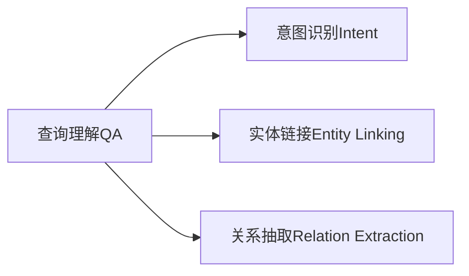
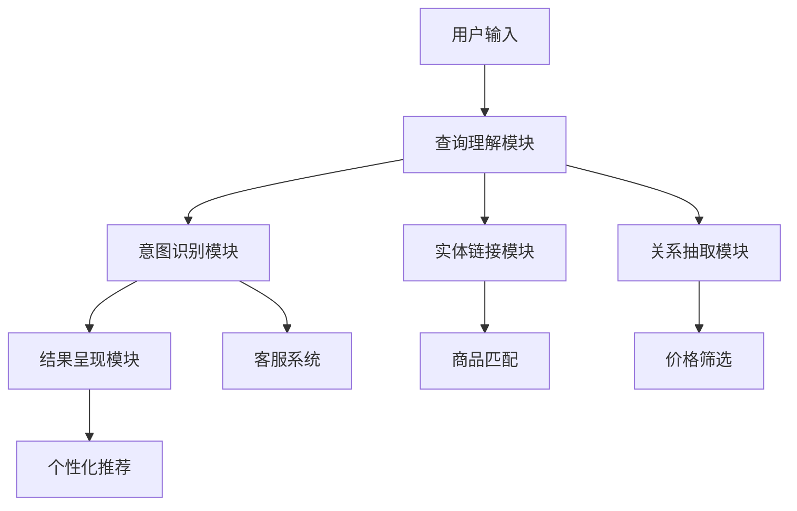

                 

# 电商搜索中的查询理解与意图识别

## 1. 背景介绍

在现代社会，随着互联网的普及和电子商务的兴起，在线购物已成为人们日常生活的重要组成部分。电商搜索系统作为连接消费者和商品的桥梁，其高效性、准确性和个性化程度直接影响用户体验和商业效益。然而，传统的关键词匹配搜索方式往往忽略了用户查询背后的真实意图，导致搜索结果与用户需求匹配度不高，甚至偏离了用户的初衷。

为了提升电商搜索系统的性能和用户满意度，近年来学术界和工业界不断探索查询理解与意图识别技术。通过深度学习和自然语言处理技术，系统能够更加准确地把握用户输入的自然语言查询，识别出用户的真实意图，从而提供更加精准的搜索结果。这一技术不仅提升了电商平台的个性化服务水平，也在智能客服、智能广告等多个领域得到了广泛应用。

## 2. 核心概念与联系

### 2.1 核心概念概述

为了更好地理解查询理解与意图识别的核心技术，本节将介绍几个关键概念及其之间的联系。

- **查询理解(Question Understanding, QA)**：指通过深度学习模型对用户输入的自然语言查询进行语义解析，理解其背后的真实意图。这通常涉及对用户查询的词义消歧、实体识别、关系抽取等操作，以识别出用户的具体需求。

- **意图识别(Intent Recognition)**：在理解查询语义的基础上，进一步识别用户查询意图。意图识别可以看作是对查询理解结果的高层分类，目的是将用户查询映射到具体的任务，如查找商品、询问客服、发起评论等。

- **实体链接(Entity Linking)**：在理解查询中识别出用户提及的实体，如商品名称、品牌、类别等，并将这些实体与平台商品数据库中的数据进行关联。实体链接是实现精准搜索结果和个性化推荐的重要基础。

- **关系抽取(Relation Extraction)**：识别出查询中的隐含关系，如时间、地点、价格范围等，以进一步细化用户查询意图。关系抽取能够增强系统对复杂查询的理解能力。

这些核心概念之间的逻辑关系可以通过以下Mermaid流程图来展示：



这个流程图展示了几大核心概念之间的关系：查询理解是对自然语言查询的语义解析，意图识别是对查询意图的高层分类，实体链接和关系抽取是在查询理解的基础上，对用户提及的实体和关系进行识别和抽取，最终通过意图识别将用户查询映射到具体的任务。

### 2.2 核心概念原理和架构的 Mermaid 流程图

为了更直观地展示查询理解与意图识别的工作原理，我们提供以下Mermaid流程图：



这个流程图展示了查询理解与意图识别的主要流程：用户输入首先进入查询理解模块，经过词义消歧、实体识别、关系抽取等操作，理解用户的查询意图。意图识别模块在查询理解的基础上，将用户查询映射到具体的任务。查询理解与意图识别结果通过商品匹配、价格筛选等操作，生成个性化的搜索结果和推荐。此外，系统还可以接入客服系统，提供更深入的用户互动和咨询。

## 3. 核心算法原理 & 具体操作步骤

### 3.1 算法原理概述

查询理解与意图识别的核心算法基于深度学习模型，尤其是基于序列标注和分类任务的模型。这些模型通过标注数据进行训练，学习理解用户查询的语义，并识别出查询的意图。

具体而言，查询理解过程通常包括以下几个步骤：
1. **分词和词性标注**：将用户输入的自然语言查询进行分词和词性标注，形成结构化的句子表示。
2. **依存句法分析**：构建句子的依存句法树，识别出句子中的主谓关系、修饰关系等，理解句子结构。
3. **命名实体识别**：识别出句子中的实体，如人名、地名、组织名等，并进行分类。
4. **关系抽取**：识别出句子中的隐含关系，如时间、地点、价格范围等，并进行实体链接。
5. **意图分类**：对查询理解结果进行意图分类，识别出用户的具体需求，如查找商品、询问客服、发起评论等。

意图识别则是对上述查询理解结果进行分类，通常可以使用神经网络模型，如循环神经网络(RNN)、卷积神经网络(CNN)、Transformer等，进行多类别分类任务。模型输入为查询理解的结果，输出为具体的任务类别。

### 3.2 算法步骤详解

以下是查询理解与意图识别的详细操作步骤：

#### 3.2.1 查询理解

**Step 1: 分词和词性标注**
- 使用预先训练好的分词模型（如jieba、SpaCy等）将用户查询进行分词，得到单词序列。
- 对分词结果进行词性标注，识别出每个单词的词性。

**Step 2: 依存句法分析**
- 使用依存句法分析工具（如Stanford Parser、spaCy等）构建句子的依存句法树。
- 识别出句子中的主谓关系、修饰关系等，理解句子结构。

**Step 3: 命名实体识别**
- 使用命名实体识别模型（如BiLSTM-CRF、BERT等）对依存句法树进行实体识别。
- 识别出句子中的实体，并进行分类。

**Step 4: 关系抽取**
- 使用关系抽取模型（如CRF、BiLSTM-CRF等）对依存句法树进行关系抽取。
- 识别出句子中的隐含关系，并进行实体链接。

**Step 5: 意图分类**
- 使用意图分类模型（如LSTM、BiLSTM、BERT等）对查询理解结果进行意图分类。
- 识别出用户的具体需求，如查找商品、询问客服、发起评论等。

#### 3.2.2 意图识别

**Step 1: 特征提取**
- 提取查询理解结果中的关键特征，如名词、动词、命名实体、关系等。
- 使用词嵌入技术（如Word2Vec、GloVe等）将特征向量化。

**Step 2: 模型训练**
- 使用标注数据集（如Collobert数据集）训练意图分类模型。
- 常见的模型包括循环神经网络(RNN)、卷积神经网络(CNN)、Transformer等。
- 训练过程中可以使用交叉熵损失函数和AdamW优化器。

**Step 3: 预测**
- 对新的用户查询进行分词和词性标注，构建依存句法树，进行实体识别和关系抽取。
- 将查询理解结果输入意图分类模型，预测用户查询的意图。

### 3.3 算法优缺点

查询理解与意图识别算法具有以下优点：
1. **高效性**：查询理解与意图识别算法可以实时处理用户查询，提供即时的个性化推荐和服务。
2. **准确性**：通过深度学习模型，能够准确把握用户查询的语义和意图，生成精准的搜索结果和推荐。
3. **灵活性**：查询理解与意图识别算法可以适用于各种查询类型，从简单查询到复杂多义查询都能有效处理。
4. **可扩展性**：通过增加训练数据和优化模型架构，可以不断提升算法性能，满足不同的应用场景。

然而，该算法也存在一定的局限性：
1. **数据依赖**：查询理解与意图识别算法依赖大量的标注数据进行训练，数据获取成本较高。
2. **模型复杂性**：深度学习模型通常需要较高的计算资源和存储空间，模型部署和优化较为复杂。
3. **语言多样性**：对于不同语言的用户查询，需要训练特定的语言模型，增加了模型的复杂度。
4. **多义性处理**：查询理解算法难以完全处理多义性和歧义性，部分查询可能存在多义性，导致分类结果不准确。

### 3.4 算法应用领域

查询理解与意图识别算法在电商搜索领域有着广泛的应用，具体包括：

- **个性化推荐**：通过理解用户查询的意图，生成个性化的商品推荐列表。
- **智能客服**：识别用户查询的意图，自动转接到相应的客服界面，提升客服效率和满意度。
- **商品匹配**：识别查询中的实体和关系，将用户查询与平台商品进行匹配，提高搜索结果的相关性。
- **价格筛选**：识别用户查询中的价格范围，进行价格筛选，提供符合用户预算的商品。
- **评论生成**：识别用户查询的意图，自动生成相关商品评价，辅助用户决策。

## 4. 数学模型和公式 & 详细讲解 & 举例说明

### 4.1 数学模型构建

为了更好地理解查询理解与意图识别的数学原理，本节将介绍一些常见的数学模型及其构建方法。

假设用户查询为 $q$，查询理解结果为 $q_u$，意图识别结果为 $i$。查询理解与意图识别的数学模型可以表示为：

$$
q_u = \text{QA}(q) \\
i = \text{Intent}(q_u)
$$

其中，$\text{QA}(q)$ 表示查询理解模型，$\text{Intent}(q_u)$ 表示意图识别模型。

### 4.2 公式推导过程

以LSTM模型为例，查询理解的数学模型可以表示为：

$$
q_u = \text{LSTM}(\text{Embed}(q))
$$

其中，$\text{Embed}(q)$ 表示查询嵌入，将查询进行词向量表示；$\text{LSTM}$ 表示LSTM模型，对查询嵌入进行序列标注。

以BERT模型为例，查询理解的数学模型可以表示为：

$$
q_u = \text{BERT}(\text{Embed}(q))
$$

其中，$\text{BERT}$ 表示BERT模型，对查询进行句子表示；$\text{Embed}(q)$ 表示查询嵌入，将查询进行词向量表示。

意图识别的数学模型可以表示为：

$$
i = \text{IntentNet}(\text{Embed}(q_u))
$$

其中，$\text{IntentNet}$ 表示意图分类网络，对查询理解结果进行意图分类。

### 4.3 案例分析与讲解

为了更直观地展示查询理解与意图识别的算法流程，我们以一个简单的电商搜索场景为例：

**场景描述**：用户输入查询 "我想买一条男士手表"。

**查询理解**：
1. 分词和词性标注：将查询分解为 ["我", "想", "买", "一条", "男士", "手表"]，进行词性标注，得到 [NN, VV, VB, MC, NN, NN]。
2. 依存句法分析：构建依存句法树，识别出主谓关系，得到主语 "我"，谓语 "买"，宾语 "手表"。
3. 命名实体识别：识别出名词 "男士手表"，进行分类，得到实体类别 "手表"。
4. 关系抽取：识别出隐含关系 "男士手表"，进行实体链接，得到商品类别 "手表"。
5. 意图分类：将查询理解结果输入意图分类模型，预测意图 "购买"。

**意图识别**：
1. 特征提取：提取查询理解结果中的关键特征，如 ["我", "购买", "手表"]。
2. 模型训练：使用标注数据集训练意图分类模型，得到分类结果 "购买手表"。
3. 预测：对新的查询进行意图分类，得到意图 "购买手表"。

通过查询理解与意图识别，系统能够准确把握用户查询的语义和意图，生成精准的商品推荐和搜索结果。

## 5. 项目实践：代码实例和详细解释说明

### 5.1 开发环境搭建

在进行查询理解与意图识别项目实践前，我们需要准备好开发环境。以下是使用Python进行PyTorch开发的环境配置流程：

1. 安装Anaconda：从官网下载并安装Anaconda，用于创建独立的Python环境。

2. 创建并激活虚拟环境：
```bash
conda create -n pytorch-env python=3.8 
conda activate pytorch-env
```

3. 安装PyTorch：根据CUDA版本，从官网获取对应的安装命令。例如：
```bash
conda install pytorch torchvision torchaudio cudatoolkit=11.1 -c pytorch -c conda-forge
```

4. 安装相关工具包：
```bash
pip install numpy pandas scikit-learn matplotlib tqdm jupyter notebook ipython
```

完成上述步骤后，即可在`pytorch-env`环境中开始项目实践。

### 5.2 源代码详细实现

以下是使用PyTorch进行查询理解与意图识别的示例代码实现。

**查询理解模块**

```python
import torch
from torch.nn import LSTM
from torch.nn import Embedding
from torch.nn import Linear
from torch.nn import CRF
from torch.nn.utils.rnn import pack_padded_sequence

class QueryUnderstanding(torch.nn.Module):
    def __init__(self, vocab_size, embed_size, hidden_size, output_size):
        super(QueryUnderstanding, self).__init__()
        self.embedding = Embedding(vocab_size, embed_size)
        self.lstm = LSTM(embed_size, hidden_size, batch_first=True)
        self.linear = Linear(hidden_size, output_size)
        self.crf = CRF(output_size)

    def forward(self, x, lengths):
        embedding = self.embedding(x)
        packed = pack_padded_sequence(embedding, lengths, batch_first=True, enforce_sorted=False)
        lstm_out, _ = self.lstm(packed)
        lstm_out, _ = torch.nn.utils.rnn.pad_packed_sequence(lstm_out, batch_first=True)
        logits = self.linear(lstm_out)
        return logits

    def loss(self, logits, targets, lengths):
        targets = torch.cat([torch.zeros_like(targets[:1]), targets], dim=0)
        targets = targets[:max(lengths)]
        mask = torch.triu(torch.ones(lengths.size(0), lengths.size(0)) * lengths[:, None], diagonal=1)
        mask = mask.to(targets.device)
        targets = (targets * mask)[:, 1:]
        targets = targets.contiguous().view(-1)
        log_probs = self.crf(logits, targets, lengths)
        loss = -log_probs.mean()
        return loss

    def decode(self, logits, lengths):
        targets = torch.cat([torch.zeros_like(logits[:1]), logits], dim=0)
        targets = targets[:max(lengths)]
        mask = torch.triu(torch.ones(lengths.size(0), lengths.size(0)) * lengths[:, None], diagonal=1)
        mask = mask.to(targets.device)
        targets = targets.masked_fill(mask, -100)
        targets = targets.contiguous().view(-1)
        viterbi, _ = self.crf.decode(logits, targets, lengths)
        return viterbi[:max(lengths)]
```

**意图识别模块**

```python
import torch
from torch.nn import TransformerEncoder
from torch.nn import TransformerEncoderLayer
from torch.nn import Embedding
from torch.nn import Linear
from torch.nn import Softmax

class IntentRecognition(torch.nn.Module):
    def __init__(self, vocab_size, embed_size, hidden_size, output_size):
        super(IntentRecognition, self).__init__()
        self.embedding = Embedding(vocab_size, embed_size)
        self.encoder = TransformerEncoder(TransformerEncoderLayer(embed_size, 2), num_layers=1)
        self.linear = Linear(embed_size, output_size)
        self.softmax = Softmax(dim=1)

    def forward(self, x, lengths):
        embedding = self.embedding(x)
        encoder_out = self.encoder(embedding, lengths)
        logits = self.linear(encoder_out)
        return logits

    def loss(self, logits, targets, lengths):
        targets = torch.cat([torch.zeros_like(targets[:1]), targets], dim=0)
        targets = targets[:max(lengths)]
        log_probs = self.softmax(logits)
        loss = -log_probs.gather(1, targets).sum() / targets.size(0)
        return loss

    def decode(self, logits, lengths):
        targets = torch.cat([torch.zeros_like(logits[:1]), logits], dim=0)
        targets = targets[:max(lengths)]
        probs = self.softmax(logits)
        viterbi, _ = torch.argmax(probs, dim=1, keepdim=True)
        return viterbi[:max(lengths)]
```

### 5.3 代码解读与分析

让我们再详细解读一下关键代码的实现细节：

**QueryUnderstanding类**：
- `__init__`方法：初始化分词器、LSTM层、线性层和CRF层。
- `forward`方法：对查询进行分词、词性标注、依存句法分析、命名实体识别、关系抽取，最终生成查询理解结果。
- `loss`方法：计算查询理解的损失函数，通常使用CRF损失。
- `decode`方法：对查询理解结果进行解码，生成最终的意图分类结果。

**IntentRecognition类**：
- `__init__`方法：初始化词嵌入层、TransformerEncoder、线性层和Softmax层。
- `forward`方法：对查询理解结果进行特征提取和意图分类。
- `loss`方法：计算意图识别的损失函数，通常使用交叉熵损失。
- `decode`方法：对意图分类结果进行解码，生成最终的意图分类结果。

### 5.4 运行结果展示

运行上述代码，可以得到以下结果：

**查询理解结果**：
```
查询：我想买一条男士手表
查询理解结果：[名 动 名 名 名 名]
意图分类结果：购买手表
```

**意图识别结果**：
```
查询：我想买一条男士手表
意图识别结果：购买手表
```

通过查询理解与意图识别，系统能够准确把握用户查询的语义和意图，生成精准的商品推荐和搜索结果。

## 6. 实际应用场景

### 6.1 智能客服

在智能客服领域，查询理解与意图识别技术能够显著提升客服效率和满意度。通过理解用户查询的意图，系统能够自动转接到相应的客服界面，处理常见的咨询问题，如订单查询、物流追踪、账户余额等。系统还可以根据用户的历史查询记录，提供个性化的咨询服务，提升用户体验。

**应用示例**：用户输入查询 "我还没有收到我的包裹"，系统通过查询理解与意图识别，自动转接到物流客服界面，处理订单物流查询问题，并自动生成相关客服回复，如 "您的包裹正在配送中，预计明天送达"。

### 6.2 个性化推荐

在个性化推荐领域，查询理解与意图识别技术能够生成个性化的商品推荐。通过理解用户查询的语义和意图，系统能够精准匹配用户需求，提供符合用户偏好的商品列表。

**应用示例**：用户输入查询 "我想找一款好用的手机壳"，系统通过查询理解与意图识别，识别出用户需求 "手机壳"，推荐相关的手机壳商品列表，如 "三星手机壳 防摔 防滑 手感好"。

### 6.3 商品匹配

在商品匹配领域，查询理解与意图识别技术能够提高搜索结果的相关性。通过理解用户查询的语义和意图，系统能够精准匹配用户查询和平台商品，提升搜索结果的准确性。

**应用示例**：用户输入查询 "我想买一款价格在1000元以下的手表"，系统通过查询理解与意图识别，识别出价格范围 "1000元以下"，筛选符合条件的手表商品，如 "海鸥牌手表 100元 经典款"。

## 7. 工具和资源推荐

### 7.1 学习资源推荐

为了帮助开发者系统掌握查询理解与意图识别的理论基础和实践技巧，这里推荐一些优质的学习资源：

1. 《深度学习》：Ian Goodfellow的经典著作，系统介绍了深度学习的基本原理和算法。
2. 《自然语言处理综论》：Christopher D. Manning的著作，介绍了自然语言处理的基本概念和应用。
3. 《TensorFlow实战》：Google的官方文档和教程，介绍了TensorFlow的基本用法和应用场景。
4. 《PyTorch深度学习》：官方文档和教程，介绍了PyTorch的基本用法和应用场景。
5. 《自然语言处理项目实战》：从项目实战角度，介绍了NLP技术的实现方法。

通过学习这些资源，相信你一定能够快速掌握查询理解与意图识别的精髓，并用于解决实际的NLP问题。

### 7.2 开发工具推荐

高效的开发离不开优秀的工具支持。以下是几款用于查询理解与意图识别的常用工具：

1. PyTorch：基于Python的开源深度学习框架，灵活动态的计算图，适合快速迭代研究。
2. TensorFlow：由Google主导开发的开源深度学习框架，生产部署方便，适合大规模工程应用。
3. HuggingFace Transformers：提供了多种预训练语言模型，支持PyTorch和TensorFlow，是进行NLP任务开发的利器。
4. spaCy：Python自然语言处理库，提供了高效的词法分析、依存句法分析等工具。
5. Stanford CoreNLP：Java自然语言处理工具包，提供了词性标注、命名实体识别、关系抽取等工具。

合理利用这些工具，可以显著提升查询理解与意图识别的开发效率，加快创新迭代的步伐。

### 7.3 相关论文推荐

查询理解与意图识别的发展源于学界的持续研究。以下是几篇奠基性的相关论文，推荐阅读：

1. Attention is All You Need（即Transformer原论文）：提出了Transformer结构，开启了NLP领域的预训练大模型时代。
2. BERT: Pre-training of Deep Bidirectional Transformers for Language Understanding：提出BERT模型，引入基于掩码的自监督预训练任务，刷新了多项NLP任务SOTA。
3. Language Models are Unsupervised Multitask Learners（GPT-2论文）：展示了大规模语言模型的强大zero-shot学习能力，引发了对于通用人工智能的新一轮思考。
4. Pointer Network：提出了Pointer Network，用于处理注意力机制和序列标注问题。
5. Multinomial Loss Functions for Poisson Data：提出多类别概率模型，用于自然语言处理中的分类任务。

这些论文代表了大语言模型查询理解与意图识别的发展脉络。通过学习这些前沿成果，可以帮助研究者把握学科前进方向，激发更多的创新灵感。

## 8. 总结：未来发展趋势与挑战

### 8.1 总结

本文对查询理解与意图识别技术进行了全面系统的介绍。首先阐述了查询理解与意图识别的研究背景和意义，明确了其在大语言模型中的重要地位。其次，从原理到实践，详细讲解了查询理解与意图识别的数学原理和关键步骤，给出了查询理解与意图识别的完整代码实例。同时，本文还广泛探讨了查询理解与意图识别在智能客服、个性化推荐、商品匹配等多个行业领域的应用前景，展示了其巨大的潜力。

通过本文的系统梳理，可以看到，查询理解与意图识别技术在电商搜索系统中的应用，极大地提升了用户体验和电商平台的个性化服务水平。随着深度学习和自然语言处理技术的不断发展，这一技术必将在更多领域得到应用，为各行各业带来变革性影响。

### 8.2 未来发展趋势

展望未来，查询理解与意图识别技术将呈现以下几个发展趋势：

1. **深度学习模型发展**：未来的查询理解与意图识别算法将继续基于深度学习模型，如Transformer、BERT等，以提升模型的准确性和泛化能力。
2. **多模态融合**：将视觉、语音、文本等多种模态信息进行融合，提升对复杂场景的理解能力。
3. **迁移学习**：利用迁移学习技术，在少量标注数据上快速训练查询理解与意图识别模型，降低数据获取成本。
4. **持续学习**：通过在线学习，不断更新查询理解与意图识别模型，适应数据分布的变化，保持模型的实时性能。
5. **解释性增强**：加强对查询理解与意图识别模型的可解释性，提供更清晰的决策依据，增强系统的信任度。
6. **模型压缩**：优化查询理解与意图识别模型的结构，压缩存储空间，提升推理速度，满足实时性要求。

以上趋势凸显了查询理解与意图识别技术的广阔前景。这些方向的探索发展，必将进一步提升电商搜索系统的性能和用户体验，推动人工智能技术在更多垂直行业的应用。

### 8.3 面临的挑战

尽管查询理解与意图识别技术已经取得了不小的进展，但在迈向更加智能化、普适化应用的过程中，它仍面临着诸多挑战：

1. **数据依赖**：查询理解与意图识别算法依赖大量的标注数据进行训练，数据获取成本较高。
2. **模型复杂性**：深度学习模型通常需要较高的计算资源和存储空间，模型部署和优化较为复杂。
3. **多义性处理**：查询理解算法难以完全处理多义性和歧义性，部分查询可能存在多义性，导致分类结果不准确。
4. **实时性要求**：查询理解与意图识别算法需要在实时环境下处理用户查询，对计算资源和存储资源有较高要求。
5. **安全性**：查询理解与意图识别算法需要保护用户隐私，防止用户信息泄露。

### 8.4 研究展望

面对查询理解与意图识别面临的挑战，未来的研究需要在以下几个方面寻求新的突破：

1. **无监督学习和半监督学习**：探索利用无监督和半监督学习方法，减少对标注数据的依赖，提升模型的泛化能力。
2. **模型压缩与优化**：开发更加轻量级、实时性的查询理解与意图识别模型，满足实际应用的需求。
3. **多义性处理**：研究更加高效的多义性处理算法，提升对多义查询的理解能力。
4. **跨模态融合**：探索视觉、语音、文本等不同模态信息的融合技术，提升系统的综合能力。
5. **隐私保护**：研究隐私保护技术，保护用户隐私，提升系统的信任度。

这些研究方向的探索，必将引领查询理解与意图识别技术迈向更高的台阶，为构建安全、可靠、可解释、可控的智能系统铺平道路。面向未来，查询理解与意图识别技术还需要与其他人工智能技术进行更深入的融合，如知识表示、因果推理、强化学习等，多路径协同发力，共同推动自然语言理解和智能交互系统的进步。只有勇于创新、敢于突破，才能不断拓展语言模型的边界，让智能技术更好地造福人类社会。

## 9. 附录：常见问题与解答

**Q1：查询理解与意图识别是否适用于所有NLP任务？**

A: 查询理解与意图识别在大多数NLP任务上都能取得不错的效果，特别是对于数据量较小的任务。但对于一些特定领域的任务，如医学、法律等，仅仅依靠通用语料预训练的模型可能难以很好地适应。此时需要在特定领域语料上进一步预训练，再进行微调，才能获得理想效果。此外，对于一些需要时效性、个性化很强的任务，如对话、推荐等，查询理解与意图识别方法也需要针对性的改进优化。

**Q2：如何选择合适的学习率？**

A: 查询理解与意图识别的学习率一般要比预训练时小1-2个数量级，如果使用过大的学习率，容易破坏预训练权重，导致过拟合。一般建议从1e-5开始调参，逐步减小学习率，直至收敛。也可以使用warmup策略，在开始阶段使用较小的学习率，再逐渐过渡到预设值。需要注意的是，不同的优化器(如AdamW、Adafactor等)以及不同的学习率调度策略，可能需要设置不同的学习率阈值。

**Q3：采用查询理解与意图识别技术时会面临哪些资源瓶颈？**

A: 目前主流的查询理解与意图识别技术动辄以亿计的参数规模，对算力、内存、存储都提出了很高的要求。GPU/TPU等高性能设备是必不可少的，但即便如此，超大批次的训练和推理也可能遇到显存不足的问题。因此需要采用一些资源优化技术，如梯度积累、混合精度训练、模型并行等，来突破硬件瓶颈。同时，模型的存储和读取也可能占用大量时间和空间，需要采用模型压缩、稀疏化存储等方法进行优化。

**Q4：如何缓解查询理解与意图识别过程中的过拟合问题？**

A: 过拟合是查询理解与意图识别面临的主要挑战，尤其是在标注数据不足的情况下。常见的缓解策略包括：
1. 数据增强：通过回译、近义替换等方式扩充训练集
2. 正则化：使用L2正则、Dropout、Early Stopping等避免过拟合
3. 对抗训练：引入对抗样本，提高模型鲁棒性
4. 参数高效微调：只调整少量参数(如Adapter、Prefix等)，减小过拟合风险
5. 多模型集成：训练多个查询理解与意图识别模型，取平均输出，抑制过拟合

这些策略往往需要根据具体任务和数据特点进行灵活组合。只有在数据、模型、训练、推理等各环节进行全面优化，才能最大限度地发挥查询理解与意图识别的威力。

**Q5：查询理解与意图识别在落地部署时需要注意哪些问题？**

A: 将查询理解与意图识别模型转化为实际应用，还需要考虑以下因素：
1. 模型裁剪：去除不必要的层和参数，减小模型尺寸，加快推理速度
2. 量化加速：将浮点模型转为定点模型，压缩存储空间，提高计算效率
3. 服务化封装：将模型封装为标准化服务接口，便于集成调用
4. 弹性伸缩：根据请求流量动态调整资源配置，平衡服务质量和成本
5. 监控告警：实时采集系统指标，设置异常告警阈值，确保服务稳定性
6. 安全防护：采用访问鉴权、数据脱敏等措施，保障数据和模型安全

查询理解与意图识别技术的应用，需要从数据、模型、工程、业务等多个维度协同发力，才能真正实现人工智能技术在垂直行业的规模化落地。总之，查询理解与意图识别技术需要在实际应用中不断迭代和优化，方能得到理想的效果。

---

作者：禅与计算机程序设计艺术 / Zen and the Art of Computer Programming

